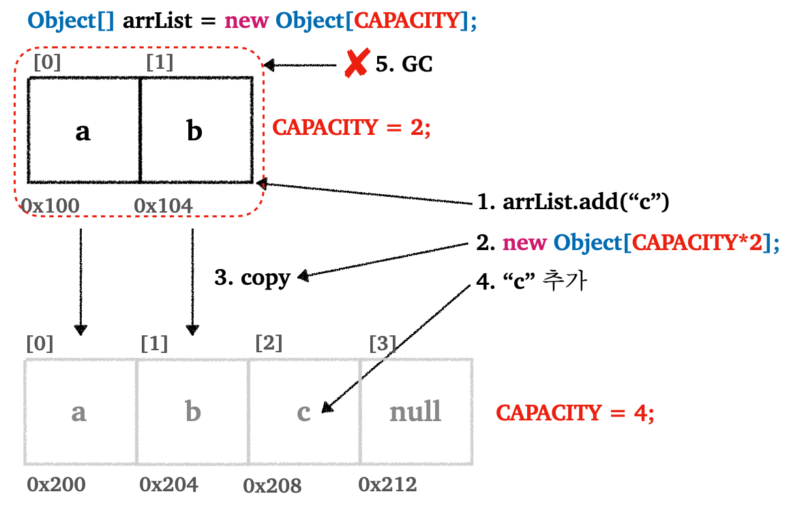
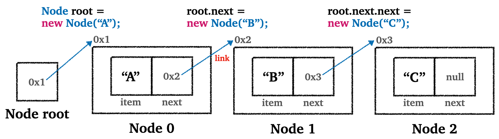
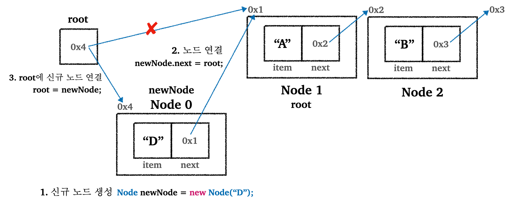
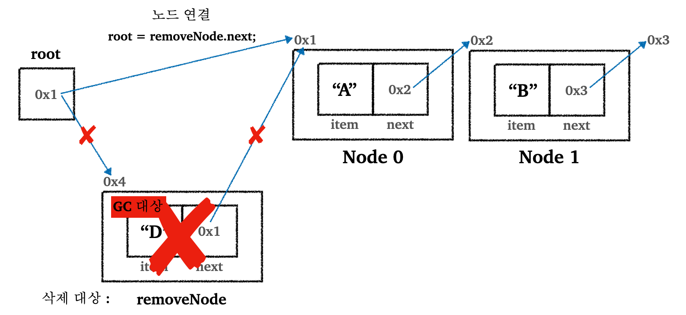
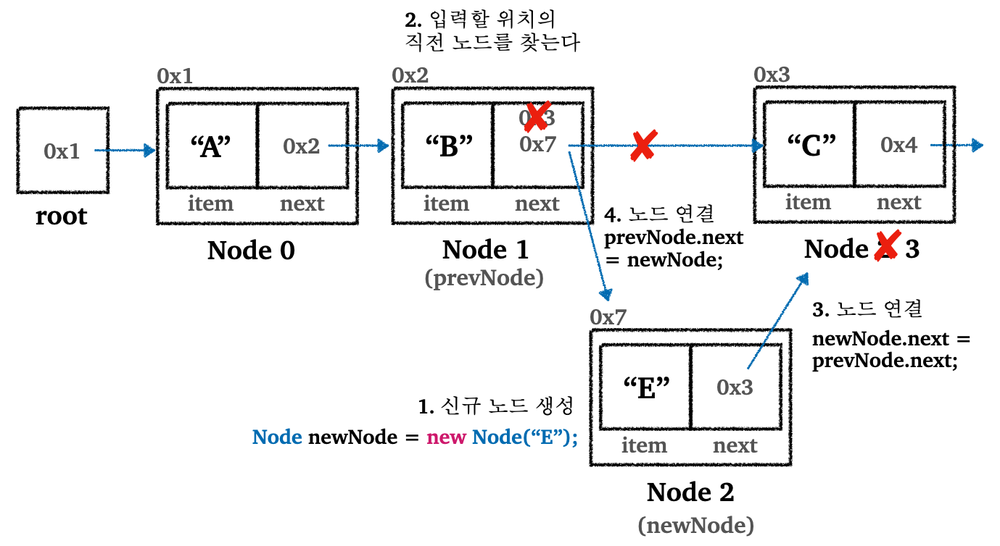
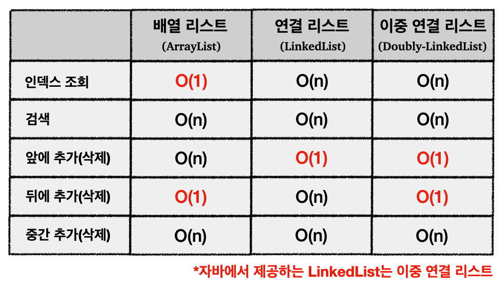

> 리스트(`ArrayList`, `LinkedList`) 설명 및 직접 구현. 성능 비교. 자바 `Collection` 프레임워크 소개.
>
> 기존 `Collection`에 관한 포스트 [보러가기](https://github.com/seungki1011/Data-Engineering/tree/main/java/(018)%20Collection#1-collection-framework)

---

## Index

* `ArrayList`
  * `ArrayList` 설명
  * `ArrayList` 구현
  * `ArrayList`의 한계
* `LinkedList`
  * `LinkedList` 설명
    * 앞에 데이터(노드) 추가
    * 앞에 데이터(노드) 삭제
    * 특정 위치에 데이터(노드) 추가
  * `LinkedList` 구현
* `ArrayList` vs `LinkedList`
* `Collection` 프레임워크 소개
* `List` 인터페이스
  * `List` 설명
  * 추가적인 성능비교
    * `MyArrayList` vs `ArrayList`
    * `ArrayList` vs `LinkedList`

  * `List` 인터페이스 사용해보기


---

## 1) `ArrayList`

### 1.1 `ArrayList` 설명

기존 배열의 단점은 크기를 정적으로 설정해야하고, 중간에 늘릴 수 없다는 점이었다.

* 동적으로 크기 변경 불가
* 그렇다고 처음부터 공간을 크게 할당하면 메모리 낭비
* 데이터 추가에 대한 불편함(공간 확보를 위한 데이터 이동이 필요)

<br>

배열의 불편함을 해결하기 위한 자료구조인 리스트(List)에 대해서 알아보자.

리스트의 특징은 다음과 같다.

* 순서가 있고, 데이터 중복 허용
* 크기를 동적으로 변경가능

<br>

리스트의 특징을 구현하는 자료구조의 종류는 많다. 자바에서는 대표적으로 `ArrayList`와 `LinkedList`으로 리스트 자료구조를 제공한다. 포스트 이후에서 이런 리스트들을 추상화 해서 `List` 인터페이스로 제공하는 컬렉션 프레임워크에 대해서 알아볼것이다.

일단 지금은 `ArrayList` 부터 알아보자. 

<br>

<p align="center">    </p>

`ArrayList`의 동작은 다음과 같다.

* 먼저 배열의 크기인 `CAPACITY`가 존재한다. `CAPACITY`를 넘어서 배열에 데이터를 저장할 수 없다.
* 배열이 꽉 찬 상태에서(`size`와 `CAPACITY`가 동일하면) 데이터를 추가하면 `grow()`라는 메서드를 통해서 새로운 배열을 생성한다
  * 배열을 새로 생성할 때 기존 `CAPACITY`의 2배 크기로 생성한다(실제 구현은 보통 `50%` 크게 설정한다)
  * 기존 배열의 데이터를 새로운 배열로 복사한다
    * `.copyOf(기존배열, 새로운 길이)` 사용 가능
  * 참조값을 새로운 배열로 변경한다
* 기존 배열은 GC의 대상이 된다

<br>

---

### 1.2 `ArrayList` 구현

`ArrayList`를 구현해보자.

<br>

`MyArrayList`

```java
public class MyArrayList<E> {

    private static final int DEFAULT_CAPACITY = 5;

    private Object[] elementData;
    private int size = 0;

    public MyArrayList() {
        elementData = new Object[DEFAULT_CAPACITY];
    }

    public MyArrayList(int initialCapacity) {
        elementData = new Object[initialCapacity];
    }

    public int size() {
        return size;
    }
    
    // 배열 끝에 데이터를 추가할 때 size가 배열 용량과 같다면 grow()를 통해서 늘린다
    public void add(E e) {
        if (size == elementData.length) {
            grow();
        }
        elementData[size] = e;
        size++;
    }

    public void add(int index, E e) {
        if (size == elementData.length) {
            grow();
        }
        shiftRightFrom(index);
        elementData[index] = e;
        size++;
    }

    //요소의 마지막부터 index까지 오른쪽으로 밀기
    private void shiftRightFrom(int index) {
        for (int i = size; i > index; i--) {
            elementData[i] = elementData[i - 1];
        }
    }

    @SuppressWarnings("unchecked")
    public E get(int index) {
        return (E) elementData[index];
    }

    public E set(int index, E element) {
        E oldValue = get(index);
        elementData[index] = element;
        return oldValue;
    }

    public E remove(int index) {
        E oldValue = get(index);
        shiftLeftFrom(index);

        size--;
        elementData[size] = null;
        return oldValue;
    }

    //요소의 index부터 마지막까지 왼쪽으로 밀기
    private void shiftLeftFrom(int index) {
        for (int i = index; i < size - 1; i++) {
            elementData[i] = elementData[i + 1];
        }
    }

    public int indexOf(E o) {
        for (int i = 0; i < size; i++) {
            if (o.equals(elementData[i])) {
                return i;
            }
        }
        return -1;
    }
  
    // 기존 CAPACITY의 두배 크기로 새로운 배열 생성 후, 기존 배열 복사
    private void grow() {
        int oldCapacity = elementData.length;
        int newCapacity = oldCapacity * 2;
        elementData = Arrays.copyOf(elementData, newCapacity);
    }

    @Override
    public String toString() {
        return Arrays.toString(Arrays.copyOf(elementData, size)) + " size=" + size + ", capacity=" + elementData.length;
    }

}
```

* `add(index, value)` : 지정한 인덱스 위치에 데이터를 추가한다
  * 배열 용량이 부족하면 `grow()`로 새롭게 배열을 더 크게 만들어서 사용


* `remove(index)` : 원하는 인덱스의 데이터 삭제
  * 삭제할 위치는 인덱스를 통해 찾을 수 있기 때문에 `O(1)`
  * 삭제후 데이터 이동은 `O(n)` 소요


* `ArrayList`의 Big-O
  * 데이터 추가
    * 마지막에 추가 : `O(1)`
    * 처음, 중간에 추가 : `O(n)`
  * 데이터 삭제
    * 마지막에 삭제 : `O(1)`
    * 처음, 중간에 삭제 : `O(n)`
  * 인덱스 통한 조회 : `O(1)`
  * 데이터로 검색 : `O(n)`

<br>

지금까지의 내용을 정리하자면, `ArrayList`는 내부적으로 배열을 사용하긴하지만 배열과 달리 용량이 부족하면 크기가 동적으로 변한다.

`ArrayList`는 데이터를 중간에 추가하고 삭제하는 것 보다, 데이터를 순서대로 입력(마지막에 데이터 추가)하고, 순서대로 출력하는 경우에 효율적이다.

<br>

---

### 1.3 `ArrayList`의 한계

`ArrayList`의 한계에 대해서 알아보자.

* 사용할 용량을 정확히 알지 못하면 메모리가 낭비될 수 있다
  * 추가로 필요한 공간은 얼마되지 않지만,  `ArrayList` 내부에서 더 큰 배열로 다시 할당하는 연산에 의해 배열 뒷 부분이 사용되지 않고 낭비되는 경우
* 데이터를 앞이나 중간에 추가할 때 데이터를 이동시켜야하기 때문에 비효율적이다
  * 데이터 사이즈가 10만일때 최악의 경우 10만건 모두 밀어야하는 경우가 있을 수 있다

<br>

`ArrayList`를 통해 배열의 크기를 동적으로 조절할 수 있게 되었지만, 아직 기존 배열의 여러가지 문제점을 해결하지 못한다.

이중에서 몇 가지 문제점을 해결할 수 있는 `LinkedList`라는 리스트 자료구조가 존재한다.

<br>

---

## 2) `LinkedList`

### 2.1 `LinkedList` 설명

`LinkedList`에 대해서 알아보고, `ArrayList`와 어떤 차이를 가지는지 알아보자.

<br>

이전의 `ArrayList`의 단점은 어쨋거나 배열 공간을 미리 확보해야 한다는 것이다. 필요 공간에 비해 너무 많은 공간을 확보하는 경우에는 메모리 낭비로 이어진다. 또한 앞이나 중간에 데이터를 추가할 때 항상 데이터를 넣기 위한 공간을 확보하기 위해 기존 데이터를 오른쪽으로 이동시켜야하는 문제도 있다.

여기서 `LinkedList`는 노드(`node`)와 링크(`link`)를 도입해서 이 문제를 해결하려고 한다.

 <br>

`Node`

```java
public class Node {
    // 간단하게 사용하기 위해 private 사용안함
    Object item;
    Node next;

    public Node(Object item) {
        this.item = item;
    }
}
```

<br>

`LinkedList`는 낭비되는 메모리 없이 필요한 만큼만 메모리를 확보해서 사용하기 위해서 노드를 만들고 각 노드를 서로 연결(`link`)해서 사용한다.

다음 그림을 통해 파악하면 더 쉽게 이해가 갈 것이다.

<br>

<p align="center">    </p>

* 노드 클래스는 내부에 저장할 데이터인 `item`과 다음으로 노드로 연결할 노드의 참조인 `next`를 가지고 있다


* 그림에서 확일할 수 있듯이, 각각의 노드들은 다음 순서의 노드를 참조를 통해 연결되어 있다
  * 연결된 참조가 메모리상 연속될 필요 없음


* 데이터를 추가할 때 필요한 만큼의 노드만 만들어서 연결하면 된다(메모리 낭비 방지)
  * 물론 `next` 필드에 연결된 노드의 참조를 보관하기 위한 추가적인 메모리 할당은 존재한다

<br>

---

#### 2.1.1 앞에 데이터(노드) 추가

그러면 노드와 링크 구조를 이용하는 `LinkedList`에서 데이터 추가, 삭제는 어떻게 이루어질까? 그림을 통해 각 상황을 살펴보자.

<br>

`LinkedList`에서 특정 위치에 데이터를 추가 또는 삭제하는 경우를 살펴보자.

위 그림에서 `A → B → C`로 연결된 노드에서 `D`가 들어있는 첫 번째 노드로 추가하는 경우를 살펴보자. 즉 `D → A → B → C`가 되는 경우.

<br>

<p align="center">    </p>

* `D`를 가지고 있는 신규 노드 생성
* 신규 노드를 기존의 첫 번째 노드(`root`)에 연결
  * 신규 노드의 연결 참조값(`next`)를 `root`에 연결


* 기존 `root`을 신규노드(`newNode`)에 연결


* `LinkedList`는 처음 위치에 데이터를 추가하는 경우 새로 생성한 노드의 참조만 변경하기만하면 된다. 데이터를 오른쪽으로 밀거나하는 작업은 필요없다.
* 처음 위치에 데이터를 추가하는 것은 매우 빠르다 : `O(1)` 

<br>

---

#### 2.1.2 앞에 데이터(노드) 삭제

그러면 처음 위치의 데이터를 삭제하는 과정은 어떻게 이루어질까? 그림을 통해 살펴보자.

<br>

<p align="center">    </p>

* 첫 번째 노드를 삭제하는 경우에도, 연결된 참조만 변경하면 된다. 데이터를 밀거나하는 작업은 안해도 된다.
* 노드를 앞에 추가하는 것과 마찬가지로 `O(1)`이 소요된다

<br>

---

#### 2.1.3 특정 위치에 데이터(노드) 추가

이번에는 `A → B → C`인 `링크드 리스트`의 중간에 `E`를 추가해서 `A → B → E → C`로 만들어보자. 2번 인덱스에 `E`를 추가하는 경우로 보면 된다.

<br>

<p align="center">    </p>

* 이전과 마찬가지로 데이터를 이동시킬 필요없이 참조만 변경하면 된다. 그러나 바로 앞에 데이터를 추가한 케이스와 다르게, 성능은 `O(n)`이다.
* `O(n)`인 이유는 `LinkedList`의 경우, 인덱스를 사용해서 노드를 추가할 위치를 찾는데 `O(n)`이 소요되기 때문이다.
  * 노드를 추가하는 작업 자체(참조를 변경하는 작업)는 `O(1)`이 소요된다
  * 결론적으로 총 연산은 `O(n)`이다

<br>

`LinkedList`의 중간 위치의 특정 인덱스에서 삭제하는 경우도 추가와 마찬가지로 `O(n)`이 소요된다. 여기서도 인덱스를 통해 삭제 항목을 찾는데 `O(n)`이 소요되기 때문이다.

<br>

---

### 2.2 `LinkedList` 구현

`LinkedList`를 구현해보자.

<br>

`MyLinkedList`

```java
public class MyLinkedList<E> {
  
    private Node<E> first;
    private int size = 0;
    
    // 마지막에 노드 추가
    // 만약 노드가 없으면 새로 만들고 first에 연결
    // 성능 : O(n)
    public void add(E e) {
        Node<E> newNode = new Node<>(e);
        if (first == null) {
            first = newNode;
        } else {
            Node<E> lastNode = getLastNode();
            lastNode.next = newNode;
        }
        size++;
    }
    
    // 마지막 노드 반환
    private Node<E> getLastNode() {
        Node<E> x = first;
        while (x.next != null) {
            x = x.next;
        }
        return x;
    }
    
    // 특정 위치에 데이터를 노드와 함께 추가한다
    // 성능 : O(n)
    public void add(int index, E e) {
        Node<E> newNode = new Node<>(e);
        if (index == 0) {
            newNode.next = first;
            first = newNode;
        } else {
            Node<E> prev = getNode(index - 1);
            newNode.next = prev.next;
            prev.next = newNode;
        }
        size++;
    }
    
    // 특정 위치에 있는 데이터 찾아서 변경, 기존 값 반환
    // 성능 : O(n)
    public E set(int index, E element) {
        Node<E> x = getNode(index);
        E oldValue = x.item;
        x.item = element;
        return oldValue;
    }
    
    // 특정 위치에 데이터를 노드와 함께 제거한다
    public E remove(int index) {
        Node<E> removeNode = getNode(index);
        E removedItem = removeNode.item;
        if (index == 0) {
            first = removeNode.next;
        } else {
            Node<E> prev = getNode(index - 1);
            prev.next = removeNode.next;
        }
        removeNode.item = null;
        removeNode.next = null;
        size--;
        return removedItem;
    }
    
    // 특정 위치에 있는 데이터 반환
    // 성능 : O(n)
    public E get(int index) {
        Node<E> node = getNode(index);
        return node.item;
    }

    private Node<E> getNode(int index) {
        Node<E> x = first;
        for (int i = 0; i < index; i++) {
            x = x.next;
        }
        return x;
    }
    
    // 데이터를 검색하고, 검색된 위치(인덱스) 반환
    // 성능 : O(n)
    public int indexOf(E o) {
        int index = 0;
        for (Node<E> x = first; x != null; x = x.next) {
            if (o.equals(x.item))
                return index;
            index++;
        }
        return -1;
    }

    public int size() {
        return size;
    }

    @Override
    public String toString() {
        return "MyLinkedListV1{" +
                "first=" + first +
                ", size=" + size +
                '}';
    }
    
    // 노드는 어차피 노드를 이용하는 클래스만 사용하기 때문에, 중첩 클래스로 정의
    private static class Node<E> {
        E item;
        Node<E> next;

        public Node(E item) {
            this.item = item;
        }

        @Override
        public String toString() {
            StringBuilder sb = new StringBuilder();
            Node<E> temp = this;
            sb.append("[");
            while (temp != null) {
                sb.append(temp.item);
                if (temp.next != null) {
                    sb.append("->");
                }
                temp = temp.next;
            }
            sb.append("]");
            return sb.toString();
        }
    }
}
```

* `LinkedList`는 기존 배열과 다르게 인덱스가 아니라 노드들의 참조를 이용해서 순회한다. 그렇기 때문에, 인덱스로 원하는 위치의 데이터를 찾기 위해서는 인덱스의 숫자만큼 노드를 반복해서 찾아야한다
  * 특정 위치의 노드에 대한 조회 성능 : `O(n)`

<br>

---

## 3) `ArrayList` vs `LinkedList`

지금까지 `ArrayList`와 `LinkedList`에 대해서 알아보았다. 이제부터 서로 성능을 비교하고, 어떤 상황에 어떤 자료구조를 이용해야하는지 알아보자.

<br>

<p align="center">    </p>

<p align = 'center'>성능 비교</p>

* `ArrayList`(배열 리스트)
  * 인덱스를 통한 추가/삭제 위치 조회는 `O(1)`로 매우 빠르다
  * 추가/삭제 이후 데이터를 한칸씩 오른쪽으로 밀어야하기 때문에 `O(n)`


* `LinkedList`(연결 리스트)
  * 중간에서 추가/삭제는 마찬가지로 `O(n)`
  * 자바는 `LinkedList`를 이중 연결 리스트로 구현해서 제공하기 때문에, 앞이나 뒤에 데이터를 추가/삭제하는 것은 `O(1)`이 소요된다

<br>

데이터 조회 또는 중간이나 뒤에 데이터 추가, 등의 작업을 포함해서 많은 경우 `ArrayList`를 이용하면 된다. 그러나 앞의 데이터를 추가/삭제하는 연산이 많다면 `LinkedList`를 사용하는 것을 고려해볼 수 있다.

<br>

> 참고로 이중 연결 리스트는 `Node`에 `next` 말고도 `prev`를 사용해서 이전 노드의 참조도 가지고 있는 형태로 구현한다. 이를 통해 양방향 순회(traverse)가 가능하다.

<br>

---

## 4) `Collection` 프레임워크 소개

기존 `Collection`에 관한 포스트 [보러가기](https://github.com/seungki1011/Data-Engineering/tree/main/java/(018)%20Collection#1-collection-framework)

컬렉션 프레임워크는 다음과 같다.

* `Collection`(다수의 객체)을 다루기 위한 프레임워크
* 자료구조를 표현하고 사용할 수 있는 클래스와 인터페이스들 제공

<br>

<p align="center">    </p>

<p align="center">    </p>

<p align = 'center'>https://www.geeksforgeeks.org/how-to-learn-java-collections-a-complete-guide/</p>

<br>

---

## 5) `List` 인터페이스

### 5.1 `List` 설명

컬렉션 프레임워크는 `List` 인터페이스를 제공한다.

인터페이스를 제공하는 이유는 기본적으로 추상화를 통해 다형성의 다양한 이득을 얻을수 있기 때문이다.

이전 우리가 구현한  `MyArrayList`와 `MyLinkedList`에서 볼수 있둣이, 두 클래스는 서로 공통으로 사용하는 메서드들이 많다. 자바는 `List`라는 인터페이스를 제공해서, `ArrayList`와 `LinkedList`가 `List`를 구현하도록 하고 있다.

우리는 다형성을 통해서 클라이언트 코드가 인터페이스를 의존하도록 구현하고, 나중에 사용하는 구현체(`ArrayList`, `LinkedList`)가 바뀌어도 적은 코드 변경으로 해결할 수 있다.

<br>

---

### 5.2 추가적인 성능 비교

#### 5.2.1 `MyArrayList` vs `ArrayList`

우리가 직접 구현한 자료구조와 자바에서 제공하는 자료구조를 이용해서 서로 성능을 비교하면 어떤 것이 더 빠를까?

실제로 성능을 확인해보면, 데이터를 추가하는 경우 직접 구현한 `MyArrayList` 보다 `ArrayList`가 빠르다. 그 이유는 자바의 `ArrayList`는 배열을 복사할 때 메모리 고속 복사를 이용하기 때문이다.

* 배열의 고속 복사에 관한 내용은 `System.arraycopy()`와 JNI에 대한 키워드로 검색

<br>

결론적으로 자바는 내부에서 고속 복사를 통해 성능을 최적화하기 때문에, 우리가 `copyOf()`를 사용해서 직접 구현한 자료구조보다 빠르다.

물론 빨라졌다고 해도 `O(1)`의 성능은 아니기 때문에, 만약 앞에 데이터를 추가하는 작업이 굉장히 많다면 `ArrayList` 대신 `LinkedList`의 사용을 고려하는 것을 추천한다. 

<br>

---

#### 5.2.1 `ArrayList` vs `LinkedList`

이론적으로 봤을때 `LinkedList`의 데이터 중간 삽입이 더 빠르다고 생각할 수 있지만, 실제로 시간을 측정하면 `ArrayList`를 사용하는 것이 빠르다.

그 이유는 다음과 같다.

* 실제 성능은 요소의 순차적 접근 속도, 메모리 할당 및 해제의 비용, CPU의 캐시 활용 등 다양한 요소에 영향을 받는다
* `ArrayList`는 메모리를 한 칸씩 이동시키는 것이 아니라 메모리 고속 복사를 이용한다
* `ArrayList`는 `LinkedList`와 배열의 각 요소들이 메모리상 연속적으로 위치하고 있다
  * 캐시 효율과 메모리 접근 속도가 빠르다
* 물론 `ArrayList`는 용량이 넘어가면 배열을 더 크게 다시 만들고 복사하는 과정이 추가되지만, 전체 성능에는 큰 영향을 주지는 않는다

<br>

---

### 5.3 `List` 인터페이스 사용해보기

`List` 인터페이스를 통해 `ArrayList`와 `LinkedList`를 사용해보자.

<br>

공식 문서 참고 : [https://docs.oracle.com/javase/8/docs/api/java/util/List.html](https://docs.oracle.com/javase/8/docs/api/java/util/List.html)

<br>

`ListMain`

```java
public class ListMain {
    public static void main(String[] args) {

        // ArrayList 생성
        List<String> fruits = new ArrayList<>();

        // 요소 추가
        fruits.add("Banana");
        fruits.add("Apple");
        fruits.add("Grape");
        fruits.add("Mango");

        // 특정 인덱스에 요소 추가
        fruits.add(2, "Blueberry");

        // 출력
        printList(fruits);

        // 요소 반환
        System.out.println("fruits.get(3) = " + fruits.get(3));

        // ArrayList의 크기
        System.out.println("fruits.size() = " + fruits.size());

        // 요소 제거
        fruits.remove("Apple");
        fruits.remove("Mango");
        printList(fruits);

        // 특정 요소 포함 여부
        String searchFruit = "Grape";
        if(fruits.contains(searchFruit)) {
            System.out.println("The list contains " + searchFruit);
        } else {
            System.out.println("Could not find " + searchFruit);
        }
    }

    private static void printList(List arrayList) {
        System.out.println("-----printList-----");
        for (Object object : arrayList) {
            System.out.println(object);
        }
        System.out.println("-------------------");
    }

}
```

```
-----printList-----
Banana
Apple
Blueberry
Grape
Mango
-------------------
fruits.get(3) = Grape
fruits.size() = 5
-----printList-----
Banana
Blueberry
Grape
-------------------
The list contains Grape
```

* `LinkedList`의 사용법도 비슷하다
