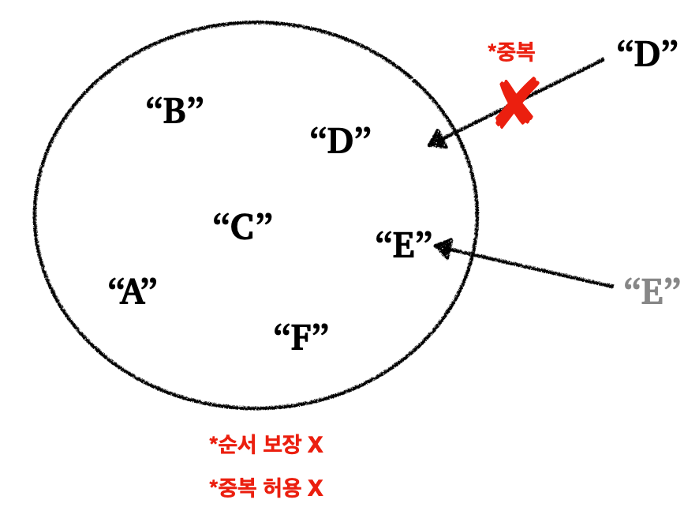
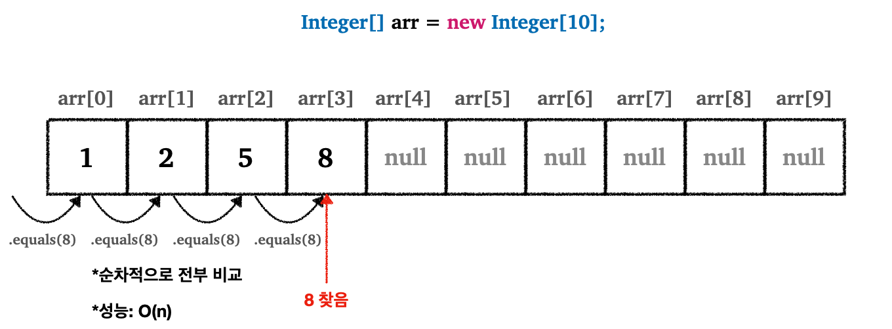
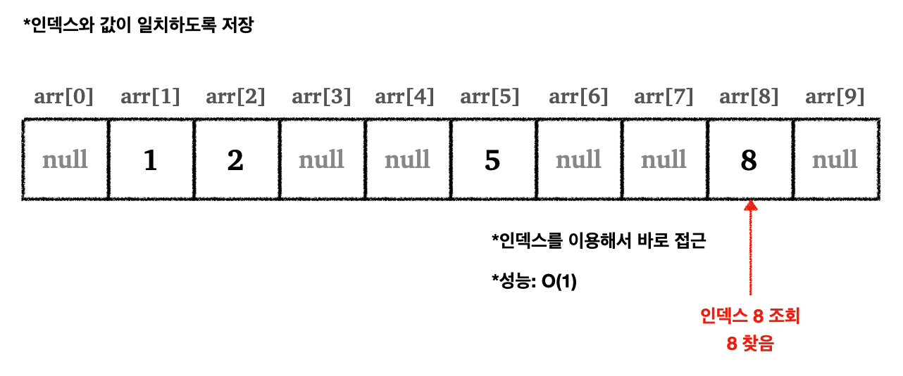
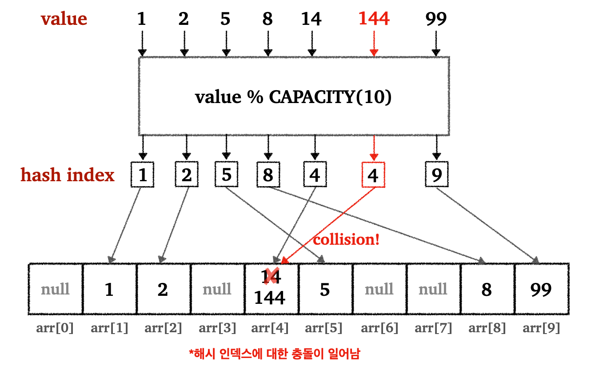
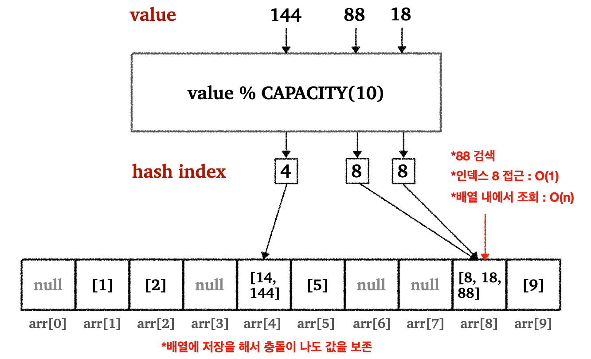
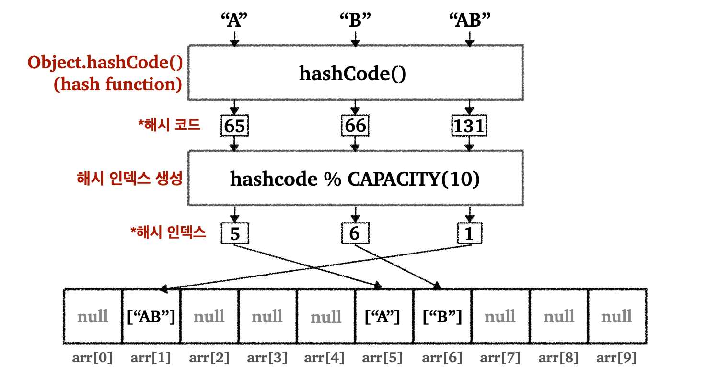
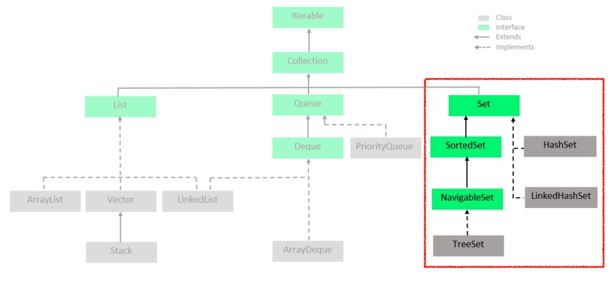

## Index

* [`Set`](https://github.com/seungki1011/Data-Engineering/tree/main/algorithm%20and%20data%20structure/(001)DataStructure/(003)Set#1-set)
  * [`Set` 설명](https://github.com/seungki1011/Data-Engineering/tree/main/algorithm%20and%20data%20structure/(001)DataStructure/(003)Set#11-set-%EC%84%A4%EB%AA%85)
  * [`Set` 간단 구현](https://github.com/seungki1011/Data-Engineering/tree/main/algorithm%20and%20data%20structure/(001)DataStructure/(003)Set#12-set-%EA%B0%84%EB%8B%A8-%EA%B5%AC%ED%98%84)
* [Hash Algorithm](https://github.com/seungki1011/Data-Engineering/tree/main/algorithm%20and%20data%20structure/(001)DataStructure/(003)Set#2-hash-algorithm)
  * [해시 알고리즘 원리](https://github.com/seungki1011/Data-Engineering/tree/main/algorithm%20and%20data%20structure/(001)DataStructure/(003)Set#21-%ED%95%B4%EC%8B%9C-%EC%95%8C%EA%B3%A0%EB%A6%AC%EC%A6%98-%EC%9B%90%EB%A6%AC)
  * [해시 충돌(Hash Collision)](https://github.com/seungki1011/Data-Engineering/tree/main/algorithm%20and%20data%20structure/(001)DataStructure/(003)Set#22-%ED%95%B4%EC%8B%9C-%EC%B6%A9%EB%8F%8Chash-collision)
  * [해시 인덱스 성능](https://github.com/seungki1011/Data-Engineering/tree/main/algorithm%20and%20data%20structure/(001)DataStructure/(003)Set#23-%ED%95%B4%EC%8B%9C-%EC%9D%B8%EB%8D%B1%EC%8A%A4-%EC%84%B1%EB%8A%A5)
* [`hashCode()`](https://github.com/seungki1011/Data-Engineering/tree/main/algorithm%20and%20data%20structure/(001)DataStructure/(003)Set#3-hashcode)
  * [문자열 해시 코드](https://github.com/seungki1011/Data-Engineering/tree/main/algorithm%20and%20data%20structure/(001)DataStructure/(003)Set#31-%EB%AC%B8%EC%9E%90%EC%97%B4-%ED%95%B4%EC%8B%9C-%EC%BD%94%EB%93%9C)
  * [자바가 제공하는 `hashCode()`](https://github.com/seungki1011/Data-Engineering/tree/main/algorithm%20and%20data%20structure/(001)DataStructure/(003)Set#32-%EC%9E%90%EB%B0%94%EA%B0%80-%EC%A0%9C%EA%B3%B5%ED%95%98%EB%8A%94-hashcode)

* [`HashSet` 구현](https://github.com/seungki1011/Data-Engineering/tree/main/algorithm%20and%20data%20structure/(001)DataStructure/(003)Set#4-hashset-%EA%B5%AC%ED%98%84)
* [`Set` 인터페이스](https://github.com/seungki1011/Data-Engineering/tree/main/algorithm%20and%20data%20structure/(001)DataStructure/(003)Set#5-set-%EC%9D%B8%ED%84%B0%ED%8E%98%EC%9D%B4%EC%8A%A4)
  * [`Set` 인터페이스 설명](https://github.com/seungki1011/Data-Engineering/tree/main/algorithm%20and%20data%20structure/(001)DataStructure/(003)Set#51-set-%EC%9D%B8%ED%84%B0%ED%8E%98%EC%9D%B4%EC%8A%A4-%EC%84%A4%EB%AA%85)
  * [`Set` 인터페이스 사용해보기](https://github.com/seungki1011/Data-Engineering/tree/main/algorithm%20and%20data%20structure/(001)DataStructure/(003)Set#52-set-%EC%9D%B8%ED%84%B0%ED%8E%98%EC%9D%B4%EC%8A%A4-%EC%82%AC%EC%9A%A9%ED%95%B4%EB%B3%B4%EA%B8%B0)

---

## 1) `Set`

### 1.1 `Set` 설명

세트(`Set`) 자료구조에 대해서 알아보자.

<br>

<p align="center">    </p>

`Set`의 특징은 다음과 같다.

* 유일한(unique)한 요소들의 컬렉션(집합)
  * `Set`은 순서를 보장하지 않고, 중복을 허용하지 않는다


* `Set`은 보통 요소의 유무를 빠르게 확인할 수 있도록 최적화되어 있다


* `Set`은 중복 데이터를 허용하지 않고, 요소의 유무가 중요한 경우에 사용한다
  * 예) 고유한 회원 ID의 집합

<br>

---

### 1.2 `Set` 간단 구현

`Set`의 특징에 기반해서 `Set`을 간단하게 구현해보자. `Set`의 특징과 필요한 메서드를 다시 한번 상기해보자.

* 중복 허용 X
* 순서 보장 X
* `add(value)` : 셋에 데이터 추가. 중복 데이터를 확인해서, 중복이면 저장하지 않는다
* `contains(value)` : 셋에 값이 있는지 확인한다
* `remove(value)` : 셋에 있는 값을 제거한다

<br>

`NoHashMySet`

```java
public class NoHashMySet {

    private int[] elementData = new int[10];
    private int size = 0;

    // O(n)
    public boolean add(int value) {
        if (contains(value)) {
            return false;
        }
        elementData[size] = value;
        size++;
        return true;
    }

    // O(n)
    public boolean contains(int value) {
        for (int data : elementData) {
            if (data == value) {
                return true;
            }
        }
        return false;
    }

    public int getSize() {
        return size;
    }

    @Override
    public String toString() {
        return "MyHashSetV0{" +
                "elementData=" + Arrays.toString(Arrays.copyOf(elementData, size)) +
                ", size=" + size +
                '}';
    }

}
```

* 용량이 10인 배열로 구현

* `remove(value)`는 구현안함. 그러나 `add()` 처럼 값을 조회하고 작업을 하는 것은 똑같다 - `O(n)`

* `add(value)` : 셋에 중복된 값이 있는지 `contains(value)`로 확인하고, 중복된 값이 없다면 값을 저장후 `true` 반환

<br>

우리가 만든 `Set`을 사용해보자.

<br>

`SetMain1`

```java
public class SetMain1 {
    public static void main(String[] args) {

        // 우리가 구현한 세트 사용
        NoHashMySet set = new NoHashMySet();

        // 세트에 값 추가
        set.add(1);
        set.add(2);
        set.add(3);
        set.add(4);
        // 중복된 값 추가시 false 반환
        System.out.println("set.add(4) = " + set.add(4));
        System.out.println(set);

        // 세트 내부에 값이 있는지 확인
        System.out.println("set.contains(2) = " + set.contains(2));
        
    }
}
```

```
set.add(4) = false
MyHashSetV0{elementData=[1, 2, 3, 4], size=4}
set.contains(2) = true
```

<br>

우리가 구현한 `Set`에는 문제가 있다는 것을 발견할 수 있다.

`Set`을 사용하는 이유는 요소의 포함 여부를 빠르게 확인하기 위해서지만, 우리가 구현한 `Set`은 데이터 추가, 검색 모두 `O(n)`으로 성능이 좋지 않다.

그 이유는 중복 데이터 여부를 확인하기 위해서 셋 전체의 데이터를 전부 확인해야하기 때문이다. 이는 결국 데이터 추가/조회의 성능을 `O(n)`으로 만든다.

이 문제를 해결하기 위해서는 해시(hash) 알고리즘을 사용한다.

<br>

---

## 2) Hash Algorithm

### 2.1 해시 알고리즘 원리

해시(hash) 알고리즘을 사용하면, 바로 이전의 `Set`의 데이터 중복 여부를 확인하기 위한 검색 성능을 `O(1)`으로 올릴수 있다.

그러면 해시 알고리즘은 정확히 무엇일까? 해시 알고리즘을 설명하기 위해서 먼저 배열에 특정 값의 포함 여부를 확인하는 경우를 살펴보자.

<br>

<p align="center">    </p>

* `8`을 찾는다고 가정하자
* `8`을 찾기 위해서 `arr[0]` 부터 시작해서 순차적으로 하나씩 `8`과 같을때 까지 계속 확인한다
  * 데이터가 많으면 많을수록 성능은 더욱 떨어진다
* 성능은 결국 `O(n)`에 해당한다

<br>

이번에는 값 자체를 배열의 인덱스에 맞춰서 넣으면 어떻게 될까? 

예를 들어 `arr[1] = 1`, `arr[5] = 5`, `arr[8] = 8` 처럼, 처음부터 `index = value`가 되도록 값을 배열에 저장하는 것이다.

<br>

<p align="center">    </p>

* 이제 값을 찾기 위해서는 그냥 바로 인덱스를 이용해서 찾으면 된다
  * 예) `5`를 찾는다면 바로 `arr[5]` 사용


* 배열은 인덱스를 이용한 조회는 `O(1)`이다
* 이제 성능은 기존 `O(n)`에서 `O(1)`로 빨라졌다!

<br>

---

### 2.2 해시 충돌(Hash Collision)

여기서 한가지 큰 문제점이 있다. 만약 저장할 값이 `10,000`이면 어떻게 될까? 제대로 사용하기 위해서는 결국에 용량이 `10,000`이 넘는 배열을 생성해서 사용해야한다. 만약 값이 `100,000`이면 더욱 더 큰 배열을 생성해야 한다.

쉽게 말해서, 입력할 값의 범위가 넓다면 메모리가 낭비가 되고 할당하는데 시간도 오래걸린다.

이를 해결하기 위해서 해시 인덱스(hash index)를 도입한다. 해시 인덱스를 간단히 설명하자면 배열의 인덱스로 사용할 수 있도록 저장할 값을 특정 연산을 통해 인덱스로 부여하는 것을 말한다. 글만으로 이해하기 힘들기 때문에 다음 그림을 통해서 알아보자.

<br>

<p align="center">    </p>

* 해시 인덱스를 구하는 연산은 `value % CAPACITY`
* 저장할 값을 배열의 용량의 크기로 나눠서 나온 나머지를 해시 인덱스로 사용
* 해시 인덱스 생성 : `O(1)`
* 인덱스(해시 인덱스)를 이용한 값 저장/조회 : `O(1)`
* 총 연산 : `O(1)`

<br>

이렇게 해서 값이 범위가 커도 배열의 용령을 크게 늘릴 필요 없이 `O(1)`의 성능으로 조회할 수 있다. 그러나 여기에도 치명적인 문제가 있다. 만약 새로운 값에 대한 나머지 연산을 할때 이미 값이 저장되어 있는 인덱스와 충돌이 일어나면 어떻게 될까?

쉽게 이야기 해서, 새로운 값을 저장할 때 이미 사용한 해시 인덱스와 충돌하는 문제가 일어날수 있다.

* 예)
  *  `14` 저장 → 해시 인덱스 : `4`
  * `144` 저장 → 해시 인덱스 : `4` → 기존 `14`와 충돌! → `14`위에 `144`가 덮어씀

<br>

이를 해결하기 위해서 값을 저장할 때 배열을 사용한다. 그림을 통해 살펴보자.

<br>

<p align="center">    </p>

* 해시 충돌이 일어나면 같은 해시 인덱스 내에 같이 저장한다
  * 같이 저장하기 위해서 값을 배열로 저장한다(배열 안의 배열)


* 만약 기존 `8`이 존재하는 상황에서 `18`, `88`을 새로 저장할때 그냥 `[8]`에 추가로 저장해서 `[8, 18, 88]`로 저장한다


* 물론 최악의 경우 `인덱스로 접근` → `해당 해시 인덱스의 배열내에서 값으로 검색`의 과정을 거쳐서 `O(n)`이 소요될 수 있다

<br>

> 최악의 경우 값의 검색에 `O(n)`이 소요되는것이 아니냐는 의문을 가질수 있지만, 이것은 결국 해시 충돌이 일어났을때의 이야기이다. 만약 해시 충돌이 일어나지 않으면 대부분 `O(1)`의 성능을 제공한다.
>
> 뒤에서 더 자세히 다루겠지만, 해시 함수를 해시 충돌이 자주 일어나지 않도록 어느 정도 트레이드 오프를 고려해서 설계를 한다.

<br>

---

### 2.3 해시 인덱스 성능

해시 인덱스를 사용하는 경우 성능은 다음과 같다.

* 데이터 저장
  * 평균 : `O(1)`
  * 최악 : `O(n)`


* 데이터 조회
  * 평균 : `O(1)`
  * 최악 : `O(n)`

<br>

해시 충돌이 일어나는 최악의 상황은 자주 발생하지 않는다. 그래서 일반적으로는 `O(1)`의 성능을 보여준다고 생각하면 편하다.

<br>

---

## 3) `hashCode()`

### 3.1 문자열 해시 코드

지금까지 다룬 해시 알고리즘은 정수(`Integer`)인 값을 통해 해시 인덱스를 구해서 배열의 인덱스로 사용했다. 만약 값이 문자열(`String`)이면 어떻게해야 할까?

`"A"`, `"AB"`와 같은 문자열은 배열의 인덱스로 사용할 수 없다. 지금부터 문자 데이터 기반으로 숫자 해시 인덱스를 구하는 과정을 다음 그림으로 살펴보자.

<br>

<p align="center">    </p>

* 문자열은 아스키 코드(ASCII)에 의해 본인만의 유일한 숫자로 표현할 수 있다


* **해시 함수(Hash Function)**
  * 임의의 길이의 데이터를 입력으로 받아서 고정된 길이의 해시값(해시 코드)을 출력하는 함수이다
  * 같은 데이터를 입력하면 항상 같은 해시 코드가 출력된다
  * 다른 데이터를 입력해도 같은 해시코드가 출력될 수 있다. 이것이 이전에 다룬 해시 충돌(hash collision)이다.


* **해시 코드(Hash Code)**
  * 데이터를 대표하는 값
  * 해시 함수를 통해서 만들어진다


* **해시 인덱스(Hash Index)**
  * 해시 인덱스는 데이터의 저장 위치를 결정한다
  * 해시 코드를 이용해서 만든다
  * 보통 해시 코드의 결과에 배열의 용량 크기를 나누어서 구한다

<br>

---

### 3.2 자바가 제공하는 `hashCode()`

그러면 문자열이 아니라 다른 참조형의 객체에 대한 해시 코드는 어떻게 구할까?

자바는 해시 코드를 만들수 있는 `hashCode()` 메서드를 제공한다. 자바는 `Object`에 있는 `hashCode()` 메서드를 통해서 모든 객체가 자신만의 해시 코드를 표현할 수 있도록한다. 

<br>

`hashCode()`를 직접 코드로 사용해보자. 그리고 `equals()`, `hashCode()`를 오버라이딩한 클래스와 그렇지 않은 클래스의 차이에 대해서 알아보자.

<br>

`Member` 클래스는 `equals()`와 `hashCode()`를 오버라이딩하고 있다.

```Member```

```java
public class Member {

    private String id;

    public Member(String id) {
        this.id = id;
    }

    public String getId() {
        return id;
    }

    @Override
    public boolean equals(Object o) {
        if (this == o) return true;
        if (o == null || getClass() != o.getClass()) return false;
        Member member = (Member) o;
        return Objects.equals(id, member.id);
    }

    @Override
    public int hashCode() {
        return Objects.hash(id);
    }

    @Override
    public String toString() {
        return "Member{" +
                "id='" + id + '\'' +
                '}';
    }
}
```

* IDE를 통해서 `equals()`, `hashCode()` 생성
* 멤버의 `id`를 기준으로 생성
* `equals()` : `id`를 기준으로 동등한지 확인
* `hashCode()` : `id`를 기준으로 동일한 해시 코드가 생성되도록 한다

<br>

한번 사용해보자.

<br>

`HashCodeMain1`

```java
public class HashCodeMain1 {
    public static void main(String[] args) {

        // Object의 기본 hashCode는 객체의 참조값을 기반으로 생성
        Object obj1 = new Object();
        Object obj2 = new Object();
        System.out.println("obj1.hashCode() = " + obj1.hashCode());
        System.out.println("obj2.hashCode() = " + obj2.hashCode());

        // 각 클래스마다 hashCode를 이미 오버라이딩 해두었다.
        Integer i = 127;
        String strA = "A";
        String strAB = "AB";
        System.out.println("10.hashCode = " + i.hashCode());
        System.out.println("'A'.hashCode = " + strA.hashCode());
        System.out.println("'AB'.hashCode = " + strAB.hashCode());

        // hashCode는 마이너스 값이 들어올 수 있다.
        System.out.println("-1.hashCode = " + Integer.valueOf(-1).hashCode());

        // 둘은 인스턴스는 다르지만, equals는 같다.
        Member member1 = new Member("idA");
        Member member2 = new Member("idA");
        
        // id를 기준으로 equals(), hashCode()를 오버라이딩 했음
        System.out.println("(member1 == member2) = " + (member1 == member2));
        System.out.println("member1 equals member2 = " + member1.equals(member2));
        System.out.println("member1.hashCode() = " + member1.hashCode());
        System.out.println("member2.hashCode() = " + member2.hashCode());
    }
}
```

```
obj1.hashCode() = 1933863327
obj2.hashCode() = 1984697014

10.hashCode = 127
'A'.hashCode = 65
'AB'.hashCode = 2081
-1.hashCode = -1

(member1 == member2) = false
member1 equals member2 = true
member1.hashCode() = 104101
member2.hashCode() = 104101
```


* `id`를 기준으로 `equals()`와 `hashCode()`를 오버라이딩 했기 때문에 정상적으로 사용 가능하다
  * `equals()`를 `id` 기준으로 오버라이딩 했기 때문에, 추후에 중복 여부를 제대로 체크가 가능한 것이다


* 만약 오버라이딩하지 않으면 `hashCode()`는 기본적으로 객체의 참조값을 기반으로 해시코드를 생성된다

<br>

정리하면, 해시를 이용하는 자료구조를 제대로 활용하기 위해서는 특정 기준으로 `equals()`와 `hashCode()`를 오버라이딩(재정의)해야 한다.

<br>

---

## 4) `HashSet` 구현

지금까지 해시 알고리즘에 대한 내용을 알아보았다. 그러면 다시 `Set`으로 돌아가서 해시를 적용해서 구현해보자.

<br>

`MyHashSet`

```java
public class MyHashSet<E> {

    static final int DEFAULT_INITIAL_CAPACITY = 16;

    private LinkedList<E>[] buckets;

    private int size = 0;
    private int capacity = DEFAULT_INITIAL_CAPACITY;

    public MyHashSet() {
        initBuckets();
    }

    public MyHashSet(int capacity) {
        this.capacity = capacity;
        initBuckets();
    }

    private void initBuckets() {
        buckets = new LinkedList[capacity];
        for (int i = 0; i < capacity; i++) {
            buckets[i] = new LinkedList<>();
        }
    }

    public boolean add(E value) {
        int hashIndex = hashIndex(value);
        LinkedList<E> bucket = buckets[hashIndex];
        if (bucket.contains(value)) {
            return false;
        }

        bucket.add(value);
        size++;
        return true;
    }

    public boolean contains(E searchValue) {
        int hashIndex = hashIndex(searchValue);
        LinkedList<E> bucket = buckets[hashIndex];
        return bucket.contains(searchValue);
    }

    public boolean remove(E value) {
        int hashIndex = hashIndex(value);
        LinkedList<E> bucket = buckets[hashIndex];
        boolean result = bucket.remove(value);
        if (result) {
            size--;
            return true;
        } else {
            return false;
        }
    }

    private int hashIndex(Object value) {
        //hashCode의 결과로 음수가 나올 수 있다. abs()를 사용해서 절댓값으로 만든다
        return Math.abs(value.hashCode()) % capacity;
    }

    public int getSize() {
        return size;
    }

    @Override
    public String toString() {
        return "MyHashSetV3{" +
                "buckets=" + Arrays.toString(buckets) +
                ", size=" + size +
                ", capacity=" + capacity +
                '}';
    }
}
```

<br>

`Set`에 해시를 적용한 `HashSet`은 평균적으로 데이터 추가/삭제/검색 모두 `O(1)`의 성능을 보여준다. 물론 해시 충돌이 일어나는 최악의 경우 `O(n)`의 성능을 가지지만, 해시 충돌이 일어날 확률은 낮기 때문에 너무 걱정하면서 사용할 필요는 없다.

<br>

---

## 5) `Set` 인터페이스

### 5.1 `Set` 인터페이스 설명

자바의 컬렉션 프레임워크의 `Set` 인터페이스는 `Hashset`, `LinkedHashSet`, `TreeSet`을 제공한다.

<br>

<p align="center">    </p>

<p align='center'>https://www.geeksforgeeks.org/how-to-learn-java-collections-a-complete-guide/</p>

<br>

각 `Set`의 종류에 따른 특징, 성능, 사용 용도를 알아보자.

<br>

1. `HashSet`
   * 해시 자료구조를 사용해서 요소를 저장
     * 사용자 정의 참조형에 사용하기 위해서 `hashCode()`, `equals()` 오버라이딩이 필요
   * 순서 보장 X
   * 중복 허용 X
   * 용도
     * 데이터의 유일성만 중요하고, 순서는 중요하지 않은 경우에 사용
   * 성능
     * 추사/삭제/검색은 평균적으로 `O(1)`의 시간복잡도를 가지나, 해시 충돌이 일어나는 최악의 경우에는 `O(n)`의 성능을 가진다

<br>

2. `LinkedHashSet`
   * 기존 `HashSet`에 `LinkedList`를 이용해서 요소들의 순서를 유지한다
     * `HashSet`에 연결 링크를 추가한 형태로 생각하면 편하다
   * 요소들은 추가된 순서대로 유지된다
   * 양방향 순회가 가능하다
   * 용도
     * 데이터의 유일성과 함께 삽입 순서를 유지해야하는 경우
   * 성능
     * `HashSet()`과 비슷하다

<br>

3. `TreeSet`
   * 트리 구조에 대한 설명은 `Tree` 파트에서 설명할 예정
   * `TreeSet`은 이진 탐색 트리를 개선한 Red-Black Tree를 내부에서 사용한다
   * 요소들은 정렬된 순서로 저장된다. 순서의 기준은 `Comparator`로 변경 가능
   * 용도
     * 데이터들을 정렬된 순서로 유지하면서 집합의 특성을 유지해야 할 때 사용
     * 예) 범위 검색, 정렬된 데이터 필요
     * 정렬된 순서라는 것은 `3, 4, 1, 2`로 입력하면 `1, 2, 3, 4`로 정렬된 순서로 출력된다는 의미
   * 성능
     * 주요 연산은 `O(logn)`의 시간 복잡도를 가진다(`HashSet`보다 느림)

<br>

---

### 5.2 `Set` 인터페이스 사용해보기

`Set` 인터페이스의 `HashSet`을 사용해보자.

<br>

먼저 `Book`이라는 클래스를 만들어서 사용하자.

`Book`

```java
public class Book {

    private String title;
    private String author;
    private String isbn;

    public Book(String title, String author, String isbn) {
        this.title = title;
        this.author = author;
        this.isbn = isbn;
    }

    // ISBN은 고유한 식별자이기 때문에, ISBN 기준으로 equals(), hashCode() 오버라이딩
    @Override
    public boolean equals(Object o) {
        if (this == o) return true;
        if (o == null || getClass() != o.getClass()) return false;
        Book book = (Book) o;
        return Objects.equals(isbn, book.isbn);
    }

    @Override
    public int hashCode() {
        return Objects.hash(isbn);
    }

    @Override
    public String toString() {
        return "Title: "+title+", Author: "+author+", ISBN: "+isbn;
    }
}
```

* `isbn`을 기준으로 `equals()`와 `hashCode()` 오버라이딩

<br>

이제 사용해보자. 

<br>

`SetMain`

```java
public class HashSetMain {
    public static void main(String[] args) {

        Set<Book> bookSet = new HashSet<>();

        // 세트에 객체(book) 추가
        bookSet.add(new Book("1984", "George Orwell", "ISBN978-0451524935"));
        bookSet.add(new Book("Pride and Prejudice", "Jane Austen", "ISBN978-1503290563"));
        bookSet.add(new Book("Fahrenheit 451", "Ray Bradbury", "ISBN978-1451673319"));
        bookSet.add(new Book("To Kill a Mockingbird", "Harper Lee", "ISBN978-0061120084"));

        // 같은 ISBN으로 추가 시도(실패)
        bookSet.add(new Book("XXX", "XXX", "ISBN978-0061120084"));

        // 세트 출력
        printSet(bookSet);

        // 요소 제거 - ISBN을 기준으로 equals()를 오버라이딩 했기 때문에 ISBN이 일치하면 제거
        bookSet.remove(new Book("XXX", "XXX", "ISBN978-0061120084"));
        printSet(bookSet);

    }

    private static void printSet(Set set) {
        System.out.println("------printSet------");
        for (Object object : set) {
            System.out.println(object);
        }
        System.out.println("--------------------");
    }
}
```

```
------printSet------
Title: 1984, Author: George Orwell, ISBN: ISBN978-0451524935
Title: Fahrenheit 451, Author: Ray Bradbury, ISBN: ISBN978-1451673319
Title: To Kill a Mockingbird, Author: Harper Lee, ISBN: ISBN978-0061120084
Title: Pride and Prejudice, Author: Jane Austen, ISBN: ISBN978-1503290563
--------------------
------printSet------
Title: 1984, Author: George Orwell, ISBN: ISBN978-0451524935
Title: Fahrenheit 451, Author: Ray Bradbury, ISBN: ISBN978-1451673319
Title: Pride and Prejudice, Author: Jane Austen, ISBN: ISBN978-1503290563
--------------------
```

<br>
