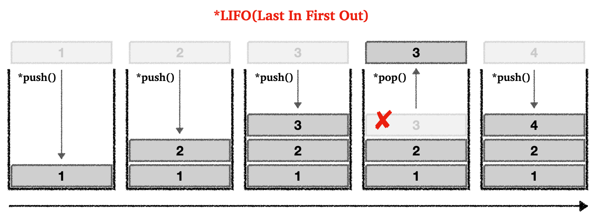
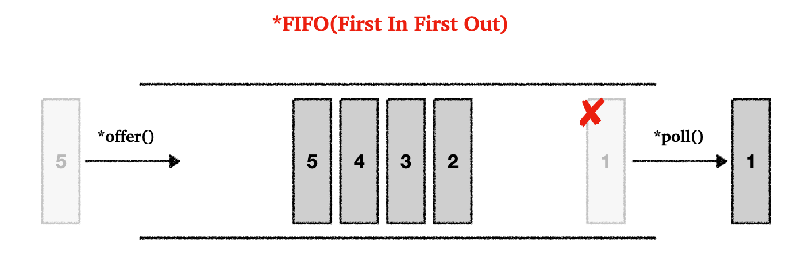
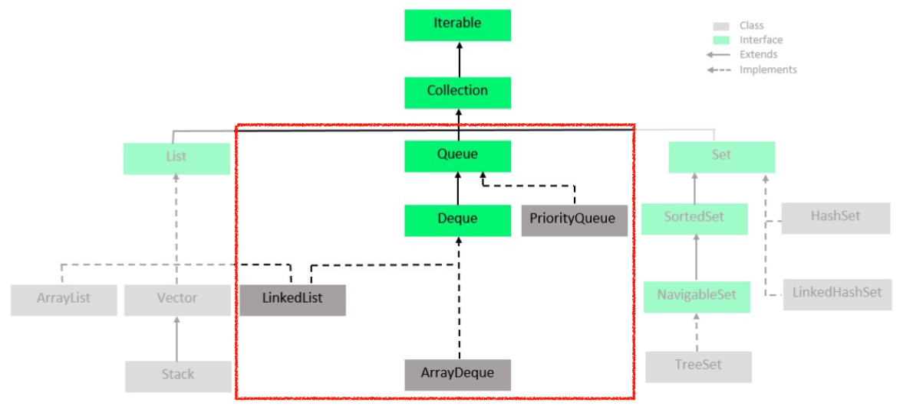
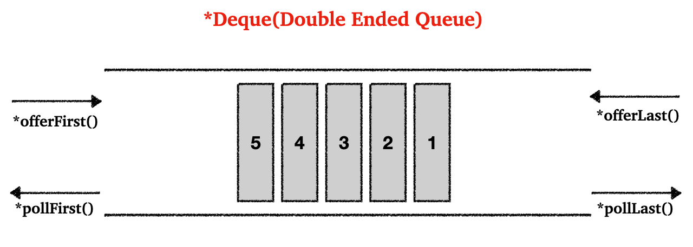

## Index

* `Stack`
  * `Stack` 설명
  * 자바에서 제공하는 `Stack`
* `Queue`
  * `Queue` 설명
  * `Queue` 인터페이스
* `Deque`
  * `Deque` 인터페이스
  * `Deque` 사용하기

---

## 1) `Stack`

### 1.1 `Stack` 설명 

스택 자료 구조의 동작 원리는 다음의 그림으로 이해해보자.

<br>

<p align="center">    </p>

* 스택 자료구조는 후입선출(LIFO)
  * 가장 마지막으로 넣었던 요소가 가장 먼저 나온다
  * 박스 쌓기로 생각하면 편하다
* 스택 자료 구조에 데이터를 앞에 넣는 것을 `push()`, 마지막 값을 제거하고 반환(값을 꺼낸는 것)하는 것을 `pop()`으로 구현한다

<br>

---

### 1.2 자바에서 제공하는 `Stack`

자바에서 제공하는 `Stack`을 간단하게 사용해보자.

<br>

`StackMain`

```java
public class StackMain {
    public static void main(String[] args) {

        Stack<Integer> stack = new Stack<>();

        // 스택에 요소 넣기
        stack.push(1);
        stack.push(2);
        stack.push(3);
        System.out.println(stack);

        // 스택에서 요소 꺼내기
        System.out.println("stack.pop() = " + stack.pop());

        stack.push(4);

        // 스택의 다음 요소 확인(꺼내지 않고 조회만)
        System.out.println("stack.peek() = " + stack.peek());

        System.out.println(stack);

    }
}
```

```
[1, 2, 3]
stack.pop() = 3
stack.peek() = 4
[1, 2, 4]
```

<br>

참고로 자바에서 제공하는 `Stack`은 내부에서 `Vector`라는 클래스를 사용한다. 그러나 지금은 `Vector`를 더이상 사용하지 않고, 해당 `Vector`를 사용하는 `Stack`의 사용도 권장하지 않는다. 추후에도 설명하겠지만, 자바에서 `Stack`이나 `Queue` 자료 구조의 사용을 위해서는 `Queue` 인터페이스를 구현하는 `Deque` 인터페이스의 구현체를 사용하자. 이 내용은 뒤에서 더 자세히 살펴보자.

<br>

---

## 2) `Queue`

### 2.1 `Queue` 설명

큐 자료 구조의 동작 원리를 다음 그림으로 이해해보자.

<br>

<p align="center">    </p>

* 큐 자료구조는 선입선출(FIFO)
  * 큐에 먼저 들어간 요소는 먼저 나온다
  * 은행 창구에 줄을 서는 것을 생각하면 편하다. 먼저 선 사람이 먼저 처리되고 나간다.
* 큐 자료 구조에 데이터를 앞에 넣는 것을 `offer()`, 앞(제일 먼저 넣은 요소)에 꺼내는 것을 `poll()`로 구현한다

<br>

---

### 2.2 `Queue` 인터페이스

자바 컬렉션 프레임워크에서 제공하는 `Queue` 인터페이스에 대해 알아보자.

<br>

<p align="center">    </p>

* `Queue` 인터페이스의 대표적인 구현체는 `ArrayDeque`와 `LinkedList`
* `Deque` 인터페이스는 바로 뒤에서 자세히 다룰 예정

<br>

`ArrayDeque`를 이용해서 큐 자료구조를 사용해보자.

<br>

`QueueMain`

```java
public class QueueMain {
    public static void main(String[] args) {

        Queue<Integer> queue = new ArrayDeque<>();

        // 큐 앞에 데이터 추가
        queue.offer(1);
        queue.offer(2);
        queue.offer(3);
        queue.offer(4);

        System.out.println(queue);

        // 다음 꺼낼 데이터 확인(단순 조회)
        System.out.println("queue.peek() = " + queue.peek());

        // 데이터 꺼내기
        System.out.println("queue.poll() = " + queue.poll());
        System.out.println("queue.poll() = " + queue.poll());

        System.out.println(queue);
    }
}
```

```
[1, 2, 3, 4]
queue.peek() = 1
queue.poll() = 1
queue.poll() = 2
[3, 4]
```

* 가장 먼저 입력한 값이 가장 먼저 나온다

<br>

---

## 3) `Deque`

### 3.1 `Deque` 인터페이스 

`Deque`은 Double Ended Queue를 의미한다. 이름 그대로, 양쪽 끝에서 요소를 추가/제거가 가능하다. `Stack`과 `Queue`의 기능을 모두 가졌다고 생각하면 된다. 그림으로 한번 살펴보자.

<br>

<p align="center">    </p>

* `offerFirst()` : 앞에 추가
* `offerLast()` : 뒤에 추가
* `pollFirst()` : 앞에서 꺼냄
* `pollLast()` : 뒤에서 꺼냄

<br>

자바에서 제공하는`Deque` 인터페이스의 구현체에는 `ArrayDeque`와 `LinkeList`가 있다. 성능은 `ArrayDeque`가 모든 작업에서 더 빠르다.

자바는 `ArrayDeque`를 구현하는데에 원형 큐를 사용한다.

<br>

---

### 3.2 `Deque` 사용하기

`Deque`를 사용해보자.

<br>

`DequeMain`

```java
public class DequeMain {
    public static void main(String[] args) {

        Deque<String> deque = new ArrayDeque<>();

        // 데이터 앞에 추가
        deque.offerFirst("cat");
        deque.offerFirst("dog");
        System.out.println(deque);

        // 데이터 뒤에 추가
        deque.offerLast("bird");
        deque.offerLast("fish");
        System.out.println(deque);

        // 제일 앞 요소 조회(단순 조회)
        System.out.println("deque.peekFirst() = " + deque.peekFirst());
      
        // 마지막 요소 조회(단순 조회)
        System.out.println("deque.peekLast() = " + deque.peekLast());

        // 제일 앞 요소 꺼내기
        System.out.println("deque.pollFirst() = " + deque.pollFirst());

        // 마지막 요소 꺼내기
        System.out.println("deque.pollLast() = " + deque.pollLast());
        System.out.println(deque);

        // 스택의 push(), pop() 사용가능
        // push()로 앞에 데이터 추가
        deque.push("frog");
        System.out.println(deque);
        
        // pop()으로 마지막 요소 꺼내기
        System.out.println("deque.pop() = " + deque.pop());
        System.out.println(deque);
        
        // 큐의 offer(), poll()도 사용가능
        
    }
}
```

```
[dog, cat]
[dog, cat, bird, fish]
deque.peekFirst() = dog
deque.peekLast() = fish
deque.pollFirst() = dog
deque.pollLast() = fish
[cat, bird]
[frog, cat, bird]
deque.pop() = frog
[cat, bird]
```

* 보통의 경우 `ArrayDeque`가 성능이 좋기 때문에, `ArrayList` 사용 권장
* `Deque`에서는 `Stack`에서 사용하는 메서드도 제공한다 (`push()`, `pop()`)
* 만약 단순히 `Queue` 자료형이 필요하면 `Queue` 인터페이스 사용
* 더 많은 기능이 필요하면 `Deque` 인터페이스 사용

<br>