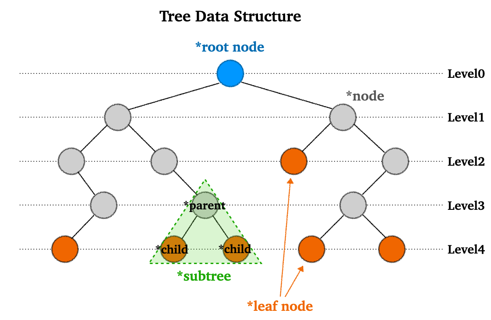
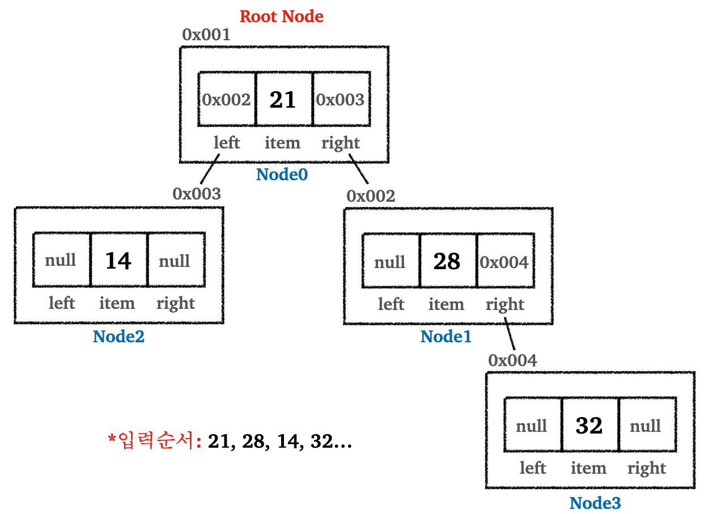
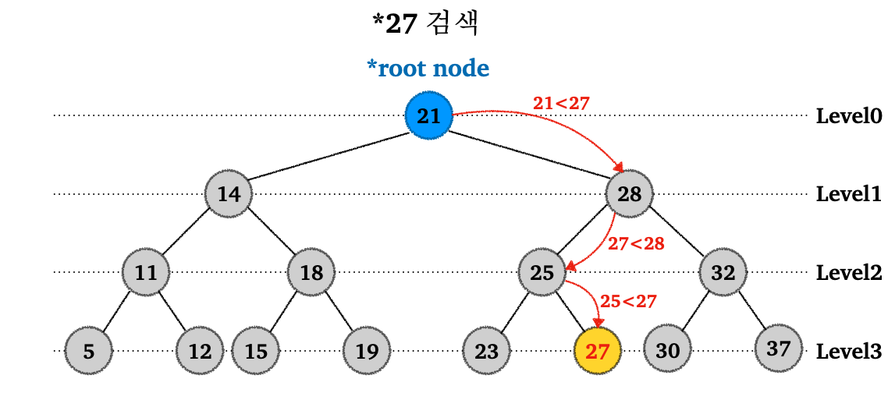
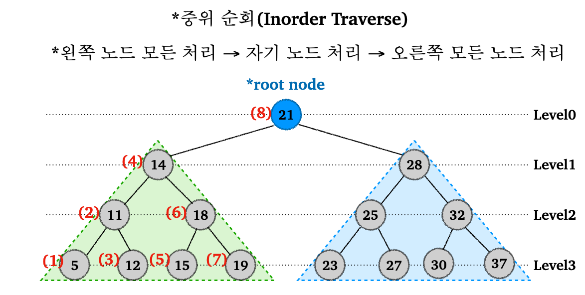

> 트리(Tree) 자료 구조에 대한 설명

---

## Index

* Tree 설명
* 이진 탐색 트리(Binary Search Tree, BST)
  * 입력
  * 검색
  * 성능
  * 순회


---

## 1) Tree 소개

 트리(Tree) 자료 구조에 대해 알아보자.

트리는 노드(node)와 브랜치(branch, edge)를 사용해서 사이클이 이루어지지 않도록 구성된 자료 구조이다. 여기서 사이클이 이루어지지 않는다는 의미는 한 노드에서 시작해서 다른 노드들을 순회하여 자기 자신에게 돌아올 수 있는 순환이 없다(Acylic)는 뜻이다. 트리 자료 구조는 그래프의 일종이다.

트리 구조를 다음 그림으로 이해해보자.

<br>

<p align="center">    </p>

* 노드(node) : 데이터를 저장하는 기본 요소
* 루트 노트(root node) : 트리의 가장 최상위 노드
* 단말 노드(leaf node) : 자식이 없는 노드
* 보조 트리(subtree) : 전체 트리에 속하는 일부 트리. 트리의 하위 집합으로 표현하기도 한다.
* 각 레벨(level)은 트리의 깊이를 나타낸다

<br>

트리 구조에 대한 설명을 더 하자면, 자식이 2개 까지 올 수 있는 트리를 `이진 트리(binary tree)`라고 한다. 자식 n개 까지 오면 `n진 트리`가 되지만, 보통 `이진 트리`를 가장 많이 사용한다. 이런 트리 구조는 많은 경우 탐색(검색), 정렬 알고리즘의 구현이나 위해서 사용된다. (그렇다고 탐색과 정렬만 할 수 있다는 뜻은 아니다!)

대표적인 `이진 트리`의 종류에는 다음이 있다.

* 이진 탐색 트리(BST, Binary Search Tree)
* 균형 이진 탐색 트리(Balanced Binary Search Tree)
  * AVL 트리
  * Red-Black 트리 : 자바 컬렉션의 `TreeSet`이 사용한다
* B-Tree : 데이터베이스 인덱싱에 사용
* Heap : 우선순위 큐를 구현하기 위해 사용 가능 

<br>

---

## 2) 이진 탐색 트리(BST)

### 2.1 이진 탐색 트리 입력

이진 탐색 트리(BST)의 원리를 자세히 알아보기 전에 간단하게 설명하자면 부모 노드의 왼쪽 자식 노드에 더 작은 값을 넣고, 오른쪽 자식 노드에 더 큰 값을 넣는 방식으로 진행된다.

이제 부터 자세한 원리를 알아보자.

<br>

위에서도 설명했듯이 트리는 기본적으로 노드로 이루어져있다.

```java
class Node {
  Object item;
  Node left;
  Node right;
}
```

* 각 노드는 왼쪽, 오른쪽 노드를 알고 있다
* 자바의 `LinkedList` 구현 처럼 각 노드의 참조를 통해 연결되어 있다

<br>

이진 탐색 트리의 핵심은 데이터 입력 시점에 정렬해서 보관한다는 점이다. 이때 데이터의 입력은 루트 노드 부터 시작해서, 부모 노드의 기준으로 작으면 왼쪽 자식 노드에 보관하고, 크면 오른쪽 자식 노드에 보관하면 된다.

데이터를 `21, 28, 14, 32 ...` 으로 계속 입력한다고 가정해보자.

<br>

<p align="center">    </p>

* 루트 노드 `21`에 비해 `28`이 크기 때문에 `28`을 오른쪽 자식 노드에 보관
* `14`는 위에서 부터 시작해서 `21` 보다 작기 때문에 왼쪽 자식 노드에 보관
* `32` > `21` : 오른쪽 서브 트리로 이동, 레벨 1 증가 → `32` > `28` : 오른쪽 자식 노드에 보관

<br>

글로 이해하기 어려울 수 있기 때문에 다음 애니메이션으로 데이터가 입력되는 과정을 살펴보자.

<br>

<p align="center">    </p>

<p align='center'>https://www.mathwarehouse.com/programming/gifs/binary-search-tree.php</p>

<br>

---

### 2.2 이진 탐색 트리 검색

이번에는 이진 탐색 트리에서 특정 값을 검색하는 방법을 다음 그림을 통해 알아보자.

`27`이라는 값을 찾는다고 가정하자.

<br>

<p align="center">    </p>

* `27`을 루트 노드 `21`과 비교. `21` < `27` 이므로 오른쪽 서브 트리 탐색
* `28` > `27` 이므로 왼쪽 서브 트리 탐색
* `25` < `27`이므로 오른쪽 서브 트리 탐색
* `27`과 같기 때문에 `27` 찾기 완료!

<br>

애니메이션으로 살펴보자.

<br>

<p align="center">    </p>

<p align='center'>https://www.mathwarehouse.com/programming/gifs/binary-search-tree.php</p>

<br>

위 애니메이션에서도 확인할 수 있듯이 기존 정렬 배열에서는 `11`번의 연산이 필요한것과 달리, 이진 탐색 트리(BST)에서는 `4`번의 연산으로 찾을 수 있다.

이진 탐색 트리의 계산의 핵심은 단계별로 한쪽 서브트리를 탐색하지 않아도 되기 때문에 연산 횟수를 줄일 수 있다.

<br>

---

### 2.3 이진 탐색 트리의 성능

이진 탐색 트리의 검색/삽입/삭제의 평균 성능은 `O(logn)`이다. 검색 과정에서 탐색할 노드의 수가 줄어드는 과정을 숫자로 표현해보자.

총 64개의 데이터가 있다고 가정하자.

* 64 → 32 → 16 → 8 → 4 → 2 → 1 : 트리를 절반씩 날려가며, 총 6번의 연산으로 최종 노드 도달 가능
* 이것을 $log_2(n)$으로 표현할 수 있다

<br>

이렇기 때문에 이진 탐색 트리의 주요 작업의 평균 성능은 `O(logn)`으로 표현할 수 있다. 그러나 최악의 경우 이진 탐색 트리의 성능은 어떨까?

이진 탐색 트리의 성능이 최악인 경우는, 데이터가 계속 한쪽으로 치우쳐져서 마치 연결 리스트와 같은 구조를 가질 때 나타난다. 

다음 애니메이션으로 살펴보자.

<br>

<p align="center">    </p>

<p align='center'>https://www.mathwarehouse.com/programming/gifs/binary-search-tree.php</p>

<br>

위의 경우 처럼 마치 배열 처럼 한줄을 이루게 되면, 성능은 최악의 경우 `O(n)`을 가지게 된다.

이런 문제를 해결하기 위해서 AVL 트리, Red-Black 트리와 같은 균형 이진 탐색 트리(Balanced Binary Search Tree)가 등장한다. 실제로 자바 `TreeSet` 컬렉션은 Red-Black 트리로 구현되어 있다.

<br>

---

### 2.4 이진 탐색 트리 순회

이진 탐색 트리의 핵심은 데이터의 값을 기준으로 정렬해서 보관한다는 점이다. 이 때문에 정렬된 순서로 트리를 순회할 수 있다.

이진 탐색 트리의 경우 중위 순회(Inorder Traverse)를 사용한다. 이진 탐색 트리 특성상 노드를 오름차순으로 순회할 수 있다.

그림으로 살펴보자.

<br>

<p align="center">    </p>

* 루트 노드 `21`을 기준 왼쪽 서브트리 방문
  * `14` 기준으로 왼쪽 서브트리 방문
    * `11` 기준으로 왼쪽 서브트리 방문
      * `5` 출력
    * `11` 출력
    * `11` 기준으로 오른쪽 서브트리 방문
      * `12` 출력
  * `14` 출력
  * `14` 기준으로 오른쪽 서브트리 방문
    * `18` 기준으로 왼쪽 서브트리 방문
      * `15` 출력
    * `18` 출력
    * `18` 기준으로 오른쪽 서브트리 방문
      * `19` 출력
* `21` 출력
* `21` 기준으로 오른쪽 서브트리 방문
* 이하 반복

<br>

---

## Reference

1. [https://www.geeksforgeeks.org/tree-meaning-in-dsa/](https://www.geeksforgeeks.org/tree-meaning-in-dsa/)
1. [https://www.mathwarehouse.com/programming/gifs/binary-search-tree.php#binary-search-tree-insertion-node](https://www.mathwarehouse.com/programming/gifs/binary-search-tree.php#binary-search-tree-insertion-node)