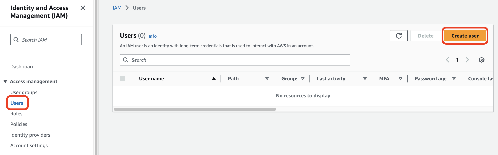
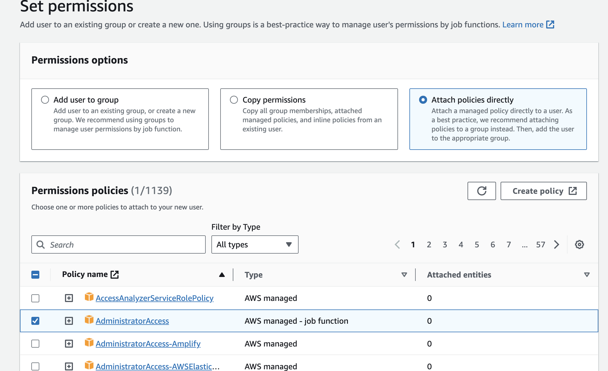
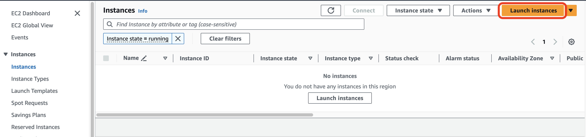
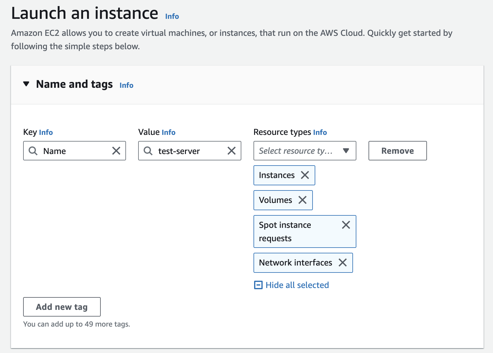

## Amazon EC2

### EC2란?

> Amazon Elastic Compute Cloud (Amazon EC2) provides on-demand, scalable computing capacity in the Amazon Web Services (AWS) Cloud. Using Amazon EC2 reduces hardware costs so you can develop and deploy applications faster. You can use Amazon EC2 to launch as many or as few virtual servers as you need, configure security and networking, and manage storage. You can add capacity (scale up) to handle compute-heavy tasks, such as monthly or yearly processes, or spikes in website traffic. When usage decreases, you can reduce capacity (scale down) again.
>
> The following diagram shows a basic architecture of an Amazon EC2 instance deployed within an Amazon Virtual Private Cloud (VPC). In this example, the EC2 instance is within an Availability Zone in the Region. The EC2 instance is secured with a security group, which is a virtual firewall that controls incoming and outgoing traffic. A private key is stored on the local computer and a public key is stored on the instance. Both keys are specified as a key pair to prove the identity of the user. In this scenario, the instance is backed by an Amazon EBS volume. The VPC communicates with the internet using an internet gateway. For more information about Amazon VPC, see the [Amazon VPC User Guide](https://docs.aws.amazon.com/vpc/latest/userguide/).

출처 - https://docs.aws.amazon.com/ko_kr/AWSEC2/latest/UserGuide/concepts.html

위는 아마존에서 소개하는 EC2에 대한 내용이다.

간단히 말하자면 EC2(Elastic Cloud Compute)는 AWS에서 제공해주는 클라우드 컴퓨칭 서비스이다. EC2를 통해서 컴퓨팅을 빌려 쓰는것으로 이해하는게 제일 편하다. 

### EC2 사용 케이스

* 서버 구축
  * 웹서버, 애플리케이션 서버 등
* 어플리케이션 사용 및 호스팅
  * 데이터베이스
  * 머신러닝

### EC2 특성

1. 초 단위의 On-demand 가격 측정
   * 가격이 초 단위로 결정 됨
   * 서비스 요금을 미리 지불할 필요 없음
2. 빠른 구축 속도와 확장성
3. 다양한 구성방법을 지원한다
   * 머신러닝, 웹서버, 게임서버 등 특정 용도에 최적화된 서버 구성이 가능함
4. 다양한 과금 모델
   * On-demand 가격 모델이 가지는 유연성을 희생해서 기간 약정으로 더 저렴하게 사용가능
5. 다른 AWS 서비스와의 연동

---

## AWS User Type

EC2 인스턴스 생성에 들어가기 전에 AWS 계정 생성에서 유저 종류에 대해 간단히 알아보자.

### Root User

* 모든 권한을 자동으로 가지고 있음
* 탈취당한 경우 복구가 힘듬 ([MFA](https://docs.aws.amazon.com/IAM/latest/UserGuide/enable-virt-mfa-for-root.html) 사용 권장)
* 루트 유저는 관리용으로 사용
  * 계정 설정 변경
  * 결제
* 루트 유저로 AWS api 호출은 지양 ([AWS documentation](https://docs.aws.amazon.com/IAM/latest/UserGuide/id_root-user_manage_add-key.html)을 살펴보면 루트 유저로 access key를 생성하지 않는 것을 강력히 추천한다)

### IAM User

* Identity and Access Management를 통해 생성한 유저
* 기본 권한이 없기 때문에 유저별로 따로 권한을 부여해야한다
* AWS api 호출 가능
  * access key
  * secret access key
* 관리를 제외한 모든 작업은 IAM 유저를 만들어서 사용
* 강력한 권한을 지닌 IAM 유저는 루트 유저가 아니여도 MFA를 사용해서 보안 강화

* Permissian policies를 통해서 필요한 권한을 설정할 수 있다

---

## IAM (Identity and Access Management)

### IAM 소개

* IAM을 통해서 AWS 서비스와 리소스에 대한 액세스를 관리한다
* 사용자 및 그룹의 생성과 관리, 액세스에 대한 허용 및 거부
* 역할(Role) 설정

출처 - https://k21academy.com/amazon-web-services/aws-identity-and-access-management-iam/

권한 검증은 다음 순서로 진행된다.

1. 나(사용자)에게 ***를 이용할 수 있는 정책이 부여되었는가?
2. 사용자가 속한 그룹에 ***를 이용할 수 있는 정책이 부여되었는가?
3. 사용자에게 위임된 역할에 ***를 이용할 수 있는 정책이 부여되었는가?
4. 어디에도 해당되지 않으면 권한이 없다는 것

### IAM 자격 증명 보고서

* 계정의 모든 사용자, 암호, 액세스 키, MFA 등의 증명 상태를 나열하는 보고서를 생성 가능
* AWS 콘솔, cli, api 에서 생성 요청 및 다운로드 가능
  * 4시간에 한번 생성 가능

### IAM의 사용

* 루트 사용자 사용하지 않기
* 그룹과 정책을 적절히 사용할 것
* Principle of least Privilege 지키기 (권환 최소화)
* MFA 활성화
* Access key 사용 최소화

---

## EC2 인스턴스 생성

### EC2의 구성

1. Instance
   * 클라우드에서 사용하는 가상 서버
   * CPU, 메모리, GPU 등 연산을 위한 하드웨어 담당
2. EBS(Elastic Block Storage)
   * 클라우드에서 사용하는 가상 하드디스크
   * EC2 인스턴스가 종료되어도 계속 유지 가능
   * 인스턴스와 EBS는 서로 네트워크로 연결 되어 있음!
     * 네트워크로 연결된 구조라서 인스턴스의 변경 또는 EBS의 확장이 용이함
   * 루트 볼륨으로 사용하면 인스턴스 종료시 같이 삭제됨 (설정을 통해 EBS만 따로 유지하는 것 가능)
   * EC2와 같은 가용영역에 존재
     * 다른 가용영역의 EC2와 붙일 수 없음!
   * EBS도 다양한 종류가 존재하고, 상황에 따라서 적절한 것을 고르면 됨
3. Snapshot
   * 특정 시간 EBS 상태의 저장본
   * 스냅샷을 통해 특정 시간의 EBS 복구 가능
   * S3에 저장
     * 증분식 저장 (변화하는 부분만에 대해서 저장을 함), (깃의 커밋이랑 비슷한거 같기도 하고..)
4. AMI(Amazon Machine Image)
   * EC2 인스턴스를 실행하기 위한 정보를 담고 있는 이미지
   * Ubuntu Server 22.04 LTS(HVM), SSD Volume 같은 항목으로 되어 있음
   * AMI를 사용하여 EC2를 복제하거나 다른 리전 또는 계정으로 전달 가능
   * 스냅샷 기반으로 AMI 구성 가능
   * AMI의 구성은 다음과 같음
     * 1개 이상의 EBS 스냅샷
     * 루트 볼륨에 대한 템플릿 (운영체제, 애플리케이션 서버, 애플리케이션)
     * 사용 권한 (어떤 유저가 사용할 수 있는지)
     * 블록 디바이스 맵핑 (EBS가 무슨 용량으로 몇개가 붙는지)
     * EBS 기반과 인스턴스 저장 기반이 있음
       * 인스턴스 스토리지의 경우 인스턴스 안에 스토리지가 존재함 (속도를 위해서)
       * 인스턴스 스토리지는 네트워크 기반이 아니기 때문에 인스턴스가 삭제되면 같이 삭제됨
5. 보안 그룹
   * 가상의 방화벽

 

---

### 인스턴스 생성해보기

* Launch Instances로 인스턴스에 대해 설정 후 생성
* AMI, Tag, EBS, Network, Machine-Type 등 여러가지 설정을 고르고 인스턴스를 생성 할 수 있음

 

 

* FTP 연결 등을 위한 key pair 생성

## 참고

---

1. [https://docs.aws.amazon.com/ko_kr/AWSEC2/latest/UserGuide/concepts.html](https://docs.aws.amazon.com/ko_kr/AWSEC2/latest/UserGuide/concepts.html)
2. [https://docs.aws.amazon.com/IAM/latest/UserGuide/id_root-user_manage_add-key.html](https://docs.aws.amazon.com/IAM/latest/UserGuide/id_root-user_manage_add-key.html)
3. [쉽게 설명하는 AWS](https://www.youtube.com/watch?v=9nBq6PxDvp4&list=PLfth0bK2MgIan-SzGpHIbfnCnjj583K2m&index=5)
4. [https://k21academy.com/amazon-web-services/aws-identity-and-access-management-iam/](https://k21academy.com/amazon-web-services/aws-identity-and-access-management-iam/)

