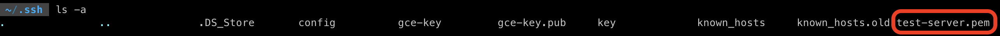
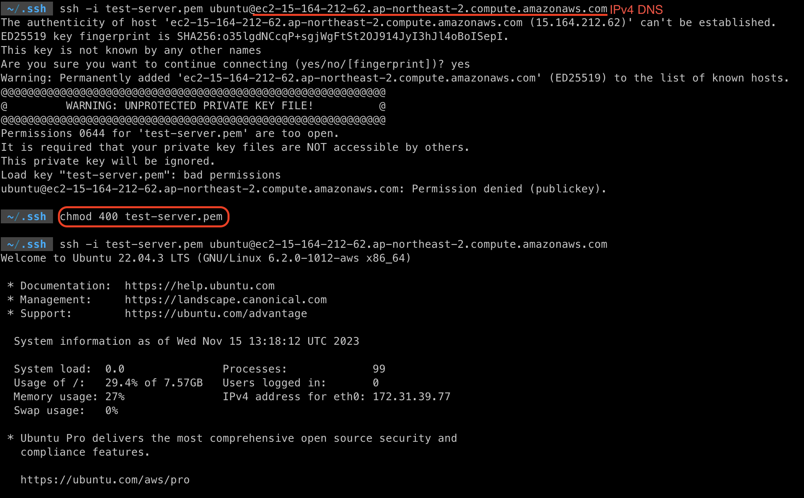
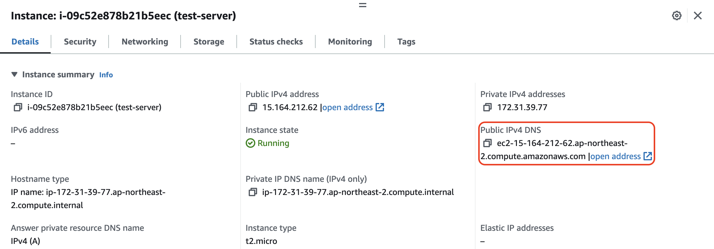
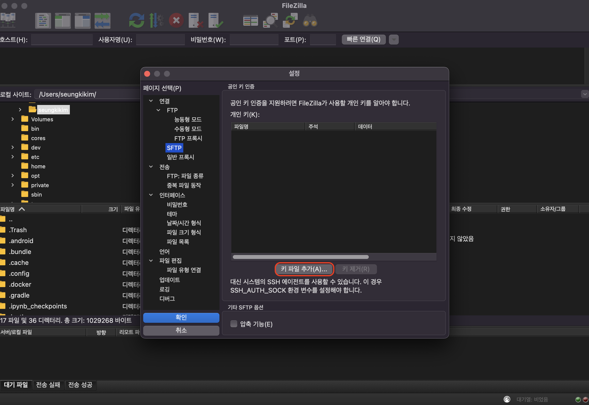
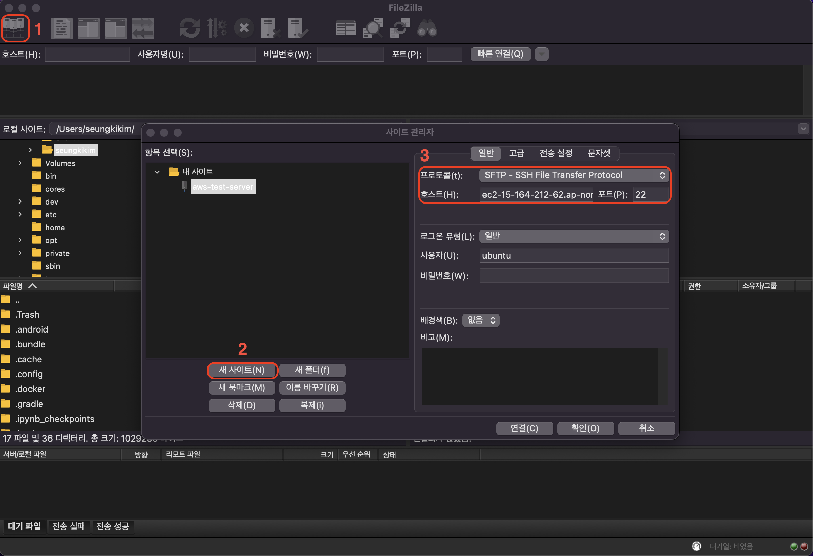

## 1) EC2 사용하기

### 1.1 SSH 연결

생성한 EC2 인스턴스에 SSH 연결을 해보자.

<br>



* 생성한 키가 존재하는 디렉토리로 이동
* 키 확인

<br>





* ```ssh -i {key name} ubuntu@{Public IPv4 DNS}```
* 키에 대한 권한 설정 (read only로) - ```chmod 400 {key name}```
* 연결 확인

<br>

---

### 2.2 FTP로 파일 전송

1. Filezilla 설치
   * [https://filezilla-project.org/](https://filezilla-project.org/)
2. SFTP 항목의 키 파일 추가로 받은 pem 파일 추가
3. 호스트 추가
   * 새 사이트
   * SFTP 프로토콜
   * 호스트는 IPv4 DNS 주소
   * 포트 22 (FTP 21번 포트가 아닌 SSH를 위한 22번 포트 사용)

<br>





<br>

---

## Reference

1. [쉽게 설명하는 AWS](https://www.youtube.com/watch?v=9nBq6PxDvp4&list=PLfth0bK2MgIan-SzGpHIbfnCnjj583K2m&index=5)