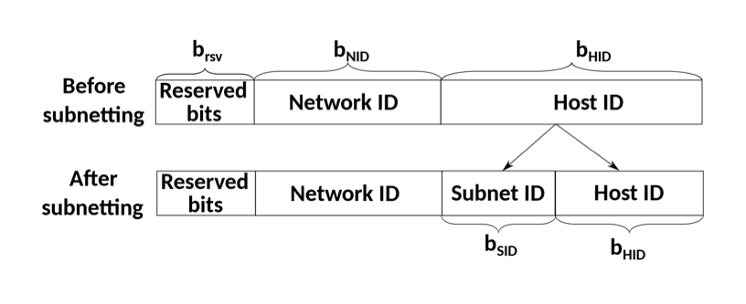

## Table of Contents

1. [Private IP](https://github.com/seungki1011/Data-Engineering/tree/main/aws/(003)VPC#1-private-ip)
2. [NAT(Network Address Translation, 네트워크 주소 변환)](https://github.com/seungki1011/Data-Engineering/tree/main/aws/(003)VPC#2-natnetwork-address-translation-%EB%84%A4%ED%8A%B8%EC%9B%8C%ED%81%AC-%EC%A3%BC%EC%86%8C-%EB%B3%80%ED%99%98)
   * Dynamic NAT
   * Static NAT
   * PAT(Port Address Translation)
3. [CIDR(Classless Inter Domain Routing)](https://github.com/seungki1011/Data-Engineering/tree/main/aws/(003)VPC#3-cidrclassless-inter-domain-routing)
   * CIDR Block/Notation
4. [서브넷(Subnet)](https://github.com/seungki1011/Data-Engineering/tree/main/aws/(003)VPC#4-%EC%84%9C%EB%B8%8C%EB%84%B7subnet)
5. [VPC(Virtual Private Cloud)](https://github.com/seungki1011/Data-Engineering/tree/main/aws/(003)VPC#5-vpcvirtual-private-cloud)
   * VPC 소개
   * VPC 구성 요소
     * Subnet
     * Internet Gateway(IGW)
     * Security Group(SG)
   * VPC 예시(수정 예정)

---

## 1) Private IP

* **한정된 IPv4 주소를 활용하기 위해서 IP주소를 분할해서 사용하는 개념**
* IPv4의 한계를 해결하기 위한 IPv6도 존재
  * IPv6는 Private IP의 개념이 필요없음 (가능한 주소의 갯수가 굉~장히 많음)
* 사설망의 내부는 외부 인터넷 망으로 통신이 불가능한 Private IP로 구성됨
  * 외부로 통신할 때 통신이 가능한 Public IP를 이용
  * **하나의 사설망은 보통 Private IP를 부여받은 다수의 기기와 NAT 기능을 갖춘 Gateway로 구성**

 

출처 - https://www.geeksforgeeks.org/difference-between-private-and-public-ip-addresses/

 

**Private IP Range**

출처 - https://networkel.com/ip-address-classes/

* 클래스 기반으로 나눴지만 이제는 CIDR(Classless Inter Domain Routing)을 사용

 

---

## 2) NAT(Network Address Translation, 네트워크 주소 변환)

* Private IP가 Public IP로 통신 할 수 있도록 주소를 변환해 주는 방법
* Address Translation에는 3가지 방법이 존재 
  * **Dynamic NAT**
  * **Static NAT**
  * **PAT**

 

---

### 2.1 Dynamic NAT

* 1개의 Private IP를 가용 가능한 Public IP로 연결
* Public IP 그룹(NAT Pool)에서 현재 사용 가능한 IP를 가져와서 연결하는 방식

출처 - https://cybermeteoroid.com/network-address-translation-a-complete-overview/

 

---

### 2.2 Static NAT

* 하나의 Private IP를 고정된 하나의 Public IP로 연결
* AWS Internet Gateway가 사용하는 방식

출처 - https://cybermeteoroid.com/network-address-translation-a-complete-overview/

 

---

### 2.3 PAT(Port Address Translation)

* 다수의 Private IP를 하나의 Public IP로 연결
* NAT Gateway/NAT Instance가 사용하는 방식
* 대부분 가정이나 회사에서 이 방식을 사용
* Private IP에 붙은 포트와 Public IP에 붙은 포트는 다름
  * 수신/송신 포트에 대해 알아보기 (Ex. (웹서버로 요청) src port : 내 컴퓨터, dest port : 웹 서버 -> (웹서버에서 응답) dest port : 내 컴퓨터, src port : 웹 서버)

출처 - https://cybermeteoroid.com/network-address-translation-a-complete-overview/

 

---

## 3) CIDR(Classless Inter Domain Routing)

CIDR은

* 주소의 영역을 여러 네트워크 영역으로 나누기 위해 IP를 묶는 방식
* 다수의 사설망을 구축하기 위해 망을 나누는 방법

 

---

### 3.1 CIDR Block/Notation

* CIDR Block : IP 주소의 집합
  * 호스트 주소의 bit 만큼 IP 주소 보유 가능

* CIDR Notation : CIDR Block을 표현하는 방법
  * 네트워크 주소 + 호스트 주소 형식으로 구성
  * 각 호스트 주소 숫자 만큼의 IP를 가진 네트워크 망을 형성 가능

* 10.0.1.0/24 처럼 A.B.C.D/E 같은 형식
  * A.B.C.D : 네트워크 주소 + 호스트 주소
  * E : 네트워크 주소가 몇 bit 인지 표시

 

출처 - https://service.snom.com/display/wiki/CIDR-Notation

* 위의 예시를 살펴보면 서브넷 마스크에 의해 호스트 주소의 길이를 알 수 있음 (12 bit)
* `00001010 11011001 01111011 00000111` 에서 `(00001010 11011001 0111)1011 00000111` 괄호친 부분은 고정

 

---

## 4) 서브넷(Subnet)

* 내트워크 안의 네트워크
* 큰 네트워크를 쪼갠거로 생각하면 편함
* 일정 IP 주소의 범위를 보유함
  * 큰 네트워크에 부여된 IP 범위를 작은 단위로 나눈 후 서브넷에 할당

 

출처 - https://ipcisco.com/lesson/subnetting-examples/

출처 - https://en.wikipedia.org/wiki/Subnet

 

---

## 5) VPC(Virtual Private Cloud)

### 5.1 VPC 소개

> With Amazon Virtual Private Cloud (Amazon VPC), you can launch AWS resources in a logically isolated virtual network that you've defined. This virtual network closely resembles a traditional network that you'd operate in your own data center, with the benefits of using the scalable infrastructure of AWS.

 

* VPC는 사용자의 AWS 전용 가상 네트워크
  * VPC는 AWS 클라우드의 다른 가상 네트워크들과 논리적으로 분리되어 있음
  * VPC를 자체 데이터센터에서 운영하는 네트워크와 유사한 가상의 네트워크로 생각하면 편함

* VPC를 생성한 후 서브넷을 추가할 수 있음
* VPC는 리전 단위

* 사용 용도
  * EC2, Lambda, RDS 등의 AWS 컴퓨팅 서비스 실행
  * 서브넷 구성
  * 보안 설정

 

---

### 5.2 VPC 구성 요소

* Subnet
* Internet Gateway(IGW)
* NACL/보안그룹

* Route Table
  * 트래픽이 어디로 가야 할지 알려주는 이정표
  * VPC 생성시 기본적으로 하나가 제공
  * 들어가는 범위에 포함될 경우 가장 구체적인 Destination으로 매칭이 됨(/뒤에 오는 bit 값이 높을 수록)

* NAT Instance/NAT Gateway
* Bastion Host
* VPC Endpoint

 

---

#### 5.2.1 Subnet

* VPC의 하위 단위, VPC에 할당된 IP를 더 작은 단위로 분할해서 부여
* **하나의 서브넷은 하나의 가용영역(AZ)안에 위치**
* CIDR Block Range로 IP 주소 부여
* **제외해야하는 5개의 Address**
  * 10.0.0.0 : Network Address
  * 10.0.0.1 : VPC Router
  * 10.0.0.2 : DNS Server
  * 10.0.0.3 : 미래에 사용할 여분의 Address
  * 10.0.0.255 : Broadcast Address
* **서브넷은 두 종류로 나뉨**
  * Public Subnet
    * 외부에서 인터넷을 통해 연결할 수 있는 서브넷
    * IGW(Internet Gateway)를 통해 외부의 인터넷과 연결
    * 안에 위치한 인스턴스에 퍼브릭 IP 부여 가능
    * 웹서버, 어플리케이션 서버 등 유저에게 노출되어야 하는 인프라
  * Private Subnet
    * 외부에서 인터넷을 통해 연결 불가능
    * 퍼블릭 IP 부여 불가능
    * DB, 로직 서버 등 외부에 노출 될 필요가 없는 인프라

 

---

#### 5.2.2 Internet Gateway(IGW)

* VPC가 외부 인터넷과 통신할 수 있도록 경로를 만들어주는 리소스
* 기본적으로 확장성과 고가용성이 확보되어 있음
* IPv4, IPv6 지원
  * IPv4는 NAT 역할
* Route Table에서 경로 설정 후에 접근 가능

---

#### 5.2.3 Security Group(SG)

* Network Access Control List(NACL)와 함께 방화벽의 역할을 하는 서비스
* Port 허용
  * 모든 포트는 기본적으로 비활성화
  * 트래픽이 지나갈 수 있는 포트와 소스를 설정 가능
  * 포트에 대한 Deny 설정 불가능 (NACL에서 설정)

 

---

### 5.3 VPC 예시(수정 예정)

출처 - https://www.rackspace.com/blog/aws-201-understanding-the-default-virtual-private-cloud

출처 - https://docs.aws.amazon.com/ko_kr/vpc/latest/userguide/vpc-example-web-database-servers.html

위의 예시를 설명하면

* 2개의 가용 영역에 퍼블릭 서브넷과 프라이빗 서브넷이 존재
* 웹 서버는 퍼블릭 서브넷에서 실행되며 로드밸런서를 통해 클라이언트로 부터 트래픽 수신
* 웹 서버의 보안 그룹은 로드밸러서의 트래픽 허용
* 데이터베이스 서버는 프라이빗 서브넷에서 실행되며 웹 서버로부터 트래픽을 수신
* 데이터베이스 서버는 데이트웨이 VPC 엔트포인트를 사용하여 AWS S3에 연결 가능

 

---

## Further Reading

* 포트 포워딩(Port Forwarding)
* 망분리
* Subnetting에 관한 예시를 설명 해준다 - [https://ipcisco.com/lesson/subnetting-examples/](https://ipcisco.com/lesson/subnetting-examples/)

* [https://cidr.xyz/](https://cidr.xyz/) : CIDR block을 직접 설정하면서 시각적으로 확인가능

---

## Reference

1. [https://www.geeksforgeeks.org/difference-between-private-and-public-ip-addresses/](https://www.geeksforgeeks.org/difference-between-private-and-public-ip-addresses/)
2. [쉽게 설명하는 AWS](https://www.youtube.com/watch?v=9nBq6PxDvp4&list=PLfth0bK2MgIan-SzGpHIbfnCnjj583K2m&index=5)
3. [https://cybermeteoroid.com/network-address-translation-a-complete-overview/](https://cybermeteoroid.com/network-address-translation-a-complete-overview/)
4. [https://networkel.com/ip-address-classes/](https://networkel.com/ip-address-classes/)
5. [https://service.snom.com/display/wiki/CIDR-Notation](https://service.snom.com/display/wiki/CIDR-Notation)
6. [https://ipcisco.com/lesson/subnetting-examples/](https://ipcisco.com/lesson/subnetting-examples/)
7. [https://en.wikipedia.org/wiki/Subnet](https://en.wikipedia.org/wiki/Subnet)
8. [https://docs.aws.amazon.com/vpc/latest/userguide/what-is-amazon-vpc.html](https://docs.aws.amazon.com/vpc/latest/userguide/what-is-amazon-vpc.html)