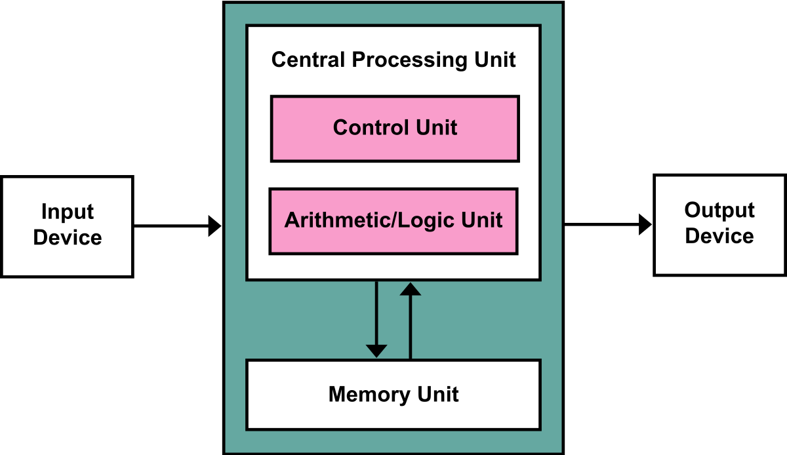

> 컴퓨터 구조, 동작 원리, 운영체제에 대한 기초적인 내용을 정리한 포스트 입니다.

---

## Index

---

## 1) Von Neumann Architecture

* [폰 노이만 구조](https://ko.wikipedia.org/wiki/%ED%8F%B0_%EB%85%B8%EC%9D%B4%EB%A7%8C_%EA%B5%AC%EC%A1%B0)
* **현재의 범용 컴퓨터들이 대부분 따르고 있는 설계 구조**
* 하버드 구조(Harvard Architecture)도 있지만, 범용 컴퓨터의 구조로는 대부분 폰 노이만 구조를 따른다
  * 하버드 구조는 프로그램과 데이터에 대한 메모리를 따로 사용한다(seperation of instruction and data memory)
  * 하버드 구조를 사용하는 몇 가지 경우
    * Microcontrollers
    * Embedded System
    * DSP(Digital Signal Processors)
    * Network Processors
* 양쪽 아키텍쳐를 사용하는 경우도 있음

    

폰 노이만 구조

컴퓨터의 구조는 다음과 같이 구성된다.

* CPU(중앙 처리 장치)

  * **메모리에 저장된 명령어를 읽기, 해석, 실행**
  * ALU(Arithmetic/Logic Unit)
    * 연산을 수행하는 장치
  * Register
    * 명령어 주소, 코드, 연산에 필요한 데이터, 연산 결과 등을 임시로 저장
    * 빠른 속도로 접근 가능한 메모리(기억 장치)
    * 용도에 따라 구분됨
  * Control Unit
    * 제어 신호를 내보냄(memory read/write)
    * 메모리에서 프로그램 명령을 순차적으로 꺼내 해석
    * Program Counter(PC), Instruction Register, Flag Register 등으로 이루어짐

* Memory(주기억 장치)

  * 휘발성 메모리
  * **CPU를 위해 실행되는 프로그램(프로세스)의 명령어와 데이터 저장**
  * 메모리 주소를 통해서 저장된 데이터의 위치를 알 수 있다
  * RAM, Cache

* Auxillary Storage(보조 기억 장치)

  * external storage로 부르기도 함
  * 대용량의 데이터를 장기간 보관
  * SDD, HDD

* I/O(입출력 장치)

  * peripheral device로 부리기도 함
  * 데이터 또는 명령의 입력, 결과의 출력
  * 키보드, 모니터

* System Bus

  * 시스템 버스는 컴퓨터의 구성 요소간 통신을 위한 통로

  * Address Bus(주소 버스)

    * 메모리 주소, I/O 포트 번호 전달

  * Data Bus(데이터 버스)

    * 데이터 전달

  * Control Bus(제어 버스)

    * 제어 신호 전달
    * read/write, interrupt request 등을 전달

    

컴퓨터는 대략적으로 위의 구성 요소들로 동작을 한다. 아래에서 각 요소에 대해 자세히 알아보자.

---

## 2) Data

---

## 3) Instruction

---

## 4) CPU

## Further Reading

---

* CPU Fetch-Decode-Execute
* Von Nuemann bottleneck

## Reference

---

1. 혼자 공부하는 컴퓨터 구조 + 운영체제
1. [위키피디아 - 폰 노이만 구조](https://ko.wikipedia.org/wiki/%ED%8F%B0_%EB%85%B8%EC%9D%B4%EB%A7%8C_%EA%B5%AC%EC%A1%B0)

