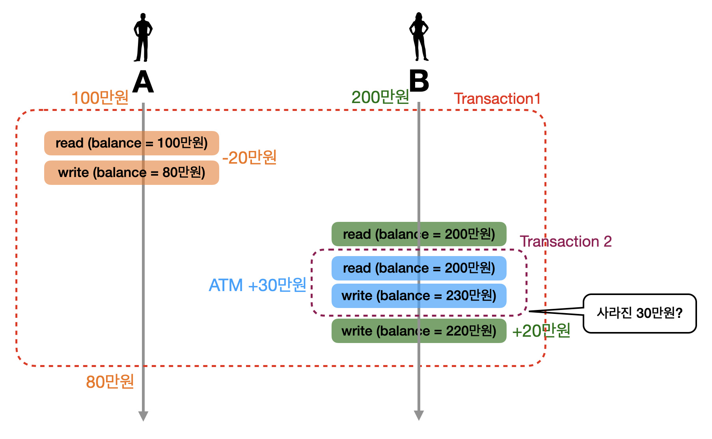
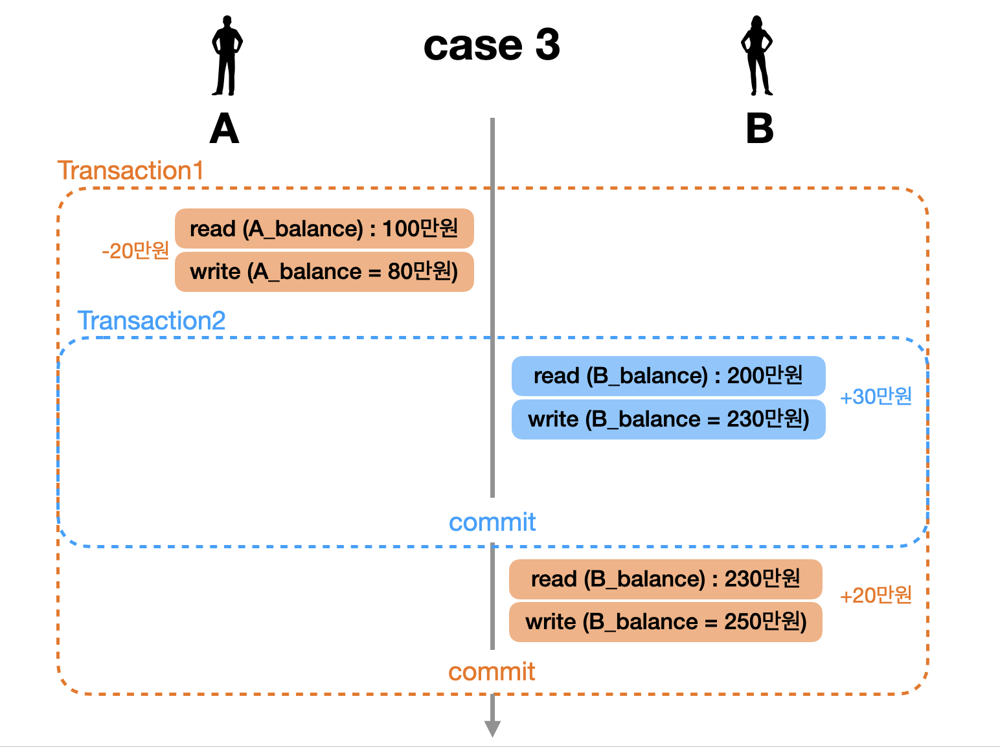
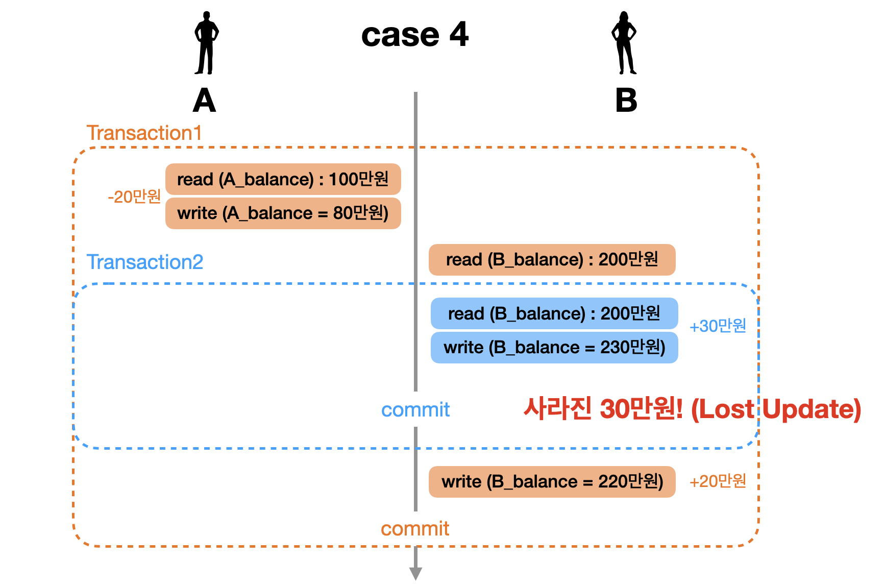
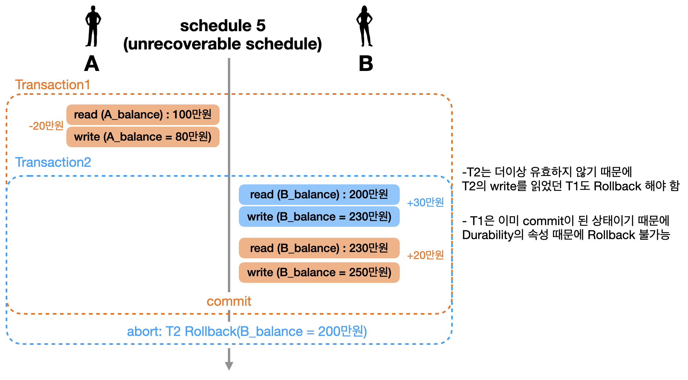
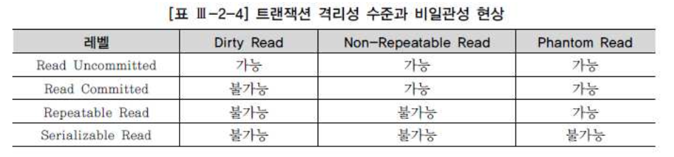
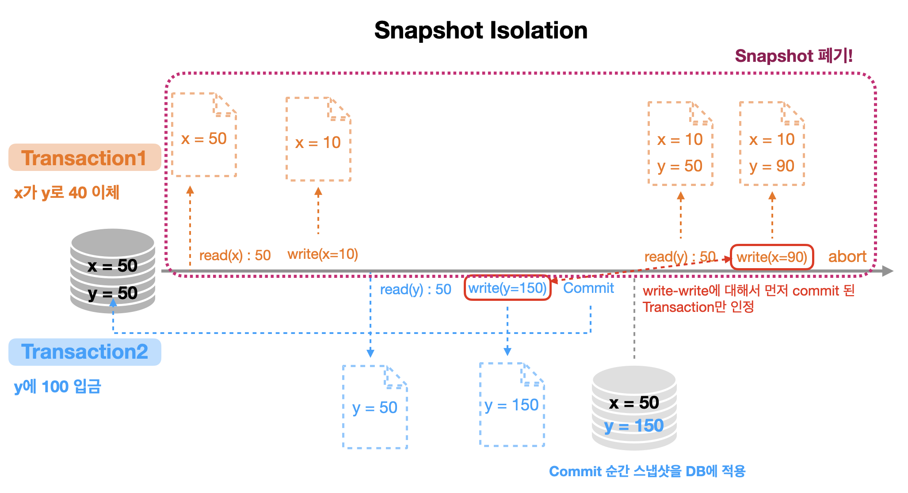

> [RDBMS I](https://github.com/seungki1011/Data-Engineering/blob/main/database/sql/(001)%20Relational%20Database.md)를 이어서 Lock, 트랜잭션(Transaction), 동시성 제어(Concurrency Control), 등에 대한 내용을 다룹니다. 
>
> "[한국 데이터 산업 진흥원 - SQL 전문가 가이드](https://dataonair.or.kr/db-tech-reference/d-guide/sql/)"와 "[인프런 - 쉬운코드 데이터베이스](https://www.inflearn.com/course/%EB%B0%B1%EC%97%94%EB%93%9C-%EB%8D%B0%EC%9D%B4%ED%84%B0%EB%B2%A0%EC%9D%B4%EC%8A%A4-%EA%B0%9C%EB%A1%A0/dashboard)"을 많이 참고 했습니다.
>

---

## Table of Contents

1. [트랜잭션 (Transaction)](https://github.com/seungki1011/Data-Engineering/tree/main/database/(003)%20Relational%20Database%202#1-transaction)
   * [Transaction 설명](https://github.com/seungki1011/Data-Engineering/tree/main/database/(003)%20Relational%20Database%202#11-transaction-%EC%84%A4%EB%AA%85)
   * [ACID](https://github.com/seungki1011/Data-Engineering/tree/main/database/(003)%20Relational%20Database%202#12-acid)
     * Acidity
     * Consistency
     * Isolation
     * Durability
2. [동시성 제어 (Concurrency Control)](https://github.com/seungki1011/Data-Engineering/tree/main/database/(003)%20Relational%20Database%202#2-concurrency-control)
   * [Schedule, Serializability](https://github.com/seungki1011/Data-Engineering/tree/main/database/(003)%20Relational%20Database%202#21-schedule-serializability)
     * Transaction Cases
     * Serial Schedule
     * Non-Serial Schedule
   * [Conflict](https://github.com/seungki1011/Data-Engineering/tree/main/database/(003)%20Relational%20Database%202#22-conflict)
   * [Conflict Serializability](https://github.com/seungki1011/Data-Engineering/tree/main/database/(003)%20Relational%20Database%202#23-conflict-serializability-protocol)
   * [Recoverability](https://github.com/seungki1011/Data-Engineering/tree/main/database/(003)%20Relational%20Database%202#24-recoverability)
     * Unrecoverable Schedule
     * Recoverable Schedule
     * Cascadeless Schedule
     * Strict Schedule
3. [Isolation Level](https://github.com/seungki1011/Data-Engineering/tree/main/database/(003)%20Relational%20Database%202#3-isolation-level)
   * [Dirty Read](https://github.com/seungki1011/Data-Engineering/tree/main/database/(003)%20Relational%20Database%202#31-dirty-read)
   * [Non-repeatable Read](https://github.com/seungki1011/Data-Engineering/tree/main/database/(003)%20Relational%20Database%202#32-non-repeatable-read)
   * [Phantom Read](https://github.com/seungki1011/Data-Engineering/tree/main/database/(003)%20Relational%20Database%202#33-phantom-read)
   * [Isolation Level (SQL Standard)](https://github.com/seungki1011/Data-Engineering/tree/main/database/(003)%20Relational%20Database%202#34-isolation-level-sql-standard)
   * [Dirty Write](https://github.com/seungki1011/Data-Engineering/tree/main/database/(003)%20Relational%20Database%202#35-dirty-write)
   * [Lost Update](https://github.com/seungki1011/Data-Engineering/tree/main/database/(003)%20Relational%20Database%202#36-lost-update)
   * [Snapshot Isolation](https://github.com/seungki1011/Data-Engineering/tree/main/database/(003)%20Relational%20Database%202#37-snapshot-isolation)
4. [Lock](https://github.com/seungki1011/Data-Engineering/tree/main/database/(003)%20Relational%20Database%202#4-lock)
   * [Lock 소개](https://github.com/seungki1011/Data-Engineering/tree/main/database/(003)%20Relational%20Database%202#41-lock-%EC%86%8C%EA%B0%9C)
   * [Exclusive Lock](https://github.com/seungki1011/Data-Engineering/tree/main/database/(003)%20Relational%20Database%202#42-exclusive-lock-%EB%B0%B0%ED%83%80%EC%A0%81-lock)
   * [Shared Lock](https://github.com/seungki1011/Data-Engineering/tree/main/database/(003)%20Relational%20Database%202#43-shared-lock-%EA%B3%B5%EC%9C%A0-lock)
   * [2PL (Two-Phased Locking)](https://github.com/seungki1011/Data-Engineering/tree/main/database/(003)%20Relational%20Database%202#43-2pl-2-phase-locking)
     * Deadlock
     * Conservative 2PL
     * Strict 2PL (S2PL)
     * Strong Strict 2PL (SS2PL)
   * [2PL의 한계](https://github.com/seungki1011/Data-Engineering/tree/main/database/(003)%20Relational%20Database%202#48-2pl%EC%9D%98-%ED%95%9C%EA%B3%84)
5. [MVCC (Multi Version Concurrency Control)](https://github.com/seungki1011/Data-Engineering/tree/main/database/(003)%20Relational%20Database%202#5-mvccmulti-version-concurrency-control) (추가 예정)
6. Distributed Database (추가 예정)
   * 파티셔닝 (Partitioning)
   * 샤딩 (Sharding)
   * 레플리케이션 (Replication)
7. DBCP (Database Connection Pool) (추가 예정)

---

## 1) Transaction

### 1.1. Transaction 설명

트랜잭션(Transaction)에 관해 알아보자. 

> 트랜잭션(Transaction)은 업무 처리를 위한 논리적인 작업 단위다. 작업의 논리적 단위가 단일 연산이 아닐 수 있다. 즉, 하나의 트랜잭션이 두 개 이상의 업데이트 연산일 수 있다. 은행의 "계좌이체" 트랜잭션을 예로 들면, 하나의 예금 계좌에서 인출하여 다른 예금 계좌에 입금하는 일련의 작업을 하나의 단위로 수행해야 한다. 데이터를 일관성 있게 처리하려면 트랜잭션에 속한 두 개 이상의 업데이트 연산을 동시에 실행할 수 있어야 하는데, 불행히도 이는 불가능한 일이다. 따라서 DBMS는 차선책을 사용한다. 즉, 여러 개의 업데이트 연산이 하나의 작업처럼 전부 처리되거나 아예 하나도 처리되지 않도록(All or Nothing) 동시 실행을 구현한다.
>

<br>

위에서 언급한 "계좌이체" 예시를 통해 더 자세히 설명하겠다.

```A```가 ```B```에게 20만원을 이체해주는 상황을 다음 그림을 통해 살펴보자.

<p align="center">    </p>

여기서 이체가 성공하기 위해서는 ```A```의 ```balance```에서 20만원 차감을 ```UPDATE```하고, ```B```의 ```balance```에서 20만원 증감을 ```UPDATE```하는 일련의 과정이 전부 성공을 해야한다. 어느 하나의 작업이라도 실패하는 경우, ```A```나 ```B```의 ```balance```에 알맞는 금액이 남지 않기 때문이다. 결국 이체라는 작업은 두 작업 모두 정상 처리 돼야만 성공하는 단일 작업으로 생각할 수 있다. 이 때 이 단일 작업을 Transaction(트랜잭션)이라고 부른다.

<br>

Transaction을 간단히 설명하면 다음과 같다.

* 업무 처리를 위한 단일의 논리적인 작업 단위
* 여러 SQL문들을 단일의 작업 단위로 묶어서 나눠질 수 없게 만든다
* **All or Nothing**이라는 표현대로 여러개의 SQL 연산이 하나의 작업처럼 전부 처리되거나 아예 하나도 처리되지 않도록 구현한다

<br>

이제는 이전의 이체 예시를 실제로 SQL을 통해 Transaction을 구현해보자. 

```
mysql> SELECT * FROM account;
+------+---------+
| id   | balance |
+------+---------+
| A    | 1000000 |
| B    | 2000000 |
+------+---------+
```

```mysql
-- 1. account 테이블 생성, 데이터 입력
CREATE TABLE account (
	id char(1),
	balance int
);

INSERT INTO account VALUES 
('A', 1000000),
('B', 2000000);

-- 2. Transaction 사용해보기
START TRANSACTION; -- TRANSACTION을 시작
UPDATE account SET balance = balance - 200000 WHERE id = 'A';
UPDATE account SET balance = balance + 200000 WHERE id = 'B';
COMMIT; -- TRANSACTION 종료, 지금까지 작업 내용을 DB에 영구적으로 저장 
```

* ```COMMIT``` 
  * ```TRANSACTION``` 종료
  * 지금까지 작업한 내용을 DB에 영구적으로 반영한다 
* 모든 일련의 작업이 완벽하게 성공하지 않아도 ```COMMIT``` 명령을 통해 DB에 저장이 가능 (이렇게 설계하는 사람은 아무도 없음) 

<br>

결과는 살펴보면 다음과 같다.

```
mysql> SELECT * FROM account;
+------+---------+
| id   | balance |
+------+---------+
| A    |  800000 |
| B    | 2200000 |
+------+---------+
```

<br>

이번에는 추가로 ```A```가 ```B```에게 30만원을 이체하는 상황에서 ```ROLLBACK```을 사용해보겠다.

```mysql
-- 3. A가 B에게 추가로 30만원 이체하는 상황 
START TRANSACTION;
UPDATE account SET balance = balance - 300000 WHERE id = 'A'; -- A: 500000, B: 2200000

ROLLBACK; -- 지금까지의 작업을 취소하고 TRANSACTION 이전 상태로 되돌리고 TRANSACTION 종료 

-- ROLLBACK 이후 다시 A: 800000, B: 2200000로 원상 복구 
```

* ```ROLLBACK```
  * 지금까지의 작업을 취소하고 ```TRANSACTION``` 이전의 상태로 되돌린다
  * 이후 ```TRANSACTION``` 종료

<br>

이번에는 ```AUTOCOMMIT```에 대해 알아보자.

```mysql
-- 4. AUTOCOMMIT
SELECT @@AUTOCOMMIT; -- 1로 설정된 것을 확인가능 (MySQL에서 디폴트로 활성화)
INSERT INTO account VALUES ('C', 1000000); -- autocommit이 활성화되어 있기 때문에 자동으로 commit이 되면서 DB에 영구 저장 
```

```
mysql> SELECT * FROM account;
+------+---------+
| id   | balance |
+------+---------+
| A    |  800000 |
| B    | 2200000 |
| C    | 1000000 |
+------+---------+
```

* ```AUTOCOMMIT```은 각각의 SQL쿼리를 자동으로 ```TRANSACTION``` 처리 해주는 개념이다
* SQL문이 성공적으로 실행되면 자동으로 ```COMMIT```을 한다
* 만약 SQL문의 실행에 문제가 있다면 자동으로 ```ROLLBACK``` 한다
* MySQL에서 ```AUTOCOMMIT``` 기본적으로 enabled (```AUTOCOMMIT = 1```) 상태이다 

<br>

여기서 알아야할 점은 ```TRANSACTION``` 시작 후 ```AUTOCOMMIT```은 비활성화 상태가 된다는 것이다. 이후에 ```COMMIT/ROLLBACK``` 시행 후 ```TRANSACTION```이 종료가 되면 다시 원래의 ```AUTOCOMMIT``` 상태가 된다. 

> 일반적으로 Transaction이 사용되는 패턴
>
> 1. ```Transaction``` 시작
> 2. 데이터 읽기, 쓰기 등의 SQL 쿼리를 포함한 로직을 수행
> 3. 일련의 작업이 정상적으로 수행되면 ```Commit```
> 4. 작업 중간에 문제가 발생하면 ```Rollback``` 

<br>

---

### 1.2. ACID

**A**tomicity **C**onsistency **I**solation **D**urability를 의미하는 **ACID**에 대해 알아보자. 

이전의 "계좌이체" 예시를 이용해서 ACID를 살펴보자.

<br>

#### 1.2.1 Atomicity(원자성)

기존에 ```A```가 ```B```에게 20만원을 이체하는 상황에서 Atomicity에 대해 알아보자.

<p align="center">    </p>

- Transaction은 기본적으로 모든 작업이 수행되거나 아무것도 수행되지 않는 All or Nothing을 따른다 (중간 상태라는 것이 존재하지 않는다)
- 예) 100개의 레코드를 업데이트하는 작업 중에 20개만 업데이트가 되고 실패하는 경우, 모든 변경사항을 ```Rollback```한다
- 개발자는 언제 ```Commit```을 하고 ```Rollback```을 하지 판단해야 함

<br>

---

#### 1.2.2 Consistency(정합성, 일관성)

이번에 ```A```가 ```B```에게 추가로 100만원을 이체하는 상황이라고 가정하자. 이 경우에는 ```balance```가 0 미만이 될 수 없다는 제약이 있기 때문에 DB가 inconsistent 상태가 된다. 이런 경우 ```Rollback```을 수행해서 다시 consistent 상태로 되돌려야한다. 

<p align="center">    </p>

- 트랜잭션은 데이터베이스를 하나의 일과된 상태에서 다른 일관된 상태로 전환한다
- 예) 저축 계좌에서 인출하고 다른 예금 계좌에 입금하는 계좌 이체에서 실패로 인해 DB에서 하나의 계좌에만 입금되어 데이터가 일치하지 않게 되면 안된다
- 어플리케이션 관점에서 Transaction이 consistent하게 동작하는지 개발자가 확인 해야한다 

<br>

---

#### 1.2.3 Isolation(격리성)

이번에는 ```A```가 ```B```에게 20만원을 이체하는데, 동일한 타이밍에 ```B```도 ATM에서 본인 계좌에 30만원 입금하는 상황을 가정해보자. 20만원 이체에 대한 ```Transaction```과정 중에 ```B```에게 20만원을 입금하기 위해 ```B```의 계좌잔액을 read 했다고 하자. 이 때 20만원 입금에 대한 잔액을 write하기 전에 ATM에서 30만원 입금을 하는 ```Transaction```이 발생하는 경우, 30만원 입금에 대해 DB에 반영되었던 내용이 220만원(20만원 입금)으로 덮어쓰여질 수 도 있다. 

쉽게 말해서 동시에 일어난 ```Transaction```으로 인해서 잘못된 금액으로 DB에 write 되는 경우가 발생하기 때문에, 모든 ```Transaction```들은 서로 독립(고립)되어야 한다는 것을 알 수 있다.

 <p align="center">    </p>

* Isolation은 여러 Transaction들이 동시에 실행될 때도 혼자 실행되는 것 처럼 동작하게 만드는 것
* DBMS들은 여러가지 Isolation Level을 제공해준다
* Isolation Level이 높으면 더 엄격하게 격리된다 ⇄ Isolation Level이 높으면 DB 성능이 떨어진다 
* Concurrency control의 주된 목표는 Isolation
* 트랜잭션의 효과는 트랜잭션이 커밋될 때까지 다른 트랜잭션에 표기되어선 안됨
* 예) 온라인 거래에서 재고 물품이나 계좌 잔액에 대한 테이블을 업데이트하는 과정에서 입금이나 재고 차감에 대한 내용을 다른데서 확인이 가능하면 안됨

<br>

---

#### 1.2.4 Durability(영존성)

Durability가 의미하는 것은 다음과 같다.

* ```Commit```된 트랜잭션으로 인한 변경 사항은 영구적이다
  * 한마디로, DB에 재난(power fail, etc..)이 발생해도 ```Commit```된 ```Transaction```은 DB에 남는다
* 영구적으로 저장한다는 의미 보통 비휘발성 메모리(2차 기억장치 : HDD, SDD..)에 저장한다는 뜻이다
* ```Transaction```이 완료된 후 데이터베이스는 복구 메커니즘을 통해 트랜잭션의 변경 사항이 손실되지 않도록 한다

<br>

---

## 2) Concurrency Control

동시성 제어(concurrency control)에 대해서 알아보자.

> DBMS는 다수의 사용자를 가정한다. 따라서 동시에 작동하는 다중 트랜잭션의 상호 간섭 작용에서 데이터베이스를 보호할 수 있어야 하며, 이를 동시성 제어 (Concurrency Control)라고 한다. 동시성을 제어할 수 있도록 하기 위해 모든 DBMS가 공통적으로 Lock 기능을 제공한다. 여러 사용자가 데이터를 동시에 액세스하는 것처럼 보이지만 내부적으로는 하나씩 실행되도록 트랜잭션을 직렬화(Serialize)하는 것이다. 또한 ```SET TRANSACTION``` 명령어를 이용해 트랜잭션 Isolation level을 조정할 수 있는 기능도 제공한다. DBMS마다 구현 방식이 다르지만 SQL Server를 예로 들면, 기본 트랜잭션 Isolation level인 ```Read Committed``` 상태에선 레코드를 읽고 다음 레코드로 이동하자마자 Shared Lock을 해제하지만, Repeatable Read로 올리면 트랜잭션을 ```Commit```될 때까지 Shared Lock을 유지한다.
>

<br>

위에서 언급하는 Isolation Level과 Lock에 대한 내용은 추후에 다룰 예정이다. 일단은 동시성 제어가 무엇인지 설명하기 위해, Schedule과 Serializability에 대한 내용부터 다룰 것이다.

<br>

### 2.1. Schedule, Serializability

이전의 [Isolation]()에서 이용한 예제를 다시 이용하겠다. ```A```가 ```B```에게 20만원을 이체할 때 ```B```가 동시에 ATM에서 자기 계좌로 30마원을 입금하는 상황이라고 가정하자. 이때 이 트랜잭션이 가능한 여러 형태의 실행을 케이스 별로 살펴보자.

<br>

#### 2.1.1 Transaction Cases

##### Case 1

 <p align="center">    </p>

 <br>

##### Case 3

 <p align="center">    </p>

<br>

##### Case 3

 <p align="center">    </p>

<br>

##### Case 4

 <p align="center">    </p>

* Case 4의 경우 ```B```의 ```balance```를 이미 ```read```한 상황에서 30만원 입금에 대한 ```Transaction2```가 일어난 후, 기존의 ```Transaction1```에서 읽은 ```balance```에 대해서 ```write``` 작업이 실행되면서 기존의 30만원 입금이 사라졌다
* Case 4의 경우를 Lost Update라고 하며, 뒤의 [Isolation Level](https://github.com/seungki1011/Data-Engineering/tree/main/database/(003)%20Relational%20Database%202#3-isolation-level)에서 더 자세히 살펴볼 예정

<br>

위의 4가지 케이스에 대해서 각 ```read```, ```write```, ```commit```을 하나의 operation이라고 하고, 이를 간략화 해서 표현해보자.

* 예) ```Trasnsaction1```에 대한 ```A```의 잔액 ```read``` : ```read(A_balance)``` → ```r1(A)```

<br>

이런식으로 일련의 operation들을 나열해서 다음과 같이 표현할 수 있다. 

* Case 1 : ```r1(A) w1(A) r1(B) w1(B) c1 r2(A) w2(B) c2``` 
* Case 2 : ```r2(B) w2(B) c2 r1(A) w1(A) r1(B) w1(B) c1``` 
* Case 3 : ```r1(A) w1(A) r2(B) w2(B) c2 r1(A) w1(A) c1``` 
* Case 4 : ```r1(A) w1(A) r1(B) r2(B) w2(B) c2 w1(B) c1``` 

<br>

일련의 operation을 수행하는 방법들은 위의 4가지 케이스 말고도 더 다양하게 존재할 수 있다. 이 operation들을 수행하는 순서를 ```Schedule```이라고 한다. 이 떄 각 ```Transaction```내의 operation들에 대한 순서는 바뀌지 않는다.

* 예) ```Transaction2```의 ```r2(B) w2(B) c2``` 라는 순서 자체는 변하지 않는다

<br>

다음으로 ```Schedule```이 짜여진 형태에 따라 어떻게 분류되는지 알아보자. 

<br>

 <p align="center">    </p>

* ```Serial Schedule```: ```Transaction```들이 겹치지 않고 한 번에 하나씩 실행되는 ```Schedule``` 
* ```Non-Serial Schedule```: ```Transaction```들이 동시에 겹쳐서 실행되는 ```Schedule```

<br>

각 ```Schedule```의 개념에 대해 더 자세히 알아보자.

<br>

---

#### 2.1.2 Serial Schedule

 <p align="center">    </p>

* ```Serial Schedule```는 이상한 데이터가 만들어질 가능성은 없다
* ```Serial Schedule```의 경우 한번에 하나의 ```Transaction```만을 실행하기 때문에 성능이 좋지 않아서 현실적으로 사용할 수 없는 방식
  * 동시성이 없기 때문에 여러 ```Transaction```을 처리할 수 없음

<br>

---

#### 2.1.2 Non-Serial Schedule

 <p align="center">    </p>

* ```Non Serial Schedule```의 경우 ```Transaction```들이 겹쳐서 실행되기 때문에 같은 시간 동안 더 많은 ```Transaction```의 처리가 가능하다
* 우리가 앞에서 봤던 Schedule 4 처럼 ```Transaction```이 어떤 형태로 겹쳐져서 실행되나에 따라 이상한 결과(Lost Update)가 나올 수 있다.

<br>

---

### 2.2. Conflict

결론적으로, 우리는 동시에 많은 ```Transaction```들을 겹쳐서 (```Non Serial Schedule```) 실행할 수 있으면서 이상한 결과는 나오지 않도록 하고 싶다. 이를 달성하기 위해서, 우리는 ```Serial Schedule```과 동일한 ```Non Serial Schedule```을 이용하면 되는것이다.

여기서 ```Serial Schedule```과 동일한 ```Non Serial Schedule``` 이라는 모순적인 표현을 설명하기 위해서 "```Schedule```이 동일하다" 가 무엇을 의미하는지 ```Conflict```의 개념을 통해 설명할 것이다. 

<br>

두 개의 operation이 다음의 3 가지 조건을 만족하면 ```Conflict```라고 부른다.

> 1. 서로 다른 ```Transaction``` 소속
> 2. 같은 데이터(리소스)에 접근
> 3. 최소 하나는 ```write``` operation

<br>

 <p align="center">    </p>

* ```Conflict Operation```은 순서가 바뀌면 결과가 바뀐다
* 위의 ```2```번 ```read-write conflict```의 operation 순서를 바꾸면 기존의 결과와 달라지는 것을 확일 할 수 있다.

<br>

```Conflict```가 무엇인지 알았으니 ```Conflict Equivalent```가 무엇인지 알아보자.

두 개의 ```Schedule```이 다음의 두 조건을 만족하면 서로 ```conflict equivalent```라고 한다.

> 1. 두 ```Schedule```은 같은 ```Transaction```들을 가진다
> 2. 어떠한 ```Conflict Operation```의 순서도 두 ```Schedule``` 모두 동일하다

 <p align="center">    </p>

여기서 그림에서 볼 수 있듯이 ```schedule2```는 ```serial schedule```이고, ```schedule3```의 입장에서 ```schedule2```와 ```conflict equivalent``` 한 것이다. 여기서 ```serial schedule```과 ```conflict equivalent``` 한 경우 이를 ```Conflict Serializable```이라고 한다.

즉, ```non-serial schedule```인 ```schedule3```은 ```Conflict Serializable```한 ```schedule```이고, 이 때문에 ```non-serial schedule```임에도 불구하고 정상적인 결과를 가질 수 있었던 것이다.

<br>

반면에 ```schedule4```의 경우에는 ```serial schedule```과 비교해서 ```Conflict Operation```들의 순서가 동일하지 않기 때문에 ```Conflict Equivalent``` 하다고 볼 수 없다. 그리고 그 어떤 ```serial schedule```(```schedule1,2```과 ```Conflict Equivalent```하지 않기 때문에 이상한 결과가 나온다고 볼 수 있다.

<br>

> 정리하자면,
>
> 1. A schedule which is conflict equivalent (view equivalent) with a serial schedule is conflict serializable (has conflict serializibility, or view serializable)
> 2. Concurrency control makes any schedule serializable

<br>

---

### 2.3. Conflict Serializability Protocol

위에서도 언급했던것 처럼 우리의 목표는```Non Serial Schedule```을 실행할 수 있으면서 이상한 결과는 나오지 않도록 하고 싶었고. 이를 달성하기 위해서 ```Serial Schedule```과 동일한 ```Non Serial Schedule```을 구현하고 싶어했다.

여기서 ```Serial Schedule```과 동일한 ```Non Serial Schedule```은 결국에 ```Conflict Serializable```한 ```non-serial schedule```을 구현하면 되는 것이다.

이런 ```schedule```을 구현하기 위해서 사용하는 방법은 

> 여러 ```Transaction```을 동시에 실행해도 ```schedule```이 ```conflict serializable```하도록 보장하는 프로토콜(Protocol)을 사용하는 것이다. 이런 프로토콜을 구현하기 위해 각 RDBMS는 Isolation Level, Locking, Concurrency control mechanisms, Conflict detection, etc.. 여러가지 전략들을 사용할 수 있다.

<br>

---

### 2.4. Recoverability

Recoverability에 대해서 알아보자.

<br>

#### 2.4.1 Unrecoverable Schedule

이전의 이체 예시에서 다음과 같은 새로운 ```schedule5```를 이용해보자.

 <p align="center">    </p>

* 위의 경우 ```Commit```된 ```Transaction1```에서 ```Rollback```된 ```Transaction2```에서 ```write``` 했던 230만원을 ```read``` 했다. 즉 유효하지 않은 데이터를 읽어서 작업을 한 것이다.

<br>

```Schedule```내에서 ```Commit```된 ```Transaction```이 ```Rollback```된 ```Transaction```이 ```write```했던 데이터를 읽었을 경우 이런 ```schedule```을 **Unrecoverable Schedule**이라고 부른다.

**Unrecoverable Schedule**의 경우, ```Rollback```을 해도 이전 상태로 회복이 불가능하기 때문에 이런 ```schedule```은 DBMS가 허용하면 안된다.

<br>

---

#### 2.4.2 Recoverable Schedule

그럼 Unrecoverable과 반대되는 Recoverable Schedule이 뭔지 알아보자.

 <p align="center">    </p>

* ```Transaction1```은 ```Transaction2```를 의존하기 떄문에 의존성이 있는 트랜잭션이 먼저 ```Commit``` 되면 안됨
* ```T2```를 ```Rollback```하는 경우 ```T1```도 ```Rollback```하면 됨

<br>

여기서 **Recoverable Schedule**은 ```schedule``` 내에서 그 어떤 ```Transaction```도 자신이 읽은 데이터를 ```write```한 ```Transaction```이 먼저 ```Commit/Rollback``` 하기 전까지는 ```Commit```하지 않는 ```schedule```을 의미한다.

이런 ```schedule```은 ```Rollback```을 할 때 이전 상태로 온전히 돌아갈 수 있기 때문에 DBMS는 **Recoverable Schedule**만 허용해야 한다.

<br>

---

#### 2.4.3 Cascadeless Schedule

하나의 ```Transaction```이 ```Rollback```을 하면 의존성이 있는 다른 ```Transaction```도 ```Rollback```을 해야한다. 바로 이전의 상황을 이용하자면, ```T2```가 ```Rollback```하는 경우, ```T2```에 의존성이 있는 ```T1```도 ```Rollback``` 해야한다. 이 처럼 연쇄적으로 ```Rollback```이 일어나는 것을 **Cascading Rollback**이라고 한다. **Cascading Rollback**의 경우 많이 일어나면 이를 **처리하기 위한 비용이 많이 든다**.

이런 **Cascading Rollback**의 문제를 해결하기 위해서 데이터를 ```write```한 ```Transaction```이 ```Commit/Rollback``` 한 뒤에는 데이터를 읽는 ```schedule```만을 허용하는 방법이 나온다.

 <p align="center">    </p>

* ```Transaction2```가 ```Rollback```이 되어도, 아무것도 일어나지 않았던 것 처럼 그냥 ```Transaction1```을 진행하면 된다

<br>

이 처럼 ```schedule``` 내에서 어떠한 ```Transaction```도 ```Commit``` 되지 않은 ```Transaction```들이 ```write```한 데이터는 읽지 않았을 경우, **Cascadless Schedule**이라고 한다. 

<br>

---

#### 2.4.4 Strict Schedule

바로 이전에 봤던 **Cascadeless Schedule**도 문제는 존재한다. 예를 들자면, 피자가게에서 원래 피자가격인 3만원을 1만원으로 변경하는 트랜잭션을 ```Transaction1```, 2만원으로 변경하는 트랜잭션을 ```Transaction2```라고 하자. 

```schedule : write1(pizza = 10000) write2(pizza = 20000) commit2 abort```

여기서 ```Transaction1```이 문제가 생겨 abort하게 된 경우이다. 이 경우 ```Transaction1```이 시작하기 이전으로 되돌리기 때문에 피자가격이 3만원으로 다시 변하면서, ```Transaction2```에 대한 결과가 완전히 사라지게 된다. 

**Cascadeless Schedule**의 정의를 다시 살펴보자. **Cascadeless Schedule**는 스케쥴내에서 어떠한 트랜잭션도 커밋되지 않은 트랜잭션들이 ```write```한 데이터를 읽지 않은 스케쥴을 의미한다. 위의 예시는 읽기 작업이 없기 때문에 **Cascadeless Schedule**이라고 할 수 있다. 이런 **Cascadeless Schedule**의 문제를 해결하기 위해서는 추가적으로 ```Commit``` 되지 않은 ```Transaction```들이 ```write```한 데이터를 **쓰지도 읽지도 않아야 한다**. 이런 스케쥴을 **Strict Schedule**이라고 한다. 

다시 한번 **Strict Schedule**의 정의를 살펴보자. 

**Strict Schedule**은 ```schedule``` 내에서 어떠한 ```Transaction```도 ```Commit``` 되지 않은 ```Transaction```들이 ```write```한 데이터는 읽지도 쓰지도(read or write) 않았을 경우의 ```schedule```을 의미한다. 

 <p align="center">    </p>

<p align='center'>https://levelup.gitconnected.com/the-schedule-in-the-dbms-2d8c6f19720d</p>

<br>

지금까지 다룬 내용을 결론 내자면 다음과 같다.

> Concurrency control provides Serializability and Recoverability

<br>

---

## 3) Isolation Level

[ANSI/ISO SQL-92](https://en.wikipedia.org/wiki/SQL-92)와 [A Critique of ANSI Isolation Levels](https://www.microsoft.com/en-us/research/wp-content/uploads/2016/02/tr-95-51.pdf)에서 소개하는 Transaction의  Isolation Level들과 발생할 수 있는 이상 현상과Incosistency에 대해 알아보자.

<br>

### 3.1. Dirty Read

> 다른 트랜잭션에 의해 수정됐지만 아직 ```Commit```되지 않은 데이터를 읽는 것을 말한다. 변경 후 아직 ```Commit```되지 않은 값을 읽었는데 변경을 가한 ```Transaction```이 최종적으로 ```Rollback```된다면 그 값을 읽은 ```Transaction```은 Incosistent 상태에 놓이게 된다.

<br>

고속 버스 좌석 예약 시스템이 있다고 하자. ```A```라는 사람은 좌석을 예약할 것이고, ```B```는 좌석이 몇개 남았는지 확인하는 상황이다. 기존 좌석(seats)은 5개가 있다고 하자. 여기서 ```A```가 좌석 예약을 하는 ```Transaction1```이 실행되서 ```seats```(=5)를 ```read```하고 ```seats```를 4로 ```write```하는 operation을 수행 할 것이다. 이후 ```Transaction2```에서 ```Transaction1```에서 적용한 변화 (```seats = 4```)를 ```read```했는데 ```Transaction1```이 ```Rollback```하는 상황이 닥친 것이다. 그러면 ```seats```는 다시 기존의 5개로 ```Rollback```이 되지만 문제는 ```B```가 이미 ```seats```를 4개로 읽었다는 것이다. 이게 바로 **Dirty Read** 상황이다. (다음 그림으로 확인하면 더 이해가 쉬울 것이다)

 <p align="center">    </p>

이 처럼 ```Commit```되지 않은 변경사항(데이터)을 ```read```하는 것을 **Dirty Read**라고 부른다.

+```Rollback``` 상황이 아니어도, ```Commit```되지 않은 데이터를 읽으면 Dirty Read가 될 수 있음!

<br>

---

### 3.2. Non-repeatable Read

> 한 ```Transaction``` 내에서 같은 쿼리를 두 번 수행했는데, 그 사이에 다른  ```Transaction```이 값을 수정 또는 삭제하는 바람에 두 쿼리 결과가 다르게 나타나는 현상을 말한다.

<br>

다음 그림을 살펴보자.

 <p align="center">    </p>

Isolation은 여러 ```Transaction```들이 동시에 실행될 때도 혼자 실행되는 것 처럼 동작하게 만드는 것 이라고 이전에도 설명을 했다. 그러나 위의 상황을 살펴보면 두 번의 ```read```에 대해서 각각이 다른 결과를 가져왔다. 이러한 현상을 **Non-repeatable Read** (Fuzzy Read)라고 한다.

<br>

---

### 3.3. Phantom Read

> 한 트랜잭션 내에서 같은 쿼리를 두 번 수행했는데, 첫 번째 쿼리에서 없던 유령(Phantom) 튜플(Tuple)이 두 번째 쿼리에서 나타나는 현상을 말한다.

<br>

다음 그림을 살펴보자.

 <p align="center">    </p>

위의 그림을 살펴보면, ```Transaction2```에서 ```tuple2```의 ```v```값을 수정하는 것으로 인해 ```Transaction1```의 두 번째 ```read```에서 기존에 읽지 않았던 튜플을 읽은 것 (없던 데이터가 생긴 것)을 확인 할 수 있다. 이런 현상을 **Phantom Read**라고 부른다.

<br>

---

### 3.4. Isolation Level (SQL standard)

 <p align="center">    </p>

<p align='center'>SQL 전문가 가이드</p>

1. Read Uncommitted
   * Transaction에서 처리 중인 아직 commit 되지 않은 데이터를 다른 트랜잭션이 읽는 것을 허용한다
2. Read Committed
   * Transaction이 commit되어 확정된 데이터만 다른 Transaction이 읽도록 허용함으로써 **Dirty Read를 방지**해준다
   * Commit된 데이터만 읽더라도 Non-Repeatable Read와 Phantom Read 현상을 막지는 못한다 (읽는 시점에 따라 결과가 다를 수 있다는 것이다)
3. Repeatable Read
   * Transaction 내에서 쿼리를 두 번 이상 수행할 때, 첫 번째 쿼리에 있던 튜플(tuple)이 사라지거나 값이 바뀌는 현상을 방지해 준다
   * Phantom Read 현상을 막지는 못한다 (첫 번째 쿼리에서 없던 새로운 튜플이 나타날 수 있다는 것이다)
4. Serializable Read
   * Transaction 내에서 쿼리를 두 번 이상 수행할 때, 첫 번째 쿼리에 있던 튜플이 사라지거나 값이 바뀌지 않음은 물론이고 새로운 튜플이 나타나지도 않는다
   * 아예 이상한 현상 자체가 발생하지 않는 level

<br>

정리하자면 **Isolation Level**은 3 가지 이상 현상을 정의하고 어떤 현상을 허용하는지에 따라서 각 Level이 구분된다. 이런 **Isolation Level을 통해서 전체 처리량(throughput)과 데이터 정합성(consistency) 사이에서의 trade-off를 이해**하는 것이 중요하다.

> 트랜잭션 Isolation Level(격리성 수준)은 ISO에서 정한 분류 기준일 뿐이며, 모든 DBMS가 4가지 레벨을 다 지원하지는 않는다. 예를 들어, SQL Server와 DB2는 4가지 레벨을 다 지원하지만 Oracle은 Read Committed와 Serializable Read만 지원한다. (Oracle에서 Repeatable Read를 구현하려면 for update 구문을 이용하면 된다.) 대부분 DBMS가 Read Committed를 기본 트랜잭션 격리성 수준으로 채택하고 있으므로 Dirty Read가 발생할까 걱정하지 않아도 되지만, Non-Repeatable Read, Phantom Read 현상에 대해선 세심한 주의가 필요하다.

<br>

SQL 표준에서 정의한 3가지 이상 현상만으로 모든 이상현상을 커버하지 못한다는 지적이 나온다. 그래서 다음으로 **Dirty Write, Lost Update** 등의 이상현상에 대해 알아볼 것이다.

<br>

---

### 3.5. Dirty Write

> Dirty Read와 비슷하다.
>
> 다른 트랜잭션에 의해 수정됐지만 아직 ```Commit```되지 않은 데이터에 쓰는 것을 말한다. 변경 후 아직 ```Commit```되지 않은 값에 쓰기작업을 했는데 변경을 가한 ```Transaction```이 최종적으로 ```Rollback```된다면 그 값에 쓰기 작업을 한 ```Transaction```은 Incosistent 상태에 놓이게 된다.

 <p align="center">    </p>

 <p align="center">    </p>

위의 경우들 처럼, ```Commit```되지 않은 데이터 위에 ```write```를 하는 것을 **Dirty Write**라고 부른다.

<br>

---

### 3.6. Lost Update

>  두 개 이상의 ```Transaction```에서 같은 데이터(리소스)를 동시에 ```Update``` 할 때 ```Update``` 결과가 일부 사라지는 현상.

이전의 ```Transaction``` 케이스에서 사용한 예시를 가져왔다.

 <p align="center">    </p>

```B```의 ```balance```를 이미 ```read```한 상황에서 30만원 입금에 대한 ```Transaction2```가 일어난 후, 기존의 ```Transaction1```에서 읽은 ```balance```에 대해서 ```write``` 작업이 실행되면서 기존의 30만원 입금이 사라졌다. 이 처럼 변경 사항을 잃어버리는 것을 **Lost Update**라고 부른다.

<br>

> * Read Skew : Incosistent한 데이터 읽기 
> * Write Skew : Incosistent한 데이터 쓰기
>
> 이외에도 여러 이상 현상이 존재하기 때문에 관련 Isolation Level이나 처리방법에 대해서도 한번 찾아보는 것이 좋을 것 같다.

<br>

---

### 3.7. Snapshot Isolation

**Snapshot Isolation**은 기존의 SQL 표준에서 정의하는 4 가지 Isolation Level와는 다르게 동작한다. 들어가기에 앞서 아주 간단히 설명하자면, Snapshot Isolation은 Lock을 이용하는 것이 아니라 Transaction을 시작하는 시점의 데이터베이스의 스냅샷을 찍어서 consistency를 유지한다.

Snapshot Isolation은 여러 버전(multi version)의 스냅샷을 관리하는 MVCC(Multi Version Concurrency Control)로 구현했다고 볼 수 있다. (MVCC는 뒤에서 더 자세히 다룰 예정) 

Snapshot Isolation의 대략적인 동작 과정은 다음 그림과 같다.

 <p align="center">    </p>

* 각 ```Transaction```에 대한 Snapshot이 따로 존재한다
* ```Commit```이 되어야 Snapshot을 DB에 적용한다
* 각 Snapshot의 version은 timestamp나 transaction identifier가 존재
* Abort이 일어나면 해당 ```Transaction```에 대한 스냅샷을 폐기하면 됨 

<br>

지금까지 설명 Isolation Level들은 개념적인 내용으로, 실제로 RDBMS마다 Isolation Level을 구현하는 방법들은 전부 다르게 때문에, 필요에 맞게 각 RDBMS의 document를 읽고 적용하면 된다. 

<br>

---

## 4) Lock

Lock을 이용한 동시성 제어에 대해 알아보자.

### 4.1. Lock 소개

> 고가의 DBMS를 사용하는 이유로는 성능, 관리의 편이성 등 여러 가지 측면이 있지만, 무엇보다 트랜잭션 처리 능력이 가장 기본적이고 핵심적인 요소라고 할 수 있다. 같은 자원을 액세스하려는 다중 트랜잭션 환경에서 데이터베이스의 일관성과 무결성을 유지하려면 트랜잭션의 순차적 진행을 보장할 수 있는 직렬화(serialization) 장치가 필요하다. 영화관 좌석을 예약하는 시스템을 예로 들면, 두 명이 동시에 좌석을 요청할 때 정확히 한 명만 좌석을 배정받도록 할 수 있어야 한다. 이런 직렬화가 가능하도록 하기 위해 모든 DBMS가 공통적으로 사용하는 메커니즘이 Lock이다. 

쉽게 말해서 같은 데이터에 대한 ```read/write```가 일어난다면 예상치 못한 동작을 할수 있다. 이를 방지하기 위해서 데이터에 대한 **Lock**을 이용하는 것이다. 데이터를 읽거나 변경하기 위해서는 해당 데이터에 대한 Lock을 취득해야하고, 취득하기 전까지는 대기상태에 놓는 것이다. 

<br>

---

### 4.2. Exclusive Lock (배타적 Lock)

> 배타적(Exclusive) Lock은 데이터를 변경하고자 할 때 사용되며, 트랜잭션이 완료될 때까지 유지된다. 말 그대로 배타적이기 때문에 그 Lock이 해제될 때까지 다른 트랜잭션은 해당 데이터(리소스)에 접근할 수 없다. 변경이 불가능할 뿐만 아니라 읽기도 불가능하다. 반대로, 다른 트랜잭션에 의해 Lock이 설정된 데이터(리소스)는, 그것이 공유 Lock이든 배타적 Lock이든, 배타적 Lock을 동시에 설정할 수 없다.

 <p align="center">    </p>

* **Write-Lock**는 **Exclusive Lock**이라고도 한다
* ```read / write (Insert, Update, Delete)```할 때 사용한다
* 다른 ```Transaction```이 같은 데이터를 ```read / write```하는 것을 허용하지 않는다

<br>

---

### 4.3. Shared Lock (공유 Lock)

> 공유(Shared) Lock은 데이터를 읽고자 할 때 사용된다. 다른 공유 Lock과는 호환되지만 배타적 Lock과는 호환되지 않는다. '호환된다'는 말은 하나의 데이터(리소스)에 두 개 이상의 Lock을 동시에 설정할 수 있음을 뜻한다. 다시 말해, 공유 Lock을 설정한 데이터(리소스)에 다른 트랜잭션이 추가로 공유 Lock을 설정할 수는 있지만 배타적 Lock은 불가능하다. 따라서 자신이 읽고 있는 데이터(리소스)를 다른 사용자가 동시에 읽을 수는 있어도 변경은 불가능하다. 반대로, 다른 사용자가 읽고 있는 데이터(리소스)를 동시에 읽을 수는 있어도 변경 중인 데이터(리소스)를 동시에 읽을 수는 없다.

 <p align="center">    </p>

* **Read-Lock**을 **Shared Lock**이라고도 한다
* ```read``` 할 때 사용한다
* 다른 ```Transaction```이 ```read```하는 것을 허용한다
* Shared Lock을 취득한 데이터를 Exclusive Lock(Write)을 통해 ```write```하는 것은 불가

<br>

> Shared Lock - Shared Lock 끼리 호환 가능.
>
> Exclusive Lock과 Shared Lock 외에도 다양한 Lock들이 존재하며, 각 RDBMS들 마다 Lock을 구현하는 방법이나 Lock 끼리의 호환성(compatibility)이 다를 수 있다.

<br>

---

### 4.3. 2PL (2-Phase Locking)

 <p align="center">    </p>

* **2PL(Two-Phase Locking)** : Transaction에서 모든 Locking Operation이 최초의 Unlock Operation 보다 먼저 수행되도록 설계하는 Protocol
* **Expanding Phase** : Lock을 취득하기만 하고 반환하지는 않는 phase
* **Shrinking Phase** : Lock을 반환만 하고 취득하지 않는 phase

이러한 **2PL**은 **serializability**를 보장한다. 그러나 2PL Protocol에서도 특정한 상황에서도 문제가 발생한다. 두 세션이 Lock을 설정한 데이터를 서로 액세스하려고 마주보는 문제인 **Deadlock**에 대해 알아보자.

<br>

---

### 4.4. Deadlock (교착상태)

> 교착상태(Deadlock)는, 두 세션이 각각 Lock을 설정한 리소스를 서로 액세스하려고 마주보며 진행하는 상황을 말하며, 둘 중 하나가 뒤로 물러나지 않으면 영영 풀릴 수 없다. 흔히 좁은 골목길에 두 대의 차량이 마주 선 것에 비유하곤 한다. 교착상태가 발생하면, DBMS가 둘 중 한 세션에 에러를 발생시킴으로써 문제를 해결하는데, 이를 방지하려면 어떻게 해야할까? 조금 전 설명한 Lock 튜닝 방안은 교착상태 발생 가능성을 줄이는 방안이기도 하다. 여러 테이블을 액세스하면서 발생하는 교착상태는 테이블 접근 순서를 같게 처리하면 피할 수 있다. 예를 들어, 마스터 테이블과 상세 테이블을 둘 다 갱신할 때 마스터 테이블 다음에 상세 테이블을 갱신하기로 규칙을 정하고, 모든 애플리케이션 개발자가 이 규칙을 지킨다면 교착상태는 발생하지 않을 것이다.

 <p align="center">    </p>

데이터베이스에서 발생하는 **Deadlock(교착상태)**는 OS의 Deadlock과 유사하고, 해결방법도 유사하다.

이제 **2PL** 프로토콜들의 종류를 살펴보자.

<br>

---

### 4.5. Conservative 2PL

예시를 통해 **Conservative 2PL**에 대해 알아보자.

 <p align="center">    </p>

* **Conservative 2PL** : 모든 Lock을 취득한 후에 Transaction을 시작한다
* Dead-lock Free
* 실용적이지 않다

<br>

---

### 4.6. Strict 2PL (S2PL)

예시를 통해 **Strict 2PL**에 대해 알아보자.

 <p align="center">    </p>

* **Strict 2PL(S2PL)** : Write-Lock을 ```Commit/Rollback``` 될 때 반환한다
* **S2PL**은 Strict Schedule을 보장한다
* Recoverability를 보장한다

<br>

---

### 4.7. Strong Strict 2PL(SS2PL)

**Strong Strict 2PL(SS2PL)**은 이전의 S2PL의 강화 버젼이다. 다음은 SS2PL의 특징이다.

> SS2PL은 
>
> * SS2PL : Read-Lock/Write-Lock을 모두 ```Commit/Rollback``` 될 때 반환한다
> * SS2PL은 Strict Schedule을 보장한다
> * Recoverability를 보장한다
> * S2PL보다 구현이 쉽다
> * 상대적으로 Lock을 오래 취득하고 있기 때문에 Lock 취득 대기 시간이 늘어난다 

<br>

---

### 4.8. 2PL의 한계

2PL방식의 경우 Read Lock-Read Lock를 제외한 경우에는 호환이 되지 않기 때문에 전체 처리량(throughput)이 좋지 않다. (Read-Read를 제외하고는 나머지의 경우에 대해서 한쪽이 블락되는 상황)

이런 Read-Lock와 Write-Lock이 서로 블락하는 현상이라도 해결하고자 MVCC(Multi Version Concurrency Control)를 사용하게 된다. 대부분 RDBMS들은 동시성 제어를 위해서 Lock과 MVCC를 활용한다. 

<br>

---

## 5) MVCC(Multi Version Concurrency Control)


<br>

---

## 6) Distributed Database


<br>

---

## 7) DBCP(Database Connection Pool)


<br>

---

## P.S.

* Spring ```@Transactional``` 찾아보기 


---

## Reference

* [한국 데이터 산업 진흥원 - SQL 전문가 가이드](https://dataonair.or.kr/db-tech-reference/d-guide/sql/)
* [인프런 쉬운코드 - 데이터베이스](https://www.inflearn.com/course/%EB%B0%B1%EC%97%94%EB%93%9C-%EB%8D%B0%EC%9D%B4%ED%84%B0%EB%B2%A0%EC%9D%B4%EC%8A%A4-%EA%B0%9C%EB%A1%A0/dashboard)
* [https://levelup.gitconnected.com/the-schedule-in-the-dbms-2d8c6f19720d](https://levelup.gitconnected.com/the-schedule-in-the-dbms-2d8c6f19720d)

