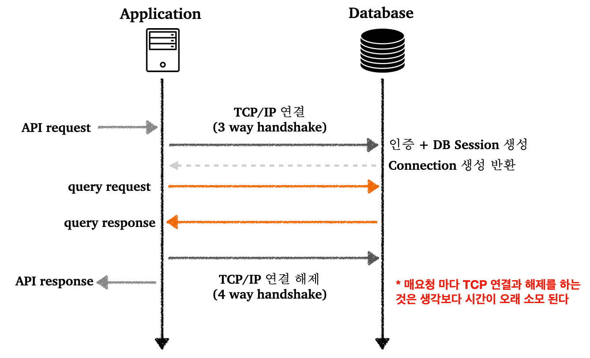
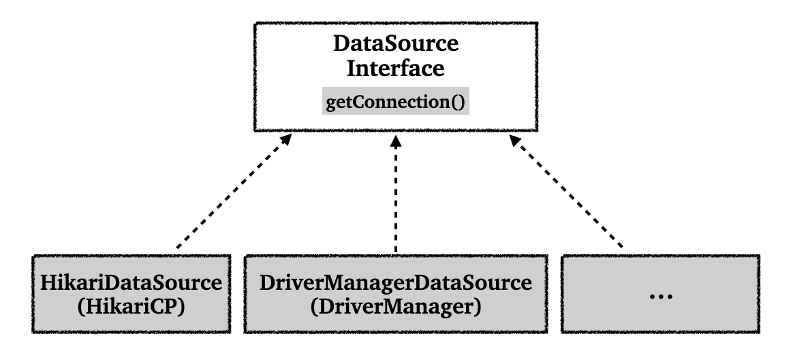
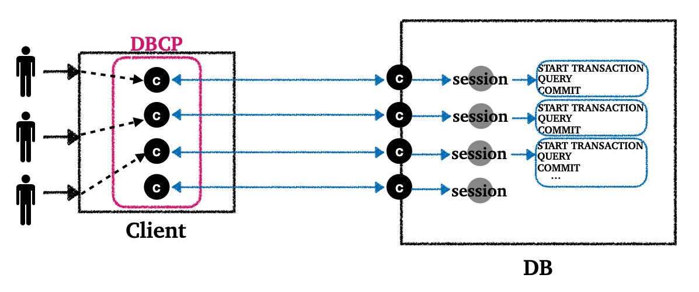
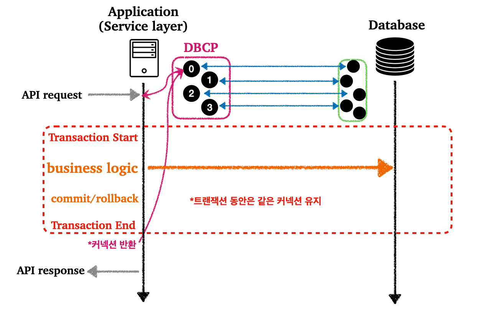
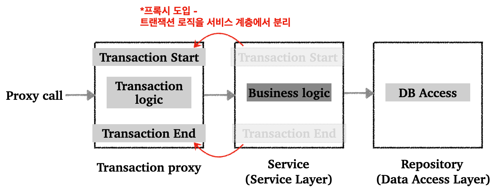

> JDBC, 데이터소스, 커넥션 풀, 트랜잭션에 대하여.

---

## Index

1. [JDBC(Java Database Connectivity)](https://github.com/seungki1011/Data-Engineering/tree/main/database/(004)Java_DB%20_Access#1-jdbcjava-database-connectivity)
   * [JDBC 소개](https://github.com/seungki1011/Data-Engineering/tree/main/database/(004)Java_DB%20_Access#11-jdbc-%EC%86%8C%EA%B0%9C)
   * [JDBC 사용 - 1(`DriverManager`)](https://github.com/seungki1011/Data-Engineering/tree/main/database/(004)Java_DB%20_Access#12-jdbc-%EC%82%AC%EC%9A%A9---1drivermanager)
     * 등록(`insert`)
     * 조회(`select`)
     * 수정, 삭제(`update`, `delete`)
     * 테스트 코드로 동작 확인
   * [JDBC 사용 - 2(`DBCP`)](https://github.com/seungki1011/Data-Engineering/tree/main/database/(004)Java_DB%20_Access#13-jdbc-%EC%82%AC%EC%9A%A9---2dbcp)
     * `DBCP(커넥션 풀)` 소개
     * `DataSource`
     * 커넥션 풀 사용하기(`HikariDataSource`)
   * [JDBC 사용 -3(스프링 사용 x)](https://github.com/seungki1011/Data-Engineering/tree/main/database/(004)Java_DB%20_Access#14-jdbc-%EC%82%AC%EC%9A%A9---3%EC%8A%A4%ED%94%84%EB%A7%81-%EC%82%AC%EC%9A%A9-x)
     * [프로젝트, DB 설정](https://github.com/seungki1011/Data-Engineering/tree/main/database/(004)Java_DB%20_Access#141-%ED%94%84%EB%A1%9C%EC%A0%9D%ED%8A%B8-db-%EC%85%8B%ED%8C%85)
     * [`dbutil` 구현](https://github.com/seungki1011/Data-Engineering/tree/main/database/(004)Java_DB%20_Access#142-dbutil-%EA%B5%AC%ED%98%84)
     * [커넥션 생성, `DatabaseMetaData` 확인](https://github.com/seungki1011/Data-Engineering/tree/main/database/(004)Java_DB%20_Access#143-%EC%BB%A4%EB%84%A5%EC%85%98-%EC%83%9D%EC%84%B1-databasemetadata-%ED%99%95%EC%9D%B8)
     * [`Statement` 사용](https://github.com/seungki1011/Data-Engineering/tree/main/database/(004)Java_DB%20_Access#144-statement-%EC%82%AC%EC%9A%A9)
       * `executeQuery()`
       * `executeUpdate()`
       * `executeBatch()`
     * [`PreparedStatement` 사용](https://github.com/seungki1011/Data-Engineering/tree/main/database/(004)Java_DB%20_Access#145-preparedstatement-%EC%82%AC%EC%9A%A9)
     * `CallableStatement` 사용
   * [`POJO` 클래스로 매핑](https://github.com/seungki1011/Data-Engineering/tree/main/database/(004)Java_DB%20_Access#15-pojo-%ED%81%B4%EB%9E%98%EC%8A%A4-%EC%82%AC%EC%9A%A9)
     * [`POJO` 란](https://github.com/seungki1011/Data-Engineering/tree/main/database/(004)Java_DB%20_Access#151-pojo%EB%9E%80)
     * [`POJO` 클래스에 매핑 후 사용](https://github.com/seungki1011/Data-Engineering/tree/main/database/(004)Java_DB%20_Access#152-pojo-%ED%81%B4%EB%9E%98%EC%8A%A4%EC%97%90-%EB%A7%A4%ED%95%91-%ED%9B%84-%EC%82%AC%EC%9A%A9)
2. [트랜잭션(Transaction)](https://github.com/seungki1011/Data-Engineering/tree/main/database/(004)Java_DB%20_Access#2-%ED%8A%B8%EB%9E%9C%EC%9E%AD%EC%85%98transaction)
   * [트랜잭션 복습](https://github.com/seungki1011/Data-Engineering/tree/main/database/(004)Java_DB%20_Access#21-%ED%8A%B8%EB%9E%9C%EC%9E%AD%EC%85%98-%EB%B3%B5%EC%8A%B5)
   * [기존 트랜잭션 적용의 문제](https://github.com/seungki1011/Data-Engineering/tree/main/database/(004)Java_DB%20_Access#22-%EA%B8%B0%EC%A1%B4-%ED%8A%B8%EB%9E%9C%EC%9E%AD%EC%85%98-%EC%A0%81%EC%9A%A9%EC%9D%98-%EB%AC%B8%EC%A0%9C)
   * [스프링에서의 트랜잭션 처리](https://github.com/seungki1011/Data-Engineering/tree/main/database/(004)Java_DB%20_Access#23-%EC%8A%A4%ED%94%84%EB%A7%81%EC%97%90%EC%84%9C%EC%9D%98-%ED%8A%B8%EB%9E%9C%EC%9E%AD%EC%85%98-%EC%B2%98%EB%A6%AC)
     * `PlatformTransactionManager`
     * `TransactionTemplate`
     * `@Transactional`(트랜잭션 AOP)

---

## 1) JDBC(Java Database Connectivity)

### 1.1 JDBC 소개

JDBC의 등장 배경부터 살펴보자.

기존 자바 애플리케이션에서 데이터베이스에 접근하기 위해서는 특정 벤더가 제공해주는 API를 사용했다 (또는 ODBC). 문제는 이런 데이터베이스의 사용법은 각각의 벤더마다 달랐다.

<br>

<p align="center">    </p>

<p align='center'>JDBC 이전</p>

이러한 문제를 해결하기 위해서 JDBC라는 자바 표준 인터페이스가 등장한다.

<br>

<p align="center">    </p>

<p align='center'>JDBC 인터페이스</p>

* JDBC(Java Database Connectivity)는 자바에서 데이터베이스에 접속할 수 있도록 하는 자바 API
* JDBC는 데이터베이스에서 자료를 쿼리하거나 업데이트하는 방법을 제공한다


* JDBC는 다음 3가지 기능을 표준 인터페이스로 정의해서 제공한다
  * `java.sql.Connection` - 연결
  * `java.sql.Statement` - SQL을 담은 내용
  * `java.sql.ResultSet` - SQL 요청 응답


* JDBC에는 `JDBC-ODBC bridge Driver`, `Native-API Driver`, `Network Protocol Driver`, `Thin Driver` 의 4가지 드라이버가 존재한다. 여기서 `Thin Driver`를 보편적으로 많이 사용한다
* 참고 : [https://www.javatpoint.com/jdbc-driver#](https://www.javatpoint.com/jdbc-driver#)

<br>

<p align="center">    </p>

<p align='center'>JDBC 이후</p>

* JDBC 인터페이스를 사용하기 위해서는 각 DB 벤더에서 DB에 맞게 구현한 라이브러리로 제공한다. 이를 JDBC 드라이버라고 한다.
* JDBC의 등장으로 2가지 문제가 해결되었다
  * 데이터베이스 벤더를 변경시 애플리케이션 서버의 데이터베이스 코드도 변경해야하는 문제. 애플리케이션은 JDBC 인터페이스만 의존하기 때문에, 구현 라이버러리만 변경하고 애플리케이션 서버의 코드를 유지할 수 있다
  * 각 벤더사의 사용법을 새로 익혀야 했던 문제

<br>

> JDBC의 한계
>
> * 각각의 데이터베이스 마다 SQL이나 데이터타입의 사용법이 일부 다르다
> * JDBC 코드는 변경하지 않더라도, SQL은 해당 데이터베이스에 맞게 사용해야 한다
> * 반복되는 보일러 플레이트(boiler-plate) 코드가 많다
>
> <br>
>
> 추후에도 설명하겠지만 이를 위해서 SQL Mapper 기술인 JdbcTemplate 그리고 ORM 기술인 JPA(Java Persistence API)를 사용할 수 있다.
>
> 이런 기술들도 결국에 JDBC를 이용해서 동작하기 때문에, JDBC의 사용법을 알아두는 것은 중요하다.

<br>

---

### 1.2 JDBC 사용 - 1(`DriverManager`)

JDBC의 사용법에 대해서 알아보자. (`DriverManager` 사용)

먼저 MySQL 컨테이너를 만들고 스프링 부트 애플리케이션에 연결해보자.

* [컨테이너를 설정하고 실행하는 방법](../../container/(001)Docker#4-docker-compose)

<br>

`build.gradle`에 `runtimeOnly 'com.mysql:mysql-connector-j'` 추가

```groovy
dependencies {
	implementation 'org.springframework.boot:spring-boot-starter-jdbc'
	implementation 'org.springframework.boot:spring-boot-starter-web'
	compileOnly 'org.projectlombok:lombok'
	runtimeOnly 'com.mysql:mysql-connector-j'
	annotationProcessor 'org.projectlombok:lombok'
	testImplementation 'org.springframework.boot:spring-boot-starter-test'

	testCompileOnly 'org.projectlombok:lombok'
	testAnnotationProcessor 'org.projectlombok:lombok'
}
```

<br>

데이터베이스 이름은 `test_database`로 하자.

`resources/schema.sql` 파일을 만들자.

```sql
drop table if exists member;

create table member (
     member_id varchar(10),
     money integer not null default 0,
     primary key (member_id)
);

insert into member(member_id, money) values ('hi1',10000);
insert into member(member_id, money) values ('hi2',20000);
```

* 초기 데이터 입력은 `data.sql`에 정의하는것이 권장 되지만, 편의상 `schema.sql`에 그냥 쿼리 작성 함

<br>

`member` 테이블을 조회하면 다음과 같이 쿼리 결과가 나와야한다.

```
mysql> select * from member;
+-----------+-------+
| member_id | money |
+-----------+-------+
| hi1       | 10000 |
| hi2       | 20000 |
+-----------+-------+
```

<br>

---

#### 1.2.1 데이터베이스 연결

JDBC의 `DriverManager`를 통한 연결에 대해서 알아보자.

<br>

<p align="center">    </p>

* MySQL 드라이버는 JDBC의 `java.sql.Connection` 인터페이스를 구현한 `com.mysql.cj.jdbc.ConnectionImpl`이라는 구현체를 제공

<br>

<p align="center">    </p>

<p align='center'>DriverManager 커넥션 요청 흐름</p>

* `DriverManager`는 라이브러리에 등록된 데이터베이스 드라이버들을 관리하고, 커넥션을 획득하는 기능을 제공한다

<br>

이제 데이터베이스에 연결하기 위한 코드를 작성해보자.

MySQL 데이터베이스에 접속하기 위한 상수 정의.

```java
public abstract class ConnectionConst {
  
    public static final String URL = "jdbc:mysql://localhost:3306/test_database?serverTimezone=Asia/Seoul";
    public static final String USERNAME = "root";
    public static final String PASSWORD = "admin";

}
```

* 뒤에서 다루겠지만, 스프링 부트를 이용하는 경우 `application.properties`에 데이터베이스의 속성 설정하고, `DataSource`를 의존성 주입으로 받아서 사용가능
* 쉽게 말해서 `application.properties`에 속성 등록하면 `DataSource`를 자동으로 생성해준다

<br>

JDBC를 사용해서 실제로 데이터베이스 연결하는 코드를 작성해보자.

```java
@Slf4j
public class DBConnectionUtil {
  
    public static Connection getConnection() {
        Connection connection = null;
        try {
            // ConnectionConst 상수 static import 처리
            connection = DriverManager.getConnection(URL, USERNAME, PASSWORD);
            log.info("get connection={}, class={}", connection, connection.getClass());
            return connection;
        } catch (SQLException e) {
            throw new IllegalStateException(e);
        }
    }
}
```

* 데이터베이스에 연결하기 위해서 JDBC가 제공하는 `DriverManager.getConnection()`을 사용
* `getConnection()`은 라이브러리에 있는 데이터베이스 드라이버를 찾아서 해당 드라이버가 제공하는 커넥션 반환

<br>

동작을 확인하기 위한 테스트 코드를 작성해보자.

```java
@Slf4j
public class DBConnectionUtilTest {

    @Test
    void connection() {
        Connection connection = DBConnectionUtil.getConnection();
        Assertions.assertThat(connection).isNotNull();
    }
}
```

```
[main] INFO de.jdbc.connection.DBConnectionUtil -- get connection=com.mysql.cj.jdbc.ConnectionImpl@c94fd30, class=class com.mysql.cj.jdbc.ConnectionImpl
```

* `com.mysql.cj.jdbc.ConnectionImpl` : MySQL 드라이버가 제공하는 MySQL 전용 커넥션

<br>

---

#### 1.2.2 등록(`insert`)

`Member` 데이터를 데이터베이스에 등록하는 기능을 JDBC를 사용해서 개발해보자.

<br>

```java
@Data
@NoArgsConstructor
public class Member {

    private String memberId;
    private int money;

}
```

* 롬복의 `@Data` :  `@RequiredArgsConstructor`, `@Getter`, `@Setter`, `@ToString`, `@EqualsAndHashCode` 포함
* `memberId` : 회원의 아이디
* `money` : 회원이 소지한 금액

<br>

회원 객체를 데이터베이스에 저장하는 코드를 작성해보자.

```java
/**
 * DriverManager 사용
 */
@Slf4j
public class DriverManagerMemberRepository {

    public Member save(Member member) throws SQLException {
        String sql = "insert into member(member_id, money) values(?, ?)";

        Connection con = null;
        PreparedStatement pstmt = null;

        try {
            con = getConnection();
            pstmt = con.prepareStatement(sql);
            // 파라미터 바인딩
            pstmt.setString(1, member.getMemberId());
            pstmt.setInt(2, member.getMoney());
          	// 쿼리 실행
            pstmt.executeUpdate();
            return member;
        } catch (SQLException e) {
            log.error("db error", e);
            throw e;
        } finally {
            // 외부 자원 해제
            close(con, pstmt, null);
        }

    }

    // 할당된 자원의 해제 과정 중에 예외 발생에 대한 처리를 해야 안정적인 코드
    private void close(Connection con, Statement stmt, ResultSet rs) {
        
        if(rs != null) {
            try {
                rs.close();
            } catch (SQLException e) {
                log.info("error", e);
            }
        }

        if(stmt != null) {
            try {
                stmt.close();
            } catch (SQLException e) {
                log.info("error", e);
            }
        }

        if(con != null) {
            try {
                con.close();
            } catch (SQLException e) {
                log.info("error", e);
            }
        }
    }
		
    private static Connection getConnection() {
        return DBConnectionUtil.getConnection();
    }
}
```

* `getConnection()` : `DBConnectionUtil`를 통해서 데이터베이스 커넥션을 획득
* `sql` : 데이터베이스에 전달할 쿼리 정의


* `con.prepareStatement(sql)` : 데이터베이스에 전달할 SQL과 파라미터로 전달할 데이터들을 준비
  * 각 `?`에 바인딩할 값 지정


* `pstmt.executeUpdate()` : `Statement`를 통해 준비된 `sql`을 커넥션을 통해 데이터베이스에 전달
  * 데이터 추가, 변경에는 `executeUpdate()` 사용하면 됨


* `close()` : 쿼리 실행후 리소스 정리. 리소스 정리는 항상 역순으로 진행
  * `ResultSet`은 나중에 결과 조회 때 사용한다


* SQL 인젝션을 방지하기 위해서 `PreparedStatement`의  `?`를 통한 파라미터 바인딩 방식을 사용한다

<br>

---

#### 1.2.3 조회(`select`)

데이터베이스에 저장한 데이터를 조회하는 기능을 개발해보자.

<br>

회원을 조회하는 코드를 추가하자.

```java
public Member findById(String memberId) throws SQLException {
    String sql = "select * from member where member_id = ?";

    Connection con = null;
    PreparedStatement pstmt = null;
    ResultSet rs = null;

    try {
        con = getConnection();
        pstmt = con.prepareStatement(sql);
        pstmt.setString(1, memberId);
        // 데이터 조회를 위해서는 executeQuery() 사용 
        rs = pstmt.executeQuery();
				
      	// 목적은 회원 하나를 찾아서 조회
        if (rs.next()) {
            Member member = new Member();
            member.setMemberId(rs.getString("member_id"));
            member.setMoney(rs.getInt("money"));
            return member;
        } else {
            throw new NoSuchElementException("member not found! memberId = " + memberId);
        }
    } catch (SQLException e) {
        log.error("DB error", e);
        throw e;
    } finally {
        close(con, pstmt, rs);
    }
}
```

* `executeQuery()`는 결과를 `ResultSet`에 담아서 반환한다
* `ResultSet`의 모양은 아래 그림과 같다

<br>

<p align="center">    </p>

* `findById()`의 목적은 회원 하나를 찾아서 조회하는 것이기 때문에, `if`를 사용해서 `member` 반환

<br>

---

#### 1.2.4 수정, 삭제(`update`, `delete`)

데이터베이스에 등록된 데이터를 수정 또는 삭제해보자.

<br>

다음 코드를 추가하자.

```java
public void update(String memberId, int money) throws SQLException {
    String sql = "update member set money=? where member_id=?";

    Connection con = null;
    PreparedStatement pstmt = null;

    try {
        con = getConnection();
        pstmt = con.prepareStatement(sql);
        pstmt.setInt(1, money);
        pstmt.setString(2, memberId);
        int resultSize = pstmt.executeUpdate();
        log.info("resultSize = {}", resultSize);
    } catch (SQLException e) {
        log.error("DB error", e);
    } finally {
        close(con, pstmt, null);
    }
}

public void delete(String memberId) throws SQLException {
    String sql = "delete from member where member_id=?";

    Connection con = null;
    PreparedStatement pstmt = null;

    try {
        con = getConnection();
        pstmt = con.prepareStatement(sql);
        pstmt.setString(1, memberId);
        pstmt.executeUpdate();
    } catch (SQLException e) {
        log.error("DB error", e);
        throw e;
    } finally {
        close(con, pstmt, null);
    }
}
```

* `executeUpdate()`은 쿼리 실행 후 영향받은 row의 수를 반환한다
  * 위의 경우에서는 회원 하나의 데이터만 변경하기 때문에 `1`을 반환한다

<br>

---

#### 1.2.5 테스트 코드로 동작 확인

테스트 코드로 지금까지 작성한 기능들의 동작을 확인해보자.

```java
@Slf4j
class DriverManagerMemberRepositoryTest {

    DriverManagerMemberRepository repository = new DriverManagerMemberRepository();

    @Test
    void crud() throws SQLException {
        // save()
        Member member = new Member("member1", 10000);
        repository.save(member);

        // findById()
        Member findMember = repository.findById(member.getMemberId());
        log.info("findMember = {}", findMember);
        Assertions.assertThat(findMember).isEqualTo(member);

        // update()
        // money : 10000 -> 30000으로 수정
        repository.update(member.getMemberId(), 30000);
        Member updatedMember = repository.findById(member.getMemberId());
        Assertions.assertThat(updatedMember.getMoney()).isEqualTo(30000);

        // delete()
        repository.delete(member.getMemberId());
        Assertions.assertThatThrownBy(() -> repository.findById(member.getMemberId()))
                .isInstanceOf(NoSuchElementException.class);
    }
}
```

<br>

---

### 1.3 JDBC 사용 - 2(`DBCP`)

#### 1.3.1 `DBCP(커넥션 풀)` 소개

데이터베이스 커넥션 방법인 DBCP(Database Connection Pool)에 대해서 알아보자.

먼저 기존 데이터베이스 커넥션 방법의 단점에 대해서 알아보자.

<br>

<p align="center">    </p>

<p align='center'>기존 커넥션 방식</p>

* 커넥션 획득 과정은 `TCP/IP` 연결 및 해제를 포함한 복잡한 과정을 거친다
* 매요청 마다 커넥션을 새로 만들어야 하고 `TCP/IP`의 연결도 획득해야하기 때문에 결과적으로 응답 속도에 영향을 준다
* 이런 문제를 해결하기 위해서 `커넥션 풀(DBCP)`이라는 방법을 사용한다

<br>

커넥션 풀을 다음 그림을 통해서 알아보자.

<p align="center">    </p>

<p align='center'>DBCP</p>

* `커넥션 풀`은 이름 그대로, 커넥션들을 미리 만들어두고 풀에 모아두는 방식이다
* `커넥션 풀`에 들어있는 커넥션은 TCP/IP로 연결이 되어있는 상태이기 때문에 언제든지 쿼리를 DB에 전달 가능하다
* 기존 커넥션을 획득하던 방법과 달리, `커넥션 풀`을 통해 이미 생성되어 있는 커넥션을 객체 참조로 가져다 쓰면 된다
* 애플리케이션 로직은 `커넥션 풀`에서 받은 커넥션을 이용해서 쿼리를 전달하고 결과를 처리한다
* 이제 커넥션 종료(`close()`)는 커넥션을 `커넥션 풀`로 다시 돌려주는 것이다


* `커넥션 풀`로 얻을 수 있는 이점이 크기 때문에 실무에서는 기본으로 사용한다
* `커넥션 풀`에서 설정하는 `maximumPoolSize`나 데이터베이스에서 설정할 수 있는 `max_connections`과 같은 값은 성능 테스트를 통해서 정해야 한다


* `커넥션 풀`을 구현한 오픈소스 중에서 `hikariCP`를 주로 사용한다

<br>

---

#### 1.3.2 `DataSource`

커넥션 풀을 사용하는 방법에 대해서 알아보기 전에 `DataSource` 인터페이스에 대해서 알아보자.

커넥션을 얻는 방법은 앞서 소개한 JDBC `DriverManager`를 직접 사용하거나, `커넥션 풀`을 사용하는 등 다양한 방법이 존재한다.

만약 우리가 커넥션을 획득하는 방법을 `DriverManager`에서 `커넥션 풀`로 변경한다면, 해당 애플리케이션 코드로 변경해야 한다. 자바는 이런 문제를 해결하기 위해서 `DataSource`라는 인터페이스를 제공한다. `DataSource` 인터페이스는 커넥션을 획득하는 방법을 추상화한 인터페이스이다.

<br>

<p align="center">    </p>

<p align='center'>DataSource 인터페이스</p>

<br>

그럼 간단하게 `DataSource`가 적용된 `DriverManager`인 `DriverManagerDataSource`를 사용하는 테스트 코드를 작성해보자. (스프링이 제공하는 코드임)

```java
@Slf4j
public class DriverManagerDataSourceTest {

    @Test
    void driverManager() throws SQLException {
        Connection con1 = DriverManager.getConnection(URL, USERNAME, PASSWORD);
        Connection con2 = DriverManager.getConnection(URL, USERNAME, PASSWORD);
        log.info("connection={}, class={}", con1, con1.getClass());
        log.info("connection={}, class={}", con2, con2.getClass());
    }

    @Test
    void dataSourceDriverManager() throws SQLException {
        DriverManagerDataSource dataSource = new DriverManagerDataSource(URL, USERNAME, PASSWORD);
        useDataSource(dataSource);
    }

    private void useDataSource(DataSource dataSource) throws SQLException {
        Connection con1 = dataSource.getConnection();
        Connection con2 = dataSource.getConnection();
        log.info("connection={}, class={}", con1, con1.getClass());
        log.info("connection={}, class={}", con2, con2.getClass());
    }
  
}
```

```
14:38:55.167 [main] INFO de.jdbc.connection.DriverManagerDataSourceTest -- connection=com.mysql.cj.jdbc.ConnectionImpl@2c4d1ac, class=class com.mysql.cj.jdbc.ConnectionImpl
14:38:55.168 [main] INFO de.jdbc.connection.DriverManagerDataSourceTest -- connection=com.mysql.cj.jdbc.ConnectionImpl@2ef14fe, class=class com.mysql.cj.jdbc.ConnectionImpl
14:38:55.210 [main] INFO de.jdbc.connection.DriverManagerDataSourceTest -- connection=com.mysql.cj.jdbc.ConnectionImpl@3d1848cc, class=class com.mysql.cj.jdbc.ConnectionImpl
14:38:55.210 [main] INFO de.jdbc.connection.DriverManagerDataSourceTest -- connection=com.mysql.cj.jdbc.ConnectionImpl@7dda48d9, class=class com.mysql.cj.jdbc.ConnectionImpl
```

* `Connection con1 = DriverManager.getConnection(URL, USERNAME, PASSWORD);`
  * 기존 `DriverManager`를 사용했을때는 커넥션을 획득할 때 마다 필요한 파라미터를 계속 명시했어야 함


* `DriverManagerDataSource dataSource = new DriverManagerDataSource(URL, USERNAME, PASSWORD);`
* `Connection con1 = dataSource.getConnection();`
  * `DataSource`를 사용하는 방식은 처음 객체 생성때만 파라미터를 명시하고, 커넥션 획득 시에는 단순히 `dataSource.getConnection()`으로 획득 가능 함 


* `DataSource`를 사용하는 방식은 필요한 속성을 설정하는 곳과 사용하는 곳을 분리할 수 있도록 해준다

<br>

> `application.properties`
>
> ```properties
> spring.application.name=jdbc
> # spring 2.5.x 부터 deprecated
> # spring.datasource.initialization-mode=always
> # 애플리케이션 시작시 schema.sql 적용
> spring.sql.init.mode=always
> spring.datasource.driver-class-name=com.mysql.cj.jdbc.Driver
> # 3306 포트의 mysql의 test_database라는 엔드포인트 설정
> # 스프링 부트는 아래의 속성으로 DataSource 자동 빈 등록
> spring.datasource.url=jdbc:mysql://localhost:3306/test_database?serverTimezone=Asia/Seoul
> spring.datasource.username=root
> spring.datasource.password=admin
> ```
>
> * 스프링 부트는 `DataSource`를 스프링 빈에 자동으로 등록한다
> * 이때 스프링 부트는 `application.properties`에 있는 속성을 이용해서 `DataSource`를 생성한다
>
> <br>

<br>

---

#### 1.3.3 커넥션 풀 사용하기(`HikariDataSource`)

기존에 사용하던 코드를 `HikariCP`를 사용하도록 작성해보자.

먼저 `DataSource`를 적용해보자.

<br>

```java
/**
 * DataSource, JdbcUtils 사용
 */
@Slf4j
public class CPMemberRepository {
		
    private final DataSource dataSource;
		// DataSource 주입받아서 사용
    public CPMemberRepository(DataSource dataSource) {
        this.dataSource = dataSource;
    }

    public Member save(Member member) throws SQLException {
        String sql = "insert into member(member_id, money) values(?, ?)";

        Connection con = null;
        PreparedStatement pstmt = null;

        try {
            con = getConnection();
            pstmt = con.prepareStatement(sql);
            pstmt.setString(1, member.getMemberId());
            pstmt.setInt(2, member.getMoney());
            pstmt.executeUpdate();
            return member;
        } catch (SQLException e) {
            log.error("db error", e);
            throw e;
        } finally {
            close(con, pstmt, null);
        }
    }

    public void update(String memberId, int money) throws SQLException {
        String sql = "update member set money=? where member_id=?";

        Connection con = null;
        PreparedStatement pstmt = null;

        try {
            con = getConnection();
            pstmt = con.prepareStatement(sql);
            pstmt.setInt(1, money);
            pstmt.setString(2, memberId);
            int resultSize = pstmt.executeUpdate();
            log.info("resultSize = {}", resultSize);
        } catch (SQLException e) {
            log.error("DB error", e);
        } finally {
            close(con, pstmt, null);
        }
    }

    public void delete(String memberId) throws SQLException {
        String sql = "delete from member where member_id=?";

        Connection con = null;
        PreparedStatement pstmt = null;

        try {
            con = getConnection();
            pstmt = con.prepareStatement(sql);
            pstmt.setString(1, memberId);

            pstmt.executeUpdate();
        } catch (SQLException e) {
            log.error("DB error", e);
            throw e;
        } finally {
            close(con, pstmt, null);
        }
    }

    public Member findById(String memberId) throws SQLException {
        String sql = "select * from member where member_id = ?";

        Connection con = null;
        PreparedStatement pstmt = null;
        ResultSet rs = null;

        try {
            con = getConnection();
            pstmt = con.prepareStatement(sql);
            pstmt.setString(1, memberId);
            rs = pstmt.executeQuery();

            if (rs.next()) {
                Member member = new Member();
                member.setMemberId(rs.getString("member_id"));
                member.setMoney(rs.getInt("money"));
                return member;
            } else {
                throw new NoSuchElementException("member not found! memberId = " + memberId);
            }
        } catch (SQLException e) {
            log.error("DB error", e);
            throw e;
        } finally {
            close(con, pstmt, rs);
        }
    }

    // JdbcUtils로 close를 편리하게 구현
    private void close(Connection con, Statement stmt, ResultSet rs) {
        JdbcUtils.closeResultSet(rs);
        JdbcUtils.closeStatement(stmt);
        JdbcUtils.closeConnection(con);
    }

    private Connection getConnection() throws SQLException {
        Connection con = dataSource.getConnection();
        log.info("get connection={}, class={}", con, con.getClass());
        return con;
    }
}
```

* 외부에서 `DataSource`를 주입받아서 사용하도록 변경했다
* `JdbcUtils`를 통해서 `close()`를 더 편리하게 구현

<br>

`DataSource`를 사용하는 `CPMemberRepository`에 `HikariDataSource`를 사용하는 테스트 코드를 작성해보자.

```java
@Slf4j
class CPMemberRepositoryTest {

    // DataSource를 주입받아서 사용할 것이다
    // DriverManagerMemberRepository repository = new DriverManagerMemberRepository();

    CPMemberRepository repository;
  
    @BeforeEach
    void beforeEach() throws Exception {
        HikariDataSource dataSource = new HikariDataSource();
        dataSource.setJdbcUrl(URL);
        dataSource.setUsername(USERNAME);
        dataSource.setPassword(PASSWORD);
      
        dataSource.setMaximumPoolSize(10);
        dataSource.setPoolName("MyPool");

        // CPMemberRepository는 DataSource 주입이 필요하다
        repository = new CPMemberRepository(dataSource);
    }

    @Test
    void crud() throws SQLException {
        // save()
        Member member = new Member("member1", 10000);
        repository.save(member);

        // findById
        Member findMember = repository.findById(member.getMemberId());
        Assertions.assertThat(findMember).isEqualTo(member);

        // update()
        // money : 10000 -> 30000으로 수정
        repository.update(member.getMemberId(), 30000);
        Member updatedMember = repository.findById(member.getMemberId());
        Assertions.assertThat(updatedMember.getMoney()).isEqualTo(30000);

        // delete()
        repository.delete(member.getMemberId());
        Assertions.assertThatThrownBy(() -> repository.findById(member.getMemberId()))
                .isInstanceOf(NoSuchElementException.class);
    }
}
```

```
15:24:28.246 [main] INFO com.zaxxer.hikari.HikariDataSource -- MyPool - Starting...
15:24:28.458 [main] INFO com.zaxxer.hikari.pool.HikariPool -- MyPool - Added connection com.mysql.cj.jdbc.ConnectionImpl@4b6e2263
15:24:28.458 [main] INFO com.zaxxer.hikari.HikariDataSource -- MyPool - Start completed.
15:24:28.460 [main] INFO de.jdbc.repository.CPMemberRepository -- get connection=HikariProxyConnection@1866229258 wrapping com.mysql.cj.jdbc.ConnectionImpl@4b6e2263, class=class com.zaxxer.hikari.pool.HikariProxyConnection
15:24:28.494 [main] INFO de.jdbc.repository.CPMemberRepository -- get connection=HikariProxyConnection@1632497828 wrapping com.mysql.cj.jdbc.ConnectionImpl@4b6e2263, class=class com.zaxxer.hikari.pool.HikariProxyConnection
15:24:28.526 [main] INFO de.jdbc.repository.CPMemberRepository -- get connection=HikariProxyConnection@1060703587 wrapping com.mysql.cj.jdbc.ConnectionImpl@4b6e2263, class=class com.zaxxer.hikari.pool.HikariProxyConnection
15:24:28.532 [main] INFO de.jdbc.repository.CPMemberRepository -- resultSize = 1
15:24:28.532 [main] INFO de.jdbc.repository.CPMemberRepository -- get connection=HikariProxyConnection@1514214932 wrapping com.mysql.cj.jdbc.ConnectionImpl@4b6e2263, class=class com.zaxxer.hikari.pool.HikariProxyConnection
15:24:28.534 [main] INFO de.jdbc.repository.CPMemberRepository -- get connection=HikariProxyConnection@1317375498 wrapping com.mysql.cj.jdbc.ConnectionImpl@4b6e2263, class=class com.zaxxer.hikari.pool.HikariProxyConnection
15:24:28.537 [main] INFO de.jdbc.repository.CPMemberRepository -- get connection=HikariProxyConnection@1202220987 wrapping com.mysql.cj.jdbc.ConnectionImpl@4b6e2263, class=class com.zaxxer.hikari.pool.HikariProxyConnection
```

* `HikariCP` 사용시 같은 커넥션인 `ConnectionImpl@4b6e2263`이 계속 재사용 되는 것을 확인 가능
  * 사용하던 커넥션을 되돌려주고 다시 가져와서 사용되는 것이 반복되는 모습이다
  * 동시다발적으로 여러 요청이 들어오는 경우에는 커넥션 풀의 커넥션을 다양하게 가져간다

<br>

---

### 1.4 JDBC 사용 - 3(스프링 사용 x)

스프링을 이용하지 않는 JDBC의 사용 연습.

모든 예제는 귀찮아서 `SQLException`을 굳이 런타임 예외로 변환하지 않고 그대로 사용함.

<br>

#### 1.4.1 프로젝트, DB 셋팅

새로운 프로젝트를 위한 `dependency`는 다음과 같게.

```build.gradle```

```groovy
dependencies {
    compileOnly 'org.projectlombok:lombok:1.18.32'
    annotationProcessor 'org.projectlombok:lombok:1.18.32'

    testCompileOnly 'org.projectlombok:lombok:1.18.32'
    testAnnotationProcessor 'org.projectlombok:lombok:1.18.32'

    implementation 'org.slf4j:slf4j-api:1.7.32'
    implementation 'ch.qos.logback:logback-classic:1.2.6'

    implementation 'mysql:mysql-connector-java:8.0.30'
    testImplementation platform('org.junit:junit-bom:5.9.1')
    testImplementation 'org.junit.jupiter:junit-jupiter'
}
```

<br>

MySQL 컨테이너를 띄워서 사용하자.

```docker-compose.yaml```

```yaml
services:
  mysql:
    image: mysql:8.1
    container_name: mysql-container
    restart: always
    ports:
      - "3306:3306"
    environment:
      MYSQL_ROOT_PASSWORD: admin
      MYSQL_DATABASE: test_database
      MYSQL_USER: my_username
      MYSQL_PASSWORD: my_password
    volumes:
      - /Users/{사용자이름}/Desktop/mysql-volume:/var/lib/mysql
```

<br>

데이터베이스와 테이블을 생성하자.

```mysql
CREATE SCHEMA jdbc_test;

USE jdbc_test;

CREATE TABLE product (
	  id int unsigned NOT NULL AUTO_INCREMENT,
    name varchar(255) COLLATE utf8mb4_unicode_ci NOT NULL,
    updated_at datetime NOT NULL,
    description varchar(2048) COLLATE utf8mb4_unicode_ci NOT NULL,
    price int NOT NULL,
    PRIMARY KEY (id)
) ENGINE=InnoDB DEFAULT CHARSET=utf8mb4 COLLATE=utf8mb4_unicode_ci;

INSERT INTO product (name, updated_at, description, price)
VALUES
	('shoe1', '2024-01-01 01:00:00', 'A footwear product', '20000'),
	('shoe2', '2024-01-01 02:30:00', 'A footwear product', '50000'),
	('shoe3', '2024-01-01 03:00:00', 'A footwear product', '35000'),
	('shoe4', '2024-01-01 06:00:00', 'A footwear product', '185000'),
	('cap1', '2024-01-01 05:25:00', 'A product to wear on the head', '50000'),
	('cap2', '2024-01-05 02:30:00', 'A product to wear on the head', '60000'),
	('tshirt1', '2024-01-05 03:30:00', 'A short sleave shirt', '30000'),
	('tshirt2', '2024-02-02 01:00:00', 'A short sleave shirt', '40000'),
	('tshirt3', '2024-02-03 01:00:00', 'A short sleave shirt', '50000'),
	('tshirt4', '2024-03-05 07:00:00', 'A short sleave shirt', '90000'),
	('ak47', '2024-03-13 02:30:00', 'A assault rifle', '990000'),
	('airpod', '2024-04-03 05:00:00', 'A bluetooth earphone', '230000');
```

<br>

`database.properties`에서 엔드포인트 설정을 읽어와서 `DriverManager`에 사용할 수 있도록 구현해보자.

* 귀찮아서 `SQLException`을 굳이 런타임 예외로 변환하지 않고 그대로 사용했음

`resources/database.properties`

```properties
jdbc.url=jdbc:mysql://localhost:3306/jdbc_test?serverTimezone=Asia/Seoul
jdbc.username=root
jdbc.password=admin
```

<br>

---

#### 1.4.2 `dbutil` 구현

`database.properties`에서 엔드포인트 설정을 읽어와서 `DriverManager`에 사용할 수 있도록 구현해보자.

<br>

`resources/database.properties`

```properties
jdbc.url=jdbc:mysql://localhost:3306/jdbc_test?serverTimezone=Asia/Seoul
jdbc.username=root
jdbc.password=admin
```

<br>

* `DriverManager`을 이용한 커넥션 생성을 위한 유틸 구현.
* 연결 정보를 `database.properties`에서 얻도록 유틸 구현

<br>

`dbutil/JdbcPropertiesLoader`

```java
@Slf4j
public class JdbcPropertiesLoader {
  
    private static final String PROPERTIES_FILE = "database.properties";
    private static Properties properties;

    static {
        properties = new Properties();
        try (InputStream input = JdbcPropertiesLoader.class.getClassLoader().getResourceAsStream(PROPERTIES_FILE)) {
            if (input == null) {
                System.out.println("file not found");
            }

            properties.load(input);
        } catch (IOException e) {
            log.error("JdbcPropertiesLoader error", e);
        }
    }

    public static String getUrl() {
        return properties.getProperty("jdbc.url");
    }

    public static String getUsername() {
        return properties.getProperty("jdbc.username");
    }

    public static String getPassword() {
        return properties.getProperty("jdbc.password");
    }

}
```

<br>

`dbutil/JdbcConnectionUtil`

```java
@Slf4j
public class JdbcConnectionUtil {
  
    public static String URL;
    public static String USERNAME;
    public static String PASSWORD;

    public static Connection getConnection() {
        Connection connection = null;
        try {
            URL = JdbcPropertiesLoader.getUrl();
            USERNAME = JdbcPropertiesLoader.getUsername();
            PASSWORD = JdbcPropertiesLoader.getPassword();

            connection = DriverManager.getConnection(URL, USERNAME, PASSWORD);
            return connection;
        } catch (SQLException e) {
            throw new IllegalStateException(e);
        }
    }

    public static void close(Connection con, Statement stmt, ResultSet rs) {

        if(rs != null) {
            try {
                rs.close();
            } catch (SQLException e) {
                log.error("ResultSet close error", e);
            }
        }

        if(stmt != null) {
            try {
                stmt.close();
            } catch (SQLException e) {
                log.error("Statement close error", e);
            }
        }

        if(con != null) {
            try {
                con.close();
            } catch (SQLException e) {
                log.error("Connection close error", e);
            }
        }
    }
}
```

<br>

`dbutil/ResultSetUtil`

```java
@Slf4j
public class ResultSetUtil {

    public static void printResultSet(ResultSet rs) {
        try {
            while (rs.next()) {
                System.out.println(rs.getInt(1) + " " + rs.getString(2) + " "
                        + rs.getDate(3) + " " + rs.getString(4) + " "
                        + rs.getInt(5));
            }
        } catch (SQLException e) {
            log.error("printResultSet() error", e);
        }
    }
}
```

* 결과(`ResultSet`)를 출력하는 용도


* `getXXX(int columnIndex)` : 현재 커서가 가리키고 있는 튜플의 `columnIndex`에 해당하는 컬럼의 값을 가져온다
* `getXXX(String columnName)` : 현재 커서가 가리키고 있는 튜플의 `columnName`에 해당하는 컬럼의 값을 가져온다
* `getXXX()` 메서드는 다양하게 존재한다
  * `getString()`
  * `getBlob()`
  * `getInt()`
  * `getClob()`


* `next()` : 커서를 현재 위치에서 한 row(튜플) 다음으로 이동
* `previous()` : 커서를 한 row 이전으로 이동
* `first()` : `ResultSet`의 첫 번째 튜플로 커서 이동
* `last()` : 마지막 위치로 커서 이동 

<br>

---

#### 1.4.3 커넥션 생성, `DatabaseMetaData` 확인 

`DatabaseMetaData` 객체는 사용하는 DB의 메타정보를 제공한다.

커넥션을 생성해보고, 연결한 DB의 메타정보를 확인해보자.

<br>

 ```java
 @Slf4j
 public class ConnectMain {
     public static void main(String[] args) {
 
         Connection con = null;
 
         // 예외 처리는 JdbcConnectionUtil.getConnection()에서 전부 처리
         con = JdbcConnectionUtil.getConnection();
 
         try {
             DatabaseMetaData dbmd = con.getMetaData();
             log.info("getDriverName() = {}, getDriverVersion = {}", dbmd.getDriverName(), dbmd.getDriverVersion());
           
         } catch (SQLException e) {
             log.error("DatabaseMetaData error", e);
         } finally {
             JdbcConnectionUtil.close(con, null, null);
         }
     }
 }
 ```

```
16:11:49.706 [main] INFO ConnectMain - getDriverName() = MySQL Connector/J, getDriverVersion = mysql-connector-java-8.0.30 (Revision: 1de2fe873fe26189564c030a343885011412976a)
```

* `DatabaseMetaData` 객체를 통해서 벤더가 제공하는 DB의 스펙에 대한 설명을 얻을 수 있다.
  * 이런 정보를 이용해서 특정 버전에 따라 코드의 동작이 달라지도록 코드를 구현할 수 있음

<br>

---

#### 1.4.4 `Statement` 사용

이제 ``Statement``와 그 주요 메서드들을 사용해보자.

<br>

##### 1.4.4.1 `executeQuery()`

```java
@Slf4j
public class ExecuteQueryMain {
    public static void main(String[] args) {

        Connection con = null;
        Statement stmt = null;
        ResultSet rs = null;

        try {
            // Connection 생성
            con = JdbcConnectionUtil.getConnection();

            // 1. Statement 사용
            stmt = con.createStatement(); // Statement 객체 생성
            // executeQuery() 사용
            rs = stmt.executeQuery("select * from product");

            ResultSetUtil.printResultSet(rs);

        } catch (SQLException e) {
            log.error("DB error", e);
        } finally {
            JdbcConnectionUtil.close(con, stmt, rs);
        }
    }

}
```

```
1 shoe1 2024-01-01 A footwear product 20000
2 shoe2 2024-01-01 A footwear product 50000
3 shoe3 2024-01-01 A footwear product 35000
4 shoe4 2024-01-01 A footwear product 185000
5 cap1 2024-01-01 A product to wear on the head 50000
6 cap2 2024-01-05 A product to wear on the head 60000
7 tshirt1 2024-01-05 A short sleave shirt 30000
8 tshirt2 2024-02-02 A short sleave shirt 40000
9 tshirt3 2024-02-03 A short sleave shirt 50000
10 tshirt4 2024-03-05 A short sleave shirt 90000
11 ak47 2024-03-13 A assault rifle 990000
12 airpod 2024-04-03 A bluetooth earphone 230000
13 sunglass1 2024-04-12 A sunglass 120000
```

* `ResultSet executeQuery(String sql)` : SQL을 실행 후 결과에 대한 `ResultSet`을 반환한다 (조회에 사용)
* `Statement createStatement()` : `Statement` 객체 생성

<br>

---

##### 1.4.4.2 `executeUpdate()`

```java
@Slf4j
public class ExecuteUpdateMain {
    public static void main(String[] args) {

        Connection con = null;
        Statement stmt = null;
        ResultSet rs = null;

        try {
            con = JdbcConnectionUtil.getConnection();
            stmt = con.createStatement();

            // executeUpdate() 사용 - 튜플 삽입
            int changedRows = stmt.executeUpdate("insert into product(name, updated_at, description, price)" +
                    "values ('sunglass2', '2024-04-13 14:50:00', 'A sunglass', '80000')");
            System.out.println("변경된 row 수 = " + changedRows);

            // executeUpdate() - 값 업데이트
            changedRows = stmt.executeUpdate("update product set price = price - 5000 where name like 'tshirt%'");
            System.out.println("변경된 row 수 = " + changedRows);

        } catch (SQLException e) {
            log.error("DB error", e);
        } finally {
            JdbcConnectionUtil.close(con, stmt, rs);
        }
    }
}
```

```
변경된 row 수 = 1
변경된 row 수 = 4
```

* `int executeUpdate(String sql)`
  * `insert`, `update`, `delete` 등과 같이 결과를 받아오지 않고 데이터를 수정하는 SQL에 사용
  * 반환값은 변경사항이 적용된 튜플의 수

<br>

변경이 적용된 `product` 테이블

```
+----+-----------+---------------------+-------------------------------+--------+
| id | name      | updated_at          | description                   | price  |
+----+-----------+---------------------+-------------------------------+--------+
|  1 | shoe1     | 2024-01-01 01:00:00 | A footwear product            |  20000 |
|  2 | shoe2     | 2024-01-01 02:30:00 | A footwear product            |  50000 |
|  3 | shoe3     | 2024-01-01 03:00:00 | A footwear product            |  35000 |
|  4 | shoe4     | 2024-01-01 06:00:00 | A footwear product            | 185000 |
|  5 | cap1      | 2024-01-01 05:25:00 | A product to wear on the head |  50000 |
|  6 | cap2      | 2024-01-05 02:30:00 | A product to wear on the head |  60000 |
|  7 | tshirt1   | 2024-01-05 03:30:00 | A short sleave shirt          |  25000 |
|  8 | tshirt2   | 2024-02-02 01:00:00 | A short sleave shirt          |  35000 |
|  9 | tshirt3   | 2024-02-03 01:00:00 | A short sleave shirt          |  45000 |
| 10 | tshirt4   | 2024-03-05 07:00:00 | A short sleave shirt          |  85000 |
| 11 | ak47      | 2024-03-13 02:30:00 | A assault rifle               | 990000 |
| 12 | airpod    | 2024-04-03 05:00:00 | A bluetooth earphone          | 230000 |
| 13 | sunglass1 | 2024-04-12 12:20:00 | A sunglass                    | 120000 |
| 15 | sunglass2 | 2024-04-13 14:50:00 | A sunglass                    |  80000 |
+----+-----------+---------------------+-------------------------------+--------+
```

<br>

---

##### 1.4.4.3 `executeBatch()`

```java
@Slf4j
public class ExecuteBatchMain {
    public static void main(String[] args) {

        Connection con = null;
        Statement stmt = null;
        ResultSet rs = null;

        try {
            con = JdbcConnectionUtil.getConnection();
            stmt = con.createStatement();

            // addBatch()로 SQL 추가
            stmt.addBatch("update product set price = price + 300000 where name = 'ak47'");
            stmt.addBatch("update product set price = price + 7700 where id = 1");
            stmt.addBatch("update product set price = price + 7700 where id = 2");
            stmt.addBatch("update product set price = price + 4400 where id between 7 and 10");

            // executeBatch()로 batch 단위로 쌓인 SQL 실행
            int[] resultCounts = stmt.executeBatch();
            
            for (int resultCount : resultCounts) {
                System.out.println("resultCount = " + resultCount);
            }

        } catch (SQLException e) {
            log.error("DB error", e);
        } finally {
            JdbcConnectionUtil.close(con, stmt, rs);
        }
    }
}
```

```
resultCount = 1
resultCount = 1
resultCount = 1
resultCount = 4
```

* `int[] executeBatch()`
  * `addBatch()`를 이용해서 실행할 SQL을 추가한다(실행은 되지 않는다)
  * `executeBatch()`를 통해서 쌓인 SQL을 배치(batch)로 실행
  * 모든 SQL이 성공하면, 각 SQL에 대해 영향 받은 튜플의 수를 배열로 반환한다


* `PreparedStatement`에 `addBatch()`를 사용하는 것은 `Statement`에 사용하는 방법과 다르다
  * `PreparedStatement`의 파라미터 바인딩을 전부 끝내고, `pstmt.addBatch()`와 같은 형태로 파라미터 바인딩이 완료된 SQL을 추가한다.
  * 이후 재사용을 위해 `pstmt.clearParameters()`을 이용해서 파라미터 값을 비워준다

<br>

변경이 적용된 `product` 테이블

```
+----+-----------+---------------------+-------------------------------+---------+
| id | name      | updated_at          | description                   | price   |
+----+-----------+---------------------+-------------------------------+---------+
|  1 | shoe1     | 2024-01-01 01:00:00 | A footwear product            |   27700 |
|  2 | shoe2     | 2024-01-01 02:30:00 | A footwear product            |   57700 |
|  3 | shoe3     | 2024-01-01 03:00:00 | A footwear product            |   35000 |
|  4 | shoe4     | 2024-01-01 06:00:00 | A footwear product            |  185000 |
|  5 | cap1      | 2024-01-01 05:25:00 | A product to wear on the head |   50000 |
|  6 | cap2      | 2024-01-05 02:30:00 | A product to wear on the head |   60000 |
|  7 | tshirt1   | 2024-01-05 03:30:00 | A short sleave shirt          |   29400 |
|  8 | tshirt2   | 2024-02-02 01:00:00 | A short sleave shirt          |   39400 |
|  9 | tshirt3   | 2024-02-03 01:00:00 | A short sleave shirt          |   49400 |
| 10 | tshirt4   | 2024-03-05 07:00:00 | A short sleave shirt          |   89400 |
| 11 | ak47      | 2024-03-13 02:30:00 | A assault rifle               | 1290000 |
| 12 | airpod    | 2024-04-03 05:00:00 | A bluetooth earphone          |  230000 |
| 13 | sunglass1 | 2024-04-12 12:20:00 | A sunglass                    |  120000 |
| 15 | sunglass2 | 2024-04-13 14:50:00 | A sunglass                    |   80000 |
+----+-----------+---------------------+-------------------------------+---------+
```

<br>

> `execute()`
>
> * `boolean execute(String sql)` 메서드도 존재한다
> * `getResultSet()`로 결과를 얻고, `getUpdateCount()`로 영향 받은 튜플 수를 얻을 수 있다
> * `executeQuery()`, `executeUpdate()` 보다 사용하기 불편하다

<br>

---

#### 1.4.5 `PreparedStatement` 사용

`PreparedStatement`에 대해서 알아보고, 사용해보자.

* `PreparedStatement`는 `Statement`의 인터페이스를 모두 구현한다

* `PreparedStatement`는 SQL 쿼리안에 파라미터를 사용할 때 사용한다

* 변수를 사용할 수 있기 때문에 `Statement`보다 활용도가 높다

<br>

```java
@Slf4j
public class PreparedStatementMain {
    public static void main(String[] args) {

        Connection con = null;
        PreparedStatement pstmt = null;
        ResultSet rs = null;
        String sql = "insert into product(name, updated_at, description, price) values(?,?,?,?)";

        try {
            con = JdbcConnectionUtil.getConnection();
            // PreparedStatement 객체 생성
            pstmt = con.prepareStatement(sql);
            // parameter binding
            pstmt.setString(1, "coat1");
            pstmt.setTimestamp(2, Timestamp.valueOf("2024-04-20 14:50:00"));
            pstmt.setString(3, "This is a coat");
            pstmt.setInt(4, 150000);

            pstmt.executeUpdate(); // 지금 튜플 하나 삽입하고 있음
            pstmt.close();

            // PreparedStatement으로 위에서 입력한 튜플 조회해보기
            pstmt = con.prepareStatement("select * from product where name = ?");
            pstmt.setString(1, "coat1");

            rs = pstmt.executeQuery();
            ResultSetUtil.printResultSet(rs);

        } catch (SQLException e) {
            log.error("DB error", e);
        } finally {
            JdbcConnectionUtil.close(con, pstmt, rs);
        }
    }
}
```

```
16 coat1 2024-04-20 This is a coat 150000
```

* 파라미터 바인딩은 `setXXX()` 형태의 메서드를 이용해서 한다
* `?`을 통한 파라미터 바인딩 방식은 활용도도 높으면서, SQL 인젝션을 방지 가능

<br>

---

#### 1.4.6 `CallableStatement` 사용

`CallableStatement`를 이용해서 `stored procedure`나 `function`을 다룰 수 있다.

* [`stored procedure`, `function` 복습](../../database/(002)%20Using%20SQL#4-stored-function)

<br>

---

### 1.5 `POJO` 클래스 사용

#### 1.5.1 `POJO`란

`POJO`(Plain Old Java Object)는 특별한 제한 사항에 얽매이지 않는 일반적인 자바 객체를 의미한다. 부가 설명을 하자면 어떠한 프레임워크에도 종속적이지 않고 활용할 수 있는 순수한 자바 객체이다.

전통적인 `POJO` 클래스에는 몇가지 규칙이 존재했다.

* `public` 클래스이어야한다
* `public` 기본 생성자를 가져야한다
* `getter`, `setter`를 가져야한다
* 클래스안의 객체는 어떤한 접근 제어자를 가져도 되지만, 모든 인스턴스 변수는 `private`이어야한다
* 미리 정의된 클래스를 상속하면 안된다
* 미리 정의된 인터페이스를 구현하면 안된다
* 미리 정의된 애노테이션을 포함하면 안된다

<br>

그러나 이런 `POJO`에 대한 해석은 시간이 지나면서 유연하게 바뀌어 왔다.

~~보통 `POJO`를 위한 조건을 모두 만족하면서 사용하기 힘들기 때문에 완벽하게 조건을 만족하지 않더라도 `POJO` compliant로 취급하는 것 같다.~~

애플리케이션 레이어간 데이터 전송을 위해 사용되는 `DTO`(Data Transfer Object)도 `POJO`로 구현 가능하다. 

스프링 프레임워크가 `POJO`의 철학 위에 만들어진 기술로 볼 수 있다.

<br>

---

#### 1.5.2 `POJO` 클래스에 매핑 후 사용

매번 코드로 쿼리의 결과의 몇 번째 값이 어떤 타입이 데이터인지 명시하는 것은 불편하다. 미리 `ResultSet`의 결과에 해당하는 것을 `POJO`로 만들면 코드를 더 간결하게 만들 수 있다.

<br>

`domain/Product`

```java
@Data
@NoArgsConstructor
public class Product {

    private int id;
    private String name;
    private LocalDateTime updated_at;
    private String description;
    private int price;
		
    public Product(int id, String name, LocalDateTime updated_at, String description, int price) {
        this.id = id;
        this.name = name;
        this.updated_at = updated_at;
        this.description = description;
        this.price = price;
    }
  
    @Override
    public String toString() {
        return "Product{" +
                "id=" + id +
                ", name='" + name + '\'' +
                ", updated_at=" + updated_at +
                ", description='" + description + '\'' +
                ", price=" + price +
                '}';
    }
}
```

* 편의를 위해 `lombok` 사용

<br>

`dbutil/ResultSetUtil`

```java
@Slf4j
public class ResultSetUtil {
    
    public static void printResultSet(ResultSet rs) {
        try {
            while (rs.next()) {
                System.out.println(rs.getInt(1) + " " + rs.getString(2) + " "
                        + rs.getDate(3) + " " + rs.getString(4) + " "
                        + rs.getInt(5));
            }
        } catch (SQLException e) {
            log.error("printResultSet() error", e);
        }
    }
		
  	// resultSetMapper 추가, 결과 ResultSet을 POJO에 매핑
    public static Product resultSetMapper(ResultSet rs) throws SQLException {
        return new Product(rs.getInt(1), rs.getString(2),
                rs.getTimestamp(3).toLocalDateTime(), rs.getString(4),
                rs.getInt(5));
    }
}
```

<br>

사용해보자.

```java
@Slf4j
public class ResultSetMain {
    public static void main(String[] args) {

        Connection con = null;
        Statement stmt = null;
        ResultSet rs = null;
        String sql = "select id, name, updated_at, description, price from product";

        try {
            con = JdbcConnectionUtil.getConnection();
            stmt = con.createStatement();
            rs = stmt.executeQuery(sql);

            while (rs.next()) {
                System.out.println(ResultSetUtil.resultSetMapper(rs));
            }
        } catch (SQLException e) {
            log.error("DB Error", e);
        } finally {
            JdbcConnectionUtil.close(con, stmt, rs);
        }

    }
}
```

```
Product{id=1, name='shoe1', updated_at=2024-01-01T01:00, description='A footwear product', price=27700}
Product{id=2, name='shoe2', updated_at=2024-01-01T02:30, description='A footwear product', price=57700}
Product{id=3, name='shoe3', updated_at=2024-01-01T03:00, description='A footwear product', price=35000}
Product{id=4, name='shoe4', updated_at=2024-01-01T06:00, description='A footwear product', price=185000}
Product{id=5, name='cap1', updated_at=2024-01-01T05:25, description='A product to wear on the head', price=50000}
Product{id=6, name='cap2', updated_at=2024-01-05T02:30, description='A product to wear on the head', price=60000}
Product{id=7, name='tshirt1', updated_at=2024-01-05T03:30, description='A short sleave shirt', price=29400}
Product{id=8, name='tshirt2', updated_at=2024-02-02T01:00, description='A short sleave shirt', price=39400}
Product{id=9, name='tshirt3', updated_at=2024-02-03T01:00, description='A short sleave shirt', price=49400}
Product{id=10, name='tshirt4', updated_at=2024-03-05T07:00, description='A short sleave shirt', price=89400}
Product{id=11, name='ak47', updated_at=2024-03-13T02:30, description='A assault rifle', price=1290000}
Product{id=12, name='airpod', updated_at=2024-04-03T05:00, description='A bluetooth earphone', price=230000}
Product{id=13, name='sunglass1', updated_at=2024-04-12T12:20, description='A sunglass', price=120000}
Product{id=15, name='sunglass2', updated_at=2024-04-13T14:50, description='A sunglass', price=80000}
Product{id=16, name='coat1', updated_at=2024-04-20T14:50, description='This is a coat', price=150000}
```

* 이런 일련의 `POJO` 클래스로 매핑하여 사용하는 방식을 추상화해서 제공하는 것이 `ORM`(Object Relational Mapping) 기술이다.

<br>

---

## 2) 트랜잭션(Transaction)

> 해당 파트는 트랜잭션에 대한 기본적인 내용을 알고 있다는 전제하에 진행.
>
> [트랜잭션에 대해서 알아보기](../../database/(003)%20Relational%20Database%202#1-transaction)

<br>

### 2.1 트랜잭션 복습

데이터베이스의 연결구조는 다음과 같다.

<br>

<p align="center">    </p>

* 커넥션 마다 세션이 만들어진다
* 커넥션을 통해서 들어온 요청은 세션을 통해서 실행하게 됨

<br>

트랜잭션을 적용한 비즈니스 로직을 구현하기 전에 간단히 트랜잭션의 몇 가지 특징을 살펴보고 가자.

* 원자성(atomicity) : 트랜잭션 내에서 실행한 작업들은 마치 하나의 작업인 것처럼 모두 성공 하거나 모두 실패해야 한다
* 격리성(isolation) : 동시에 실행되는 트랜잭션들이 서로에게 영향을 미치지 않도록 격리한다
  * 격리성은 동시성과 관련된 성능 이슈로 인해 트랜잭션 격리 수준(Isolation level)을 선택할 수 있다
  * 일반적으로 `READ COMMITTED(커밋된 읽기)`또는 `REPEATABLE READ`를 많이 사용


* 많은 경우 데이터베이스들은 `autocommit`이 `true`로 설정되어 있다. 그래서 `autocommit`을 `false`로 설정하는 것을 트랜잭션을 시작하는 것으로 표현할 수도 있다.
* 트랜잭션 모드에서는 이후에 꼭 `commit`이나 `rollback`을 호출해야 한다


* 원자성이 깨지는 것을 방지하기 위해 [`DB 락`](../../database/(003)%20Relational%20Database%202#4-lock)을 사용한다
* `SET LOCK_TIMEOUT <milliseconds>` : 락 타임아웃 시간을 설정해서 특정 세션이 무한히 대기하는 현상을 방지할 수 있다

<br>

---

### 2.2 기존 트랜잭션 적용의 문제

서비스 계층의 특징을 알아보고, 기존 트랜잭션을 스프링 없이 적용하는 경우의 문제에 대해서 알아보자.

<br>

<p align="center">    </p>

* 트랜잭션은 비즈니스 로직이 있는 서비스 계층에서 시작해야 함
  * 비즈니스 로직에 문제가 생기는 경우 해당 부분 롤백


* 트랜잭션 동안은 같은 커넥션 유지

<br>

<p align="center">    </p>

<p align='center'>서비스 계층</p>

* 서비스 계층
  * 비즈니스 로직을 담당한다
  * 가급적이면 순수한 자바 코드로 작성하는 것이 좋다
  * 서비스 계층이 다른 계층에 종속적이면 안된다
    * 예) 데이터 접근 계층에서 `JDBC`에서 `JPA`를 사용하도록 기술을 변경해도, 서비스 계층의 변경은 최소화 되도록 설계해야 함

<br>

* 스프링을 이용하기 전까지는 트랜잭션을 적용하려면, 어쩔 수 없이 서비스 계층에서 `JDBC`에 의존하게 되었음
* 커넥션을 유지하기 위해서 커넥션을 파라미터 형태로 계속 넘겨야함
* `JDBC`의 보일러 플레이트 코드의 양이 많음(계속 반복되는 코드가 많음)
* 스프링을 통해서 이런 문제를 해결 가능

<br>

---

### 2.3 스프링에서의 트랜잭션 처리

스프링에서 트랜잭션을 적용하는 방법에 대해서 알아보자.

#### 2.3.1 `PlatformTransactionManager`

기존의 문제점의 원인 중 하나는, 구현 기술 마다 트랜잭션을 사용하는 방법이 다르기 때문이다. 서비스 계층이 특정 구현 기술에 종속적이면, 기술을 변경하는 경우 서비스 계층의 코드도 몽땅 바꿔야하는 대참사가 벌어진다.

이를 해결하기 위해서, 트랜잭션 기능을 추상화하는 인터페이스가 있으면 된다. 스프링은 이런 문제를 해결하기 위해서 `PlatformTransactionManager`이라는 인터페이스를 제공한다.

<br>

```java
public interface PlatformTransactionManager extends TransactionManager {

	TransactionStatus getTransaction(@Nullable TransactionDefinition definition) throws TransactionException;

	void commit(TransactionStatus status) throws TransactionException;
	void rollback(TransactionStatus status) throws TransactionException;
}
```

* `getTransaction()` : 트랜잭션 시작
  * 진행중인 트랜잭션이 있는 경우 해당 트랜잭션에 참여할 수도 있다(트랜잭션의 전파에서 설명)
* `commit()` : 트랜잭션을 커밋
* `rollback()` : 트랜잭션은 롤백

<br>

이 트랜잭션 매니저는 크게 2 가지의 역할을 한다.

1. 트랜잭션 추상화
   * 앞에서 설명한 메서드 제공

2. 리소스 동기화
   * 트랜잭션을 유지하기 위해서는 같은 데이터베이스 커넥션을 유지해야함(동기화)
   * `트랜잭션 매니저`는 `트랜잭션 동기화 매니저`(`TransactionSynchronizationManager`)를 사용해서 커넥션을 보관해서 사용한다
   * `트랜잭션 동기화 매니저`는 `ThreadLocal`을 사용해서 커넥션을 동기화해준다

<br>

---

#### 2.3.2 `TransactionTemplate`

트랜잭션을 사용하는 로직이 계속 반복되는 문제가 있었다. 코드를 살펴보면 비즈니스 로직만 달라지고, 트랜잭션 관련 부분은 계속 변함이 없다.

```java
TransactionStatus status = transactionManager.getTransaction(new DefaultTransactionDefinition());

try {
	// 비즈니스 로직
	bizLogic(fromId, toId, money); // 이 부분만 변경되고, 나머지 트랜잭션 관련 부분은 항상 반복됨
	transactionManager.commit(status); // 성공시 커밋 
} catch (Exception e) {
	transactionManager.rollback(status); // 실패시 롤백
  throw new IllegalStateException(e);
}
```

<br>

스프링은 이 문제를 해결하기 위해서 `TransactionTemplate`이라는 템플릿 클래스를 제공한다.(템플릿 콜백 패턴 찾아보기)

<br>

```java
public class TransactionTemplate extends DefaultTransactionDefinition
	implements TransactionOperations, InitializingBean {

	protected final Log logger = LogFactory.getLog(getClass());

	@Nullable
	private PlatformTransactionManager transactionManager;

	public TransactionTemplate() {
	}

	public TransactionTemplate(PlatformTransactionManager transactionManager) {
		this.transactionManager = transactionManager;
	}

	public TransactionTemplate(PlatformTransactionManager transactionManager, TransactionDefinition transactionDefinition) {
		super(transactionDefinition);
		this.transactionManager = transactionManager;
	}


	/**
	 * Set the transaction management strategy to be used.
	 */
	public void setTransactionManager(@Nullable PlatformTransactionManager transactionManager) {
		this.transactionManager = transactionManager;
	}

	/**
	 * Return the transaction management strategy to be used.
	 */
	@Nullable
	public PlatformTransactionManager getTransactionManager() {
		return this.transactionManager;
	}

	@Override
	public void afterPropertiesSet() {
		if (this.transactionManager == null) {
			throw new IllegalArgumentException("Property 'transactionManager' is required");
		}
	}

	@Override
	@Nullable
	public <T> T execute(TransactionCallback<T> action) throws TransactionException {
	// ...
	}

	private void rollbackOnException(TransactionStatus status, Throwable ex) throws TransactionException {
	// ...
	}

	@Override
	public boolean equals(@Nullable Object other) {
		return (this == other || (super.equals(other) && (!(other instanceof TransactionTemplate template) ||
				getTransactionManager() == template.getTransactionManager())));
	}

}
```

* `execute()` : 응답 값이 있을 때 사용한다
* `executeWithoutResult()` : 응답 값이 없을 때 사용한다
* 트랜잭션 템플릿을 적용하면, 반복되는 트랜잭션의 보일러 플레이트 코드를 상당수 제거 가능

<br>

---

#### 2.3.3 `@Transactional`(트랜잭션 AOP)

지금까지 `PlatformTransactionManager`, 그리고 `TransactionTemplate`을 통해서 특정 기술에 대한 종속성을 제거하고, 반복되는 트랜잭션 코드도 제걸할 수 있다는 것을 알 수 있다. 그러나 이것이 서비스 계층에 순수하게 비즈니스 로직만 남았다는 것은 아니다. 

이를 해결하기 위해서 스프링 AOP를 통해서 프록시를 도입해서 해결할 수 있다.

<br>

<p align="center">    </p>

<p align='center'>Transaction AOP</p>

* 프록시를 도입해서 위와 같이 서비스 계층에서 트랜잭션 로직을 분리하는 것이 목표
* 스프링이 제공하는 AOP 기능을 이용하면 프록시를 편리하게 적용 가능
  * 사실 스프링은 이미 `@Transactional`이라는 기능을 제공해준다
  * 트랜잭션이 필요한 곳에 `@Transactional` 애노테이션만 붙여주면 스프링은 트랜잭션 프록시를 적용해줌

<br>

* 테스트 코드에서도 `@Transactional`이 동작하도록 하려고 하면, `스프링 컨테이너`를 사용해서 필요한 `스프링 빈`이 전부 등록되어 있어야 한다 (`스프링 AOP`를 적용하기 위해서 `스프링 컨테이너` 필요)
  * 이를 위해서 테스트 코드에 `@SpringBootTest`를 추가해야 한다
  * 또한 서비스와 레포지토리를 의존성 주입을 받아서 사용해야 한다
    * DI를 받기 위해서는 빈으로 등록이 되어있어야 하기 때문에 `@TestConfiguration`을 사용해서 빈으로 등록해준다
    * `DataSource`, `PlatformTransactionManager`, `Repository`, `Service` 등록

<br>

> 선언적 트랜잭션(Declarative Transaction) vs 프로그래밍 방식 트랜잭션(Programmatic Transaction)
>
> * 선언적 트랜잭션(Declarative Transaction)
>   * `@Transactional` 애노테이션 선언으로 트랜잭션을 적용하는 방식
>   * 실무 대부분에서는 선언적 트랜잭션을 사용
>
> 
>
> * 프로그래밍 방식 트랜잭션(Programmatic Transaction)
>   * 트랜잭션 매니저와 트랜잭션 템플릿을 사용해서 트랜잭션 관련 코드를 직접 작성하는 방식
>   * 프로그래밍 방식은 스프링 컨테이너나 AOP 없이 트랜잭션을 적용할 수 있음
>   * 테스트 시 가끔 사용

<br>

---

## 3) JdbcTemplate

### 3.1 예시 프로젝트(메모리 기반) 소개

상품 관리 프로젝트를 기반으로 단순 메모리에 상품을 저장했다가, JdbcTemplate을 적용할것이다.

프로젝트의 구조부터 살펴보자.

[메모리 저장소 코드]()

<br>

`build.gradle : dependencies`

```groovy
dependencies {
	implementation 'org.springframework.boot:spring-boot-starter-thymeleaf'
	implementation 'org.springframework.boot:spring-boot-starter-web'
	compileOnly 'org.projectlombok:lombok'
	annotationProcessor 'org.projectlombok:lombok'
	testImplementation 'org.springframework.boot:spring-boot-starter-test'
	testRuntimeOnly 'org.junit.platform:junit-platform-launcher'

	testCompileOnly 'org.projectlombok:lombok'
	testAnnotationProcessor 'org.projectlombok:lombok'
}
```

<br>

---

#### 3.1.1 도메인

`Item` : 상품을 나타내는 객체

```Java
@Data
public class Item {

    private Long id;

    private String itemName;
    private Integer price;
    private Integer quantity;

    public Item() {
    }

    public Item(String itemName, Integer price, Integer quantity) {
        this.itemName = itemName;
        this.price = price;
        this.quantity = quantity;
    }
}
```

<br>

---

#### 3.1.2 레포지토리

`ItemRepository` 인터페이스 : 이후 `JdbcTemplate`이나 `JPA`를 사용할 때 구현체를 쉽게 변경하기 위해서 인터페이스 도입

```java
public interface ItemRepository {

    Item save(Item item);

    void update(Long itemId, ItemUpdateDto updateParam);

    Optional<Item> findById(Long id);

    List<Item> findAll(ItemSearchCond cond);

}
```

<br>

`ItemSearchCond` : 검색 조건으로 사용

```java
@Data
public class ItemSearchCond {

    private String itemName;
    private Integer maxPrice;

    public ItemSearchCond() {
    }

    public ItemSearchCond(String itemName, Integer maxPrice) {
        this.itemName = itemName;
        this.maxPrice = maxPrice;
    }
}
```

* 상품명, 최대 가격
* 상품명의 일부만 포함되어도 검색이 가능해야 함(`like` 검색)

<br>

`ItemUpdateDto` : 상품을 수정할 때 사용하는 객체

```java
@Data
public class ItemUpdateDto {
    private String itemName;
    private Integer price;
    private Integer quantity;

    public ItemUpdateDto() {
    }

    public ItemUpdateDto(String itemName, Integer price, Integer quantity) {
        this.itemName = itemName;
        this.price = price;
        this.quantity = quantity;
    }
}
```

<br>

> DTO(Data Transfer Object)란?
>
> * 데이터 전송을 위한 객체
> * 기능은 없고 데이터를 전달하는 용도로 사용되면 DTO
>   * 기능이 무조건 없어야하는 것은 아니다
>   * 주 목적이 데이터 전송이면 DTO라고 할 수 있음
> * 예시 프로젝트의 `ItemSearchCond`도 일종의 DTO로 볼 수 있음
>   * 네이밍은 상황에 따라서 적절히 붙여주면 됨
> * DTO를 붙이면 이 객체가 데이터 전송을 위한 객체라는 것을 한눈에 알아볼 수 있어서 좋음

<br>

`MemoryItemRepository`

* `ItemRepository`를 구현한 메모리 저장소
* 메모리 기반이기 때문에 서버를 종료하고 다시 실행하면 데이터가 전부 사라짐

<br>

---

#### 3.1.3 스프링 부트 설정

`MemoryConfig`

```java
@Configuration
public class MemoryConfig {

    @Bean
    public ItemService itemService() {
        return new ItemServiceV1(itemRepository());
    }

    @Bean
    public ItemRepository itemRepository() {
        return new MemoryItemRepository();
    }

}
```

* 사용하는 서비스, 레포지토리를 스프링 빈으로 등록하고 생성자를 통한 의존성 주입
* 컨트롤러는 컴포넌트 스캔

<br>

`TestDataInit`

* 애플리케이션을 실행할 때 초기 데이터를 저장
* `@EventListener(ApplicationReadyEvent.class)` : 스프링 컨테이너가 완전히 초기화를 다 끝내고, 실행 준비가 외었을 때 발생하는 이벤트
  * 프로젝트에서는 이를 통해 `initData()` 메서드를 호출해서 초기 데이터를 생성해준다

<br>

`ItemServiceApplication`

```java
@Import(MemoryConfig.class)
@SpringBootApplication(scanBasePackages = "hello.itemservice.web")
public class ItemServiceApplication {

	public static void main(String[] args) {
		SpringApplication.run(ItemServiceApplication.class, args);
	}

	@Bean
	@Profile("local")
	public TestDataInit testDataInit(ItemRepository itemRepository) {
		return new TestDataInit(itemRepository);
	}

}
```

* `@Import(MemoryConfig.class)` : 앞서 설정한 `MemoryConfig` 를 설정 파일로 사용한다


* `@SpringBootApplication(scanBasePackages = "hello.itemservice.web")`
  * 프로젝트에서는 컨트롤러만 컴포넌트 스캔을 사용하고 나머지는 수동 등록한다
  * 컴포넌트 스캔 경로를 `hello.itemservice.web` 하위로 지정한다


* `@Profile("local")`
  * 특정 프로필의 경우에만 해당 스프링 빈을 등록한다
  * 여기의 경우 `local`이라는 프로필이 사용되는 경우만 `testDataInit`이라는 스프링 빈을 등록

<br>

프로필(profile)에 대한 내용을 조금 더 자세히 살펴보자.

<br>

---

#### 3.1.4 프로필(`@Profile`)

스프링은 로딩 시점에 `application.properties`의 `spring.profiles.active` 속성을 읽어서 프로필로 사용한다.

이런 프로필을 사용하는 이유는 개발 환경(로컬), 운영 환경(프로덕션), 테스트 실행 등 다양한 환경에 따라 다른 설정을 사용하기 위해서다.

예를 들면, 로컬 환경에서는 로컬에 설치된 DB에만 접근해야 하고, 운영 환경은 운영 DB에 접근해야 한다. 이를 위해서 프로필마다 설정 정보를 다르게 설정해서 이용하도록 하면 편하다.

<br>

예시 프로젝트의 경우 `main/resources`의 `application.properties`와 `test/resources`의 `application.properties`의 프로필이 다르게 설정되어 있다.

<br>

---

### 3.2 프로젝트 데이터베이스 준비

JdbcTemplate의 사용에 들어가기 전에 도커를 이용해서 MySQL 컨테이너를 띄우고 사용하자.

<br>

`docker-compose.yaml`

```yaml
services:
  mysql:
    image: mysql:8.1
    container_name: mysql-container
    restart: always
    ports:
      - "3306:3306"
    environment:
      MYSQL_ROOT_PASSWORD: admin
      MYSQL_DATABASE: test_database
      MYSQL_USER: my_username
      MYSQL_PASSWORD: my_password
    volumes:
      - /Users/{사용자이름}/Desktop/mysql-volume:/var/lib/mysql
```

<br>

``schema.sql``

```sql
DROP TABLE IF EXISTS item;
CREATE TABLE item
(
    id BIGINT AUTO_INCREMENT,
    item_name VARCHAR(10),
    price INT,
    quantity INT,
    PRIMARY KEY (id)
);
```

* 위의 쿼리로 테이블 생성하자

<br>

작동 확인 해보기.

```sql
insert into item(item_name, price, quantity) values ('ItemTest', 10000, 10)
select * from item;
```

<br>

데이터베이스의 기본키는 다음의 조건을 만족해야한다.

* `null`값을 허용하지 않는다
* 유일해야 한다(unique)
* 변해선 안된다(immutable)

<br>

테이블의 기본 키를 선택은 다음의 두 종류를 사용할 수 있다.

* 자연 키(natural key)
  * 비즈니스에 의미가 있는 키
  * 이메일, 주민등록번호, 전화번호


* 대리 키(surrogate key)
  * 비즈니스와 관련이 없는 임의로 만들어진 키(대체 키)
  * `auto_increment`, 키 생성 테이블의 키, 오라클 시퀀스

<br>

보통의 경우 자연 키 보다 대리 키를 권장한다. 이유는 다음과 같다.

* 이메일, 주민번호, 전화번호는 언뜻 보면 변하지 않을것 같지만 언젠가는 변할 수 있다
* 어떤 외부적인 요인(정책, 법)에 의해 쉽게 변하지 않을 키를 위해서 자연 키 사용을 피하자

<br>


<br>

---

### 3.3 JdbcTemplate 소개


<br>

---

### 3.4 JdbcTemplate 적용


<br>

---

### 3.5 


<br>

---

### 3.6 `SimpleJdbcInsert`


<br>

---

## 4) DB Testing

### 4.1 데이터베이스 연동


<br>

---

### 4.2 데이터베이스 분리


<br>

---

### 4.3 Rollback


<br>

---

### 4.4 `@Transactional`


<br>

---

### 4.5 Embedded Mode


<br>

---

## 5) JPA(Java Persistence API)


---

## Further Reading

* `hikariCP`
  * 파라미터 설정

* 데이터베이스의 `DBCP` 관련 파라미터 설정
  * `max_connections`


---

## Reference

1. [https://www.javatpoint.com/jdbc-driver#](https://www.javatpoint.com/jdbc-driver#)
