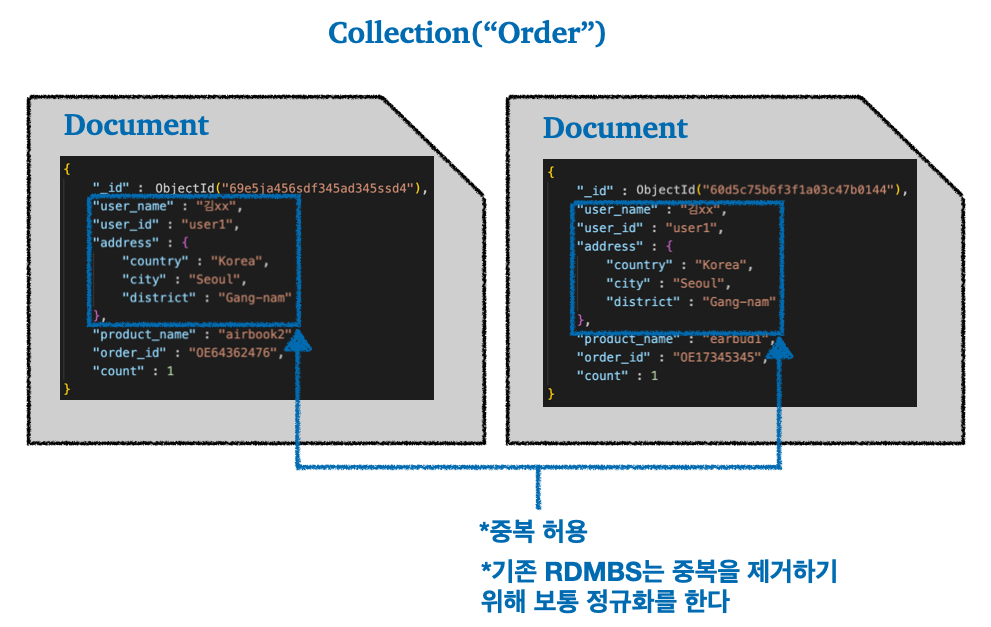

> NoSQL의 등장 배경, MongoDB 사용

---

## Index

---

## 1) NoSQL(Not Only SQL)

### 1.1 NoSQL 소개

NoSQL을 설명하기 전에 NoSQL이 등장하게 된 배경부터 살펴보자.

먼저 기존 SQL 데이터베이스(관계형 데이터베이스)의 한계에 대해서 살펴보자.

 

#### 1.1.1 관계형 데이터베이스의 단점

    

유연하지 않은 스키마

* 관계형 데이터베이스는 특정 기능이나 서비스의 도입에 따라 테이블에 컬럼을 추가하기 위해서는 스키마 변경이 필요하다
* 데이터의 수가 적으면 큰 문제가 되지 않겠지만, 데이터가 많은 경우 스키마 변경을 위한 작업이 데이터베이스 서버에 큰 부담이 될 수 있다
* 쉽게 말해서 RDBMS는 경직된 스키마를 가지고, 서비스 중에 이 스키마를 변경하는 것은 부담되는 행위이다

 

    

과도한 JOIN의 문제

* 관계형 데이터베이스의 스키마는 보통 정규화를 통해서 중복을 제거하기 위해서 테이블들을 쪼개 놓는다
* 이때 데이터를 읽어오기 위해서 과도한 JOIN을 수행하게 되고, 이는 read의 성능을 하락시킨다(쉽게 말해서 응답 시간이 늘어남)

 

    

Scale-out이 쉽지 않다

* 데이터베이스 레플리케이션 상황에서 `read`를 위한 `slave`를 추가하기 위해서 `master`의 데이터를 카피하는 작업이 필요함
* `write` 성능을 높이기 위해 `master`를 추가해서 `multi-master`를 사용하는 것도 `sharding` 같은 작업이 필요할 수 있기 때문에 쉽게 할 수 있는 작업이 아님

 

**위의 내용과 추가적인 단점을 정리하자면 다음과 같다.**

* 유연하지 않은 스키마로 인해 스키마를 변경하는 것은 부담이 된다
  * 이를 해결하기 위해서 애플리케이션 레벨에서 수정하려고 하면 [기술 부채(technical debt)](https://ko.wikipedia.org/wiki/%EA%B8%B0%EC%88%A0_%EB%B6%80%EC%B1%84)가 늘어난다

* 데이터를 읽어오기 위해서 정규화 되어 있는 테이블들에 대해서 `JOIN`을 수행하게 되는데, 과도한 `JOIN` 때문에 응답 시간이 늘어날 수 있다
* 스케일 아웃(scale out)을 하기 위한 `read replica` 추가, `multi-master` 사용, `sharding`, `partitioning` 등의 전략이 있지만 그 과정이 쉽지 않다
  * 프로던션에 이미 배포가 되어있는 상태라면 더더욱 힘들다

* ACID를 보장하기 위해 데이터베이스의 성능에 영향을 끼친다
  * ACID를 위해서 격리(Isolation)나 락(Lock)을 사용하는데, 이는 데이터베이스의 성능(performance)에 영향을 끼친다
  * 이는 단점이라기 보다는 RDBMS가 가지는 ACID와 성능 사이의 상충 관계(Trade-off)로 볼 수 있다

 

---

 #### 1.1.2 NoSQL 등장 배경

소셜 미디어 플랫폼들이 등장하면서 데이터베이스들은 높은 처리량(high-throughput)과 낮은 지연시간(low-latency), 등이 요구되었다. 

또한 기존의 정형 데이터가 아닌 비정형, 반정형 데이터가 많아지면서, 관계형 데이터베이스(SQL Database)가 다루지 못하는 영역까지 다룰 수 있는 NoSQL(Not only SQL) 데이터베이스가 등장하게 된다.

정리해서 이야기 하자면 다양항 데이터 유형의 등장, 빅데이터, 대용량 트래픽을 다루는 웹 및 모바일 애플리케이션의 등장에 맞춰서 NoSQL은 확장성, 성능, 사용 편의성으로 인해 인기를 얻기 시작했다. NoSQL은 기존의 정형화된 데이터베이스 구조를 따르지 않으며, 데이터 쿼리에 항상 SQL을 사용하지 않는다.

 

---

#### 1.1.3 NoSQL 분류 및 특징

NoSQL 데이터베이스의 종류는 굉장히 많고, 특징에 따라 다음과 같이 분류할 수 있다.

 

1. Key-Value Store
   - 키는 데이터의 속성을 나타내며 고유 식별자 역할을 한다
   - 키-값 모두 간단한 정수부터 복잡한 JSON 까지 될 수 있다
   - 사용자 세션 데이터, 선호도, 실시간 추천, 캐싱 등에 적합한 Key-Value 쌍으로 저장
   - 예) Redis, Memchached, DynamoDB 등
   - Redis의 경우 in-memory 캐시 DB로 많이 사용한다

2. Document-Based
   - 레코드 및 관련 데이터가 하나의 문서 내에 저장되어 유연한 인덱싱 및 임시 쿼리가 가능하다
   - 실제 use-case로는 이커머스, 의료 기록, CRM 등이 있다
   - 예) MongoDB, DocumentDM, CouchDB 등

3. Column-Based
   - 데이터는 행이 아닌 열로 구성되어 있어 많은 쓰기 요청이 필요한 시계열 데이터, 날씨 데이터, IoT 데이터 등에 적합하다
   - 예) Cassandra, HBase 등

4. Graph-Based
   - 그래프 모델을 활용하여 데이터를 표현하고 저장하기 때문에 데이터간 연결 및 관계를 시각화하기 적합하다
   - 실제 use-case에는 소셜 네트워크, 추천, 네트워크 다이어그램, 액세스 관리 등에 사용한다
   - 예) Neo4j, CosmosDB 등

 

    

https://learn.microsoft.com/ko-kr/dotnet/architecture/cloud-native/relational-vs-nosql-data 

remade by seungki1011

* NoSQL 데이터베이스는 대용량의 데이터를 처리할 수 있는 능력, 분산 처리 시스템 지원, 확장의 용이성, 유연한 스키마 등의 특징이 있다
  * NoSQL의 경우 ACID를 일부 포기하고 그 대신 높은 처리량과 낮은 지연성을 추구한다
  * NoSQL에서는 보통 중복을 허용해서 데이터를 `JOIN` 없이 조회할 수 있도록 한다
  * 필요한 데이터를 그냥 중복이 있어도 전부 저장해놓는 특징 때문에 스케일 아웃도 용이하다

* 이런 NoSQL 데이터베이스의 특징은 에자일한 개발에 유용하다
* 반면 관계형 데이터베이스와 대조되는 강점을 가짐에도 불구하고, NoSQL 데이터베이스는 상대적으로 ACID 준수성이 부족하고 정형 데이터를 다루는 경우 관계형 데이터베이스에 비해서 기능이 부족할 수 있다
  * 그렇게 때문에 Transaction이나 데이터 정합성과 같은 ACID가 정말 중요한 금융 시스템과 같은 경우 NoSQL 데이터베이스를 사용하지 않고 관계형 데이터베이스를 사용한다

 

---

## 2) MongoDB

### 2.1 MongoDB의 특징

몽고DB(MongoDB)는 도큐먼트 지향(Document-oriented) 데이터베이스이다. NoSQL 데이터베이스로 분류되는 몽고DB는 동적 스키마형 JSON 도큐먼트에 데이터를 입력한다. 몽고DB는 BSON(Binary JSON)이라는 포맷을 사용해서 저장한다.

BSON은 쉽게 생각해서 JSON 도큐먼트를 바이너리(Binary)로 인코딩한 포맷이라고 생각하면 편하다.

공식 문서 참고 : [https://www.mongodb.com/json-and-bson](https://www.mongodb.com/json-and-bson)

 

그럼 몽고DB의 특징을 살펴보자.

    

RDBMS vs MongoDB

* 몽고DB에서는 테이블이 아니라 컬렉션(Collection)이라는 명칭을 사용한다
  * 컬렉션은 도큐먼트(Document)의 모음
  * `db.createCollection("user")` 같은 형태로 컬렉션 생성

* 몽고 DB는 기본적으로 도큐먼트 단위로 데이터를 입력하고 조회한다
  * 데이터는 컬럼에 해당하는 필드(field, key)와 해당하는 값(value)을 입력하면 된다
    * 쉽게 말해서 `JSON` 형태로 데이터를 입력하면 된다
  * 몽고DB는 기존의 관계형 데이터베이스와 다르게 스키마가 아무것도 정해지지 않았기 때문에 자유롭게 필드를 정해서 값을 입력해도 된다
  * `db.user.insertOne({ 필드:값 })` 같은 형태로 하나의 도큐먼트를 입력할 수 있다
  * 도큐먼트는 고유한 `_id`를 할당받는다
    * `_id`를 할당받는 시점은 데이터 삽입 시점

* 전체 도큐먼트를 조회하고 싶으면 `db.user.find({})` 같은 형태로 조회할 수 있다
* 몽고DB는 개발자들이 애플리케이션 레벨에서 스키마 관리를 한다
* 몽고DB의 Polymorphism 검색!

 

    

MongoDB는 데이터 중복 허용

* 기존의 RDBMS는 `Product`, `User`, `Order` 테이블을 쪼개서 중복이 없도록 설계하고, 이후 `JOIN`을 통해서 필요한 데이터를 조회한다
* 반면 NoSQL 데이터베이스인 몽고DB에서는 중복된 데이터를 저장해도 상관없다는 접근을 사용한다
  * 한 번 읽을 때 필요한 모든 데이터를 다 저장해놓기 때문에, 굳이 `JOIN`을 사용하지 않아도 된다는 접근 방식을 사용
  * 과도한 `JOIN` 수행으로 인한 성능 오버헤드를 방지할 수 있다

* 데이터 중복 허용을 통한 `JOIN` 필요성을 제거하는 대신, 애플리케이션 레벨에서 데이터들이 모두 최신 상태를 유지할 수 있도록 관리해야한다

 

---

### 2.1 MondoDB 설치
