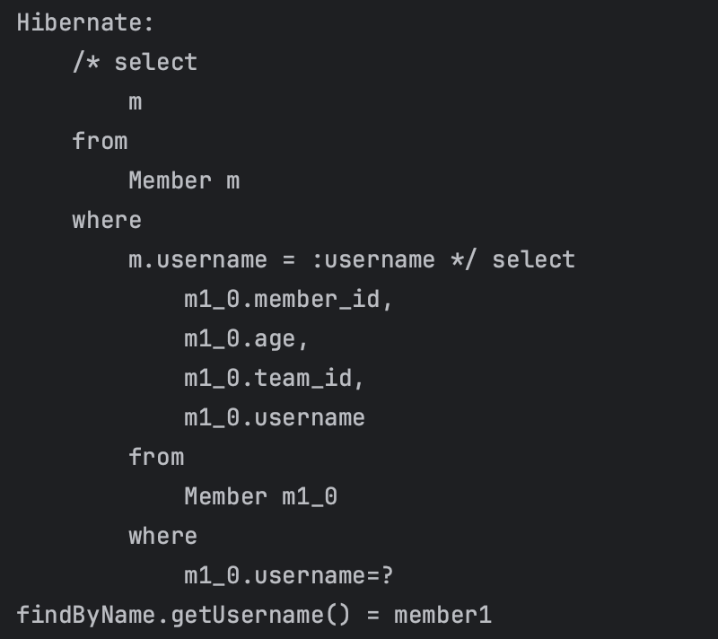
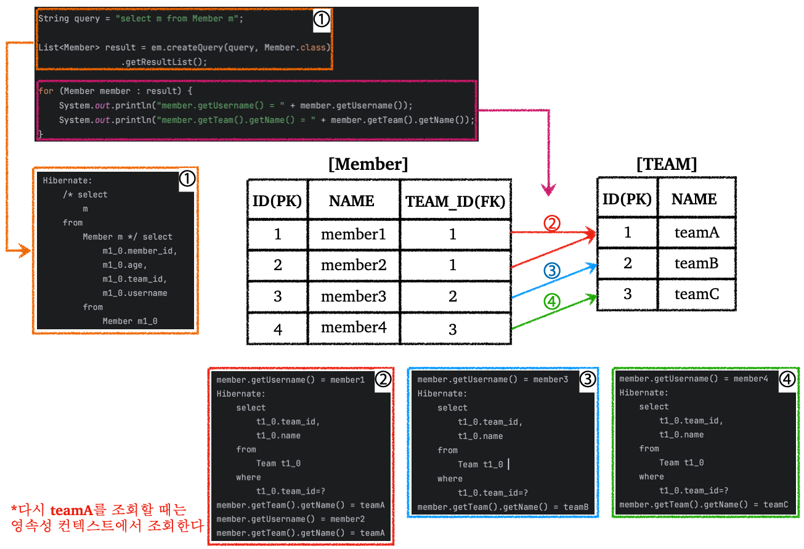

> JPA의 구현체인 Hibernate의 동작 방식과 기본 사용법에 대해 알아보자.
>
> 코드 편의상 롬복 `@Setter`로 설정자 전부 열어둠. 실제 구현시, 필요한 설정자만 열어두는 것을 권장.
>
> `@NoArgsConstructor`도 권장사항은 `@NoArgsConstructor(access = AccessLevel.PROTECTED)`을 사용하는 것이지만, 편의상 아무런 속성을 설정하지 않고 사용함.

---

## Index

1. [JPA 소개](https://github.com/seungki1011/Data-Engineering/tree/main/database/(006)JPA#1-jpa-%EC%86%8C%EA%B0%9C)
2. [JPA 준비](https://github.com/seungki1011/Data-Engineering/tree/main/database/(006)JPA#2-jpa-%EC%A4%80%EB%B9%84)
   * [프로젝트 setup](https://github.com/seungki1011/Data-Engineering/tree/main/database/(006)JPA#21-%ED%94%84%EB%A1%9C%EC%A0%9D%ED%8A%B8-setup)
   * [객체와 테이블 매핑](https://github.com/seungki1011/Data-Engineering/tree/main/database/(006)JPA#22-%EA%B0%9D%EC%B2%B4%EC%99%80-%ED%85%8C%EC%9D%B4%EB%B8%94-%EB%A7%A4%ED%95%91)
   * [JPA 동작 확인](https://github.com/seungki1011/Data-Engineering/tree/main/database/(006)JPA#23-jpa-%EB%8F%99%EC%9E%91-%ED%99%95%EC%9D%B8)
     * JPA 정상 동작 체크
     * 저장
     * 조회
     * 삭제
     * 수정
     * JPQL
3. [내부 동작 - 영속성 컨텍스트(Persistence Context)](https://github.com/seungki1011/Data-Engineering/tree/main/database/(006)JPA#3-%EB%82%B4%EB%B6%80-%EB%8F%99%EC%9E%91---%EC%98%81%EC%86%8D%EC%84%B1-%EC%BB%A8%ED%85%8D%EC%8A%A4%ED%8A%B8persistence-context)
   * [영속성 컨텍스트란?](https://github.com/seungki1011/Data-Engineering/tree/main/database/(006)JPA#31-%EC%98%81%EC%86%8D%EC%84%B1-%EC%BB%A8%ED%85%8D%EC%8A%A4%ED%8A%B8%EB%9E%80)
   * [영속성 컨텍스트를 사용하는 이유](https://github.com/seungki1011/Data-Engineering/tree/main/database/(006)JPA#32-%EC%98%81%EC%86%8D%EC%84%B1-%EC%BB%A8%ED%85%8D%EC%8A%A4%ED%8A%B8%EB%A5%BC-%EC%82%AC%EC%9A%A9%ED%95%98%EB%8A%94-%EC%9D%B4%EC%9C%A0)
     * [1차 캐시(First level Cache)](https://github.com/seungki1011/Data-Engineering/tree/main/database/(006)JPA#321-1%EC%B0%A8-%EC%BA%90%EC%8B%9C)
     * [영속 엔티티의 동일성 보장](https://github.com/seungki1011/Data-Engineering/tree/main/database/(006)JPA#322-%EC%98%81%EC%86%8D-%EC%97%94%ED%8B%B0%ED%8B%B0%EC%9D%98-%EB%8F%99%EC%9D%BC%EC%84%B1-%EB%B3%B4%EC%9E%A5)
     * [쓰기 지연(Write-Behind), 변경 감지(Dirty-Check)](https://github.com/seungki1011/Data-Engineering/tree/main/database/(006)JPA#323-%EC%93%B0%EA%B8%B0-%EC%A7%80%EC%97%B0write-behind-%EB%B3%80%EA%B2%BD-%EA%B0%90%EC%A7%80dirty-check)
     * [플러시(Flush)](https://github.com/seungki1011/Data-Engineering/tree/main/database/(006)JPA#324-%ED%94%8C%EB%9F%AC%EC%8B%9Cflush)
4. [엔티티 매핑(Entity Mapping)](https://github.com/seungki1011/Data-Engineering/tree/main/database/(006)JPA#4-%EC%97%94%ED%8B%B0%ED%8B%B0-%EB%A7%A4%ED%95%91entity-mapping)
   * [DB 스키마 자동 생성(`hibernate.hbm2ddl.auto`)](https://github.com/seungki1011/Data-Engineering/tree/main/database/(006)JPA#40-db-%EC%8A%A4%ED%82%A4%EB%A7%88-%EC%9E%90%EB%8F%99-%EC%83%9D%EC%84%B1-hibernatehbm2ddlauto)
   * [객체 - 테이블 매핑](https://github.com/seungki1011/Data-Engineering/tree/main/database/(006)JPA#41-%EA%B0%9D%EC%B2%B4---%ED%85%8C%EC%9D%B4%EB%B8%94-%EB%A7%A4%ED%95%91)
   * [필드 - 컬럼 매핑](https://github.com/seungki1011/Data-Engineering/tree/main/database/(006)JPA#42-%ED%95%84%EB%93%9C---%EC%B9%BC%EB%9F%BC-%EB%A7%A4%ED%95%91)
   * [기본키(PK) 매핑](https://github.com/seungki1011/Data-Engineering/tree/main/database/(006)JPA#43-%EA%B8%B0%EB%B3%B8%ED%82%A4pk-%EB%A7%A4%ED%95%91)
     * 기본키 매핑 애노테이션
     * `IDENTITY` 전략
     * `SEQUENCE` 전략
5. [연관관계 매핑(Relationship Mapping)](https://github.com/seungki1011/Data-Engineering/tree/main/database/(006)JPA#5-%EC%97%B0%EA%B4%80%EA%B4%80%EA%B3%84-%EB%A7%A4%ED%95%91relationship-mapping)
   * [단방향 연결관계(Uni-directional)](https://github.com/seungki1011/Data-Engineering/tree/main/database/(006)JPA#51-%EB%8B%A8%EB%B0%A9%ED%96%A5-%EC%97%B0%EA%B4%80%EA%B4%80%EA%B3%84uni-directional)
   * [양방향 연관관계(Bi-directional)](https://github.com/seungki1011/Data-Engineering/tree/main/database/(006)JPA#52-%EC%96%91%EB%B0%A9%ED%96%A5-%EC%97%B0%EA%B4%80%EA%B4%80%EA%B3%84bi-directional)
     * [양방향 연관관계 소개](https://github.com/seungki1011/Data-Engineering/tree/main/database/(006)JPA#521-%EC%96%91%EB%B0%A9%ED%96%A5-%EC%97%B0%EA%B4%80%EA%B4%80%EA%B3%84-%EC%86%8C%EA%B0%9C)
     * [:star: 연관관계의 주인(Owning side of Relationship))](https://github.com/seungki1011/Data-Engineering/tree/main/database/(006)JPA#522-star-%EC%97%B0%EA%B4%80%EA%B4%80%EA%B3%84%EC%9D%98-%EC%A3%BC%EC%9D%B8owning-side-of-relationship-%EC%86%8C%EA%B0%9C)
     * [양방향 매핑 규칙](https://github.com/seungki1011/Data-Engineering/tree/main/database/(006)JPA#523-%EC%96%91%EB%B0%A9%ED%96%A5-%EB%A7%A4%ED%95%91-%EA%B7%9C%EC%B9%99)
     * [양방향 매핑시 주의점, 권장사항](https://github.com/seungki1011/Data-Engineering/tree/main/database/(006)JPA#524-%EC%96%91%EB%B0%A9%ED%96%A5-%EB%A7%A4%ED%95%91%EC%8B%9C-%EC%A3%BC%EC%9D%98%EC%A0%90-%EA%B6%8C%EC%9E%A5%EC%82%AC%ED%95%AD)
     * [양방향 매핑 정리](https://github.com/seungki1011/Data-Engineering/tree/main/database/(006)JPA#525-%EC%96%91%EB%B0%A9%ED%96%A5-%EB%A7%A4%ED%95%91-%EC%A0%95%EB%A6%AC)
6. [연관관계 카디널리티(Cardinality)](https://github.com/seungki1011/Data-Engineering/tree/main/database/(006)JPA#6-%EC%97%B0%EA%B4%80%EA%B4%80%EA%B3%84-%EC%B9%B4%EB%94%94%EB%84%90%EB%A6%AC%ED%8B%B0cardinality)
   * [다대일(N:1, `@ManyToOne`)](https://github.com/seungki1011/Data-Engineering/tree/main/database/(006)JPA#61-%EB%8B%A4%EB%8C%80%EC%9D%BCn1-manytoone)
   * 일대다(1:N, `@OneToMany`)
   * 일대일(1:1, `@OneToOne`)
7. [상속관계 매핑 (Inheritance Mapping)](https://github.com/seungki1011/Data-Engineering/tree/main/database/(006)JPA#7-%EC%83%81%EC%86%8D-%EA%B4%80%EA%B3%84-%EB%A7%A4%ED%95%91inheritance-mapping)
   * [상속 관계 매핑 소개](https://github.com/seungki1011/Data-Engineering/tree/main/database/(006)JPA#71-%EC%83%81%EC%86%8D-%EA%B4%80%EA%B3%84-%EB%A7%A4%ED%95%91-%EC%86%8C%EA%B0%9C)
   * [조인 전략(`JOINED`)](https://github.com/seungki1011/Data-Engineering/tree/main/database/(006)JPA#72-%EC%A1%B0%EC%9D%B8-%EC%A0%84%EB%9E%B5joined)
   * [단일 테이블 전략(`SINGLE_TABLE`)](https://github.com/seungki1011/Data-Engineering/tree/main/database/(006)JPA#73-%EB%8B%A8%EC%9D%BC-%ED%85%8C%EC%9D%B4%EB%B8%94-%EC%A0%84%EB%9E%B5single_table)
   * 클래스 마다 테이블 전략(`TABLE_PER_CLASS`)
   * [`@MappedSuperclass`](https://github.com/seungki1011/Data-Engineering/tree/main/database/(006)JPA#75-mappedsuperclass)
8. [즉시 로딩(`EAGER`), 지연 로딩(`LAZY`)](https://github.com/seungki1011/Data-Engineering/tree/main/database/(006)JPA#8-%EC%A6%89%EC%8B%9C-%EB%A1%9C%EB%94%A9eager-%EC%A7%80%EC%97%B0-%EB%A1%9C%EB%94%A9lazy)
9. [영속성 전이(Cascade)](https://github.com/seungki1011/Data-Engineering/tree/main/database/(006)JPA#9-%EC%98%81%EC%86%8D%EC%84%B1-%EC%A0%84%EC%9D%B4cascade)
   * [영속성 전이 설명](https://github.com/seungki1011/Data-Engineering/tree/main/database/(006)JPA#91-%EC%98%81%EC%86%8D%EC%84%B1-%EC%A0%84%EC%9D%B4-%EC%84%A4%EB%AA%85)
   * [영속성 전이를 사용하는 경우](https://github.com/seungki1011/Data-Engineering/tree/main/database/(006)JPA#92-%EC%98%81%EC%86%8D%EC%84%B1-%EC%A0%84%EC%9D%B4%EB%A5%BC-%EC%82%AC%EC%9A%A9%ED%95%98%EB%8A%94-%EA%B2%BD%EC%9A%B0)
   * 고아 객체 제거(`orphanRemoval`)
10. [임베디드 타입(Embedded Type)](https://github.com/seungki1011/Data-Engineering/tree/main/database/(006)JPA#10-embedded-type)
    * [값 타입(Value Object, Value Type)이란?](https://github.com/seungki1011/Data-Engineering/tree/main/database/(006)JPA#101-%EA%B0%92-%ED%83%80%EC%9E%85value-object-value-type%EC%9D%B4%EB%9E%80)
    * [임베디드 타입 사용](https://github.com/seungki1011/Data-Engineering/tree/main/database/(006)JPA#102-%EC%9E%84%EB%B2%A0%EB%94%94%EB%93%9C-%ED%83%80%EC%9E%85-%EC%82%AC%EC%9A%A9)
11. [JPQL](https://github.com/seungki1011/Data-Engineering/tree/main/database/(006)JPA#11-jpql)
    * [JPQL 소개](https://github.com/seungki1011/Data-Engineering/tree/main/database/(006)JPA#111-jpql-%EC%86%8C%EA%B0%9C)
    * QueryDSL 소개
    * Native SQL 소개
12. [JPQL 기본 사용법](https://github.com/seungki1011/Data-Engineering/tree/main/database/(006)JPA#12-jpql-%EA%B8%B0%EB%B3%B8-%EC%82%AC%EC%9A%A9%EB%B2%95)
    * [기본 `select`문](https://github.com/seungki1011/Data-Engineering/tree/main/database/(006)JPA#121-%EA%B8%B0%EB%B3%B8-select-%EB%AC%B8)
    * [`TypedQuery`, `Query`](https://github.com/seungki1011/Data-Engineering/tree/main/database/(006)JPA#122-typedquery-query)
    * [결과 조회](https://github.com/seungki1011/Data-Engineering/tree/main/database/(006)JPA#123-%EA%B2%B0%EA%B3%BC-%EC%A1%B0%ED%9A%8C)
    * [파라미터 바인딩(`setParameter()`)](https://github.com/seungki1011/Data-Engineering/tree/main/database/(006)JPA#124-%ED%8C%8C%EB%9D%BC%EB%AF%B8%ED%84%B0-%EB%B0%94%EC%9D%B8%EB%94%A9setparameter)
    * [프로젝션(Projection)](https://github.com/seungki1011/Data-Engineering/tree/main/database/(006)JPA#125-%ED%94%84%EB%A1%9C%EC%A0%9D%EC%85%98projection)
    * [페이징(Pagination)](https://github.com/seungki1011/Data-Engineering/tree/main/database/(006)JPA#126-%ED%8E%98%EC%9D%B4%EC%A7%95pagination)
    * [조인(`JOIN`)](https://github.com/seungki1011/Data-Engineering/tree/main/database/(006)JPA#127-%EC%A1%B0%EC%9D%B8join)
    * [서브쿼리(Subquery)](https://github.com/seungki1011/Data-Engineering/tree/main/database/(006)JPA#128-%EC%84%9C%EB%B8%8C%EC%BF%BC%EB%A6%ACsubquery)
    * [조건식(Case)](https://github.com/seungki1011/Data-Engineering/tree/main/database/(006)JPA#129-%EC%A1%B0%EA%B1%B4%EC%8B%9Dcase)
    * [JPQL 함수](https://github.com/seungki1011/Data-Engineering/tree/main/database/(006)JPA#1210-jpql-%ED%95%A8%EC%88%98)
13. [JPQL 더 알아가기](https://github.com/seungki1011/Data-Engineering/tree/main/database/(006)JPA#13-jpql-%EB%8D%94-%EC%95%8C%EC%95%84%EA%B0%80%EA%B8%B0)
    * [경로 표현식(Path Expression)](https://github.com/seungki1011/Data-Engineering/tree/main/database/(006)JPA#131-%EA%B2%BD%EB%A1%9C-%ED%91%9C%ED%98%84%EC%8B%9Dpath-expression)
    * [:star: 페치 조인(`join fetch`)](https://github.com/seungki1011/Data-Engineering/tree/main/database/(006)JPA#132-star-%ED%8E%98%EC%B9%98-%EC%A1%B0%EC%9D%B8join-fetch)
      * [페치 조인 소개](https://github.com/seungki1011/Data-Engineering/tree/main/database/(006)JPA#1321-%ED%8E%98%EC%B9%98-%EC%A1%B0%EC%9D%B8-%EC%86%8C%EA%B0%9C)
      * [N+1 문제](https://github.com/seungki1011/Data-Engineering/tree/main/database/(006)JPA#1322-n1-%EB%AC%B8%EC%A0%9C)
      * [컬렉션 페치 조인](https://github.com/seungki1011/Data-Engineering/tree/main/database/(006)JPA#1323-%EC%BB%AC%EB%A0%89%EC%85%98-%ED%8E%98%EC%B9%98-%EC%A1%B0%EC%9D%B8)
      * [페치 조인의 한계](https://github.com/seungki1011/Data-Engineering/tree/main/database/(006)JPA#1324-%ED%8E%98%EC%B9%98-%EC%A1%B0%EC%9D%B8%EC%9D%98-%ED%95%9C%EA%B3%84)
    * [`@NamedQuery`](https://github.com/seungki1011/Data-Engineering/tree/main/database/(006)JPA#133-namedquery)
    * [벌크 연산(Bulk Operation)](https://github.com/seungki1011/Data-Engineering/tree/main/database/(006)JPA#134-%EB%B2%8C%ED%81%AC-%EC%97%B0%EC%82%B0bulk-operation)

---

## 1) JPA 소개

자바 퍼시스턴스(Java Persistence, 이전 이름: 자바 퍼시스턴스 API/Java Persistence API)는 객체 관계 매핑(ORM, Object Relational Mapping) 기술의 표준 인터페이스 모음이다. JPA를 구현하는 다양한 구현체들 중에서 대표적으로 Hibernate가 사용되며, 현재 포스트에서 추후 기술하는 사용법도 Hibernate를 기준으로 작성되었다. 이후 포스트에서 언급하는 JPA는 Hibernate과 동의어로 생각하면 된다.

<br>

<p align="center">    </p>

<p align="center">JPA Interface</p>

<br>

JPA를 사용하는 여러 이유는 다음과 같다.

* SQL 중심적 개발을 객체 중심적 개발로 바꿀 수 있다
* 생산성과 유지보수
  * 여러 SQL과 관련된 보일러 플레이트(boiler-plate) 제거
* 관계형 데이터베이스의 테이블과 객체간의 패러다임 불일치 해결
* 벤더 독립성
  * 벤더 락인(vendor lock-in)을 피할 수 있다
  * JPA는 이론적으로 특정 데이터베이스에 종속적이지 않으며, DB 벤더를 변경해도 JPA 관련코드는 일절 바꾸지 않아도 된다고 한다(물론 이건 이론적인 이야기지 실제로 그냥 레고 놀이 하듯이 가능한건 아니다)

<br>

정말 쉽게 이야기하자면 JPA는 많은 기능을 추상화하여 제공하고, 개발자는 JPA를 통해서 SQL의 사용없이 쉽게 개발이 가능하다. 그러나 이것은 개발자가 아무런 이해 없이 JPA가 제공하는 마법과 같은 기능들을 완벽히 신뢰하면서 사용하라는 뜻은 아니다.

결국에 문제가 생기면 개발자는 관계형 데이터베이스(SQL), 객체, JPA의 내부 동작 방식을 잘 알고 있어야 효율적으로 JPA를 사용하고 문제 해결(trouble shooting)을 할 수 있다.

<br>


JPA는 JDBC API 위에서 동작한다.

<br>

<p align="center">    </p>

<p align="center">JPA 내부 요약</p>

<br>

---

## 2) JPA 준비

### 2.1 프로젝트 setup

JPA를 사용하기 위한 프로젝트 준비. 이전의 JDBC에서 사용한것과 다르게 이번에는 H2 데이터베이스를 사용해보자.

H2 컨테이너를 위한 `docker-compose.yml`은 다음과 같다.

<br>

```yaml
services:
  db:
    container_name: h2-container
    image: oscarfonts/h2:latest # h2 latest version(2024/06/01 : 2.2.224)
    ports:
      - 1521:1521 # TCP database server
      - 8081:81 # Web Interface
    environment:
      H2_OPTIONS: -ifNotExists # If DB exists do not re-create
    volumes:
      - ./h2/:/opt/h2-data # Mount at ./h2
    restart: always
```

* H2 웹 콘솔을 `8081`로 접속하자
* 데이터베이스 포트는 `1521`을 사용하자

<br>

자바 17을 사용할 것이다.

Maven을 사용할 것이다. `pom.xml`은 다음과 같다.

<br>

```xml
<?xml version="1.0" encoding="UTF-8"?>
<project xmlns="http://maven.apache.org/POM/4.0.0"
         xmlns:xsi="http://www.w3.org/2001/XMLSchema-instance"
         xsi:schemaLocation="http://maven.apache.org/POM/4.0.0 http://maven.apache.org/xsd/maven-4.0.0.xsd">
    <modelVersion>4.0.0</modelVersion>

    <groupId>jpa-basic</groupId>
    <artifactId>ex1-hello-jpa</artifactId>
    <version>1.0.0</version>

    <properties>
        <maven.compiler.source>17</maven.compiler.source>
        <maven.compiler.target>17</maven.compiler.target>
        <project.build.sourceEncoding>UTF-8</project.build.sourceEncoding>
    </properties>

    <dependencies>
        <!-- JPA 하이버네이트 -->
        <dependency>
            <groupId>org.hibernate</groupId>
            <artifactId>hibernate-core</artifactId>
            <version>6.4.2.Final</version>
        </dependency>

        <dependency>
            <groupId>javax.xml.bind</groupId>
            <artifactId>jaxb-api</artifactId>
            <version>2.3.1</version>
        </dependency>

        <!-- H2 데이터베이스 -->
        <dependency>
            <groupId>com.h2database</groupId>
            <artifactId>h2</artifactId>
            <version>2.2.224</version>
        </dependency>
      
        <!-- lombok -->
        <dependency>
            <groupId>org.projectlombok</groupId>
            <artifactId>lombok</artifactId>
            <version>1.18.32</version>
            <scope>provided</scope>
        </dependency>

        <!-- logback -->
<!--
        <dependency>
            <groupId>ch.qos.logback</groupId>
            <artifactId>logback-classic</artifactId>
            <version>1.4.14</version>
        </dependency>
-->
    </dependencies>

</project>
```

* H2의 버전을 우리가 사용하는 버전과 맞추자
* 하이버네이트 버전은 `6.4.2.Final`

<br>

JPA를 사용하기 위해서는 `resources/META-INF/persistence.xml`를 만들어야 한다.

`persistence.xml`은 JPA를 위한 설정파일이다.

<br>

```xml
<?xml version="1.0" encoding="UTF-8"?>
<persistence version="2.2" xmlns="http://xmlns.jcp.org/xml/ns/persistence"
             xmlns:xsi="http://www.w3.org/2001/XMLSchema-instance"
             xsi:schemaLocation="http://xmlns.jcp.org/xml/ns/persistence http://xmlns.jcp.org/xml/ns/persistence/persistence_2_2.xsd">
    <persistence-unit name="hello">
        <properties>
            <!-- 필수 속성 -->
            <property name="jakarta.persistence.jdbc.driver" value="org.h2.Driver"/>
            <property name="jakarta.persistence.jdbc.user" value="sa"/>
            <property name="jakarta.persistence.jdbc.password" value=""/>
            <property name="jakarta.persistence.jdbc.url" value="jdbc:h2:tcp://localhost:1521/test"/>
            <property name="hibernate.dialect" value="org.hibernate.dialect.H2Dialect"/>

            <!-- 옵션 -->
            <property name="hibernate.show_sql" value="true"/>
            <property name="hibernate.format_sql" value="true"/>
            <property name="hibernate.use_sql_comments"  value="true"/>
            <!-- create 옵션은 SessionFactory 시작시 스키마 삭제후 재생성 -->
            <!-- <property name="hibernate.hbm2ddl.auto" value="create" /> -->
        </properties>
    </persistence-unit>

</persistence>
```

* `jdbc.url`은 H2 콘솔에서 확인한 주소인 `jdbc:h2:tcp://localhost:1521/test` 사용

<br>

---

### 2.2 객체와 테이블 매핑

테이블을 생성하고, 해당 테이블과 매핑이 되는 객체를 만들자.

<br>

테이블 생성.

```sql
create table Member (
   id bigint not null,
   name varchar(255),
   primary key (id)
);
```

<br>

객체 생성.

```java
@Entity
@Getter @Setter
// @Table(name = "USER")
public class Member {
  
    @Id // PK 직접 할당, 데이터베이스 PK와 매핑
    private Long id;

    // @Column(name = "user_name")
    private String name;
}
```

* JPA는 기본적으로 객체와 테이블을 관례에 의해서 알아서 매핑해준다
* 편의상 `@Setter`를 사용했는데, 실제 구현할 때는 필요한 `setter`만 열어두는게 좋다
* 만약 실제 테이블 이름이 완전히 다르면 (`Member`가 아니라 `USER`라면) `@Table(name = "USER")` 처럼 지정할 수 있다
* attribute도 마찬가지이다, `@Column(name = "user_name")`으로 이름을 직접 지정하는 것이 가능하다

<br>

---

### 2.3 JPA 동작 확인

#### 2.3.1 JPA 정상 동작 체크

`JpaMain`을 만들어서 코드를 작성해보자.

<br>

```java
public class JpaMain {

    public static void main(String[] args) {

        /**
         * persistence.xml의 persistence-unit의 name을 넣어준다
         * EntityManagerFactory를 통해서 EntityManager를 생성한다
         */
        EntityManagerFactory emf = Persistence.createEntityManagerFactory("hello");
        EntityManager em = emf.createEntityManager();
        
        //code

        em.close();
        emf.close();
    }
}
```

* `EntityManagerFactory`는 하나만 생성해서 애플리케이션 전체에 공유한다
* `EntityManager`는 스레드간에 공유하지 않는다 (사용하고 버린다)
  * 실제 트랜잭션 단위의 행위(커넥션을 얻고 SQL을 날리고 종료를 하는 일괄적인 행위)를 할때 마다 `EntityManager`를 만들어줘야 함

<br>

---

#### 2.3.2 저장

이제 `Member` 객체를 한번 저장해보자.

<br>

```java
public class JpaMain {

    public static void main(String[] args) {

        EntityManagerFactory emf = Persistence.createEntityManagerFactory("hello");

        /**
         * 각 트랜잭션 별로 EntityManager를 만들어서 사용
         */
        EntityManager em = emf.createEntityManager();

        /**
         * JPA에서 데이터를 변경하는 작업은 트랜잭션 단위 내에서 작업한다
         * 생성한 EntityManager에서 트랜잭션을 얻어서 사용
         */
        EntityTransaction tx = em.getTransaction();
        tx.begin(); // 트랜잭션 시작

        /**
         * 아래의 try-catch-finally는 스프링부트를 사용하면 전부 생략가능
         */
        try {
            Member member = new Member();
            member.setId(1L);
            member.setName("MemberA");

            em.persist(member); // 객체를 DB에 저장(실제로는 영속성 컨텍스트에 저장, 뒤에서 다룸)
            tx.commit(); // 성공하면 커밋
        } catch (RuntimeException e) {
            tx.rollback(); // 예외 발생시 롤백
        } finally {
            em.close();
        }

        emf.close(); // 전체 애플리케이션이 끝나면 EntityManagerFactory 종료
    }
}
```

* `Member` 객체를 생성해서 저장하는데 `id`는 `1`, `name`은 `MemberA`이다
* JPA에서는 트랜잭션 내에서 변경 작업을 해야한다
* JPA 설정에서 `<property name="hibernate.show_sql" value="true"/>`로 설정했기 때문에, 콘솔에서 해당 SQL을 확인할 수 있다
* `try-catch-finally` 같은 코드는 스프링 부트 사용시 자동으로 적용해준다

<br>

H2 콘솔에서 확인하면 결과가 제대로 반영된것을 확인할 수 있다. 이어서 `2`, `3`, `4`번 아이디로 멤버를 두 명 더 추가하자.

<br>

---

#### 2.3.3 조회

이번에는 특정 멤버를 찾아보자. 

```java
// PK가 2인 멤버 찾기
Member findMember = em.find(Member.class, 2L);
System.out.println("findMember.getId() = " + findMember.getId());
System.out.println("findMember.getName() = " + findMember.getName());
```

```
findMember.getId() = 2
findMember.getName() = MemberB
```

* `Member` 클래스의 객체이면서 아이디가 `2` 인 멤버 찾기
  * PK로 찾는다

<br>

---

#### 2.3.4 삭제

이번에는 멤버를 삭제해보자.

```java
Member findMember = em.find(Member.class, 2L);
em.remove(findMember);
```

* 찾은 멤버 `findMember`를 삭제한다
* 현재 스키마에 `auto increment`를 적용하지 않았기 때문에 아이디가 `1`, `3`, `4` 로 보일 것이다

<br>

---

#### 2.3.5 수정

이번에는 멤버를 수정 해보자. 

```java
Member findMember = em.find(Member.class, 1L);
findMember.setName("UpdatedMemberA");
```

* PK가 `1` 인 멤버의 `name`을 `UpdatedMemberA`로 수정한다
* 이때 `em.persist(findMember)`를 할 필요가 없다!
* JPA를 통해서 엔티티를 가져오는 경우, JPA가 관리를 한다. JPA는 이 엔티티가 트랜재션 내에서 변경이 됬는지 안됬는지 커밋되는 시점에서 항상 체크를 함. 위의 경우, `findMember`라는 엔티티가 변경이 되었기 때문에 업테이트 쿼리가 나감.

<br>

DB를 확인해보자.

<br>

<p align="center">    </p>

<p align="center">지금까지 적용한 내용 확인</p>

<br>

---

#### 2.3.6 JPQL

그러면 단순히 `find()`로 특정 PK인 멤버를 찾는 것이 아니라, 복잡한 쿼리를 통해 조회하는 경우 어떻게 해야할까? 이 경우에 JPA의 JPQL을 사용한다.

JPQL의 장점을 간단히 소개하면 다음과 같다.

* 기존 SQL 처럼 테이블 대상으로 검색하는 것이 아닌 객체 대상으로 검색한다
* SQL을 어느정도 추상화를 해주기 때문에 다른 데이터베이스로 변경해도 JPQL을 수정할 필요가 없다
  * 쉽게 말해서 SQL에 의존적이지 않다

<br>

JPQL은 이후에 자세히 다룰 예정. 

<br>

---

## 3) :star: 내부 동작 - 영속성 컨텍스트(Persistence Context)

### 3.1 영속성 컨텍스트란?

JPA의 내부 동작원리의 가장 중요한 부분인 영속성 컨텍스트(Pesistence Context)에 대해 알아보자.

먼저 `EntityManagerFactory`와 `EntityManager`에 대해 다시 알아보자.

<br>

<p align="center">    </p>

<p align="center">EntityManagerFactory, EntityManager</p>

* 엔티티 매니저 팩토리는 하나만 생성해서 사용한다
* 엔티티 매니저 팩토리는 요청마다 엔티티 매니저를 생성하고, 엔티티 매니저는 내부적으로 커넥션풀(CP)의 커넥션을 통해서 DB를 사용

<br>

그러면 영속성 컨텍스트란 무엇일까? 일단 한줄로 정의하면, **"엔티티(Entity)를 영구 저장하는 환경"**이다.

이전에 우리는 JPA가 동작하는지 확인하면서 엔티티를 저장하는 코드를 사용해봤다. 그 코드는 다음과 같다.

```java
em.persist(member);
```

* `em` : `EntityManagerFactory`를 통해서 생성한 `EntityManager` 객체
* `member` : 저장하려고 한 엔티티

<br>

그 당시에 우리는 `persist()`를 통해서 엔티티를 저장하면 바로 데이터베이스에 저장하는 걸로 이해했다. 그러나 실제로는 그렇지 않다. **실제로는 `persist()`를 통해서 엔티티를 영속 컨텍스트에 집어넣는 것이다**. 이것에 대한 내용은 바로 뒤에서 자세히 살펴볼 것이다.

영속성 컨텍스트는 JPA 내부에서 동작하는 논리적인 개념이며, `EntityManager`를 통해서 영속성 컨텍스트에 접근한다.

기본적으로 `EntityManager`를 생성하면 영속성 컨텍스트(`PersistenceContext`)도 하나 생성되며 1:1로 사용된다.

> 스프링과 같은 프레임워크에서는 `EntityManager`와 영속성 컨텍스트는 `N:1`을 이룬다. 이것에 대한 내용은 추후에 자세히 다룰 것이다. 지금은 일단 `EntityManager`와 영속성 컨텍스트는 `1:1`이라고 가정하고 진행하자.

<br>

<p align="center">    </p>

<p align="center">Persistence Context</p>

* 비영속(new/transient)
  * 영속성 컨텍스트와 전혀 관계가 없는 새로운 상태
  * JPA와 아무 연관이 없는 상태로 생각하면 편하다
  * 예) 단순히 생성한 멤버 객체


* 영속(managed)
  * 영속성 컨텍스트에 관리되고 있는 상태
  * 엔티티가 영속성 컨텍스트에 들어가 있는 상황이라고 이해하면 편함
  * `persist()`로 엔티티를 영속성 컨텍스트에 집어 넣으면 영속 상태


* 준영속(detached)
  * 영속성 컨텍스트에 저장되었다가 분리된 상태
  * 영속성 컨텍스트에서 꺼내져서, 영속성 컨텍스트에 의해 관리받지 않는 상태
  * `detach()`로 준영속 상태로 만들 수 있다
  * 비영속 상태와 다른점은, 비영속 객체는 아직 데이터베이스의 테이블과 아무 연관이 없다는 것이고, 준영속 객체는 테이블과 관련있는 엔티티인데 단순히 영속성 컨텍스트에서 분리되었다는 것이다.


* 삭제(removed)
  * 삭제된 상태
  * `remove()`로 삭제. 완전히 없어지는 것이다.

<br>

이전에도 언급했지만, `persist()`는 비영속 상태를 영속 상태로 만들어주는 것이지, `pesist()`가 실행되는 시점에서 쿼리가 실행되고 데이터베이스에 반영되는 것이다 아니다. 실제로 쿼리가 날라가서 반영되는 시점은 커밋이 완료되는 시점이다. 코드로 알아보자.

<br>

```java
EntityTransaction tx = em.getTransaction();

tx.begin(); // 트랜잭션 시작

try {
    /**
     * 단순히 멤버 객체 생성
     * 비영속 상태
     */
    Member member = new Member();
    member.setId(1L);
    member.setName("MemberA");
    
    /**
     * persist를 통해서 영속 상태로 전환
     * DB에 저장되지 않음
     */
    em.persist(member);
    
    /**
     * 작업이 모두 성공하면 커밋
     * 커밋되는 순간에 쿼리가 날아가서 DB에 반영이 됨
     */
    tx.commit(); 
} catch (RuntimeException e) {
    tx.rollback(); 
} finally {
    em.close();
}
```

* `persist()` 앞뒤로 `======`를 출력해서 확인해보면 쿼리가 날아가는 시점은 커밋 시점이다

<br>

---

### 3.2 영속성 컨텍스트를 사용하는 이유

그럼 영속성 컨텍스트는 왜 필요한 것일까? 영속성 컨텍스트의 몇가지 이점과 필요한 이유에 대해 알아보자.

들어가기 전에 `Member`에 생성자를 추가하자.(참고로 기본 생성자를 필수로 추가해야한다)

<br>

#### 3.2.1 1차 캐시

엔티티가 영속성 컨텍스트에 들어갈때 1차 캐시에 저장된다. 이때 1차 캐시의 수명은 `EntityManager`가 살아있는 동안이다. 사실 비즈니스 로직이 굉장히 복잡한 경우가 아닌 이상, 1차 캐시로 얻을 수 있는 성능상 이점은 크지 않다.

<br>

<p align="center">    </p>

<p align="center">1차 캐시</p>

* `persist()`로 엔티티를 영속 상태로 만드는 것은 사실 영속성 컨텍스트의 1차 캐시에 넣는 것이다
* 1차 캐시에 존재하는 엔티티를 조회하는 경우 DB까지 가지 않고 바로 1차 캐시에서 조회한다
* 1차 캐시에 존재하지 않는 엔티티를 조회하는 경우 DB에서 조회한 결과를 1차 캐시에 저장하고 해당 엔티티를 반환한다
* 위에서는 표기하지 않았지만, 엔티티 말고도 각 엔티티의 초기 상태에 대한 스냅샷도 함께 저장된다. 자세한 내용은 변경 감지(`dirty-check`)에서 다룰 것이다. 

<br>

---

#### 3.2.2 영속 엔티티의 동일성 보장

JPA는 영속 엔티티의 동일성을 보장한다. 쉽게 말해서 같은 PK(`@Id`)로 조회하는 모든 엔티티는 동일하다고 보장해준다. 코드로 살펴보면 바로 이해가 갈 것이다.

<br>

```java
Member member1 = new Member(5L, "memberE");

Member findMember1 = em.find(Member.class, 5L);
Member findMember2 = em.find(Member.class, 5L);

System.out.println(findMember1 == findMember2); // 동일성 비교하면 같다고 나옴
```

* `true`가 출력된다
* 같은 `EntityManager`의 스코프 내에서 가능한 것이다!

<br>

---

#### 3.2.3 쓰기 지연(Write-behind), 변경 감지(Dirty-check)

이것은 이전에도 설명했듯이, SQL을 데이터베이스로 날리는 시점은 `persist()`가 실행되는 시점이 아니다.(물론 예외적인 상황은 존재하지만, 이는 뒤에서 다룰 것이다). SQL을 보내는 시점은 모든 작업이 성공하고 `commit()`하고 `flush()`되는 순간이다. 이때 `commit` 호출 직후에 바로 `flush`가 트리거 된다. 이후에 커밋이 완료된다.

<br>

> 뒤에서 자세히 다루겠지만, 일단 `flush`는 영속성 컨텍스트의 변경내용을 데이터베이스에 반영하는 작업으로 생각하자.

<br>

이것이 가능한 이유는 기본적으로 변경 감지(dirty check)가 가능하기 때문이다. 엔티티가 영속 상태가 되면, 영속성 컨텍스트의 1차 캐시와 함께 엔티티의 초기 상태를 스냅샷 떠서 보관하고, 이후 엔티티의 상태를 스냅샷과 비교해서 변경 내용을 감지할 수 있다. 이것을 JPA의 변경 감지(dirty-check)라고 한다.

그림을 통해서 이해해보자.

<br>

<p align="center">    </p>

<p align="center">Write-behind, Dirty-check</p>

* **변경 감지(Dirty check)**
  * 엔티티가 영속 상태가 되면서 1차 캐시에 저장될때 초기 상태에 대한 스냅샷도 함께 저장된다
  * 엔티티 매니저가 관리하는 영속성 컨텍스트에서 스냅샷을 기준으로 엔티티에 대한 변경을 감지한다
    * dirty라는 이름이 붙은 이유가, 변경이 있는 엔티티를 더럽다(dirty)로 취급하기 때문
  * 변경 감지 시점은 `flush`가 발생할 때 일어난다
    * 예) 엔티티에 변경이 있으면 `UPDATE`로 취급
    * 예) 엔티티가 삭제되었다면 `DELETE`로 취급
    * 비영속 엔티티를 `persist()`를 이용해서 영속 엔티티로 변경할 때, 해당 엔티티는 `new`로 표시되고, `flush` 때 `INSERT`로 취급된다
  * 정리하면,  `commit()`이 호출되면 `flush`가 발동되어 변경 감지를 통해 변경 내용을 인지하고 SQL을 생성해서 DB로 날린다

<br>

여기서 엔티티를 수정하는 경우 `update(entity)`와 같은 코드를 사용할 것 같지만, 그렇지 않다. 단순히 영속 엔티티의 내용을 수정하는 것만으로도 엔티티를 수정하고 데이터베이스에 반영하는 것이 가능하다. 그 이유는 알다시피 위에서 다룬 변경 감지와 쓰기 지연 때문이다. 또한 `persist(entity)` 같은 코드를 추가할 필요도 없다.

<br>

```java
member1.setName("changedName"); // 영속 엔티티 데이터 수정
tx.commit();
```

* `commit()`이 호출되면 `flush`가 일어남
* 위 코드 처럼 엔티티 변경만으로 데이터 수정 가능

<br>

지금까지 변경 감지와 쓰기 지연에 대한 내용을 다루었다.

위에서 직접적으로 다루진 않았지만, 이런 쓰기 지연을 통해서 여러 SQL을 모아서 한번에 배치(batch)로 처리하는 것이 쉽다.

다음으로, 지금까지 여러번 등장한 `flush`에 대해 알아보자.

<br>

---

#### 3.2.4 플러시(Flush)

플러시(flush)에 대해 알아보자.

플러시는 영속성 컨텍스트의 변경내용을 데이터베이스에 반영하는 작업이다. 플러시가 발생하면 다음이 일어난다.

* 변경 감지(dirty check)
* `new` 상태의 엔티티에 대해서 `INSERT` SQL 생성 + 지금까지의 변경 사항에 대한 SQL 생성
* SQL을 DB로 전송
* 엔티티의 스냅샷을 현재 엔티티의 상태로 업데이트

<br>

플러시는 영속성 컨텍스트를 비우거나 하는 일을 하지 않는다! 플러시는 영속성 컨텍스트와 DB를 동기화하는 작업으로 이해하면 편하다.

<br>

그러면 플러시는 언제 일어날까? 영속성 컨텍스트를 플러시하는 시점은 다음과 같다.

* `entityManager.flush()` : 직접 호출
* 트랜잭션 커밋 이후 : 자동 호출
* JPQL 쿼리 실행 : 자동 호출

<br>

JPQL 쿼리 후에는 왜 자동으로 플러시가 호출될까? 다음과 같은 코드가 있다고 가정해보자.

<br>

```java
/**
 * member1,2,3는 아직 new 상태
 * 데이터베이스에 반영되고 나서야 new에서 영속 상태로 변경
 */
em.persist(member1);
em.persist(member2);
em.persist(member3);

// JPQL 실행
query = em.createQuery("select m from Member m", Member.class);
List<Member> members = qeury.getResultList();
```

* 위의 JPQL이 `member1 ~ 3`이 반영(`INSERT`)되기 전에 사용되면 문제가 생길 수 있다. 그래서 JPQL이 실행되면 플러시를 먼저하고 JPQL이 날아가서 실행된다.

<br>

플러시 모드 옵션은 다음과 같이 설정할 수 있다.

<br>

```java
em.setFlushMode(FlushModeType.COMMIT);
```

* `FlushModeType.AUTO` (기본값) : 커밋이나 쿼리를 실행할 때 플러시
  * 그냥 이거 사용 권장
* `FlushModeType.COMMIT` : 커밋할 때만 플러시 

<br>

> 준영속 상태(detached state)
>
> * 이전에도 설명했지만, 영속 상태 엔티티가 영속성 컨텍스트에서 분리된 상태
> * 영속성 컨텍스트가 관리하지 않기 때문에, 제공하는 기능 사용 불가
>
> <br>
>
> 준영속 상태로 만드는 방법은 다음이 존재.
>
> * `em.detach(entity)` : 특정 엔티티만 준영속 상태로 전환
> * `em.clear()` : 영속성 컨텍스트 완전 초기화(삭제 아님!)
> * `em.close()` : 영속성 컨텍스트(엔티티 매니저) 종료

<br>

---

## 4) 엔티티 매핑(Entity Mapping)

엔티티를 매핑하는 방법에 대해 알아보자.

### 4.0 DB 스키마 자동 생성 (`hibernate.hbm2ddl.auto`)

들어가기 전에 JPA에서 지원하는 데이터베이스 스키마 자동 생성에 대해 알아보자. JPA는 DDL을 애플리케이션 실행 시점에 자동 생성되는 기능을 지원한다. 사용하는 방법은 다음과 같다.

<br>

JPA 설정을 위해 `persistence.xml`을 확인하자. 

다음과 같은 설정을 추가할 수 있다.

`예시`

```xml
<property name="hibernate.hbm2ddl.auto" value="OPTION" />
```

* `OPTION` 대신에 다음의 4가지 옵션 중 하나를 선택할 수 있다


* `create` : 기존 테이블 삭제 후 다시 생성 (`DROP` 그리고 `CREATE`)


* `create-drop` : `create` 옵션과 동일 + 종료시점에 테이블 `DROP`


* `update` : 변경 부분만 반영한다
  * 엔티티에 새로운 필드를 추가하고 애플리케이션을 재시작하면, 테이블에 새로운 컬럼이 추가되는 것을 확인할 수 있다


* `validate` : 엔티티와 테이블이 정상 매핑이 되었는지만 확인한다
  * 엔티티에 새로운 필드를 추가해서 애플리케이션을 실행해보면 실패하는 것을 확인할 수 있다


* `none` : 사용하지 않는다. 해당 설정을 주석처리하는 것도 방법이다.

<br>

스테이징 또는 운영 환경에서는 웬만하면 `validate` 또는 `none`을 사용한다.

옵션을 적용하는 경우는 개발 환경에서만 사용하자. (**운영 환경에서 절대 사용하면 안된다! 최대 `validate` 까지만 사용! 대참사 조심!**)

* 개발 초기 단계에서만 `create`, `update` 사용하자
  * `create`, `update`도 조심해서 사용!


* 테스트 서버는 `update` 또는 `validate`
  * `update`도 조심해서 사용!
  * 테스트 서버에 `create`를 사용해버리면, 기존 테스트 서버에서 사용하던 데이터가 다 날라가버리는 참사가 일어남

<br>

---

### 4.1 객체 - 테이블 매핑

JPA에서 `@Entity`가 붙은 클래스는 JPA가 관리하며, 엔티티라고 부른다. 테이블과 매핑할 클래스는 `@Entity`가 필수로 붙어있어야한다.

엔티티를 만들때 다음을 주의하자.

* 기본 생성자가 필수
* `final` 클래스, `ENUM`, `Interface`, 내부 클래스 사용 불가

<br>

코드를 통해 살펴보자.

<br>

```java
/**
 * JPA에서 사용할 엔티티 이름을 직접 지정 가능
 * 기본값 : 클래스 이름을 그대로 사용한다
 * 기본값 사용 권장
 */
// @Entity(name = "Customer")

/**
 * @Table을 통해서 엔티티와 매핑할 테이블 직접 지정 가능
 * name - 매핑할 테이블 이름
 * catalog - 데이터베이스 카탈로그 매핑
 * schema - 데이터베이스 스키마 매핑
 * uniqueConstraints - DDL 생성시에 유니크 제약 조건 생성
 */
// @Table(name="USERS")
@Entity
@Getter @Setter
@AllArgsConstructor
public class Customer {
    @Id
    private Long id;
  
    // @Column(length=20)
    private String name;
    private Integer age;

    // 기본 생성자 필수
    public Customer() {
    }

}
```

* `@Column`에 제약 조건을 추가할 수 있다

<br>

---

### 4.2 필드 - 칼럼 매핑

`RoleType`에 대한 상수를 만들자.

```java
public enum RoleType {
    USER, ADMIN
}
```

* `USER`와 `ADMIN` 이 두가지 권한이 존재

<br>

```java
@Entity
@Getter @Setter
@AllArgsConstructor
public class Customer {

    @Id
    private Long id;

    /**
     * DB 컬럼명은 name 사용
     * 객체는 username 사용
     */
    @Column(name = "name")
    private String username;

    private Integer age;

    /**
     * 특정 필드를 컬럼에 매핑하지 않음(매핑 무시)
     */
    @Transient
    private Integer point;

    /**
     * enum 타입 매핑
     * DB는 보통 enum 타입이 없음
     */
    @Enumerated(EnumType.STRING)
    private RoleType roleType;

    /**
     * 닐짜 타입 매핑
     * TIMESTAMP는 날짜 + 시간 포함
     * 아래 처럼 Date, Calendar를 사용하는 경우 사용하고
     */
    @Temporal(TemporalType.TIMESTAMP)
    private Date createdDate;

    @Temporal(TemporalType.TIMESTAMP)
    private Date lastModifiedDate;

    /**
     * 만약 LocalDate, LocalDateTime을 사용하면 @Temporal 생략 가능
     */
    private LocalDateTime testLocalDateTime;

    /**
     * VarChar를 넘어가는 큰 데이터는 Lob사용(Clob, Blob)
     * String을 사용했으니 Clob으로 생성됨
     * 니머지는 Blob 매핑
     */
    @Lob
    private String description;

    public Customer() {
    }
}
```

<br>

이제 각 매핑과 관련된 기본적인 속성들을 알아보자.

* `@Column`
  * `name` : 필드와 매핑할 테이블의 컬럼 이름 (기본값 : 객체의 필드명)
  * `insertable`, `updatable` : 등록, 변경 가능 여부 (기본값 : `TRUE`)
  * DDL 관련 속성
    * `nullable` : `null` 값의 허용 여부 설정. `false`로 설정시 DDL 생성 시에 `not null` 제약이 붙는다
    * `unique` : `@Table`의 `uniqueConstraints`와 같다. 한 컬럼에 간단히 유니크 제약 조건을 걸 때 사용
      * 제약 조건의 이름을 식별하기 어려워서 잘 사용 안함, 사용한다면 `uniqueConstraints` 사용을 권장
    * `columnDefinition` : 데이터베이스 컬럼 정보를 직접 주는 것이 가능
      * 예) `varchar(100) default 'EMPTY'`
    * `length` : 문자 길이 제약 조건. `String` 타입에만 사용 (기본값 : `255`)
    * `precision`, `scale` : `BigDecimal` 타입에 사용가능. 정밀한 소수 다룰 때 사용. 

<br>

* `@Enumerated`
  * `enum` 타입을 매핑할 때 사용한다
  * 종류
    * `ORDINAL` : `enum` 순서를 DB에 저장
    * `STRING` : `enum` 이름을 DB에 저장
  * 기본값이 `EnumType.ORDINAL`이지만 사용을 권장하지 않는다!
    * 상수를 추가하거나 순서를 바꾸는 작업 등에서 문제가 생길 확률이 높다
  * `EnumType.STRING`을 사용하도록 하자

<br>

* `@Temporal`
  * 날짜 타입(`Date`, `Calendar`)을 매핑할 때 사용
  * 자바8 이후부터 사용하는 `LocalDate`, `LocalDateTime`을 사용한다면 생략 가능
  * `TemporalType.TIMESTAMP` : 날짜와 시간 모두 포함

<br>

* `@Transient`
  * 필드를 매핑하지 않을 경우 사용
  * `@Transient`가 붙은 필드는 데이터베이스에 저장, 조회 X
  * 보통 값을 DB에 저장하지 않고, 임시로 메모리에 보관해서 사용하고 싶은 경우 사용

<br>

---

### 4.3 기본키(PK) 매핑

#### 4.3.1 기본키 매핑 애노테이션 소개

기본키 매핑에 대해 알아보자. 

기본키 매핑에 사용하는 애노테이션은 다음과 같다.

* `@Id`
  * 직접 할당하는 경우 단독으로 `@Id`만 사용한다

<br>

* `@GeneratedValue`
  * 자동생성된 값을 사용한다
  * `strategy` 옵션을 설정해서 어떤 기본키 전략을 사용할지 정할 수 있다.

<br>

`@GeneratedValue` 사용 예시

```java
@Entity
@Getter @Setter
@NoArgsConstructor
@AllArgsConstructor
public class PkMember {

    @Id @GeneratedValue(strategy = GenerationType.IDENTITY)
    private Long id;

    @Column(name = "name", nullable = false)
    private String username;

}
```

* `IDENTITY` 전략 사용

<br>

`strategy` 옵션의 종류는 다음과 같다.

* `IDENTITY`
  * DB에 위임한다
  * 예) MySQL의 `auto_increment`


* `SEQUENCE`
  * DB 시퀀스 오브젝트 사용
  * 예) Oracle의 `sequence`
  * `@SequenceGenerator` 필요


* `TABLE`
  * 키 생성용 테이블 사용해서 시퀀스 흉내
  * 대부분 DB에서 적용 가능
  * `@TableGenerator` 필요
  * 성능이 다른 전략에 비해 좋지 않다


* `AUTO`
  * 사용하는 DB에 따라서 자동 지정
  * 기본값

<br>

> 권장 식별자 전략
>
> * `Long` 타입
> * 자연키를 사용하지 않고 대체키 사용
> * 키 생성전략 사용

<br>

---

#### 4.3.2 `IDENTITY` 전략

`IDENTITY` 전략에 대해 자세히 알아보자.

특징부터 살펴보자.

* 기본 키의 생성을 DB에 위임한다
* MySQL의 `auto_increment`같은 경우
* **JPA에서 `IDENTITY` 전략을 사용하는 경우 `persist()` 시점에 즉시 `INSERT` 쿼리를 실행하고 DB에서 식별자를 조회한다**

<br>

우리가 지금까지 JPA의 동작 방식을 살펴보면서 배운것은, JPA는 보통 트랜잭션의 커밋 시점(정확히는 `flush` 시점)에 `INSERT` SQL을 실행한다는 것이다. 그러나 `IDENTITY` 전략을 사용하면 `persist()` 시점에 `INSERT` 쿼리를 실행하는 이유는 무엇일까?

`auto_increment`를 사용하는 경우, DB에 `INSERT` 쿼리를 실행한 후에 `ID`값을 알 수 있다. 그런데 영속성 컨텍스트를 사용하기 위해서는 PK값을 알아야한다. 이 문제를 해결하기 위해서 `persist()` 호출 시점에 `INSERT` 쿼리를 실행해서 DB에 `ID`값이 생성되면, 해당 `ID`값을 가져와서 사용한다.

이러한 특징 때문에 `IDENTITY` 전략에서는 배치(batch)로 모아서 `INSERT` 하는 것이 불가능하다.(사실 그렇게 성능에 큰 영향을 끼치지는 않는다)

<br>

---

#### 4.3.3 `SEQUENCE` 전략

`SEQUENCE` 전략에 대해 자세히 알아보자.

특징을 살펴보자.

* DB의 시퀀스 오브젝트 사용
* DB 시퀀스는 유일한 값을 순서대로 생성하는 특별한 데이터베이스 오브젝트이다
* Oracle의 `sequence`

<br>

코드를 살펴보자.

<br>

```java
@Entity
@Getter @Setter
@NoArgsConstructor
@SequenceGenerator(
        name = "MEMBER_SEQ_GENERATOR", // 식별자 생성기의 이름
        sequenceName = "MEMBER_SEQ", // 매핑할 DB 시퀀스의 이름
        initialValue = 1, allocationSize = 1
)
public class SeqMember {

    @Id
    @GeneratedValue(strategy = GenerationType.SEQUENCE,
                    generator = "MEMBER_SEQ_GENERATOR")
    private Long id;

    @Column(name = "name", nullable = false)
    private String username;

    public SeqMember(String username) {
        this.username = username;
    }
}
```

* `initialValue` : 시퀀스를 생성할 때 처음 시작하는 초기값. (기본값 = `1`)
* `allocationSize` : 시퀀스 한 번 호출에 증가하는 수. (기본값 = `50`)

<br>

```java
public class PKMappingMain {
    public static void main(String[] args) {
      
        EntityManagerFactory emf = Persistence.createEntityManagerFactory("hello");

        EntityManager em = emf.createEntityManager();
        EntityTransaction tx = em.getTransaction();
        tx.begin();

        try {

            SeqMember member = new SeqMember("memberA");

            System.out.println("-------------");
            em.persist(member);
            System.out.println("member.getId() = " + member.getId());
            System.out.println("-------------");

            tx.commit();

        } catch (RuntimeException e) {
            tx.rollback();
        } finally {
            em.close();
        }

        emf.close();
    }
}
```

<br>

코드를 실행하면 결과는 다음과 같다.(`hibernate.hbm2ddl.auto`는 현재 `update`)

<br>

<p align="center">    </p>

* PK가 필요하기 때문에 `persist()` 호출 시점에서 `select next value for MEMBER_SEQ`가 실행된다
  * 쉽게 말해서 시퀀스의 다음값을 가져오고 있다


* `IDENTITY` 전략과 다르게 실제 트랜잭션이 커밋되는 시점에 `INSERT` 쿼리가 날아간다
  * 그렇게 때문에 `SEQUENCE`에서는 `INSERT` 쿼리를 배치로 모았다가 실행하는 것이 가능하다

<br>

이때, 어차피 `INSERT`는 실행될 것이고, 시퀀스 값을 가져오기 위한 요청은 괜히 네트워크 트래픽만 증가 시켜서 성능이 떨어지지 않을까라는 고민을 할 수 있다. `SEQUENCE`의 성능 최적화를 위해서 `allocationSize` 라는 속성이 존재한다.

우리의 코드에서는 `1`로 설정했지만, `allocationSize`의 기본값은 `50`이다. `50`으로 설정하게 되면, 미리 `1 ~ 51` 범위의 아이디를 메모리에 할당해서 사용하게 된다. 이렇게 되면, `1`로 설정했을 때와 다르게, 매 `persist()` 마다 시퀀스 값을 가져오는 요청을 할 필요가 없다. 

* `allocationSize`는 `50` ~ `100` 정도 사용하는 것 권장

<br>

---

## 5) 연관관계 매핑(Relationship Mapping)

테이블은 FK로 조인을 해서 연관된 테이블을 찾는다. 반면에, 객체는 참조를 사용해서 연관된 객체를 찾는다.

기존 테이블간의 관계와 객체간의 관계에 대한 패러다임 불일치를 해결하기 위해서 연관관계 매핑이 필요하다.

<br>

### 5.1 단방향 연관관계(Uni-directional)

그러면 단방향 연관관계에 대해 알아보자. 객체의 연관관계와 테이블의 연관관계를 나타내면 다음과 같다.

<br>

<p align="center">    </p>

<p align="center">단방향 연관관계</p>

* 객체간 단방향 연관 관계와 테이블간 연관관계이다
* 객체간에는 FK 같은 개념이 없다
* 만약 연관관계 매핑을 사용하지 않는다면, `Member`에 `Team team` 필드가 아니라 `Long teamId` 필드를 이용해서 객체지향스럽지 않게 코딩했을 것이다

<br>

위의 그래프를 바탕으로 단방향 연관관계를 적용한 엔티티와 코드를 살펴보자.

<br>

```java
@Entity
@Getter @Setter
@NoArgsConstructor
public class UniDirTeam {

    @Id @GeneratedValue
    @Column(name = "TEAM_ID")
    private Long id;

    private String name;

    public UniDirTeam(String name) {
        this.name = name;
    }

}
```

<br>

```java
@Entity
@Getter @Setter
@NoArgsConstructor
public class UniDirMember {

    @Id @GeneratedValue
    @Column(name = "MEMBER_ID")
    private Long id;

    @Column(name = "USER_NAME", nullable = false)
    private String username;

    @ManyToOne
    @JoinColumn(name = "TEAM_ID")
    private UniDirTeam team;

    public UniDirMember(String username, UniDirTeam team) {
        this.username = username;
        this.team = team;
    }

}
```

* 다대일(N:1) 관계이기 때문에 `@ManyToOne`
* `TEAM_ID`를 통한 단방향 연관관계 매핑
  * `UniDirTeam team` : `UniDirTeam` 엔티티에 대한 참조
  * `UniDirMember`의 `TEAM_ID`는 FK로 사용된다

<br>

```java
// 팀 저장
UniDirTeam team = new UniDirTeam("TeamA");
em.persist(team);

// 멤버 저장
UniDirMember member = new UniDirMember("member1", team);
em.persist(member);

// DB에서 직접 가져오는 쿼리를 보고 싶으면 사용
// em.flush();
// em.clear();

// 조회
UniDirMember findMember = em.find(UniDirMember.class, member.getId());

// 참조를 이용한 연관 관계 조회
UniDirTeam findTeam = findMember.getTeam();
System.out.println("findTeam = " + findTeam.getName());
```

<br>

---

### 5.2 양방향 연관관계(Bi-directional)

#### 5.2.1 양방향 연관관계 소개

양방향 연관관계에 대해 알아보자.

우리가 이전에 살펴본 단방향 연관관계에서는 `Member`에서 `Team`으로 갈 순 있지만, `Team`에서 `Member`로 가는 것은 불가능했다. 양방향 연관관계라는 것은 결국 참조를 통해 양쪽으로 갈 수 있는 관계라는 뜻이다.

테이블의 경우 양방향 연관 관계도 아니고, 그냥 FK(외래키)만 있으면 테이블간에 연관 관계를 가질 수 있다. 그러나 객체의 경우, 단방향 연관 관계의 경우 한쪽 방향으로 참조해서 연관 관계를 가질 수 있지만, 그 반대 방향은 불가능하다. (FK를 가지는 엔티티에 해당하는 테이블에서 다른 테이블로 연관 관계는 가능하지만, 그 반대는 불가)

양방향 연관 관계가 성립하기 위해서는 PK만 가지고 있던 엔티티에 반대 방향의 엔티티에 대한 리스트가 있어야 가능하다. 그림으로 살펴보자.

<br>

<p align="center">    </p>

<p align="center">양방향 연관관계</p>

<br>

해당 그래프를 바탕으로 기존 코드를 수정해서 양방향 연관관계로 만들어보자.

<br>

```java
@Entity
@Getter @Setter
@NoArgsConstructor
public class BiDirMember {

    @Id
    @GeneratedValue
    @Column(name = "MEMBER_ID")
    private Long id;

    @Column(name = "USER_NAME", nullable = false)
    private String username;

    @ManyToOne
    @JoinColumn(name = "TEAM_ID")
    private BiDirTeam team;

    public BiDirMember(String username, BiDirTeam team) {
        this.username = username;
        this.team = team;
    }
}
```

* `Member`의 경우 기존 단방향과 동일하다

<br>

```java
@Entity
@Getter @Setter
@NoArgsConstructor
public class BiDirTeam {

    @Id
    @GeneratedValue
    @Column(name = "TEAM_ID")
    private Long id;

    private String name;

    /**
     * Team이 One, Member가 Many
     * (mappedBy = "team") : 반대편에 대응되는 변수명 team
     */
    @OneToMany(mappedBy = "team")
    private List<BiDirMember> members = new ArrayList<>(); // add시 NPE 방지

    public BiDirTeam(String name) {
        this.name = name;
    }

    public BiDirTeam(String name, List<BiDirMember> members) {
        this.name = name;
        this.members = members;
    }
}
```

* `mappedBy`에 대한 내용은 뒤에서 더 자세히 다룰 예정이다

<br>

```java
BiDirTeam team = new BiDirTeam("TeamA");
em.persist(team);

BiDirMember member = new BiDirMember("member1", team);
em.persist(member);

em.flush();
em.clear();

BiDirMember findMember = em.find(BiDirMember.class, member.getId());
List<BiDirMember> members = findMember.getTeam().getMembers(); // 역방향 조회 가능

for (BiDirMember m : members) {
System.out.println("m.getUsername() = " + m.getUsername());
}
```

<br>

다음으로  `mappedBy`와 연관관계의 주인에 대한 내용을 알아보자.

<br>

---

#### 5.2.2 :star: 연관관계의 주인(Owning side of Relationship) 소개

위의 양방향 연관관계를 사용하기 위해서 `Team`에 추가한 `List<Member> members`에 `@OneToMany(mappedBy = "team")`를 사용했다.

이제부터 `mappedBy`와 연관관계의 주인에 대한 내용을 알아보자.

먼저 객체 끼리 연관관계를 맺는 경우와 테이블 끼리 연관 관계를 맺는 경우를 살펴보자.

<br>

* 객체 끼리 양방향 연관 관계
  * `Member` → `Team` : 하나의 단방향 연관관계
  * `Team` → `Member` : 하나의 단방향 연관관계
  * 총 2개의 단방향 연관관계
    * 쉽게 말해서 객체에서는 한쪽 방향으로 가기 위한 참조가 필요

<br>

* 테이블 끼리 연관 관계
  * `MEMBER` ↔ `TEAM`
  * 양방향 연관관계라기 보다는 FK를 통해 양쪽으로 `JOIN` 가능

<br>

객체 끼리의 양방향 연관 관계는 결국 서로에 대한 참조가 존재해야 가능하다. 그렇기 때문에, 위의 양방향 연관관계에서도 `Team`에 `List<Member> members`를 추가 했었다. 

문제는 여기서부터다. 그러면 어느쪽을 가지고 연관관계 매핑을 해야할까? `team`을 가지고 연관관계 매핑을 해야할까, 아니면 `members`를 가지고 연관관계 매핑을 해야할까? 쉽게 말해서 어느값을 기준으로 바꿔야 FK를 업데이트 할것인가 정해야한다.

쉽게 이야기해서, `Member`의 `team`으로 FK를 관리할지, `Team`의 `List members`로 FK를 관리할지 정해야한다. 여기서 연관관계의 주인이라는 개념이 나온다.

<br>

---

#### 5.2.3 양방향 매핑 규칙

**연관관계의 주인(owning side of relationship, owner of relationship)과 양방향 매핑의 규칙은 다음과 같다.**

* 연관관계의 주인만이 외래키(FK)를 관리(등록, 수정)한다
* 객체의 두 관계중 하나를 연관관계의 주인으로 지정한다
* 주인이 아닌쪽은 읽기만 가능하다
* 주인은 `mappedBy` 속성을 사용하지 않는다
* **주인이 아닌쪽이 `mappedBy` 속성을 통해 주인을 지정한다**
  * 예) `@OneToMany(mappedBy = "team")` : `Team` 쪽에서 `Member`의 `team`을 주인으로 지정했다

<br>

연관관계의 주인이 무엇인지는 알았다. 그러나 누구를 주인으로 지정해야하는지에 대한 물음은 해결되지 않았다.

**단도직입적으로 이야기 하자면, FK가 있는 곳을 주인으로 정하는게 좋다.(Many쪽을 연관관계의 주인으로 지정)** 우리의 경우 `Member`의 `team`을 주인으로 지정하는 것.

<br>

---

#### 5.2.4 양방향 매핑시 주의점, 권장사항

양방향 매핑시의 주의점에 대해 알아보자.

<br>

1. 연관관계의 주인에 값을 입력하지 않음

```java
BiDirTeam team = new BiDirTeam("TeamA");
em.persist(team);

// 이번에는 flush()와 clear() 사용 x

/**
 * 주인에 team 입력 필수
 * 입력하지 않으면 TEAM_ID가 null
 * 생성자를 이용하든, setter를 이용하든 입력해야함
 */
BiDirMember member = new BiDirMember("member1", team);
// 생성자 사용안하는 경우 아래 처럼할 수도 있음
// BiDirMember member = new BiDirMember();
// member.setName("member1");
// member.setTeam(team); // 이 부분이 필수
em.persist(member);

team.getMembers().add(member); // 역방향으로만 하면 문제가 생김
```

* 양방향이면 순수객체 상태를 고려해서 양쪽으로 값을 셋팅하는 것이 좋다
  * `Member member = new Member("member1", team);`
    * 대신 `member.setTeam(team);` 사용 가능
  * `team.getMembers().add(member);`

<br>

---

2. 연관관계 편의 메서드를 생성하자

양쪽으로 값을 셋팅하는 것이 좋은데, 개발자는 사람이기 때문에 어떤 경우에 역방향으로 값을 입력하는 것을 까먹을 수 있음. 이런 경우를 방지하기 위해서, 연관관계 주인 쪽의 값을 셋팅하는 `setXXX()` 메서드에 역방향의 값을 입력하는 로직까지 포함시키면 편하게 해결할 수 있다.

코드로 살펴보자.

```java
public void setTeam(Team team) {
    this.team = team;
    // 아래 로직을 추가해서 편하게 사용
    team.getMembers().add(this); // this는 현재 Member의 객체
}
```

* 이제 `team.getMembers().add(member);`을 사용할 필요 없이, `member.setTeam(team);`만 사용해도 양방향으로 값이 셋팅됨
* 아마 실제 편의 메서드를 구현할 때 기존 연관관계를 끊어주는 로직도 필요한듯

<br>

생성자를 살짝 수정하고, 위 편의 메서드를 조금 더 개선해보자.

```java
public Member(String username) {
    this.username = username;
}

private void addTeam(Team team) {
    if (this.team != null) {
        this.team.getMembers().remove(this);
    }
    this.team = team;
    team.getMembers().add(this);
}
```

* 기존 `setTeam`을 `addTeam`이라는 이름으로 사용. `changeTeam` 같은 명칭도 ㄱㅊ

<br>

실제로 사용할 때 다음과 같이 사용.

```java
Team team = new Team("TeamA");
em.persist(team);
Member member = new Member("member1");
member.addTeam(team); // 이걸로 양방향 값 셋팅
em.persist(member);
```

<br>

`Member` 기준으로 편의메서드를 만들것인지, `Team` 기준으로 편의메서드를 만들것인지 상황 봐가면서 정하자.

<br>

---

3. 양방향 매핑시 무한루프 조심

* `toString()` 오버라이드시 조심
  * lombok 라이브러리 주의 : 롬복의 `@toString` 사용하지 마셈
* JSON 생성 라이브러리 사용시 주의
  * 컨트롤러에서 바로 엔티티를 반환하면 안됨
  * 엔티티는 DTO로 변환해서 반환하자

<br>

---

#### 5.2.5 양방향 매핑 정리

* 단방향 매핑으로도 연관관계 매핑은 거의 완료
* 양방향 매핑은 단방향 매핑에서 역방향 조회 기능이 추가된 것

<br>

권장 방식

* 단방향 매핑으로 먼저 설계하되, 필요한 경우 양방향 매핑으로 추가(어차피 DB 테이블은 변하지 않음)
  * 사실 단방향 매핑으로 설계해놓고, 역방향 조회가 필요하면 SQL 사용하는 것도 가능함(물론 이것은 객체 중심적 접근은 아님)
  * 나중에 역방향 탐색이 많이 필요한 경우 추가하면 됨 

<br>

---

## 6) 연관관계 카디널리티(Cardinality)

연관관계 매핑시 개발자는 3가지 사항을 고려해야한다.

* 단방향 vs 양방향
* 연관관계의 주인 정하기
* 연관 관계의 카디널리티(cardinality)

<br>

연관 관계의 카디널리티에 대해 알아보자. 일단 카디널리티라는 것은 연관 관계에서 엔터티 집합의 엔터티가 관계 엔터티 집합에 참여하는 횟수를 의미한다.

예시를 통해서 설명하겠다. 우리가 이전에 사용한 `Member`와 `Team`을 생각해보자. 하나의 `Team`을 기준으로 `Member`는 여러명이 존재할 수 있다, 반면에 하나의 `Member`당 `Team`이 여러개 존재하지 않는다. 이것이 `Member`의 기준으로 다대일(`ManyToOne`, N:1) 관계이다.

반대로 생각하면 `Team` 기준으로 일대다(`OneToMany`, 1:N) 관계가 되는 것이다.

<br>

JPA는 이런 카디널리티에 대한 4가지 애노테이션을 제공한다.

* `@ManyToOne`
* `@OneToMany`
* `@OneToOne`
* `@ManyToMany`

<br>

미리 말하자면, `ManyToMany` 관계는 실무에서 쓰이지 않는다. 가장 많이 사용하는 관계는 `ManyToOne`이다.

<br>

* `@JoinColumn` 주요 속성
  * `@JoinColumn`은 FK를 매핑할 때 사용한다
  * `name` : 매핑할 FK의 이름
  * `referencedColumnName` : FK가 참조하는 대상 테이블의 컬럼명
  * `foreignKey` : FK의 제약조건을 직접 지정(DDL)

<br>

* `@ManyToOne` 주요 속성
  * `optional` : `false`로 설정시 연관된 엔티티가 항상 존재해야한다 (기본값 : `true`)
  * `fetch` : 글로벌 fetch 전략 지정
    * 기본 : `FetchType.EAGER`
  * `cascade` : 영속성 전이 기능 사용
  * `targetEntity` : 연관된 엔티티의 타입정보 설정(잘 사용 안함)

<br>

---

### 6.1 다대일(N:1, `@ManyToOne`)

다대일 매핑에 대해 알아보자. 우리는 이미 이전에 단방향, 양방향을 설명하면서 다대일 관계에 대해 많이 보았다.

**다**대일(**Many**ToOne) 관계에서는 **다(Many)** 쪽이 연관 관계의 주인(FK 관리)이라는 뜻이다. 

이전에 봤던 그림으로 다시 복습해보자.

<br>

<p align="center">    </p>

<p align="center">다대일 양방향 연관관계</p>

<br>

---

### 6.2 일대다(1:N, `@OneToMany`)

**일**대다(**One**ToMany) 관계에서는 **일(One)** 쪽이 연관 관계의 주인(FK 관리)이라는 뜻이다. 

일대다 관계의 문제점은 보통 테이블의 일대다 관계에서 다(N) 쪽에 FK(외래키)가 있다는 점이다. 이 때문에 일대다 관계를 사용하면 객체와 테이블의 차이점 때문에, 반대편 테이블의 FK를 관리하는 특이한 구조가 나온다.

<br>

<p align="center">    </p>

<p align="center">일대다 단방향 연관관계</p>

<br>

엔티티가 관리하는 FK가 다른 테이블에 존재하는 구조 때문에 `INSERT` 쿼리가 실행될 때 연관관계 관리를 위해 추가로 `UPDATE` 쿼리가 나가게되고, 이는 성능상 이점이 아무것도 없다.

만약에라도 객체 중심적 설계에서 일대다가 더 자연스러운 설계이더라도, 데이터베이스의 입장에서는 다(N) 쪽에서 FK를 관리하는 것이 자연스럽기 때문에, 대부분 상황에서는 일대다 단방향 매핑을 사용하지 않고 다대일 양방향 매핑을 사용하는 것을 권장한다.

<br>

> 일대다 양방향 연관관계도 work around로 구현할 수 있다.

<br>

---

### 6.3 일대일(1:1, `@OneToOne`)

* 일대일 관계는 주 테이블, 대상 테이블 중에 FK 선택 가능
* FK에 데이터베이스 유니크 제약조건을 추가해야한다

<br>

일대일 관계의 핵심은 결국 주 테이블에서 FK를 관리할지, 대상 테이블이 FK를 관리할지 결정하는 것이다.

* 주 테이블에 FK
  * 주 객체가 대상 객체의 참조를 가지는 것 처럼, 주 테이블에 FK를 두고 대상 테이블을 찾는다
  * JPA 매핑이 편리하다
  * 장점 : 주 테이블만 조회해도 대상 테이블에 데이터가 있는지 확인 가능하다
  * 단점 : 값이 없으면 FK에 `null` 값 허용

<br>

* 대상 테이블에 FK
  * 대상 테이블에 FK가 존재한다
  * 전통적인 DBA들이 선호한다
  * 장점 : 주 테이블과 대상 테이블을 일대일에서 일대다 관계로 변경할 때 테이블 구조 유지가능
  * 단점 : 프록시 기능의 한계로 지연로딩(lazy loading)으로 설정해도 항상 즉시 로딩(eager loading) 됨

<br>

> 일대일 관계에서 두 엔터티가 강력히 커플링(coupling) 되었다면, 두 엔터티를 하나로 합치는 것도 고려.

<br>

> 다대다(`ManyToMany`) 관계를 사용하는 것은 권장하지 않는다.
>
> * 객체는 DB와 다르게 객체 두 개는 컬렉션을 이용해서 서로 다대다가 가능
> * DB는 중간에 연결 테이블이 있어야 다대다 관계가 가능
> * 사용해보면 예상 못하는 이상한 쿼리들이 나감
> * 정말 필요하다면 연결 테이블을 엔티티로 만들어서 `@OneToMany`, `@ManyToOne`을 이용하는 것을 권장

<br>

---

## 7) 상속 관계 매핑(Inheritance Mapping)

### 7.1 상속 관계 매핑 소개

Hibernate에서의 상속 관계 매핑에 대해 알아보자.

객체에는 기본적으로 상속 관계가 존재한다. 그러나 데이터베이스에서는 상속 관계는 존재하지 않는다.(물론 상속 관계 비슷한 것을 지원하는 DB들도 존재하지만, 그것 마저도 실제 객체의 상속 관계와는 다르다.)

그나마 데이터베이스에서 객체의 상속 구조를 비슷하게 표현할 수 있는 것이 슈퍼타입(super-type)과 서브 타입(sub-type) 관계이다.

다음 그림으로 두 관계를 살펴보자. 

<br>

<p align="center">    </p>

<p align="center">슈퍼-서브 타입 구조, 상속 구조</p>

<br>

이런 슈퍼 타입과 서브 타입 구조를 실제 물리적인 모델로 구현하기 위해 데이터베이스 입장에서 다음의 3가지 방법을 사용할 수 있다.

* 각각 테이블로 변환해서 조인해서 사용하는 전략
* 모두 하나의 테이블로 통합해서 단일 테이블을 사용하는 전략
* 서브 타입들을 모두 테이블로 변환해서 사용, 쉽게 말해서 구현 클래스마다 테이블을 사용하는 전략

<br>

Hibernate는 위 3가지 방법 모두 사용할 수 있도록 애노테이션을 제공한다. 이제 각 전략과 사용법에 대해 알아보자.

<br>

---

### 7.2 조인 전략(`JOINED`)

조인 전략에 대해 알아보자. 물리 모델로 구현한 조인 전략을 그림으로 살펴보면 다음같다.

<br>

<p align="center">    </p>

<p align="center">JOINED 전략</p>

<br>

코드로 살펴보자.

<br>

`Item` : 부모 클래스

```java
@Entity
@Setter @Getter
@NoArgsConstructor
@Inheritance(strategy = InheritanceType.JOINED)
public class abstract Item {

    @Id @GeneratedValue
    private Long id;

    private String name;
    private int price;

    public Item(String name, int price) {
        this.name = name;
        this.price = price;
    }
}
```

* `abstract` 클래스로 만든다 (단독으로 사용 방지)
* `@Inheritance(strategy = InheritanceType.JOINED)` : 조인 전략을 선택한다
* `@DiscriminatorColumn` : DTYPE 컬럼 생성
  * DTYPE에는 엔티티명이 들어가게 된다
  * 넣는 것을 권장한다

<br>

`Album`

```java
@Entity
@Setter
@NoArgsConstructor
// @DiscriminatorValue("A")
public class Album extends Item {
    private String artist;

    public Album(String name, int price, String artist) {
        super(name, price);
        this.artist = artist;
    }
}
```

* `@DiscriminatorValue("A")`를 통해서 DTYPE으로 들어가는 값을 바꿀수 있다. 기본값은 기존 엔티티명이다
  * 예) `"A"`로 설정하면, DTYPE에 `Album`은 `A`로 표기됨

<br>

`Movie`

```java
@Entity
@Setter
@NoArgsConstructor
public class Movie extends Item {

    private String director;
    private String actor;

    public Movie(String name, int price, String director, String actor) {
        super(name, price);
        this.director = director;
        this.actor = actor;
    }
}
```

<br>

`Book`

```java
@Entity
@Setter
@NoArgsConstructor
public class Book extends Item {

    private String author;
    public String isbn;

    public Book(String name, int price, String author, String isbn) {
        super(name, price);
        this.author = author;
        this.isbn = isbn;
    }
}
```

<br>

다음 코드를 실행해보자.

```java
Movie movie = new Movie("매트릭스", 12000, "워쇼스키", "키아누 리브스");

em.persist(movie);

em.flush();
em.clear();

Movie findMovie = em.find(Movie.class, movie.getId());
System.out.println("findMovie = " + findMovie);
```

* 테이블이 어떻게 생성되고, 조회를 어떻게 하는지 SQL을 확인해보자.

<br>

<p align="center">    </p>

<p align="center">생성된 테이블</p>

* `JOINED` 전략에 맞게, 각 객체에 대한 테이블을 생성해서 서로 조인해서 사용할 수 있도록 한다

<br>

<p align="center">    </p>

<p align="center">JOIN으로 조회</p>

* 조회하기 위해서 `JOIN`하는 것을 확인할 수 있다

<br>

조인 전략의 장점은 다음과 같다.

* 다른 전략에 비해 테이블들이 더 정규화되었다
  * 아주 쉽게 이야기하자면, 중복이 더 제거 됨
* 저장공간을 더 효율적으로 사용한다
* FK 참조 무결성 제약조건 활용가능
  * 예를 들어 주문 정보에서 물건을 확인할때, `Item`만 확인해서 조회하는 것이 가능하다. 굳이 서브 타입까지 내려가서 조회할 필요가 없다. 

<br>

단점은 다음과 같다.

* 조회시 조인을 많이 사용하게 될 수 있다
  * 조인이 많으면 성능 저하
* 조회 쿼리가 더 복잡하다
* 데이터 저장시 `INSERT` 쿼리 2번 호출

<br>

---

### 7.3 단일 테이블 전략(`SINGLE_TABLE`)

단일 테이블 전략에 대해 알아보자. 물리 모델로 구현한 단일 테이블 전략을 그림으로 살펴보면 다음같다.

<br>

<p align="center">    </p>

<p align="center">단일 테이블 전략</p>

* 단일 테이블 전략은 그림에서 볼 수 있듯이, 테이블을 나누지 않고 하나의 테이블에 다 때력박는 전략이다
* 조회 성능이 필요할 때 사용할 수도 있다. 장점과 단점에 대한 내용은 뒤에서 설명.

<br>

단일 테이블 전략을 사용하기 위해서는 `@Inheritance(strategy = InheritanceType.SINGLE_TABLE)`을 사용하면 된다.

<br>

단일 테이블 전략의 장점은 다음과 같다.

* 조인이 필요 없기 때문에 조회 성능이 빠르다
* 조회 쿼리가 단순하다

<br>

단점은 다음과 같다.

* 자식 엔티티가 매핑한 컬럼은 모두 `null`을 허용 해야한다
* 테이블이 불필요하게 커질 수 있다.
  * 상황에 따라서 오히려 성능이 떨어짐
  * 불필요한 공간 낭비

<br>

---

### 7.4 클래스 마다 테이블 전략(`TABLE_PER_CLASS`)

클래스 마다 테이블을 만드는 전략에 대해 알아보자. 물리 모델로 구현한 클래스 마다 테이블 전략을 그림으로 살펴보면 다음같다.

<br>

<p align="center">    </p>

<p align="center">클래스 마다 테이블 전략</p>

<br>

클래스 마다 테이블 전략은 `InheritanceType.TABLE_PER_CLASS`를 선택해서 사용하면 된다.

위의 그림에서도 확인할 수 있듯이, 각 구현마다 테이블을 생성해서 `Item`에 대한 속성도 전부 포함하고 있다. 굳이 객체로 따지자면, 반복되는 필드가 있어도 굳이 상속 받지 않고 그냥 각 클래스에 대해 테이블을 만드는 것이다.

<br>

`TABLE_PER_CLASS` 전략은 권장하지 않는다. 그냥 쓰지 말자.

<br>

장점

* 서브 타입을 명확하게 구분해서 처리할 때 효과적이다
* `not null` 제약 조건을 사용할 수 있다

<br>

단점

* 여러 자식 테이블과 함께 조회하면 성능이 느림
* 자식 테이블까지 통합해서 쿼리하는 것이 힘들다

<br>

---

### 7.5 `@MappedSuperclass`

`@MappedSuperclass`는 공통 매핑 정보가 필요할 때 사용한다. 다음 그림을 보면 바로 이해가 될 것이다.

<br>

<p align="center">    </p>

<p align="center">공통 속성이 존재하는 경우</p>

<br>

이런 `@MappedSuperclass`는 상속관계 매핑이 아니며, 단순히 부모 클래스를 상속 받는 자식 클래스에 매핑 정보만 제공하고 싶을때 사용한다. 예를 들어서 등록일, 수정일, 등록자, 수정자와 같은 전체 엔티티에서 공통으로 적용하는 속성을 사용하고 싶을때 쉽게 적용할 수 있도록 해준다.

만약 `@MappedSuperclass` 기능이 없었다면, 이전과 같은 공통 속성들을 기존 엔티티에 복사 붙여넣기 하면서 고생했을 것이다. 

코드로 사용법을 알아보자.

<br>

공통 속성을 모아놓은 `BaseEntity` 부터 만들어보자.

```java
@MappedSuperclass
@Getter @Setter
public abstract class BaseEntity {

    private String createdBy;
    private LocalDateTime createdDate;
    private String lastModifiedBy;
    private LocalDateTime lastModifiedDate;

}
```

* 단독으로 생성해서 사용하지 할 필요 없기 때문에 `abstract` 클래스로 만든다
* `@MappedSuperclass`들은 보통 엔티티에서 공통으로 적용하는 속성들을 모아놓는다
* `@MappedSuperclass`는 조회나 검색이 불가능
* `@MappedSuperclass`는 엔티티가 아님, 단순히 속성만 제공해주는 애임

<br>

`BaseEntity`를 상속받아서 사용하기 위해서는 단순히 `extends`를 사용하면 된다.

```java
@Entity
@NoArgsConstructor
public class Seller extends BaseEntity {
    @Id @GeneratedValue
    private Long id;
    private String product;
}
```

* 테이블이 생성되는 SQL을 살펴보면 공통 속성까지 전부 포함해서 생성하는 것을 확인 가능

<br>

---

## 8) 즉시 로딩(`EAGER`), 지연 로딩(`LAZY`)

즉시 로딩과 지연 로딩에 대해 알아보자. 

다음 상황이라고 가정해보자, `Student`(학생) 엔티티에서 `Major`(전공) 엔티티로 단방향 `@ManyToOne` 연결 관계이다.

애플리케이션을 만들다보면 비즈니스 로직에서 `Student` 정보만 사용하고 `Major` 정보는 적은 빈도로 사용하는 상황이 있을 수 있다. 이때 `Student`와 함께 `Major`도 함께 조회하는 것은 비효율적이기 때문에 Hibernate는 지연 로딩(lazy loading) 기능을 제공한다.

<br>

코드를 통해 살펴보자.

```java
@Entity
@Getter @Setter
@NoArgsConstructor
public class Student {

    @Id @GeneratedValue
    private Long id;

    private String name;

    /**
     * LAZY : 지연 로딩
     * 기본값 : EAGER(즉시 로딩)
     * 즉시 로딩은 사용하지 말자
     */
    @ManyToOne(fetch = FetchType.LAZY)
    @JoinColumn(name = "MAJOR_ID")
    private Major major;

    public Student(String name, Major major) {
        this.name = name;
        this.major = major;
    }
}
```

* `@ManyToOne`, `@OneToOne`은 기본이 `EAGER`(즉시 로딩)이다
* `@OneToMany`, `@ManyToMany`는 기본이 `LAZY`
* 뒤에서 자세히 설명하겠지만 즉시로딩을 사용하지 말고, 모든 상황에서 지연 로딩(`LAZY`)을 사용하자

<br>

```java
@Entity
@Getter @Setter
@NoArgsConstructor
public class Major {

    @Id @GeneratedValue
    @Column(name = "MAJOR_ID")
    private Long id;

    private String name;

    public Major(String name) {
        this.name = name;
    }
}
```

<br>

지연 로딩이 적용된 상태에서 `student1`을 조회해보자.

```java
Major major1 = new Major("전자전기공학");
em.persist(major1);

Student student1 = new Student("김xx", major1);
em.persist(student1);

em.flush();
em.clear();

Student findStudent = em.find(Student.class, student1.getId()); // student1 조회
System.out.println("findStudent = " + findStudent.getMajor().getClass()); // major1 객체 클래스 조회
```

<br>

결과를 살펴보자.

<br>

<p align="center">    </p>

<p align="center">지연 로딩 결과</p>

* 지연 로딩을 적용한 결과 `major1` 까지 조회하지 않고 `student1`만 조회하는 것을 확인할 수 있다
* `major1` 객체의 클래스를 조회하면 프록시 객체라는 것을 확인할 수 있다

<br>

위 결과에서 확인할 수 있듯이, 지연로딩을 사용하면 조회하지 않을 엔티티는 프록시 객체를 사용해서 실제로 DB에 조회하지 않는다.

<br>

<p align="center">    </p>

<br>

위에서도 언급했지만 가급적이면 지연 로딩(`LAZY`)만 사용하자. 즉시 로딩(`EAGER`) 사용시 발생할 수 있는 문제점은 다음과 같다.

* 즉시 로딩을 사용하는 경우 예상하지 못하는 SQL이 발생한다
  * 테이블이 적으면 조인이 한~두개로 끝날 수 있음. 그러나 실제로는 테이블이 많으며, 즉시 로딩을 사용하는 경우 정말 많은 조인으로 조회하게 된다


* 즉시 로딩은 JPQL에서 N+1 문제를 야기한다.
  * N+1 문제는 뒤의 JPQL에서 더 자세히 다룰 예정
  * 아주 간단히 설명하자면, JPQL을 사용해서 전체 `Student`을 조회한다고 가정하자. 즉시 로딩으로 되어 있으면, `Student`를 조회한 후에 다시 각 `Student` 객체 대한 `Major`도 가져오기 위해서 다수의 쿼리가 요청 된다

<br>

그러면 그냥 한꺼번에 `Student`, `Major`를 가져오고 싶은 상황이면 어떻게 해야할까? 이때도 기본적으로 지연 로딩으로 설정되어 있어야한다. 나중에 자세히 다루겠지만, `fetch join`으로 해결이 가능하다. 

<br>

---

## 9) 영속성 전이(Cascade)

### 9.1 영속성 전이 설명

영속성 전이에 대해 알아보자.

영속성 전이는 특정 엔티티를 영속 상태로 만들 때 연관된 엔티티도 함께 영속 상태로 만들고 싶을 때 사용한다. (자료를 찾아보면 Parent 엔티티에서 Child 엔티티로 특정 연산을 전파할 수 있도록 해주는 기능으로 나오는데, 여기서 말하는 Parent과 Child는 상속과 관련된 용어가 아니라 단순히 연관 관계를 통해 연관된 엔티티를 뜻하고 있다. (보통 `다대일` 관계에서 `다`가 Child)

코드로 바로 알아보자. 먼저 `cascade`를 적용하지 않았을때의 동작을 알아보자.

<br>

`Parent`

```java
@Entity
@Getter @Setter
@NoArgsConstructor
public class Parent {

    @Id @GeneratedValue
    @Column(name = "PARENT_ID")
    private Long id;

    private String name;

    @OneToMany(mappedBy = "parent")
    private List<Child> childList = new ArrayList<>();

    public void addChild(Child child) {
        childList.add(child);
        child.setParent(this);
    }

    public Parent(String name) {
        this.name = name;
    }
}
```

<br>

`Child`

```java
@Entity
@Getter @Setter
@NoArgsConstructor
public class Child {

    @Id @GeneratedValue
    private Long id;

    private String name;

    // 연관관계의 주인
    @ManyToOne
    @JoinColumn(name = "PARENT_ID")
    private Parent parent;

    public Child(String name) {
        this.name = name;
    }
}
```

<br>

다음 코드를 실행해보자.

```java
Child child1 = new Child();
Child child2 = new Child();

Parent parent = new Parent();
parent.addChild(child1);
parent.addChild(child2);

em.persist(parent);
em.persist(child1);
em.persist(child2);
```

* `Parent`와 `Child` 엔티티를 만들어서 저장하고 있다

<br>

이때 개발자는 `Parent` 엔티티를 `persist()`하면서 자동으로 같이 `Child` 엔티티들을 같이 `persist()` 해주고 싶을 수 있다.

쉽게 말해서 `Parent` 엔티티 쪽에서 `Child` 엔티티들에게 특정 연산을 전파하고 싶을 수 있다. 이런것을 가능하게 해주는 것이 `cascade` 기능이다.

그럼 `cascade` 기능을 사용해보자.

<br>

`Parent` 클래스에서 다음과 같이 수정하면 된다.

```java
// @OneToMany(mappedBy = "parent")
@OneToMany(mappedBy = "parent", cascade = CascadeType.ALL)
```

* 뒤에서 `ALL`을 비롯한 옵션들에 대해 설명할 것이다
* `ALL`은 영속, 삭제 등의 작업을 모두 적용한다는 옵션

<br>

이제 `main` 코드에서 `Child` 엔티티를 `persist()`하지 않고 `Parent` 엔티티만 `persist()`하자.

```java
em.persist(parent);
// em.persist(child1);
// em.persist(child2);
```

<br>

코드를 실행해보면 `child1`, `child2` 까지 모두 `persist` 된것을 확인할 수 있다.

<br>

<p align="center">    </p>

<p align="center">영속성 전이</p>

<br>

정리하자면 영속성 전이(Cascade)는 연관 관계 매핑과는 관련이 없으며, 단지 엔티티를 영속화(`persist`)할 때 연관된 엔티티(Child)도 함께 영속화하는 편리함을 제공하는 기능이다!

<br>

---

### 9.2 영속성 전이를 사용하는 경우

`cascade` 에는 다음 옵션들이 존재한다.

* `CascadeType.ALL` : 모두 적용
* `CascadeType.PERSIST` : 영속
* `CascadeType.REMOVE` : 삭제
* `MERGE`, `REFRESH`, `DETACH` 등의 옵션도 존재한다
* 대부분 경우 `ALL`, `PERSIST` 정도를 사용한다

<br>

그러면 영속성 전이는 언제 사용할까? 

* `Child` 엔티티 입장에서 연관관계를 가지는 엔티티가 하나일 때 사용하는 것을 권장한다(소유자가 1개 일 때)
* 라이플 사이클이 굉장히 유사할 때
  * 예) 등록/삭제

<br>

---

### 9.2 고아 객체 제거(`orphanRemoval`)

`orphanRemoval = true`로 하면, 고아 객체를 제거할 수 있다. 여기서 고아 객체를 제거한다는 뜻은, `Parent` 엔티티와 연관 관계가 끊어진 `Child` 엔티티를 자동으로 삭제한다는 뜻이다.

코드에서 `Child` 엔티티를 컬렉션에서 제거하면 해당 `Child` 엔티티를 삭제하는 것을 확인할 수 있다. 

<br>

`orphanRemoval`도 참조하는 곳이 하나일 때 사용해야 한다.

* 예) 게시판 포스트의 업로드 파일

<br>

`orphanRemoval`는 조심해서 사용해야 한다.

<br>

---

## 10) Embedded Type

### 10.1 값 타입(Value Object, Value Type)이란?

JPA는 기본적으로 데이터 타입을 다음의 두 가지 타입으로 분류한다.

1. 엔티티 타입(Entity Type)
   * `@Entity`로 정의하는 객체
   * 데이터가 변해도 식별자로 지속해서 추적 가능
   * 예) 특정 엔티티의 나이, 이름 등을 변경해도 식별자로 인식이 가능하다

<br>

2. 값 타입(Value Object)
   * `int`, `Integer`, `String` 처럼 단순히 값으로 사용하는 자잡 기본 타입이나 객체
   * 식별자가 없고 값만 있기 때문에 값을 변경시 추적 불가
   * 값 타입은 공유하면 안된다
     * 예) 회원 이름 변경시 다른 회원의 이름도 함께 변경되면 안됨(사이드 이펙트가 일어나면 안됨)

<br>

여기서 값 타입은 다음으로 분류할 수 있다.

* **기본 값 타입**
  * 자바 기본 타입(`int`, `double` ..)
  * 래퍼 클래스(`Integer`, `Float` ..)
  * `String`
  * 생명주기를 엔티티에 의존한다
    * 예) 회원 삭제시 해당 이름, 나이, 전화번호 필드도 함께 삭제
  * 자바의 기본 타입은 공유 안됨
    * 자바에서 기본 타입은 항상 값을 복사함
    * `Integer`같은 래퍼 클래스 또는 `String` 같은 특수 클래스는 공유 가능하지만 변경은 불가능

<br>

* **임베디드 타입(Embedded Type, 복합 값 타입)**
  * 새로운 값 타입을 직접 정의해서 사용하는 값 타입을 임베디드 타입
  * 기본 값 타입들을 모아서 사용하기 때문에 복합 값 타입이라고도 부름


<br>

* **컬렉션 값 타입(collection value type)**

<br>

여기서 임베디드 타입이나 컬렉션 값 타입은 JPA에서 정의해서 사용해야 한다.

<br>

---

### 10.2 임베디드 타입 사용

임베디드 타입을 사용하는 이유는 무엇일까? 다음 엔티티에서 주소(`address`)와 관련된 속성들이 존재한다고 가정해보자.

<br>

<p align="center">    </p>

<p align="center">임베디드 타입</p>

<br>

위 그림에서 볼 수 있듯이, 연관된 공통 속성을 뽑아서 새로 `Address`라는 클래스를 뽑아서 임베디드 타입으로 사용하고 있다.

이런 임베디드 타입의 장점은 다음과 같다.

* 재사용성 증가
* 높은 응집도
* 해당 임베디드 타입에서 해당 값 타입만 사용하는 의미있는 메소드를 정의할 수 있다

<br>

임베디드 타입을 사용할 때, 해당 임베디드 타입을 포함한 모든 값 타입은, 값 타입을 소유한 엔티티에 생명주기를 의존한다. 또한 임베디드 타입을 사용한다고 해서 테이블의 설계가 변하는 것은 아니다. 애플리케이션 레벨에서 더 객체지향적으로 관리를 할 수 있게 되는 것 뿐이다.

임베디드 타입을 JPA에서 사용하는 방법에 대해 알아보자.

<br>

`Member` 엔티티는 다음과 같다.

```java
@Entity
@Getter @Setter
@NoArgsConstructor
public class Member {
  
  @Id @GeneratedValue
  private Long id;
  private String name;
  
  // 기존 주소와 관련된 속성들을 Address라는 임베디드 타입으로 만듬
  @Embedded // 값 타입을 사용하는 곳에 표시한다
  private Address homeAddress;
  
}
```

<br>

임베비드 타입 `Address`를 만들자.

```java
@Embeddable // 값 타입을 정의하는 곳에 표시한다
@Getter @Setter
@NoArgsConstructor
public class Address {
  
  private String state;
  private String zipcode;
  private String city;
  private String street;
  
  // 관련된 메서드를 정의할 수 있다
  
}
```

<br>

더 알아야할 것들.

* 임베디드 타입은 임베디드 타입을 가질 수 있다. 임베디드 타입 심지어 엔티티 타입을 가질 수도 있다.
* 한 엔티티에서 같은 임베디드 타입을 사용하는 경우 중복이 일어난다
  * 예) `Address` 타입을 가지는 필드 두 개
  * `@AttributeOverrides` 애노테이션을 이용해서 컬럼명 속성을 재정의 할 수 있다
  * 필요하면 검색해서 사용 ㄱ

<br>

---

## 11) JPQL

### 11.1 JPQL 소개

JPA는 다양한 쿼리 방법을 지원한다.

* JPQL
* QueryDSL
* Native SQL
* JDBC API 직접 사용
* MyBatis, JdbcTemplate 사용
  * JDBC API, MyBatis, JdbcTemplate 등을 이용할 때 영속성 컨텍스트를 적절한 시점에 강제로 플러시할 필요가 있다
  * SQL 실행 직전에 수동으로 영속성 컨텍스트 수동 플러시
  * 위의 라이브러리나 API는 JPA의 라이프사이클이 관리하는 것들이 아니기 때문!
* 이외에도 다양한 쿼리 방법들이 존재한다.

<br>

JPQL에 대해 알아보자.

기존에 우리가 조회하던 방법은 `find()`를 이용해서 객체 그래프를 탐색하는 방식으로 조회했다.(`a.getB().getC()`) 

그러면 `나이가 20살 이상인 회원 조회`, `특정 날짜 사이에 가입한 회원 조회` 처럼 복잡하게 검색을 하고 싶은 경우 어떻게 할까? 

JPA의 경우 엔티티 객체를 중심으로 개발을 하게 된다. 이때 검색을 해도 테이블이 아닌 엔티티 객체를 대상으로 검색을 한다. 그러나 모든 DB 데이터를 객체로 변환해서 검색하는 것은 사실상 불가능하다.

우리는 애플리케이션이 필요한 데이터만 DB에서 불러오는, 검색 조건이 포함된 SQL이 필요하다. 이를 도와주기 위해서 JPA는 SQL을 추상화한 JPQL이라는 객체 지향 쿼리 언어를 제공한다. 왜 객체 지향 쿼리 언어냐면, JPQL은 엔티티 객체를 대상으로 쿼리를 하기 때문이다.

<br>

JPQL 사용 예시를 살펴보자.

```java
String jpql = "select m from Member m where m.age > 18";

List<Member> result = em.createQuery(jpql, Member.class)
        .getResultList();
```

* JPQL은 테이블이 아닌 객체를 대상으로 검색한다
* SQL을 추상화하기 때문에 특정 데이터베이스 벤더에 의존적이지 않다

<br>

위 JPQL이 SQL로 변환되어 DB에 요청이 날라간다. 실행된 SQL의 모습을 확인해보자.

```sql
select
    m.id as id,
    m.age as age,
    m.USERNAME as USERNAME,
    m.TEAM_ID as TEAM_ID
from
    Member m
where
    m.age>18
```

<br>

---

### 11.2 QueryDSL 소개

* JPQL은 동적 쿼리 작성이 어렵다는 단점이 있다
  * 조건에 따라 문자열을 더하고 생략하는 등의 작업은 실수를 하기 쉽다
* QueryDSL은 문자가 아닌 자바 코드로 JPQL을 작성할 수 있다
* JPQL 빌더 역할을 하고, 컴파일 시점에서 문법 오류를 찾을 수도 있다
* 이런 코드로 작성할 수 있다는 점에서 동적 쿼리의 작성도 편리하다

<br>

QueryDSL 사용 예시

```java
// JPQL 사용
// String jpql = "select m from Member m where m.age > 18"

// QueryDSL 사용
JPAFactoryQuery query = new JPAQueryFactory(em);
QMember m = QMember.member;

List<Member> list = query.selectFrom(m)
    .where(m.age.gt(18))
    .orderBy(m.name.desc())
    .fetch();
```

<br>

---

### 11.3 Native SQL 소개

* JPA에서 SQL을 직접 사용할 수 있는 기능이다
* JPQL로 해결할 수 없는 특정 DB에 의존적인 기능을 사용하거나, 아주 복잡한 SQL을 사용할 때 사용 가능

<br>

NativeSQL 사용 예시

```java
String sql = "SELECT ID, AGE, TEAM_ID, NAME FROM MEMBER WHERE NAME = ‘kim’"; // 표준 SQL 사용

List<Member> resultList = em.createNativeQuery(sql, Member.class)
      .getResultList();
```

<br>

---

## 12) JPQL 기본 사용법

JPQL 문서 : [https://docs.oracle.com/cd/E11035_01/kodo41/full/html/ejb3_langref.html#ejb3_langref_select](https://docs.oracle.com/cd/E11035_01/kodo41/full/html/ejb3_langref.html#ejb3_langref_select)

JPQL의 기본 사용법에 대해 알아보자. 들어가기에 앞서 JPQL의 특징을 다시 살펴보자.

* JPQL은 테이블 대상으로 쿼리하는 것이 아니라 엔티티 객체를 대상으로 쿼리하는 객체지향 쿼리 언어
* JPQL은 특정 DB 벤더에 의존적이지 않도록 SQL을 추상화한다
* JPQL을 통해 쿼리를 할때 결국은 SQL로 변환되어서 DB에 쿼리 요청을 한다

<br>

JPQL 연습에 사용할 엔티티 클래스를 모두 만들고나서 DB의 테이블 관계도를 살펴보면 다음과 같다.

<br>

<p align="center">    </p>

<br>

---

### 12.1 기본 `select` 문

JPQL의 `select`문의 문법은 다음과 같다.

```sql
select_query :: =
    select_clause
    from_clause
    [where_clause]
    [grouby_clause]
    [having_clause]
    [orderby_clause]
```

<br>

살펴보면 기존 SQL의 쿼리와 상당히 유사하다는 것을 알 수 있다. JPA에서 엔티티의 값만 바꾸는 경우, 트랜잭션의 커밋 시점에서  `update`과 `delete`를 할 수 있다. 그러나 한번에 대량의 대상을 업데이트/삭제하는 경우 JPA에서는 벌크 연산(bulk operation)이라고 해서 따로 존재한다.

<br>

다음 JPQL 예시를 통해 더 알아보자.

```sql
select m from Member as m where m.age > 18
```

* 엔티티와 속성은 대소문자를 구분한다
  * 예) `Member`와 `MEMBER`는 다르다


* JPQL 키워드는 대소문자를 구분하지 않는다
  * 예) `SELECT`와 `select`는 같다


* 테이블 이름이 아닌 엔티티 이름을 사용한다
  * 위 예시에서 `Member` 엔티티를 대상으로 한다
  * 만약 `@Entity(name="xxx")` 처럼 엔티티명을 변경했다면 해당 이름을 사용해야 함


* 별칭을 필수로 지정한다
  * 예) `Member as m` : 멤버 엔티티의 별칭을 `m`으로 지정했다
  * `as`는 생략가능하다

<br>

집합과 정렬은 다음 처럼 사용할 수 있다.

```sql
select
    COUNT(m), // 회원수
    SUM(m.age), // 나이 합
    AVG(m.age), // 평균 나이
    MAX(m.age), // 최대 나이
    MIN(m.age) // 최소 나이
from Member m
```

* 이외에도 `groupby`, `having`, `orderby` 모두 기존 SQL과 비슷하게 사용하면 된다

<br>

---

### 12.2 `TypedQuery`, `Query`

타입쿼리와 쿼리에 대해 알아보자.

* `TypedQuery` : 반환 타입이 명확할 때 사용
* `Query` : 반환 타입이 명확하지 않을 때 사용 

<br>

예시를 통해서 알아보자.

<br>

```java
/**
 * 1. TypedQuery : 반환 타입을 명시할 수 있음
 * Member 타입이라는 것을 명시할 수 있음
 * select를 통해 멤버를 조회
 */
TypedQuery<Member> typedQuery = em.createQuery("select m from Member m", Member.class);

/**
 * 2. Query : 반환 타입이 명확하지 않음
 * 만약 m.username만 조회한다면 TypedQuery<String>으로 타입을 명기할 수 있찌만
 * 그러나 지금은 username: String, age: int를 조회하고 있음
 */
Query query = em.createQuery("select m.username, m.age from Member m");
```

<br>

---

### 12.3 결과 조회

결과 조회 API는 다음과 같다.

* `query.getResultList()`
  * 결과가 하나 이상일 때 사용
  * 리스트를 반환함
  * 결과가 없으면 빈 리스트를 반환


* `query.getSingleResult()`
  * 결과가 정확히 하나일 때 사용
  * 단일 객체를 반환함
  * 결과가 없다면 `NoResultException`
  * 둘 아싱이면 `NonUniqueResultException`
  * 스프링 Data JPA에서는 예외 처리를 알아서 추상화해서 제공을 해줌
    * 예) 위의 예외가 발생하면 `null` 반환 등으로 처리해줌
  * 정확하게 하나만 반환할 때 사용하도록 하자

<br>

---

### 12.4 파라미터 바인딩(`setParameter()`)

파라미터 바인딩 방법에 대해 알아보자.

코드를 통해 바로 알아보자.

<br>

```java
Member member = new Member("member1", 25);
em.persist(member);

// :username에 "member1"이 들어감
Member findByName = em.createQuery("select m from Member m where m.username = :username", Member.class)
                    .setParameter("username", "member1") // 파라미터 바인딩
                    .getSingleResult();
            
System.out.println("findByName.getUsername() = " + findByName.getUsername());
```

* `setParameter(field, parameter)` : 바인딩할 필드와 파라미터 명시
  * 위치 기반으로 파라미터 바인딩도 가능하지만 권장하지 않는다
* JDBC에서 `?`로 파라미터 바인딩 했던것과 비슷하다

<br>

결과와 해당 SQL을 확인해서 파라미터 바인딩이 정상적으로 수행됐는지 확인해보자.

<br>

<p align="center">    </p>

<br>

---

### 12.5 프로젝션(Projection)

프로젝션이라는 것은 데이터베이스에서 필요한 속성만을 조회하는 것을 말한다.

쉽게 말하자면, `select`절에 조회할 속성을 지정하는 것이라고 보면 된다. 프로젝션의 대상은 엔티티, 임베디드 타입, 스칼라 타입(`int`, `String` ...)이 될 수 있다.

* `select m from Member m` : 엔티티 프로젝션
* `select m.team from Member m` : 엔티티 프로젝션
  * 뒤에서 설명하겠지만 `select t from Member m join m.team t` 같은 형식으로 사용하는 것을 권장한다
  * 명시적으로 `join`을 사용하는 것을 권장한다
  * 최대한 SQL과 비슷하게!
* `select m.address from Member m` : 임베디드 타입 프로젝션
* `select m.username, m.age from Member m` : 스칼라 타입 프로젝션
* `select distinct`로 중복 제거 가능

<br>

참고로 엔티티들을 조회할 때, 가져온 엔티티들은 전부 영속성 컨텍스트가 관리한다. 예를 들어서 다음의 코드 처럼 `Member` 엔티티를 전부 조회한다고 가정해보자.

```java
List<Member> result = em.createQuery("select m from Member m", Member.class)
  .getResultList();
```

* 조회한 엔티티가 1개이든 10개이든 100개이든 전부 영속성 컨텍스트에 넣어서 관리한다
* 해당 영속성 컨텍스트에서 관리하는 엔티티들을 수정하면 당연히 수정을 반영할 수 있다

<br>

프로젝션에 여러 값을 조회하는 방법에 대해 알아보자. JPQL 쿼리가 다음과 같다고 가정해보자.

```sql
select m.username, m.age from Member m
```

값을 조회할 때 여러가지 방법이 존재한다. 

* `Query`를 통해서 조회
* `new` 명령어를 통해서 조회

<br>

`new` 명령어를 통해서 조회하는 방법에 대해 알아보자. `new` 명령어를 통해서 조회하는 것은 단순 값을 `DTO`를 통해서 바로 조회하는 것이다.

코드를 통해 알아보자. 먼저 `MemberDTO` 클래스를 만들어보자.

<br>

```java
@Getter @Setter
public class MemberDTO {

    private String username;
    private int age;

    public MemberDTO(String username, int age) {
        this.username = username;
        this.age = age;
    }
}
```

<br>

이제 JPQL을 사용하는 코드를 만들어보자.

<br>

```java
List<MemberDTO> result = em.createQuery("select new hellojpa.jpql.projection.MemberDTO(m.username, m.age) from Member m", MemberDTO.class)
    .getResultList();

MemberDTO memberDTO = result.get(0);
System.out.println("memberDTO.getUsername() = " + memberDTO.getUsername());
System.out.println("memberDTO.getAge() = " + memberDTO.getAge());
```

* `new hellojpa.jpql.projection.MemberDTO(m.username, m.age)`를 통해서 사용한다
* 사용하기 위해서는 `DTO`에 순서와 타입이 일치하는 생성자가 필요하다 
* 단점은 패키지명을 전부 적어줘야한다
  * QueryDSL을 사용하면 간단하게 사용할 수 있다

<br>

---

### 12.6 페이징(Pagination)

JPA에서 페이징(paging)을 사용하는 방법에 대해 알아보자.

> Pagination은 조회 결과를 가져올 때, 결과를 분할해서 일부 데이터만 가져오도록 가져오는 기법을 말한다.

<br>

JPA에서는 페이징을 다음의 두 API로 추상화한다.

* `setFirstResult(int startPosition)` : 조회 시작 위치
* `setMaxResults(int maxResult)` : 조회할 데이터 수

<br>

JPA를 이용하면 몇 번째 시작 위치에서 몇 개 가져오고 싶은지 정하기만 하면 된다.

JPA는 이렇게 간단하게 추상화해서 제공하기 때문에, Oracle에서 페이징을 처리하는 것 보다 훨씬 쉽게 사용이 가능하다.

<br>

> Oracle에서의 페이징은  다음 처럼 복잡하게 사용해야한다.
>
> `예시`
>
> ```sql 
> SELECT * FROM (
>     SELECT a.*, ROWNUM rnum FROM (
>         SELECT m.* FROM Member m ORDER BY m.id
>     ) a WHERE ROWNUM <= :endRow
> ) WHERE rnum > :startRow;
> 
> ```

<br>

코드를 통해 사용법을 알아보자.

<br>

```java
em.createQuery("select m from Member m order by m.age desc", Member.class)
    .setFirstResult(0) // 0번 부터
    .setMaxResults(10) // 10개 가져온다
    .getResultList();
```

* `order by m.age desc` : 나이 내림차순 정렬

<br>

---

### 12.7 조인(`JOIN`)

JPQL에서의 조인에 대해 알아보자.

조인을 사용하는 예시를 살펴보자.

* 내부 조인(Inner Join)
  * `select m from Member m inner join m.team t`
  * 관계형 데이터베이스에서 내부 조인은 조인 컨디션을 만족하는 튜플들로 결과 테이블을 만든다
  * `inner` 생략 가능


* 외부 조인(Outer Join)
  * `select m from Member m left outer join m.team t`
  * `outer` 생략 가능
  * 관계형 데이터베이스에서 외부 조인은 조인 컨디션을 만족하지 않는 튜플들도 결과 테이블에 포함시켜서 만든다
    * `LEFT` : 왼쪽 테이블에서 컨디션에 매칭 되지 않는 튜플까지 포함해서 반환
    * `RIGHT` : 오른쪽 테이블의 튜플을 포함한다는 점을 제외하고 `LEFT` 와 동일

<br>

코드로 알아보자.

<br>

```java
String query = "select m from Member m inner join m.team t";
List<Member> resultList = em.createQuery(query, Member.class)
    .getResultList();
```

* 내부 조인 사용
* `select m.team from Member m` 와 동일하다. 그러나 이런 묵시적 조인은 사용을 권장하지 않는다

<br>

이번에는 `on` 절을 활용한 조인에 대해 알아보자. `on` 절을 사용하면 다음이 가능하다.

* 조인 대상 필터링
* 연관관계 없는 엔티티에 대한 외부 조인

<br>

조인 대상을 필터링하는 경우에 대해 알아보자. 조인 대상을 필터링한다는 것은 예를 들자면, `Member`와 `Team`을 조인하면서 팀 이름이 `teamA`인 팀에 대해서만 조인을 수행한다는 것이다. 쿼리는 다음과 같다.

<br>

```java
// 1. JPQL
String query = "select m, t from Member left join m.team t on t.name = 'teamA'";
```

```SQL
-- 2. SQL
SELECT m.*, t.* FROM
Member m LEFT JOIN Team t ON m.TEAM_ID=t.id abd t.name='teamA';
```

* `on t.name = 'teamA'` : 팀 이름이 `teamA`인 대상에 대해서만 외부 조인을 수행

<br>

연관관계가 없는 엔티티에 대해서 외부 조인도 가능하다.

```java
String query = "select m, t from Member left join Team t on m.username = t.name";
```

* `Member`의 `username`과 `Team`의 `name`이 동일한 경우에 대해서 조인

<br>

---

### 12.8 서브쿼리(Subquery)

JPQL에서 서브쿼리를 사용하는 방법에 대해 알아보자.

JPQL도 SQL과 비슷하게 서브쿼리를 사용하면 된다.

간단하게 예시를 들자면.

```java
String query = "select m from Member m" +
  " where m.age > (select avg(m2.age) from Member m2)";
```

* `()`안에 서브쿼리를 작성해서 사용하면 된다

<br>

서브쿼리 지원 함수에는 다음이 존재한다.

* `[NOT] EXISTS (subquery)`
  * 서브쿼리에 결과가 존재하면 참


* `{ALL | ANY | SOME} (subquery)`
  * `ALL` : 모두 만족하면 참
  * `ANY`, `SOME` : 조건을 하나라도 만족하면 참


* `[NOT] IN (subquery)`
  * 서브쿼리의 결과 중 하나라도 같은 것이 있으면 참

<br>

> 서브쿼리 사용시 주의점.
>
> * 서브쿼리는 가능하면 최대한 단순하고 이해하기 쉽게 짜자
> * `SELECT` 절이 아닌 `WHERE`나 `HAVING` 절에 사용하는 것이 성능면에서 좋다
> * 가능하다면 서브쿼리 보다는 `JOIN`으로 풀어서 사용하자

<br>

---

### 12.9 조건식(Case)

JPQL의 조선식에 대해 알아보자.

<br>

1. 기본 `CASE`식

```sql
select
    case when m.age <= 20 then 'student'
         when m.age >= 60 then 'elder'
         else 'standard'
    end
from Member m
```

* 조건을 만족하면 해당 결과 사용

<br>

2.  단순 `CASE`식

```sql
select
    case t.name
        when 'teamA' then '110%'
        when 'teamB' then '120%'
        else '105%'
    end
from Team t
```

* 명시한 필드와 매칭이 되면 해당 결과 사용
* 위의 경우 `t.name`이 `teamA`와 일치하면 `110%`를 결과로 사용  

<br>

3. `COALESCE`

```sql
select coalesce(m.username, 'memberNull') from Member m
```

* 결과에 대해서 각 `Member` 엔티티 `m`의 `username` 필드를 검증해서 `null`이라면 `memberNull`이라는 값으로 대체 
  * 만약 `null`이 아니라면 진짜 `username` 값이 반환
  * `null`이라면 `memberNull`이 반환

<br>

4. `NULLIF`

```sql
select nullif(m.username, 'admin') from Member m
```

* `m.username`과 `'admin'`이 같다면 `null` 반환
* 같지않다면 기존 `username` 반환

<br>

---

### 12.10 JPQL 함수

JPQL의 기본 함수들에 대해서 알아보자.

JPQL에는 여러가지 기본 함수들도 제공한다.

문서 참고 : [https://docs.oracle.com/cd/E13189_01/kodo/docs40/full/html/ejb3_overview_query.html](https://docs.oracle.com/cd/E13189_01/kodo/docs40/full/html/ejb3_overview_query.html)

* CONCAT
* SUBSTRING
* TRIM
* LOWER, UPPER
* LENGTH
* LOCATE
* ABS, SQRT, MOD
* SIZE
* INDEX : `@OrderColumn`을 통해 매핑된 컬렉션의 요소의 인덱스를 구하기 위해서 사용
  * 사용을 권장하지 않는다

<br>

사용자 정의 함수를 만들어서 호출하는 것도 가능하다. 사용자 정의 함수를 사용하기 위해서는 다음을 해야한다.

* `Dialect`를 만들어서 사용하는 DB `Dialect`(방언)을 상속받고, 사용자 정의 함수를 등록해야 한다.
* 사용전에 만든 `Dialect`로 설정해야한다
  * `persistence.xml`의 `hibernate.dialect` 변경

<br>

---

## 13) JPQL 더 알아가기

### 13.1 경로 표현식(Path Expression)

경로 표현식에 대해 알아보자. 경로 표현식은 `.`을 찍어 객체 그래프를 탐색하는 것을 말한다.

경로 표현식에는 다음의 3가지 표현식이 존재한다.

```sql
select m.username -- 1. 상태 필드(state field)
   from Member m
      join m.team t -- 2. 단일 값 연관 필드(single value association field)
      join m.orders o -- 3. 컬렉션 값 연관 필드(collection value association field)
where t.name = 'teamA'
```


**상태 필드(state field)**

* 단순히 값을 저장하기 위한 필드
* 경로 탐색의 끝이다, 더이상 탐색이 불가능하다는 뜻이다 

<br>

**연관 필드(association field)** : 연관 관계를 위한 필드

* 단일 값 연관 필드(single value)
  * `@ManyToOne`, `@OneToOne`, 대상이 엔티티
  * 묵시적 내부 조인 발생
    * 조심하면서 사용해야 한다!
    * 웬만하면 사용하면 안된다
  * 탐색이 가능하다
    * 예) `m.team.name` 처럼 엔티티인 `team`의 필드로 다시 탐색이 가능하다


* 컬렉션 값 연관 필드(collection value)
  * `@OneToMany`, `@ManyToMany`, 대상이 컬렉션
  * 묵시적 내부 조인 발생
  * 탐색 불가능
    * 예) `t.members`에서 다시 `.`으로 탐색이 불가능하다
  * `from` 절에서 명시적 조인을 통해 별칭을 얻으면 별칭을 통해 탐색 가능
    * 예) `select m.username from Team t join t.members m`
    * `t.members`에 별칭 `m`을 부여해서 `m.username`으로 탐색을 했다

<br>

**묵시적 조인이 발생하는 경로 표현식은 최대한 사용하지 않는 것이 좋다.** 묵시적 조인을 사용하게 되면 조인이 일어나는 상황을 파악하기가 어렵다.

결론적으로 명시적 조인을 사용하는 것을 권장하고, 명시적 조인을 사용해야 나중에 쿼리 튜닝이나 추적이 쉽다.

<br>

---

### 13.2 :star: 페치 조인(`JOIN FETCH`)

#### 13.2.1 페치 조인 소개

JPQL의 페치 조인에 대해 알아보자.

일단 JPQL의 페치 조인은 표준 SQL의 조인 종류에 해당하지 않는다. 페치 조인은 JPQL에서 성능 최적화를 위해 독자적으로 제공하는 기능이다. 페치 조인은 연관된 엔티티나 컬렉션을 SQL 한 번에 함께 조회할 수 있도록 해주는 기능이다.

여기서 한번에 조회한다는 것은 해당 데이터를 조회시 `fetch` 전략을 `EAGER`로 사용한다는 것으로 이해하면 된다.

<br>

 페치 조인을 사용하는 방법은 `join fetch`를 통해 사용할 수 있다

```sql
[left [outer] | inner] join fetch
```

<br>

예시를 통해 알아보자.

회원을 조회하면서 연관된 팀도 SQL 한번으로 함께 조회하고 싶다고 가정해보자. 페치 조인을 사용하면 이것이 가능하다.

```java
// 1. JPQL
String query = "select m from Member m join fetch m.team";
```

<br>

JPQL은 다음과 같은 SQL로 변환된다.

```sql
-- 2. SQL
SELECT M.*, T.* FROM MEMBER M
INNER JOIN TEAM T ON M.TEAM_ID=T.ID
```

<br>

여기서 다음과 같은 의문점을 가질 수 있다. 

> "그래서 `join fetch`가 왜 필요한데? `select m from Member m join fetch m.team` 처럼 사용하지 않고 그냥 `select m from Member m`을 사용하고 필요한 팀 데이터만 `member.getTeam().name()`으로 사용하면 되는거 아닌가?"

<br>

결론적으로 말하자며 페치 조인을 사용하는 이유는 `N+1` 문제라는 것을 해결하기 위해서 사용할 수 있다. 이 `N+1` 문제에 대해 알아보자.

<br>

---

#### 13.2.2 N+1 문제

`N+1` 문제에 대해 알아보자.

다음의 코드를 살펴보자. `join fetch`를 사용하지 않는 경우를 살펴보자.

<br>

```java
Team teamA = new Team("teamA");
em.persist(teamA);

Team teamB = new Team("teamB");
em.persist(teamB);

Team teamC = new Team("teamC");
em.persist(teamC);

Member member1 = new Member("member1", 10);
member1.addTeam(teamA);
em.persist(member1);

Member member2 = new Member("member2", 20);
member2.addTeam(teamA);
em.persist(member2);

Member member3 = new Member("member3", 30);
member3.addTeam(teamB);
em.persist(member3);

Member member4 = new Member("member4", 40);
member4.addTeam(teamC);
em.persist(member4);

// 영속성 컨텍스트 비우기
em.flush();
em.clear();

// join fetch 사용 X
String query = "select m from Member m";

List<Member> result = em.createQuery(query, Member.class)
                .getResultList();

/**
 * 멤버의 팀의 정보를 조회한다
 * 우리는 기본적으로 fetch 전략을 LAZY로 사용하고 있다 (지연 로딩)
 */
for (Member member : result) {
    System.out.println("member.getUsername() = " + member.getUsername());
    System.out.println("member.getTeam().getName() = " + member.getTeam().getName());
}
```

<br>

실행해보면 다음의 결과와 SQL을 확인할 수 있다. (`insert` SQL 제외)

```
Hibernate: 
    /* select
        m 
    from
        Member m */ select
            m1_0.member_id,
            m1_0.age,
            m1_0.team_id,
            m1_0.username 
        from
            Member m1_0
member.getUsername() = member1
Hibernate: 
    select
        t1_0.team_id,
        t1_0.name 
    from
        Team t1_0 
    where
        t1_0.team_id=?
member.getTeam().getName() = teamA
member.getUsername() = member2
member.getTeam().getName() = teamA
member.getUsername() = member3
Hibernate: 
    select
        t1_0.team_id,
        t1_0.name 
    from
        Team t1_0 
    where
        t1_0.team_id=?
member.getTeam().getName() = teamB
member.getUsername() = member4
Hibernate: 
    select
        t1_0.team_id,
        t1_0.name 
    from
        Team t1_0 
    where
        t1_0.team_id=?
member.getTeam().getName() = teamC
```

<br>

여기서 확인할 수 있는 것은, 단지 팀의 정보를 확인하려고 하는데 `select` 쿼리가 총 4번 나가데 된다.

왜 이렇게 되는지 그림을 통해서 확인해보자.

<br>

<p align="center">    </p>

* `fetch` 전략이 `LAZY`이기 때문에, `Team`과 `@ManyToOne` 관계인 `Member`를 조회할 때 `Member`만 일단 가져온다.
* `Team` 정보가 필요한 순간에, 가령 `member.getTeam().getName()`을 실행할 때 필요한 `Team` 정보를 조회하는 SQL을 보낸다
* 이미 조회한 `Team` 정보는 영속성 컨텍스트에 저장되기 때문에, 다시 해당 정보를 조회할 때는 SQL을 보내지 않는다

<br>

위 경우 처럼 첫 번째 SQL 요청 후에 반복문을 돌면서 SQL을 `N`번 더 요청하게 되는 문제를 `N+1` 문제라고 한다.  

이게 회원을 한 두 명이 아니라, 100명 또는 1000명 조회하게 되면, 날려야할 쿼리의 수도 그만큼 증가하기 때문에 아주 비효율적이다. 이런 문제를 해결하기 위해서 페치 조인(`join fetch`)을 사용하는 것이다.

<br>

페치 조인을 적용한 코드를 사용해보고 결과와 SQL을 확인해보자.

<br>

```java
// 페치 조인 사용
String query = "select m from Member m join fetch m.team";

List<Member> result = em.createQuery(query, Member.class)
                .getResultList();
            
// 페치 조인으로 회원과 팀을 함께 조회하기 때문에 지연 로딩 X
for (Member member : result) {
    System.out.println("member.getUsername() = " + member.getUsername());
    System.out.println("member.getTeam().getName() = " + member.getTeam().getName());
}
```

* `select m from Member m join fetch m.team`으로 페치 조인 사용

```
Hibernate: 
    /* select
        m 
    from
        Member m 
    join
        
    fetch
        m.team */ select
            m1_0.member_id,
            m1_0.age,
            t1_0.team_id,
            t1_0.name,
            m1_0.username 
        from
            Member m1_0 
        join
            Team t1_0 
                on t1_0.team_id=m1_0.team_id
member.getUsername() = member1
member.getTeam().getName() = teamA
member.getUsername() = member2
member.getTeam().getName() = teamA
member.getUsername() = member3
member.getTeam().getName() = teamB
member.getUsername() = member4
member.getTeam().getName() = teamC
```

<br>

결과를 확인해보면 SQL은 한번만 나가고, 반복문을 통해 `member.getTeam().getName()`를 사용할 때는 프록시를 통한 지연로딩을 사용하는 것이 아니라, 이미 가져온 데이터에서 조회하는 것 뿐이다.

<br>

---

#### 13.2.3 컬렉션 페치 조인

이번에는 일대다(`OneToMany`) 관계에서 컬렉션에 대한 페치 조인에 대해 알아보자.

이전 예시에서 `Team`의 입장에서 `Member`에 대한 컬렉션과 페치 조인하는 상황을 생각하면 된다.

코드로 살펴보자.

<br>

```java
// 컬렉션 페치 조인 사용
String query = "select t from Team t join fetch t.members";

List<Team> result = em.createQuery(query, Team.class)
                .getResultList();
            
for (Team team : result) {
    System.out.println("team = " + team.getName() +
            ", member size = " + team.getMembers().size());
}
```

```
Hibernate: 
    /* select
        t 
    from
        Team t 
    join
        
    fetch
        t.members */ select
            t1_0.team_id,
            m1_0.team_id,
            m1_0.member_id,
            m1_0.age,
            m1_0.username,
            t1_0.name 
        from
            Team t1_0 
        join
            Member m1_0 
                on t1_0.team_id=m1_0.team_id
team = teamA, member size = 2
team = teamB, member size = 1
team = teamC, member size = 1
```

* 하이버네이트6 이전 버전에서는 `DISTINCT` 명령어로 중복 제거를 해야했지만, 버전 6부터는 애플리케이션에서 중복 제거가 자동으로 적용된다
  * 예) 중복 제거 전에는 `teamA`가 2 번 등장했을 것이다
  * `teamA` → `Member(name="member1", age=10, team=teamA)`
  * `teamA` → `Member(name="member2", age=20, team=teamA)`


* 참고로 하이버네이트6 이전의 `DISTINCT`는 기존 관계형 DB의 `DISTINCT`와는 기능이 살짝 다르다
  * RDB에서는 완전히 같아야 `DISTINCT`로 제거했다면, 6 이전 버전의 하이버네이트에서는 같은 식별자를 가진 엔티티도 제거해준다
  * 예) 똑같이 `teamA`를 가지고 있으면 `Team` 입장에서는 같은 식별자를 가지고 있다

<br>

---

 #### 13.2.4 페치 조인의 한계

페치 조인의 한계는 다음과 같다.

* 페치 조인 대상에는 별칭을 주는 것이 불가능하다
  * 하이버네이트에서는 가능하지만, 웬만하면 사용하지 않을 것을 권장한다


* 둘 이상의 컬렉션을 페치 조인하는 것은 안된다
  * 가능한 경우가 있어도 사용하지 않을 것을 권장한다


* 컬렉션을 페치 조인하는 경우, 페이징 API(`setFirstResult()`, `setMaxResultsI()`)를 사용하지 못한다
  * 일대다, 다대일 같은 단일값 연관 필드들은 페치 조인해도 페이징 가능
  * `@BatchSize`를 이용한 해결 방법 찾아보기!

<br>

페치 조인에 대한 추가적인 내용을 포함해서 정리하면 다음과 같다.

* 페치 조인을 통해서 연관된 엔티티들을 SQL 한 번으로 조회할 수 있다
  * 이를 통해서 성능 최적화가 가능하다


* 엔티티에 직접 적용하는 글로벌 로딩 전략보다 우선시 된다
  * 기본적으로 실무에서는 `@OneToMany(fetch=FetchType.LAZY)`를 사용한다 (지연 로딩)
  * 페치 조인을 사용하는 경우 이런 글로벌 로딩 전략보다 우선시 되어서 적용된다


* 최적화가 필요한 곳에 페치 조인을 적용하자
  * 예) `N+1` 문제 해결


* 여러 테이블을 조인해서 엔티티가 가진 모양이 아닌 전혀 다른 결과가 필요하다면, 페치 조인보다는 일반 조인을 사용하고 필요한 데이터들만 조회해서 DTO로 반환하는 것이 효과적일 수 있다
  * 페치 조인은 객체 그래프를 유지할 때 사용하는 것이 효과적이다!

<br>

---

### 13.3 `@NamedQuery`

`@NamedQuery`는 JPQL로 표현한 정적 쿼리를 미리 정의해놓고 사용하고 싶을때 사용할 수 있다.

쉽게 말해서 쿼리에 이름을 부여해서 사용할 수 있는 기능이라고 볼 수 있다.

그러면 `@NamedQuery`를 사용하는 이유는 뭘까? `@NamedQuery`의 특징은 다음과 같다.

* JPQL을 미리 정의해서 이름을 부여해서 사용할 수 있다
* 정적 쿼리이다(동적 쿼리 불가)
* 어노테이션 또는 xml에 정의해서 사용한다


* **애플리케이션 로딩 시점에 초기화 후 재사용이 가능하다**
  * 쿼리를 사용하기 위해서는 보통 파싱 작업이 필요하다
  * `@NamedQuery`를 사용하면 로딩 시점에 한번하고 캐시를 해두기 때문에 성능 최적화가 가능하다


* **애플리케이션 로딩 시점에 쿼리를 검증해준다**
  * 로딩 시점에서 문법 오류를 확인해준다고 보면 된다

<br>

애플리케이션 로딩 시점에 쿼리를 검증해준다는 기능을 코드를 통해 알아보자.

먼저 `Member` 엔티티에 `@NamedQuery`를 추가해보자.

<br>

```java
@Entity
@NamedQuery(
        name = "Member.findByUsername", // 관례: {엔티티명}.{지정한 쿼리 이름}
        query = "select m from Member m where m.username = :username"
)
@Getter
@NoArgsConstructor
public class Member {
    // 기존 클래스 엔티티
}
```

* `@NamedQuery`에 해당 쿼리를 식별할 수 있는 이름을 정하고, 해당 쿼리를 명시하면 된다
  * 관례로 보통 앞에 엔티티명을 붙여준다

<br>

사용을 해보자.

<br>

```java
// NamedQuery 사용
List<Member> resultList = em.createNamedQuery("Member.findByUsername", Member.class)
        .setParameter("username", "member3")
        .getResultList();

for (Member member : resultList) {
    System.out.println("member.getUsername() = " + member.getUsername());
    System.out.println("member.getAge() = " + member.getAge());
}
```

```
member.getUsername() = member3
member.getAge() = 30
```

<br>

정상적으로 동작하는 것을 확인할 수 있다. 그러나 `@NamedQuery`의 쿼리에 잘못된 쿼리(오타)를 작성해보고 코드를 다시 실행해보면, 로딩 시점에서 에러가 나는 것을 확인할 수 있다. 컴파일전에 에러를 알 수 있는 것이 제일 베스트긴 하지만, 이렇게 로딩 시점에 바로 에러를 알 수 있는 것도 큰 사고를 예방할 수 있도록 해준다.

<br>

> 추가로
>
> Spring Data JPA를 이용하면 인터페이스 메서드 바로 위에 `@Query`를 선언해서 `NamedQuery`를 사용할 수 있다.

<br>

---

### 13.4 벌크 연산(Bulk Operation)

JPQL의 벌크 연산에 대해 알아보자.

벌크 연산은 JPQL의 `update`, `delete` 연산이라고 생각하면 된다.

기존 JPA에서 수정, 삭제는 영속성 컨텍스트의 객체를 수정하면, 플러시가 실행되면 변경 감지(dirty-check)를 통해 SQL이 생성되고 데이터베이스에 요청을 보내서 반영을 했다. 또한 각 엔티티 한건 한건 마다 SQL이 나가는 방식이었다.

쉽게 말하자면, 만약 100개의 엔티티를 그냥 변경 감지를 통해 수정을 하려면 SQL도 100건이 나가게 된다. 이는 굉장히 비효율적이다.

이를 해결하기 위해서 JPA는 쿼리 한번에 여러 테이블의 로우(row)를 변경할 수 있는 벌크 연산(bulk operation)을 제공해준다.

<br>

코드를 통해 살펴보자.

<br>

```java
/**
 * 모든 멤버 엔티티에 대해 age를 50으로 변경
 * executeUpdate() : 결과로 영향받은 엔티티 수를 반환한다
 * UPDATE, DELETE 지원
 */
int resultCount = em.createQuery("update Member m set m.age = 50")
        .executeUpdate();

System.out.println("resultCount = " + resultCount);
```

```
Hibernate: 
    /* update
        Member m 
    set
        m.age = 50 */ update Member 
    set
        age=50
resultCount = 4
```

* `executeUpdate()`은 영향받은 엔티티의 수를 반환한다
* `UPDATE`, `DELETE`에 사용 가능
  * 하이버네이트의 경우 `INSERT` 지원
* 위의 예시를 실행시키고 DB를 확인하면 `MEMBER` 테이블의 모든 로우의 `AGE`가 `50`으로 변경이 된것을 확인할 수 있다.

<br>

이런 벌크 연산을 사용할 때 주의점이 있다. 벌크 연산은 영속성 컨텍스트를 무시하고 데이터베이스에 직접 쿼리한다. 벌크 연산을 잘못하는 경우 영속성 컨텍스트내의 엔티티들의 상태로 데이터베이스에 있는 엔티티들의 상태가 싱크가 안맞을 수 있다. 

이를 해결하기 위해서 다음 방법들을 권장한다.

* 벌크 연산을 먼저 실행
* 벌크 연산 수행 후 영속성 컨텍스트 초기화
  * 벌크 연산 자체는 JPQL이기 때문에 플러시가 자동 호출된다

<br>

그러면 문제가 일어나는 상황을 코드로 한번 살펴보자.

<br>

```java
Member member1 = new Member("member1", 10);
member1.addTeam(teamA);
em.persist(member1);

Member member2 = new Member("member2", 20);
member2.addTeam(teamA);
em.persist(member2);

Member member3 = new Member("member3", 30);
member3.addTeam(teamB);
em.persist(member3);

Member member4 = new Member("member4", 40);
member4.addTeam(teamC);
em.persist(member4);

// 벌크 연산 - 데이터베이스의 모든 엔티티의 age를 50으로 수정
int resultCount = em.createQuery("update Member m set m.age = 50")
        .executeUpdate();

// 영속성 컨텍스트에는 반영이 되지 않았기 때문에 50이 아니라 10으로 조회된다
System.out.println("member1.getAge() = " + member1.getAge());
```

```
member1.getAge() = 10
```

* 위 예시에서의 문제점은 벌크 연산 후 데이터베이스와 영속성 컨텍스트가 싱크되지 않았기 때문에, 데이터베이스에서는 `AGE`가 모두 `50`으로 수정되었어도, 영속성 컨텍스트에는 해당 수정이 반영되지 않았기 때문에 `age`를 조회하면 반영전의 데이터가 그대로 조회된다

<br>

이를 해결하기 위한 방법 중 하나는 다음 처럼 사용하는 것이다.

<br>

```java
// 벌크 연산 - 데이터베이스의 모든 엔티티의 age를 50으로 수정
int resultCount = em.createQuery("update Member m set m.age = 50")
        .executeUpdate();

// 영속성 컨텍스트 초기화
em.clear();
Member findMember = em.find(Member.class, member1.getId());

// 조회해보면 데이터베이스에 반영한 내용을 다시 가져왔기 때문에, 의도한대로 조회할 수 있다
System.out.println("member1.getAge() = " + findMember.getAge());
```

<br>
