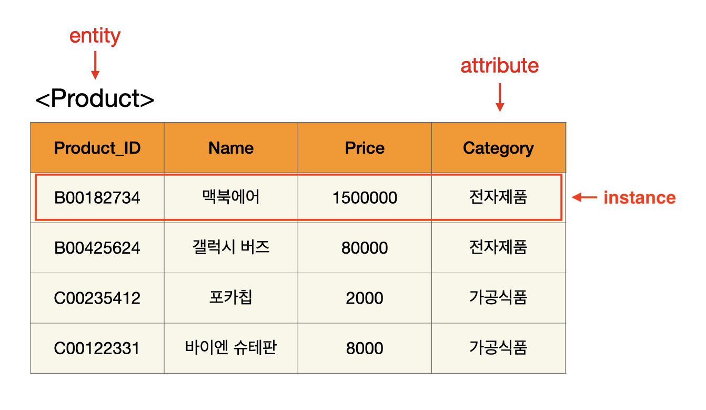
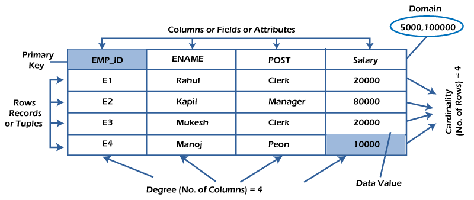
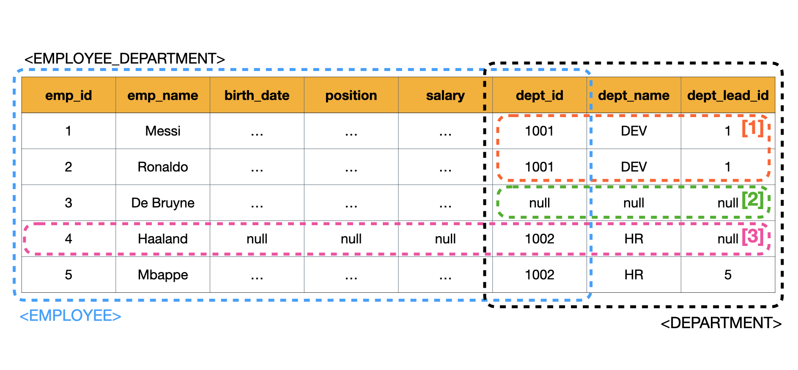
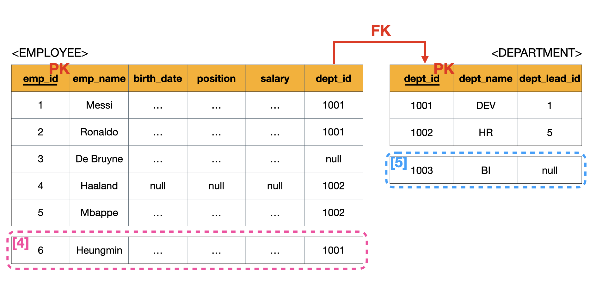
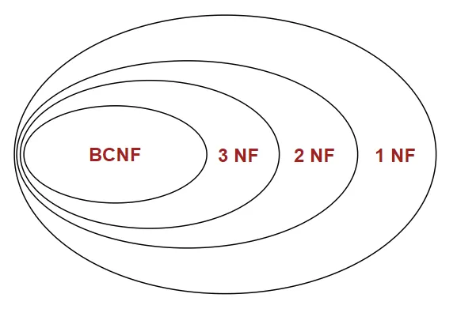
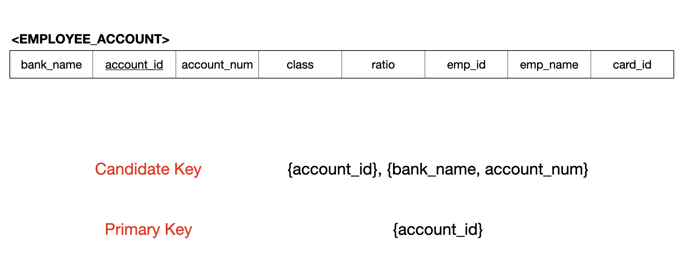
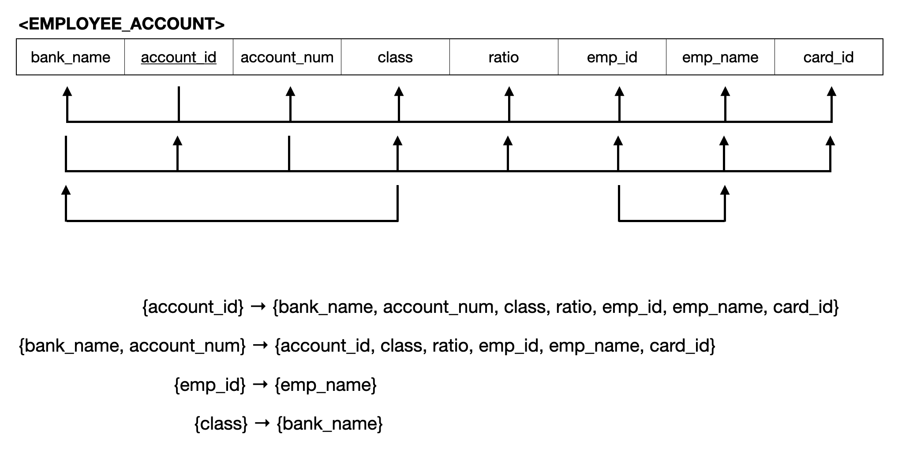
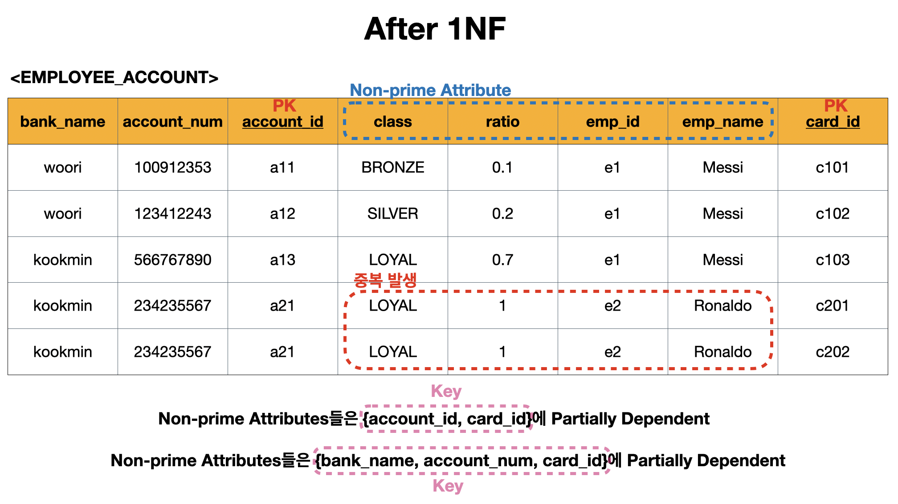
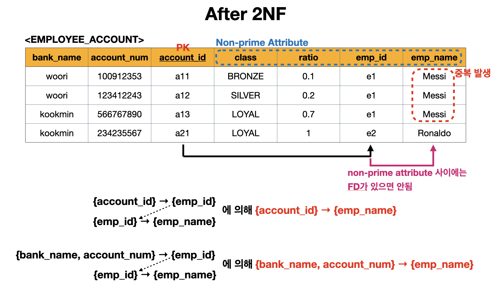
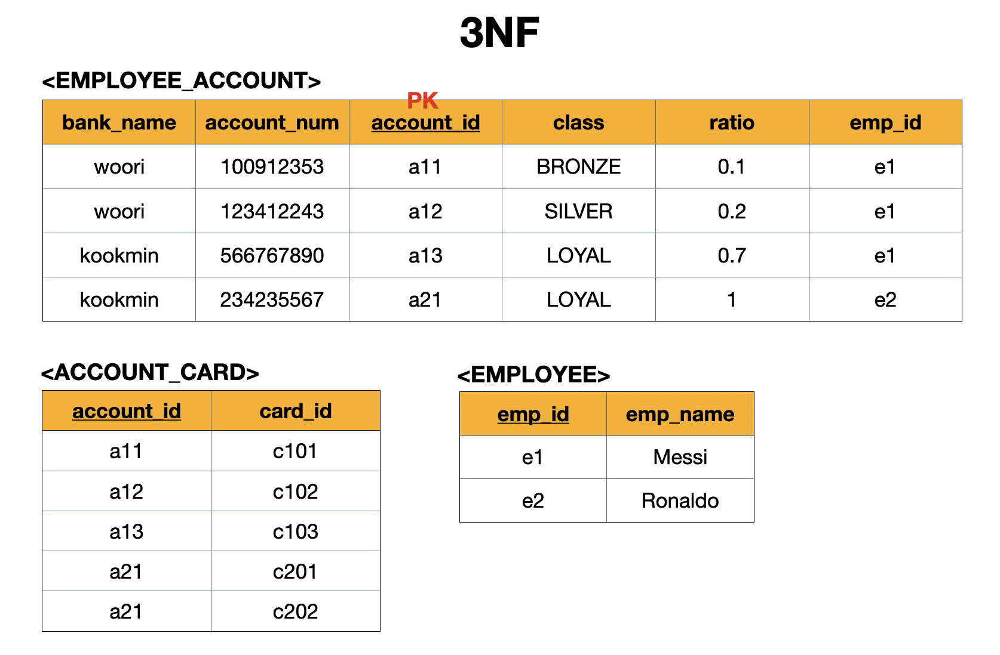

> 관계형 데이터베이스(Relational Database)에 대한 기본 개념.
>
> 한국 데이터 산업 진흥원 - SQL 전문가 가이드를 많이 참고 했습니다.

---

## Table of Content

1. [데이터베이스(Database, DB) 소개](https://github.com/seungki1011/Data-Engineering/blob/main/database/sql/(001)%20Relational%20Database.md#1-%EB%8D%B0%EC%9D%B4%ED%84%B0%EB%B2%A0%EC%9D%B4%EC%8A%A4database-%EC%86%8C%EA%B0%9C)
   * 데이터베이스의 정의
   * 데이터베이스 관리 시스템(DBMS)
   * 메타데이터(Metadata)
2. [Modeling](https://github.com/seungki1011/Data-Engineering/blob/main/database/sql/(001)%20Relational%20Database.md#2-modeling)
   * 데이터 모델링의 정의
   * 데이터 모델링의 3단계
   * 데이터 독립성(Data Independence)
     * three-schema-architecture
3. [Entity, Attribute, Relationship](https://github.com/seungki1011/Data-Engineering/blob/main/database/sql/(001)%20Relational%20Database.md#3-entity-attribute-relationship)
   * 엔티티(Entity)
   * 속성(Attribute)
   * 관계(Relationship)
4. [식별자(Identifier)](https://github.com/seungki1011/Data-Engineering/blob/main/database/sql/(001)%20Relational%20Database.md#4-%EC%8B%9D%EB%B3%84%EC%9E%90identifier)
   * 식별자의 정의
   * 식별자의 분류
   * 주식별자의 특징
   * 식별자와 비식별자 관계
5. [테이블(Table), 키(Key)](https://github.com/seungki1011/Data-Engineering/blob/main/database/sql/(001)%20Relational%20Database.md#5-%ED%85%8C%EC%9D%B4%EB%B8%94table-%ED%82%A4key)
   * 테이블(Table)
   * 키(Key)의 정의
   * 키(Key)의 종류
6. [성능 데이터 모델링](https://github.com/seungki1011/Data-Engineering/blob/main/database/sql/(001)%20Relational%20Database.md#6-%EC%84%B1%EB%8A%A5-%EB%8D%B0%EC%9D%B4%ED%84%B0-%EB%AA%A8%EB%8D%B8%EB%A7%81)
   * 성능 데이터 모델링의 정의
   * 성능 데이터 모델링의 수행 시점
   * 성능 데이터 모델링의 고려 사항
7. [정규화(Normalization)](https://github.com/seungki1011/Data-Engineering/blob/main/database/sql/(001)%20Relational%20Database.md#7-%EC%A0%95%EA%B7%9C%ED%99%94normalization)
   * 정규화의 정의
   * 잘못된 구조의 테이블
   * 정규화와 성능
   * 함수적 종속성(Functional Dependency, FD)
   * 정규화의 단계
8. [반정규화(Denormalization)](https://github.com/seungki1011/Data-Engineering/blob/main/database/sql/(001)%20Relational%20Database.md#8-%EB%B0%98%EC%A0%95%EA%B7%9C%ED%99%94denormalization)
   * 반정규화의 정의
   * 반정규화의 적용
9. [분산 데이터베이스(Distributed Database)]()
10. 락(Lock)
11. 트랜잭션(Transaction)
12. 동시성 제어(Concurrency Control)


---

## 1) 데이터베이스(Database) 소개

### 1-1. 데이터베이스(Database, DB)의 정의

우리가 흔히 듣는 데이터베이스(Database)란 무엇일까? 일단 데이터베이스의 정의를 찾아보면 다음과 같다.

> 데이터베이스는 컴퓨터 시스템에 전자적으로 저장되는 구조화된 정보 또는 데이터의 조직화된 집합이다.

여기서 말하는 조직화된 집합(organized collection)은 혼돈 상태로 존재하는 데이터를 분류하고 질서를 부여한 상태를 말한다. 예를 들어 뒤에서 설명할 관계형 데이터베이스(Relational Database)는 관련된 데이터들이 테이블과 인덱스를 이용해서 논리적으로 모여있다.

<p align="center">    </p>

<p align='center'>datawiz - data organization</p>

<br>

### 1-2. 데이터베이스 관리 시스템(Database Management System, DBMS)

그러면 데이터베이스와 함께 항상 거론되는 데이터베이스 관리 시스템(DBMS)는 무엇일까? DBMS의 정의는 다음과 같다.

> 사용자에게 데이터베이스를 정의하고 관리하는 기능을 제공하는 소프트웨어 시스템. 데이터베이스 자체 또는 데이터베이스 내의 데이터에 여러가지 작업을 할 수 있는 기능을 제공한다. 

DBMS가 제공해주는 기능에는 다음이 포함될 수 있다.

* 데이터베이스의 구조 정의, 스키마(Schema) 정의
* 데이터 쿼리 사용(Querying) : 데이터에 대해서 우리가 흔히 말하는 CRUD 등의 작업이 가능
* 동시성 제어(Concurrency Control) : 동시에 실행되는 여러개의 트랜잭션(Transaction)들이 성공적으로 마칠 수 있도록 제어를 지원한다
* 재해에 대비한 데이터 복구 및 백업

이외에도 쿼리 최적화(Query Optimization), 데이터의 무결성(Data Integrity) 보장, 보안 등 여러가지 기능을 지원할 수 있다.

> 위에서 언급하는 쿼리, 스키마, 동시성 등의 내용은 뒤에서 다룰 예정이다.
>
> SQL(Structured Query Language)은 관계형 데이터베이스(RDBMS)와 상호작용을 가능하게 해주는 언어이다.

DBMS는 크게 두 갈래로 구분할 수 있다. 

1. 관계형 데이터베이스 관리 시스템 (Relational DBMS, RDBMS)
   * 관계형 데이터 모델(Relation Model)을 이용하는 데이터베이스
   * 대부분 SQL을 이용한다
   * 대표적인 예시 : MySQL, Oracle Database, PostgreSQL 등
2. NoSQL DBMS
   * SQL을 사용하지 않는다가 아니라 "Not Only SQL"을 의미 한다
   * NoSQL은 그 안에서도 Document-Oriented, Key-Value Storage, Graph DB 등 여러가지 종류로 구분할 수 있다 
   * 대표적인 예시 : MongoDB, Cassandra, Redis 등

이 포스트에서는 RDBMS를 위주로 작성이 될 예정이고, NoSQL은 추후 다른 포스트에서 다룰 예정이다.

> DB와 DBMS는 다른 개념이지만, 보통 둘이 혼용해서 DB라는 표현으로 사용하는 경우가 많다. 뭘 지칭하는지는 상황에 맞게 판단하면 된다.

<br>

### 1-3. Metadata

그럼 데이터조직의 입장에서 메타데이터(Metadata)란 무엇일까? 메타 데이터의 정의를 찾아보면 다음과 같다.

> 메타데이터(Metadata)는 데이터에 관한 데이터이다. 데이터에 관한 구조화된 데이터이고, 다른 데이터를 설명해주는 데이터이다.

우리가 DB를 정의하다보면 데이터에 대한 부가적인 데이터가 계속 발생한다. 여기서 발생하는 부가적인 데이터가 메타 데이터이다. 이 부가적인 데이터는 DB를 정의하거나 기술하는 데이터인 경우가 많다. 메타데이터 또한 DB에 저장/관리 된다. 이 처럼 다른 데이터에 대한 정보를 제공하는 메타데이터는 다음과 같은 유형으로도 분류가 가능하다. 

1. 기술 메타데이터(Technical Metadata)
   * **데이터의 구조나 기술적인 측면을 중점에 둔다**
   * 예시
     * 데이블의 이름이나 행, 열에 대한 정보를 기록하는 테이블
     * 데이터 웨어하우스에 존재하는 데이터베이스의 이름
     * 각 열이 가지는 데이터 타입을 기록한 데이터 카탈로그(Data Catalog)
2. 운영 메타 데이터(Operational Metadata)
   * 문제 해결 및 워크 플로우 최적화에 유용
   * 예시
     * 시스템의 프로세스를 설명
     * 작업의 시작 및 종료 시간
     * 디스크 사용량
     * 데이터 이동 및 사용자의 액세스 추적에 대한 기록
3. 비즈니스 메타데이터(Business Metadata)
   * 비즈니스적인 관점에서 관련된 메타데이터
   * 기술적인 메타데이터가 데이터의 구조와 형식에 집중한다면, 비즈니스 메타데이터는 비즈니스에 의미가 있는 데이터에 집중한다
   * 예시
     * 데이터 획득, 데이터간 또는 데이터와 소스간 연결에 대한 정보
     * 고객, 매출, 프로덕트 코드 등과 같은 용어
     * 데이터 웨어하우스 시스템에 대한 문서

> 위에서 설명 기술, 운영, 비즈니스 데이터 등과 같은 분류는 사실 회사마다 다르게 해석하거나 사용할 수 있다. 그냥 "대충 이렇게 분류할 수 있고, 이런 의미를 가질수 있구나~" 정도로만 받아들이면 될 것 같다.

> 카탈로그(Catalog)는 조직화된 메타데이터의 모음 또는 관리하는 도구로 생각해도 좋을 것 같다.

<br>

---

## 2) Modeling

### 2-1. 데이터 모델링(Data Modeling)의 정의

데이터 모델링(Modeling)이라는 것은 무엇일까? AWS에서 데이터 모델링은 다음과 같이 정의된다.

> 데이터 모델링은 조직의 정보 수집과 관리 시스템을 정의하는 시각적 표현 또는 청사진을 생성하는 프로세스입니다. 이 청사진 또는 데이터 모델은 데이터 분석자, 과학자, 엔지니어와 같은 다양한 이해관계자들이 조직의 데이터에 대한 통일된 개념을 생성할 수 있게 돕습니다.

이것을 조금 풀어서 이야기 하자면, 데이터 모델링은 다음과 같이 설명을 할 수도 있다.

* 현실세계의 데이터에 대해 약속된 포기법에 의해 표현하는 과정
* 데이터베이스를 구축하기 위한 분석/설계의 과정
* 정보 시스템을 구축하기 위한 데이터 관점의 업무 분석 기법

DB 구조를 추상화해서 표현할 수 있는 데이터 모델(Data Model)을 만들어가는 것을 데이터 모델링이라고 할 수 있다.   

<br>

### 2-2. 데이터 모델링의 3단계

현실 세계에서 데이터베이스까지 만들어지는 과정은 시간에 따라 진행되는 과정을 추상화해서 표현하면 다음과 같이 **개념적(Conceptual) →논리적(Logical, Represential) → 물리적(Physical, Low-level) 데이터 모델링**으로 표현할 수 있다. 

<p align="center">    </p>

<p align='center'>SQL 전문가 가이드</p>

<br>

#### 개념적 데이터 모델링(Conceptual, High-level)

* 추상화 수준이 높고 업무중심적이고 포괄적인 수준의 모델링을 진행한다
* 일반 사용자들도 이해할 수 있는 개념으로 이루어지고, 보통 비즈니스 요구사항을 추상화하여 기술할 때 사용
* 이 단계의 주요한 활동은 핵심 엔티티(Entity)와 그들 간의 관계를 발견하고, 그것을 표현하기 위한 엔티티-관계 다이어그램(Entity-Relation Diagram) 생성


#### 논리적 데이터 모델링(Logical, Represential)

* 시스템으로 구축하고자 하는 업무에 대해 Key, Attribute, Relation 등을 정확하게 표현
* 종류에는 relational data model, object data model, object-relational data model 등이 있다
* 이 단계에서 수행하는 중요한 활동 중 하나는 정규화(Normalization)
  * 정규화를 간단하게 설명하자면 데이터 모델의 일관성을 확보, 데이터 중복 제거, 속성을 적절히 배치하는 작업 등을 통해 신뢰성있는 데이터 구조를 얻는 것이 목표이다


#### 물리적 데이터 모델링(Physical, Low-level)

* 실제로 데이터베이스에 이식할 수 있도록 성능, 저장 등의 물리적인 환경을 고려하고 설계한다
* 이 단계에서는 테이블, 칼럼 등으로 표현되는 물리적인 저장구조와 사용될 저장 장치, 자료를 추출하기 위해 사용될 접근 방법 등이 결정된다

<br>

> 많은 경우 개념적 데이터 모델링과 논리적 데이터 모델링은 한꺼번에 같이 수행되며, 논리적 데이터 모델링으로 수행된다.

> 위에서 언급한 엔터티(Entity), 관계(Relation), 정규화(Normalization) 등의 용어은 뒤에서 다룰 예정이다.

<br>

### 2-3. 데이터 독립성(Data Independence)

대이터 모델링에서의 데이터 독립성(Data Independence)에 대해 알아보자. 데이터 독립성의 정의를 찾아보면 다음과 같다.

> 데이터베이스 내의 데이터와 이들을 사용하는 응용 프로그램이 서로 영향을 받지 않는 것. 데이터가 바뀌더라도 프로그램이 바뀌지 않도록 하고, 응용 프로그램이 바뀌더라도 저장된 데이터 구조가 영향을 받지 않도록 해서 데이터가 여러 사람에 의해 다른 방법으로 사용될 수 있도록 한다.

간단하게 말하자면 **데이터 독립성은 데이터베이스 구조와 데이터가 서로 영향을 미치지 않는 것**을 의미한다. 그러면 데이터 독립성은 왜 필요한 것일까? 

<p align="center">    </p>

<p align='center'>https://www.geeksforgeeks.org/introduction-of-3-tier-architecture-in-dbms-set-2/</p>

<br>

위의 데이터 독립성에 대한 데이터베이스의 three-schema-architecture를 살펴보자. Three-schema-architecture의 목적은 user application layer로 부터 물리적인 데이터베이스(Physical Database)를 분리해서 데이터 독립성을 얻는 것이다.

<br>

1. 외부 스키마(External Schema)
   * 실제 사용자들이 바라보는 스키마
   * user view로도 불림
   * 특정 유저들이 필요로 하는 데이터만 표현하고, 알려줄 필요가 없는 데이터는 숨긴다
   * 논리적 데이터 모델을 통해서 표현한다

2. 개념적 스키마(Conceptual Schema)
   * 전체 데이터베이스에 대한 구조를 기술한다
   * 데이터베이스에 저장되는 데이타와 그들간의 관계를 표현한다
   * 내부적 스키마를 한번 추상화 시킨 스키마이고, 물리적인 저장 구조에 대한 내용은 숨긴다

3. 내부적 스키마(Internal Schema)
   * 물리적으로 데이터가 어떻게 저장되어 있는지 물리적 데이터 모델을 통해서 표현
   * 데이터 스토리지, 데이터 구조 등의 실체가 있는 내용을 기술한다
   * 실제로 데이터가 존재하는 곳은 internal level

<br>

이런 아키텍쳐를 통해서 각 단계의 독립성을 유지하고, 단순히 매핑(Mapping)을 바꿔주는 것으로 계층별 View에 영향을 주지 않고 변경하는 것이 용이하다.

> 아주 옛날의 데이터베이스들은 개념적 스키마(Conceptual Schema)가 없는 경우가 많았다. 대체로 물리적인 저장 구조와 그 디테일에만 집중을 했고, 데이터 독립성이 거의 없었던 만큼 데이터베이스 스키마 또는 물리적 저장소에 변경이 일어나는 경우 유저 애플리케이션에도 영향을 미쳤다.

> 대부분 DBMS에서 three-level이 완벽하게 나뉘어지지는 않는다.

> 데이터베이스의 스키마(Schema)는 데이터베이스 전체 또는 일부의 논리적인 구조를 표현하는 것으로 데이터베이스 내에서 데이터가 어떤 구조로 저장되는지 나타낸다.

<br>

---

## 3) Entity, Attribute, Relationship

### 3-1. 엔터티(Entity) 

엔터티를 정의하자면 다음과 같다.

> 엔터티(Entity)는 "업무에 필요하고 유용한 정보를 저장하고 관리하기 위한 집합적인 것(Thing)"이다. 또는, 엔터티는 업무 활동상 지속적인 관심을 가 지고 있어야 하는 대상으로서 그 대상들 간에 동질성을 지닌 인스턴스들이나 그들이 행하는 행위의 집합으로 정의할 수 있다

엔터티는 다음과 같은 특징들을 가질 수 있다.

* 반드시 해당 업무에서 필요하고 관리하고자 하는 정보이어야 한다
* 유일한 식별자(Unique Indentifier)에 의해 식별이 가능해야 한다
* 영속적으로 존재하는 인스턴스의 집합이어야 한다
* 반드시 속성(Attribute)이 있어야 한다
* 다른 엔터티와 최소 한 개 이상의 관계(Relationship)가 있어야 한다

엔터티를 유형과 무형에 따라서 분류를 하면 다음과 같이 분류할 수 있다.

1. 유형 엔터티(Tangible Entity) : 물리적이며 지속적인 엔터티
   * 제품, 고객 등
2. 개념 엔터티(Conceptual Entity) : 물리적 형태는 존재하지 않고 관리해야할 개념적 정보로 구분되는 엔터티
   * 부서, 보험 상품, 강의 등
3. 사건 엔터티(Event Entity) : 비즈니스 프로세스에 따라 발생되는 엔터티
   * 구매, 판매 등

<br>

### 3-2. 속성(Attribute)

속성을 정의하자면 다음과 같다.

> 데이터 모델링 관점에서 속성을 정의하자면, "업무에서의 엔터티의 정보를 나타내고 의미상 더 이상 분리되지 않는 최소의 데이터 단위"이다. 엔터티의 분류, 상태, 이름, 특성 등을 나타내는 항목으로 생각하면 편하다. 

<br>

다시 한번 속성의 정의를 정리하자면

* 업무에서 필요함
* 의미상 더 이상 분리되지 않음(atomic)
* 엔터티를 설명하고 인스턴스의 구성요소가 됨

속성의 특징은 다음과 같다.

* 해당 업무에서 관리하고 필요로하는 정보이어야 함
* 하나의 속성에는 하나의 값만 갖는다
  * 만약 하나의 속성에 다중값이 존재하면 별도의 엔터리를 이용하여 분리한다
* 동일 의미의 여러 속성이 있으면 안됨
* 주식별자에게 함수적으로 종속된다 → 기본키가 달라지면 속성의 값도 변경이 될 수 있다

<p align="center">    </p>

<br>

특성에 따라 속성을 분류하면 다음과 같다.

1. 기본 속성
   * 비즈니스 프로세스에서 도출한 본래의 속성
   * ID, 연락처, 등록일 등
2. 설계 속성
   * 데이터 모델링 과정에서 발생되는 속성
   * 상품코드 등
3. 파생 속성
   * 다른 속성에 의해서 만들어지는 속성
   * 합계, 평균, 표준편차 등

<br>

### 3-3. 관계(Relationship)

관계를 정의하자면 다음과 같다.

> "엔터티의 인스턴스 사이 의 논리적인 연관성으로서 존재의 형태로서나 행위로서 서로에게 연관성이 부여된 상태".

관계는 엔터티와 엔터티 간 연관성을 표현하기 때문에 엔터티의 정의에 따라 영향을 받기도 하고, 속성 정의 및 관계 정의에 따라서도 다양하게 변할 수 있다. 두 개의 엔터티 사이에 관계를 정의할 때 다음 사항을 체크할 수 있다.

* 두 엔터티 사이에 관심있는 연관규칙이 존재하는가?
* 두 엔터티 사이에 정보의 조합이 발생하는가?
* 관계 연결에 대한 규칙이 서술되어 있는가?
* 관계 연결을 가능하게 하는 동사가 있는가?

관계명을 정할때 다음과 같은 기준을 적용한다.

* 관계에 엔터티가 참여하는 형태를 정의한다
* 애매한 동사를 피한다
  * "관계된다", "관련이 있다" 등은 두 엔터티간 어떤 상태가 존재하는지 파악 불가능
* 현재형으로 표현한다
  * "수강 신청한다", "강의를 한다" 처럼 현재형으로 표현해야한다

<br>

<p align="center">    </p>

<p align="center">    </p>

<p align='center'>SQL 전문가 가이드</p>

<br>

<p align="center">    </p>

<p align='center'>ER Diagram (보통은 IE표기법으로 표현한다)</p>

> 다음 처럼 정리 할 수 있다.
>
> 1. 엔티티(Entity)는 데이터 모델링을 사용하기 위한 객체이며, 제품(Product) 처럼 눈에 보이는(Tangible) 개념일 수도 있고, 주문(Order) 처럼 눈에 보이지 않는 개념이 될 수도 있다. (데이터베이스의 테이블로 생각하면 편함)
> 2. 속성(Attribute)은 업무에서 필요한 엔터티의 분류, 상태, 이름, 특성 등을 나타내는 항목으로 생각하면 편하다. (이때 의미상 더이상 분리되지 말아야한다)
> 3. 관계(Relationship)는 엔터티와 엔터티 간의 연관성을 표현한 것.

<br>

---

## 4) 식별자(Identifier)

### 4-1. 식별자의 정의

식별자는 다음과 같다.

> 식별자(Identifier)란 하나의 엔터티에 구성되어 있는 여러 개의 속성 중에 엔터티를 대표할 수 있는 속성을 의미한다. 엔터티를 구성하는 인스턴스들을 구분해주는 구분자를 식별자라고 할 수 있다. 
>
> 하나의 엔티티는 반드시 하나의 유일한 식별자(Unique Identifier)가 존재해야 한다. (유일 식별자는 다중속성으로 이루어질 수 있음)

<p align="center">    </p>

<p align='center'>SQL 전문가 가이드</p>

<br>

여기서 짚고 넘어가야할 것은 키(Key)와 식별자(Identifier)라는 용어는 업무적으로 구분이 되어 있다. **식별자는 논리 데이터 모델링 단계에서 사용되고, 키는 데이터베이스 테이블에 접근을 위한 매개체로서 물리 데이터 모델링 단계에서 사용된다.** 

<br>

### 4-2. 식별자의 분류

식별자는 다음과 같이 분류할 수 있다.

1. 대표성 여부
   * **주식별자 : 엔터티 내에서 각 인스턴스를 구분할 수 있는 구분자이며, 타 엔터티와 참조관계를 연결할 수 있다**
   * 보조 식별자 : 엔터티 내에서 각 인스턴스를 구분할 수 있는 구분자이지만, 대표성을 가지지 못해서 타 엔터티와 참조관계를 연결하지 못한다
2. 스스로 생성 여부
   * 내부 식별자 : 엔터티 내부에서 스스로 만들어지는 식별자
   * 외부 식별자 : 타 엔터티와의 관계를 통해 타 엔터티로부터 받아오는 식별자(물리 모델링 단계의 Foreign Key)
3. 단일 속성 여부
   * 단일 식별자 : 하나의 속성으로 구성된 식별자
   * 복합 식별자 : 다중 속성으로 구성된 식별자
4. 대체 여부
   * 본질 식별자 : 업무에 의해 만들어지는 식별자
   * 인조 식별자 : 업무적으로 만들어지지는 않지만 원조식별자가 복잡한 구성을 가지고 있기 때문에 인위적으로 만든 식별자

<br>

### 4-3. 주식별자의 특징

이때 **주식별자**의 경우 다음의 특징을 만족한다.

* 유일성 : 주식별자에 의해 엔터티내에 모든 인스턴스들을 유일하게 구분함
  * 예시) 사원번호가 주식별자가 모든 직원들에 대해 개인별로 고유하게 부여된다
* 최소성 : 주식별자를 구성하는 속성의 수는 유일성을 만족하는 최소의 수가 되어야 함
  * 예시) 사원번호만으로도 고유한 구조인데 사원분류코드+사원번호 구조로 식별자를 구성하면 부적절하다
* 불변성 : 주식별자가 한 번 특정 엔터티에 지정되면 그 식별자의 값을 변하지 않아야 함
  * 예시) 사원번호의 값이 변한다는 의미는 이전기록이 말소되는 개념임
* 존재성 : 주식별자가 지정되면 반드시 데이터 값이 존재(Null 불가능)
  * 예시) 사원번호가 없는 사원은 존재할 수 없음

**주식별자를 도출하는 기준**은 다음을 권장한다.

* 해당 없무에서 자주 이용되는 속성을 주식별자로 지정한다
* 명칭, 내역 등과 같이 이름으로 기술되는 것들은 주식별자로 지정하지 않도록 한다
* 주식별자의 속성이 복합으로 구성되어 있을 경우, 속성의 수가 너무 많지 않도록 한다 → 너무 많은 경우 인조식별자를 생성하는 것이 더 효율적일 수 있음

<br>

### 4-4. 식별자와 비식별자 관계

비식별자 관계는 다음과 같다.

> 부모 엔터티로부터 속성을 받았지만 자식 엔터티의 주식별자로 사용하지 않고 일반적인 속성으로만 사용하면 *비식별자 관계(Non-Identifying Relationship)*라고 한다

[더 알아보기](https://dataonair.or.kr/db-tech-reference/d-guide/sql/?mod=document&uid=329)

<br>

---

## 5) 테이블(Table), 키(Key)

### 5-1. 테이블(Table)

> 데이터는 관계형 데이터베이스의 기본 단위인 테이블 형태로 저장된다. 모든 자료는 테이블에 등록이 되고, 우리는 테이블로부터 원하는 자료를 꺼내 올 수 있다.

<p align="center">    </p>

<p align='center'>SQL 전문가 가이드</p>

테이블은 특정한 주제와 목적으로 만들어지는 일종의 데이터 집합이다. 데이터베이스의 관점에서 설명하자면, 테이블은 데이터를 저장하는 객체(Object)로서 관계형 데이터베이스(RDBMS)의 기본 단위이다.

<br>

<p align="center">    </p>

<p align='center'>javatpoint - what is rdbms</p>

* 열(Column) : 테이블에서 세로 방향으로 이루어진 하나하나의 특정 속성(Attribute)
* 행(Row) : 테이블에서 가로 방향으로 이루어진 연결된 데이터. 튜플(Tuple)이라고도 한다. (Record로 표현하기도 함)
* 도메인(Domain)은 특정 속성이 가져야하는 값의 범위로 보면 편하다 

> 데이터를 저장할 때 모든 데이터를 하나의 테이블에 저장하지는 않는다. 보통은 여러 테이블로 분할하면서 불필요한 중복값을 제거한다. 이 과정을  정규화(Normalization)라고 한다. 정규화는 뒤에서 더 자세히 알아볼 예정이다.

> 테이블을 릴레이션(Relation)이라고 표현하기도 한다.

<br>

### 5-2. 키(Key)의 정의

> 데이터베이스에서 키(Key)는 조건에 만족하는 튜플(Tuple)을 찾거나, 순서대로 정렬할 때 다른 튜플들과 구분할 수 있는 기준이 되는 속성이다.
>
> 키는 속성 하나(single attribute)로만 이루어지지 않고 다중 속성(multiple attributes)으로 이루어진 속성들의 집합(attribute set)일 수 있다.

위의 식별자에서도 언급했지만 **식별자는 논리 데이터 모델링 단계에서 사용되고, 키는 데이터베이스 테이블에 접근을 위한 매개체로서 물리 데이터 모델링 단계에서 사용된다.** 

> 키의 종류를 살피기 전에 유일성과 최소성의 개념을 다시 살펴보자.
>
> * 유일성(uniqueness): 하나의 키로 튜플을 유일하게 식별
> * 최소성(minimality): 키를 구성하는 속성들 중 필요한 최소한의 속성들로 키를 구성

<br>

### 5-3. 키(Key)의 종류

<p align="center">    </p>

<p align='center'>EMPLOYEE라는 테이블과 그 속성들</p>

<br>

키의 종류는 다음과 같다.

1. 슈퍼 키(Super Key)

   * 튜플을 유일(unique)하게 식별할 수 있는 키 (**유일성 만족**)
   * 예) ```{employee_id}```, ```{employee_id, name, department}```, ```{name, email}```
     * ```{employee_id}``` 이나 ```{name, email}``` 처럼 튜플을 유일하게 식별해주는 속성의 집합(attribute set)

   * 다른 테이블로 예시를 들면
     * 예) ```{team_name}``` + ```{back_number}``` 

2. 복합 키(Composite Key)

   * 2개 이상의 속성을 이용하는 키

3. 후보 키(Candidate Key)

   * 슈퍼키 중에서 어느 한 속성이라도 제거하면 유일하게 튜플을 식별할 수 없는 키
   * 예) ```{employee_id}``` 
   * 예) ```{team_name, back_number}```에서 ```team_name```이든 ```back_number```든 하나라도 제거하면 유일 식별 불가능

4. **기본 키(Primary Key)**

   * **튜플을 유일하게 식별하기 위해 선택된 후보 키**
   * **유일성, 최소성** 만족
   * 보통 최소성에 의해 속성의 수가 적은 후보 키를 고름
   * 예) ```{employee_id}```

5. 대체 키(Alternate Key)

   * 후보 키 중에서 기본 키로 선택되지 않은 키

6. 외래 키(Foreign Key)

   * 다른 테이블의 PK(Primary Key, 기본키)를 참조하는 키
   * 예) 아래 그림의 {팀 코드}

<p align="center">    </p>

<p align='center'>SQL 전문가 가이드</p>

> 기본키(PK)는 테이블에 밑줄 쳐서 표시하기도 한다.

<br>

---

## 6) 성능 데이터 모델링

### 6-1. 성능 데이터 모델링의 정의

성능 데이터 모델링을 정의하자면 다음과 같다.

> 성능 데이터 모델링이란 데이터베이스 성능(Performance) 향상을 목적으로 설계단계의 데이터 모델링 때부터 정규화(Normalization), 반정규화(Denormalization), 테이블통합, 테이블분할, 조인구조, PK, FK 등 여러 가지 성능과 관련된 사항이 데이터 모델링에 반영될 수 있도록 하는 것.

데이터 모델의 경우 크게 세 가지 경우룰 고려하여 성능저하가 올 수 있다.

* 데이터 모델의 구조에 의한 성능 저하
* 데이터가 대용령이 됨으로 인한 불가피한 성능 저하
* 인덱스 특성을 충분히 고려하지 않고 인덱스를 생성해서 성능 저하

<br>

### 6-2. 성능 데이터 모델링 수행 시점

**성능 향상을 위한 비용은 프로젝트 수행 중에 있어서 사전에 할수록 비용이 들지 않는다**. 성능을 향상 시키기 위한 작업을 초기에 하지 않으면 여러가지 추가적인 비용을 소진하게 되는 원인이 된다. 특히 데이터 증가가 빠르면 빠를수록 성능저하에 따른 개선비용은 기하급수적으로 증가한다.

<p align="center">    </p>

<p align='center'>SQL 전문가 가이드</p>

만약 어떤 트랜잭션(Transaction)이 해당 비즈니스 처리에 핵심적이고 성능이 저하되면 안되는 특징을 가지고 있다면, 프로젝트 초기에 운영 환경(Production Enviroment)에 대비한 테스트 환경을 구현하고 그곳에 트랜잭션을 발생시켜 실제 성능을 테스트해 보아야 한다

<br>

### 6-3. 성능 데이터 모델링 고려사항

데이터 모델링 단계에서 다음과 같은 프로세스로 진행하는 것이 모델링 단계에서 성능을 고려할 수 있다.

1. 데이터 모델링을 할 때 정규화를 정확하게 수행한다
2. 데이터베이스 용량산정을 수행한다
   * 정규화가 완성된 모델에 대해서 해당 데이터 모델의 각각 엔터티(테이블)에 어느 정도 트랜잭션이 들어오는지 살펴본다
3. 데이터베이스에 발생되는 트랜잭션의 유형을 파악한다
   * CRUD 매트릭스를 보고 파악
   * 시퀀스 다이어그램으로 파악
   * 트랜잭션 유형 파악을 통해 SQL문장의 조인관계 테이블에서 데이터조회의 칼럼들을 파악할 수 있게 됨
4. 용량과 트랜잭션의 유형에 따라 반정규화를 수행한다
5. 이력 모델의 조정, PK/FK 조정, 슈퍼타입/서브타입 조정을 수행한다
6. 성능관점에서 데이터 모델을 검증한다

<br>

> 시간에 따라 발생하는 데이터 형식을 *이력*이라고 한다.

<br>

---

## 7) 정규화(Normalization)

### 7-1. 정규화의 정의

정규화의 정의는 다음과 같다.

> 데이터베이스의 설계에서 *중복을 최소화 하도록 데이터를 구조화*하는 프로세스. 데이터베이스 정규화의 목표는 이상이 있는 관계를 재구성하여 작고 잘 조직된 관계를 생성하는 것에 있다. *일반적으로 크고, 제대로 조직되지 않은 테이블들과 관계들을 작고 잘 조직된 테이블과 관계들로 나누는 것을 포함한다.*

> 데이터 베이스는 중복된 데이터를 허용하지 않음으로써 *무결성(Integrity)*을 유지할 수 있다. *데이터 무결성(Integrity)은 데이터의 수명주기(Life Cycle) 동안 데이터가 일관성, 정확성, 유효성을 유지하고 보증하는 것*

<br>

테이블간의 중복 데이터를 허용하지 않도록 데이터베이스를 구조화하는 것은 정규화의 주된 목표 중 하나이다. **더 큰 의미에서의 정규화는 정리되지 않은 큰 테이블들을 더 작고 관리가 쉬운 테이블로 나누어서 그 테이블간의 관계를 잘 설정하는 과정이다**. 이 과정을 통해서 데이터가 중복이 되지 않도록 설계를 하고, 효율적이고 유지보수가 쉬운 데이터베이스 구조를 정립하는 것이다.

<br>

### 7-2. 잘못된 구조의 테이블

테이블 설계를 잘못하는 경우를 살펴보자.

다음은 ```EMPLOYEE_DEPARTMENT```로 사원과 부서를 하나의 테이블로 구성한 경우이다.

<p align="center">    </p>

<p align='center'>유튜브 쉬운코드 - 데이터베이스</p>

* [1] : 데이터가 중복되어 저장공간 낭비 그리고 잘못된 입력으로 인한 데이터 불일치 가능성 존재
* [2] : ``null`` 값 사용은 최소화 하는 것이 좋다
* [3] : HR 부서 저장용 행(row)를 만들어 줘야함 → 매끄럽지 않다, 또한 나중에 HR에 속한 사원을 추가하는 경우 부서 추가를 위해 추가한 행은 삭제해야하는 번거러움이 존재한다

<br>

이런 문제를 해결하기 위해서 사원(EMPLOYEE)과 부서(DEPARTMENT)라는 각각의 관심사를 서로 다른 테이블로 분리해서 저장하면 된다.

<p align="center">    </p>

<p align='center'>유튜브 쉬운코드 - 데이터베이스</p>

* [4] : 단순히 사원에 대한 정보만 기록하면 되고, 부서에 대한 정보는 FK(Foreign Key)인 ```dept_id```를 통해서 접근
* [5]
  * 사원을 저장할때 항상 중복해서 저장했던 부서정보를 입력할 필요 없음
  * 사원 정보에 ```null```을 사용하는 형식으로 부서추가를 할 필요가 없음
  * ```null```인 ```dept_lead_id```는 나중에 부서에 사원이 들어오면 바꿔주면 됨

<br>

>  데이터베이스 스키마(Schema)를 설계할 때 다음의 요소를 고려하는 것을 권장한다.
>
> * 의미적으로 관련있는 속성끼리 테이블을 구성
> * 중복 데이터를 최대한 허용하지 않도록 설계
> * 조인(Join) 수행 시 가짜 데이터가 생기지 않도록 설계
> * 되도록 ```null``` 값을 줄이는 방향으로 설계

<br>

### 7-3. 정규화와 성능

정규화를 하는 것은 기본적으로 데이터에 대한 중복성을 제거하여 주고 데이터가 관심사별로 처리되는 경우가 많기 때문에 성능이 향상되는 특징을 가지고 있다. 엔터티가 계속 발생되므로 SQL문장에서 조인이 많이 발생하여 이로 인한 성능저하가 나타나는 경우도 있지만 이런 부분은 사례별로 유의하여 반정규화를 적용하는 전략을 사용할 수 있다.

<p align="center">    </p>

<p align='center'>SQL 전문가 가이드</p>

> 반정규화(Denormalization)만이 조회 성능을 향상시킨다고 생각하면 안된다. 정규화를 통해서도 조회 성능이 향상되는 경우도 많다는 것을 알자.

<br>

### 7-4. 함수적 종속성(Functional Dependency, FD)

함수적 의존성(앞으로 FD라는 표현을 사용)의 정의는 다음과 같다.

> *함수적 종속(Functional Dependency)*이란 데이터베이스의 릴레이션(Relation)에서 두 개의 속성(Attribute) 집합 간의 제약이다.
>
> 어떤 릴레이션 *R*에서, *X*와 *Y*를 각각 *R*의 속성(Attribute) 집합의 부분 집합이라 하자. 애트리뷰트 *X*의 값 각각에 대해 시간에 관계없이 항상 애트리뷰트 *Y*의 값이 오직 하나만 연관되어 있을 때 *Y*는 *X*에 *함수적으로 종속한다*라 하고, *X → Y* 로로 표기한다.
>
> *X*를 *결정자*, *Y*를 *종속자*라고 표현하기도 한다.

<br>

<p align="center">    </p>

위의 예시를 살펴보자.

* 속성 집합: ```X = {std_id}```, ```Y = {std_name, birth_date, address}```
* 여기서 알 수 있는 것은 테이블의 두 튜플간 **X** 값이 같으면 **Y**에 속한 속성들의 값도 같다
* 이렇게 **X** 값에 따라 **Y** 값이 유일(Unique)하게 결정되면, **X**와 **Y** 두 집합 사이의 제약 관계를 **FD(Functional Dependency)**라고 한다.
* 함수적 종속(**X → Y**)을 다음과 같이 표현하기도 한다
  * **X** functionally determines **Y** : **X**가 **Y**를 함수적으로 결정한다
  * **Y** is functionally dependent on **X** : **Y**가 **X**에 함수적으로 의존한다(종속된다)

<br>

그러면 FD 관계를 파악할 때의 고려사항은 무엇일까? 

* 테이블의 **스키마를 보고 의미적으로 파악해야 한다**
* 테이블의 스테이트(State)를 보고 FD를 파악하면 안된다

테이블의 스키마를 보고 의미적으로 파악한다의 의미를 더 자세히 살펴보자. 

집합 **Y**에 ```major``` 속성을 넣는다고 가정해보자. 만약 한 명의 학생(STUDENT)이 여러개의 전공(major)을 가질 수 있다면, 이 때 **X** 값에 따라 **Y**값을 유일하게 결정하지 못한다. 이 처럼 설계하는 테이블의 속성들이 관계적으로 어떤 의미를 지니는지에 따라 FD가 달라진다. (만약 복수 전공이 불가능하고 오직 하나의 전공만을 가질 수 있다면 ```major```를 **Y**에 넣어도 FD가 성립했을 것이다.)

<br>

> 아래의 결정한다(determine)를 특정한다로 바꿔서 생각하면 편하다.

이제 FD의 종류에 대해 알아보자.

1. 완전 함수적 종속(Full FD)

   * 종속자가 기본키(PK)에만 종속되며, PK가 다중 속성으로 구성되어 있는 경우 PK를 구성하는 모든 속성이 포함된 기본키의 부분집합에 종속된 경우
   * **X → Y**가 유효할 때 **X**의 모든 proper subset이 **Y**를 결정할 수 없다면 **X → Y**는 **Full FD**
   * 예) ```{std_id, class_id}``` → ```{grade}```가 유효할 때 ```{std_id}```, ```{class_id}```, ```{}```는 ```{grade}```를 결정지을 수 없기 때문에 Full FD 성립

   <br>

2. 부분 함수적 종속(Partial FD)

   * 종속자가 기본키(PK)가 아닌 다른 속성에 종속되거나, PK가 다중 속성으로 구성되어 있는 경우 PK를 구성하는 속성 중 일부만 종속되는 경우
   * **X → Y**가 유효할 때 **X**의 proper subset가 **Y**를 결정할 수 있으면 **X → Y**는 **Partial FD**
   * 여기서 proper subset은 **X**와 동일하지 않은 **X**의 부분 집합
     * 예) **X**: ```{std_id, std_name}```,  proper subset of **X** : ```{std_id}```, ```{std_name}```, ```{}```
     * 예) ```{std_id, std_name}``` → ```{birth_date}```가 유효할 때 ```{std_id}``` → ```{birth_date}```도 유효하기 때문에 Partial FD 성립

   <br>

3. 이행적 종속(Transitive FD)

   * **X**, **Y**, **Z** 3 개의 속성(Attribute) 집합 이 있을 때 **X → Y**, **Y → Z**라는 종속 관계가 유효하다면 **Transitive FD**
   * **X → Y** 이고 **Y → Z** 이면 **X → Z** 
   * **Y**와 **Z**는 어떠한 키(Key)의 부분 집합이면 안됨

   <br>

4. 자명한 함수적 종속(Trivial FD)

   * **X → Y**가 유효할 때 **Y**가 **X**의 부분집합이면 **X → Y**는 자명한 함수적 종속
   * 예) **X**: ```{a, b, c}``` → **Y**: ```{c} ```
   * 쉽게 말해서 성립할 수 밖에 없는 함수적 종속 (자명하다)

<br>

> Full FD와 Partial FD를 쉽게 설명해보자면, *X*: ```{a, b, c}``` → *Y*: ```{d} ``` 가 유효할 때 *X*에서 어떤 속성을 제거해도 유효하다면 Partial FD, 어떤 속성을 하나라도 제거해서 FD가 유효하지 않다면 Full FD로 이해하면 편한다.  

<br>

### 7-5. 정규화의 단계

각 정규화의 단계에 대해서 살펴보자. 해당 부분은 [유튜브 쉬운코드 - DB 정규화](https://www.youtube.com/watch?v=EdkjkifH-m8&list=PLcXyemr8ZeoREWGhhZi5FZs6cvymjIBVe&index=23)를 참고해서 작성했다.

<p align="center">    </p>

<p align='center'>Stackademic(Mohomed Ashkar Haris) - Normal Forms</p>

<br>

각 정규화 단계를 이루기 위해 준수해야 하는 각각의 규칙들을 **Normal Form(NF)**이라고 한다. 각 정규화 단계를 이루기 위해서는 각 NF을 만족해야 하고, 이 때 NF를 순차적으로 만족해야 다음 NF로 넘어갈 수 있다. 

* 예) 2NF 정규화를 하기 위해서는 1NF 정규화를 만족해야 함
* 예) BCNF 정규화를 하기 위해서는 1NF, 2NF, 3NF 정규화를 만족해야 함

> 정규화는 BCNF를 넘어서 4NF, 5NF, 6NF도 존재하지만 현재 포스트에서는 다루지 않는다. (4NF 정규화를 넘어가는 경우는 거의 없다고 봐도 된다)

<br>

> 들어가기에 앞서 앞에서 설명한 키의 개념을 복습해보자.
>
> 1. Super Key : 튜플을 유일하게 식별할 수 있는 Key
> 2. Key(Candidate Key) : Super Key 중에서 어느 한 속성이라도 제거하면 유일하게 튜플을 식별할 수 없는 Key
> 3. Primary Key(PK) : 튜플을 유일하게 식별하기 위해 선택된 Key

정규화를 설명하기 위해 사용할 테이블과 그 스키마를 살펴보자.

<p align="center">    </p>

<p align='center'>"유튜브 쉬운코드 - DB 정규화"에서 사용한 스키마 예시</p>

* 테이블은 사원(EMPLOYEE)의 월급 계좌(ACCOUNT)를 관리하는 테이블
* 월급 계좌는 ```woori``` 또는 ```kookmin``` 은행 중 하나
* 한 사원이 하나 이상의 월급 계좌를 등록하고, 각 계좌로 들어가는 월급 비율(```ratio```)를 조정가능 (```ratio```의 합은 항상 1)
* 계좌마다 등급(```class```)이 존재한다
  * ```kookmin``` : STAR → PRESTIGE → LOYAL
  * ```woori``` : BRONZE → SILVER → GOLD
* 한 계좌는 하나 이상의 현금 카드와 연동 가능
* **Prime Attribute : 임의의 key(candidate key)에 속하는 속성**
  * ```account_id```, ```bank_name```, ``` account_name```
* **Non-prime Attribute : 어떠한 key에도 속하지 않은 속성**
  * ```class```, ```ratio```, ```emp_id```, ```emp_name```, ```card_id```

<br>

정규화 과정에 들어가기 전에 테이블의 FD를 파악해보자.

<p align="center">    </p>

<p align='center'>테이블의 Functional Depedency 파악</p>

*  ```class```에 따른 은행(```bank_name```) 특정 가능
* 은행(```bank_name```) 에 따른 계좌번호(```account_num```)로 나머지 속성 특정 가능

<br>

#### 1NF

> *제 1 정규화(1NF)*는 테이블의 속성이 atomic value(나눠질 수 없는 값)를 갖도록 테이블을 분해하는 것이다.

<p align="center">    </p>

<p align='center'>1NF 과정</p>

* 속성값이 아토믹(atomic) 해야하기 때문에 c101, c202가 들어있는 튜플을 두 개로 만들어서 값을 나눠서 넣는다
* 발생한 문제
  * 중복 데이터가 생김
  * 기존의 PK ```{account_id}```를 ```{account_id, card_id}```로 변경해야 한다
  * ```ratio```는 합이 1이어야 함
* **이런 문제들이 발생했지만 일단 값을 아토믹하게 만들었기 때문에 1NF를 만족 시켰다**

<br>

#### 2NF

> *제 2 정규화(2NF)*는 모든 Non-prime Attribute들이 모든 키(Key)에 대해 완전 함수적 종속(Fully Functional Dependent) 되어야 한다.

쉽게 말해서 **제 1 정규화(1NF)를 진행한 테이블에 대해 완전 함수 종속을 만족하도록 테이블을 분해하는 것이다.**

**제 2 정규화(2NF)**를 진행하기에 앞서 1NF 이후의 문제점들을 살펴보자. 

<p align="center">    </p>

<p align='center'>After 1NF</p>

* ```card_id``` 없이 ```{account_id}``` 만으로도 non-prime attribute들을 유니크하게 결정할 수 있음
* ```card_id``` 없이 ```{bank_name, account_num}``` 만으로도 non-prime attribute들을 유니크하게 결정할 수 있음
* 중복은 결국 ```card_id```의 값을 두 개의 튜플로 나누면서 발생
* 결국 ```card_id```라는 속성이 키에 포함이 되면서 생긴 문제이기 때문에 ```card_id```를 분리하면 됨

<br>

다음은 **제 2 정규화(2NF)**의 과정이다.

<p align="center">    </p>

<p align='center'>2NF</p>

<br>

#### 3NF

> *제 3 정규화(3NF)*는 모든 non-prime attribute가 어떤 키(Key)에도 이행적 종속(Transitive Dependent)하면 안된다.
>
> (non-prime attribute와 non-prime attribute 사이에는 어떠한 FD가 존재하면 안된다.)

쉽게 말해서 **제 2 정규화(2NF)를 진행한 테이블에 대해 이행적 종속성(Transitive Dependency)을 없애도록 테이블을 분해하는 것이다.**

들어가기에 앞서 이행적 종속성(Transitive Dependency)을 복습하고 가자.

> *이행적 함수적 종속(Transitive FD)*
>
> * X, Y, Z 3 개의 속성(Attribute) 집합 이 있을 때 X → Y, Y → Z라는 종속 관계가 유효하다면 *Transitive FD*
> * X → Y 이고 Y → Z 이면 X → Z 
> * Y와 Z는 어떠한 키(Key)의 부분 집합이면 안됨

<br>

**제 3 정규화(3NF)**를 진행하기에 앞서 2NF 이후의 문제점들을 살펴보자. 

<p align="center">    </p>

<p align='center'>After 2NF</p>

<br>

이제 **제 3 정규화(3NF)**를 진행해보자. 문제가 되었던 ```{emp_id}```→ ```{emp_name}```을 해결하기 위해서 새로운 테이블로 분리해내면 된다. 

<p align="center">    </p>

<p align='center'>3NF</p>

* 보통 3NF가 끝나면 정규화(Normalized)가 되었다고 할 수 있다.

<br>

#### BCNF(Boyce-Codd Normal Form)

> 모든 유효한 비자명한 함수적 종속성(Non-Trivial Functional Dependency)을 만족하는 X → Y 에서 X는 슈퍼키(Super Key)이어야 한다.

쉽게 말하자면 BCNF는 제 3 정규화(3NF)를 만족하면서 모든 결정자(Determinent)가 후보키(Candidate Key) 집합에 속해야 한다. 

우리의 예시에 바로 적용을 해보면, ```class```에 따른 ```bank_name``` 테이블을 분리하면 된다. 

<br>

---

## 8) 반정규화(Denormalization)

### 8-1. 반정규화의 정의

> 기본적으로 반정규화(Denormalization)는 데이터를 중복하여 성능을 향상시키기 위한 기법이라고 정의할 수 있다. 좀 더 넓은 의미의 반정규화는 성능을 향상시키기 위해 정규화된 데이터 모델에서 중복, 통합, 분리 등을 수행하는 모든 과정을 의미한다.

기본적으로 정규화는 입력/수정/삭제에 대한 성능을 향상시킬 뿐만 아니라 조회에 대해서도 성능을 향상시키는 역할을 한다. 그러나 정규화만을 수행하면 엔터티의 갯수가 증가하고 관계가 많아져 여러 개의 조인(Join)이 걸려야만 데이터를 가져오는 경우가 있다. 이러한 경우, 데이터에 대한 조회 성능이 중요한 경우 부분적으로 반정규화를 고려한다. 

이전에 1NF 부터 BCNF 정규화를 거치면서 테이블이 점점 늘어나는 것을 확인 할 수 있었다. 이 때 BCNF 에서 다시 3NF으로 테이블을 합치는 것을 반정규화의 예시 중 하나로 볼 수 있다. 정규화의 역 작용을 한다고 해서 역정규화로 표현하기도 한다.

<br>

### 8-2. 반정규화 적용 방법

반정규화를 적용할 때는 기본적으로 데이터 무결성이 깨질 가능성이 많이 있기 때문에 반드시 데이터 무결성을 보장할 수 있는 방법을 고려한 이후에 반정규 화를 적용하도록 해야 한다.

<p align="center">    </p>

<p align='center'>SQL 전문가 가이드</p>

<br>

> 정규화(Normalization)와 반정규화(Denormalization)은 일종의 Trade-Off 관계에 있기 때문에, 상황에 맞게 정규화와 반정규화를 적용해서 데이터베이스를 설계해야한다. 

<br>

---

## 9) 


---

## 요약


<br>

---

## P.S

* 정규화 파트에서 [유튜브 쉬운코드 - DB 정규화](https://www.youtube.com/watch?v=EdkjkifH-m8&list=PLcXyemr8ZeoREWGhhZi5FZs6cvymjIBVe&index=23)를 많이 참고했습니다. 인프런에도 강의가 올라와 있으니 데이터베이스 기초에 대해 알고 싶으면 한번 보시는 것을 추천드립니다.
* **SQL 전문가 가이드**는 별로 친절하지 않은 것 같다. 보조 이론서가 필요할 듯..


<br>

## Reference

---

1. [한국 데이터 산업 진흥원 - SQL 전문가 가이드](https://dataonair.or.kr/db-tech-reference/d-guide/sql/)
2. [유튜브 쉬운코드 - 데이터베이스](https://www.youtube.com/watch?v=aL0XXc1yGPs&list=PLcXyemr8ZeoREWGhhZi5FZs6cvymjIBVe&index=1)
3. [datawiz - organizing data](https://datawizkb.leibniz-psychology.org/index.php/during-data-collection/what-should-i-know-about-the-organization-of-datasets/)
4. [javatpoint - what is rdbms](https://www.javatpoint.com/what-is-rdbms)
5. [algo daily - normalization](https://algodaily.com/lessons/normalization-sql-normal-forms)
6. [Stackademic(Mohomed Ashkar Haris) - database normalization in brief](https://blog.stackademic.com/database-normalization-in-brief-7298c0f01b1f)