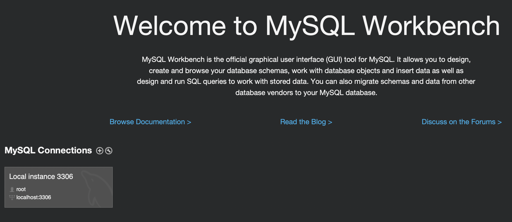
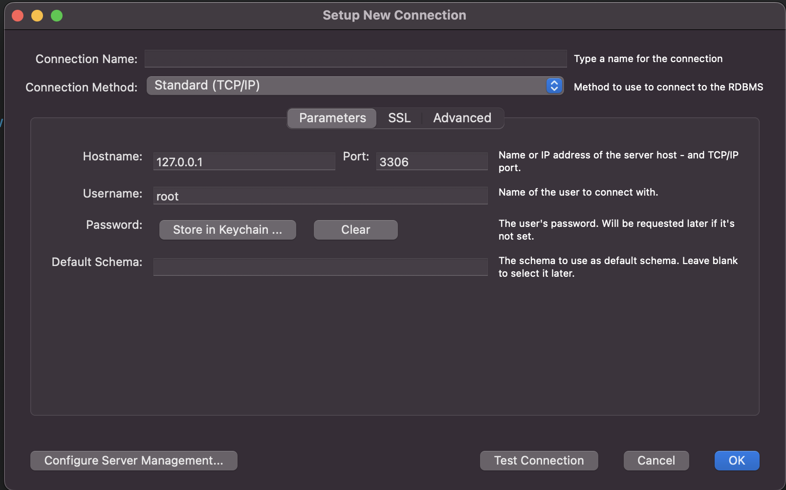
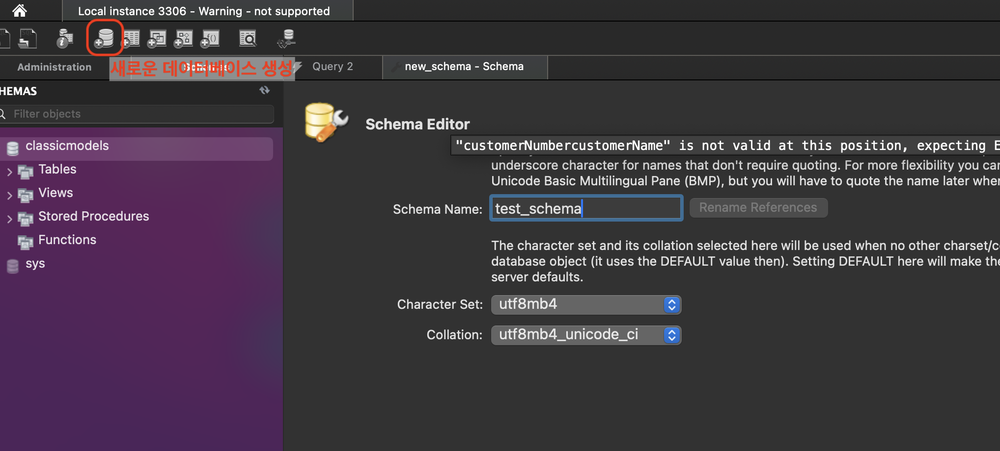
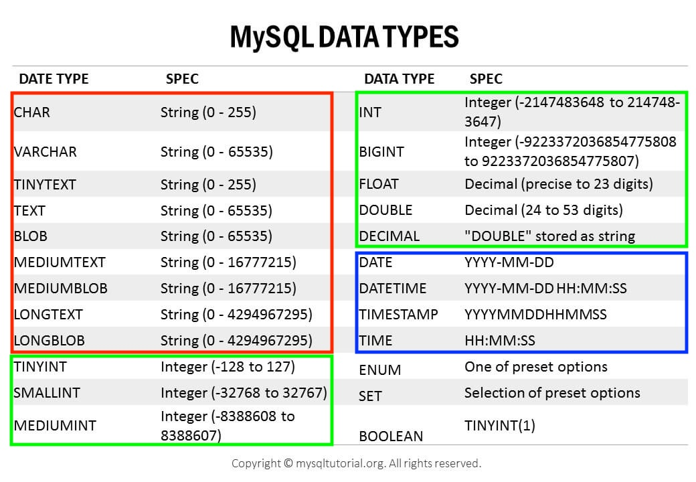
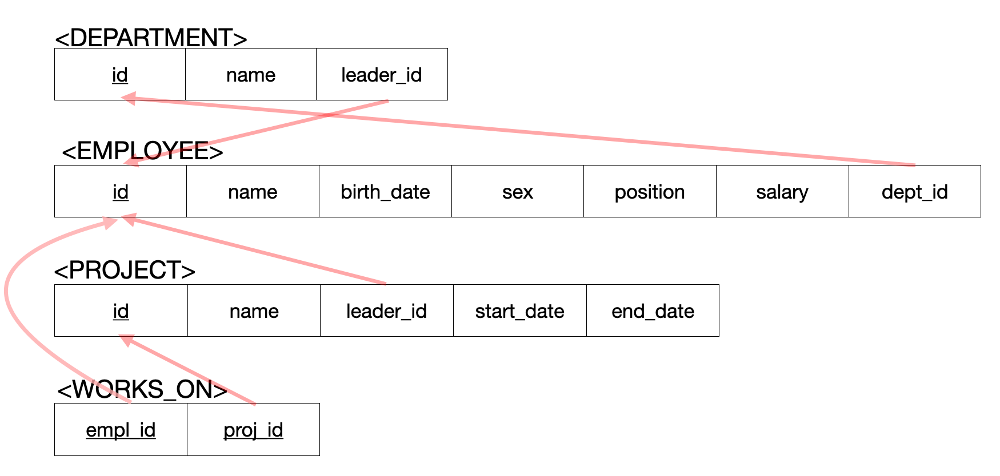

> SQL을 익히기 위한 실습. 
>
> "[한빛 미디어 - 이것이 MySQL이다](https://www.youtube.com/watch?v=VnnTh83sjcc&list=PLVsNizTWUw7Hox7NMhenT-bulldCp9HP9&index=6)"와 "[인프런 - 쉬운코드 데이터베이스 개론](https://www.inflearn.com/course/%EB%B0%B1%EC%97%94%EB%93%9C-%EB%8D%B0%EC%9D%B4%ED%84%B0%EB%B2%A0%EC%9D%B4%EC%8A%A4-%EA%B0%9C%EB%A1%A0/dashboard)"을 많이 참고 했습니다.

---

## Table of Contents

1. ```MySQL``` 설치와 설정
   * ```MySQL``` 설치와 연결
     * CLI
     * GUI
1. 기초 SQL문 (SQL로 데이터 처리)
   * 데이터베이스 생성 (```CREATE```)
   * 속성의 자료형 (Attribute Data Types)
   * 테이블 생성, Constraint 적용
     * 각 테이블 생성 및 설명
     * 테이블 스키마 변경 (```ALTER```)
   * 테이블에 데이터 추가 / 수정 / 삭제
   * 데이터 조회 (```SELECT```)
   * Subquery (Nested Query)
   * 조인 (```JOIN```)
   * 그룹짓기 (```GROUP BY```)
   * 정렬하기 (```ORDER BY```)
   * 집계하기 (Aggregate)
1. Stored Procedure
   * Stored Procdedure 소개


---

> MySQL에서 스키마(Schema)와 데이터베이스(Database)는 상호교환적(interchangeably)으로 사용 가능하지만 Oracle Database에서의 스키마는 데이터베이스의 논리적인 구조를 나타내는 용어이다.

## 1) MySQL 설치와 설정

> 해당 ```MySQL ```설치와 연결은 MacOS 로컬 환경 위에서 진행되었습니다.

<br>

### 1-1. MySQL 설치와 연결

* [MacOS 설치](https://dev.mysql.com/doc/mysql-installation-excerpt/8.0/en/macos-installation.html)
* [MySQL 서버에 연결](https://dev.mysql.com/doc/refman/8.0/en/connecting.html)

```MySQL```을 설치하고 연결하는 과정은 위의 document에 잘 나와있다.

<br>

#### 1-1-1. CLI

> CLI를 이용한 ```MySQL```. [여기서](https://dev.mysql.com/doc/refman/8.0/en/mysql-commands.html) 다양한 ```MySQL``` 명령어를 확인할 수 있다.

일단 설치를 완료했으면 ```MySQL ```서버를 시작해보자. (EC2 하나 파서하거나 도커 컨테이너로 실행해도 된다. 컨테이너를 사용한다면, 컨테이너 재시작이 종료하는 경우에도 데이터를 보존할 수 있도록 하자.)

```
brew services start mysql 
```

```MySQL``` 중지.

```
brew services stop mysql
```

<br>

```MySQL``` 서버에 연결하는 방법.

```
mysql --host=localhost --user=user_name --password=password mydb --port=3306
mysql -h localhost -u user_name -ppassword mydb
```

* ```--host``` : ```MySQL``` 서버의 ```hostname``` 또는 IP 주소
* ```--user``` : ```MySQL``` 유저네임 명시
* ```--password``` : 유저 패스워드
* ```mydb``` : 사용할 데이터베이스 이름 (없다면 비워놔도 된다)
* ```--port``` : 사용할 포트넘버 (명시하지 않으면 디폴트로 3306 사용)

> If you use a [`--password`](https://dev.mysql.com/doc/refman/8.0/en/connection-options.html#option_general_password) or `-p` option and specify a password value, there must be *no space* between [`--password=`](https://dev.mysql.com/doc/refman/8.0/en/connection-options.html#option_general_password) or `-p` and the password following it.

<br>

위의 사용법을 이용해서 ```MySQL``` 서버에 연결해보자.

```
mysql --host=localhost --user=root --password
```

* ```localhost``` 사용
* ```root``` 유저로 접속

<br>

<p align="center">    </p>

<p align='center'>MySQL CLI</p>

<br>

#### 1-1-2. GUI

> MySQL Workbench와 같은 GUI 툴의 사용. (DBeaver 같은 툴을 사용해도 무방하다.)
>
> GUI 툴들은 데이터베이스 시각화를 포함한 각종 다양한 기능을 제공한다.

* [MySQL Workbench 설치](https://dev.mysql.com/downloads/workbench/)

<br>

MySQL Workbench 설치 후 실행을 하면 다음과 같은 화면을 확인 할 수 있다.

<p align="center">    </p>

<p align='center'>MySQL Workbench</p>

* 기존에 CLI로 만들었던 연결을 확인할 수 있다

Delete Connection으로 만들어뒀던 열결을 삭제하고 새로 만들어보자. MySQL Connection 옆의 ```+``` 버튼을 누르면 새로운 연결을 만들 수 있다.

<p align="center">    </p>

* 기존의 CLI로 연결했을 때 설정했던 세부내용과 동일하다
* ```Connection Name```으로 해당 연결을 특정 지을 수 있는 이름을 부여할 수 있다

<p align="center">    </p>

* ```Schema Name``` : 스키마(데이터베이스)의 이름
* 나머지 세부 사항은 요구 스펙에 맞춰서 설정하면 됨
  * ```Character Set``` : 텍스트 데이터를 어떻게 인코딩할 것인지 결정
  * ```Collation``` : 설정한 ```Character Set```에 의해 저장된 데이터들이 어떻게 정렬될 것인지 결정
* ```Character Set``` 이나 ```Collation```은 스키마 레벨 그리고 테이블 레벨에서도 설정할 수 있음

<br>

---

## 2) 기초 SQL문

> SQL문을 이용한 기본적인 데이터 처리에 대한 실습.
>
> 초반에서도 언급했던 것 처럼 MySQL에서 Schema와 Database는 상호 교환적으로 사용가능하다. 

<br>

### 2-1. 데이터베이스 생성

데이터베이스(스키마)를 생성해보자. 

```sql
CREATE SCHEMA test_company; -- test_company 라는 이름의 스키마 생성
-- CREATE DATABASE test_company;
```

생성한 데이터베이스를 사용하기 위해서 일단 현재 사용하고 있는 데이터베이스를 확인해보자.

```sql
mysql> SELECT database();
```

```
+----------+
| schema() |
+----------+
| NULL     |
+----------+
1 row in set (0.00 sec)
```

사용할 데이터베이스를 정하지 않았기 때문에 ```NULL```을 확인할 수 있다.

이제 생성했던 ```test_company```를 사용하고, 사용중인 데이터베이스를 확인하자.

```sql
mysql> USE test_company;
```

```
Database changed
```

```sql
mysql> SELECT database();
```

```
+--------------+
| schema()     |
+--------------+
| test_company |
+--------------+
1 row in set (0.00 sec)
```

<br>

데이터베이스를 삭제하고 싶은 경우.

```sql
DROP DATABASE test_company;
```

<br>

### 2-2. Attribute Datatype

> MySQL에서 속성(Attribute)들이 가질 수 있는 자료형(Data Type)에 대해 알아보자.

* [MySQL Document - Data Types](https://dev.mysql.com/doc/refman/8.0/en/data-types.html)

<br>

<p align="center">    </p>

<p align='center'>https://www.mysqltutorial.org/mysql-basics/mysql-data-types</p>

MySQL에서는 대략적으로 다음과 같이 데이터를 분류할 수 있다. 

1. 숫자형 (Numeric Data Types)
   * 정수
     * 위의 표에서 ```TINYINT```~ ```BIGINT```
   * 부동 소수점 방식 (Floating Point)
     * 실수 저장에 사용
     * 고정 소수점에 비해 덜 정확하다
     * ```FLOAT```, ```DOUBLE``` 또는 ```DOUBLE PRECISION```
   * 고정 소수점 방식 (Fixed Point)
     * 실수를 정확하게 저장할 때 사용
     * ```DECIMAL``` 또는 ```NUMERIC```
     * 예) ```DECIMAL(8,2)``` => ```[-999999.99 ~ 999999.99]```
     * 총 8개의 digit, 2개는 소수점(decimal)을 위해 예약
2. 문자형 (String Data Types)
   * 고정 크기 문자열
     * ```CHAR(n)``` 
     * 저장될 문자열의 길이가 최대 길이보다 작으면 나머지를 space로 채워서 저장
   * 가변 크키 문자열
     * ```VARCHAR(n)```
     * 저장될 문자열의 길이 만큼만 저장
   * 사이즈가 큰 문자열
     * ```TINYTEXT``` ~ ```LONGTEXT```
   * ```BLOB```의 경우 아무런 인코딩 없이 raw binary data(byte-string)를 저장하고 싶으면 사용
3. 날짜와 시간 (Date & Time Data Types)
   * ```DATE``` ~ ```TIME```
   * ```TIMESTAMP```의 경우 time-zone이 반영됨

<br>

> Data Type의 경우 DBMS간에 사용하는 명칭이 다를 수 있다. 가령 MySQL의 경우 ```DECIMAL```과 ```NUMERIC```을 동일하게 사용한다.

<br>

### 2-2. 테이블 생성, Constraint 적용

이제 테이블에 대한 스키마를 대략적으로 정하고 테이블을 생성해보자.

<p align="center">    </p>

<p align='center'>사용할 테이블</p>

<br>

먼저 ```DEPARTMENT``` 테이블을 생성하고 해당 제약(constraint)들을 살펴보자.

```mysql
CREATE TABLE DEPARTMENT (
	id INT, 
	name VARCHAR(20) NOT NULL UNIQUE, -- NOT NULL과 UNIQUE 제약 적용
  leader_id INT, 
  PRIMARY KEY (id) -- id를 PK로 지정
);
```

* ```UNIQUE``` : ```UNIQUE```로 지정된 속성(attribute)은 중복된 값을 가질 수 없음 (```NULL``` 중복을 허용하는 경우는 있음, RDBMS 마다 다름)
* ```NOT NULL``` : ```NOT NULL```로 지정된 attribute는 ```NULL```을 값으로 가질 수 없다

<br>

다음으로 ```EMPLOYEE``` 테이블을 생성하자.

```mysql
CREATE TABLE EMPLOYEE (
	id INT,
	name VARCHAR(30) NOT NULL,
	birth_date DATE,
	sex CHAR(1) CHECK(sex IN ('M', 'F')), -- 성별은 무조건 M 또는 F
	POSITION VARCHAR(10),
	salary INT DEFAULT 50000000, 
	dept_id INT,
	PRIMARY KEY (id),
  -- dept_id는 DEPARTMENT의 id를 참조
  -- DEPARTMENT의 id(참조값)을 삭제하는 경우 참조하던 FK 값을 NULL로 변경
  -- 참조값을 변경하는 경우 똑같이 업데이트한 값으로 변경
	FOREIGN KEY (dept_id) REFERENCES DEPARTMENT(id) ON DELETE SET NULL ON UPDATE CASCADE,
	CHECK (salary >= 50000000) -- 최소 연봉을 5000만으로 
);
```

* ```DEFAULT``` : attribute의 디폴트(기본) 값을 정의할 때 사용
  * 새로운 튜플(tuple, row)를 저장할 때 해당 attribute에 대한 값이 없으면 디폴트 값으로 저장
* ```CHECK``` 제약은 attribute의 값을 제한하고 싶을 때 사용
* ```FOREIGN KEY``` (Referential Integrity Constraint) : attribute가 다른 테이블의 PK 또는 유니크키(unique key)를 참조할 때 사용 
  * 참조하고 있던 값이 삭제(delete)또는 업데이트(update) 될때 FK를 어떻게 처리할 것인지 지정할 수 있는 옵션들이 있다
  * ```CASCADE``` : 참조값의 삭제/변경을 그대로 반영
  * ```SET NULL``` : 참조값이 삭제/변경 시 ```NULL```로 변경
  * ```RESTRICT``` : 참조값이 삭제/변경되는 것을 금지
  * ```NO ACTION```: MySQL에서는 ```RESTRICT```와 동일
    * 표준 SQL 스펙에서는 비슷
  * ```SET DEFAULT``` : 참조값이 삭제/변경 시 설정한 디폴트 값으로 변경
    * MySQL에서는 지원하지 않음

<br>

Constraint에는 이름을 명시할 수 있음. 제약에 이름을 붙이면 어떤 제약을 위반했는지 쉽게 파악이 가능함. 예를 들어 다음과 같이 제약에 이름을 붙여보자.

```mysql
CREATE TABLE TEST (
	age INT CONSTRAINT age_over_19 CHECK (age > 19)
);
```

* ```age```가 19를 넘었는지 확인하는 ```CHECK```제약에 ```age_over_19```이라는 이름을 붙임
* 제약을 위반하는 경우 ```CHECK constraint 'age_over_19' is violated```
* 제약 이름을 생략해서 사용하는 경우  ```CHECK constraint 'test_chk_1' is violated``` 처럼 이름이 직관적이지 않아서 위반한 제약을 파악하기가 상대적으로 어렵다

> 참고로 ```SHOW CREATE TABLE table_name;```을 통해서 ```table_name```이라는 테이블의 여러가지 정보를 확인할 수 있다.

<br>

이제 ```PROJECT``` 테이블을 생성해보자.

```mysql
CREATE TABLE PROJECT (
	id INT,
	name VARCHAR(20) NOT NULL UNIQUE,
	leader_id INT,
	start_date DATE,
	end_date DATE,
	PRIMARY KEY (id),
  -- leader_id는 EMPLOYEE의 id 참조
	FOREIGN KEY (leader_id) REFERENCES EMPLOYEE(id) ON DELETE SET NULL ON UPDATE CASCADE,
	CHECK (start_date < end_date) -- 시작 날짜는 끝 날짜보다 항상 먼저
);
```

<br>

```WORKS_ON``` 테이블을 생성해보자.

```mysql
CREATE TABLE WORKS_ON (
	empl_id INT,
	proj_id INT,
	PRIMARY KEY (empl_id, proj_id),
	FOREIGN KEY (empl_id) REFERENCES EMPLOYEE(id) ON DELETE CASCADE ON UPDATE CASCADE,
	FOREIGN KEY (proj_id) REFERENCES PROJECT(id) ON DELETE CASCADE ON UPDATE CASCADE
);
```

```
+------------------------+
| Tables_in_test_company |
+------------------------+
| DEPARTMENT             |
| EMPLOYEE               |
| PROJECT                |
| WORKS_ON               |
+------------------------+
4 rows in set (0.00 sec)
```

<br>

테이블 생성당시 ```DEPARTMENT```→```EMPLOYEE``` →```PROJECT``` →```WORKS_ON``` 순서로 생성하였다. 이떄 ```DEPARTMENT```의 ```leader_id```에 FK를 설정하지 못했기 때문에 FK를 사용하도록 ```DEPARTMENT``` 테이블의 스키마를 변경해야한다.

```mysql
ALTER TABLE DEPARTMENT ADD FOREIGN KEY (leader_id) -- leader_id에 대해서 FK 추가
REFERENCES EMPLOYEE(id) -- EMPLOYEE의 id 참조
ON UPDATE CASCADE -- 참조값이 업데이트 되면 똑같이 업데이트
ON DELETE SET NULL; -- 참조값이 삭제되면 NULL로 변경
```

* ```ALTER TABLE```에는 ```ADD FOREIGN KEY``` 외에도 다양한 유형의 스키마 변경이 가능하다.
* [MySQL Document 확인](https://dev.mysql.com/doc/refman/8.0/en/alter-table.html#alter-table-options)

> 프로덕션(Production)이나 다른 서비스 또는 파이프라인에서 사용중인 테이블의 스키마(Schema)를 변경하는 것이 어떤 영향을 미치는지 충분히 검토한 후에 진행되어야 함.
>
> 추가로  테이블 삭제는 ```DROP TABLE table_name;```

<br>

### 2-3. 테이블에 데이터 추가 / 수정 / 삭제

> 생성했던 테이블에 데이터를 추가 / 수정 / 삭제하는 과정을 다룬다.

<br>

#### 2-3-1. 추가(```INSERT```)

```EMPLOYEE``` 테이블에 데이터를 추가해보자. 

```mysql
/* 
 * 현재 DEPARTMENT 테이블에 아무 데이터도 없기 때문에 일단 FK에 해당하는 dept_id는 null값으로 설
 */
INSERT INTO EMPLOYEE 
	VALUES (1, 'MESSI', '1987-02-01', 'M', 'DEV_BACK', 100000000, null);

/*
 * 유니크한 값이 중복되지 않도록 주의
 * CHECK 제약에 의해 연봉은 5000만원 이상으로 입력해야
 * SHOW CREATE TABLE EMPLOYEE; 를 통해서 EMPLOYEE 테이블의 정보 확인 가능 
 */
INSERT INTO EMPLOYEE 
	VALUES (2, 'JANE', '1996-05-05', 'F', 'DSGN', 90000000, null);
```

<br>

이번에는 다른 방식으로 데이터를 추가해보자.

```mysql
-- 입력하고 싶은 attribute와 그 순서를 정할 수 있다
INSERT INTO EMPLOYEE (name, birth_date, sex, POSITION, id) -- dept_id와 salary 없이 입력
	VALUES ('JENNY', '2000-10-12', 'F', 'DEV_BACK', 3); -- 위에서 정한 순서와 동일하게 입력
```

<br>

한번에 여러개의 데이터를 추가하고 싶으면 다음과 같이 입력할 수 있다.

```mysql
INSERT INTO EMPLOYEE VALUES
	(4, 'BROWN', '1996-03-13', 'M', 'CEO', 120000000, null),
	(5, 'DINGYO', '1990-11-05', 'M', 'CTO', 120000000, null),
	(6, 'JULIA', '1986-12-11', 'F', 'CFO', 120000000, null),
	(7, 'MBAPPE', '1993-06-17', 'F', 'DSGN', 80000000, null),
	(8, 'HEUNGMIN', '1999-10-22', 'M', 'DEV_FRONT', 65000000, null),
	(9, 'HENRY', '1982-05-20', 'M', 'HR', 82000000, null),
	(10, 'NICOLE', '1991-03-26', 'F', 'DEV_FRONT', 90000000, null),
	(11, 'SUZANNE', '1993-03-23', 'F', 'PO', 75000000, null),
	(12, 'CURRY', '1998-01-15', 'M', 'PLN', 85000000, null),
	(13, 'JISUNG', '1989-07-07', 'M', 'PO', 90000000, null),
	(14, 'SAM', '1992-08-04', 'M', 'DEV_INFRA', 70000000, null);
```


<br>

지금까지 입력했던 데이터를 조회해보자.

```mysql
SELECT * FROM EMPLOYEE;
```

```
+----+----------+------------+------+-----------+-----------+---------+
| id | name     | birth_date | sex  | POSITION  | salary    | dept_id |
+----+----------+------------+------+-----------+-----------+---------+
|  1 | MESSI    | 1987-02-01 | M    | DEV_BACK  | 100000000 |    NULL |
|  2 | JANE     | 1996-05-05 | F    | DSGN      |  90000000 |    NULL |
|  3 | JENNY    | 2000-10-12 | F    | DEV_BACK  |  50000000 |    NULL |
|  4 | BROWN    | 1996-03-13 | M    | CEO       | 120000000 |    NULL |
... 공간 때문에 생략
| 13 | JISUNG   | 1989-07-07 | M    | PO        |  90000000 |    NULL |
| 14 | SAM      | 1992-08-04 | M    | DEV_INFRA |  70000000 |    NULL |
+----+----------+------------+------+-----------+-----------+---------+
14 rows in set (0.03 sec)
```

<br>

이제 나머지 테이블들의 데이터도 추가해보자.

```mysql
-- DEPARTMENT 테이블
INSERT INTO DEPARTMENT VALUES
	(1001, 'headquarter', 4),
	(1002, 'HR', 6),
	(1003, 'development', 1),
	(1004, 'design', 3),
	(1005, 'product', 13);
	
-- PROJECT 테이블
INSERT INTO PROJECT VALUES
	(2001, '쿠폰 서비스 개발', 13, '2022-03-10', '2022-07-09'),
	(2002, '백엔드 리펙토링', 13, '2022-01-23', '2022-03-23'),
	(2003, '홈페이지 UI 개선', 11, '2022-05-09', '2022-06-11');
	
-- WORKS_ON 테이블
INSERT INTO WORKS_ON VALUES
	(5,2001),(13, 2001),(1, 2001),
	(2, 2001),(4, 2001),(10, 2001),
  (1, 2002),(2, 2002),(6, 2002),
	(11, 2002),(3, 2003),(7, 2003),
	(8, 2003),(9, 2003),(10, 2003),
	(12, 2003);
```

<br>

#### 2-3-2. 수정(```UPDATE```)

테이블의 데이터를 수정해보자. 먼저 ```EMPLOYEE``` 테이블의 ```dept_id```의 ```null```값을 업데이트 해보자.

```EMPLOYEE(id)```가 1인 ```MESSI```는 development 부서 소속 → ```DEPARTMENT(id)```는 1003 

```mysql
```


## Reference

1. [인프런 - 쉬운코드 데이터베이스 개론](https://www.inflearn.com/course/%EB%B0%B1%EC%97%94%EB%93%9C-%EB%8D%B0%EC%9D%B4%ED%84%B0%EB%B2%A0%EC%9D%B4%EC%8A%A4-%EA%B0%9C%EB%A1%A0/dashboard)
2. [한빛 미디어 - 이것이 MySQL이다](https://www.youtube.com/watch?v=VnnTh83sjcc&list=PLVsNizTWUw7Hox7NMhenT-bulldCp9HP9&index=6)
3. [MySQL 8.0 Document](https://dev.mysql.com/doc/mysql-installation-excerpt/8.0/en/macos-installation.html)
4. [https://www.mysqltutorial.org/mysql-basics/mysql-data-types/](https://www.mysqltutorial.org/mysql-basics/mysql-data-types/)
