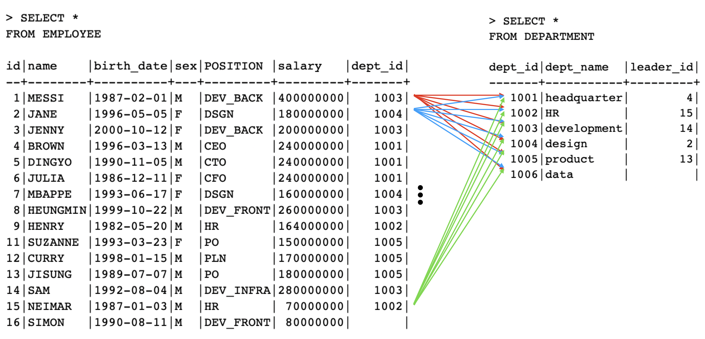
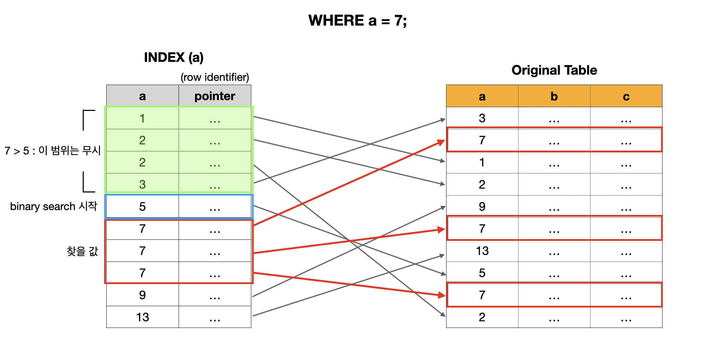

> 기보적인 SQL 문을 익히기 위한 이론 및 실습. 
>
> "[한국 데이터 산업 진흥원 - SQL 전문가 가이드](https://dataonair.or.kr/db-tech-reference/d-guide/sql/)"와 "[인프런 - 쉬운코드 데이터베이스 개론](https://www.inflearn.com/course/%EB%B0%B1%EC%97%94%EB%93%9C-%EB%8D%B0%EC%9D%B4%ED%84%B0%EB%B2%A0%EC%9D%B4%EC%8A%A4-%EA%B0%9C%EB%A1%A0/dashboard)"을 많이 참고 했습니다.

---

## Table of Contents

1. [```MySQL``` 설치](https://github.com/seungki1011/Data-Engineering/blob/main/database/sql/(002)%20Using%20SQL.md#1-mysql-%EC%84%A4%EC%B9%98%EC%99%80-%EC%84%A4%EC%A0%95)
   * [```MySQL``` 설치와 연결](https://github.com/seungki1011/Data-Engineering/blob/main/database/sql/(002)%20Using%20SQL.md#1-1-mysql-%EC%84%A4%EC%B9%98%EC%99%80-%EC%97%B0%EA%B2%B0)
     * [CLI](https://github.com/seungki1011/Data-Engineering/blob/main/database/sql/(002)%20Using%20SQL.md#1-1-1-cli)
     * [GUI](https://github.com/seungki1011/Data-Engineering/blob/main/database/sql/(002)%20Using%20SQL.md#1-1-2-gui)
1. [기초 SQL문 I](https://github.com/seungki1011/Data-Engineering/blob/main/database/sql/(002)%20Using%20SQL.md#2-%EA%B8%B0%EC%B4%88-sql%EB%AC%B8-i)
   * [데이터베이스 생성 (```CREATE```)](https://github.com/seungki1011/Data-Engineering/blob/main/database/sql/(002)%20Using%20SQL.md#2-1-%EB%8D%B0%EC%9D%B4%ED%84%B0%EB%B2%A0%EC%9D%B4%EC%8A%A4-%EC%83%9D%EC%84%B1)
   * [속성의 자료형 (Attribute Data Types)](https://github.com/seungki1011/Data-Engineering/blob/main/database/sql/(002)%20Using%20SQL.md#2-2-attribute-data-types)
   * [테이블 생성, Constraint 적용](https://github.com/seungki1011/Data-Engineering/blob/main/database/sql/(002)%20Using%20SQL.md#2-3-%ED%85%8C%EC%9D%B4%EB%B8%94-%EC%83%9D%EC%84%B1-constraint-%EC%A0%81%EC%9A%A9)
     * 각 테이블 생성 및 설명
     * 테이블 스키마 변경 (```ALTER```)
   * [테이블에 데이터 추가 / 수정 / 삭제 (```INSERT```/```UPDATE```/```DELETE```)](https://github.com/seungki1011/Data-Engineering/blob/main/database/sql/(002)%20Using%20SQL.md#2-4-%ED%85%8C%EC%9D%B4%EB%B8%94%EC%97%90-%EB%8D%B0%EC%9D%B4%ED%84%B0-%EC%B6%94%EA%B0%80--%EC%88%98%EC%A0%95--%EC%82%AD%EC%A0%9C)
   * [데이터 조회 (```SELECT```)](https://github.com/seungki1011/Data-Engineering/blob/main/database/sql/(002)%20Using%20SQL.md#2-5-%EB%8D%B0%EC%9D%B4%ED%84%B0-%EC%A1%B0%ED%9A%8C-select)
1. [기초 SQL문 II](https://github.com/seungki1011/Data-Engineering/blob/main/database/sql/(002)%20Using%20SQL.md#3-%EA%B8%B0%EC%B4%88-sql%EB%AC%B8-ii)
   * [Subquery (Nested Query)](https://github.com/seungki1011/Data-Engineering/blob/main/database/sql/(002)%20Using%20SQL.md#3-1-subquery-nested-query)
     * subquery
     * [```IN```, ```EXISTS```](https://github.com/seungki1011/Data-Engineering/blob/main/database/sql/(002)%20Using%20SQL.md#3-1-2-in-exists)
     * [```ANY```](https://github.com/seungki1011/Data-Engineering/blob/main/database/sql/(002)%20Using%20SQL.md#3-1-3-any)
     * [```ALL```](https://github.com/seungki1011/Data-Engineering/blob/main/database/sql/(002)%20Using%20SQL.md#3-1-4-all)
   * [```NULL```과의 비교 연산, Three-valued logic](https://github.com/seungki1011/Data-Engineering/blob/main/database/sql/(002)%20Using%20SQL.md#3-2-null%EA%B3%BC%EC%9D%98-%EB%B9%84%EA%B5%90-%EC%97%B0%EC%82%B0-three-valued-logic)
   * [조인 (```JOIN```)](https://github.com/seungki1011/Data-Engineering/blob/main/database/sql/(002)%20Using%20SQL.md#3-3-%EC%A1%B0%EC%9D%B8-join)
     * [Implicit vs Explicit ```JOIN```](https://github.com/seungki1011/Data-Engineering/blob/main/database/sql/(002)%20Using%20SQL.md#3-3-1-implicit-join-vs-explicit-join)
     * [```INNER JOIN```](https://github.com/seungki1011/Data-Engineering/blob/main/database/sql/(002)%20Using%20SQL.md#3-3-2-inner-join)
     * [```OUTER JOIN```](https://github.com/seungki1011/Data-Engineering/blob/main/database/sql/(002)%20Using%20SQL.md#3-3-3-outer-join)
     * [```USING```](https://github.com/seungki1011/Data-Engineering/blob/main/database/sql/(002)%20Using%20SQL.md#3-3-4-using)
     * [```NATURAL JOIN```](https://github.com/seungki1011/Data-Engineering/blob/main/database/sql/(002)%20Using%20SQL.md#3-3-5-natural-join)
     * [```CROSS JOIN```](https://github.com/seungki1011/Data-Engineering/blob/main/database/sql/(002)%20Using%20SQL.md#3-3-6-cross-join)
   * [```ORDER BY```](https://github.com/seungki1011/Data-Engineering/blob/main/database/sql/(002)%20Using%20SQL.md#3-4-order-by)
   * [집계 함수 (Aggregate Function)](https://github.com/seungki1011/Data-Engineering/blob/main/database/sql/(002)%20Using%20SQL.md#3-5-aggregate-function)
   * [```GROUP BY```](https://github.com/seungki1011/Data-Engineering/blob/main/database/sql/(002)%20Using%20SQL.md#3-6-group-by)
   * [```HAVING```](https://github.com/seungki1011/Data-Engineering/blob/main/database/sql/(002)%20Using%20SQL.md#3-7-having)
   * [Examples](https://github.com/seungki1011/Data-Engineering/blob/main/database/sql/(002)%20Using%20SQL.md#3-8-%EC%A1%B0%ED%9A%8C-%EC%A7%91%EA%B3%84-%EC%98%88%EC%8B%9C)
1. [Stored Function](https://github.com/seungki1011/Data-Engineering/blob/main/database/sql/(002)%20Using%20SQL.md#4-stored-function)
   * Examples
   * 저장된 Stored Function 파악하기기 
1. [Stored Procedure](https://github.com/seungki1011/Data-Engineering/blob/main/database/sql/(002)%20Using%20SQL.md#5-stored-procedure)
   * Examples
   * Stored Function vs Stored Procedure
1. [SQL Trigger](https://github.com/seungki1011/Data-Engineering/blob/main/database/sql/(002)%20Using%20SQL.md#6-sql-trigger)
   * Example
   * 주의 사항
1. [인덱스(Index)](https://github.com/seungki1011/Data-Engineering/blob/main/database/sql/(002)%20Using%20SQL.md#7-%EC%9D%B8%EB%8D%B1%EC%8A%A4index)
   * [```INDEX``` 사용법](https://github.com/seungki1011/Data-Engineering/blob/main/database/sql/(002)%20Using%20SQL.md#7-1-index-%EC%82%AC%EC%9A%A9%EB%B2%95)
   * [인덱스 동작 방식](https://github.com/seungki1011/Data-Engineering/blob/main/database/sql/(002)%20Using%20SQL.md#7-2-%EC%9D%B8%EB%8D%B1%EC%8A%A4-%EB%8F%99%EC%9E%91-%EB%B0%A9%EC%8B%9D)
   * [인덱스를 확인하는 방법](https://github.com/seungki1011/Data-Engineering/blob/main/database/sql/(002)%20Using%20SQL.md#7-3-index%EB%A5%BC-%ED%99%95%EC%9D%B8%ED%95%98%EB%8A%94-%EB%B0%A9%EB%B2%95)
   * [주의 사항](https://github.com/seungki1011/Data-Engineering/blob/main/database/sql/(002)%20Using%20SQL.md#7-4-%EC%A3%BC%EC%9D%98-%EC%82%AC%ED%95%AD)
   * [Covering Index](https://github.com/seungki1011/Data-Engineering/blob/main/database/sql/(002)%20Using%20SQL.md#7-5-covering-index)
   * [Hash Index](https://github.com/seungki1011/Data-Engineering/blob/main/database/sql/(002)%20Using%20SQL.md#7-6-hash-index)
1. [B-tree](https://github.com/seungki1011/Data-Engineering/blob/main/database/sql/(002)%20Using%20SQL.md#8-b-tree)

---

> MySQL에서 스키마(Schema)와 데이터베이스(Database)는 상호교환적(interchangeably)으로 사용 가능하지만 Oracle Database에서의 스키마는 데이터베이스의 논리적인 구조를 나타내는 용어이다.

<br>

## 1) MySQL 설치

> 해당 ```MySQL ```설치와 연결은 MacOS 로컬 환경 위에서 진행되었습니다.

### 1-1. MySQL 설치와 연결

* [MacOS 설치](https://dev.mysql.com/doc/mysql-installation-excerpt/8.0/en/macos-installation.html)
* [MySQL 서버에 연결](https://dev.mysql.com/doc/refman/8.0/en/connecting.html)

```MySQL```을 설치하고 연결하는 과정은 위의 document에 잘 나와있다.

<br>

---

#### 1-1-1. CLI

> CLI를 이용한 ```MySQL```. [여기서](https://dev.mysql.com/doc/refman/8.0/en/mysql-commands.html) 다양한 ```MySQL``` 명령어를 확인할 수 있다.

일단 설치를 완료했으면 ```MySQL ```서버를 시작해보자. (EC2 하나 파서하거나 도커 컨테이너로 실행해도 된다. 컨테이너를 사용한다면, 컨테이너 재시작이 종료하는 경우에도 데이터를 보존할 수 있도록 하자.)

```
brew services start mysql 
```

```MySQL``` 중지.

```
brew services stop mysql
```

<br>

```MySQL``` 서버에 연결하는 방법.

```
mysql --host=localhost --user=user_name --password=password mydb --port=3306
mysql -h localhost -u user_name -ppassword mydb
```

* ```--host``` : ```MySQL``` 서버의 ```hostname``` 또는 IP 주소
* ```--user``` : ```MySQL``` 유저네임 명시
* ```--password``` : 유저 패스워드
* ```mydb``` : 사용할 데이터베이스 이름 (없다면 비워놔도 된다)
* ```--port``` : 사용할 포트넘버 (명시하지 않으면 디폴트로 3306 사용)

> If you use a [`--password`](https://dev.mysql.com/doc/refman/8.0/en/connection-options.html#option_general_password) or `-p` option and specify a password value, there must be *no space* between [`--password=`](https://dev.mysql.com/doc/refman/8.0/en/connection-options.html#option_general_password) or `-p` and the password following it.

<br>

위의 사용법을 이용해서 ```MySQL``` 서버에 연결해보자.

```
mysql --host=localhost --user=root --password
```

* ```localhost``` 사용
* ```root``` 유저로 접속

<br>

<p align="center">    </p>

<p align='center'>MySQL CLI</p>

<br>

---

#### 1-1-2. GUI

> MySQL Workbench와 같은 GUI 툴의 사용. (DBeaver 같은 툴을 사용해도 무방하다.)
>
> GUI 툴들은 데이터베이스 시각화를 포함한 각종 다양한 기능을 제공한다.

* [MySQL Workbench 설치](https://dev.mysql.com/downloads/workbench/)

<br>

MySQL Workbench 설치 후 실행을 하면 다음과 같은 화면을 확인 할 수 있다.

<p align="center">    </p>

<p align='center'>MySQL Workbench</p>

* 기존에 CLI로 만들었던 연결을 확인할 수 있다

<br>

Delete Connection으로 만들어뒀던 열결을 삭제하고 새로 만들어보자. MySQL Connection 옆의 ```+``` 버튼을 누르면 새로운 연결을 만들 수 있다.

<br>

<p align="center">    </p>

* 기존의 CLI로 연결했을 때 설정했던 세부내용과 동일하다
* ```Connection Name```으로 해당 연결을 특정 지을 수 있는 이름을 부여할 수 있다

<br>

<p align="center">    </p>

* ```Schema Name``` : 스키마(데이터베이스)의 이름
* 나머지 세부 사항은 요구 스펙에 맞춰서 설정하면 됨
  * ```Character Set``` : 텍스트 데이터를 어떻게 인코딩할 것인지 결정
  * ```Collation``` : 설정한 ```Character Set```에 의해 저장된 데이터들이 어떻게 정렬될 것인지 결정
* ```Character Set``` 이나 ```Collation```은 스키마 레벨 그리고 테이블 레벨에서도 설정할 수 있음

<br>

---

## 2) 기초 SQL문 I

> SQL문을 이용한 기본적인 데이터 처리에 대한 실습.
>
> 초반에서도 언급했던 것 처럼 MySQL에서 Schema와 Database는 상호 교환적으로 사용가능하다. 

<br>

### 2-1. 데이터베이스 생성

데이터베이스(스키마)를 생성해보자. 

```sql
CREATE SCHEMA test_company; -- test_company 라는 이름의 스키마 생성
-- CREATE DATABASE test_company;
```

생성한 데이터베이스를 사용하기 위해서 일단 현재 사용하고 있는 데이터베이스를 확인해보자.

```sql
mysql> SELECT database();
```

```
+----------+
| schema() |
+----------+
| NULL     |
+----------+
1 row in set (0.00 sec)
```

사용할 데이터베이스를 정하지 않았기 때문에 ```NULL```을 확인할 수 있다.

이제 생성했던 ```test_company```를 사용하고, 사용중인 데이터베이스를 확인하자.

```sql
mysql> USE test_company;
```

```
Database changed
```

```sql
mysql> SELECT database();
```

```
+--------------+
| schema()     |
+--------------+
| test_company |
+--------------+
1 row in set (0.00 sec)
```

<br>

데이터베이스를 삭제하고 싶은 경우.

```sql
DROP DATABASE test_company;
```

<br>

---

### 2-2. Attribute Data Types

MySQL에서 속성(Attribute)들이 가질 수 있는 자료형(Data Type)에 대해 알아보자.

* [MySQL Document - Data Types](https://dev.mysql.com/doc/refman/8.0/en/data-types.html)

<br>

<p align="center">    </p>

<p align='center'>https://www.mysqltutorial.org/mysql-basics/mysql-data-types</p>

<br>

MySQL에서는 대략적으로 다음과 같이 데이터를 분류할 수 있다. 

1. 숫자형 (Numeric Data Types)
   * 정수
     * 위의 표에서 ```TINYINT```~ ```BIGINT```
   * 부동 소수점 방식 (Floating Point)
     * 실수 저장에 사용
     * 고정 소수점에 비해 덜 정확하다
     * ```FLOAT```, ```DOUBLE``` 또는 ```DOUBLE PRECISION```
   * 고정 소수점 방식 (Fixed Point)
     * 실수를 정확하게 저장할 때 사용
     * ```DECIMAL``` 또는 ```NUMERIC```
     * 예) ```DECIMAL(8,2)``` => ```[-999999.99 ~ 999999.99]```
     * 총 8개의 digit, 2개는 소수점(decimal)을 위해 예약
2. 문자형 (String Data Types)
   * 고정 크기 문자열
     * ```CHAR(n)``` 
     * 저장될 문자열의 길이가 최대 길이보다 작으면 나머지를 space로 채워서 저장
   * 가변 크키 문자열
     * ```VARCHAR(n)```
     * 저장될 문자열의 길이 만큼만 저장
   * 사이즈가 큰 문자열
     * ```TINYTEXT``` ~ ```LONGTEXT```
   * ```BLOB```의 경우 아무런 인코딩 없이 raw binary data(byte-string)를 저장하고 싶으면 사용
3. 날짜와 시간 (Date & Time Data Types)
   * ```DATE``` ~ ```TIME```
   * ```TIMESTAMP```의 경우 time-zone이 반영됨

<br>

> Data Type의 경우 DBMS간에 사용하는 명칭이 다를 수 있다. 가령 MySQL의 경우 ```DECIMAL```과 ```NUMERIC```을 동일하게 사용한다.

<br>

---

### 2-3. 테이블 생성, Constraint 적용

이제 테이블에 대한 스키마를 대략적으로 정하고 테이블을 생성해보자.

<p align="center">    </p>

<p align='center'>사용할 테이블</p>

<br>

먼저 ```DEPARTMENT``` 테이블을 생성하고 해당 제약(constraint)들을 살펴보자.

```mysql
CREATE TABLE DEPARTMENT (
	id INT, 
	name VARCHAR(20) NOT NULL UNIQUE, -- NOT NULL과 UNIQUE 제약 적용
  leader_id INT, 
  PRIMARY KEY (id) -- id를 PK로 지정
);
```

* ```UNIQUE``` : ```UNIQUE```로 지정된 속성(attribute)은 중복된 값을 가질 수 없음 (```NULL``` 중복을 허용하는 경우는 있음, RDBMS 마다 다름)
* ```NOT NULL``` : ```NOT NULL```로 지정된 attribute는 ```NULL```을 값으로 가질 수 없다

<br>

다음으로 ```EMPLOYEE``` 테이블을 생성하자.

```mysql
CREATE TABLE EMPLOYEE (
	id INT,
	name VARCHAR(30) NOT NULL,
	birth_date DATE,
	sex CHAR(1) CHECK(sex IN ('M', 'F')), -- 성별은 무조건 M 또는 F
	POSITION VARCHAR(10),
	salary INT DEFAULT 50000000, 
	dept_id INT,
	PRIMARY KEY (id),
  -- dept_id는 DEPARTMENT의 id를 참조
  -- DEPARTMENT의 id(참조값)을 삭제하는 경우 참조하던 FK 값을 NULL로 변경
  -- 참조값을 변경하는 경우 똑같이 업데이트한 값으로 변경
	FOREIGN KEY (dept_id) REFERENCES DEPARTMENT(id) ON DELETE SET NULL ON UPDATE CASCADE,
	CHECK (salary >= 50000000) -- 최소 연봉을 5000만으로 
);
```

* ```DEFAULT``` : attribute의 디폴트(기본) 값을 정의할 때 사용
  * 새로운 튜플(tuple, row)를 저장할 때 해당 attribute에 대한 값이 없으면 디폴트 값으로 저장
* ```CHECK``` 제약은 attribute의 값을 제한하고 싶을 때 사용
* ```FOREIGN KEY``` (Referential Integrity Constraint) : attribute가 다른 테이블의 PK 또는 유니크키(unique key)를 참조할 때 사용 
  * 참조하고 있던 값이 삭제(delete)또는 업데이트(update) 될때 FK를 어떻게 처리할 것인지 지정할 수 있는 옵션들이 있다
  * ```CASCADE``` : 참조값의 삭제/변경을 그대로 반영
  * ```SET NULL``` : 참조값이 삭제/변경 시 ```NULL```로 변경
  * ```RESTRICT``` : 참조값이 삭제/변경되는 것을 금지
  * ```NO ACTION```: MySQL에서는 ```RESTRICT```와 동일
    * 표준 SQL 스펙에서는 비슷
  * ```SET DEFAULT``` : 참조값이 삭제/변경 시 설정한 디폴트 값으로 변경
    * MySQL에서는 지원하지 않음

<br>

Constraint에는 이름을 명시할 수 있음. 제약에 이름을 붙이면 어떤 제약을 위반했는지 쉽게 파악이 가능함. 예를 들어 다음과 같이 제약에 이름을 붙여보자.

```mysql
CREATE TABLE TEST (
	age INT CONSTRAINT age_over_19 CHECK (age > 19)
);
```

* ```age```가 19를 넘었는지 확인하는 ```CHECK```제약에 ```age_over_19```이라는 이름을 붙임
* 제약을 위반하는 경우 ```CHECK constraint 'age_over_19' is violated```
* 제약 이름을 생략해서 사용하는 경우  ```CHECK constraint 'test_chk_1' is violated``` 처럼 이름이 직관적이지 않아서 위반한 제약을 파악하기가 상대적으로 어렵다

<br>

> 참고로 ```SHOW CREATE TABLE table_name;```을 통해서 ```table_name```이라는 테이블의 여러가지 정보를 확인할 수 있다.

<br>

이제 ```PROJECT``` 테이블을 생성해보자.

```mysql
CREATE TABLE PROJECT (
	id INT,
	name VARCHAR(20) NOT NULL UNIQUE,
	leader_id INT,
	start_date DATE,
	end_date DATE,
	PRIMARY KEY (id),
  -- leader_id는 EMPLOYEE의 id 참조
	FOREIGN KEY (leader_id) REFERENCES EMPLOYEE(id) ON DELETE SET NULL ON UPDATE CASCADE,
	CHECK (start_date < end_date) -- 시작 날짜는 끝 날짜보다 항상 먼저
);
```

<br>

```WORKS_ON``` 테이블을 생성해보자.

```mysql
CREATE TABLE WORKS_ON (
	empl_id INT,
	proj_id INT,
	PRIMARY KEY (empl_id, proj_id),
	FOREIGN KEY (empl_id) REFERENCES EMPLOYEE(id) ON DELETE CASCADE ON UPDATE CASCADE,
	FOREIGN KEY (proj_id) REFERENCES PROJECT(id) ON DELETE CASCADE ON UPDATE CASCADE
);
```

```
+------------------------+
| Tables_in_test_company |
+------------------------+
| DEPARTMENT             |
| EMPLOYEE               |
| PROJECT                |
| WORKS_ON               |
+------------------------+
4 rows in set (0.00 sec)
```

<br>

테이블 생성당시 ```DEPARTMENT```→```EMPLOYEE``` →```PROJECT``` →```WORKS_ON``` 순서로 생성하였다. 이떄 ```DEPARTMENT```의 ```leader_id```에 FK를 설정하지 못했기 때문에 FK를 사용하도록 ```DEPARTMENT``` 테이블의 스키마를 변경해야한다.

```mysql
ALTER TABLE DEPARTMENT ADD FOREIGN KEY (leader_id) -- leader_id에 대해서 FK 추가
REFERENCES EMPLOYEE(id) -- EMPLOYEE의 id 참조
ON UPDATE CASCADE -- 참조값이 업데이트 되면 똑같이 업데이트
ON DELETE SET NULL; -- 참조값이 삭제되면 NULL로 변경
```

* ```ALTER TABLE```에는 ```ADD FOREIGN KEY``` 외에도 다양한 유형의 스키마 변경이 가능하다.
* [MySQL Document 확인](https://dev.mysql.com/doc/refman/8.0/en/alter-table.html#alter-table-options)

> 프로덕션(Production)이나 다른 서비스 또는 파이프라인에서 사용중인 테이블의 스키마(Schema)를 변경하는 것이 어떤 영향을 미치는지 충분히 검토한 후에 진행되어야 함.
>
> 추가로  테이블 삭제는 ```DROP TABLE table_name;```

<br>

---

### 2-4. 테이블에 데이터 추가 / 수정 / 삭제

> 생성했던 테이블에 데이터를 추가 / 수정 / 삭제하는 과정을 다룬다.

<br>

#### 2-4-1. 추가(```INSERT```)

```EMPLOYEE``` 테이블에 데이터를 추가해보자. 

```mysql
/* 
 * 현재 DEPARTMENT 테이블에 아무 데이터도 없기 때문에 일단 FK에 해당하는 dept_id는 null값으로 설
 */
INSERT INTO EMPLOYEE 
	VALUES (1, 'MESSI', '1987-02-01', 'M', 'DEV_BACK', 100000000, null);

/*
 * 유니크한 값이 중복되지 않도록 주의
 * CHECK 제약에 의해 연봉은 5000만원 이상으로 입력해야
 * SHOW CREATE TABLE EMPLOYEE; 를 통해서 EMPLOYEE 테이블의 정보 확인 가능 
 */
INSERT INTO EMPLOYEE 
	VALUES (2, 'JANE', '1996-05-05', 'F', 'DSGN', 90000000, null);
```

<br>

이번에는 다른 방식으로 데이터를 추가해보자.

```mysql
-- 입력하고 싶은 attribute와 그 순서를 정할 수 있다
INSERT INTO EMPLOYEE (name, birth_date, sex, POSITION, id) -- dept_id와 salary 없이 입력
	VALUES ('JENNY', '2000-10-12', 'F', 'DEV_BACK', 3); -- 위에서 정한 attribute 순서와 동일하게 입력
```

<br>

한번에 여러개의 데이터를 추가하고 싶으면 다음과 같이 입력할 수 있다.

```mysql
INSERT INTO EMPLOYEE VALUES
	(4, 'BROWN', '1996-03-13', 'M', 'CEO', 120000000, null),
	(5, 'DINGYO', '1990-11-05', 'M', 'CTO', 120000000, null),
	(6, 'JULIA', '1986-12-11', 'F', 'CFO', 120000000, null),
	(7, 'MBAPPE', '1993-06-17', 'F', 'DSGN', 80000000, null),
	(8, 'HEUNGMIN', '1999-10-22', 'M', 'DEV_FRONT', 65000000, null),
	(9, 'HENRY', '1982-05-20', 'M', 'HR', 82000000, null),
	(10, 'NICOLE', '1991-03-26', 'F', 'DEV_FRONT', 90000000, null),
	(11, 'SUZANNE', '1993-03-23', 'F', 'PO', 75000000, null),
	(12, 'CURRY', '1998-01-15', 'M', 'PLN', 85000000, null),
	(13, 'JISUNG', '1989-07-07', 'M', 'PO', 90000000, null),
	(14, 'SAM', '1992-08-04', 'M', 'DEV_INFRA', 70000000, null);
	(15, 'NEIMAR', '1987-01-03', 'M', 'HR', 70000000, null);
```

<br>

지금까지 입력했던 데이터를 조회해보자.

```mysql
SELECT * FROM EMPLOYEE;
```

```
+----+----------+------------+------+-----------+-----------+---------+
| id | name     | birth_date | sex  | POSITION  | salary    | dept_id |
+----+----------+------------+------+-----------+-----------+---------+
|  1 | MESSI    | 1987-02-01 | M    | DEV_BACK  | 100000000 |    NULL |
|  2 | JANE     | 1996-05-05 | F    | DSGN      |  90000000 |    NULL |
|  3 | JENNY    | 2000-10-12 | F    | DEV_BACK  |  50000000 |    NULL |
|  4 | BROWN    | 1996-03-13 | M    | CEO       | 120000000 |    NULL |
... 공간 때문에 생략
| 13 | JISUNG   | 1989-07-07 | M    | PO        |  90000000 |    NULL |
| 14 | SAM      | 1992-08-04 | M    | DEV_INFRA |  70000000 |    NULL |
+----+----------+------------+------+-----------+-----------+---------+
14 rows in set (0.03 sec)
```

<br>

이제 나머지 테이블들의 데이터도 추가해보자.

```mysql
-- DEPARTMENT 테이블
INSERT INTO DEPARTMENT VALUES
	(1001, 'headquarter', 4),
	(1002, 'HR', 15),
	(1003, 'development', 14),
	(1004, 'design', 2),
	(1005, 'product', 13);
	
-- PROJECT 테이블
INSERT INTO PROJECT VALUES
	(2001, '쿠폰 서비스 개발', 13, '2022-03-10', '2022-07-09'),
	(2002, '백엔드 리펙토링', 13, '2022-01-23', '2022-03-23'),
	(2003, '홈페이지 UI 개선', 11, '2022-05-09', '2022-06-11');
	
-- WORKS_ON 테이블
INSERT INTO WORKS_ON VALUES
	(5,2001),(13, 2001),(1, 2001),
	(2, 2001),(4, 2001),(10, 2001),
  (1, 2002),(2, 2002),(6, 2002),
	(11, 2002),(3, 2003),(7, 2003),
	(8, 2003),(9, 2003),(10, 2003),
	(12, 2003);
```

<br>

---

#### 2-4-2. 수정(```UPDATE```)

테이블의 데이터를 수정해보자. 먼저 ```EMPLOYEE``` 테이블의 ```dept_id```의 ```null```값을 업데이트 해보자.

```EMPLOYEE(id)```가 1인 ```MESSI```는 development 부서 소속 → ```DEPARTMENT(id)```는 1003 

```mysql
/*
 * SET를 통해서 어떤 attribute를 어떤 값으로 설정할 것인지 지정
 * WHERE를 통해서 무엇을 업데이트 할 것인지 조건(condition) 명시
 * MESSI를 업데이트 하기 위해서 id = 1로  
 */
UPDATE EMPLOYEE SET dept_id = 1003 WHERE id = 1;
```

성공적으로 변경되었는지 확인해보자.

```mysql
SELECT * FROM EMPLOYEE WHERE id = 1;
```

```
+----+-------+------------+------+----------+-----------+---------+
| id | name  | birth_date | sex  | POSITION | salary    | dept_id |
+----+-------+------------+------+----------+-----------+---------+
|  1 | MESSI | 1987-02-01 | M    | DEV_BACK | 100000000 |    1003 |
+----+-------+------------+------+----------+-----------+---------+
1 row in set (0.02 sec)
```

<br>

이번에는 개발(development)팀의 ```salary```를 두 배로 인상하는 경우를 살펴보겠다.

```mysql
UPDATE EMPLOYEE
SET salary = salary * 2
WHERE dept_id = 1003;
```

```salary``` 인상 전

```
+----+----------+------------+------+-----------+-----------+---------+
| id | name     | birth_date | sex  | POSITION  | salary    | dept_id |
+----+----------+------------+------+-----------+-----------+---------+
|  1 | MESSI    | 1987-02-01 | M    | DEV_BACK  | 100000000 |    1003 |
|  3 | JENNY    | 2000-10-12 | F    | DEV_BACK  |  50000000 |    1003 |
|  8 | HEUNGMIN | 1999-10-22 | M    | DEV_FRONT |  65000000 |    1003 |
| 10 | NICOLE   | 1991-03-26 | F    | DEV_FRONT |  90000000 |    1003 |
| 14 | SAM      | 1992-08-04 | M    | DEV_INFRA |  70000000 |    1003 |
+----+----------+------------+------+-----------+-----------+---------+
```

```salary``` 인상 후

```
+----+----------+------------+------+-----------+-----------+---------+
| id | name     | birth_date | sex  | POSITION  | salary    | dept_id |
+----+----------+------------+------+-----------+-----------+---------+
|  1 | MESSI    | 1987-02-01 | M    | DEV_BACK  | 200000000 |    1003 |
|  3 | JENNY    | 2000-10-12 | F    | DEV_BACK  | 100000000 |    1003 |
|  8 | HEUNGMIN | 1999-10-22 | M    | DEV_FRONT | 130000000 |    1003 |
| 10 | NICOLE   | 1991-03-26 | F    | DEV_FRONT | 180000000 |    1003 |
| 14 | SAM      | 1992-08-04 | M    | DEV_INFRA | 140000000 |    1003 |
+----+----------+------------+------+-----------+-----------+---------+
```

<br>

이번에는 프로젝트 ID 2002에 참여한 임직원 의 연봉(```salary```)을 두 배로 인상하는 경우를 보자.

```mysql
UPDATE EMPLOYEE, WORKS_ON -- 연관된 두 테이블 
SET salary = salary * 2
WHERE empl_id AND proj_id = 2002; -- empl_id가 두 테이블의 연결고리 역할
-- 더 직관적으로 표현하고 싶으면 아래와 같이 사용 가능
WHERE EMPLOYEE.id = WORKS_ON.empl_id and proj_id = 2002;
```

<br>

---

#### 2-4-3. 삭제(```DELETE```)

테이블의 데이터를 삭제해보자. ```NICOLE```이라는 이름의 사원이 퇴사하는 상황이다. 이 경우 ```EMPLOYEE``` 테이블에서 ```NICOLE```을 삭제해야한다. 또한 ```NICOLE```은 프로젝트 2001과 2003에 참여하고 있다.

```mysql
DELETE FROM EMPLOYEE WHERE id = 10; -- NICOLE의 id는 10
```

* ```NICOLE```을 삭제하는 과정에서 ```WORKS_ON``` 테이블의 데이터도 삭제해줄 필요가 없다. FK를 설정하면서 CASCADE 옵션을 줬기 때문에, ```EMPLOYEE``` 테이블에서 ```NICOLE```이 삭제되는 과정에서 ```WORKS_ON``` 테이블에서 ```NICOLE```에 대한 정보도 삭제되었기 때문이다.

<br>

이번에는 프로젝트 2001과 2002에 참여하고 있는 ```JANE```이 2002 프로젝트에서 빠지도록 삭제하는 작업을 해볼것이다. 

```mysql
/*
 * proj_id <> 2001는 2001 프로젝트를 제외한 모든 프로젝트 삭제
 * <> 대신 != 사용 가능
 */
DELETE FROM WORKS_ON WHERE empl_id = 2 AND proj_id <> 2001;
```

* ```WHERE```절 없이 삭제하는 경우 모든 데이터 삭제 (조심하자!)
* ```<>```는 ```!=``` 으로 대체 가능하다 (```<>```는 not equal to 로 생각하면 편하다)

<br>

---

### 2-5. 데이터 조회 (```SELECT```)

이번에는 테이블에 존재하는 데이터를 조회하는 방법에 대해서 알아보자. ```EMPLOYEE(id)```가 7인 임직원의 ```name```과 ```position```을 조회해보자.

```mysql
SELECT name, position FROM EMPLOYEE WHERE id = 7;
```

```
+--------+----------+
| name   | position |
+--------+----------+
| MBAPPE | DSGN     |
+--------+----------+
```

* 조회에는 ```SELECT```라는 키워드 사용
* ```WHERE```로 명시한 조건을 selection condition라고 함 (```id = 7```)
* 관심있어하는 attribute들을 project attribute라고 함 (```name, position```)

<br>

이번에는 프로젝트 2002의 리더를 맡고 있는 임직원의 ```id```, ```name```, ```position```을 조회해보자.

```mysql
SELECT e.id, e.name, e.position -- PROJECT 테이블의 id와 name과 구별하기 위해서 EMPLOYEE를 통해서 접근 
FROM PROJECT p, EMPLOYEE e -- alias 설정
WHERE p.id = 2002 AND p.leader_id = e.id;
```

```
+----+--------+----------+
| id | name   | position |
+----+--------+----------+
| 13 | JISUNG | PO       |
+----+--------+----------+
```

* attribute의 이름이 테이블 마다 동일하면 충돌나지 않게 구분해야한다 (ambiguous하면 안됨)
* ```FROM PROJECT p, EMPLOYEE e``` 처럼 테이블에 alias를 설정해서 사용가능하다
  * ```FROM PROJECT AS p, EMPLOYEE AS e``` 처럼 ```AS``` 키워드를 붙여도 되고, 생략해도 된다
* ```AS```로 별칭(alias)을 붙이는 것은 테이블, 속성(attribute) 전부 가능하다

위의 과정을 설명해보자면, 우리가 현재 관심가지고 있는 것은 일단 프로젝트 2002의 ```leader_id``` 이다. 이때 ```PROJECT``` 테이블에는 임직원의 세부 데이터가 존재하지 않기 때문에, ```leader_id```를 FK로 해서 ```EMPLOYEE``` 테이블의 ```id```를 참조 해야한다. 이를 통해서 프로젝트 2002의 ```leader_id```인 13을 통해서 ```EMPLOYEE``` 13번인 ```JISUNG```의 ```name```과 ```position```을 조회할 수 있다.

<br>

이번에는 디자이너(```DSGN```)들이 참여하고 있는 프로젝트 id와 ```name```을 조회해보자.

```mysql
SELECT p.id, p.name
FROM PROJECT p, EMPLOYEE e, WORKS_ON w
WHERE e.position = 'DSGN' AND e.id = w.empl_id  AND w.proj_id = p.id;
```

```
+------+-------------------------+
| id   | name                    |
+------+-------------------------+
| 2001 | 쿠폰 서비스 개발           |
| 2003 | 홈페이지 UI 개선           |
| 2003 | 홈페이지 UI 개선           |
+------+-------------------------+
```

* 조회하려는 것 : ```DSGN```이 참여하는 프로젝트의 ```proj_id```와 ```name```
* ```EMPLOYEE``` 테이블 → ```WORKS_ON``` 테이블 → ```PROJECT``` 테이블 
* 여기서 ```WORKS_ON``` 테이블이 중간의 연결고리 역할을 한다

<br>

위에서 프로젝트 ```name```들을 조회하면 중복되는 경우 중복되어서 표시된다는 것을 알 수 있다. 중복되어 조회되는 것을 방지하기 위해서 ```DISTINCT``` 키워드를 사용해볼 수 있다. 

```mysql
SELECT DISTINCT p.id, p.name -- 기존의 조회에 DISTINCT 키워드를 붙이면 된다
FROM PROJECT p, EMPLOYEE e, WORKS_ON w
WHERE e.position = 'DSGN' AND e.id = w.empl_id  AND w.proj_id = p.id;
```

```
+------+-------------------------+
| id   | name                    |
+------+-------------------------+
| 2001 | 쿠폰 서비스 개발           |
| 2003 | 홈페이지 UI 개선           |
+------+-------------------------+
```

중복되어서 조회되는 튜플이 제외된 것을 볼 수 있다.

<br>

이번에는 이름이 'N'으로 시작하거나 'N'으로 끝나는 임직원들의 ```name```을 조회 해보자.

```mysql
SELECT name
FROM EMPLOYEE
WHERE name LIKE 'N%' OR name LIKE '%N'; -- N으로 시작하거나 N으로 끝나는 name
```

```
+----------+
| name     |
+----------+
| BROWN    |
| HEUNGMIN |
| NEIMAR   |
+----------+
```

* ```%``` : 스트링 패턴에서 와일드카드(wildcard)로 쓰임

<br>

이번에는 ```LIKE``` 키워드를 사용해서 이름에 'NG'가 들어가는 임직원들의 ```name```을 조회 해보자.

```mysql
SELECT name
FROM EMPLOYEE
WHERE name LIKE '%NG%';
```

```
+----------+
| name     |
+----------+
| DINGYO   |
| HEUNGMIN |
| JISUNG   |
+----------+
```

<br>

이번에는 'J'로 시작하면서, 총 4 글자의 이름을 가지는 임직원들의 ```name```을 조회 해보자.

```mysql
SELECT name
FROM EMPLOYEE
WHERE name LIKE 'J___'; -- J로 시작하고 뒤에 3글자가 오는 name
```

```
+------+
| name |
+------+
| JANE |
+------+
```

* ```_```(underscore) : 언더스코어는 한 글자 의미 

<br>

다음은 ```%```나 ```_``` 를 특별한 의미로 사용하는 것이 아니라 문자 그대로 조회하고 싶은 경우이다. ```%```로 시작하거나 ```_```로 끝나는 프로젝트를 검색하는 방법은 다음과 같다. 

```mysql
SELECT name FROM PROJECT WHERE name LIKE '\%%' or name LIKE '%\_'
```

* 문자 그대로 사용하고 싶은 특수문자 앞에 ```\```(backslash)를 붙여서 사용하면 됨.

>  지금까지 살펴본 것 처럼 ```LIKE``` 키워드는 스트링(String)의 패턴 매칭(Pattern Matching)에 사용

<br>

이번에는 ```EMPLOYEE(id)```가 1인 임직원의 모든 attribute를 조회 해보자.

```mysql
SELECT * FROM EMPLOYEE WHERE id = 1; -- 원래 attribute의 자리에 * 사용
```

```
+----+-------+------------+------+----------+-----------+---------+
| id | name  | birth_date | sex  | POSITION | salary    | dept_id |
+----+-------+------------+------+----------+-----------+---------+
|  1 | MESSI | 1987-02-01 | M    | DEV_BACK | 400000000 |    1003 |
+----+-------+------------+------+----------+-----------+---------+
```

* 원래 알고 싶었던 attribute의 자리에 ```*```(asterisk)를 사용해서 모든 attribute를 조회 가능
* 두 개의 테이블에 대해 ```*```를 사용하게 되면 두 개의 테이블의 모든 attribute를 조회하기 때문에 조심

<br>

> 1. ```SELECT```로 조회할 때 조건을 포함해서 조회하는 경우, 이 조건들과 관련된 attribute들에 인덱스(index)가 걸려있어야 함. 그렇지 않은 경우 데이터가 많으면 많아질수록 조회 속도가 느려짐
> 2. ```WHERE```절 없이 ```SELECT```를 사용하게 되면 테이블에 있는 모든 튜플들을 반환한다. 

<br>

---

## 3) 기초 SQL문 II

> Subquery 부터 집계(Aggregation)하는 것 까지 조금 더 복잡한 데이터 처리를 하는 경우.

<br>

### 3-1. Subquery (Nested Query)

Subquery를 통해서 조금 더 복잡한 쿼리를 작성해보자.

```EMPLOYEE(id)```가 14인 임직원 보다 ```birth_date```가 빠른 임직원의 ```id```, ```name```, ```birthdate```를 조회 해보자.

```mysql
-- 1. 첫 번째 쿼리 
SELECT birth_date FROM EMPLOYEE WHERE id = 14; -- 결과는 1992-08-04가 나온다 

-- 2. 두 번째 쿼리
SELECT id, name, birth_date FROM EMPLOYEE
WHERE birth_date < '1992-08-04'; -- 첫 번째 쿼리에서 나온 결과를 직접 입력해서 사용하고 있음

-- 3. Subquery를 이용하는 경우
SELECT id, name, birth_date FROM EMPLOYEE
WHERE birth_date < (
	SELECT birth_date FROM EMPLOYEE WHERE id = 14 -- (subquery) 기존의 첫 번째 쿼리를 ()안에 기술한다
);
```

```
+----+--------+------------+
| id | name   | birth_date |
+----+--------+------------+
|  1 | MESSI  | 1987-02-01 |
|  5 | DINGYO | 1990-11-05 |
|  6 | JULIA  | 1986-12-11 |
|  9 | HENRY  | 1982-05-20 |
| 13 | JISUNG | 1989-07-07 |
| 15 | NEIMAR | 1987-01-03 |
+----+--------+------------+
```

* 여기서 subquery는 inner query 또는 nested query라고도 불리며, ```()``` 안에 기술한다
* outer query는 subquery를 포함하고 있는 query (subquery를 감싸고 있는 쿼리로 생각하면 편한다)

<br>

이번에는 ```id```가 1인 임직원과 같은 부서(```dept_id```) 같은 성별(```sex```)인 임직원들의 ```id```, ```name```, ```position```을 조회 해보자.

```mysql
SELECT id, name, position
FROM EMPLOYEE
WHERE (dept_id, sex) = (
	SELECT dept_id, sex 
	FROM EMPLOYEE
	WHERE id = 1
);
```

```
+----+----------+-----------+
| id | name     | position  |
+----+----------+-----------+
|  1 | MESSI    | DEV_BACK  |
|  8 | HEUNGMIN | DEV_FRONT |
| 14 | SAM      | DEV_INFRA |
+----+----------+-----------+
```

<br>

---

#### 3-1-1. ```IN```, ```EXISTS```

이번에는 ```id```가 2인 임직원과 같은 프로젝트에 참여한 임직원들의 ```id```를 조회 해보자. 

```mysql
-- 1. id가 2인 임직원이 참여한 프로젝트를 조회해보자
SELECT proj_id FROM WORKS_ON WHERE empl_id = 2; -- 2001, 2003이 조회된다 

-- 2. 이제 2001, 2003 프로젝트에 참여한 임직원들의 id를 조회해보자 
SELECT DISTINCT empl_id FROM WORKS_ON -- 중복을 제거하기 위해 DISTINCT 사용 
WHERE empl_id != 2 AND proj_id IN (2001, 2003);
/*
 * proj_id IN (2001, 2003)는 원래
 * (proj_id = 2001 OR proj_id = 2003)으로 구했다 
 */ 

-- 3. 위의 두 쿼리를 subquery로 구현 (합치면 됨)  
SELECT DISTINCT empl_id FROM WORKS_ON
WHERE empl_id != 2 AND proj_id IN ( -- outer query의 empl_id와 proj_id는 outer query의 WORKS_ON 참조
	SELECT proj_id FROM WORKS_ON WHERE empl_id = 2 -- subquery의 empl_id는 해당 쿼리안의 WORKS_ON 참조
);

-- 4. 3의 subquery안에 subquery를 이용
-- 구한 임직원들의 id를 통해 해당 임직원들의 id, name을 조회
SELECT id, name
FROM EMPLOYEE
WHERE id IN (
	SELECT DISTINCT empl_id FROM WORKS_ON
	WHERE empl_id != 2 AND proj_id IN (
		SELECT proj_id FROM WORKS_ON WHERE empl_id = 2
	)
);

-- 5. WHERE절 대신 FROM절에 사용하는 subquery (4와 결과는 똑같음)
SELECT id, name
FROM EMPLOYEE,
	(
		SELECT DISTINCT empl_id FROM WORKS_ON
		WHERE empl_id != 2 AND proj_id IN (
			SELECT proj_id FROM WORKS_ON WHERE empl_id = 2
		)
	) AS DISTINCT_E -- 위의 subquery의 결과를 가상의 테이블 DISTINCT_E로 설정 
	-- FROM EMPLOYEE, (subquery) AS DISTINCT_E 같은 형태로 생각하면 됨 
WHERE EMPLOYEE.id = DISTINCT_E.empl_id; 
```

```
+---------+
| empl_id |
+---------+
|       1 |
|       4 |
... 생략
|       9 |
|      12 |
+---------+
```

```
+----+----------+
| id | name     |
+----+----------+
|  1 | MESSI    |
|  4 | BROWN    |
... 생략
|  9 | HENRY    |
| 12 | CURRY    |
+----+----------+
```

* ```v IN (v1, v2, v3..)```:  ```v```가 ```(v1, v2, v3..)```와 하나라도 값이 같으면 ```TRUE``` 반환 
* ```v NOT IN (v1, v2, v3..)```:  ```v```가 ```(v1, v2, v3..)```와 모든 값이 다르면 ```TRUE``` 반환 
* unqualified attribute가 참조하는 테이블은 해당 attribute가 사용된 쿼리를 포함해서 그 쿼리에 바깥쪽으로 존재하는 모든 쿼리 중에 해당 attribute를 가지는 가장 가까운 테이블을 참조

<br>

이번에는 ```IN``` 대신 ```EXISTS``` 키워드를 사용해서 ```id```가 7 또는 12인 임직원이 참여한 프로젝트의 ```proj_id```, ```name```을 조회해보자.

```mysql
-- 1. EXISTS를 사용하는 경우
SELECT p.id, p.name
FROM PROJECT p -- 우리가 관심 가지는 것은 PROJECT 테이블
WHERE EXISTS ( -- EXISTS : 하나라도 존재하면 TRUE 반환
	SELECT * 
	FROM WORKS_ON w
	WHERE w.proj_id = p.id AND w.empl_id IN (7, 12) -- 프로젝트가 WORKS_ON 테이블에 존재하고 참여한 임직원 id가 7 또는 12인 튜플이 존재하면(EXISTS) 해당 프로젝트 선택
);

-- 2. IN을 사용하는 경우 
SELECT p.id, p.name
FROM PROJECT p 
WHERE id IN ( 
	SELECT w.proj_id
	FROM WORKS_ON w
	WHERE w.empl_id IN (7, 12)
);
```

* ```EXISTS``` : subquery의 결과가 최소 하나의 튜플이라도 가지고 있다면 ```TRUE```반환
* ```NOT EXISTS``` : subquery의 결과가 단 하나의 튜플이라도 없다면 ```TRUE```반환
* subquery가 바깥쪽 쿼리의 attribute를 참조하면 correlated subquery라고 부른다
  * 위의 예시의 경우 ```p.id```가 outer query의 ```Project```를 참조하고 있기 때문에 해당 subquery는 correlated subquery

<br>

이번에는 ```NOT EXISTS```를 활용해보자. 2000년대생이 없는 부서의 ```DEPARTMENT(id)```와 ```name```을 조회하자.

```mysql
SELECT d.id, d.name
FROM DEPARTMENT d 
WHERE NOT EXISTS ( -- 2000년생이 하나라도 없는 경우 TRUE 반환되면서 해당 부서 선택 
	SELECT *
	FROM EMPLOYEE e 
	WHERE e.dept_id = d.id AND e.birth_date >= '2000-01-01'
);
```

```
+------+-------------+
| id   | name        |
+------+-------------+
| 1004 | design      |
| 1001 | headquarter |
| 1002 | HR          |
| 1005 | product     |
+------+-------------+
```

* 해당 쿼리도 ```NOT EXISTS``` 대신 ```NOT IN```을 사용해서 구현할 수 있다

<br>

---

#### 3-1-2. ```ANY```

이번에는 ```ANY```라는 키워드를 사용해서 리더보다 높은 연봉을 받는 부서원을 가진 ```leader_id```, ```name```, ```salary``` 그리고 부서명(```DEPARTMENT(name)```)을 조회하자.

```mysql
-- 1. ANY를 사용해보자
SELECT e.id, e.name, e.salary, d.name -- 일단 EMPLOYEE 테이블에서 id, name, salary 등을 찾고 있음
FROM DEPARTMENT d, EMPLOYEE e 
WHERE d.leader_id = e.id AND e.salary < ANY ( 
	SELECT salary 
	FROM EMPLOYEE e2
	WHERE e2.id != d.leader_id AND e2.dept_id = e.dept_id -- 리더외의 부서원이 필요함, 속성이 참조하는 테이블을 잘 파악하자
);

-- 2. 리더보다 높은 연봉을 받는 부서원의 해당 부서에서 최고 연봉을 추가로 조회
SELECT e.id, e.name, e.salary, d.name, 
	(
		SELECT MAX(salary)
		FROM EMPLOYEE
		WHERE dept_id = e.dept_id
	) AS dept_max_salary -- 기존 1에서 해당 subquery만 추가, 해당 부서의 최고 연봉을 dept_max_salary로 별칭
FROM DEPARTMENT d, EMPLOYEE e 
WHERE d.leader_id = e.id AND e.salary < ANY ( 
	SELECT salary 
	FROM EMPLOYEE e2
	WHERE e2.id != d.leader_id AND e2.dept_id = e.dept_id 
);	
```

```
+----+--------+-----------+-------------+
| id | name   | salary    | name        |
+----+--------+-----------+-------------+
| 15 | NEIMAR |  70000000 | HR          |
| 14 | SAM    | 280000000 | development |
+----+--------+-----------+-------------+
```

```
+------+--------+-----------+-------------+-----------------+
| id   | name   | salary    | name        | dept_max_salary |
+------+--------+-----------+-------------+-----------------+
|   15 | NEIMAR |  70000000 | HR          |       164000000 |
|   14 | SAM    | 280000000 | development |       400000000 |
+------+--------+-----------+-------------+-----------------+
```

* ```v {비교연산자} ANY (subquery)``` : subquery가 반환한 결과들 중에 단 하나라도 ```v```와의 비교연산이 ```TRUE```라면 ```TRUE``` 반환
* ```ANY``` 대신 ```SOME``` 사용 가능

<br>

---

#### 3-1-3. ```ALL```

이번에는 ```ALL```이라는 키워드를 사용해서 ```id```가 2인 임직원과 한번도 같은 프로젝트에 참여하지 못한 임직원들의 ```id```, ```name```, ```position```을 조회하자.

```mysql
SELECT DISTINCT e.id, e.name, e.position
FROM EMPLOYEE e, WORKS_ON w
WHERE e.id = w.empl_id AND w.proj_id != ALL ( -- w.proj.id 가 그 어떤과도 같지 않다면 조건이 TRUE가 됨
	SELECT proj_id 
	FROM WORKS_ON
	WHERE empl_id = 2
);
```

```
+----+---------+----------+
| id | name    | position |
+----+---------+----------+
|  1 | MESSI   | DEV_BACK |
|  6 | JULIA   | CFO      |
| 11 | SUZANNE | PO       |
+----+---------+----------+
```

* ```v {비교 연산자} ALL (subquery)``` : subquery가 반환한 결과들과 ```v```와의 비교 연산이 모두 ```TRUE```라면 ```TRUE```반환 

<br>

---

### 3-2. ```NULL```과의 비교 연산, Three-valued logic

SQL에서 ```NULL```이 가지는 의미가 뭔지 일단 알아보자.

>1. Unknown (알려지지 않음)
>2. Unavailable or withheld (이용 불가)
>3. Not applicable (적용 불가)

<br>

```NULL```로 처리된 값은 같거나 다르다와 같은 비교 연산을 사용하면 안된다.

```mysql
SELECT id FROM EMPLOYEE WHERE birth_date = NULL; -- '='를 사용하면 안됨. IS라는 연산자를 사용해야함
SELECT id FROM EMPLOYEE WHERE birth_date IS NULL;
```

<br>

SQL에서 ```NULL```과 비교연산을 하게 되면 결과는 ```UNKWOWN```이다. ```UNKNOWN```은 ```TRUE``` 또는 ```FALSE```일 수도 있다는 의미이다. SQL에서의 *three-valued logic* 이라는 것은 비교/논리 연산이 결과로 ```TRUE```, ```FALSE```, ```UNKNOWN```을 가질수 있다는 의미이다.  

```AND```, ```OR```의 논리 연산에서는 ```UNKOWN```이 ```TRUE```와 ```FALSE```와 연산을 하는지에 따라 ```TRUE```, ```FALSE```, ```UNKNOWN```이 나올 수 있다.

* 예) ```FALSE AND UNKOWN``` 은 ```FALSE```

<br>

```WHERE```절의 조건(condition)의 결과가 ```TRUE```인 튜플(tuple)만 선택하게 된다. 여기서 **```UNKNOWN```에 대해서 중요한 포인트는 결과가 ```UNKNOWN```이면 절대로 튜플이 선택되지 않는다는 것이다.**

<br>

> 결국 ```NULL```값의 처리를 위해서 ```IN``` 대신 ```EXISTS```를 사용, 테이블에서 ```NOT NULL``` 제약 걸기, ```IS NOT NULL```로 체크해서 ```NULL```이 포함되지 않도록 처리, 등 여러가지 방법으로 생각해보면서 쿼리를 작성하면 된다.

<br>

---

### 3-3. 조인 (```JOIN```)

```JOIN```에 대해서 알아보자. 

> ```JOIN```은 두 개 이상의 테이블들에 있는 데이터를 한 번에 조회하는 것이다. 쉽게 말해서 여러가지 테이블로 부터 공통의 attribute를 통해서 테이블들을 특정 기준과 조건으로 합치는 것으로 생각하면 편하다.
>
> 여러가지 종류의 ```JOIN```이 존재한다. 

<br>

#### 3-3-1. Implicit ```JOIN``` vs Explicit ```JOIN```

##### Implicit ```JOIN``` (묵시적)

```EMPLOYEE(id)```가 1인 임직원이 속한 부서의 이름을 조회한다고 가정해보자.

```mysql
SELECT d.name
FROM EMPLOYEE e, DEPARTMENT d
WHERE e.id = 1 AND e.dept_id = d.id; -- id가 1인 EMPLOYEE의 dept_id를 통해서 DEPARTMENT 테이블의 맞는 튜플을 찾음
-- e.id = 1를 통해 EMPLOYEE 테이블에서 튜플을 찾고, JOIN 조건인 e.dept_id = d.id을 통해서 DEPARTMENT 테이블의 맞는 튜플을 찾음
```

* **Implicit ```JOIN``` (묵시적)** : ```FROM```절에는 테이블만 나열하고 ```WHERE```절에는 ```JOIN``` 조건(condition)을 나타내는 방식
* 구시대적인 방식 (old-style)
* Selection condition과 ```JOIN``` condition이 같이 있기 때문에 가독성이 떨어진다
* 복잡한 ```JOIN``` 쿼리를 작성하면서 실수할 가능성이 높아진다

<br>

##### Explicit ```JOIN``` (명시적)

```mysql
SELECT d.name
FROM EMPLOYEE e JOIN DEPARTMENT d ON e.dept_id = d.id -- FROM절에 joined 테이블들을 명시하는 방식 
WHERE e.id = 1;
```

* **Explicit ```JOIN``` (명시적)** : ```FROM```절에는 ```JOIN``` 키워드와 함께 joined 테이블들을 **명시**하는 방식
* ```FROM```절의 ```ON``` 뒤에 ```JOIN``` condition이 명시된다
* Explicit ```JOIN```의 사용을 권장한다 

<br>

---

#### 3-3-2. ```INNER JOIN```

```INNER JOIN```에 대해서 알아보자.

```mysql
INSERT INTO EMPLOYEE VALUES
	(16, 'SIMON', '1990-08-11', 'M', 'DEV_FRONT', 80000000, null); -- dept_id가 null인 임직원 'SIMON'을 추가하자 
	
SELECT * 
FROM EMPLOYEE e INNER JOIN DEPARTMENT d ON e.dept_id = d.id; -- e.dept_id와 d.id들이 서로 동일한 것 끼리 연결된다
-- INNER JOIN은 그냥 JOIN으로 사용가능 
```

```
+----+----------+------------+------+-----------+-----------+---------+------+-------------+-----------+
| id | name     | birth_date | sex  | POSITION  | salary    | dept_id | id   | name        | leader_id |
+----+----------+------------+------+-----------+-----------+---------+------+-------------+-----------+
|  4 | BROWN    | 1996-03-13 | M    | CEO       | 240000000 |    1001 | 1001 | headquarter |         4 |
|  5 | DINGYO   | 1990-11-05 | M    | CTO       | 240000000 |    1001 | 1001 | headquarter |         4 |
|  6 | JULIA    | 1986-12-11 | F    | CFO       | 240000000 |    1001 | 1001 | headquarter |         4 |
|  9 | HENRY    | 1982-05-20 | M    | HR        | 164000000 |    1002 | 1002 | HR          |        15 |
| 15 | NEIMAR   | 1987-01-03 | M    | HR        |  70000000 |    1002 | 1002 | HR          |        15 |
|  1 | MESSI    | 1987-02-01 | M    | DEV_BACK  | 400000000 |    1003 | 1003 | development |        14 |
|  3 | JENNY    | 2000-10-12 | F    | DEV_BACK  | 200000000 |    1003 | 1003 | development |        14 |
|  8 | HEUNGMIN | 1999-10-22 | M    | DEV_FRONT | 260000000 |    1003 | 1003 | development |        14 |
| 14 | SAM      | 1992-08-04 | M    | DEV_INFRA | 280000000 |    1003 | 1003 | development |        14 |
|  2 | JANE     | 1996-05-05 | F    | DSGN      | 180000000 |    1004 | 1004 | design      |         2 |
|  7 | MBAPPE   | 1993-06-17 | F    | DSGN      | 160000000 |    1004 | 1004 | design      |         2 |
| 11 | SUZANNE  | 1993-03-23 | F    | PO        | 150000000 |    1005 | 1005 | product     |        13 |
| 12 | CURRY    | 1998-01-15 | M    | PLN       | 170000000 |    1005 | 1005 | product     |        13 |
| 13 | JISUNG   | 1989-07-07 | M    | PO        | 180000000 |    1005 | 1005 | product     |        13 |
+----+----------+------------+------+-----------+-----------+---------+------+-------------+-----------+
```

* 결과를 살펴보면 임직원 ```SIMON```이 없다는 것을 알 수 있다. 그 이유는 ```null```값인 ```dept_id```와 매칭을 할 수 없기 때문(비교 연산 불가능)
* ```INNER JOIN``` : 두 테이블에서 ```JOIN``` condition을 만족하는 튜플들로 result 테이블을 만든다
* ```JOIN``` condition에는 여러가지 비교 연산자를 사용할 수 있다
* ```JOIN``` condition에서 ```null``` 값을 가지는 튜플은 result 테이블에 포함되지 못한다

<br>

---

#### 3-3-3. ```OUTER JOIN```

다양한 ```OUTER JOIN```들에 대해 알아보자.

> ```OUTER JOIN```의 경우 두 테이블에서 ```JOIN``` 컨디션을 만족하지 않는 튜플들도 result 테이블에 포함시키는 ```JOIN```이다.
>
> ```OUTER JOIN```은 다음과 같이 ```LEFT OUTER JOIN```, ```RIGHT OUTER JOIN```, ```FULL OUTER JOIN```이 존재한다.
>
> ```OUTER```는 생략 가능하다.

<br>

<p align="center">    </p>

<p align='center'>OUTER JOIN에서 사용할 EMPLOYEE, DEPARTMENT 테이블</p>

<br>

먼저 ```LEFT JOIN```에 대해서 알아보자.

```mysql
SELECT *
FROM EMPLOYEE e LEFT JOIN DEPARTMENT d ON e.dept_id = d.id; -- LEFT는 EMPLOYEE 테이블을 말한다
```

* ```LEFT```인 ```EMPLOYEE``` 테이블에서 ```JOIN``` 컨디션에 매칭되지 않는 튜플까지 포함해서 반환
  * 예시의 경우에는 ```SIMON```이라는 이름의 임직원의 튜플

<p align="center">    </p>

<p align='center'>LEFT JOIN</p>

* ```LEFT OUTER JOIN```이기 때문에 ```EMPLOYEE``` 테이블에 대해서 튜플을 누락하지 않고 포함해서 반환
  * 그래서 ```DEPARTMENT```의 1006 부서를 튜플에 포함해서 반환하지는 않는다

<br>

이번에는 ```RIGHT JOIN```을 살펴보자.

```mysql
SELECT *
FROM EMPLOYEE e RIGHT JOIN DEPARTMENT d ON e.dept_id = d.id; -- RIGHT는 DEPARTMENT 테이블을 말한다
```

* ```JOIN``` 컨디션에 매칭되지 못한 RIGHT의 테이블(```DEPARTMENT```)의 튜플들도 포함해서 반환
  * 이 경우에는 1006 ```data``` 부서를 말한다

<p align="center">    </p>

<p align='center'>RIGHT JOIN</p>

<br>

마지막으로 ```FULL OUTER JOIN```에 대해서 알아보겠다. MySQL의 경우 ```FULL OUTER JOIN```을 지원하지 않는다. ```FULL OUTER JOIN```을 실행하기 위해서는 ```postgresql``` 같은 DBMS를 사용하면 된다.

```FULL OUTER JOIN```은 기존의 ```LEFT JOIN```과 ```RIGHT JOIN```을 전부한다고 생각하면 편하다. 

<br>

---

#### 3-3-4. ```USING```

> 들어가기에 앞서 Equi ```JOIN```(동등 조인)에 대해서 설명하겠다.
>
> 일단 Equi ```JOIN```은 ```JOIN``` 컨디션에서 ```=```(equality comparator, 등호)를 사용하는 경우의 ```JOIN```이다. 그래서 우리가 이전에 예시로 사용했던 ```JOIN```들은 ```ON e.dept_id = d.id``` 처럼 ```=```를 사용했기 때문에 전부 Equi ```JOIN```이라고 부를 수 있다.

<br>

```USING``` 키워드에 대해 알아보자. 그리고 다음 상황은 ```DEPARTMENT``` 테이블의 ```id```를 ```id```가 아닌 ```dept_id```라고 하고 ```EMPLOYEE(dept_id)```와 이름이 같은 상황임을 가정하자. 

```mysql
-- Change Schema: id to dept_id
ALTER TABLE test_company.DEPARTMENT CHANGE id dept_id int NOT NULL;
```

```mysql
-- 1. 기존의 INNER JOIN 사용
SELECT *
FROM EMPLOYEE e INNER JOIN DEPARTMENT d ON e.dept_id = d.dept_id;

-- 2. USING을 사용
SELECT *
FROM EMPLOYEE e INNER JOIN DEPARTMENT d USING (dept_id); -- 중복으로 사용하는 dept_id를 간편하게 표현
```

<p align="center">    </p>

<p align='center'>INNER JOIN (기존의 d.id는 d.dept_id로 바뀐 상황)</p>

```USING```을 이용해서 쿼리를 실행하면, ```dept_id```가 중복으로 나타난것이 없어지고, 테이블의 앞으로 공통으로 사용하는 ```dept_id```가 존재하는 것을 확인 할 수 있다. 

그럼 ```USING```을 정리하자면 다음과 같다.

* 두 테이블이 Equi ```JOIN``` 을 할 때, ```JOIN```을 하는 두 attribute의 이름이 같다면, ```USING```을 이용해서 간단하게 쿼리를 작성할 수 있다
* ```FROM table1 JOIN table2 USING(attribute(s))```
* 결과 테이블에서 해당 attribute는 한번만 표시 된다

<br>

---

#### 3-3-5. ```NATURAL JOIN```

```NATURAL JOIN```에 대해서 알아보자. 

> ```NATURAL JOIN```은 두 테이블에서 같은 이름을 가지는 모든 *attribute pair*에 대해서 Equi ```JOIN```을 수행한다.
>
> ```JOIN``` 컨디션은 따로 명시하지 않는다.
>
> ```FROM table1 NATURAL JOIN table2```

<br>

```DEPARTMENT(name)```을 ```dept_name```으로 변경한 상황이다.  

```mysql
-- Change Schema: name to dept_name
ALTER TABLE test_company.DEPARTMENT CHANGE name dept_name varchar(20) NOT NULL UNIQUE;
```

<br>

먼저 현재의 ```EMPLOYEE```와 ```DEPARTMENT``` 테이블의 상황을 살펴보고 가자.

<p align="center">    </p>

<p align='center'>EMPLOYEE, DEPARTMENT 테이블</p>

* 이전 ```USING```의 상황 처럼 ```dept_id```라는 attribute의 이름이 같다
* ```DEPARTMENT```의 ```name```이 일단 ```dept_name```이라는 상황에서 ```NATURAL JOIN```을 살펴보자

<br>

현재의 테이블 상황에서 ```NATURAL JOIN```을 수행해보자. 

```mysql
SELECT *
FROM EMPLOYEE e NATURAL INNER JOIN DEPARTMENT d;
```

```
+---------+----+----------+------------+------+-----------+-----------+-------------+-----------+
| dept_id | id | name     | birth_date | sex  | POSITION  | salary    | dept_name   | leader_id |
+---------+----+----------+------------+------+-----------+-----------+-------------+-----------+
|    1001 |  4 | BROWN    | 1996-03-13 | M    | CEO       | 240000000 | headquarter |         4 |
|    1001 |  5 | DINGYO   | 1990-11-05 | M    | CTO       | 240000000 | headquarter |         4 |
|    1001 |  6 | JULIA    | 1986-12-11 | F    | CFO       | 240000000 | headquarter |         4 |
|    1002 |  9 | HENRY    | 1982-05-20 | M    | HR        | 164000000 | HR          |        15 |
|    1002 | 15 | NEIMAR   | 1987-01-03 | M    | HR        |  70000000 | HR          |        15 |
|    1003 |  1 | MESSI    | 1987-02-01 | M    | DEV_BACK  | 400000000 | development |        14 |
|    1003 |  3 | JENNY    | 2000-10-12 | F    | DEV_BACK  | 200000000 | development |        14 |
|    1003 |  8 | HEUNGMIN | 1999-10-22 | M    | DEV_FRONT | 260000000 | development |        14 |
|    1003 | 14 | SAM      | 1992-08-04 | M    | DEV_INFRA | 280000000 | development |        14 |
|    1004 |  2 | JANE     | 1996-05-05 | F    | DSGN      | 180000000 | design      |         2 |
|    1004 |  7 | MBAPPE   | 1993-06-17 | F    | DSGN      | 160000000 | design      |         2 |
|    1005 | 11 | SUZANNE  | 1993-03-23 | F    | PO        | 150000000 | product     |        13 |
|    1005 | 12 | CURRY    | 1998-01-15 | M    | PLN       | 170000000 | product     |        13 |
|    1005 | 13 | JISUNG   | 1989-07-07 | M    | PO        | 180000000 | product     |        13 |
+---------+----+----------+------------+------+-----------+-----------+-------------+-----------+
```

* ```FROM EMPLOYEE e INNER JOIN DEPARTMENT d USING (dept_id);```를 사용하는 경우와 결과가 똑같은 것을 볼 수 있다

<br>

그러면 기존의 ```DEPARTMENT``` 테이블 처럼 ```dept_name```이 아니라 ```name```을 사용하는 상황에서 ```NATURAL JOIN```을 수행하면 어떻게 될까? 결론부터 말하자면 ```Empty Set```을 반환하게 된다.

```mysql
-- 1. NATURAL JOIN 수행
SELECT *
FROM EMPLOYEE e NATURAL INNER JOIN DEPARTMENT d;

-- 2. USING 사용시
SELECT *
FROM EMPLOYEE e INNER JOIN DEPARTMENT d USING (dept_id, name); -- DEPARTMENT, EMPLOYEE 모두 name이라는 attribute가 존재

-- 3. 만약 ON을 사용한다면
SELECT *
FROM EMPLOYEE e INNER JOIN DEPARTMENT d ON e.dept_id = d.dept_id AND e.name = d.name;
```

* ```Empty Set```을 반환하는 이유는 ```EMPLOYEE```의 ```name```과 ```DEPARTMENT```의 ```name```과 매칭되는 것이 없기 때문에

<br>

---

#### 3-3-6. ```CROSS JOIN```

```CROSS JOIN```에 대해서 알아보자.

> ```CROSS JOIN```은 두 테이블의 튜플 쌍(tuple pair)로 만들 수 있는 모든 조합(cartesian product)을 result 테이블로 반환한다.
>
> ```CROSS JOIN```은 ```JOIN``` 컨디션이 없다.
>
> * Implicit ```CROSS JOIN``` : ```FROM table1, table2```
> * Explicit ```CROSS JOIN``` : ```FROM table1 CROSS JOIN table2```

<br>

```CROSS JOIN```이 수행되는 과정을 선으로 표현해보면 다음과 같다.

<p align="center">    </p>

<p align='center'>CROSS JOIN</p>

결과를 살펴보면 다음과 같다.

```mysql
SELECT *
FROM EMPLOYEE e CROSS JOIN DEPARTMENT d;
```

<p align="center">    </p>

<p align='center'>CROSS JOIN Result</p>

* 이미지에서는 잘렸지만 총 90개 (사원 15명 x 부서 6곳)의 튜플이 존재하는 테이블이 반환된다

> MySQL에서는 ```CROSS JOIN```이 ```INNER JOIN```과 같다. 
>
> * ```CROSS JOIN```에 ```ON``` 또는 ```USING```을 같이 사용하면 ```INNER JOIN```으로 동작한다.
> * 마찬가지로 ```INNER JOIN```이 ```ON``` 또는 ```USING``` 없이 사용되면 ```CROSS JOIN```으로 동작한다.

<br>

---

### 3-4. ```ORDER BY```

정렬을 위한 ```ORDER BY```에 대해서 알아보자.

> ```ORDER BY```는 조회 결과를 특정 attribute(s) 기준으로 정렬하여 가져오고 싶을 때 사용한다.
>
> * 기본(default) 정렬 방식은 오름차순
> * 오름차순 정렬 : ```ASC```로 표기
> * 내림차순 정렬 : ```DESC```로 표기

<br>

그럼 임직원들의 데이터에 대해서 ```salary``` 를 오름차순으로 정렬해서 조회하고 싶은 경우를 살펴보자.

```mysql
-- 1. 오름차순 (ASC)
SELECT *
FROM EMPLOYEE e ORDER BY salary; -- ASC 생략 가능

-- 2. 내림차순 (DESC)
SELECT *
FROM EMPLOYEE e ORDER BY salary DESC;
```

```
id|name    |birth_date|sex|POSITION |salary   |dept_id|
--+--------+----------+---+---------+---------+-------+
15|NEIMAR  |1987-01-03|M  |HR       | 70000000|   1002|
16|SIMON   |1990-08-11|M  |DEV_FRONT| 80000000|       |
11|SUZANNE |1993-03-23|F  |PO       |150000000|   1005|
 7|MBAPPE  |1993-06-17|F  |DSGN     |160000000|   1004|
... 생략
 6|JULIA   |1986-12-11|F  |CFO      |240000000|   1001|
 8|HEUNGMIN|1999-10-22|M  |DEV_FRONT|260000000|   1003|
14|SAM     |1992-08-04|M  |DEV_INFRA|280000000|   1003|
 1|MESSI   |1987-02-01|M  |DEV_BACK |400000000|   1003|
```

```
id|name    |birth_date|sex|POSITION |salary   |dept_id|
--+--------+----------+---+---------+---------+-------+
 1|MESSI   |1987-02-01|M  |DEV_BACK |400000000|   1003|
14|SAM     |1992-08-04|M  |DEV_INFRA|280000000|   1003|
 8|HEUNGMIN|1999-10-22|M  |DEV_FRONT|260000000|   1003|
 4|BROWN   |1996-03-13|M  |CEO      |240000000|   1001|
... 생략
 7|MBAPPE  |1993-06-17|F  |DSGN     |160000000|   1004|
11|SUZANNE |1993-03-23|F  |PO       |150000000|   1005|
16|SIMON   |1990-08-11|M  |DEV_FRONT| 80000000|       |
15|NEIMAR  |1987-01-03|M  |HR       | 70000000|   1002|
```

<br>

그럼 이번에는 부서별로 묶고, 그 안에서 또 ```salary```를 내림차순으로 조회하고 싶으면 어떻게 할까?

```mysql
-- 2개 이상의 attribute로 정렬
SELECT *
FROM EMPLOYEE ORDER BY dept_id ASC, salary DESC; -- 1차적으로 dept_id를 오름차순 정렬하고, 그 이후 salary를 기준으로 내림차순 정렬
```

```
id|name    |birth_date|sex|POSITION |salary   |dept_id|
--+--------+----------+---+---------+---------+-------+
16|SIMON   |1990-08-11|M  |DEV_FRONT| 80000000|       |
 4|BROWN   |1996-03-13|M  |CEO      |240000000|   1001|
 5|DINGYO  |1990-11-05|M  |CTO      |240000000|   1001|
 6|JULIA   |1986-12-11|F  |CFO      |240000000|   1001|
 9|HENRY   |1982-05-20|M  |HR       |164000000|   1002|
15|NEIMAR  |1987-01-03|M  |HR       | 70000000|   1002|
 1|MESSI   |1987-02-01|M  |DEV_BACK |400000000|   1003|
14|SAM     |1992-08-04|M  |DEV_INFRA|280000000|   1003|
 8|HEUNGMIN|1999-10-22|M  |DEV_FRONT|260000000|   1003|
 3|JENNY   |2000-10-12|F  |DEV_BACK |200000000|   1003|
 2|JANE    |1996-05-05|F  |DSGN     |180000000|   1004|
 7|MBAPPE  |1993-06-17|F  |DSGN     |160000000|   1004|
13|JISUNG  |1989-07-07|M  |PO       |180000000|   1005|
12|CURRY   |1998-01-15|M  |PLN      |170000000|   1005|
11|SUZANNE |1993-03-23|F  |PO       |150000000|   1005|
```

<br>

---

### 3-5. Aggregate Function

Aggregate Function에 대해서 알아보자. 

> Aggregate Function(집계 함수)은 여러 튜플들의 데이터를 요역해서 하나의 값으로 추출하는 함수들을 일컫는다.
>
> * 대표적으로 ```COUNT```, ```SUM```, ```AVG```, ```MAX```, ```MIN``` ..
> * 관심있는 attribute에 사용되는 경우가 많다
>   * 예) ```AVG(salary)```
> * null값들은 제외하고 요약 값을 계산한다

<br>

Aggregate Function들을 사용해보자.

먼저 임직원의 수를 알고 싶은 경우를 살펴보자.

```mysql
-- 1. COUNT 사용
SELECT COUNT(*) FROM EMPLOYEE; 
/*
 * COUNT를 이용할때 중복까지 다 포함해서 계산해줌
 * COUNT안의 *를 position으로 변경해도 똑같이 15가 나올것임
 */
 
-- 2. COUNT(*) 대신 COUNT(dept_id) 사용하는 경우
SELECT COUNT(dept_id) FROM EMPLOYEE; -- 이번에는 결과가 14가 나옴
```

```
COUNT(*)|
--------+
      15|
```

* ```COUNT(*)``` 대신 ```COUNT(dept_id)```를 사용하는 경우 14가 나오는 이유는 ```dept_id```의 값중 ```null```값은 제외하고 집계하기 때문이다

<br>

이번에는 프로젝트 2002에 참여한 임직원 수와 최대 ```salary```, 최소 ```salary```, 평균 ```salary```를 집계하는 경우이다.

```mysql
SELECT COUNT(*), MAX(salary), MIN(salary), AVG(salary)
FROM WORKS_ON w JOIN EMPLOYEE e ON w.empl_id = e.id -- WORKS_ON과 EMPLOYEE를 INNER JOIN (id를 기준으로 컨디션 정의)
WHERE w.proj_id = 2002;
```

```
+----------+-------------+-------------+----------------+
| COUNT(*) | MAX(salary) | MIN(salary) | AVG(salary)    |
+----------+-------------+-------------+----------------+
|        3 |   400000000 |   150000000 | 263333333.3333 |
+----------+-------------+-------------+----------------+
```

<br>

---

### 3-6. ```GROUP BY```

```GROUP BY```를 이용해서 그룹별로 묶어서 집계하는 방법에 대해 알아보자. 

> ```GROUP BY```는 관심있는 attribute(s) 기준으로  그룹을 나눠서 그룹별로 Aggregate Function을 적용하고 싶을 때 사용한다.
>
> * grouping attribute(s) : 그룹을 나눈 기준이 되는 attribute(s)
> * ```SELECT select_attribute(s) FROM table GROUP BY grouping_attribute(s)```

바로 이전의 예시를 이어서, 이번에는 특정 프로젝트가 아니라 각 프로젝트에 참여한 임직원 수, 최대 ```salary```, 최소 ```salary```, 평균 ```salary```를 집계해보자.

```mysql
-- GROUP BY 사용
SELECT w.proj_id, COUNT(*), MAX(salary), MIN(salary), AVG(salary)
FROM WORKS_ON w JOIN EMPLOYEE e ON w.empl_id = e.id 
GROUP BY w.proj_id; -- 기존의 WHERE절에 GROUP BY를 사용해서 w.proj_id 기준으로 그룹핑을 하겠다는 것을 명시
-- w.proj_id가 grouping attribute
```

```
+---------+----------+-------------+-------------+----------------+
| proj_id | COUNT(*) | MAX(salary) | MIN(salary) | AVG(salary)    |
+---------+----------+-------------+-------------+----------------+
|    2001 |        5 |   400000000 |   180000000 | 248000000.0000 |
|    2002 |        3 |   400000000 |   150000000 | 263333333.3333 |
|    2003 |        6 |   260000000 |   160000000 | 189000000.0000 |
+---------+----------+-------------+-------------+----------------+
```

<br>

---

### 3-7. ```HAVING```

```HAVING```에 대해서 알아보자.

> ```HAVING```은 ```GROUP BY```와 함께 사용해서, 집계 함수(Aggregate Function)의 결과값을 바탕으로 그룹을 필터링하고 싶을 때 사용한다.
>
> * ```HAVING``` 절에 필터링할 컨디션을 명시한다

<br>

프로젝트 참여 인원이 5명 이상인 프로젝트들에 대해서 각 프로젝트에 참여한 임직원 수, 최대 ```salary```, 최소 ```salary```, 평균 ```salary```를 집계해보자. 이 말은 이전에 ```GROUP BY```로 그룹핑해서 나온 결과를 기준으로  ```참여인원 >= 5```인 조건으로 필터링해서 결과를 확인하겠다는 말과 일치한다. 

이것을 ```HAVING```을 이용해서 구해보자. 

```mysql
-- HAVING 사용
SELECT w.proj_id, COUNT(*), MAX(salary), MIN(salary), AVG(salary)
FROM WORKS_ON w JOIN EMPLOYEE e ON w.empl_id = e.id 
GROUP BY w.proj_id
HAVING COUNT(*) >= 5; -- 참여인원이 5명 이상인 경우를 조건으로 필터링
```

```
+---------+----------+-------------+-------------+----------------+
| proj_id | COUNT(*) | MAX(salary) | MIN(salary) | AVG(salary)    |
+---------+----------+-------------+-------------+----------------+
|    2001 |        5 |   400000000 |   180000000 | 248000000.0000 |
|    2003 |        6 |   260000000 |   160000000 | 189000000.0000 |
+---------+----------+-------------+-------------+----------------+
```

<br>

---

### 3-8. 조회, 집계 예시

특정 기준으로 데이터를 조회하고 집계하는 예시들을 살펴보자.

<br>

#### 3-8-1. ```GROUP BY``` + ```ORDER BY```

각 부서별로 인원수를 인원 수가 많은 순서대로 정렬해서 조회해보자.

```mysql
SELECT dept_id, COUNT(*) AS empl_count
FROM EMPLOYEE
GROUP BY dept_id -- dept_id로 그룹핑 
ORDER BY empl_count DESC; -- empl_count 내림차순 정렬
```

```
+---------+------------+
| dept_id | empl_count |
+---------+------------+
|    1003 |          4 |
|    1001 |          3 |
|    1005 |          3 |
|    1002 |          2 |
|    1004 |          2 |
|    NULL |          1 |
+---------+------------+
```

* 여기서 알아야할 것은 ```NULL```값이 하나의 ```dept_id```에 해당하는 것이 아니라, ```NULL```인 모든 ```dept_id```들을 다 그룹핑해서 집계한 것이다
  * 그래서 ```NULL```은 아직 설정되지 않은 1006이 될 수도 있고, 1006, 1007, 1008 등 잠재적으로 다양한 ```dept_id```값이 될 수 도 있는 것이다

<br>

이번에는 각 부서별 - 성별 인원수를 인원 수가 많은 순서대로 정렬해서 조회해보자.

```mysql
SELECT dept_id, sex, COUNT(*) AS empl_count -- SELECT에 sex도 포함되어야 함 
FROM EMPLOYEE
GROUP BY dept_id, sex -- 부서별 성별로 그룹핑 
ORDER BY empl_count DESC;
```

```
+---------+------+------------+
| dept_id | sex  | empl_count |
+---------+------+------------+
|    1003 | M    |          3 |
|    1004 | F    |          2 |
|    1001 | M    |          2 |
|    1002 | M    |          2 |
|    1005 | M    |          2 |
|    1003 | F    |          1 |
|    1001 | F    |          1 |
|    1005 | F    |          1 |
|    NULL | M    |          1 |
+---------+------+------------+
```

<br>

---

#### 3-8-2. ```GROUP BY``` + ```HAVING``` + subquery

이번에는 회사 전체의 평균 연봉보다 평균 연봉이 적은 부서들의 평균 연봉을 조회하자.

```mysql
SELECT dept_id, AVG(salary) AS avg_salary 
FROM EMPLOYEE
GROUP BY dept_id -- EMPLOYEE 테이블에서 각 부서별로 그룹핑 
HAVING avg_salary < ( -- 각 부서별로 평균 연봉을 구함 → 부서의 평균 연봉이 전체 평균 연봉보다 작은 경우만 결과를 가져온다
	SELECT AVG(salary) FROM EMPLOYEE -- EMPLOYEE 테이블에서 회사 전체 평균 연봉
	) 
```

```
+---------+----------------+
| dept_id | avg_salary     |
+---------+----------------+
|    NULL |  80000000.0000 |
|    1002 | 117000000.0000 |
|    1004 | 170000000.0000 |
|    1005 | 166666666.6667 |
+---------+----------------+
```

<br>

---

#### 3-8-3. ```GROUP BY``` + ```ORDER BY``` + ```HAVING``` + subquery

이번에는 각 프로젝트별로 프로젝트에 참여한 90년대생들의 수와 이들의 평균 연봉을 조회해보자. 

```mysql
SELECT proj_id, COUNT(*), ROUND(AVG(salary), 0) AS avg_salary
FROM WORKS_ON w JOIN EMPLOYEE e ON w.empl_id = e.id
WHERE e.birth_date BETWEEN '1990-01-01' AND '1999-12-31'
GROUP BY w.proj_id; -- proj_id 기준으로 그룹핑
```

```
+---------+----------+------------+
| proj_id | COUNT(*) | avg_salary |
+---------+----------+------------+
|    2001 |        3 |  220000000 |
|    2003 |        4 |  192500000 |
|    2002 |        1 |  150000000 |
+---------+----------+------------+
```

<br>

이전의 예시를 이어서 **프로젝트 참여 인원이 5명 이상인 프로젝트에 한정**해서 각 프로젝트 별로 프로젝트에 참여한 90년대생들의 수와 이들의 평균 연봉을 조회해보자.

```mysql
SELECT proj_id, COUNT(*), ROUND(AVG(salary), 0) AS avg_salary 
FROM WORKS_ON w JOIN EMPLOYEE e ON w.empl_id = e.id
WHERE e.birth_date BETWEEN '1990-01-01' AND '1999-12-31'
	AND w.proj_id IN (
						SELECT proj_id FROM WORKS_ON
						GROUP BY proj_id
						HAVING COUNT(*) >= 5
					 )
GROUP BY w.proj_id;
-- HAVING 절을 이용하게 되면 이미 90년대생에 대해 집계된 결과를 필터링하게 됨 
```

```
+---------+----------+------------+
| proj_id | COUNT(*) | avg_salary |
+---------+----------+------------+
|    2001 |        3 |  220000000 |
|    2003 |        4 |  192500000 |
+---------+----------+------------+
```

<br>

지금까지 ```SELECT```로 조회하는 방법을 정리하면 다음과 같다. 

> ```SELECT``` 쿼리에서 각 절의 개념적인 실행 순서는 다음과 같다.
>
> 6. ```SELECT```
>
> 1. ```FROM```
> 2. ```WHERE```
> 3. ```GROUP BY```
> 4. ```HAVING```
> 5. ```ORDER BY```
>
> 이것은 말 그대로 *개념적인* 순서로, 실제 실행 순서는 RDBMS 마다 구현한 동작 원리에 따라 다를 수 있다.

<br>

---

## 4) Stored Function

Stored Function에 대해 알아보자.

> Stored Function은 단일 값을 반환하기 위해 사용자가 작성하는 함수이다.
>
> * Stored Function은 DBMS에 저장되고 사용된다
> * ```SELECT```, ```INSERT```, ```UPDATE```, ```DELETE``` 절에서 사용 가능하다 

<br>

### 4-1. Example 1

그럼 이제 Stored Function을 사용해보자. 먼저 임직원의 ```id```를 열자리 정수로 랜덤하게 발급하고, 이때 ```id```의 첫자리는 1로 고정하는 함수를 만든다고 하자.

* 예) ```1?????????```

```mysql
-- 1. Stored Function 작성
delimiter $$ -- 기존의 ;를 사용하면 CREATE FUNCTION 끝났다고 인식하기 때문에 ;를 $$로 사용 
CREATE FUNCTION id_generator() -- 현재 파라미터는 아무것도 받지 않음 
RETURNS int -- 리턴타입은 int
NO SQL -- MySQL optimizer가 NO SQL을 보고 최적화(SQL절을 사용하지 않았다는 뜻)
BEGIN
	RETURN (1000000000 + floor(rand() * 1000000000)); -- 함수의 body
	-- rand()는 0<= <1의 범위에서 랜덤한 실수
END
$$
delimiter ;  -- delimiter를 다시 ;로 

-- 2. Stored Function 사용
-- 임직원을 추가할 떄 id_generator()를 사용해서 id를 부여
INSERT INTO EMPLOYEE
VALUES (id_generator(), 'MINJAE', '1996-11-15', 'M', 'PO', 100000000, 1005);
```

```EMPLOYEE``` 테이블을 확인해보면 함수가 정상적으로 동작했다는 것을 확인할 수 있다.

```
+------------+----------+------------+------+-----------+-----------+---------+
| id         | name     | birth_date | sex  | POSITION  | salary    | dept_id |
+------------+----------+------------+------+-----------+-----------+---------+
|          1 | MESSI    | 1987-02-01 | M    | DEV_BACK  | 400000000 |    1003 |
|          2 | JANE     | 1996-05-05 | F    | DSGN      | 180000000 |    1004 |
... 생략
|         16 | SIMON    | 1990-08-11 | M    | DEV_FRONT |  80000000 |    NULL |
| 1606175006 | MINJAE   | 1996-11-15 | M    | PO        | 100000000 |    1005 |
+------------+----------+------------+------+-----------+-----------+---------+
```

<br>

---

### 4-2. Example 2

부서의 ```id```를 파라미터로 받고 해당 부서의 평균 연봉을 알려주는 함수를 작성해보자. (만약 ```DEPARTMENT```의 ```id```가 ```dept_id```라면 다시 ```id```를 사용하도록 스키마 변경)

```mysql
-- 1. Stored Function 작성 
delimiter $$
CREATE FUNCTION dept_avg_salary(d_id int) -- int형의 d_id라는 파라미터를 받는다 
RETURNS int -- 리턴타입은 int
READS SQL DATA -- SQL에 대해 READ operation만 수행한다는 뜻 
BEGIN
		DECLARE avg_sal int; -- DECLARE로 변수 선언 
		SELECT AVG(salary) INTO avg_sal -- 3. 해당 임직원들의 연봉의 평균, avg_sal로 저장 
						   FROM EMPLOYEE -- 1. EMPLOYEE 테이블로 부터 
						   WHERE dept_id = d_id; -- 2. 파라미터로 받은 id가 dept_id와 같다면 
		RETURN avg_sal;
		
-- @avg_sal같은 형태로 사용하면 변수 선언 없이 사용가능 
-- 		SELECT AVG(salary) INTO @avg_sal
-- 						   FROM EMPLOYEE 
-- 						   WHERE dept_id = d_id;  
-- 		RETURN @avg_sal;
END
$$
delimiter ; 

-- 2. Stored Function 사용하기
SELECT *, dept_avg_salary(id) -- 각 부서의 id가 인수로 들어가서 함수가 동작하게 됨 
FROM DEPARTMENT;
```

```
+------+-------------+-----------+---------------------+
| id   | dept_name   | leader_id | dept_avg_salary(id) |
+------+-------------+-----------+---------------------+
| 1001 | headquarter |         4 |           240000000 |
| 1002 | HR          |        15 |           117000000 |
| 1003 | development |        14 |           285000000 |
| 1004 | design      |         2 |           170000000 |
| 1005 | product     |        13 |           150000000 |
| 1006 | data        |      NULL |                NULL |
+------+-------------+-----------+---------------------+
```

<br>

---

### 4-3. Example 3

이번에는 임직원의 연봉이 전체 평균연봉보다 높은지 낮은지 판단하는 함수를 작성해보자.

```mysql
-- 1. Stored Function 작성 
delimiter $$
CREATE FUNCTION above_avg_salary(empl_salary int)
RETURNS CHAR(5) 
READS SQL DATA
BEGIN
	DECLARE above_below CHAR(5); -- 평균 연봉보다 높은지, 낮은지 알려주는 변수 선언 
	IF empl_salary IS NULL 									                THEN SET above_below = 'null';
	ELSEIF empl_salary < (SELECT AVG(salary) FROM EMPLOYEE) THEN SET above_below = 'below';
	ELSEIF empl_salary > (SELECT AVG(salary) FROM EMPLOYEE) THEN SET above_below = 'above';
	ELSE 								                                         SET above_below = 'equal';
	END IF;
	RETURN above_below;
END
$$
delimiter ; 

-- 2. Stored Function 사용하기
SELECT *, above_avg_salary(salary) -- 각 임직원의 salary가 인수로 들어가게 됨 
FROM EMPLOYEE;
```

```
+------------+----------+------------+------+-----------+-----------+---------+--------------------------+
| id         | name     | birth_date | sex  | POSITION  | salary    | dept_id | above_avg_salary(salary) |
+------------+----------+------------+------+-----------+-----------+---------+--------------------------
|          1 | MESSI    | 1987-02-01 | M    | DEV_BACK  | 400000000 |    1003 | above                    
|          2 | JANE     | 1996-05-05 | F    | DSGN      | 180000000 |    1004 | below                   
|         14 | SAM      | 1992-08-04 | M    | DEV_INFRA | 280000000 |    1003 | above                    |... 생략
|         15 | NEIMAR   | 1987-01-03 | M    | HR        |  70000000 |    1002 | below                    
|         16 | SIMON    | 1990-08-11 | M    | DEV_FRONT |  80000000 |    NULL | below                    
| 1606175006 | MINJAE   | 1996-11-15 | M    | PO        | 100000000 |    1005 | below                    
+------------+----------+------------+------+-----------+-----------+---------+--------------------------+
```

<br>

> 지금까지 살펴본 것과 같이 Stored Function을 통해서 다양한 작업을 할 수 있다. 이외에도 다음과 같은 작업을 수행할 수 있다
>
> * loop를 돌면서 반복적인 작업 수행
> * ```CASE``` 키워드를 사용해서 값에 따른 분기 처리
> * 에러 핸들링, 에러 발생 등의 작업

<br>

---

### 4-4. 등록된 Stored Function 파악하기

저장된 Stored Function을 삭제하는 방법 부터 알아보자. 

```mysql
DROP FUNCTION stored_function_name;
```

<br>

DB의 Stored Function들의 정보를 가져오는 방법을 알아보자.

```mysql
SHOW FUNCTION STATUS WHERE DB = 'test_company';
```

<p align="center">    </p>

<p align='center'>SHOW FUNCTION STATUS</p>

* Stored Function을 정의할 때 뒤에 사용할 DB를 명시하지 않으면 현재 사용하고 있는 DB(활성화된)에 속한 함수로 등록됨

만약 특정 DB에 속한 함수를 등록하고 싶으면 다음과 같이 사용하면 된다.

```mysql
CREATE FUNCTION db_name.function_name;
```

<br>

그러면 특정 함수의 세부적인 내용을 확인하는 방법을 알아보자.

```mysql
SHOW CREATE FUNCTION dept_avg_salary; -- dept_avg_salary 함수의 세부 내용 확인
```

<p align="center">    </p>

<p align="center">    </p>

<p align='center'>SHOW CREATE FUNCTION</p>

* Stored Function의 선언 방법을 포함해 여러가지 정보를 확인할 수 있다

<br>

---

## 5) Stored Procedure

Stored Procedure에 대해서 알아보자.

> Stored Procedure는 하나의 단위로 실행이 가능한 SQL statement들의 집합이다.
>
> * Stored Procedure는 DBMS에 저장되고 사용된다
> * Stored Procedure는 Stored Function과 다르게 리턴값이 없어도 된다.

<br>

### 5-1. Example 1

두 정수의 곱셈 결과를 가져오는 procedure를 작성해보자.

```mysql
-- 1.Stored Procedure 작성 
delimiter $$
CREATE PROCEDURE product(IN a int, IN b int, OUT result int) -- IN : INPUT 파라미터, OUT : OUTPUT 파라미터
/*
 * 파라미터는 디폴트로 IN 파라미터이다
 * OUT 파라미터를 이용하기 위해서는 명시해야함 
 */
BEGIN
	SET result = a * b;
END
$$
delimiter ;

-- 2. Procedure 사용
CALL product(9, 21, @result);
SELECT @result;
```

```
+---------+
| @result |
+---------+
|     189 |
+---------+
```

* ```IN``` : 값을 전달(입력) 받기 위한 파라미터
* ```OUT``` : 리턴값을 저장하기 위해 사용하는 파라미터

<br>---

### 5-2. Example 2

두 정수를 서로 바꾸는 procedure를 작성해보자.

```mysql
-- 1.Stored Procedure 작성 
delimiter $$
CREATE PROCEDURE swap(INOUT a int, INOUT b int) -- INOUT : 값을 전달 받으면서도 리턴값도 저장이 가능한 파라미터 
BEGIN
	SET @temp = a;
	SET a = b;
	SET b = @temp;
END
$$
delimiter ;

-- 2. Procedure 사용
SET @a = 9, @b = 21;
CALL swap(@a, @b);
SELECT @a, @b;
```

```
+------+------+
| @a   | @b   |
+------+------+
|   21 |    9 |
+------+------+
```

<br>

---

### 5-3. Example 3

각 부서별 평균 연봉을 가져오는 procedure를 작성해보자.  

```mysql
-- 1.Stored Procedure 작성 
delimiter $$
CREATE PROCEDURE get_dept_avg_salary()
BEGIN
	SELECT dept_id, avg(salary)
	FROM EMPLOYEE
	GROUP BY dept_id; -- 각 부서별 평균 연봉 
END
$$
delimiter ;

-- 2. Procedure 사용
CALL get_dept_avg_salary(); -- 리턴값이 없고, 함수를 그냥 호출하는 것 만으로 사용가능 
```

```
+---------+----------------+
| dept_id | avg(salary)    |
+---------+----------------+
|    NULL |  80000000.0000 |
|    1001 | 240000000.0000 |
|    1002 | 117000000.0000 |
|    1003 | 285000000.0000 |
|    1004 | 170000000.0000 |
|    1005 | 150000000.0000 |
+---------+----------------+
```

<br>

---

### 5-4. Example 4

유저가 프로필 닉네임을 변경하는 경우, 이전 닉네임을 로그에 저장하고 새 닉네임으로 업데이트하는 프로시저를 작성해보자.

먼저 ```USERS```과 ```NICKNAME_LOGS``` 테이블을 생성하자.

```mysql
-- 1. USERS 테이블 생성
CREATE TABLE USERS (
	id INT,
	nickname VARCHAR(30) NOT NULL UNIQUE,
	PRIMARY KEY (id)
);

-- 2. NICKNAME_LOGS 테이블 생성
CREATE TABLE NICKNAME_LOGS (
	id INT,
	prev_nickname VARCHAR(30),
	until DATETIME NOT NULL,
	PRIMARY KEY (id),
	FOREIGN KEY (id) REFERENCES USERS(id)
);

-- 3. USERS 테이블에 데이터를 입력
INSERT INTO USERS VALUES
	(1, 'dogfeet123'),
	(2, 'jidan'),
	(3, 'worldclass99');
```

```
+----+--------------+
| id | nickname     |
+----+--------------+
|  1 | dogfeet123   |
|  2 | jidan        |
|  3 | worldclass99 |
+----+--------------+
```

<br>

이제 procedure를 작성해보자.

```mysql
-- 1.Stored Procedure 작성 
delimiter $$
CREATE PROCEDURE change_nickname(user_id int, new_nick varchar(30))
BEGIN
	INSERT INTO NICKNAME_LOGS ( -- NICKNAME_LOGS 테이블로 INSERT 
		SELECT id, nickname, now() FROM USERS WHERE id = user_id -- user_id는 입력받은 파라미터
		-- 입력받은 user_id를 통해서 id, nickname, 현재시각(now)을  가져온다 
	);
	UPDATE USERS SET nickname = new_nick WHERE id = user_id; -- USERS 테이블에 새로운 nickname을 업데이트 해준다 
END
$$
delimiter ;

-- 2. Procedure 사용
CALL change_nickname(1, 'dataengineer95');
```

```
+----+----------------+
| id | nickname       |
+----+----------------+
|  1 | dataengineer95 |
|  2 | jidan          |
|  3 | worldclass99   |
+----+----------------+
```

```
+----+---------------+---------------------+
| id | prev_nickname | until               |
+----+---------------+---------------------+
|  1 | dogfeet123    | 2024-02-19 20:07:39 |
+----+---------------+---------------------+
```

<br>

---

### 5-5. Stored Procedure vs Stored Function

Stored Procedure와 Stored Function을 비교해보자. 

> 1. Stored Procedure
>    * ```RETURN``` 키워드로 반환 불가
>    * 파라미터로 값 반환 가능
>    * 반환은 필수가 아님
>    * SQL statement에서의 호출 불가
>    * 트랜잭션(Transaction) 사용 가능
>    * 주로 비즈니스 로직을 위해 사용
> 2. Stored Function 
>    * ```RETURN``` 키워드로 반환 가능 (MySQL의 경우 필수)
>    * 파라미터로 값 반환은 일부의 경우 가능하나 권장하지 않음
>    * 무조건 단일 값을 반환 해야함
>    * SQL statement에서의 호출 가능
>    * 트랜잭션은 대부분 사용 불가 (Oracle의 경우 가능)
>    * 주로 계산, 유틸용으로 사용

<br>

프로시져와 함수의 차이는 위에서 언급한 내용 이외에도 여러가지 차이가 존재하고, 각 RDBMS 마다도 조금씩 다르게 차이난다. 

<br>

---

## 6) SQL ```Trigger```

> SQL ```Trigger```는 데이터베이스에서 어떤 특정한 이벤트(```INSERT```, ```UPDATE```, ```DELETE```)가 발생했을 때 자동적으로 실행되는 프로시저(Procedure)이다. (이벤트는 데이터가 변경되는 작업으로 생각하면 편하다)

<br>

<p align="center">    </p>

<p align='center'>USERS, NICKNAME_LOGS 테이블</p>

<br>

```USERS``` 테이블의 닉네임을 ```UPDATE```하는 경우 기존의 닉네임을 ```NICKNAME_LOGS```의 ```prev_nickname```에 저장하고, ```USERS```의 ```nickname```은 새로운 ```nickname```으로 변경하는 상황을 생각해보자.

여기서 ```TRIGGER```는 ```USERS``` 테이블의 ```nickname```에 대한 ```UPDATE```가 있을때 기존의 ```nickname```을 ```NICKNAME_LOGS```에 저장하도록 구현할 것이다. 

```mysql
-- 1. Trigger 작성 
delimiter $$
CREATE TRIGGER log_user_nickname_trigger -- TRIGGER 생성 
BEFORE UPDATE -- TRIGGER 발생 시기: UPDATE 이전에 발생 
ON USERS FOR EACH ROW -- USERS 테이블에 대한 UPDATE가 발생하면 트리거 수행, 이때 각 ROW에 대해 수행 
BEGIN
	INSERT INTO NICKNAME_LOGS VALUES(OLD.id, OLD.nickname, now()); -- TRIGGER가 수행할 액션, OLD: UPDATE 이전의 튜플을 가리킴 
END
$$
delimiter ;

-- 2. Trigger 동작 확인 
UPDATE USERS SET nickname = 'backend1234' WHERE id = 2; -- 원랜 'jidan'인 닉네임을 'backend1234'로 변경 
```

```
mysql> select * from users;
+----+----------------+
| id | nickname       |
+----+----------------+
|  2 | backend1234    |
|  1 | dataengineer95 |
|  3 | worldclass99   |
+----+----------------+
```

```
mysql> select * from nickname_logs;
+----+---------------+---------------------+
| id | prev_nickname | until               |
+----+---------------+---------------------+
|  1 | dogfeet123    | 2024-02-19 20:07:39 |
|  2 | jidan         | 2024-02-20 15:16:21 |
+----+---------------+---------------------+
```

* ```OLD``` 키워드는 다음을 의미한다
  * ```UPDATE``` 되기 전의 튜플
  * ```DELETE```된 튜플
* 반대로 ```NEW``` 키워드는 다음을 의미한다
  * ```INSERT```된 튜플
  * ```UPDATE```된 후의 튜플

<br>

위에서 살펴본 것 처럼 ```TRIGGER```는 데이터의 변경 이력(history) 또는 로그(log)를 기록하는데 사용될 수 있다. 

> MySQL에서는 불가능하지만 PostgreSQL이나 다른 RDBMS에서는 동시에 여러 이벤트를 감지하는 트리거를 구현할 수도 있다.

<br>

```Trigger``` 사용시 주의할 점은 다음과 같다.

1. 소스코드로 파악할 수 없는 로직이기 때문에, 어떤 동작을 수행했는지 파악 그리고 문제 대응이 어렵다 (가시적이지 않음)
2. 트리거가 지나치게 많으면, 발생한 트리거가 또 다른 트리거들을 연쇄적으로 발생시키는 문제를 겪을 수 있다
3. 과도한 트리거는 DB에 부담을 준다

<br>

---

## 7) 인덱스(```INDEX```)

SQL의 인덱스(Index)에 대해 알아보자.

> 인덱스(Index)는 테이블에서 원하는 데이터를 쉽고 빠르게 찾기 위해서 사용한다. 관심있는 필드 값으로 만들어진 원본 테이블의 사본으로 생각하면 편한다. 인덱스를 사용하는 경우 테이블 전체를 읽지 않아도 되기 때문에, 비교적으로 Full-scan 하는 경우 보다 조회가 빠르다.

<br>

들어가기에 앞서 Example에 사용한 테이터베이스는 MySQL에서 제공해주는 sample 데이터베이스인 ```employees``` DB를 사용했다.

* [https://dev.mysql.com/doc/employee/en/employees-installation.html](https://dev.mysql.com/doc/employee/en/employees-installation.html)

<br>

### 7-1. ```INDEX``` 사용법

먼저 ```employees``` 데이터베이스의 ```employees``` 테이블을 살펴보자.

<p align="center">    </p>

<p align='center'>employees 테이블</p>

* 총 300024의 row 존재
* ```PRIMARY KEY``` : ```emp_no```

<br>

여기서 ```first_name```이 ```'Leen'```인 임직원을 조회하는 경우와, ```birth_date```가 ```'1956-11-13'```이고 ```last_name```이 ```'Puoti'```인 임직원을 조회하는 경우가 있다고 하자.

```mysql
-- 1. first name이 'Leen'인 경우를 조회 
SELECT * FROM employees WHERE first_name = 'Leen';

-- 2. birth_date가 1956-11-13이고 last_name이 'Puoti'이면서 hire_date가 1990-03-22인 경우를 조회 
SELECT * FROM employees WHERE birth_date = '1956-11-13' AND last_name = 'Puoti' AND hire_date = '1990-03-22';
```

```
mysql> SELECT * FROM employees WHERE first_name = 'Leen';
+--------+------------+------------+----------------+--------+------------+
| emp_no | birth_date | first_name | last_name      | gender | hire_date  |
+--------+------------+------------+----------------+--------+------------+
|  14134 | 1961-10-14 | Leen       | Peek           | M      | 1986-11-01 |
|  16079 | 1956-01-08 | Leen       | Shrader        | F      | 1985-03-31 |
... 생략
| 495459 | 1952-07-10 | Leen       | Genin          | F      | 1985-02-23 |
| 499804 | 1960-03-23 | Leen       | Emmart         | F      | 1989-01-19 |
+--------+------------+------------+----------------+--------+------------+
246 rows in set (0.13 sec)
```

```
mysql> SELECT * FROM employees WHERE birth_date = '1956-11-13' AND last_name = 'Puoti' AND hire_date = '1990-03-22';
+--------+------------+------------+-----------+--------+------------+
| emp_no | birth_date | first_name | last_name | gender | hire_date  |
+--------+------------+------------+-----------+--------+------------+
| 490801 | 1956-11-13 | Valeri     | Puoti     | M      | 1990-03-22 |
+--------+------------+------------+-----------+--------+------------+
1 row in set (0.19 sec)
```

<br>

```INDEX```를 걸어주기 위해서는 다음과 같이 사용하면 된다. 

```mysql
-- 1. employees 테이블의 first_name에 인덱스 걸기 
CREATE INDEX first_name_index ON employees (first_name);

-- 2. birth_date, first_name, last_name, hire_date을 합쳐서 인덱스 걸기 (유일하게 식별할 수 있다고 가정)
CREATE UNIQUE INDEX birth_name_hire_idx ON employees (birth_date, first_name, last_name, hire_date);
```

* ```birth_date```, ```first_name```, ```last_name```, ```hire_date```로 유일하게 임직원을 식별할 수 있다고 가정하자. (아무리 가능성이 낮아도 중복 가능성이 있기 때문에 원래 이렇게 하면 안되지만, 연습 상황인 만큼 나이브하게 진행)

<br>

이전과 똑같이 조회해보면 조회 시간이 ```0.13sec``` → ```0.01sec```으로 줄어든것을 확인 할 수 있다.

```
mysql> SELECT * FROM employees WHERE first_name = 'Leen';
+--------+------------+------------+----------------+--------+------------+
| emp_no | birth_date | first_name | last_name      | gender | hire_date  |
+--------+------------+------------+----------------+--------+------------+
|  14134 | 1961-10-14 | Leen       | Peek           | M      | 1986-11-01 |
|  16079 | 1956-01-08 | Leen       | Shrader        | F      | 1985-03-31 |
... 생략
| 495459 | 1952-07-10 | Leen       | Genin          | F      | 1985-02-23 |
| 499804 | 1960-03-23 | Leen       | Emmart         | F      | 1989-01-19 |
+--------+------------+------------+----------------+--------+------------+
246 rows in set (0.01 sec)
```

<br>

두 번째 경우도 ```0.19sec``` → ```0.01sec```으로 조회 시간이 줄어든것을 확인 할 수 있다.

```
mysql> SELECT * FROM employees WHERE birth_date = '1956-11-13'AND first_name = 'Valeri' AND last_name = 'Puoti' AND hire_date = '1990-03-22';
+--------+------------+------------+-----------+--------+------------+
| emp_no | birth_date | first_name | last_name | gender | hire_date  |
+--------+------------+------------+-----------+--------+------------+
| 490801 | 1956-11-13 | Valeri     | Puoti     | M      | 1990-03-22 |
+--------+------------+------------+-----------+--------+------------+
1 row in set (0.01 sec)
```

<br>

그러면 이미 생성된 테이블이 아니라 생성할 테이블에서 ```INDEX```를 걸어주는 방법을 살펴보자.(```employees``` 테이블을 새로 생성하는 상황임을 가정해보자)

```mysql  
CREATE TABLE employees (
	emp_no int PRIMARY KEY, -- PRIMARY KEY에는 인덱스 자동 생성
  birth_date DATE,
  first_name VARCHAR(20),
  last_name VARCHAR(20),
  gender CHAR(1),
  hire_date DATE,
  INDEX first_name_index (first_name), -- CREATE TABLE에서 인덱스를 생성하는 경우 인덱스 이름 생략 가능
  UNIQUE INDEX birth_name_hire_idx (birth_date, first_name, last_name, hire_date) -- multi-column index
);
```

* 여기서 ```birth_name_hire_idx```와 같이 두 개 이상의 attribute으로 구성된 인덱스들은 multi-column index 또는 composite index라고 부른다.
* 대부분의 RDBMS에서 ```PRIMARY KEY```나 ```FOREIGN KEY```에는 자동으로 인덱스를 생성해준다.
  * ```FOREIGN KEY```의 경우 성능 문제로 인덱스 자동 생성을 해주지 않는 경우도 있다

<br>

이번에는 테이블에 걸려있는 인덱스들을 볼 수 있는 방법에 대해 알아보자. 

```mysql
SHOW INDEX FROM employees; -- employees 테이블에 존재하는 인덱스 확인
```

<p align="center">    </p>

* 특정 테이블에 속한 인덱스의 이름을 포함한 여러가지 정보를 확인 할 수 있다
* 인덱스의 ```Key_name```이 여러개 존재한다는 것은 composite index라는 뜻
  * ```Seq_in_index```를 통해서 어떤 ```Column_name```이 어떤 순서로 들어갔는지 확인 가능

<br>

---

### 7-2. 인덱스 동작 방식

> B-tree 기반의 인덱스가 동작하는 방식을 아주 간략화해서 설명합니다. 세세한 내용은  B-tree에서 다룰 예정.

<br>

```a```, ```b```, ```c``` 라는 attribute을 가지는 테이블이 존재하고, ```a```를 이용해서 인덱스를 만들었다고 가정해보자.

<p align="center">    </p>

* ```INDEX(a)```는 ```a```에 대해 정렬이 되어 있는 형태로 저장된다
* pointer는 원본 테이블에 있는 튜플(row)를 가리키는 참조 데이터가 들어가 있다 (row identifier로 표현하기도 한다)

<br>

여기서 ```WHERE a = 7;```을 통해서 ```a```가 7인 튜플을 찾는 상황이라고 생각해보자. 이 때 해당 튜플을 찾는 과정은 다음과 같다.

(Binary Search의 과정은 알고 있다는 가정하에 설명)

1. Binary Search를 통해서 일단 7을 찾음
2. 그 과정에서 찾은 모든 7들을 원본 테이블과 매칭해서 튜플 선택 

<br>

그러면 이번에는 ```WHERE a = 7 AND b = 95;```를 통해 ```a```가 7이면서 ```b```는 95인 튜플을 찾는 상황이라고 생각해보자. 만약 기존 처럼 ```a```로만 만들어진 인덱스를 사용하면 어떻게 될까?

<p align="center">    </p>

위의 그림에서도 확인할 수 있듯이, ```INDEX(a)```만 사용하면 ```a = 7```은 빠르게 찾아도, ```b = 95```에 대한 조회는 full-scan으로 동작하기 때문에 시간이 걸린다. 이를 해결하기 위해서는 ```a```, ```b```를 묶어서 하나의 인덱스로 만들어야 한다.

<br>

```CREATE INDEX(a,b)```로 ```INDEX(a,b)```를 만들었다고 하자.

<p align="center">    </p>

* 정렬 순서:  ```a```먼저 정렬 후 ```b```정렬 (composite index를 만들때 attribute의 sequence가 중요하다)

<br>

이전과는 달리, ```a```에 대한 binary search를 진행해서 ```a = 7```인 범위를 구하고, 그 내에서 다시 ```b```에 대해 binary search를 진행해서 조건에 알맞는 튜플을 선택한다. 

<br>

이 처럼 인덱스를 걸어주는 방식에 따라 query의 성능이 좋아질 수도 있고, 안 좋아질 수 도 있다. 

<br>

---

### 7-3. ```INDEX```를 확인하는 방법

쿼리에 대해 어떤 인덱스를 쓰는지 확인해보는 방법을 알아보자. 

```mysql
-- 특정 쿼리의 인덱스 확인해보기
EXPLAIN -- EXPLAIN 키워드를 이용한다
SELECT * FROM employees WHERE first_name = 'Leen';
```

<p align="center">    </p>

<br>

이때 사용되는 인덱스는 RDBMS의 optimizer가 선택해준다. 그러면 만약 optimizer가 선택해준 인덱스에 대해 성능이 좋지 않아서 사용자가 직접 인덱스를 선택하고 싶은 경우 어떻게 할까?

```mysql
-- 1. 권장하는 인덱스를 명시 (USE INDEX)
SELECT * FROM employees USE INDEX (사용할 인덱스 명) WHERE first_name = 'Leen';

-- 2. 강제로 사용할 인덱스를 명시 (FORCE INDEX)
SELECT * FROM employees FORCE INDEX (사용할 인덱스 명) WHERE first_name = 'Leen';

-- 3. 인덱스를 제외하고 싶다면 (IGNORE INDEX)
SELECT * FROM employees IGNORE INDEX (제외할 인덱스 명) WHERE first_name = 'Leen';
```

* ```FORCE```를 사용하는 경우 웬만한 경우에는 사용자가 명시한 인덱스를 사용하게 된다
* 인덱스를 사용하지 못하는 경우라면 full-scan으로 동작하게 된다

<br>

---

### 7-4. 주의 사항

지금까지 알아본 내용만으로 생각하면 인덱스(INDEX)를 만들면 쿼리의 성능이 올라가기 때문에 "인덱스를 마구잡이로 생성하는게 좋지 않을까?"라는 생각이 들 수도 있지만, 인덱스 생성에는 비용이 따른다. 

> 인덱스를 만들 때 마다 원본 테이블에서 해당 인덱스 값들로 만들어진 복사본 테이블이 그만큼 존재하게 되는 것이다. 이렇게 되면 다음과 같은 영향을 끼친다. 
>
> 1. 테이블에 write를 수행할 때 마다 인덱스도 변경이 발생한다
>    * 이 경우 인덱스에 대한 write 수행을 위한 추가적인 overhead가 발생할 가능성이 높다
> 2. 인덱스를 위한 추가적인 저장 공간이 필요하다

<br>

위에서 언급한 내용에 의해서, 불필요한 인덱스를 생성하는 것은 권장되지 않는다.

<br>

---

### 7-5. Covering Index

Covering Index에 대해 알아보자. 위의 [인덱스 동작 방식]()에서 이용한 예시를 이용하겠다.

<p align="center">    </p>

* 위의 경우 처럼 조회하는 attribute(s)를 인덱스가 모두 커버하면 Covering Index라고 한다
* Covering Index에 해당하면 조회 성능이 더 빠르다 

<br>

---

### 7-6. Hash Index

**Hash Index**에 대해 아주 간략히 알아보자. 

* 시간복잡도: O(1)
* 인덱스 구현을 B-tree가 아닌 hash table을 사용한다
* 데이터가 늘어남에 따라 hash table의 사이즈를 늘리고 다시 요소들을 redistribute하는 rehashing에 대한 부담이 존재한다
* 동일한지 동일하지 않은지(equality)에 대한 비교만 가능하다
* composite index의 경우 전체 attribute에 대한 조회만 가능

<br>

---

## 8) B-tree


<br>

---

## P.S.

* 중간에 중복 연산된 부분들이 있어서 테이블 결과가 똑같지 않을 수 있음
* 기본적인 내용만 다뤄서 더 깊게 공부할 내용은 나중에 따로 정리해야할듯


---

## Reference

1. [인프런 - 쉬운코드 데이터베이스 개론](https://www.inflearn.com/course/%EB%B0%B1%EC%97%94%EB%93%9C-%EB%8D%B0%EC%9D%B4%ED%84%B0%EB%B2%A0%EC%9D%B4%EC%8A%A4-%EA%B0%9C%EB%A1%A0/dashboard)
2. [한국 데이터 산업 진흥원 - SQL 전문가 가이드](https://dataonair.or.kr/db-tech-reference/d-guide/sql/)
3. [한빛 미디어 - 이것이 MySQL이다](https://www.youtube.com/watch?v=VnnTh83sjcc&list=PLVsNizTWUw7Hox7NMhenT-bulldCp9HP9&index=6)
4. [MySQL 8.0 Document](https://dev.mysql.com/doc/mysql-installation-excerpt/8.0/en/macos-installation.html)
5. [https://www.mysqltutorial.org/mysql-basics/mysql-data-types/](https://www.mysqltutorial.org/mysql-basics/mysql-data-types/)
6. [https://dev.mysql.com/doc/employee/en/employees-installation.html](https://dev.mysql.com/doc/employee/en/employees-installation.html)
