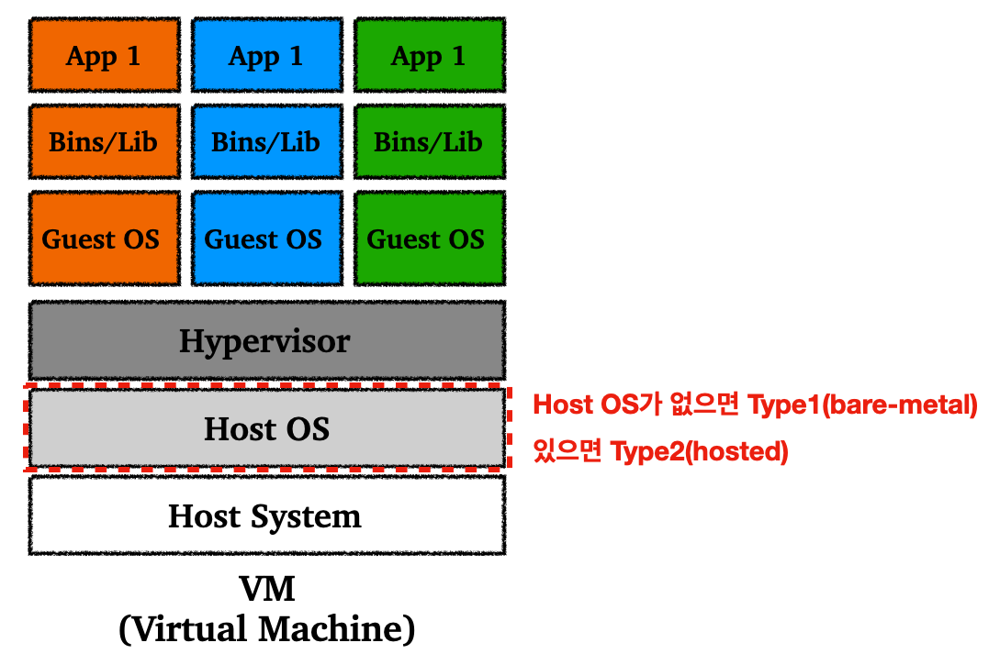
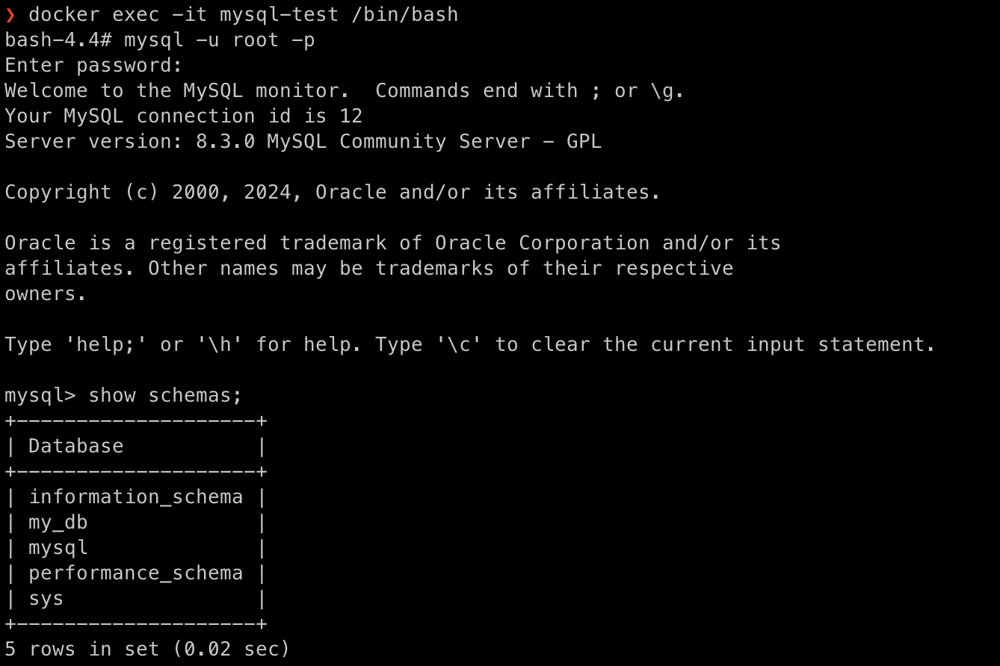

> 가상화, 도커의 등장 배경, 도커에 대한 소개

---

## Table of Contents

1. 가상화(Virtualization)


---

## 1) 가상화(Virtualization)

### 1.1 가상화 소개

가상화(virtualization)는 서버, 스토리지, 네트워크 및 기타 물리적 시스템에 대한 가상 표현을 생성하는데 사용할 수 있는 기술이다. 가상 소프트웨어는 물리적 하드웨어 기능을 모방하여 하나의 물리적 머신에서 여러 가상 시스템을 동시에 실행할 수 있다.

가상화는 간단하게 말하자면 Local이나 Production 서버에서의 환경을 위한 일종의 템플릿이라고 생각할 수 있다. 개발과 운영 서버의 환경 불일치를 해소할 수 있고, 어느 조건에서나 동일한 환경으로 프로그램을 실행 할 수 있게 된다.

<br>

---

### 1.2 가상 머신(VM, Virtual Machine), 컨테이너(Container)

#### 1.2.1 VM(Virtual Machine)

가상 머신(VM)은 실제 컴퓨터의 가상 표현 또는 에뮬레이션이다. 이를 종종 게스트라고 하며, 이를 실행하는 실제 시스템을 호스트라고 한다. 

쉽게 말해서, VM은 호스트 시스템(Host System)이라고 하는 실제 물리적인 컴퓨터 위에 OS를 포함한 가상화 소프트웨어를 두는 방식이라고 이해하면 된다. 설명에서도 알 수 있듯이, OS 위에 OS를 하나 더 실행시킨다는 점에서 굉장히 많은 리소스를 사용하게 된다. (VM의 하드웨어, OS, 애플리케이션 전부 호스트 시스템 위에서 프로세스로 구현되기 때문에 무겁다)

<br>

<p align="center">    </p>

<p align='center'>Virtual Machine</p>

* 하이퍼바이저(hypervisor)의 위치에 따라 1형 또는 2형 하이퍼바이저로 분류할 수 있다
* **Type1(Bare-metal Hypervisor)**
  * 기본 시스템 하드웨어와 직접 상호작용
  * 호스트 OS 없이 호스트 시스템의 물리적 하드웨어에 직접 설치된다
  * Type2 보다 오버헤드가 적음
  * 사용 상황 : 데이터 센터, 프로덕션 환경과 같은 고정 애플리케이션
  * 예) Hyper-V, KVM, ESXi


* **Type2(Hosted Hypervisor)**
  * 호스트 OS를 통해 호스트 시스템의 컴퓨터 하드웨어와 상호작용한다
  * 애플리케이션으로 실행되는 시스템에 설치한다, 하이퍼바이저는 OS 위에서 소프트웨어로서 동작한다
  * Host OS 위에 소프트웨어적으로 동작하기 때문에 오버헤드가 크다
  * Host OS의 문제가 전체 Guest OS에 영향을 줄 수 있다
  * 사용 상황 : 운영에 중요하지 않은 데스크톱 또는 개발 환경에 활용
  * 예) VirtualBox, Workstation

<br>

---

#### 1.2.2 컨테이너(Container)

컨테이너의 정의를 찾아보면, *"소프트웨어 서비스를 실행하는 데 필요한 특정 버전의 프로그래밍 언어 런타임 및 라이브러리와 같은 종속 항목과 애플리케이션 코드를 함께 포함하는 경량 패키지이다."* 라고 하는 것을 찾을 수 있다.

쉽게 말하자면 어떤 환경에서든 애플리케이션을 실행할 수 있도록 위한 모든 요소를 포함하는 상자 안의 가상 환경을 생각하면 편하다. 이런 패키지와 같은 가상 환경은 일정 수준의 격리성(Isolation)과 이식성(Portability)을 제공하기 때문에 컨테이너에 비유된다.

<br>

<p align="center">    </p>

<p align='center'>Container</p>

* 애플리케이션이 동작하기 위한 모든 컴포넌트가 들어간 패키지를 컨테이너(Container)라고 하고, 이런 컨테이너는 컨테이너 엔진(런타임)만 있으면 어떤 호스트 시스템 위에서든 작동한다
* 컨테이너는 Guest OS와 Hypervisor가 필요하지 않기 때문에, 기존 VM에 비해 가볍다
* 일정 수준의 격리성, 이식성을 제공하면서 VM 대비 가벼운 특징 때문에 컨테이너를 통한 서비스의 스케일링(Scaling)이나 마이그레이션(Migration)이 VM보다 용이하다
* 가볍고, 컨테이너 단위로 애플리케이션을 관리하기 쉽고, 스케일 인과 아웃이 상대적으로 쉽기 때문에 클라우드 네이티브(Cloud Native)를 실현하는 중심 기술 중 하나이다

<br>

---

## 2) 도커(Docker)

### 2.1 Docker 소개

도커는 컨테이너를 생성, 실행, 관리, 배포하는 과정을 편리하게 만들어주는 오픈소스 플랫폼이다.

도커는 LCX(Linux Container)라는 기술을 기반으로 동작한다. 도커는 기본적으로 리눅스(Linux) 위에 동작하기 위해서 만들어진 것이기 때문에, 타 운영체제에서 동작하기 위해서는 가상화 기술을 사용한다(쉽게 말해서 리눅스 외의 환경에서 도커를 사용하면 오버헤드가 발생할 수 있다).

<br>

> 도커의 내부 동작 원리를 살펴보고 싶으면 다음의 키워드로 검색하는 것을 추천한다.
>
> * Linux Containers
> * namespaces
> * control groups(cgroups)
> * chroot
> * Docker Engine, Containerd

<br>

<p align="center">    </p>

<p align='center'>Docker image and container</p>

도커에서 컨테이너를 생성하는 과정을 간략히 설명하자면 다음과 같다.

<br>

1. **Dockerfile 생성**
   * Dockerfile은 도커 이미지를 빌드하기 위한 명령어를 포함한 텍스트 파일
   * 사용할 베이스 이미지(base image)에 대한 설정, 필요한 애플리케이션 코드 추가, 의존성(dependency) 추가, 런타임시 수행할 명령어 명시 등이 Dockerfile에 포함된다
   * 베이스 이미지의 경우 DockerHub에서 벤더가 공식적으로 지원하는 이미지를 사용하는 경우가 많다


2. **Docker image 빌드**
   * `docker build` 명령어로 Dockerfile에 기반한 이미지를 만든다
   * 사용할 도커 이미지 파일이 이미 존재하면 해당 이미지 파일을 사용하면 됨


3. **Docker container 실행**
   * `docker run` 명령어로 도커 이미지에 기반한 컨테이너를 실행할 수 있다
   * 컨테이너의 런타임 환경과 관련된 설정을 위한 옵션들을 추가할 수 있다

<br>

---

### 2.2 Docker Architecture

도커는 기본적으로 클라이언트-서버 아키텍쳐를 사용한다. 

<br>

<p align="center">    </p>

<p align="center">https://docs.docker.com/get-started/overview/#docker-architecture</p>

* **Docker Client**
  * 유저가 도커 엔진과 상호작용할 수 있도록 해주는 CLI 도구
  * 유저들은 도커 클라이언트를 통해서 이미지와 컨테이너 관련 작업들을 수행할 수 있다
  * 도커 클라이언트는 Docker API를 통해 도커 데몬(Docker Daemon)과 요청을 주고 받는다


* **Docker Host**
  * 도커 엔진을 실행하면서 컨테이너들을 호스트 해주는 가상 또는 물리적인 머신을 가리킨다
  * 도커 클라이언트와 호스트가 무조건 같은 로컬에 존재하지 않아도 연결할 수 있다


* **Docker Daemon**(`dockerd`)
  * 컨테이너, 이미지, 볼륨, 네트워크와 같은 도커 오브젝트들을 관리해주는 호스트 시스템 위에서 동작하는 백그라운드 서비스이다
  * 도커 클라이언트로 부터 도커 API 요청을 받고 도커 이미지와 컨테이너에 관한 작업을 수행할 수 있다
  * 아래에서 동작하는 컨테이너 런타임(Containerd)과 상호작용을 하면서 컨테이너 관련 작업과 수명주기(life-cycle)를 관리한다
  * 도커 엔진(Docker Engine)과 상호 교환적으로 용어가 사용될 수 있지만, 보통 도커 엔진은 도커 데몬과 컨테이너 런타임 등을 포함한 더 넓은 범위의 컴포넌트들을 포함한다


* **Docker Registry**
  * 도커 이미지들을 저장하고 있는 중앙 레포지토리
  * 명령어를 통해서 사용자들은 도커 이미지를 `push`(업로드), `pull`(다운로드), 등을 할 수 있다
  * Docker Hub가 Docker가 공식적으로 운영하고 있는 레지스트리(registry)이다 

<br>

---

### 2.3 Docker Hub 소개

Docker가 공식적으로 운영하고 있는, 도커 이미지를 공유하고 관리하기 위한 레지스트리.

도커 허브(Docker Hub)에는 maintainer 들이 제공하는 공식 이미지들과, 사용자들이 직접 만든 이미지를 포함한 다양한 이미지들이 등록되어 있다.

도커 허브를 통해서 각종 이미지들을 업로드 및 다운로드를 할 수 있다.

* Docker Hub 사이트 : [https://hub.docker.com/](https://hub.docker.com/)

<br>

---

## 3) Docker 사용

MySQL 컨테이너를 생성하고 실행해보면서, 도커의 사용법을 익혀보자.

* Docker Docs : [https://docs.docker.com/get-started/overview/](https://docs.docker.com/get-started/overview/)

<br>

### 3.1 Dockerfile 생성

MySQL 컨테이너 이미지를 빌드하기 위한 Dockerfile을 작성해보자. Dockerfile을 작성할 때 실제 이름은 `Dockerfile`이어야 한다.

```Dockerfile```

```dockerfile
# 베이스 이미지 설정 - 특정 버전을 명시해서 베이스 이미지로 사용가능
From mysql:latest
# 환경 변수 설정
ENV MYSQL_ROOT_PASSWORD=root
ENV MYSQL_DATABASE=my_db
ENV MYSQL_USER=my_user
ENV MYSQL_PASSWORD=my_password
```

* `Dockerfile`은 디렉토리당 하나만 존재할 수 있기 때문에, 디렉토리별로 관리하는 것이 좋다
* 도커파일에 사용할 수 있는 명령어는 다양하다
* 도커파일에서 명령어는 위에서 아래로 순차적으로 적용되며, 이미지 레이어로 적용된다
* 이미지 버전을 명시할 때 필요한 경우 pinned 버전을 사용해서 예상치 못한 변화를 방지할 수 있다

<br>

<p align="center">    </p>

<p align="center">https://docs.docker.com/reference/dockerfile/</p>

* `From` : 베이스 이미지 설정


* `ADD`/`COPY` : 호스트의 파일이나 디렉토리를 이미지에 추가 가능
  * 사용법 : `COPY {로컬 디렉토리(파일)} {컨테니어 내 디렉토리(파일)}`
  * `COPY` : `Dockerfile`이 존재하는 경로 기준 로컬 디렉토리(호스트의 디렉토리)를 컨테이너 내부의 디렉토리로 복사한다


* `WORKDIR` : `RUN`, `CMD`, `ENTRYPOINT` 등의 명령어를 실행할 컨테이너 경로를 지정한다
  * 예) `WORKDIR /app` : 컨테이너 내부의 `/app` 에서 실행하도록 설정


* `RUN` : 컨테이너 내에서 리눅스 명령어를 실행한다. 한번에 실행할 명령어가 여러개인 경우 `&& \`로 이어준다

  * 사용예시

  * ```dockerfile
    RUN pip install pip==23.0.1 && \
    	  pip install poetry==1.2.1 && \
    	  poetry export -o requirements.txt && \
    	  pip install -r requirements.txt
    ```


* `CMD`/ `ENTRYPOINT` : 컨테이너를 생성 및 실행할 때 실행할 명령어

  * `CMD` : 컨테이너를 생성할 때만 명령어 수행
  * 예) ` CMD ["python", "main.py"]` : 컨테이너 생성 될때 `python main.py` 실행

  

  * `ENTRYPOINT` : 컨테이너를 시작할 때만 명령어 수행

<br>

---

### 3.2 Docker image 빌드

위의 `Dockerfile` 기반으로 이미지를 빌드해보자.

* 사용법 : `docker build -t {빌드할 이미지 이름:태그 이름} {Dockerfile이 위치한 경로}`
* `-t` 옵션으로 이미지 이름과 태그 지정

<br>

우리가 만든 `Dockerfile`이 존재하는 경로로 이동하고 ` docker build -t mysql-image .`을 사용해보자.

* `mysql-image` : 빌드할 이미지 이름
* `.` : 현재 경로
* 태그 이름을 지정하지 않으면 `latest`로 지정된다

<br>

<p align="center">    </p>

<br>

빌드 후 `docker image` 명령어로 내가 가지고 있는 이미지들을 확인할 수 있다.

<p align="center">    </p>

* 이미지 생성 날짜는 내가 로컬에서 `Dockerfile`을 통해서 생성한 날짜가 아니라, 보통 베이스 이미지가 생성되거나 수정된 날짜 기준으로 표시된다

<br>

---

### 3.3 Docker image 실행(컨테이너 실행)

도커 이미지를 실행해보자.

* 사용법 : `docker run {image name:tag}`
* 이때 컨테이너과 관련된 여러 옵션을 줄 수도 있다

<br>

우리가 빌드했던 이미지를 `run`해서 컨테이너를 실행시켜보자.

```bash
docker run --name mysql-test -d -p 3306:3306 mysql-image:latest
```

* `--name` : 컨테이너 이름 지정
  * 지정하지 않으면 랜덤으로 이름이 부여된다
  * 위에서는 `mysql-test` 라는 이름으로 컨테이너 이름을 지정했다


* `-d` : 데몬(백그라운드) 모드
  * 컨테이너를 백그라운드 상태로 실행한다
  * 이 옵션을 사용하지 않을 경우, 현재 실행하는 셸 위에서 컨테이너가 실행되고 컨테이너의 로그를 바로 볼 수 있지만, 컨테이너를 나갈 경우 실행이 종료된다


* `-p` : 포트 지정
  * `-p {localhost port}:{container port}` 형태로 사용한다
  * 위에서 사용한 `-p 3306:3306`는 로컬 포트 `3306`으로 접근 시 컨테이너 포트 `3306`으로 연결되도록 설정한 것이다
  * MySQL은 기본적으로 `3306` 포트로 통신한다

<br>

컨테이너를 실행했다면 `docker ps` 명령어로 실행한 컨테이너와 정보를 확인해보자.

(`docker ps -a` 명령어를 사용할 경우 중지한 컨테이너까지 확인 가능하다)

<p align="center">    </p>

<br>

> 무조건 메뉴얼하게 Dockerfile을 통해 이미지를 빌드할 필요는 없다.
>
> * `docker pull mysql:8` 같은 형태로 특정 버전의 이미지를 다운받아서 사용할 수 있다
> * 컨테이너 실행은 `docker run --name mysql-tutorial -e MYSQL_ROOT_PASSWORD=0000 -d -p 3306:3306 mysql:8`와 같이 사용하면 된다
>
> <br>
>
> 우리가 만든 이미지를 업로드할 수 있다.
>
> * `docker login` : 나의 DockerHub 계정을 연동할 수 있다
>
> 
>
> * `docker tag SOURCE_IMAGE[:TAG] TARGET_IMAGE[:TAG]` : 도커 이미지에 태그를 적용할 수 있다
>   * 이미지 아이디가 `1234567890ab`인 이미지를 `my-image:latest`로 태그 하고 싶다고 가정해보자
>   * 예) `docker tag 1234567890ab my-image:latest`
>
> 
>
> * `docker push {이미지이름:태그}` : DockerHub에 이미지를 `push` 한다
>   * DockerHub에서 푸시된 이미지를 확인 가능
>   * `push`한 이미지는 언제든지 `pull`로 다시 가져올 수 있다

<br>

---

### 3.4 컨테이너 접속

우리가 실행한 컨테이너에 진입해보기 전에 컨테이너 관련 명령어를 몇 가지 더 알아보고 가자.

* 컨테이너 중지 : `docker stop {container name or ID}`
* 컨테이너 시작 : `docker start {container name or ID}`
* 컨테이너 재시작 : `docker restart {container name or ID}`
* 컨테이너 삭제 : `docker rm {container name or ID}`
* 실행중인 컨테이너 강제 삭제 : `docker rm {container name or ID} -f`

<br>

실행한 컨테이너에 접속하는 방법은 다음과 같다.

* 접속 방법 : `docker exec -it {container name or ID} /bin/bash`

<br>

이제 우리가 실행한 컨테이너에 접속해보자.

```bash
docker exec -it mysql-test /bin/bash
```

<p align="center">    </p>

* `mysql -u root -p`으로 패스워드 입력하고 MySQL 쉘 화면으로 진입

<br>

---

### 3.5 Volume Mount

컨테이너를 실행할 때 컨테이너와 호스트간의 파일이 자동으로 공유가 되는 것이 아니다. 도커 컨테이너는 컨테이너만의 파일 시스템이 따로 존재한다. 따라서 만약 도커 컨테이너에 따로 설정을 하지 않았다면, 컨테이너 삭제시 컨테이너의 파일들은 사라진다.

이런 파일을 유지하고 싶은 경우 호스트와 컨테이너의 저장소를 공유해야한다. 이때, 볼륨 마운트(Volume mount)를 통해서 호스트와 컨테이너가 데이터를 공유할 수 있도록 해준다.


* `mount` : 호스트의 파일 시스템 경로를 컨테이너에 연결하는 것


* `volume` : 컨테이너에서 데이터를 저장하고 공유하기 위한 파일 또는 디렉토리
  * 볼륨을 사용하기 위해서는 볼륨을 컨테이너에 마운트 해줘야 한다


* `bind mount` : 호스트의 파일 또는 디렉토리를 컨테이너 내부에 직접 마운트하는 것
  * 새로운 볼륨의 생성 없이 바로 파일 또는 디렉토리를 연결하는 방식이다

<br>

이런 볼륨을 사용 가장 큰 이유는, 혹시나 모를 컨테이너 삭제와 같은 상황에서 컨테이너 내부의 데이터가 전부 사라지기 때문에, persistance(영속성)를 유지하기 위해서 볼륨을 사용한다.

<br>

그럼 이제 볼륨을 한번 생성해보자.

```dockerfile
docker volume create mysql_data
```

* `mysql_data`라는 이름의 볼륨을 생성한다
* 사실 볼륨 컨테이너 생성시 볼륨의 생성과 마운트를 한번에 처리할 수 있다

<br>

볼륨 마운트(`volume mount`) 방법은 다음과 같다.

* `anonymous volume`
  * 도커 엔진에 의해 자동으로 생성되는 볼륨
  * 컨테이너를 실행할 때 옵션에서 호스트 경로를 지정하지 않으면 볼륨이 자동으로 생성된다
  * 컨테이너 삭제 시 익명 볼륨의 데이터도 삭제된다
  * `-v {컨테이너 내부 경로}`


* `named volume`
  * 이름을 지정하여 생성한 볼륨
  * 위의 `volume create`로 생성한 볼륨이 `named volume`
  * `-v {볼륨 이름}:{컨테이너 내부 경로}`
  * 만약 해당 볼륨 이름이 존재하면 해당 볼륨을 사용하고, 존재하지 않는다면 명시한 이름으로 볼륨을 생성하고 마운트 한다


* `bind mount`
  * `-v {호스트 경로}:{컨테이너 내부 경로}`


<br>

우리가 생성한 볼륨을 마운트하고 컨테이너를 실행(`run`) 해보자.

```bash
docker run -d --name mysql-container -v mysql_data:/var/lib/mysql -p 3306:3306 mysql-image:latest
```

* `mysql_data`라는 이름의 볼륨을 마운트(없을 시 생성하고 마운트)
* 


---

## 4) Docker Compose


