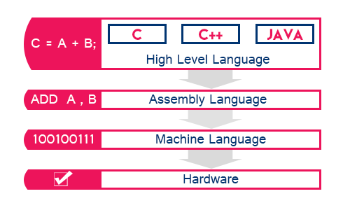
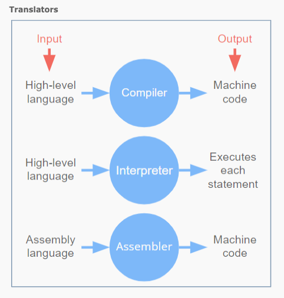
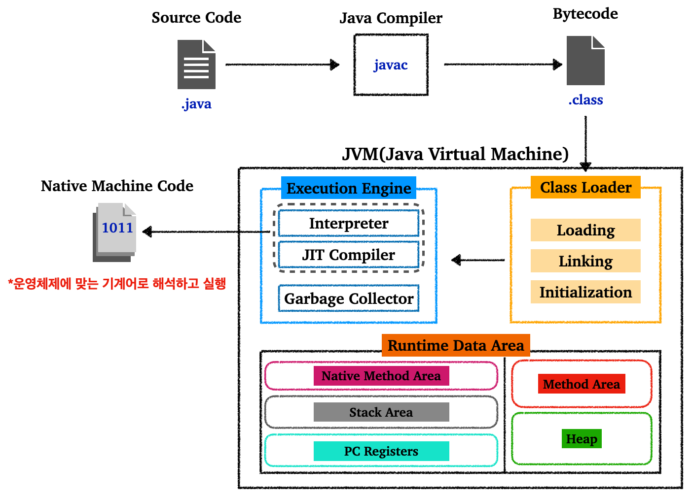
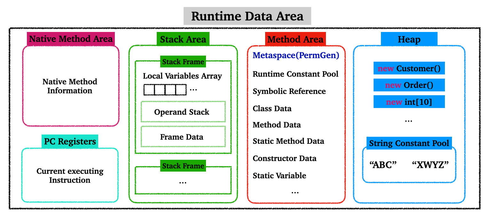
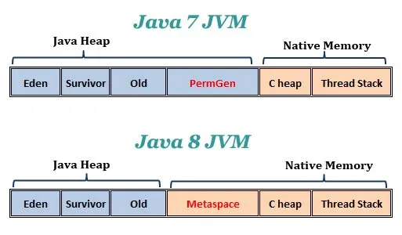
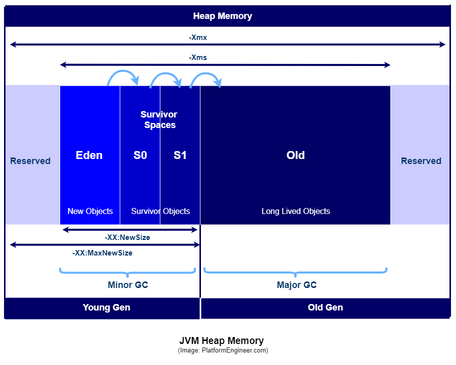
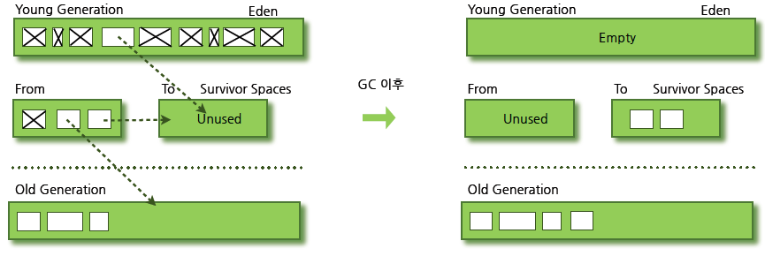
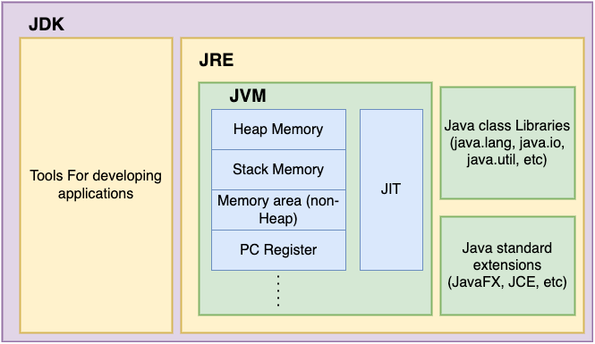
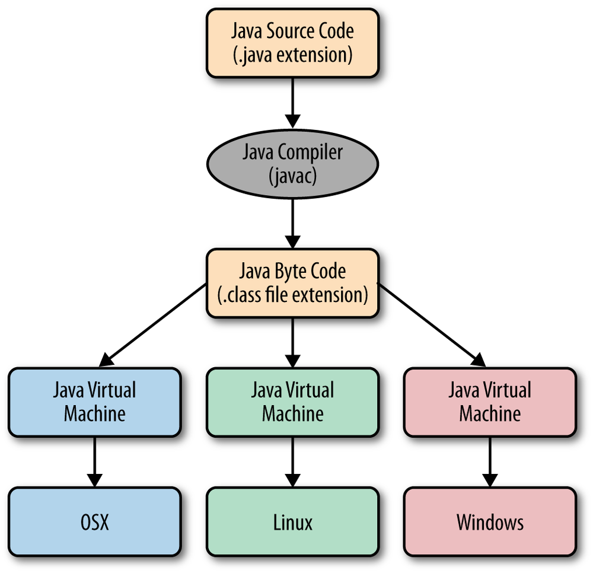

## Table of Contents

1. [Programming Language](https://github.com/seungki1011/Data-Engineering/tree/main/java/(001)%20Java%20Introduction#1-programming-language)
   * 고급 언어
   * Translator
2. [자바 동작 방식(How Java Works)](https://github.com/seungki1011/Data-Engineering/tree/main/java/(001)%20Java%20Introduction#2-%EC%9E%90%EB%B0%94-%EB%8F%99%EC%9E%91-%EB%B0%A9%EC%8B%9Dhow-java-works)
3. [자바 메모리 구조(Java Memory Structure)](https://github.com/seungki1011/Data-Engineering/tree/main/java/(001)%20Java%20Introduction#3-java-memory-structure)
   * 메서드 영역(Method Area)
   * 스택 영역(Stack Area)
   * 힙 영역(Heap Area)
4. [JVM, JDK, JRE](https://github.com/seungki1011/Data-Engineering/tree/main/java/(001)%20Java%20Introduction#4-jvm-jdk-jre)
   * JDK
   * JRE
   * JVM

---

## 1) Programming Language

### 1.1 고급언어(High Level Language)

많은 경우 고급 프로그래밍 언어는 고급언어 > 어셈블리어 > 기계어 > 하드웨어로 추상화 된다

 

    

https://www.cs.mtsu.edu/~xyang/2170/computerLanguages.html

 

---

### 1.2 번역기(Translator)

* 프로그래머들이 작성한 코드를 컴퓨터가 이해할 수 있는 바이너리 형태로 변환해주는 프로그램

* [위키피디아 정의](https://en.wikipedia.org/wiki/Translator_(computing))

  * > A **translator** or **programming language processor** is a computer program that converts the programming instructions written in human convenient form into machine language codes that the computers understand and process. It is a generic term that can refer to a [compiler](https://en.wikipedia.org/wiki/Compiler), [assembler](https://en.wikipedia.org/wiki/Assembler_(computing)), or [interpreter](https://en.wikipedia.org/wiki/Interpreter_(computing))—anything that converts code from one computer language into another.

 

    

https://www.helpteaching.com/lessons/1285/high-level-low-level-languages

* **컴파일러(compiler)**
  * 특정 프로그래밍 언어를 다른 프로그래밍 언어로 번역해주는 프로그램
  * 소스 코드(source code)에서 목적 코드(object code)로 변환
  * 한번 컴파일하고 나면 다시 컴파일할 필요 없이 재사용 가능

* **인터프리터(interpreter)**
  * 소스 코드를 한줄씩 읽으면서 실행

 

---

## 2) 자바 동작 방식(How Java Works)

자바의 동작 과정을 살펴보자.

먼저 동작원리를 크게 3개의 단계로 나타내면 다음과 같다.

1. 개발자가 작성한 소스 코드(`.java`)는 자바 컴파일러(`javac`)에 의해 자바 바이트 코드(`.class`)로 변한다
2. `.class` 파일을 클래스 로더(Class Loader)를 통해 JVM 위에 올린다
3. JVM의 인터프리터(Interpreter)와 JIT 컴파일러를 통해 각 운영체제에 맞는 기계어로 해석하고 실행한다 

 

다음 그림은 자바의 동작 과정을 요약한다.

 

    

자바 동작 과정

 

각 단계를 자세히 살펴보자.

1. 개발자가 작성한 소스 코드(`.java`)는 자바 컴파일러(`javac`)에 의해 자바 바이트 코드(`.class`)로 변한다
   * 바이트 코드 파일(`.class`)를 JVM에서 읽어서 실행할 것이다

 

2. `.class` 파일을 클래스 로더(Class Loader)를 통해 JVM 위에 로딩한다
   * 클래스 로더의 역할은 다음과 같다
   * Loading
     * `.class` 파일을 읽어와서 JVM 위로 탑재한다
     * 클래스를 찾아가면서, 해당되는 클래스 파일을 찾지 못하면 `ClassNotFoundException`을 발생시킨다
   * Linking
     * Verification :  바이트코드가 JVM 스펙에 맞는지 확인
     * Preparation : 클래스 변수에 필요한 메모리 할당 및 기본값으로 초기화
     * Resolution : `Symbolic Reference`를 `Direct Reference`로 변경
   * Initialization
     * 생성자, static block 등의 실행을 포함한 초기화 과정 수행
   * 위의 과정을 통해 필요한 클래스들을 JVM의 Runtime Data Area에 올린다

 

3. JVM의 인터프리터(Interpreter)와 JIT 컴파일러를 통해 각 운영체제에 맞는 기계어로 해석하고 실행한다
   * 인터프리터(Interpreter)
     * 인터프리터는 바이트 코드를 한줄씩 읽으면서 운영체제가 실행할 수 있도록 기계어로 번역하고 실행한다
     * 이런 인터프리터는 단독으로 사용하면 컴파일러만 사용하는 것에 비해 아주 느리다
     * 이런 성능 문제를 해결하기 위해서 JIT 컴파일러와 함께 사용한다
   * JIT Compiler
     * 초기에는 인터프리터를 사용해서 바이트코드를 한줄씩 해석/실행한다
     * JIT 컴파일러는 이후 자주 사용하는 코드 영역 즉, 핫 스팟(hot spot)을 찾는다
     * 핫 스팟은 네이티브 코드(Native Code)로 컴파일된다
     * 네이티브 코드는 캐시된다
     * 정리하자면, JIT 컴파일러는 같은 코드를 매번 해석하는 대신 처음 실행될 때 인터프리트를 하면서 자주 쓰이는 코드를 캐싱한 뒤, 이후에는 캐싱된 코드를 가져다 쓰기 때문에 인터프리터의 느린 실행 속도를 개선할 수 있다

 

> 클래스 로더나 JIT 컴파일러는 위에서 설명한 과정보다 복잡하다. 위의 설명은 복잡한 과정과 요소들을 단순화한 것에 불과하다.

 

---

## 3) Java Memory Structure

위에서 잠시 언급한 JVM의 Runtime Data Area에 대해 알아보자.

JVM의 런타임 데이터 영역(Runtime Data Area)를 자바의 메모리 구조로 볼 수 있다.

 

    

Runtime Data Area

### 3.1 스레드(thread)별로 사용하는 영역

#### 3.1.1 Native Method Area

* 네이티브 메서드(Native Method)는 Java가 아닌 다른 언어(C, C++)로 작성된 메서드
* Native Method Stack은 Java 메서드가 아닌 네이티브 메서드들의 호출 순서를 담아 관리하는 스택

 

#### 3.1.2 PC Registers

* JVM 스레드가 현재 실행중인 메서드의 명령(instruction)을 담고 있는 주소를 담고있다

 

#### 3.1.3 Stack Area

* Local Variable Array : 필요한 자역변수를 배열로 저장한다
* Operand Stack : 연산의 중간 결과물을 저장한다 
* Frame Data : 상수 풀(Constant Pool)과 exception table을 가진다
* 메서드가 실행되면 스택 프레임(Stack Frame)이 생성되고 스택에 추가된다, 실행이 완료되면 제거된다

 

---

### 3.2 공통으로 사용하는 영역

    

https://www.programmersought.com/article/4905216600/

#### 3.2.1 Method Area(Metaspace, PermGen)

* Java7에서 Java8로 버전이 증가하면서 기존의 PermGen이라는 명칭은 Metaspace로 불린다.(Method Area라는 명칭을 사용하는 경우도 많다)

* 기존 PermGen(Java < 8)은 Java의 Heap Space의 일부를 사용하면서, Heap과는 논리적으로 분리가 되어 있었다. 여기에는 한가지 문제가 있었는데, 그것은 해당 영역의 크기가 제한적이라서 `OutOfMemoryError: PermGen space`를 유발한다는 것이었다.

* Java8로 버전업하면서 기존 PermGen은 Metaspace라는 명칭으로 바뀌었고, Metaspace는 Heap 공간이 아닌 OS에서 제공하는 Native Memory를 사용하게된다. 이제는 필요시 자동으로 크기를 증가시켜 공간을 확보하게 된다.
  * Metaspace는 GC의 대상이지만, 기존(Java7)보다 더 최적화된 GC 방법을 사용하게 된다

* Metaspace는 다음을 저장하고 있다
  * 클래스, 메서드의 메타 정보
  * 정적 변수
  * 클래스, 필드, 메서드의 정보
    * 클래스의  필드, 메서드, 생성자 코드등의 모든 실행 코드(바이트코드)가 존재
  * 런타임 상수 풀(Runtime Constant Pool)
  * 프로그램을 실행하는데 필요한 공통 데이터를 관리한다

 

#### 3.2.2 Heap

* 자바 인스턴스(objects)들의 저장소
  * `Object`클래스를 상속받는 모든 객체들과 해당 인스턴스의 변수들을 담는 공간이다 
  * 배열 등도 여기에 포함

* 대부분의 GC가 이루어지는 영역
  * 참조되지 않는 인스턴스는 GC에 의해 제거

* 문자열 상수 풀(String Constant Pool)도 힙에 포함된다
* Heap은 모든 스레드에 공유되는 영역이다

 

Heap에 대해 더 자세히 알아보자.

 

    

https://medium.com/platform-engineer/understanding-java-memory-model-1d0863f6d973

##### Young Gen

* Eden Space
  * 객체가 생성되면 위치하는 공간
  * Minor GC, Full GC의 대상

* Survivor Space 0, 1
  * Eden에서의 GC에서 살아남은 객체가 위치하는 공간
  * 보통 지속적으로 참조되고 있는 객체들이 존재한다
  * Space 0과 1은 교차되며 저장하고 비운다
  * Space 0, 1에서 오래 살아남은 객체는 Old Gen으로 옮겨질 확률이 높다
  * Minor GC, Full GC의 대상

 

##### Old Gen(Tenured Generation)

* 여러번의 Minor GC 싸이클 후에도 오랫동안 살아남는 객체들이 옮겨지는 영역

* Old Gen이 가득차게되는 경우 Major GC가 수행된다
  * Major GC, Full GC의 대상

* Old Gen의 사용량이 높을수록 Major GC에 의한 성능 부하가 있을 확률이 높아진다
  * Old Gen 사용량/점유율 높음 → Old Gen이 더 빨리 가득차게 됨 → Major GC 수행 빈도 높아짐
  * Major GC는 생각보다 비싼 연산임

 

---

## 4) Garbage Collection(GC)

JVM의 가비지 컬렉션(GC)의 동작 과정을 살펴보자.

들어가기 전에 가비지 컬렉션에 대해 간단히 소개하자면, 말 그대로 유효하지 않은 메모리(가비지)를 모아서 처리하는 과정을 이야기한다.

유효하지 않은 메모리라는 것은 객체가 더이상 참조 상태가 아닌 상태를 말한다(한 마디로 객체를 참조할 수 있는 링크가 없음).

 

GC는 보통 다음의 두 단계를 거친다.

1. **Stop the World**
   * GC가 동작할 때 GC를 제외한 모든 스레드가 멈춘다(당연히 애플리케이션이 멈춘다)
   * 보통 GC 성능 튜닝은 Stop the World의 시간을 줄이는 방식으로 이루어진다

 

2. **Mark and Sweep**
   * `Mark` : 접근 가능한 객체(Reachable Object)에 표시
   * `Sweep` : `Mark`가 안된 객체(접근 못하는 객체)를 제거
   * `Compact` : `Sweep`에 의해 메모리가 삭제되면서 발생하는 fragmentation을 정리하기 위해서 메모리를 재할당 후 정리한다(연속된 메모리 공간을 가지도록 재할당)
     * Compactation의 적용은 GC 알고리즘에 따라 다르다
   * Stop the World → Mark → Sweep

 

---

### 4.1 Minor GC(Young GC)

Minor GC의 과정에 대해서 알아보자.

 

    

https://d2.naver.com/content/images/2015/06/helloworld-1329-3.png

1. 새롭게 생성되는 객체는 대부분 Young Gen의 Eden에서 생성된다
2. Eden이 가득차면 Minor GC 발생
3. Eden에서 살아남든 객체는 Survivor Space 중에 비어있는 영역으로 이동
   * Survivor 영역 중 하나는 반드시 비어있는 상태
4. Survivor 영역 중에 오래 살아남은 객체는 Old Gen으로 이동
5. Minor GC가 완료되면 Young Gen은 비워진다

 

Eden → Survivor Space → Old Gen의 데이터 이동 과정은 전부 memory copy를 사용한다. 여기서 알 수 있는 것은 객체의 생존주기(Life-Cycle)가 짧을수록 memory copy의 빈도가 낮아지고, GC에 소모되는 자원을 줄일 수 있다. 

 

---

### 4.2 Major GC(Old GC)

Major GC의 과정에 대해서 알아보자. Major GC는 기본적으로 Old Gen 영역의 메모리가 부족해지게 되면 발생한다.

Major GC는 여러가지 방식이 존재하며, 세세한 구현은 자바의 버전 마다 달라질 수 있다.

 

#### 4.2.1 Serial GC (`-XX:+UseSerialGC`)

 

---

### 4.3 Full GC

---

## 5) JVM, JDK, JRE

JVM, JDK, JRE 등의 용어에 대해 정리해보자.

 

### 5.1 JDK

* Java Development Kit
* 자바 어플리케이션을 만드는데 필요한 도구들을 포함하는 SDK(Software Development Kit)
* 자바 컴파일러, 디버거, 라이브러리 등을 포함한 여러 도구로 구성되어 있다
* JRE도 JDK에 포함된다
* 자바 표준 스펙을 기준으로 여러 회사에서 자바를 만든다 → 각 회사의 JDK가 가지는 특징이 존재한다
  * 자바 표준 스펙은 자바를 어떻게 만들어야하는지 기준을 제시하는 설계도 같은걸로 생각하면 편하다
  * 예) Oracle Open JDK, Amazon Corretto, Azul Zulu
* 버전 옆에 LTS(Long-Term Support)라고 써있다는 것은 보안 패치를 장기적으로 지원한다는 뜻

 

---

### 5.2 JRE

* Java Runtime Enviroment
* JVM을 포함한 실제 자바 어플리케이션을 동작 시킬때 필요한 라이브러리 API를 함께 묶어서 배포되는 패키지
* 기본적으로 JDK에 포함되어 있다
* 자바 어플리케이션을 실행시키기 위해서는 JRE 필요

 

    

https://www.ggorantala.dev/differences-between-jdk-jre-and-jvm/

 

---

### 5.3 JVM

* Java Virtual Machine(자바 가상 머신)
* 자바를 실행시키기 위해서는 자바 가상 머신이 반드시 필요

* 동작 과정
  * 처음에 작성하는 코드(.java)는 자바 컴파일러(javac)에 의해 자바 바이트 코드(.class)로 변환
  * 자바 바이트 코드는 JVM이 이해 가능한 언어
  * JVM은 인터프리터와 JIT 컴파일러를 통해 각 운영체제에 맞는 바이너리 코드로 변환

* 이러한 운영체제에 대한 독립성(Write Once, Run Everywhere)은 자바가 가지는 주요한 특징 중 하나이다

* 기존의 전체 소스코드 → 바이트코드 → 바이너리 코드 과정을 매번 하는 것이 느려서 JIT 컴파일러 사용

 

> **바이트 코드**(byte code)
>
> * **바이트코드**(Bytecode, portable code, p-code)는 특정 하드웨어가 아닌 가상 머신에서 돌아가는 실행 프로그램을 위한 이진 표현법이다. 하드웨어가 아닌 소프트웨어에 의해 처리되기 때문에, 보통 [기계어](https://ko.wikipedia.org/wiki/기계어)보다 더 [추상적](https://ko.wikipedia.org/wiki/추상화_(컴퓨터_과학))이다.
> * 쉽게 말하자면, 가상 머신에서 사용하는 코드이다. 가상 머신이 이해할 수 있는 중간 레벨로 컴파일 되어있음.
>
>  
>
> **바이너리 코드**(binary code)
>
> * 이진 코드 또는 **바이너리 코드**(binary code)는 텍스트, [컴퓨터 프로세서 명령](https://ko.wikipedia.org/wiki/명령어_집합) 또는 그 밖의 2심볼 시스템을 사용하는 데이터를 대표하며 대개 이진 숫자 체계의 0과 1을 의미한다.
> * 쉽게 말하자면, 컴퓨터가 인식할 수 있는 0과 1로 이루어진 코드.
>
>  
>
> **JIT 컴파일**(Just-In-Time compile)
>
> * 프로그램을 실행하는 시점에서 필요한 부분을 즉석으로 컴파일하는 방식을 말한다
> * JIT 컴파일러는 같은 코드를 매번 해석하는 대신 처음 실행될 때 인터프리트를 하면서 자주 쓰이는 코드를 캐싱한 뒤, 이후에는 캐싱된 코드를 가져다 쓰기 때문에 인터프리터의 느린 실행 속도를 개선할 수 있다
> * 핫스팟, 프로파일링, 캐싱, 최적화 등을 통해 성능을 높인다

 

    

https://medium.com/@PrayagBhakar/lesson-2-behind-the-scenes-4df6a461f31f

 

## Reference

---

1. [김영한의 자바 입문](https://www.inflearn.com/course/%EA%B9%80%EC%98%81%ED%95%9C%EC%9D%98-%EC%9E%90%EB%B0%94-%EC%9E%85%EB%AC%B8)
2. [티스토리 Inpa Dev - JVM, JDK, JRE](https://inpa.tistory.com/entry/JAVA-%E2%98%95-JDK-JRE-JVM-%EA%B0%9C%EB%85%90-%EA%B5%AC%EC%84%B1-%EC%9B%90%EB%A6%AC-%F0%9F%92%AF-%EC%99%84%EB%B2%BD-%EC%B4%9D%EC%A0%95%EB%A6%AC)
3. [https://www.ggorantala.dev/differences-between-jdk-jre-and-jvm/](https://www.ggorantala.dev/differences-between-jdk-jre-and-jvm/)
4. [https://d2.naver.com/helloworld/1329](https://d2.naver.com/helloworld/1329)
5. [https://mangkyu.tistory.com/118](https://mangkyu.tistory.com/118)