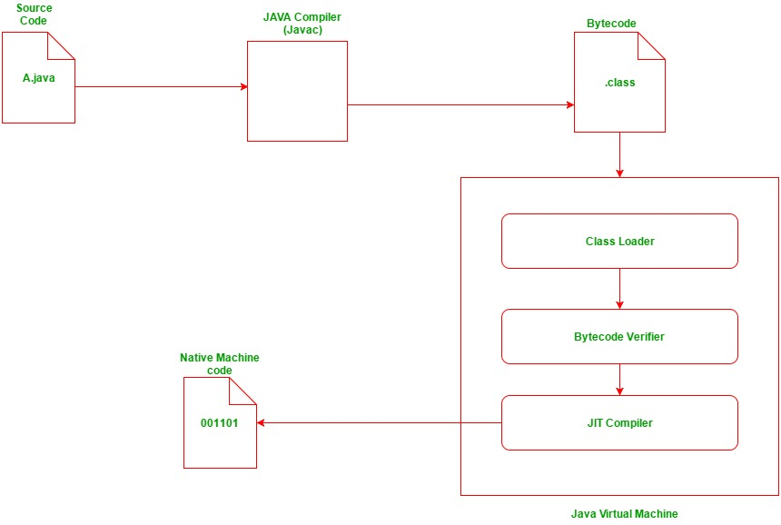
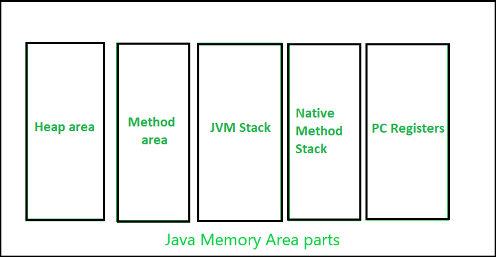

## Table of Contents

1. [Programming Language](https://github.com/seungki1011/Data-Engineering/tree/main/java/(001)%20Java%20Introduction#1-programming-language)
   * 고급 언어
   * Translator
2. [자바 동작 방식(How Java Works)](https://github.com/seungki1011/Data-Engineering/tree/main/java/(001)%20Java%20Introduction#2-%EC%9E%90%EB%B0%94-%EB%8F%99%EC%9E%91-%EB%B0%A9%EC%8B%9Dhow-java-works)
3. [자바 메모리 구조(Java Memory Structure)](https://github.com/seungki1011/Data-Engineering/tree/main/java/(001)%20Java%20Introduction#3-java-memory-structure)
   * 메서드 영역(Method Area)
   * 스택 영역(Stack Area)
   * 힙 영역(Heap Area)
4. [JVM, JDK, JRE](https://github.com/seungki1011/Data-Engineering/tree/main/java/(001)%20Java%20Introduction#4-jvm-jdk-jre)
   * JDK
   * JRE
   * JVM

---

## 1) Programming Language

### 1.1 고급언어(High Level Language)

* 많은 경우 고급 프로그래밍 언어는 고급언어 > 어셈블리어 > 기계어 > 하드웨어로 추상화 됨

<p align="center">    </p>

<p align="center">https://www.cs.mtsu.edu/~xyang/2170/computerLanguages.html</p>

<br>

---

### 1.2 Translator

* 프로그래머들이 작성한 코드를 컴퓨터가 이해할 수 있는 바이너리 형태로 변환해주는 프로그램

* [위키피디아 정의](https://en.wikipedia.org/wiki/Translator_(computing))

  * > A **translator** or **programming language processor** is a computer program that converts the programming instructions written in human convenient form into machine language codes that the computers understand and process. It is a generic term that can refer to a [compiler](https://en.wikipedia.org/wiki/Compiler), [assembler](https://en.wikipedia.org/wiki/Assembler_(computing)), or [interpreter](https://en.wikipedia.org/wiki/Interpreter_(computing))—anything that converts code from one computer language into another.


<br>

<p align="center">    </p>

<p align="center">https://www.helpteaching.com/lessons/1285/high-level-low-level-languages</p>

* **컴파일러(compiler)**
  * 특정 프로그래밍 언어를 다른 프로그래밍 언어로 번역해주는 프로그램
  * source code에서 object code로 변환
  * 한번 컴파일하고 나면 다시 컴파일할 필요 없이 재사용 가능


* **인터프리터(interpreter)**
  * 소스 코드를 한줄씩 읽으면서 실행

<br>

---

## 2) 자바 동작 방식(How Java Works)

* Java의 경우 compiling과 interpretation 둘다 사용한다
* [참고](https://www.geeksforgeeks.org/compilation-execution-java-program/)
* 처음에 작성하는 코드(.java)는 자바 컴파일러(javac)에 의해 자바 바이트 코드(.class)로 변환
* 자바 바이트 코드는 JVM이 이해 가능한 언어
* JVM은 인터프리터와 JIT 컴파일러를 통해 각 운영체제에 맞는 기계어로 해석해서 실행
  * 이런 운영체제의 독립성은 자바의 주요한 특징 중 하나

<br>

<p align="center">    </p>

<p align="center">https://www.geeksforgeeks.org/compilation-execution-java-program/</p>

* 컴파일 : ```javac Main.java``` (```Main.class```파일 생성)
* 실행 : ```java Main```
* IDE를 사용하는 경우 보통 위의 과정을 한번에 처리해줌

<br>

---

## 3) Java Memory Structure

자바의 메모리 구조에 대해서 간단히 살펴보자.

<p align="center">    </p>

<p align="center">https://www.geeksforgeeks.org/java-memory-management/</p>

<p align="center">    </p>

<p align="center">https://www.codelatte.io/courses/java_programming_basic/KUYNAB4TEI5KNSJV</p>

<br>

### 3.1 메서드 영역(Method Area)

* 프로그램을 실행하는데 필요한 공통 데이터 관리 (모든 영역에서 공유)
  * 예를 들어 메서드는 메서드 영역에서 공통으로 관리되고 실행된다


* 클래스 정보
  * 클래스의 실행 코드(바이트 코드)
  * 클래스의  필드, 메서드, 생성자 코드등의 모든 실행 코드가 존재


* ```static```영역: ```static```변수 보관
* Runtime Constant Pool

<br>

---

### 3.2 스택 영역(Stack Area)

* 자바 실행 시, 하나의 실행 스택 생성
* 각 스택 프레임은 지역 변수, 중간 연산 결과, 메서드 호출 등의 정보 포함


* 메서드 호출 시 스택 프레임이 하나 쌓이고, 메서드 종료시 해당 스택 프레임 제거
  * 스택 프레임 종료시 지역 변수도 함께 제거됨


* 스택 영역은 각 쓰레드(thread)별로 하나의 실행 스택이 생성됨


* Stack Overflow라는 것은 가능한 스택 영역을 초과하는 경우 발생
  * 보통 지나치게 깊은 재귀나 콜체인 때문에 발생

<br>

---

### 3.3 힙 영역(Heap Area)

* 인스턴스와 배열이 생성되는 영역
  * 인스턴스 변수 등이 여기에 포함


* 대부분 GC가 이루어지는 영역
  * 참조되지 않는 인스턴스는 GC에 의해 제거


* String Constant Pool

<br>

---

## 4) JVM, JDK, JRE

JVM, JDK, JRE 등의 용어에 대해 정리해보자.

<br>

### 4.1 JDK

* Java Development Kit
* 자바 어플리케이션을 만드는데 필요한 도구들을 포함하는 SDK(Software Development Kit)
* 자바 컴파일러, 디버거, 라이브러리 등을 포함한 여러 도구로 구성되어 있다
* JRE도 JDK에 포함된다
* 자바 표준 스펙을 기준으로 여러 회사에서 자바를 만든다 → 각 회사의 JDK가 가지는 특징이 존재한다
  * 자바 표준 스펙은 자바를 어떻게 만들어야하는지 기준을 제시하는 설계도 같은걸로 생각하면 편하다
  * 예) Oracle Open JDK, Amazon Corretto, Azul Zulu
* 버전 옆에 LTS(Long-Term Support)라고 써있다는 것은 보안 패치를 장기적으로 지원한다는 뜻

<br>

---

### 4.2 JRE

* Java Runtime Enviroment
* JVM을 포함한 실제 자바 어플리케이션을 동작 시킬때 필요한 라이브러리 API를 함께 묶어서 배포되는 패키지
* 기본적으로 JDK에 포함되어 있다
* 자바 어플리케이션을 실행시키기 위해서는 JRE 필요

<br>

<p align="center">    </p>

<p align="center">https://www.ggorantala.dev/differences-between-jdk-jre-and-jvm/</p>

<br>

---

### 4.3 JVM

* Java Virtual Machine(자바 가상 머신)
* 자바를 실행시키기 위해서는 자바 가상 머신이 반드시 필요


* 동작 과정
  * 처음에 작성하는 코드(.java)는 자바 컴파일러(javac)에 의해 자바 바이트 코드(.class)로 변환
  * 자바 바이트 코드는 JVM이 이해 가능한 언어
  * JVM은 인터프리터와 JIT 컴파일러를 통해 각 운영체제에 맞는 바이너리 코드로 변환


* 이러한 운영체제에 대한 독립성(Write Once, Run Everywhere)은 자바가 가지는 주요한 특징 중 하나이다


* 기존의 소스코드 → 바이트코드 → 바이너리 코드 과정이 느려서 JIT 컴파일러 사용

<br>


> **바이트 코드**(byte code)
>
> * **바이트코드**(Bytecode, portable code, p-code)는 특정 하드웨어가 아닌 가상 머신에서 돌아가는 실행 프로그램을 위한 이진 표현법이다. 하드웨어가 아닌 소프트웨어에 의해 처리되기 때문에, 보통 [기계어](https://ko.wikipedia.org/wiki/기계어)보다 더 [추상적](https://ko.wikipedia.org/wiki/추상화_(컴퓨터_과학))이다.
> * 쉽게 말하자면, 가상 머신에서 사용하는 코드이다. 가상 머신이 이해할 수 있는 중간 레벨로 컴파일 되어있음.
>
> <br>
>
> **바이너리 코드**(binary code)
>
> * 이진 코드 또는 **바이너리 코드**(binary code)는 텍스트, [컴퓨터 프로세서 명령](https://ko.wikipedia.org/wiki/명령어_집합) 또는 그 밖의 2심볼 시스템을 사용하는 데이터를 대표하며 대개 이진 숫자 체계의 0과 1을 의미한다.
> * 쉽게 말하자면, 컴퓨터가 인식할 수 있는 0과 1로 이루어진 코드.
>
> <br>
>
> **JIT 컴파일**(Just-In-Time compile)
>
> * 프로그램을 실행하는 시점에서 필요한 부분을 즉석으로 컴파일하는 방식을 말한다
> * JIT 컴파일러는 같은 코드를 매번 해석하는 대신 처음 실행될 때 인터프리트를 하면서 자주 쓰이는 코드를 캐싱한 뒤, 이후에는 캐싱된 코드를 가져다 쓰기 때문에 인터프리터의 느린 실행 속도를 개선할 수 있다
> * 핫스팟, 프로파일링, 캐싱, 최적화 등을 통해 성능을 높인다

<br>

<p align="center">    </p>

<p align="center">https://medium.com/@PrayagBhakar/lesson-2-behind-the-scenes-4df6a461f31f</p>


<br>

---

## Further Reading

* JIT 컴파일러
* 클래스 로더
* JVM의 구조

<br>

## Reference

---

1. [김영한의 자바 입문](https://www.inflearn.com/course/%EA%B9%80%EC%98%81%ED%95%9C%EC%9D%98-%EC%9E%90%EB%B0%94-%EC%9E%85%EB%AC%B8)
2. [티스토리 Inpa Dev - JVM, JDK, JRE](https://inpa.tistory.com/entry/JAVA-%E2%98%95-JDK-JRE-JVM-%EA%B0%9C%EB%85%90-%EA%B5%AC%EC%84%B1-%EC%9B%90%EB%A6%AC-%F0%9F%92%AF-%EC%99%84%EB%B2%BD-%EC%B4%9D%EC%A0%95%EB%A6%AC)