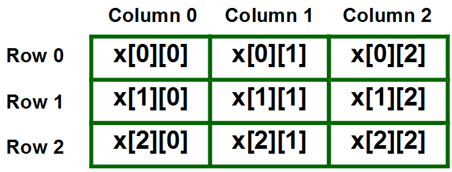

## Table of Contents

1. 배열(Array)
2. 배열 사용하기
3. 2차원 배열(2D Array)

---

## 1) 배열(Array)

* 배열
* 배열은 [참조 자료형](https://github.com/seungki1011/Data-Engineering/tree/main/java/(007)%20Reference%20Type)
* 동일 자료형의 데이터를 연속된 메모리 공간에 저장


* 배열은 선언과 동시에 고정된 크기를 가짐
  * 변경을 위해서는 새롭게 선언해야 함

<br>

<p align="center">    </p>

<p align='center'>https://tcpschool.com/c/c_array_twoDimensional</p>

<br>

---

## 2) 배열 사용해보기

* 배열 선언 : ```datatype[] variableName;```
  * 배열 변수에는 배열을 담을 수 있음
  * 배열을 선언한다는 것은 배열을 다루기 위한 참조 변수를 선언한다는 것
    * 참조 변수는 배열의 시작 주소를 가리킴

<br>

* 배열 생성: ```variableName = new datatype[arraySize];```
* 인덱스로 배열값 접근 가능
* ```arrayName.length```는 배열의 길이 반환
* 선언과 동시에 초기화하는 경우 ```dataType[] arrayName = {arrayValues, ..};``` 처럼 ```new dataType[]``` 생략 가능

<br>

[아래 코드](https://github.com/seungki1011/Data-Engineering/blob/main/java/start-java/src/main/java/de/java/array/arr1.java)

```java
public class arr1 {
    public static void main(String[] args) {
        // 1. 배열 선언
        int[] newArray = new int[3]; // int형 변수를 3개 담을 수 있는 배열 선언과 생성
      
        /*
        int[] newArray; (배열 변수 선언) - 배열을 다루기 위한 참조 변수 선언
        newArray = new int[3]; (배열 생성) - 실제 배열을 위한 메모리 공간 부여
         */
        System.out.println("배열 참조값: "+newArray);
        System.out.println("배열: "+Arrays.toString(newArray)); // int의 디폴트값인 0으로 채워진 배열

        // 2. 배열 선언 - 선언과 동시에 초기화
      	// int[] newArray2 = {400,421,534,212,2342}; 처럼 new int[] 생략 가능
        int[] newArray2 = new int[] {400,421,534,212,2342};
        for(int i = 0; i < 5; i++){
            System.out.println(i+"번 인덱스의 배열값: "+newArray2[i]);
        }

        String[] names = {"Andy", "Caillou", "Alex", "Shelby"};
        System.out.println(Arrays.toString(names));
    }
}
```

```
배열 참조값: [I@2a139a55
배열: [0, 0, 0]
0번 인덱스의 배열값: 400
1번 인덱스의 배열값: 421
2번 인덱스의 배열값: 534
3번 인덱스의 배열값: 212
4번 인덱스의 배열값: 2342
[Andy, Caillou, Alex, Shelby]
```

<br>

---

## 3) (2차원 배열)2D Array

* 2차원 배열
* 행과 열로 구성
* ```twodArray[행][열]```의 형태

<br>

<p align="center">    </p>

<p align='center'>https://www.geeksforgeeks.org/multidimensional-arrays-in-java/</p>

* 선언과 생성: ```dataType[][] arrayName = new dataType[numRow][numCol]```
* 초기화 예시: ```int[][] numArray = {{1,2,3}, {10,20,30}}```

<br>

[아래 코드](https://github.com/seungki1011/Data-Engineering/blob/main/java/start-java/src/main/java/de/java/array/arr2.java)

```java
public class arr2 {
    public static void main(String[] args) {
        // 1. 행이 2개, 열이 4개인 2차원 배열
        int[][] twodArray = new int[2][4];

        twodArray[0][0] = 30; // 0행 0열 (첫번째 행, 첫번째 열)
        twodArray[1][3] = 60; // 1행 3열 (두번째 행, 네번째 열)
        twodArray[1][2] = 22; // 1행 2열 (두번째 행, 세번째 열)

        for(int i = 0; i < twodArray.length; i++){
            for(int j = 0; j < twodArray[i].length; j++){
                System.out.print("twodArray["+i+"]["+j+"] = "+ twodArray[i][j]+" ");
            }
            System.out.println();
        }

        // 2. 초기화
        int[][] arr = {
                {0,20,30},
                {1,2,3}
        };
    }
}
```

```
twodArray[0][0] = 30 twodArray[0][1] = 0 twodArray[0][2] = 0 twodArray[0][3] = 0 
twodArray[1][0] = 0 twodArray[1][1] = 0 twodArray[1][2] = 22 twodArray[1][3] = 60 
```

<br>

---

## Further Reading

* 고정된 크기의 배열을 사용하는 어려움을 해결하기 위해 ```ArrayList``` 사용 - [참고](https://inpa.tistory.com/entry/JAVA-%E2%98%95-ArrayList-%EA%B5%AC%EC%A1%B0-%EC%82%AC%EC%9A%A9%EB%B2%95)

---


## Reference

1. [https://tcpschool.com/c/c_array_twoDimensional](https://tcpschool.com/c/c_array_twoDimensional)
1. [https://www.geeksforgeeks.org/multidimensional-arrays-in-java/](https://www.geeksforgeeks.org/multidimensional-arrays-in-java/)
1. [https://inpa.tistory.com/entry/JAVA-%E2%98%95-ArrayList-%EA%B5%AC%EC%A1%B0-%EC%82%AC%EC%9A%A9%EB%B2%95](https://inpa.tistory.com/entry/JAVA-%E2%98%95-ArrayList-%EA%B5%AC%EC%A1%B0-%EC%82%AC%EC%9A%A9%EB%B2%95)

