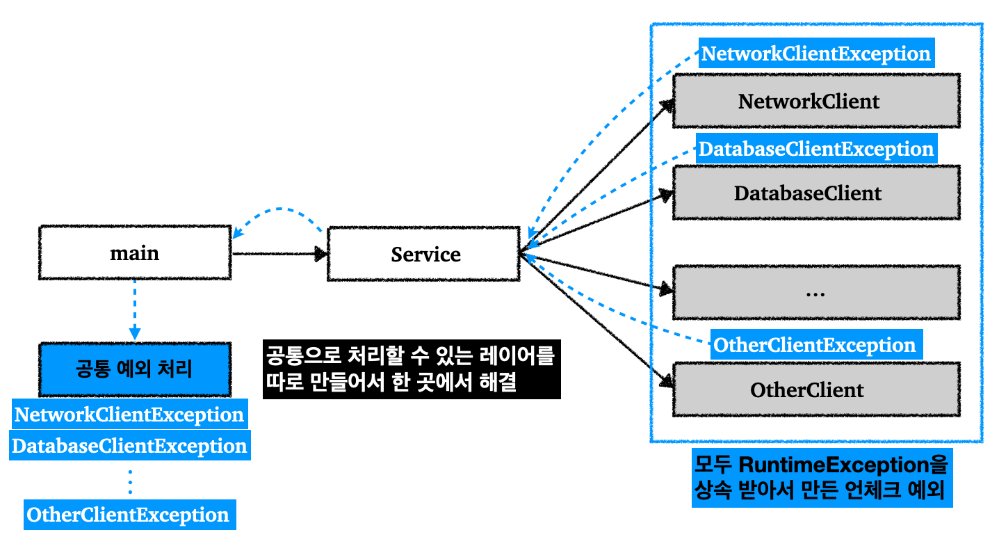

## Table of Contents

1. [Exception, Error](https://github.com/seungki1011/Data-Engineering/tree/main/java/(016)%20Exception#1-exception-error)
2. [Exception Handling](https://github.com/seungki1011/Data-Engineering/tree/main/java/(016)%20Exception#2-exception-handling)
3. [`e`(Exception Variable)](https://github.com/seungki1011/Data-Engineering/tree/main/java/(016)%20Exception#3-exception-variable)
4. [Multi Catch](https://github.com/seungki1011/Data-Engineering/tree/main/java/(016)%20Exception#4-multi-catch)
5. [`throw`](https://github.com/seungki1011/Data-Engineering/tree/main/java/(016)%20Exception#5-throw)
6. [Checked, Unchecked Exception](https://github.com/seungki1011/Data-Engineering/tree/main/java/(016)%20Exception#6-checked-unchecked-exception)
7. [`throws`](https://github.com/seungki1011/Data-Engineering/tree/main/java/(016)%20Exception#7-throws)
   * `throws` 소개
   * `throws`가 처리되는 과정
   * 예외 되던지기
8. [`try-catch-finally`](https://github.com/seungki1011/Data-Engineering/tree/main/java/(016)%20Exception#8-try-catch-finally)
9. [`try-catch-resource`](https://github.com/seungki1011/Data-Engineering/tree/main/java/(016)%20Exception#9-try-with-resource)
10. [사용자 정의 예외(User Defined Exception)](https://github.com/seungki1011/Data-Engineering/tree/main/java/(016)%20Exception#10-%EC%82%AC%EC%9A%A9%EC%9E%90-%EC%A0%95%EC%9D%98-%EC%98%88%EC%99%B8user-defined-exception)

---

## 1) 예외, 에러(Exception, Error)

### 1.1 예외(`Exception`) 소개

* 예외(`Exception`)는 개발자가 프로그램에서 구현한 코딩 로직의 실수 또는 사용자의 영향으로 발생한다


* 에러(`Error`)는 시스템이 종료되어야 할 수준의 상황과 같이 수습할 수 없는 심각한 문제 (보통 시스템 레벨에서 발생)
  * 대표적인 에러: ```OutOfMemoryError``` (Heap 내에 할당 받을 수 있는 최대 메모리 이상을 사용하는 경우 발생)
  * 에러를 잡으려하지 않아도 된다, 그러나 에러 상황을 어느 정도 예측할 줄은 알아야 함 


* 자바에서는 상속을 이용해서 예외를 표현한다

<br>

<p align="center">    </p>

<p align='center'>https://www.javacodemonk.com/java-exception-class-hierarchy-92e8224e</p>

* 모든 예외 클래스는 ```Throwable```의 자손
  * 상위 예외를 아래에서 다룰 `catch`로 잡아버리면, 그 하위 예외까지 잡아버리기 떄문에 `Throwable` 예외를 잡으려고 하면 안된다


* 예외의 종류는 실제로는 위 그림 보다 많음
* ```RuntimeException```(`Unchecked 예외`, `런타임 예외`)은 보통 개발자의 실수로 발생하는 예외
  * 컴파일러가 체크하지 않은 언체크 예외
  * 언체크 예외는 개발자가 명시적으로 처리하지 않아도 됨


* `Exception` (`RuntimeException` 제외)
  * 사용자의 사용과 같은 외적인 요인으로 발생하는 예외
  * `Exception` : 애플리케이션 로직에서 사용할 수 있는 최상위 예외
  * `RuntimeException`을 제외한 나머지 예외(`Checked 예외`) : 모두 컴파일러가 체크하는 체크 예외
  * 체크 예외는 개발자가 명시적으로 처리해야 한다(그렇지 않는 경우 컴파일 오류 발생)


* 사용자 정의 예외를 만들어서 사용할 수 있다
  * 기본적으로 자바에 미리 정의 되어 있는 예외를 사용한다
  * 그러나 특정 예외를 표현할 수 없거나, 특별한 목적이 있는 예외가 필요하다면 ```Throwable``` 또는 그 아래의 예외 클래스를 상속 받아서 사용자 정의 예외를 만들 수 있다
  * 예) 입출력 문제  → ```IOException``` 상속 받아서 정의
  * 예) 실행도중 발생하는 문제 → ```RuntimeException``` 상속 받아서 정의
  * 상황에 맞는 클래스를 상속 받아서 사용자 정의 예외를 구현하면 된다

<br>

---

### 1.1 예외 기본 규칙

예외를 다루는 것은 폭탈 돌리기와 똑같이 생각하면 된다. 만약 예외(폭탄)가 발생하면 잡아서 처리하거나, 처리할 수 없는 경우 다른 곳으로 던져야 한다.

예외 처리의 기본 규칙을 예시를 통해 알아보자.

<br>

<p align="center">    </p>

<p align="center">예외를 처리하는 경우</p>

<br>

<p align="center">    </p>

<p align="center">예외의 기본 규칙</p>

* 예외에 대한 2 가지 기본 규칙
  * 예외는 잡아서 처리하거나 밖으로 던져야 함
  * 예외를 잡거나 던질 때 지정한 예외뿐만 아니라 그 예외의 자식들도 함께 처리 가능
    * 예) `RuntimeException`을 `catch`로 잡는 경우, 그 하위 예외들도 모두 잡기 가능


* 예외를 처리하지 못하고 `main()` 밖으로 던지게 되면 예외 로그를 출력하면서 시스템이 종료된다

* 예외를 던지는 것은 뒤에서 설명할 `throws`를 통해서 할 수 있다(`throw`와 `throws`는 다름, 헷갈리지 말자)

<br>

---

## 2) 예외 발생시키기(```throw```)

* 예외 발생시키기
* 예외를 생성 후 ```throw``` 키워드를 이용해서 예외를 발생 시킬 수 있다

<br>

```java
public class ThrowMain {
    public static void main(String[] args) {

        try {
            // 예외의 객체 생성(예외 생성)
            Exception e = new Exception("고의 Exception(This is the message)"); // 예외의 detailMessage
            throw e; // throw로 예외 발생
            // throw new Exception("Exception was made(This is the message)"); // 한줄로 표현
        } catch (Exception e) {
            System.out.println("e.getMessage : "+e.getMessage());
        }
    }
}
```

```
e.getMessage : Exception was made(This is the message)
```

<br>

---

## 3) 예외 처리하기(`try-catch`)

### 3.1 `try-catch` 소개

* 예외 처리
* 프로그램 실행 시 발생할 수 있는 예외에 대비한 코드를 작성
* 예외 처리를 통해서 비정상 종료를 방지하고, 정상 실행 상태를 유지할 수 있도록 한다

<br>

```java
try {
	// 예외 발생 가능성이 있는 코드
} catch (Exception1 e) { // 변수는 'e', 'ex' 임의로 설정 가능
  
  // Exception1이 발생할 경우 처리하기 위한 로직
  
} catch (Exception2 e) {
  
  // Exception2가 발생할 경우 처리하기 위한 로직
  
}
// 이후 정상 실행 로직
```

```java
public class CatchMain {
    public static void main(String[] args) {

        // 1. Arithmetic Exception
        System.out.println(1);
      
        try {
            System.out.println(2/0); // 예외 가능성이 있는 코드
        } catch (ArithmeticException e) { // 0으로 나눌 시 발생
            System.out.println("--------------Exception1--------------");
            System.out.println("Arithmetic Exception has occurred.");
            System.out.println("-------------------------------------");
        }
      	
        System.out.println(3);
        System.out.println(4);

        // 2. ArrayIndexOutOfBounds Exception
        int[] array = {1, 2, 3, 4};

        try {
            System.out.println(array[4]); // 배열의 범위를 벗어난 경우 ArrayIndexOutOfBoundsException
        } catch (ArrayIndexOutOfBoundsException e) {
            System.out.println("--------------Exception2--------------");
            System.out.println("ArrayIndexOutOfBoundsException has occurred.");
            System.out.println("-------------------------------------");
        }

        // 3. try 블럭 내에 예외 발생 후 흐름
        try {
            System.out.println(1);
            System.out.println(0/0); // 여기서 예외 발생 -> 바로 catch 블럭으로 넘어감
            // 예외 발생 후 나머지 try 블럭 내의 코드는 실행되지 않음
            System.out.println(2); // 예외 발생 후 실행 x
            System.out.println(3); // 예외 발생 후 실행 x
        } catch (ArithmeticException e) {
            System.out.println("--------------Exception3--------------");
            System.out.println("Arithmetic Exception has occurred.");
            System.out.println("-------------------------------------");
        }
      
        System.out.println(4);
    }
}
```

```
1
--------------Exception1--------------
Arithmetic Exception has occurred.
-------------------------------------
3
4
--------------Exception2--------------
ArrayIndexOutOfBoundsException has occurred.
-------------------------------------
1
--------------Exception3--------------
Arithmetic Exception has occurred.
-------------------------------------
4
```

1. ```try``` 블럭 내의 코드에서 예외가 발생 
2.  ```catch```블럭으로 넘어가서 맞는 예외가 있는지 찾음 (남은 ```try```블럭의 코드는 실행하지 않고 넘어간다)
3. 맞는 예외가 있는 경우 ```catch``` 블럭의 로직 실행
4. 만약 맞는 예외가 없을 경우 예외 처리에 실패한다

<br>

---

### 3.2 예외 세분화

예외의 세분화(계층화)에 대해서 알아보자.

<br>

<p align="center">    </p>

<p align="center">예외 계층</p>

* 위의 그림 처럼 `NetworkClient`에서 발생하는 모든 예외는 `NetworkClientException`의 자손이다


* 단순히 `NetworkClientException`으로 처리하지 않고, `ConnectException`, `SendException` 등으로 예외를 세분화 해서 처리하면 어떤 장점이 있을까?
  * 예외 클래스를 각 예외 상황에 맞추어 만들었기 때문에, 각 예외 클래스에 대해 다르게 처리할 수 있다
  * 예) `ConnectException`은 연결이 실패한 `address` 출력
  * 예) `SendException`은 전송에 실패한 `sendData` 출력

<br>

만약 위의 상황을 코드로 구현한다면 다음과 비슷할 것이다.

<br>

```java
String address = "https://example.com";

NetworkClient client = new NetworkClient(address);
client.initError(data);

try {
  client.connect();
  client.send(data);
} catch (ConnectException e) {
  System.out.println("[연결 오류] 주소: " + e.getAddress() + ", 메시지: " + e.getMessage());
} catch (SendException e) {
  System.out.println("[전송 오류] 전송 데이터: " + e.getSendData() + ", 메시지: " + e.getMessage());
} catch (NetworkClientException e) {
  System.out.println("[네트워크 오류] 메시지: " + e.getMessage());
} catch (Exception e) {
  System.out.println("[알 수 없는 오류] 메시지: " + e.getMessage());
} finally { // finally는 뒤에서 자세히 알아볼 예정
  client.disconnect();
}
```

* `ConnectException`, `SendException`을 제외한 나머지 `NetworkClientException`을 잡을 수 있도록 바로 아래의 `catch`에 배치
* 그 이와의 예외를 잡을수 있도록 가장 아래에 `Exception`을 잡기
* 위의 코드에서 볼수 있듯이 특정 예외 상황에 맞춰 다르게 처리가 가능하다
  * 오류 코드로 예외를 파악하는 것이 아니라, 예외 그 자체로 예외를 파악할 수 있다

<br>

`catch`에서의 예외 배치에 대해 조금 더 자세히 알아보자.

<br>

```java
public class CatchMain2 {
    public static void main(String[] args) {
        int[] array = {1, 2, 3, 4, 5};

        // 1. Exception의 배치
        try {
            System.out.println(0);
            System.out.println(1);
            System.out.println(array[5]); // ArrayIndexOutOfBoundException이지만 그냥 Exception으로 처리할 예정
            // 어차피 위에서 예외가 발생하기 때문에 아래 코드는 실행되지 않는다
            System.out.println(5);
            System.out.println(0/0);
        } catch (ArithmeticException ae) {
            System.out.println("ArithmeticException 발생!");
          // 위의 catch 블럭에서 예외를 걸러내지 못해도 가장 아래에서 가장 상위인 Exception으로 예외를 처리
        } catch (Exception e) {
            System.out.println("Exception 발생!");
        }
        System.out.println("---------------------------");

        // 2. Exception을 가장 위에 배치하는 경우
        try {
            System.out.println(0);
            System.out.println(0/0); // ArithmeticException
            System.out.println(3);
        } catch (Exception e) { // Exception을 가장 상위에 배치하면 여기서 모든 예외가 처리되어 버린다
            System.out.println("Exception 발생!");
        }
        // 어차피 Exception을 가장 상위에 배치하는 경우, 더 낮은 계층의 Exception을 아래에 배치하면 컴파일 에러 발생
        // error: exception java.lang.ArithmeticException has already been caught
      
        // catch (ArithmeticException ae) { // 실제 발생한 것은 ArithmeticException이지만 위에서 걸러져버림
            // System.out.println("ArithmeticException 발생!");
        // }
    }
}
```

```
0
1
Exception 발생!
---------------------------
0
Exception 발생!
```

* 부모 ```exception```을 상위에 배치하면 ```exception```의 우선순위에 의해 해당 상위(부모) ```exception```이 예외를 처리해버릴 수 있음
  * 예)  가장 상위에 존재하는 ```Exception```을 제일 높은 ```catch```블럭에 배치하면 해당 ```catch``` 블럭에서 모든 예외가 처리되어서 예외 처리의 의미가 없어진다 (귀찮다면 그냥 저렇게 해도 되겠지만)


* 이런 예외의 우선 순위를 잘 생각해서 ```catch``` 블럭을 배치하자


<br>

---

### 3.3 멀티 `catch` (`|`)

`|`를 이용해서 여러 예외를 한번에 잡을 수 있다.

<br>

```java
try{
  // 예외 발생 가능성 있는 코드
}catch(ExceptionA | ExceptionB | ExceptionC e){
  
   e.parentMethod(); // 공통의 메서드만 사용가능
  
   /*
   필요한 경우 instanceof로 판단 후 캐스팅으로 다른 메서드 사용
   if(e instanceof ExceptionA) {
       ExceptionA a = (ExceptionA) e;
       a.methodA();
   }
   */
}
```

* ```|```를 이용해서 다수의 예외들이 공통으로 사용하는 로직을 하나의 블럭으로 연결 가능


* 이때 ```|```로 연결된 예외들은 상속 관계에 있으면 안됨
  * 공통된 조상의 멤버만 사용가능


* ```ExceptionA```, ```ExceptionB```, ```ExceptionC``` 가 있다고 가정할때 ```ExceptionA```에만 존재하는 ```methodA```를 사용하는 것은 안됨
  * 멀티 캐치 블럭 내에서 ```methodA```를 사용해야하는 겨우면 ```instanceof```로 인스턴스를 판별해서 사용
  * 보통 예외 별로 다른 처리가 필요한 경우 그냥 보통 사용하던 ```catch```문 여러개를 사용하는 것을 권장


* 쉽게 말해서 `instanceOf`를 사용해서 특정 예외에 대한 로직만 수행하도록 조건문 처리를 할 수 있다

<br>

---

## 4) 예외 객체 참조 변수(Exception Variable)

* 통상적으로 ```e```, `ex`를 많이 사용
* 예외 객체의 참조 변수
* ```e```의 스코프는 해당 예외의 ```catch``` 블럭내
* ```e```를 이용해서 예외에 대한 정보를 확인하거나 여러가지 상호작용을 할 수 있음
  * 예) `printStackTrace()`, `getMessage()` ...

<br>

```java
public class ExceptionVarMain {
    public static void main(String[] args) {
      
        // 1. getMessage() 사용 - e의 detailMessage 출력 (디버깅으로 확인해보면 알 수 있음)
        System.out.println("-------------------------------------");
        System.out.println(0);
        System.out.println(1);
      
        try {
            System.out.println(0/0);
        } catch (ArithmeticException e) {
            System.out.println("e.getMessage() : "+ e.getMessage());
        } catch (Exception e) {
            System.out.println("e.getMessage() : "+ e.getMessage());
        }
      
        System.out.println("-------------------------------------");
      
        // 2. printStackTrace() 사용 - 발생한 예외 메세지를 보여줌
        try {
            System.out.println(0/0);
        } catch (ArithmeticException e) {
            e.printStackTrace(); // 에러 메세지를 그대로 보여줌. 보안상 이런 메세지는 보여주지 말고 따로 로깅해서 확인해야함
        } catch (Exception e) {
            System.out.println("e.getMessage() : "+ e.getMessage());
        }
        System.out.println("-------------------------------------");
        System.out.println("Remaining Code");
    }
}
```

```
-------------------------------------
0
1
e.getMessage() : / by zero
-------------------------------------
-------------------------------------
Remaining Code

java.lang.ArithmeticException: / by zero
	at de.java.exception.ExceptionMain3.main(ExceptionMain3.java:19)
```

* 예외 발생시 인스턴스가 생성되는데, 발생한 예외에 대한 정보들이 담겨 있음
  * 여러가지 메서드를 통해서 정보에 접근 가능


* ```getMessage()``` : 발생한 예외의 인스턴스에 저장된 ```detailMessage```를 얻을 수 있음
* ```printStackTrace()``` : 예외 발생 당시 콜 스택에 있었던 메서드 정보와 예외 메세지를 출력
  * 예외가 던져진 경로 파악 가능

<br>

---

## 5) 예외 던지기(`throws`)

### 5.1 `throws` 소개

* 예외를 호출자로 떠넘길 수 있음
  * 메서드가 호출시 발생가능한 예외를 호출하는 쪽에 예외를 던질 수 있음


* ```throws```가 붙은 메서드는 반드시 ```try``` 블럭내에 호출되어야 함
* 이전 [예외의 기본 규칙]()에서 예외를 던지는 것을 기억하자

<br>

```java
void method() throws ExceptionA, ExceptionB {
  // method 
}
```

* ```method()```를 사용하는 경우 ```ExceptionA```, ```ExceptionB``` 발생 가능 → 호출하는 쪽에서 ```ExceptionA```, ```ExceptionB```에 대한 예외 처리 → 호출하는 쪽에서 ```throws```를 다시 사용해서 또 떠넘기는 것도 가능


* `throws`에 지정한 타입과 그 하위 타입 예외를 밖으로 던진다
  * 예) 만약 `ExceptionA`의 자손이 `ExceptionC` 라면, `ExceptionC`까지 던질 수 있음
  * 그래서 만약 `ExcpetionC`만 정확하게 던지고 싶다면, `ExceptionA`를 던져서 `ExceptionC`를 처리하는 것이 아니라 그냥 `ExceptionC`만을 던져야 한다

<br>

---

### 5.2 `throws`가 처리되는 과정

이전의 [예외의 기본 규칙]()에서 설명했던 과정을 다른 예시로 한번 더 살펴보자.

<br>

```java
public class ThrowsnMain {
    public static void main(String[] args) { // main에서 throws Exception 하면 JVM으로 넘김
        try {
            System.out.println("Called method1");
            method1(); // main()에서 method1() 호출
        } catch (Exception e) {
            System.out.println("Handled Exception in main"); // main에서 예외를 처리
        }
    }
    static void method1() throws Exception { // 호출한 main()으로 예외 던지기
        System.out.println("method1 calls method2");
        method2();
    }
    static void method2() throws Exception{ // 호출한 method1()으로 예외 던지기
        System.out.println("Exception is made in method2");
        throw new Exception(); // 예외 발생
    }
}
```

```
Called method1
method1 calls method2
Exception is made in method2
Handled Exception in main
```

<br>

<p align="center">    </p>

* ```main```에서 ```method1``` 호출 → ```method1```에서 ```method2``` 호출 → ```method2```에서 예외 발생 → ```method2```에서 발생한 예외를 호출자로 던짐(이 경우 ```method1```) → ```method1```에서 예외를 호출자로 던짐(이 경우 ```main```)
* ```main```에서 ```try-catch```로 예외 처리를 함
* 만약 ```main```에서 예외 처리를 안하고 ```throws Exception```을 하는 경우 JVM으로 예외를 던짐 → JVM의 예외 처리기 예외 처리 진행


* 위의 예시에서는 예외를 던지는 과정을 보여주고 싶어서 이렇게 예외를 던진것이지,  ```main```에서 예외 처리를 하는 것이 좋다는게 아님!
* 상황에 따라 어디에서 예외 처리를 진행할지 판단하면 됨

<br>

---

## 6) Checked, Unchecked 예외

### 6.1 체크, 언체크 예외 소개

* Checked Exception(체크드 예외) : 컴파일러가 예외 처리 여부를 체크 함
  * 예외 처리가 필수 (```try-catch```, 또는 `throws` 필수)
  * ```Exception```과 자손

<br>

* Unchecked Exception(언체크드 예외, 런타임 예외) : 컴파일러가 예외 처리 여부를 체크 하지 않음
  * 예외 처리는 선택
  * ```RuntimeException```과 자손

<br>

<p align="center">    </p>

<p align="center">예외 분류</p>

<br>

---

### 6.2 체크 예외

체크 예외에서 예외를 던지는 과정을 다시 한번 더 살펴보자. (이전의 [예외 기본 규칙](), [`throws`가 처리되는 과정]()과 내용이 상당수 겹칠 수 있다)

<br>

<p align="center">    </p>

<p align="center">체크 예외(Checked Exception)</p>

* 체크 예외의 핵심은 예외를 무조건 `catch`로 잡아서 처리하거나, `throws`로 예외를 던져야 한다는 것이다
  * 그렇지 않으면 컴파일 오류가 발생한다


* `Exception`을 상속 받은 예외는 체크 예외가 된다(`RuntimeException` 제외)


* 위의 그림에서는 `Service`에서 `catch`로 예외를 잡아서 처리했기 때문에 `main()` 까지 예외가 올라오지 않는다
  * 만약 `Service`에서 처리하지 않았다면 `throws`로 `main()`으로 던져야 한다
  * `main()`에서도 잡아서 처리하지 못하면, `main()` 밖으로 예외가 던져지고 프로그램이 종료된다, 이때 스택 트레이스(stack trace)를 출력한다


* 체크 예외의 단점은 개발자가 모든 체크 예외를 반드시 잡거나 던지도록 처리해야 하기 때문에, 너무 번거로운 일이 된다
  * 신경쓰고 싶지 않은 자잘한 예외까지 모두 챙겨야 한다
  * 사실 실무에서 체크 예외가 사용되는 일은 많지 않다

<br>

---

### 6.3 언체크 예외(런타임 예외)

* `RuntimeException` 과 그 하위 예외는 언체크 예외로 분류된다
* 언체크 예외는 체크 예외와 기본적으로 동일하다
  * 차이는 언체크 예외는 예외를 던지는 `throws` 를 선언하지 않고, 생략할 수 있다
  * 생략한 경우 자동으로 예외를 던진다
  * 쉽게 말해서 언체크 예외는 예외를 잡아서 처리하지 않아도 `throws` 키워드를 생략할 수 있다


* 언체크 예외도 체크 예외 처럼 예외를 잡아서 처리 할 수 있다
* 언체크 예외는 `throws`를 선언하는 것도 가능하다
  * 생략 가능하지만, 중요한 예외의 경우 명시적으로 선언하는 경우도 존재한다. 물론 이 경우, 단지 정보를 제공하는 역할을 할 뿐이다


* 언체크 예외의 장점은 신경쓰고 싶지 않은 언체크 예외를 무시할 수 있다
  * 체크 예외의 경우 처리할 수 없는 예외를 밖으로 던지려면 항상 `throws 예외`를 선언해야 하지만, 언체크 예외는 이 부분을 생략할 수 있다

<br>

---

## 7) ```try-catch-finally```

`finally`에 대해서 알아보자.

<br>

```java
try {
//정상 흐름
} catch { 
  //예외 흐름 
} finally {
	//반드시 호출해야 하는 마무리 흐름 
}
```

* 예외 발생 여부와 관계없이 항상 수행되어야 하는 코드를 ```finally``` 블럭에 넣는다
* 예외가 발생하지 않는다면 ```try```→ ```finally``` 순으로 실행
* `try`를 시작하기만 하면, `finally`는 어떤 경우라도 반드시 호출된다
  * 여기에는 `try-catch`로 잡을 수 없는 예외가 발생하는 상황도 포함된다

<br>

`catch` 없이 `try-finally` 만 사용하는 경우도 알아보자.

```java
try {
     client.connect();
     client.send(data);
 } finally {
     client.disconnect();
}
```

* 예외를 직접 잡아서 처리할 일이 없다면 이렇게 사용하면 된다
* 이렇게 하면 예외를 밖으로 던지는 경우에도 `finally` 호출이 보장된다

<br>

예시를 통해 사용법을 알아보자.

<br>

```java
public class FinallyMain {
    public static void main(String[] args) {
        FileWriter f = null;

        try {
            f = new FileWriter("data.txt");
            System.out.println("Writing data to data.txt!");
            f.write("Hello World!");
            // f.close(); // 위에서 예외가 발생하면 close가 실행되지 않는 문제가 발생
            // -> close를 finally에서 실행하도록 함
        } catch (IOException e) {
            System.out.println("Handle IOException : "+e.getMessage());
        } finally {
            System.out.println("[finally block] 아래 코드는 항상 실행");
            if(f != null) { // f가 null이 아니라면
                try {
                    f.close();
                } catch (IOException e) {
                    System.out.println("Handle IOException(for f.close()) : "+e.getMessage());
                }
            } else {
                System.out.println("f is null");
            }
        }
    }
}
```

```
Writing data to data.txt!
[finally block] 아래 코드는 항상 실행
```

<br>

---

## 8) ```try-with-resource```

### 8.1 `try-with-resource` 소개

애플리케이션에서 외부 자원을 사용하는 경우 반드시 외부 자원을 해제해야 한다(리소스 누수, 등의 문제 방지). 이를 해결하기 위해서 `finally` 구문으로 자원 할당을 해제하는 방식으로 코드를 구현했다. `try`에서 외부 자원을 이용하고, `finally`로 외부 자원을 반납하는 패턴이 자주 사용되면서, 자바7 부터 `try-with-resources`라는 편의 기능이 도입되었다.

<br>

* `try-with-resources`는 리소스 작업을 포함하는 경우 예외 처리를 도와줌
* 기존에는 자원 반납이나 해제를 위해서 `finally`에 명시적으로 반납하는 코드를 사용했음( `close()`, `disconnect()`, 등)
  * 이로 인해 코드가 복잡해지는 경향이 있었음


* `try-with-resources`라는 기능은 `try`문 안에서만 사용되는 자원을 ```try-catch```가 끝나면 자동으로 닫을 수 있도록 함
  * ```try```문을 벗어나는 순간 자동으로 ```close()``` 호출


* 이 기능을 사용하기 위해서는 `AutoCloseable` 인터페이스를 구현해야 한다

```java
public interface AutoCloseable {
     void close() throws Exception;
}
```

* 이 인터페이스를 구현하면,  `try`가 끝나는 시점에 `close()`가 자동으로 호출된다

<br>

---

### 8.2 사용 예시 1

코드를 통해 더 자세히 알아보자.

```java
public class NetworkClientV implements AutoCloseable { // AutoCloseable 구현

    private final String address;
    public boolean connectError;
    public boolean sendError;

    public NetworkClientV(String address) {
        this.address = address;
    }

    public void connect() {
        if (connectError) {
            throw new ConnectExceptionV4(address, address + " 서버 연결 실패");
        }
        //연결 성공
        System.out.println(address + " 서버 연결 성공");
    }

    public void send(String data) {
        if (sendError) {
            throw new SendExceptionV4(data, address + " 서버에 데이터 전송 실패: " + data);
            //throw new RuntimeException("ex");
        }
        //전송 성공
        System.out.println(address + " 서버에 데이터 전송: " + data);
    }

    public void disconnect() {
        System.out.println(address + " 서버 연결 해제");
    }

    public void initError(String data) {
        if (data.contains("error1")) {
            connectError = true;
        }
        if (data.contains("error2")) {
            sendError = true;
        }
    }

    @Override // AutoCloseable의 close() 구현
    public void close() {
        System.out.println("NetworkClient.close");
        disconnect(); // 자원 해제
    }
}
```

* `try-with-resources` 기능을 사용하기 위해서 `AutoCloseable`을 구현하고 있다


* `close()`
  * `AutoCloseable` 인터페이스가 제공하는 이 메서드는 `try`가 끝나면 자동으로 호출된다
  * 자원을 반납하는 로직을 여기에 작성하면 된다

<br>

```java
public class NetworkService {

    public void sendMessage(String data) {
        String address = "http://example.com";

        try (NetworkClient client = new NetworkClient(address)) {
            client.initError(data); //추가
            client.connect();
            client.send(data);
        } catch (Exception e) {
            System.out.println("[예외 확인]: " + e.getMessage());
            throw e;
        }
    }
```

* `try()` 괄호안에 사용할 자원을 명시한다
  * 위의 예시에서는 `NetworkClient client = new NetworkClient(address)`를 명시하고 있음
  * 리소스로 사용되는 `client` 변수의 스코프가 `try` 블럭안으로 한정된다 (유지보수가 더 쉬워짐)


* 이 자원은 `try` 블럭이 끝나면 자동으로 `AutoCloseable.close()` 를 호출해서 자원을 해제한다


*  `catch` 블럭 없이 `try` 블럭만 있어도 `close()` 는 호출된다


* 여기서 `catch` 블럭은 단순히 발생한 예외를 잡아서 예외 메시지를 출력하고, 잡은 예외를 `throw` 를 사용해서 다시 밖으로 던진다

<br>

---

### 8.3 사용 예시 2

<br>

```java
public class ResourceMain2 {
    public static void main(String[] args) {
        try (FileWriter f = new FileWriter("Data2.txt")) {
            System.out.println("Writing data to Data2.txt!");
            f.write("Hello World2!");
        } catch (IOException e) {
            e.printStackTrace();
        }
    }
}
```

```
Writing data to Data2.txt!
```

* ```FileWriter```는 ```AutoClosable``` 인터페이스를 가짐
  * [https://docs.oracle.com/javase/8/docs/api/java/io/FileWriter.html](https://docs.oracle.com/javase/8/docs/api/java/io/FileWriter.html)
  * [https://docs.oracle.com/javase/8/docs/api/java/lang/AutoCloseable.html](https://docs.oracle.com/javase/8/docs/api/java/lang/AutoCloseable.html)
  * 이미 `close()`가 구현되어 있음!

<br>

---

## 9) 체크 예외를 잘 사용하지 않는 이유

### 9.1 체크 예외(Checked Exception)의 단점

예외 중에서는 처리해도 소용이 없는 예외들이 존재한다.

* 상대 네트워크 서버에 문제가 생겨 통신이 불가능
* 데이터베이스 서버에 문제가 발생해서 접속이 불가능
* 기타 연결 오류

<br>

위와 같이 시스템의 오류 때문에 발생하는 예외들은 대부분 예외를 잡아도 해결할 수 있는 것이 아니다.

이런 경우에는 고객에게 시스템에 문제가 있다는 오류 메세지를 보여주거나, 웹이라면 오류 페이지를 보여주면 된다. 그리고 개발자가 문제를 빠르게 파악할 수 있도록, 오류에 대한 로그를 남겨줘야한다.

<br>

체크 예외의 문제점은, 체크 예외를 무조건 `catch`로 잡아서 처리하거나, `throws`로 예외를 던져야 한다는 것이다. 앞에서 설명했던 것 처럼, 처리할 수 없는 예외들이 많아지고, 프로그램이 복잡해지면서 체크 예외의 사용이 점점 힘들어지기 시작했다.

체크 예외를 사용하는 상황을 그림으로 살펴보자.

<br>

<p align="center">    </p>

<p align="center">예외 처리 지옥</p>

* 애플리케이션을 개발하면서 수 많은 라이브러리를 사용하고, 다양한 외부 시스템과 연결된다

* 만약 모든 예외가 체크예외로 만들어져서 전달된다면 위의 그림 모든 예외를 `Service`에서 처리하거나 밖으로 던져야 한다

* 앞에서도 설명했듯이, 네트워크나 데이터베이스 서버 관련 문제는 `Service`에서 예외를 잡아도 해결을 할 수 없다

* 처리 할 수 없기 때문에 전부 밖으로 던져야 한다

  * ```java
    class Service {
      void sendMessage(String data) throws NetworkException, DatabaseException, ... OtherException {
        // ...
      } 
    }
    ```

  * 이걸 다 적는 것은 사실상 개발을 포기하겠다는 것이나 마찬가지

  * 만약 이 예외들을 던져야 하는 계층이 더 많다면? 전부다 `throws`로 던지고 있어야 함

  * 그렇다고 `throws Exception`으로 다 던져버리는 것은 최악의 판단

<br>

---

### 9.2 언체크 예외(Unchecked Exception, 런타임 예외)의 활용

그러면 언체크 예외를 사용해서 어떤식으로 예외를 처리할까?

다음 그림을 살펴보자.

<br>

<p align="center">    </p>

<p align="center">언체크 예외, 공통 예외 처리</p>

* 호출하는 클래스들이 언체크 예외(`RuntimeException` 상속)를 전달한다고 가정
* 잡아도 해결할 수 없는 예외들은 그냥 무시해도 된다
  * 언체크 예외는 `throws`를 선언하지 않아도 됨


* 예외를 잡아서 처리할 수 있다면, 그 때 잡아서 처리하면 됨
* 언체크 예외는 잡지 않으면 `throws` 선언 없이도 호출자 쪽으로 던져짐


* 처리할 수 없는 예외들을 중간 여러곳에서 나누어서 처리하는 것 보다, 예외를 공통으로 처리할 수 있는 레이어를 만들어서 한 곳에서 해결하는 것이 좋다
  * 해결할 수 없는 예외들이기 때문에, 고객들에게는 시스템에 문제가 발생했다고 메세지를 보여주거나 오류 페이지를 보여주면 됨
  * 개발자의 경우, 빠르게 문제를 파악할 수 있도록 오류에 대한 로그를 남기면 됨
  * 위와 같은 부분들은 공통 처리가 가능함

<br>

코드를 통해서 더 자세히 알아보자.

<br>

```java
```


---

## Further Reading

* 트랜잭션 내의 예외 처리
* 연결된 예외 (chained exception)

<br>

---

## Reference

1. [생활코딩 - 자바 예외](https://www.youtube.com/watch?v=2CgnJZ5oWYs&list=PLuHgQVnccGMCrFJLxpjhE0N5tvOVxJuVB&index=2)
1. [점프 투 자바 - 예외 처리](https://wikidocs.net/229)
1. [https://www.javacodemonk.com/java-exception-class-hierarchy-92e8224e](https://www.javacodemonk.com/java-exception-class-hierarchy-92e8224e)
1. [https://medium.com/javarevisited/checked-and-unchecked-exceptions-in-java-19166e68b66f](https://medium.com/javarevisited/checked-and-unchecked-exceptions-in-java-19166e68b66f)
1. [https://www.iitk.ac.in/esc101/05Aug/tutorial/essential/exceptions/definition.html](https://www.iitk.ac.in/esc101/05Aug/tutorial/essential/exceptions/definition.html)

