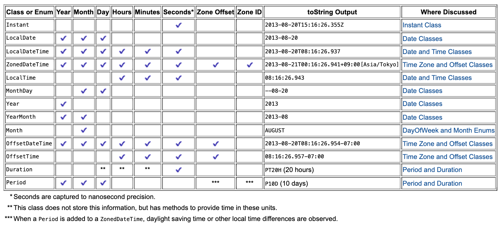
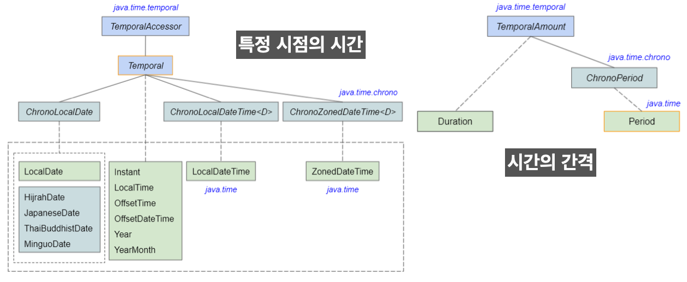
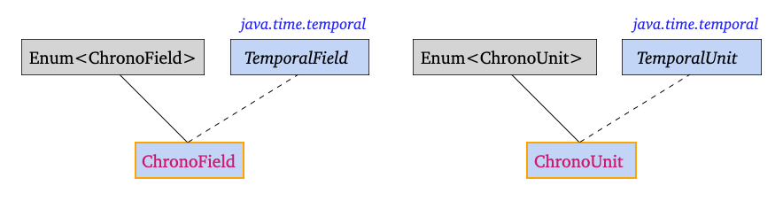
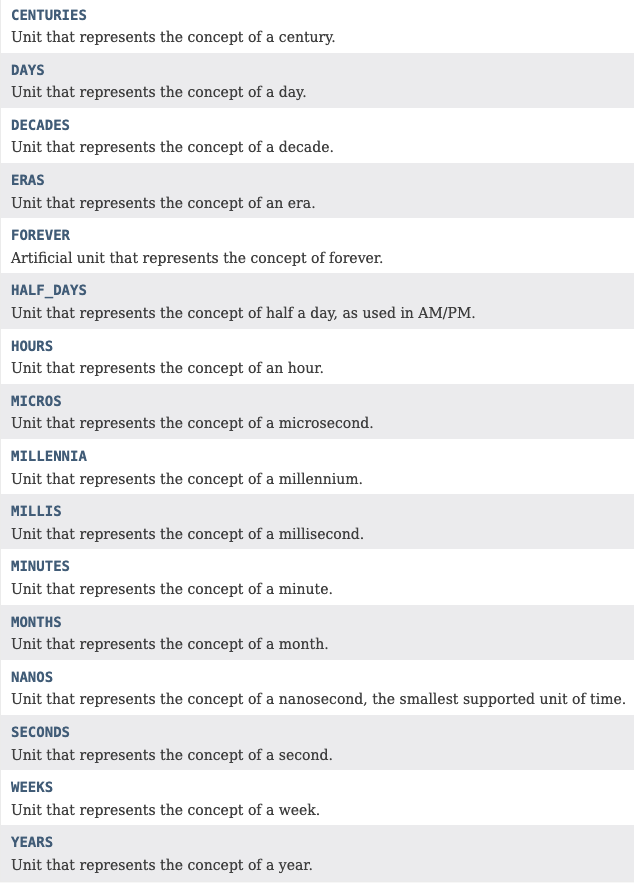
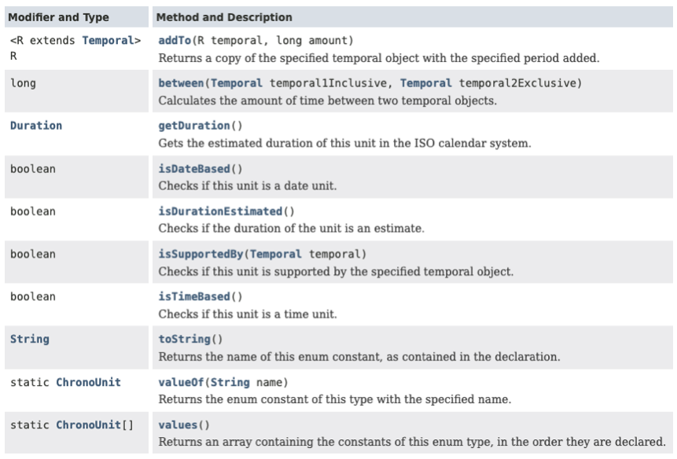
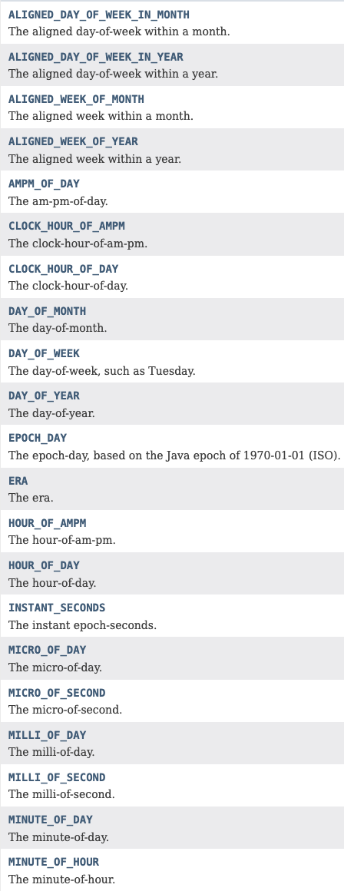
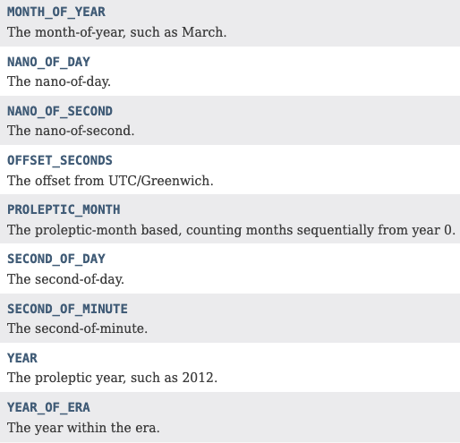
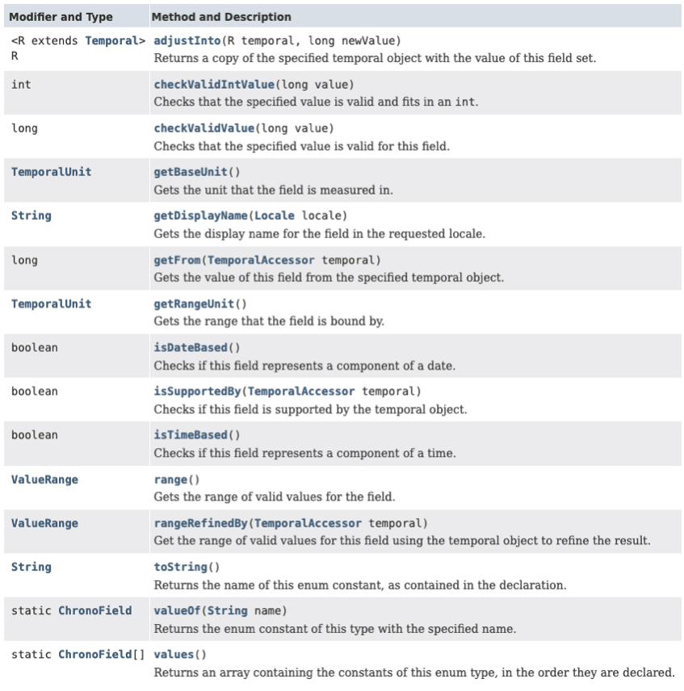

## Table of Contents

1. [날짜와 시간 라이브러리](https://github.com/seungki1011/Data-Engineering/tree/main/java/(017)%20Date%20and%20Time#1-%EB%82%A0%EC%A7%9C%EC%99%80-%EC%8B%9C%EA%B0%84-%EB%9D%BC%EC%9D%B4%EB%B8%8C%EB%9F%AC%EB%A6%AC)
   * 날짜와 시간의 계산
   * [날짜와 시간 라이브러리 소개](https://github.com/seungki1011/Data-Engineering/tree/main/java/(017)%20Date%20and%20Time#12-%EB%82%A0%EC%A7%9C%EC%99%80-%EC%8B%9C%EA%B0%84-%EB%9D%BC%EC%9D%B4%EB%B8%8C%EB%9F%AC%EB%A6%AC-%EC%86%8C%EA%B0%9C)
     * `java.util.Date`
     * `java.util.Calendar`
     * `java.time`
2. [`java.time` package]()
   * `LocalDate`
   * `LocalTime`
   * [`LocalDateTime`](https://github.com/seungki1011/Data-Engineering/tree/main/java/(017)%20Date%20and%20Time#23-localdatetime)
   * [`ZonedDateTime`](https://github.com/seungki1011/Data-Engineering/tree/main/java/(017)%20Date%20and%20Time#24-zoneddatetime)
     * `ZoneId`
     * `ZonedDateTime`
   * `OffsetDateTime`
   * [`Period`, `Duration`](https://github.com/seungki1011/Data-Engineering/tree/main/java/(017)%20Date%20and%20Time#26-period-duration)
   * [`Instant`](https://github.com/seungki1011/Data-Engineering/tree/main/java/(017)%20Date%20and%20Time#27-instant)
3. [ `TemporalAccessor`, `TemporalAmount`, `ChronoUnit`](https://github.com/seungki1011/Data-Engineering/tree/main/java/(017)%20Date%20and%20Time#3-temporalaccessor-temporalamount-chronounit)
   *  `TemporalAccessor`, `TemporalAmount`
   * [`ChronoUnit`, `ChronoField`](https://github.com/seungki1011/Data-Engineering/tree/main/java/(017)%20Date%20and%20Time#32-chronounit-chronofield)
     * `ChronoUnit`
     * `ChronoField`
4. [날짜와 시간 조회, 조작하기](https://github.com/seungki1011/Data-Engineering/tree/main/java/(017)%20Date%20and%20Time#4-%EB%82%A0%EC%A7%9C%EC%99%80-%EC%8B%9C%EA%B0%84-%EC%A1%B0%ED%9A%8C-%EC%A1%B0%EC%9E%91%ED%95%98%EA%B8%B0)
   * 조회하기
   * 조작하기
   * `with()`
5. [`Formatter`](https://github.com/seungki1011/Data-Engineering/tree/main/java/(017)%20Date%20and%20Time#5-formatter)

---

## 1) 날짜와 시간 라이브러리

### 1.1 날짜와 시간의 계산

날짜와 시간을 계산할때 다음과 같이 고려할 요소들이 많다.

* 윤년(leap year) 계산


* [일광 절약 시간(DST)](https://ko.wikipedia.org/wiki/%EC%9D%BC%EA%B4%91_%EC%A0%88%EC%95%BD_%EC%8B%9C%EA%B0%84%EC%A0%9C) 변환


* 다양한 타임존(Timezone) 계산


> 타임존(Timezone)
>
> * GMT(그리니치 평균시, Greenwich Mean Time)
>
> 
>
> * UTC(협정 세계시, Universal Time Coordinated)
>   * 역사적으로 GMT가 국제적인 시간 표준으로 사용되었고, UTC가 나중에 이를 대체하기 위해 도입되었다
>   * UTC는 원자 시계를 사용하여 측정한 국제적으로 합의된 시간 체계
>   * 대부분 UTC 사용
>
> 
>
> * Asia/Seoul +09:00
> * Europe/London
> * 기타 여러 타임존
>
> <br>
>
> 타임존 차이 예시
>
> * 서울(UTC+9)과 베를린(UTC+1) 사이의 타임존 차이는 8시간. 서울이 9시면 베를린이 1시.
> * DST 적용시 타임존 차이가 변할 수 있음

<br>

정리하자면 여러가지 복잡한 요인 때문에 날짜와 시간을 처리해서 제공해주는 라이브러리가 필요하다.

<br>

---

### 1.2 날짜와 시간 라이브러리 소개

여러 날짜와 시간 라이브러리들의 소개.

<br>

#### 1.2.1 `java.util.Date`

* 날짜와 시간을 다루기 위한 클래스


* Deprecated
  * 불변이 아님(mutable)
    * 사이드 이펙트 문제
  * Thread-safe 하지 않음(multi-thread 환경에서 이슈가 생길 수 있음)
  * 타입 안정성이 없음
  * Timezone 적용이 어려움


* ```java.time``` 패키지 사용이 권장 되지만, ```Date```를 사용하는 레거시 코드가 아직도 있음

<br>

```java
public class DateMain {
    public static void main(String[] args) {

        Date date = new Date();
        System.out.println("new Date() = "+date); // 현재 시간

        // Epoch Time 기준으로 1 millisecond가 지남
        System.out.println("new Date(1) = " + (new Date(1)));

        // Epoch Time 기준으로 1 second가 지남
        System.out.println("new Date(1000) = "+(new Date(1000)));

        // 현재 시간 (date)이 Epoch Time 기준 1초 지난 시점 보다 이후가 맞기 때문에 -> true 반환
        System.out.println("new Date().after(new Date(1000)) = " + date.after(new Date(1000)));

        // 현재 시간(피연산자)이 파라미터로 넘긴 시간 보다 이후면 >0, 같으면 =1, 이전이면 <0
        System.out.println("new Date().compareTo(new Date(1000)) = " + new Date().compareTo(new Date(1000)));
        System.out.println("new Date(1000).compareTo(new Date()) = " + new Date(1000).compareTo(new Date()));
        
    }
}
```

```
new Date() = Sun Jan 14 17:03:30 KST 2024
new Date(1) = Thu Jan 01 09:00:00 KST 1970
new Date(1000) = Thu Jan 01 09:00:01 KST 1970
new Date().after(new Date(1000)) = true
new Date().compareTo(new Date(1000)) = 1
new Date(1000).compareTo(new Date()) = -1
```

<br>

---

#### 1.2.2 `java.util.Calendar`

* ```Date```를 개선한 클래스
  * 타임존 지원 개선


* 추상 클래스임
  * ```Calendar calendar = Calendar.getInstance();```와 같이 사용해야 함


* Deprecated
  * 불변이 아님(mutable)
    * 사이드 이펙트 문제
  * Thread-safe 하지 않음(multi-thread 환경에서 이슈가 생길 수 있음)
  * 타입 안정성이 없음
  * 일부 사례에서 성능 저하 문제가 있음


* ```java.time``` 패키지 사용이 권장 되지만, ```Calendar```를 사용하는 레거시 코드가 아직도 있음

<br>

```java
public class CalendarMain {
    public static void main(String[] args) {
        // 1. get()으로 필드 가져오기
        // Calendar는 추상 클래스, 일반 클래스 처럼 인스턴스 생성 불가
        System.out.println("------------using get------------");
        Calendar calendar = Calendar.getInstance(); // Set to current date and time

        int currentYear = calendar.get(Calendar.YEAR); // Current Year
        int currentMonth = calendar.get(Calendar.MONTH) + 1; // Current Month (zero based calendar)
        int dayOfMonth = calendar.get(Calendar.DAY_OF_MONTH);

        Date currentDateTime = calendar.getTime();

        System.out.println("몇 년: " + currentYear);
        System.out.println("몇 월:" + currentMonth);
        System.out.println("몇 일: " + dayOfMonth);

        System.out.println("getTime(): "+currentDateTime);

        // 2. set()으로 날짜와 시간 지정
        System.out.println("------------using set------------");
        Calendar date = Calendar.getInstance();
        date.set(2024, 0, 1); // 2024년 1(Jan)월 1알 로 설정 (Month는 0 부터 시작)
        System.out.println("date.set(2024, 0, 1): "+date.getTime());
        date.set(Calendar.YEAR, 2026); // 년을 2026으로 설정
        System.out.println("date.set(Calendar.YEAR, 2026): "+date.getTime());

        // 3. 필드 초기화
        System.out.println("------------using clear------------");
        date.clear(); // 1970-1-1 00:00:00(Epoch Time) 으로 초기화
        System.out.println("date.getTime() after date.clear(): "+date.getTime());
    }
}
```

```
------------using get------------
몇 년: 2024
몇 월:1
몇 일: 14
getTime(): Sun Jan 14 02:00:19 KST 2024
------------using set------------
date.set(2024, 0, 1): Mon Jan 01 02:00:19 KST 2024
date.set(Calendar.YEAR, 2026): Thu Jan 01 02:00:19 KST 2026
------------using clear------------
date.getTime() after date.clear(): Thu Jan 01 00:00:00 KST 1970
```

<br>

---

#### 1.2.3 `java.time`

* 기존의 외부 라이브러리인 `Joda-Time`을 가져와서 Java8에서 표준 API로 도입


* 기존의 ```Date```와 ```Calender```의 단점 개선
  * 불변(immutable)
  * 타입 안전(type-safe) 함
  * 스레드 안정성 보장


* `LocalDate` , `LocalTime` , `LocalDateTime` , `ZonedDateTime` , `Instant` 등의 클래스를 포함한다


* 레거시 프로젝트가 아닌 이상,  날짜 시간 계산은 `java.time`을 사용하면 됨

<br>

<p align="center">    </p>

<p align='center'>java.time overview</p>

* [https://docs.oracle.com/javase/tutorial/datetime/iso/overview.html](https://docs.oracle.com/javase/tutorial/datetime/iso/overview.html)
* `*` : 초는 나노초 단위의 정밀도로 캡처된다 (밀리초, 나노초 가능)
* `**` : 이 클래스는 이 정보를 저장하지는 않지만 이러한 단위로 시간을 제공하는 메서드가 있다
* `***` : `ZonedDateTime`에 `Period`를 추가하면 서머타임 또는 기타 현지 시간 차이를 준수한다

<br>

---

## 2) ```java.time``` 패키지

`java.time` 패키지의 특징을 다시 살펴보자.

* 기존의 ```Date```와 ```Calender```의 단점 개선
  * 불변(immutable)
  * 타입 안전(type-safe) 함
  * 스레드 안정성 보장

<br>

`java.time`이 제공하는 각 클래스에 대해 자세히 알아보자.

> 시간과 날짜를 계산하는 방법은 여러가지가 있음. 여러 방법을 찾아보면서 적용해보면서 차이를 알아가면 됨.

<br>

---

### 2.1 ```LocalDate```

* 시간 없이 Year-Month-Day를 다루기 위한 클래스
  * 예) `2024-01-04`

* [https://docs.oracle.com/javase/8/docs/api/java/time/LocalDate.html](https://docs.oracle.com/javase/8/docs/api/java/time/LocalDate.html)

<br>

```java
public class LocalDateMain {
    public static void main(String[] args) {

        // 1. LocalDate 객체
        // now() : 현재 날짜의 LocalDate 객체
        LocalDate nowDate = LocalDate.now();
        // of() : 년, 월, 일을 설정한 객체
        LocalDate ofDate = LocalDate.of(2023, 8, 4);

        System.out.println("(현재 날짜) LocalDate.now()  = " + nowDate);
        System.out.println("(지정 날짜) LocalDate.of(2024, 2, 4) = " + ofDate);

        // 2. 계산(불변) - 객체를 반환함
        // 일 단위로 더하기
        LocalDate plusDays = ofDate.plusDays(10);
        System.out.println("(지정 날짜 +10d) ofDate.plusDays(10) = " + plusDays);
        // 년 단위로 더하기
        LocalDate plusYears = ofDate.plusYears(5);
        System.out.println("(지정 날짜 +5y) ofDate.plusYears(5) = " + plusYears);
        // 월 단위로 빼기
        LocalDate minusMonths = ofDate.minusMonths(7);
        System.out.println("(지정 날짜 -7m) ofDate.minusMonths(7) = " + minusMonths);

        // 3. 요일 찾기
        DayOfWeek dayOfWeek = LocalDate.now().getDayOfWeek(); // 현재 날짜의 요일
        System.out.println("(현재 날짜의 요일) LocalDate.now().getDayOfWeek() = "+dayOfWeek);
        
    }
}
```

```
(현재 날짜) LocalDate.now()  = 2024-02-02
(지정 날짜) LocalDate.of(2024, 2, 4) = 2023-08-04

(지정 날짜 +10d) ofDate.plusDays(10) = 2023-08-14
(지정 날짜 +5y) ofDate.plusYears(5) = 2028-08-04
(지정 날짜 -7m) ofDate.minusMonths(7) = 2023-01-04

(현재 날짜의 요일) LocalDate.now().getDayOfWeek() = FRIDAY
```

* `now()` : 현재 시간 기준으로 생성
* `of(...)` : 특정 날짜 기준으로 생성, `(년, 월, 일)` 입력
* 날짜 계산은 `plusXxx()`, `minusXxx()` 들을 제공한다
* 모든 `LocalDate` 객체는 불변이다! (객체 반환 함)

<br>

---

### 2.2 ```LocalTime```

* 시간만 다루고 싶을 때 사용한다
  * 예) `08:20:30.213`

* [https://docs.oracle.com/javase/8/docs/api/java/time/LocalTime.html](https://docs.oracle.com/javase/8/docs/api/java/time/LocalTime.html)

<br>

```java
public class LocalTimeMain {
    public static void main(String[] args) {

        // 1. LocalTime 객체
        LocalTime nowTime = LocalTime.now();
        LocalTime ofTime = LocalTime.of(9, 10, 30);

        System.out.println("(현재 시간) LocalTime.now() = " + nowTime);
        System.out.println("(지정 시간) LocalTime.of(9, 10, 30) = " + ofTime);

        // 2. 계산(불변) - 객체 반환 함
        LocalTime ofSecondPlus = ofTime.plusSeconds(10);
        System.out.println("(지정 시간 +10s) ofTime.plusSeconds(10) = " + ofSecondPlus);
        LocalTime ofHourPlus = ofTime.plusHours(2);
        System.out.println("(지정 시간 +2hr) ofTime.plusHours(2) = " + ofHourPlus);

    }
}
```

```
(현재 시간) LocalTime.now() = 16:30:06.920159
(지정 시간) LocalTime.of(9, 10, 30) = 09:10:30

(지정 시간 +10s) ofTime.plusSeconds(10) = 09:10:40
(지정 시간 +2hr) ofTime.plusHours(2) = 11:10:30
```

<br>

---

### 2.3 ```LocalDateTime```

* ```LocalDate```, ```LocalTime``` 둘다 사용하는 경우 (날짜와 시간 둘다 표현해야 하는 경우)
  * ```LocalDate```, `LocalTime`를 합쳐놓은 걸로 생각하면 편함
  * 예)  `2013-11-21T08:20:30.213`


* 표현 방법은 [```ISO-8601```](https://ko.wikipedia.org/wiki/ISO_8601) 을 따른다


* `Local`이 붙는 이유는 세계 시간대를 고려하지 않아서 타임존이 적용되지 않기 때문이다
  * 특정 지역의 날짜와 시간만 고려할 때 사용한다
  * 글로벌 서비스를 만들지 않는 이상 대부분 `LocalDateTime` 사용!


* [https://docs.oracle.com/javase/8/docs/api/java/time/LocalDateTime.html](https://docs.oracle.com/javase/8/docs/api/java/time/LocalDateTime.html)

<br>

```java
public class LocalDateTimeMain {
    public static void main(String[] args) {

        // 1. LocalDateTime 객체
        LocalDateTime nowDt = LocalDateTime.now();
        LocalDateTime ofDt = LocalDateTime.of(2002, 4, 5, 9, 30, 10);

        System.out.println("(현재 날짜&시간) LocalDateTime.now() = " + nowDt);
        System.out.println("(지정 날짜&시간) LocalDateTime.of(2002, 4, 5, 9, 30, 10) = " + ofDt);

        // 2. 날짜와 시간의 분리
        LocalDate localDate = ofDt.toLocalDate();
        LocalTime localTime = ofDt.toLocalTime();

        System.out.println("(지정 날짜 분리) ofDt.toLocalDate() = " + localDate);
        System.out.println("(지정 시간 분리) ofDt.toLocalTime() = " + localTime);

        // 3. 날자와 시간의 합체
        LocalDateTime localDateTime = LocalDateTime.of(localDate, localTime);
        System.out.println("(지정 날짜, 지정 시간 합체) LocalDateTime.of(localDate, localTime) = " + localDateTime);

        // 4. 계산(불변)
        LocalDateTime ofDtPlusDays = ofDt.plusDays(500);
        System.out.println("(지정 날짜&시간 +500d) ofDt.plusDays(500) = " + ofDtPlusDays);
        LocalDateTime ofDtPlusYears = ofDt.plusYears(20);
        System.out.println("(지정 날짜&시간 +20y) ofDt.plusYears(20) = " + ofDtPlusYears);

        // 5. 비교
        System.out.println("현재 날짜시간이 지정 날짜시간보다 이전인가? : " + nowDt.isBefore(ofDt));
        System.out.println("현재 날짜시간이 지정 날짜시간보다 이후인가? : " + nowDt.isAfter(ofDt));
        System.out.println("현재 날짜시간과 지정 날짜시간이 같은가? : " + nowDt.isEqual(ofDt));
    }
}
```

```
(현재 날짜&시간) LocalDateTime.now() = 2024-02-02T16:47:08.813440
(지정 날짜&시간) LocalDateTime.of(2002, 4, 5, 9, 30, 10) = 2002-04-05T09:30:10

(지정 날짜 분리) ofDt.toLocalDate() = 2002-04-05
(지정 시간 분리) ofDt.toLocalTime() = 09:30:10
(지정 날짜, 지정 시간 합체) LocalDateTime.of(localDate, localTime) = 2002-04-05T09:30:10

(지정 날짜&시간 +500d) ofDt.plusDays(500) = 2003-08-18T09:30:10
(지정 날짜&시간 +20y) ofDt.plusYears(20) = 2022-04-05T09:30:10

현재 날짜시간이 지정 날짜시간보다 이전인가? : false
현재 날짜시간이 지정 날짜시간보다 이후인가? : true
현재 날짜시간과 지정 날짜시간이 같은가? : false
```

* `isEquals()` : 단순히 비교 대상이 시간적으로 같으면 `true` 를 반환한다
  * 객체가 다르고, 타임존이 달라도 시간적으로 같으면 `true` 반환
  * 반면에 `equals()`는 내부 데이터의 구성 요소가 전부 같아야 `true` 반환

<br>

---

### 2.4 ```ZonedDateTime```

* 타임존을 적용한 ```DateTime```

  * 시간대를 고려한 날/짜와 시간을 표현할 때 사용
  * 예) `2013-11-21T08:20:30.213+9:00[Asia/Seoul]`
  * `+9:00`는 UTC로 부터의 시간대 차이 (`offset`이라 한다)

  

* 타임존(Timezone)은 동일한 로컬 시간을 따르는 지역을 말한다
  * 예) ```UTC```, ```KST```, ```Asia/Seoul```, ```America/New_York```


* 일광 절약 시간제(Daylight Saving Time, DST)를 알아서 처리 해줌
* [https://docs.oracle.com/javase/8/docs/api/java/time/ZonedDateTime.html](https://docs.oracle.com/javase/8/docs/api/java/time/ZonedDateTime.html)


* 자바는 타임존을 `ZoneId` 클래스로 제공한다 

<br>

#### 2.4.1 `ZoneId`

```java
public class ZoneIdMain {
    public static void main(String[] args) {

        // 1. 사용 가능한 타임존들 출력
        for (String availableZoneId : ZoneId.getAvailableZoneIds()) {
            ZoneId zoneId = ZoneId.of(availableZoneId);
            System.out.println(zoneId + " | " + zoneId.getRules());
        }

        // 2. 타임존 반환
        // 내 시스템이 사용하는 타임존
        ZoneId zoneId = ZoneId.systemDefault();
        System.out.println("(시스템이 사용하는 기본 타임존) ZoneId.systemDefault() = " + zoneId);

        // 타임존을 제공해서 ZoneId 반환
        ZoneId seoulZoneId = ZoneId.of("Asia/Seoul");
        System.out.println("(타임존 직접 제공) ZoneId.of(\"Asia/Seoul\") = " + seoulZoneId);

    }
}
```

```
Asia/Aden | ZoneRules[currentStandardOffset=+03:00]
America/Cuiaba | ZoneRules[currentStandardOffset=-04:00]
Etc/GMT+9 | ZoneRules[currentStandardOffset=-09:00]
Etc/GMT+8 | ZoneRules[currentStandardOffset=-08:00]
이하 생략...
(시스템이 사용하는 기본 타임존) ZoneId.systemDefault() = Asia/Seoul
(타임존 직접 제공) ZoneId.of("Asia/Seoul") = Asia/Seoul
```

* `ZoneId` 는 내부에 일광 절약 시간 관련 정보, UTC와의 오프셋 정보를 포함하고 있다

<br>

---

#### 2.4.2 `ZonedDateTime`

`ZonedDateTime` 은 `LocalDateTime` 에 시간대 정보인 `ZoneId` 가 합쳐진 것이다.

<br>

```java
public class ZonedDateTimeMain {
    public static void main(String[] args) {

        // 1. ZonedDateTime 객체
        ZonedDateTime nowZdt = ZonedDateTime.now();
        System.out.println("(현재 ZDT) ZonedDateTime.now() = " + nowZdt);

        // LocalDateTime 객체를 이용해서 ZonedDateTime 생성
        LocalDateTime ldt = LocalDateTime.of(2030, 1, 1, 13, 30, 50); // 지정 LocalDateTime
        ZonedDateTime zdt1 = ZonedDateTime.of(ldt, ZoneId.of("Asia/Seoul"));
        System.out.println("(지정 ZDT) ZonedDateTime.of(ldt, ZoneId.of(\"Asia/Seoul\")) = " + zdt1);

        // 바로 ZonedDateTime 생성
        ZonedDateTime zdt2 = ZonedDateTime.of(2030, 1, 1, 13, 30, 50, 0, ZoneId.of("Asia/Seoul"));
        System.out.println("ZonedDateTime.of(2030, 1, 1, 13, 30, 50, 0, ZoneId.of(\"Asia/Seoul\")) = " + zdt2);

        // 2. 타임존 변경 - 타임존에 맞춰서 시간도 함께 변경
        ZonedDateTime utcZdt = zdt2.withZoneSameInstant(ZoneId.of("UTC"));
        System.out.println("(UTC 타임존으로 변경) zdt2.withZoneSameInstant(ZoneId.of(\"UTC\")) = " + utcZdt);

    }
}
```

```
(현재 ZDT) ZonedDateTime.now() = 2024-04-02T17:17:26.868666+09:00[Asia/Seoul]

(지정 ZDT) ZonedDateTime.of(ldt, ZoneId.of("Asia/Seoul")) = 2030-01-01T13:30:50+09:00[Asia/Seoul]
ZonedDateTime.of(2030, 1, 1, 13, 30, 50, 0, ZoneId.of("Asia/Seoul")) = 2030-01-01T13:30:50+09:00[Asia/Seoul]

(UTC 타임존으로 변경) zdt2.withZoneSameInstant(ZoneId.of("UTC")) = 2030-01-01T04:30:50Z[UTC]
```

* `now()` : 현재 날짜와 시간을 기준으로 생성한다
  * 이때 `ZoneId` 는 현재 시스템을 따른다


* `of(...)` : 특정 날짜와 시간을 기준으로 생성한다
  * `ZoneId`를 추가해야 한다
  * `LocalDateTime`에 `ZoneId`를 추가해서 생성 가능


* `withZoneSameInstant(ZoneId)` : 타임존을 변경한다
  * 타임존에 맞추어 시간도 함께 변경된다
  * 지금 다른 나라는 몇 시 인지 확인일 수 있다
  * 예) 서울이 지금 9시라면, UTC 타임존으로 변경하면 0시를 확인할 수 있다

<br>

---

### 2.5 `OffsetDateTime`

`OffsetDateTime`은 `LocalDateTime`에 UTC 오프셋 정보인 `ZoneOffset`이 합쳐진 것이다.

* 시간대를 고려한 날짜와 시간을 표현할 때 사용한다
* 타임존은 없고, UTC로 부터의 시간대 차이인 고정된 오프셋만 포함한다
* `ZoneId`가 없기 때문에, DST가 적용되지 않는다

<br>

```java
public class OffsetDateTimeMain {
    public static void main(String[] args) {

        OffsetDateTime nowOdt = OffsetDateTime.now();
        System.out.println("OffsetDateTime.now() = " + nowOdt);

        LocalDateTime ldt = LocalDateTime.of(2030, 1, 1, 13, 30, 50);
        System.out.println("LocalDateTime.of(2030, 1, 1, 13, 30, 50) = " + ldt);

        OffsetDateTime odt = OffsetDateTime.of(ldt, ZoneOffset.of("+01:00"));
        System.out.println("OffsetDateTime.of(ldt, ZoneOffset.of(\"+01:00\")) = " + odt);
        
    }
}
```

```
OffsetDateTime.now() = 2024-04-02T18:04:59.385078+09:00
LocalDateTime.of(2030, 1, 1, 13, 30, 50) = 2030-01-01T13:30:50
OffsetDateTime.of(ldt, ZoneOffset.of("+01:00")) = 2030-01-01T13:30:50+01:00
```

* `ZoneOffset` 은 `+01:00` 처럼 UTC와의 시간 차이인 오프셋 정보만 보관한다

<br>

> `ZonedDateTime` vs `OffsetDateTime`
>
> * `ZonedDateTime` 은 구체적인 지역 시간대를 다룰 때 사용한다
>   * 일광 절약 시간을 자동으로 처리할 수 있다
>   * 사용자 지정 시간대에 따른 시간 계산이 필요할 때 적합하다
>
> 
>
> * `OffsetDateTime` 은 UTC와의 시간 차이만을 나타낼 때 사용한다
>   * 지역 시간대의 복잡성을 고려하지 않는다
>   * 시간대 변환 없이 로그를 기록하고, 데이터를 저장하고 처리할 때 적합하다
>
> <br>
>
> 많은 경우, 글로벌 서비스를 개발하지 않는 이상 `LocalDateTime` 사용

<br>

---

###  2.6 `Period`, `Duration`

* 날짜와 시간 사이의 간격(기간)을 표현하기 위해 ```Period```, ```Duration```을 사용한다
* [```Period```](https://docs.oracle.com/javase/8/docs/api/java/time/Period.html) : 두 날짜 사이의 간격을 년, 월, 일로 나타낸다
* [```Duration```](https://docs.oracle.com/javase/8/docs/api/java/time/Duration.html) : 두 시간 사이의 간격을 시, 분, 초 단위로 나타낸다


* [```TemporalAmount```](https://docs.oracle.com/javase/8/docs/api/java/time/temporal/TemporalAmount.html) 를 구현하고 있다

<br>

```java
public class PeriodDurationMain {
    public static void main(String[] args) {

        System.out.println("---Period---");
        // 1. Period - 두 날짜 사이의 간격을 년, 월, 일로 나타낸다
        // 객체 생성
        Period period = Period.ofDays(10);
        System.out.println(" Period.ofDays(10) = " + period);

        // 계산
        LocalDate currentDate = LocalDate.of(2030, 1, 1);
        LocalDate plusDate = currentDate.plus(period);
        System.out.println("(지정 날짜) LocalDate.of(2030, 1, 1) = " + currentDate);
        System.out.println("(더한 날짜 +P10D) LocalDate.of(2030, 1, 1).plus(period) = " + plusDate);

        // 기간 차이
        LocalDate startDate = LocalDate.of(2023, 1, 1);
        LocalDate endDate = LocalDate.of(2023, 4, 2);

        Period between = Period.between(startDate, endDate);
        System.out.println("(사이의 기간) Period.between(startDate, endDate) = " + between);

        // 특정 필드 추출
        System.out.println("기간: " + between.getMonths() + "개월 " + between.getDays() + "일");

        System.out.println("---Duration---");
        // 2. Duration - 두 시간 사이의 간격을 시, 분, 초 단위로 나타낸다
        // 객체 생성
        Duration duration = Duration.ofMinutes(30); // 특정 시간을 정해서 Period 생성
        System.out.println("Duration.ofMinutes(30) = " + duration);

        LocalTime lt = LocalTime.of(1, 0);
        System.out.println("(기준 시간) LocalTime.of(1, 0) = " + lt);

        // 계산
        LocalTime plusTime = lt.plus(duration); // 30분 더하기
        System.out.println("(더한 시간 +30m) LocalTime.of(1, 0).plus(duration) = " + plusTime);


        // 시간 차이
        LocalTime start = LocalTime.of(9, 0); // 시작 시간
        LocalTime end = LocalTime.of(10, 0); // 끝 시간

        Duration betweenDuration = Duration.between(start, end);
        System.out.println("차이 : " + betweenDuration.getSeconds() + "초");
        System.out.println("근무 시간 : " + betweenDuration.toHours() + "시간 " + betweenDuration.toMinutesPart() + "분");

    }
}
```

```
---Period---
 Period.ofDays(10) = P10D
(지정 날짜) LocalDate.of(2030, 1, 1) = 2030-01-01
(더한 날짜 +P10D) LocalDate.of(2030, 1, 1).plus(period) = 2030-01-11
(사이의 기간) Period.between(startDate, endDate) = P3M1D
기간: 3개월 1일

---Duration---
Duration.ofMinutes(30) = PT30M
(기준 시간) LocalTime.of(1, 0) = 01:00
(더한 시간 +30m) LocalTime.of(1, 0).plus(duration) = 01:30
차이 : 3600초
근무 시간 : 1시간 0분
```

<br>

---

### 2.7 ```Instant```

`Instant` 는 UTC(협정 세계시)를 기준으로 하는, 시간의 한 지점을 나타낸다.

* ```Instant``` 클래스를 이용해서 ```Date```, ```Calendar``` 클래스과 변환이 가능


* 1970년 1월 1일 0시 0분 0초(UTC 기준)를 기준으로 경과한 시간으로 계산된다 (Epoch time)


*  `Instant` 는 날짜와 시간을 나노초 정밀도로 표현한다
  * 정밀한 시간 측정이 필요한 경우 사용할 수 있다
  * `Instant` 내부에는 초 데이터만 들어가 있음 (나노초 포함)


* 사용하는 경우
  *  `Instant` 는 UTC를 기준으로 하므로, 전 세계적으로 일관된 시점을 표현할 때 사용하기 좋다
    * 시간을 타임스탬프로 다루기 위해 사용 (한 순간의 시간을 다른 순간의 시간과 비교)
    * 예) 로그, 트랜잭션 타임스탴프, 서버 간 시간 동기화
  * 시간대의 변화 없이 순수하게 시간의 흐름(예: 지속 시간 계산)만을 다루고 싶을 때
  * 데이터베이스에 날짜와 시간 정보를 저장하거나, 다른 시스템과 날짜와 시간 정보를 교환할때 `Instant` 를 사용하면, 모든 시스템에서 동일한 기준점(UTC)을 사용하게 되므로 데이터의 일관성을 유지하기 쉽다


* [https://docs.oracle.com/javase/8/docs/api/java/time/Instant.html](https://docs.oracle.com/javase/8/docs/api/java/time/Instant.html)

<br>

```java
public class InstantMain {
    public static void main(String[] args) {

        // 객체 생성
        Instant now = Instant.now(); //UTC 기준
        System.out.println("Instant.now() = " + now);

        ZonedDateTime zdt = ZonedDateTime.now();
        Instant from = Instant.from(zdt);
        System.out.println("Instant.from(ZonedDateTime.now()) = " + from);

        // Epoch time 시작 지점
        Instant epochStart = Instant.ofEpochSecond(0);
        System.out.println("Instant.ofEpochSecond(0) = " + epochStart);

        // 계산
        Instant later = epochStart.plusSeconds(3600); // 1시간 후
        System.out.println("epochStart.plusSeconds(3600) = " + later);

        // 조회
        long laterEpochSecond = later.getEpochSecond();
        System.out.println("epochStart.plusSeconds(3600).getEpochSecond() = " + laterEpochSecond);

        // Instant -> ZonedDateTime -> LocalDate 변환
        // Instant -> LocalDateTime으로 바로 변환하는 것은 불가
        LocalDate localDate = Instant.now()
                .atZone(ZoneId.systemDefault())
                .toLocalDate();
        System.out.println("현재 Instant -> LocalDate 변환 : " + localDate);

        // LocalDateTime -> ZonedDateTime -> Instant 변환
        LocalDateTime localDateTime = LocalDateTime.now();
        Instant instant = localDateTime
                .atZone(ZoneId.systemDefault())
                .toInstant();
        System.out.println("현재 LocalDateTime -> Instant 변환 : " + instant);
    }
}
```

```
Instant.now() = 2024-04-02T10:02:05.724538Z
Instant.from(ZonedDateTime.now()) = 2024-04-02T10:02:05.734504Z
Instant.ofEpochSecond(0) = 1970-01-01T00:00:00Z
epochStart.plusSeconds(3600) = 1970-01-01T01:00:00Z
epochStart.plusSeconds(3600).getEpochSecond() = 3600

현재 Instant -> LocalDate 변환 : 2024-04-02
현재 LocalDateTime -> Instant 변환 : 2024-04-02T10:02:05.738461Z
```

* `from()` : 다른 타입의 날짜와 시간을 기준으로 `Instant` 를 생성한다
  *  `Instant` 는 UTC를 기준으로하기 때문에 시간대 정보가 필요하다
  * `LocalDateTime` 사용 불가

* `Instant` → `LocalDateTime` 변환을 위해서는 중간에 `ZonedDateTime`으로 변환해야 한다

* `ofEpochSecond()` : 에포크 시간을 기준으로 `Instant` 를 생성한다
  * `0`으로 설정시 에포크 시간의 시작 시간으로 선택 됨

<br>

---

## 3) `TemporalAccessor`, `TemporalAmount`, `ChronoUnit`

날짜와 시간의 핵심 인터페이스에 대해 알아보자.

### 3.1  `TemporalAccessor`, `TemporalAmount`

<br>

<p align="center">    </p>

<p align = "center">https://o7planning.org/13747/java-duration</p>

* `TemporalAccessor` 인터페이스
  * 날짜와 시간을 읽기 위한 기본 인터페이스
  * 특정 시점의 날짜와 시간 정보를 읽을 수 있는 최소한의 기능을 제공한다
  * 읽기 전용 접근


* `Temporal` 인터페이스
  * `TemporalAccessor`의 하위 인터페이스로, 날짜와 시간을 조작(추가, 빼기 등)하기 위한 기능을 제공한다
  * 쉽게 말해서 날짜와 시간으 변경과 조정을 위한 인터페이스
  * 읽기, 조작 모두 지원


* `TemporalAmount` 인퍼테이스
  * 시간의 간격을 위한 인터페이스
  * 날짜와 시간 객체에 적용해서 그 객체를 조정할 수 있다
  * 예) 특정 날짜에 일정 기간을 더하거나 빼는 용도

<br>

---

### 3.2 `ChronoUnit`, `ChronoField`

시간 단위와 시간 필드인 `ChronoUnit`, `ChronoField`에 대해서 알아보자.

<br>

<p align="center">    </p>

<br>

---

#### 3.2.1 `ChronoUnit`

* `TemporalUnit` 인터페이스는 날짜와 시간을 측정하는 단위를 나타낸다
* 주로 사용되는 구현체는 `java.time.temporal.ChronoUnit` 열거형(`Enum`)을 사용한다
* `ChronoUnit`은 다양한 시간 단위를 제공한다
* [https://docs.oracle.com/javase/8/docs/api/java/time/temporal/ChronoUnit.html](https://docs.oracle.com/javase/8/docs/api/java/time/temporal/ChronoUnit.html)

<br>

**`ChronoUnit` 단위**

<p align="center">    </p>

<br>

**`ChronoUnit` 메서드**

<p align="center">    </p>

<p align="center">https://docs.oracle.com/javase/8/docs/api/java/time/temporal/ChronoUnit.html</p>

<br>

코드로 알아보자.

```java
public class ChronoUnitMain {
    public static void main(String[] args) {
      
        // ChronoUnit 단위 출력
        ChronoUnit[] chronoUnits = ChronoUnit.values();
        for (ChronoUnit chronoUnit : chronoUnits) {
            System.out.println("chronoUnit = " + chronoUnit);
        }

        System.out.println("ChronoUnit.HOURS.getDuration() = " + ChronoUnit.HOURS.getDuration());
        System.out.println("ChronoUnit.HOURS.getDuration().getSeconds() = " + ChronoUnit.HOURS.getDuration().getSeconds());

        System.out.println("ChronoUnit.DAYS.getDuration() = " + ChronoUnit.DAYS.getDuration());
        System.out.println("ChronoUnit.DAYS.getDuration().getSeconds() = " + ChronoUnit.DAYS.getDuration().getSeconds());

        // 차이
        LocalTime lt1 = LocalTime.of(1, 10, 0);
        LocalTime lt2 = LocalTime.of(1, 20, 30);

        long secBetween = ChronoUnit.SECONDS.between(lt1, lt2);
        System.out.println("ChronoUnit.SECONDS.between(lt1, lt2) = " + secBetween);
        
        long minBetween = ChronoUnit.MINUTES.between(lt1, lt2);
        System.out.println("ChronoUnit.MINUTES.between(lt1, lt2) = " + minBetween);
    }
}
```

```
chronoUnit = Nanos
chronoUnit = Micros
chronoUnit = Millis
chronoUnit = Seconds
이하 생략...

ChronoUnit.HOURS.getDuration() = PT1H
ChronoUnit.HOURS.getDuration().getSeconds() = 3600
ChronoUnit.DAYS.getDuration() = PT24H
ChronoUnit.DAYS.getDuration().getSeconds() = 86400

ChronoUnit.SECONDS.between(lt1, lt2) = 630
ChronoUnit.MINUTES.between(lt1, lt2) = 10
```

* `ChronoUnit` 을 사용하면 두 날짜 또는 시간 사이의 차이를 해당 단위로 쉽게 계산할 수 있다


<br>

---

#### 3.2.2 `ChronoField`

* `TemporalField` 인터페이스는 날짜와 시간을 나타내는데 사용된다
* 주로 사용되는 구현체는 `java.time.temporal.ChronoField` 열거형을 사용한다


* `ChronoField` 는 다양한 필드를 통해 날짜와 시간의 특정 부분을 나타낸다
  * 년, 월, 일, 시간, 분 등


* 필드(Field)란, 날짜와 시간 중에 있는 특정 필드들을 뜻한다
  * 예) `2024년 10월 11일`
    * `YEAR` : 2024
    * `MONTH_OF_YEAR`: 10
    * `DAY_OF_MONTH` : 11


* [https://docs.oracle.com/javase/8/docs/api/java/time/temporal/ChronoField.html](https://docs.oracle.com/javase/8/docs/api/java/time/temporal/ChronoField.html)

<br>

**`ChronoField` 종류**

<p align="center">    </p>

<p align="center">    </p>

<br>

**`ChronoField` 메서드**

<p align="center">    </p>

<p align="center">https://docs.oracle.com/javase/8/docs/api/java/time/temporal/ChronoField.html</p>

<br>

코드로 알아보자.

```java
public class ChronoFieldMain {
    public static void main(String[] args) {
        // ChronoField 종류 출력
        ChronoField[] values = ChronoField.values();
        for (ChronoField value : values) {
            System.out.println(value + ", range = " + value.range());
        }

        System.out.println("MONTH_OF_YEAR.range() = " + ChronoField.MONTH_OF_YEAR.range());
        System.out.println("DAY_OF_MONTH.range() = " + ChronoField.DAY_OF_MONTH.range());

    }
}
```

```
NanoOfSecond, range = 0 - 999999999
NanoOfDay, range = 0 - 86399999999999
MicroOfSecond, range = 0 - 999999
MicroOfDay, range = 0 - 86399999999
이하 생략...

MONTH_OF_YEAR.range() = 1 - 12
DAY_OF_MONTH.range() = 1 - 28/31

```

* `TemporalUnit(ChronoUnit)` , `TemporalField(ChronoField)` 는 단독으로 사용하기 보다는 주로 날짜와 시간을 조회하거나 조작할 때 사용한다

<br>

---

## 4) 날짜와 시간 조회, 조작하기

### 4.1 조회하기

날짜와 시간을 조회하려면 날짜와 시간 항목중에 어떤 필드를 조회할지 선택해야 한다. 이때 `ChronoField`가 사용된다.

<br>

```java
public class GetTimeMain {
    public static void main(String[] args) {
        LocalDateTime dt = LocalDateTime.of(2030, 1, 1, 13, 30, 59);

        // 1. get()으로 조회하기
        System.out.println("---get() 사용---");
        System.out.println("YEAR = " + dt.get(ChronoField.YEAR));
        System.out.println("MONTH_OF_YEAR = " + dt.get(ChronoField.MONTH_OF_YEAR));
        System.out.println("DAY_OF_MONTH = " + dt.get(ChronoField.DAY_OF_MONTH));
        System.out.println("HOUR_OF_DAY = " + dt.get(ChronoField.HOUR_OF_DAY));
        System.out.println("MINUTE_OF_HOUR = " + dt.get(ChronoField.MINUTE_OF_HOUR));
        System.out.println("SECOND_OF_MINUTE = " + dt.get(ChronoField.SECOND_OF_MINUTE));

        // 2. 편의 메서드로 조회하기
        // 편의 메서드에 존재하지 않는 것들도 있다!
        System.out.println("---편의 메서드 사용---");
        System.out.println("YEAR = " + dt.getYear());
        System.out.println("MONTH_OF_YEAR = " + dt.getMonthValue());
        System.out.println("DAY_OF_MONTH = " + dt.getDayOfMonth());
        System.out.println("HOUR_OF_DAY = " + dt.getHour());
        System.out.println("MINUTE_OF_HOUR = " + dt.getMinute());
        System.out.println("SECOND_OF_MINUTE = " + dt.getSecond());

        // 편의 메서드에 없는 경우
        System.out.println("---편의 메서드에 없음---");
        System.out.println("MINUTE_OF_DAY = " + dt.get(ChronoField.MINUTE_OF_DAY));
        System.out.println("SECOND_OF_DAY = " + dt.get(ChronoField.SECOND_OF_DAY));
    }
}
```

```
---get() 사용---
YEAR = 2030
MONTH_OF_YEAR = 1
DAY_OF_MONTH = 1
HOUR_OF_DAY = 13
MINUTE_OF_HOUR = 30
SECOND_OF_MINUTE = 59

---편의 메서드 사용---
YEAR = 2030
MONTH_OF_YEAR = 1
DAY_OF_MONTH = 1
HOUR_OF_DAY = 13
MINUTE_OF_HOUR = 30
SECOND_OF_MINUTE = 59

---편의 메서드에 없음---
MINUTE_OF_DAY = 810
SECOND_OF_DAY = 48659
```

* `LocalDateTime`을 포함한 특정 시점의 시간을 제공하는 클래스는 모두 `TemporalAccessor` 인터페이스를 구현한다
* `TemporalAccessor`는 특정 시점의 시간을 조회하는 기능을 제공한다
* `get(TemporalField field)`을 호출할 때 어떤 날짜와 시간 필드를 조회할 지 `TemporalField`의 구현인 `ChronoField`를 인수로 전달하면 된다
* `get()`의 사용이 번거롭기 때문에 자주 사용하는 필드는 편의 메서드를 제공한다

<br>

---

### 4.2 조작하기

날짜와 시간을 조작하려면 어떤 시간 단위(Unit)를 변경할 지 선택해야 한다. 이때 `ChronoUnit`이 사용된다.

<br>

```java
public class ChangeTimeMain {
    public static void main(String[] args) {
        LocalDateTime ldt = LocalDateTime.of(2022, 3, 10, 15, 20, 59);
        System.out.println("LocalDateTime.of(2022, 3, 10, 15, 20, 59) = " + ldt);

        LocalDateTime plusLdt1 = ldt.plus(10, ChronoUnit.YEARS);
        System.out.println("ldt.plus(10, ChronoUnit.YEARS) = " + plusLdt1); // +10years

        // 편의 메서드
        LocalDateTime plusLdt2 = ldt.plusYears(10);
        System.out.println("ldt.plusYears(10) = " + plusLdt2); // +10years

        // Period 이용
        Period period = Period.ofYears(10);
        LocalDateTime plusLdt3 = ldt.plus(period);
        System.out.println("ldt.plus(Period.ofYears(10)) = " + plusLdt3);

    }
}
```

```
LocalDateTime.of(2022, 3, 10, 15, 20, 59) = 2022-03-10T15:20:59

ldt.plus(10, ChronoUnit.YEARS) = 2032-03-10T15:20:59
ldt.plusYears(10) = 2032-03-10T15:20:59
ldt.plus(Period.ofYears(10)) = 2032-03-10T15:20:59
```

* `LocalDateTime`을 포함한 특정 시점의 시간을 제공하는 클래스는 모두 `Temporal`인터페이스를 구현한다
* `Temporal`은 특정 시점의 시간을 조작하는 기능을 제공한다
* `plus(long amountToAdd, TemporalUnit unit)` : 더 할 숫자, 사용할 시간 단위(Unit)을 전달해서 사용한다
* 불변이기 때문에 반환값 있음
* 자주 사용하는 계산은 편의 메서드 존재

<br>

> `TemporalAccessor`, `Temporal` 등의 인터페이스를 사용하는 이유
>
> 여러 인터페이스를 통해서 특정 구현 클래스와 무관하게, 아주 일관성 있는 시간을 조회하고 조작하는 기능을 제공한다

<br>

---

### 4.3 `with()`

`with()`를 이용해서 날짜와 시간을 조작해보자.

```java
public class WithMain {
    public static void main(String[] args) {

        LocalDateTime dt = LocalDateTime.of(2020, 10, 5, 12, 30, 59);
        System.out.println("LocalDateTime.of(2020, 10, 5, 12, 30, 59) = " + dt);

        // with()를 이용해서 YEAR 필드를 2024로 변경
        LocalDateTime changedDt1 = dt.with(ChronoField.YEAR, 2024);
        System.out.println("LocalDateTime.of(2020, 10, 5, 12, 30, 59).with(ChronoField.YEAR, 2024) = " + changedDt1);

        // 편의 메서드 제공
        LocalDateTime changedDt2 = dt.withYear(2020);
        System.out.println("LocalDateTime.of(2020, 10, 5, 12, 30, 59).withYear(2020) = " + changedDt2);

        // TemporalAdjuster - 복잡한 날짜 조작에 사용
        // 다음주 일요일
        LocalDateTime with1 = dt.with(TemporalAdjusters.next(DayOfWeek.SUNDAY));
        System.out.println("기준 날짜 = " + dt);
        System.out.println("다음 금요일 = " + with1);

        // 이번 달 마지막 월요일
        LocalDateTime with2 = dt.with(TemporalAdjusters.lastInMonth(DayOfWeek.MONDAY));
        System.out.println("같은 달의 마지막 월요일 = " + with2);

    }
}
```

```
LocalDateTime.of(2020, 10, 5, 12, 30, 59) = 2020-10-05T12:30:59
LocalDateTime.of(2020, 10, 5, 12, 30, 59).with(ChronoField.YEAR, 2024) = 2024-10-05T12:30:59
LocalDateTime.of(2020, 10, 5, 12, 30, 59).withYear(2020) = 2020-10-05T12:30:59

기준 날짜 = 2020-10-05T12:30:59
다음 금요일 = 2020-10-11T12:30:59
같은 달의 마지막 월요일 = 2020-10-26T12:30:59
```

* 복잡한 변경을 위해서는 `with()`에 `TemporalAdjusters`를 사용하면 된다
* [https://docs.oracle.com/javase/8/docs/api/java/time/temporal/TemporalAdjusters.html](https://docs.oracle.com/javase/8/docs/api/java/time/temporal/TemporalAdjusters.html)

<br>

---

## 5) ```Formatter```

* 미리 정의된 형식 사용
* [https://docs.oracle.com/javase/8/docs/api/java/time/format/DateTimeFormatter.html](https://docs.oracle.com/javase/8/docs/api/java/time/format/DateTimeFormatter.html)
* ```ISO_DATE```, `ISO_DATE_TIME`,  ```MEDIUM```등 은 필요한 형식에 따라 설정해서 사용하면 됨


* ```format()``` : ```LocalDateTime``` 인스턴스를 문자열로 바꿔 줌
  * 날짜와 시간 데이터를 원하는 포맷의 문자열로 변경하는 것
  * `LocalDateTime` → `String`
  *  ```LocalDateTime```말고도 ```Date``` 등에도 사용


* ```parse()``` : 문자열을 파싱해서 ```LocalDateTime```의 인스턴스로 바꿔줌
  * 문자열을 날짜와 시간 데이터로 변경하는 것
  * `String` → `LocalDateTime`

<br>

```java
public class FormatterMain {
    public static void main(String[] args) {

        // 1. 포맷팅(formatting) : format() 사용
        LocalDate ld = LocalDate.of(2024, 10, 11);
        DateTimeFormatter formatter = DateTimeFormatter.ofPattern("yyyy년 MM월 dd일");

        String formattedDate = ld.format(formatter); // 포맷팅
        System.out.println("포맷팅 결과 : " + formattedDate);

        // 시간 까지 포함한 포맷팅
        LocalDateTime ldt = LocalDateTime.of(2024, 10, 11, 13, 30, 59);
        DateTimeFormatter formatterLdt = DateTimeFormatter.ofPattern("yyyy-MM-dd HH:mm:ss");
        String formattedDateTime = ldt.format(formatterLdt);
        System.out.println("시간 까지 포함한 포맷팅 결과 : " + formattedDateTime);

        // 2. 파싱(parsing) : parse() 사용
        String inputDate = "2002년 04월 01일";
        LocalDate parsedDate = LocalDate.parse(inputDate, formatter);
        System.out.println("파싱 결과 : " + parsedDate);

        // 시간 까지 포함한 파싱
        String dateTimeString = "2022-04-01 17:30:30";
        LocalDateTime parsedDateTime = LocalDateTime.parse(dateTimeString, formatterLdt);
        System.out.println("시간 까지 포함한 파싱 결과 : " + parsedDateTime);

        // 3. ISO_DATE_TIME 패턴으로 포맷팅하기
        LocalDateTime localDateTime = LocalDateTime.of(2030, 1, 15, 9, 30);

        String localDateTimeString = localDateTime.format(DateTimeFormatter.ISO_DATE_TIME);
        System.out.println("LocalDateTime.of(2030, 1, 15, 9, 30) = " + localDateTime);
        System.out.println("ISO_DATE_TIME 포맷팅 결과 : " + localDateTimeString);

        // 4. MEDIUM, Locale.KOREA
        String formattedDateTime2 = localDateTime.format(
                DateTimeFormatter.ofLocalizedDateTime(FormatStyle.MEDIUM).withLocale(Locale.KOREA)
        );

        System.out.println("MEDIUM, Locale.KOREA 포맷팅 결과 : " + formattedDateTime2);

    }
}
```

```
포맷팅 결과 : 2024년 10월 11일
시간 까지 포함한 포맷팅 결과 : 2024-10-11 13:30:59
파싱 결과 : 2002-04-01
시간 까지 포함한 파싱 결과 : 2022-04-01T17:30:30
LocalDateTime.of(2030, 1, 15, 9, 30) = 2030-01-15T09:30
ISO_DATE_TIME 포맷팅 결과 : 2030-01-15T09:30:00
MEDIUM, Locale.KOREA 포맷팅 결과 : 2030. 1. 15. 오전 9:30:00
```

<br>

---

## Further Reading

* ```DecimalFormat```
* ```SimpleDateFormat```

<br>

---

## Reference

1. [Wikipedia - Unix Time](https://en.wikipedia.org/wiki/Unix_time)
1. [Java docs](https://docs.oracle.com/javase/8/docs/api/overview-summary.html)
1. [https://o7planning.org/13747/java-duration](https://o7planning.org/13747/java-duration)
