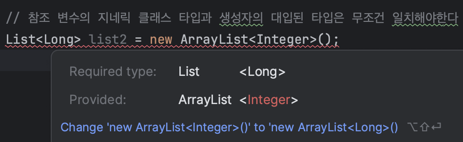
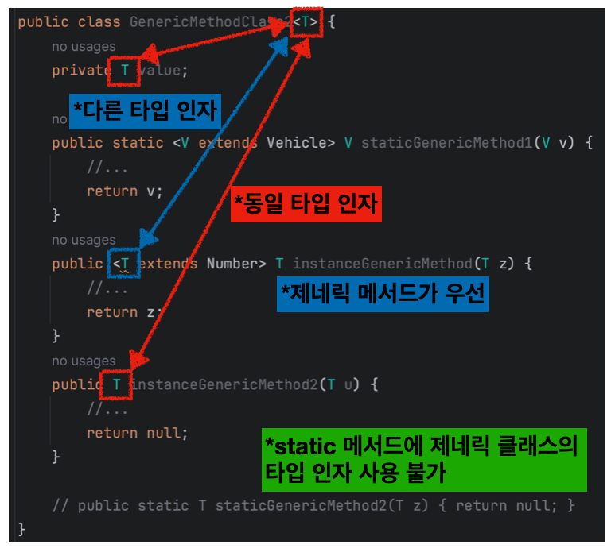

## Table of Contents

1. [제네릭스(Generics)](https://github.com/seungki1011/Data-Engineering/tree/main/java/(019)%20Generics#1-%EC%A0%9C%EB%84%A4%EB%A6%AD%EC%8A%A4generics)
   * [제네릭스 설명](https://github.com/seungki1011/Data-Engineering/tree/main/java/(019)%20Generics#11-%EC%A0%9C%EB%84%A4%EB%A6%AD%EC%8A%A4-%EC%84%A4%EB%AA%85)
   * 제네릭스 사용해보기
   * 타입 변수 관례
2. [제네릭 제한(Generic Constraint)](https://github.com/seungki1011/Data-Engineering/tree/main/java/(019)%20Generics#2-%EC%A0%9C%EB%84%A4%EB%A6%AD-%EC%A0%9C%ED%95%9Cgeneric-constraint)
   * [제한이 없을 경우의 문제점](https://github.com/seungki1011/Data-Engineering/tree/main/java/(019)%20Generics#21-%EC%A0%9C%ED%95%9C%EC%9D%B4-%EC%97%86%EC%9D%84-%EA%B2%BD%EC%9A%B0%EC%9D%98-%EB%AC%B8%EC%A0%9C%EC%A0%90)
   * [타입 매개변수의 제한 도입](https://github.com/seungki1011/Data-Engineering/tree/main/java/(019)%20Generics#22-%ED%83%80%EC%9E%85-%EB%A7%A4%EA%B0%9C%EB%B3%80%EC%88%98%EC%9D%98-%EC%A0%9C%ED%95%9C-%EB%8F%84%EC%9E%85)
3. [제네릭 메서드(Generic Method)](https://github.com/seungki1011/Data-Engineering/tree/main/java/(019)%20Generics#3-%EC%A0%9C%EB%84%A4%EB%A6%AD-%EB%A9%94%EC%84%9C%EB%93%9Cgeneric-method)
   * [제네릭 메서드 설명](https://github.com/seungki1011/Data-Engineering/tree/main/java/(019)%20Generics#31-%EC%A0%9C%EB%84%A4%EB%A6%AD-%EB%A9%94%EC%84%9C%EB%93%9C-%EC%84%A4%EB%AA%85)
   * [제네릭 메서드 사용해보기](https://github.com/seungki1011/Data-Engineering/tree/main/java/(019)%20Generics#32-%EC%A0%9C%EB%84%A4%EB%A6%AD-%EB%A9%94%EC%84%9C%EB%93%9C-%EC%82%AC%EC%9A%A9%ED%95%B4%EB%B3%B4%EA%B8%B0)
4. [와일드카드(Wildcard, `?`)](https://github.com/seungki1011/Data-Engineering/tree/main/java/(019)%20Generics#4-%EC%99%80%EC%9D%BC%EB%93%9C%EC%B9%B4%EB%93%9Cwildcard-)
   * [와일드카드 설명](https://github.com/seungki1011/Data-Engineering/tree/main/java/(019)%20Generics#41-%EC%99%80%EC%9D%BC%EB%93%9C%EC%B9%B4%EB%93%9C-%EC%84%A4%EB%AA%85)
   * [제한을 사용하지 않은 와일드카드](https://github.com/seungki1011/Data-Engineering/tree/main/java/(019)%20Generics#42-%EC%A0%9C%ED%95%9C%EC%9D%84-%EC%82%AC%EC%9A%A9%ED%95%98%EC%A7%80-%EC%95%8A%EC%9D%80-%EC%99%80%EC%9D%BC%EB%93%9C-%EC%B9%B4%EB%93%9C)
   * [제네릭 메서드 vs 와일드카드](https://github.com/seungki1011/Data-Engineering/tree/main/java/(019)%20Generics#43-%EC%A0%9C%EB%84%A4%EB%A6%AD-%EB%A9%94%EC%84%9C%EB%93%9C-vs-%EC%99%80%EC%9D%BC%EB%93%9C-%EC%B9%B4%EB%93%9C)
   * [상한, 하한 제한 와일드카드](https://github.com/seungki1011/Data-Engineering/tree/main/java/(019)%20Generics#44-%EC%83%81%ED%95%9C-%ED%95%98%ED%95%9C-%EC%A0%9C%ED%95%9C-%EC%99%80%EC%9D%BC%EB%93%9C%EC%B9%B4%EB%93%9C)
     * 상한 제한 와일드카드(Upper-bound)
     * 하한 제한 와일드카드(Lower-bound)
   * [제네릭 클래스, 메서드를 사용해야하는 경우](https://github.com/seungki1011/Data-Engineering/tree/main/java/(019)%20Generics#45-%EC%A0%9C%EB%84%A4%EB%A6%AD-%ED%81%B4%EB%9E%98%EC%8A%A4-%EB%A9%94%EC%84%9C%EB%93%9C%EB%A5%BC-%EC%82%AC%EC%9A%A9%ED%95%B4%EC%95%BC%ED%95%98%EB%8A%94-%EA%B2%BD%EC%9A%B0)

---

## 1) 제네릭스(Generics)

### 1.1 제네릭스 설명

예시 코드를 보면서 왜 제네릭스(Generics)가 필요한지 알아보자.

먼저 제네릭스를 사용하지 않고 `String`과 `Integer`를 꺼내서 사용할 수 있는 기능을 제공하는 박스를 구현해서 사용하는 경우를 살펴보자.

<br>

`IntegerBox`

```java
public class IntegerBox {

    private Integer value;

    public void setValue(Integer value) {
        this.value = value;
    }

    public Integer getValue() {
        return value;
    }

}
```

* `Integer` 값을 설정하고 꺼낼 수 있는 기능 제공

<br>

```StringBox```

```java
public class StringBox {

    private String value;

    public void setValue(String value) {
        this.value = value;
    }

    public String getValue() {
        return value;
    }
    
}
```

* `String` 값을 설정하고 꺼낼 수 있는 기능 제공

<br>

`BoxMain1`

```java
public class BoxMain1 {
    public static void main(String[] args) {
      
        IntegerBox integerBox = new IntegerBox();
        integerBox.setValue(10);
        Integer i = integerBox.getValue();
        System.out.println("i = " + i);

        StringBox stringBox = new StringBox();
        stringBox.setValue("string value");
        String str = stringBox.getValue();
        System.out.println("str = " + str);
    }
}
```

```
i = 10
str = string value
```

<br>

위의 `StringBox`, `IntegerBox`를 이용한 코드에는 한가지 문제가 있다. 만약 `Double`, `Float`, `Boolean` 등 새로운 타입을 담을 박스를 사용하기 위해서는 새롭게 박스를 구현해야 한다. 만약 1 ~ 2 가지의 타입만 사용한다면 큰 문제가 되지 않겠지만, 수십 ~ 수백 가지 타입을 사용하기 위해서 새로 코드를 작성하는 것은 굉장히 비효율적이다.

이를 해결하기 위해서 **제네릭스**(Generics)를 사용할 수 있다.

제네릭을 사용하는 예시를 살펴보면서, 제네릭스에 대해 알아보자. 먼저 `제네릭 클래스(Generic Class)`를 만들어보자.

<br>

`GenericBox`

```java
public class GenericBox<T> {

    private T value;

    public T getValue() {
        return value;
    }

    public void setValue(T value) {
        this.value = value;
    }
}
```

* `<>`(다이아몬드)를 사용한 클래스를 `제네릭 클래스`라고 한다
* 클래스명 바로 오른쪽에 `<T>`와 같은 형식으로 선언해서 제네릭 클래스로 만들 수 있고, `T`를 타입 매개변수(Type parameter)라고 한다
* 타입 매개변수 `T`를 `T` 타입이 필요한 필드나 메서드 반환 타입에 사용할 수 있다
  * 예) `private T value;`
  * 예) `public T getValue() {...}`


* 제네릭 클래스를 사용해서 클래스의 타입을 객체의 생성 시점에 정할 수 있다
* 제네릭의 타입 매개변수에는 참조 타입만 가능하다(원시 타입 불가)

<br>

제네릭 클래스를 사용하는 코드를 구현해보자.

<br>

`GenericBoxMain`

```java
public class GenericBoxMain {
    public static void main(String[] args) {

        GenericBox<Integer> integerBox = new GenericBox<Integer>();
        integerBox.setValue(100);
        // integerBox.setValue("one hundred"); // 제네릭을 통한 타입 안정성 제공
        Integer integerValue = integerBox.getValue();
        System.out.println("integerValue = " + integerValue);

        GenericBox<String> stringBox = new GenericBox<String>();
        stringBox.setValue("one hundred");
        String stringValue = stringBox.getValue();
        System.out.println("stringValue = " + stringValue);

        GenericBox<Double> doubleBox = new GenericBox<>(); // 제니릭 타입 생략 가능(타입 추론)
        doubleBox.setValue(99.9);
        Double doubleValue = doubleBox.getValue();
        System.out.println("doubleValue = " + doubleValue);

    }
}
```

```
integerValue = 100
stringValue = one hundred
doubleValue = 99.9
```

* 제네릭 클래스의 인스턴스를 다음과 같이 생성할 수 있다
  * `new GenericBox<Integer>();`
  * `Integer`는 제네릭 클래스의 타입 매개변수로 넘어가서 해당 클래스의 타입 매개변수(`T`)가 `Integer`를 사용하도록 한다


* 제네릭 클래스에 대한 인스턴스를 생성할 때 타입 추론이 가능하다
  * `GenericBox<Double> doubleBox = new GenericBox<>();`
  * `Double`이라고 명시하지 않아도 `GenericBox<Double>`에서 `Double`이라는 것을 추론할 수 있기 때문에 자동으로 `Double`을 적용해준다


* 이전 제네릭을 사용하기 전의 코드와 비교해보면, 새로운 타입을 사용할 때마다 클래스를 만들 필요가 없어졌다. 그렇다고 타입 안전성이 떨어지는 것도 아니다


<br>

제네릭 클래스를 도입하면서 얻은 이점은 다음과 같다.

* 타입 안정성 제공 : 지정한 타입 외의 타입 사용시 컴파일 에러
* 코드 유연성 제공 : 하나의 제네릭 클래스를 이용해서 여러 타입 사용 가능, 사용할 때 마다 형변환하는 것을 생략 가능


<br>

---

### 1.2 제네릭스 사용해보기

제네릭 클래스를 사용해보자.

<br>

`Pair`

```java
public class Pair<T1,T2> {

    private T1 first;
    private T2 second;

    public T1 getFirst() {
        return first;
    }

    public void setFirst(T1 first) {
        this.first = first;
    }

    public T2 getSecond() {
        return second;
    }

    public void setSecond(T2 second) {
        this.second = second;
    }

    @Override
    public String toString() {
        return "Pair{" +
                "first=" + first +
                ", second=" + second +
                '}';
    }
}
```

* 제네릭 클래스는 위 코드 처럼 다수의 타입 매개변수를 사용하는 것도 가능하다

<br>

```PairTest```

```java
public class PairTest {
    public static void main(String[] args) {

        Pair<Integer, String> pair1 = new Pair<>();
        pair1.setFirst(10);
        pair1.setSecond("data");
        System.out.println(pair1.getFirst());
        System.out.println(pair1.getSecond());
        System.out.println("pair1 = " + pair1);

        Pair<String, String> pair2 = new Pair<>();
        pair2.setFirst("key");
        pair2.setSecond("value");
        System.out.println(pair2.getFirst());
        System.out.println(pair2.getSecond());
        System.out.println("pair2 = " + pair2);

        // 제네릭 클래스간 다형성은 성립
        List<String> list = new ArrayList<String>();

        list.add("a");
        list.add("b");
        list.add("c");
        System.out.println("list = " + list);

        // 참조 변수의 지네릭 클래스 타입과 생성자의 대입된 타입은 무조건 일치해야한다
        // List<Long> list2 = new ArrayList<Integer>();
        
    }
}
```

```
10
data
pair1 = Pair{first=10, second=data}
key
value
pair2 = Pair{first=key, second=value}
list = [a, b, c]
```

* `List<MyType> list = new ArrayList<MyType>();` : 지네릭의 클래스간 다형성은 성립한다
  * `List`는 `ArrayList`의 상위 타입


* 지네릭 클래스의 지네릭 타입의 타입 인자와 생성자의 대입된 타입 인자는 일치해야 함
  * `List<Long> list2 = new ArrayList<Integer>();` 처럼 사용 불가

<br>

<p align="center">    </p>

<p align = 'center'>Integer 대신 Long을 사용해야 함</p>

<br>

---

### 1.3 타입 변수 관례(Convention)

타입 변수에 대한 관례에 대해서 알아보자.

클래스를 작성할 때, `Object` 타입 대신 타입 변수(`T`)를 선언해서 사용한다. 

<br>

```java
public class ArrayList<T> extends AbstractList<T> {
  private transient T[] elementData;
  public boolean add(T o){ 
    // ... 
  };
  // ...
}
```

* 자주 사용되는 타입 인자 약어
  * ```<T>``` : Type
  * ```<E>``` : Element
  * ```<K>``` : Key
  * ```<V>``` : Value
  * ```<N>``` : Number
  * ```<R>``` : Result

<br>

이런 타입 인자들의 약어는 관례일 뿐, 필요하면 원하는 문자를 사용할 수 있다

<br>

```java
List<MyClass> myList = new ArrayList<MyClass>(); // T -> MyClass
```

* 객체를 생성시, 타입 변수(`T`) 대신 실제 타입(`MyClass`)을 지정
* 이전에도 설명했듯이 `int`, `float` 처럼 기본(원시) 타입은 타입 매개변수에 사용 불가
  * 참조형이나 래퍼 클래스를 사용


<br>

---

## 2) 제네릭 제한(Generic Constraint)

### 2.1 제한이 없을 경우의 문제점

제네릭 클래스의 타입 매개변수를 특정 타입으로 제한하는 제네릭의 제약에 대해서 알아보자. 

먼저 제네릭 제약을 도입하기 전에 일어날 수 있는 문제점을 살펴보자.

(이후의 코드는 반복되는 보일러 플레이트 코드를 줄이기 위해서 `Lombok` 사용)

<br>

구현할 코드는 

* 이동 수단을 나타내는 `Vehicle` 클래스
* `Vehicle` 클래스를 상속받는 `Car`, `Plane` 클래스
* 제네릭 클래스인 `VehicleCenter` 클래스

<br>

`Vehicle`

```java
@AllArgsConstructor
@Getter
public class Vehicle {

    private String name;
    private int volume;

    public void move() {
        System.out.println("이동 수단 이동중.");
    }

    @Override
    public String toString() {
        return "Vehicle{" +
                "name='" + name + '\'' +
                ", volume=" + volume +
                '}';
    }
}
```

<br>

`Car`

```java
public class Car extends Vehicle{

    public Car(String name, int size) {
        super(name, size);
    }

    @Override
    public void move() {
        System.out.println("자동차는 달리는 중.");
    }
}
```

<br>

`Plane`

```java
public class Plane extends Vehicle{

    public Plane(String name, int size) {
        super(name, size);
    }

    public void move() {
        System.out.println("비행기는 나는 중.");
    }
}
```

<br>

`VehicleCenter`

```java
public class VehicleCenter<T> {

    private T vehicle;

    public void setVehicle(T vehicle) {
        this.vehicle = vehicle;
    }

    public void check() {
        // object 타입의 메서드는 이용 가능
        System.out.println(vehicle.toString());

        // 특정 클래스의 메서드 사용 불가(컴파일 오류)
        // 타입은 객체 생성 순간 정해지기 때문에, 정해지기 전 시점에 메서드 사용 불가
        // System.out.println("이동 수단 연료양 = " + vehicle.getVolume());
        // vehicle.move();
    }

    public T getLargerVolume(T target) {
        // 마찬가지로 컴파일 오류
        // return vehicle.getVolume() > target.getVolume() ? vehicle : target;
        return null;
    }

}
```

* 현재 코드는 제네릭 제한을 도입하기 전인 상태
* 문제점은 `Vehicle`과 그 자손 클래스들의 메서드를 이용이 불가능하다
  * 이유는 제네릭 타입을 선언하면 자바 컴파일러 입장에서 `T`에 어떤 타입이 들어올지 예측할 수 없다
  * 물론 개발자의 입장에서는 당연히 `Vehicle`과 그 하위 타입이 들어올것을 예상하고 코드를 구현한 것이지만, 컴파일러의 입장에서는 아무것도 모르는 상태인 것이다


<br>

현 상태로 클래스들을 사용하는 코드를 작성해보자.

<br>

```NoConstraintTest```

```java
public class NoConstraintTest {
    public static void main(String[] args) {

        VehicleCenter<Car> car = new VehicleCenter<>();
        VehicleCenter<Plane> plane = new VehicleCenter<>();

        car.setVehicle(new Car("K5", 100));
        plane.setVehicle(new Plane("F-16", 500));

        car.check();
        plane.check();

        // Vehicle이 아닌 것도 타입에 들어갈 수 있는 문제
        VehicleCenter<String> string = new VehicleCenter<>();
        string.setVehicle("string value");
        string.check();

    }
}
```

```
Vehicle{name='K5', volume=100}
Vehicle{name='F-16', volume=500}
string value
```

* `Vehicle`과 관련된 기능을 제네릭 클래스인 `VehicleCenter`를 통해서 이용하고 싶지만 불가능하다
* 타입인자로 `Vehicle`의 자손만 받고 싶지만, 제약이 없기 때문에 어떤 타입이든 들어갈 수 있음

<br>

지금까지의 문제들을 제네릭 제한을 도입하면서 해결해보자.

<br>

---

### 2.2 타입 매개변수의 제한 도입

제네릭 제한이라는 것은 결국 타입 매개변수를 원하는 범위로 제한하는 것이다.

기존의 코드를 타입 매개변수를 제한하는 코드로 변경해보고, 그 차이점에 대해 알아보자.

<br>

 `ConstraintVehicleCenter`

```java
public class ConstraintVehicleCenter<T extends Vehicle> { // 타입 매개변수에 제약

    private T vehicle;

    public void setVehicle(T vehicle) {
        this.vehicle = vehicle;
    }

    public void check() {
        System.out.println(vehicle.toString());
        System.out.println("이동 수단 연료양 = " + vehicle.getVolume());
        vehicle.move();
    }

    public T getLargerVolume(T target) {
        return vehicle.getVolume() > target.getVolume() ? vehicle : target;
    }
  
}
```

* `<T extends Vehicle>` : 제네릭 제약의 핵심. 타입 매개변수 `T`에 `Vehicle`과 그 자손 클래스만 받을수 있도록 제한한다.
  * 상위 제한(upper-bound constraint)

* 타입 매개변수를 제한했기 때문에 자바 컴파일러는 `T`에 들어올수 있는 타입의 범위를 예측할 수 있음
  * `<T extends Vehicle>`의 경우 `Vehicle`과 그 자손들이 올수 있다는 것을 예측할 수 있기 때문에, 타입이 정확하게 정해진 상태가 아니어도 `Vehicle`이 제공하는 기능들을 사용할 수 있게 된다

<br>

이제 제네릭 제한을 도입한 클래스를 사용해보자.

<br>

`ConstraintTest`

```java
public class ConstraintTest {
    public static void main(String[] args) {

        ConstraintVehicleCenter<Car> car = new ConstraintVehicleCenter<>();
        ConstraintVehicleCenter<Plane> plane = new ConstraintVehicleCenter<>();

        car.setVehicle(new Car("K5", 100));
        plane.setVehicle(new Plane("F-16", 500));

        car.check();
        plane.check();

        // 제네릭의 타입 매개변수 제한으로 인해 Vehicle과 자손만 타입인자로 사용 가능
        // ConstraintVehicleCenter<String> string = new ConstraintVehicleCenter<>();
        // string.setVehicle("string value");
        // string.check();

    }
}
```

```
Vehicle{name='K5', volume=100}
이동 수단 연료양 = 100
자동차는 달리는 중.
Vehicle{name='F-16', volume=500}
이동 수단 연료양 = 500
비행기는 나는 중.
```

* 타입 매개변수의 제한을 통해 다음의 효과를 얻을 수 있었다
  * 제네릭 클래스에서 특정 클래스의 메서드(기능)을 사용할 수 있게 됨
  * 매개변수에 관련이 없는 온갖 타입을 사용할 수 없도록 제한할 수 있게 됨

<br>

제네릭 제한은 다음과 같이 사용도 가능하다.

```java
public class MultipleConstraintVehicleCenter <T extends Car & CarInterface>{
    // ...
}
```

* 이 경우 `Car`의 자손 타입이면서 `CarInterface`를 구현한 클래스만 타입인자로 사용 가능
* 보통 클래스가 이미 특정 인터페이스를 구현하고 있는 경우가 대부분이기 때문에 이렇게 사용하는 케이스는 드물다

<br>

---

## 3) 제네릭 메서드(Generic Method)

### 3.1 제네릭 메서드 설명

특정 메서드에 제네릭을 적용하는 제네릭 메서드에 대해 알아보자.

다음 코드를 통해 살펴보자.

<br>

`GenericMethod`

```java
public class GenericMethod {

    public static Object objMethod(Object obj) {
        System.out.println("object print: " + obj);
        return obj;
    }

    // 타입 인자를 전달 받는 시점은 메서드를 호출할 때
    public static <T> T genericMethod(T t) {
        System.out.println("generic print: " + t);
        return t;
    }
    
    // extends를 통한 타입 매개변수 제한도 가능
    public static <T extends Number> T numberMethod(T t) {
        System.out.println("number print: " + t);
        return t;
    }
}
```

* 제네릭 메서드는 클래스 전체가 아닌 메서드 단위로 제네릭을 도입할 때 사용한다
  * `static <T> T genericMethod(T t) {}`
  * 제네릭 메서드를 사용하기 위해서는 반환 타입의 왼쪽에 `<타입 매개변수>`를 적어준다


* 제네릭 메서드에도 제네릭 제한이 가능하다
  * `public static <T extends Number> T numberMethod(T t){}`

<br>

`GenericMethodTest1`

```java
public class GenericMethodTest1 {
    public static void main(String[] args) {

        Integer i = 100;
        Object object = GenericMethod.objMethod(i);

        // 타입 인자 명시
        Integer result = GenericMethod.<Integer>genericMethod(i);
        Integer integerValue = GenericMethod.<Integer>numberMethod(100);
      
        // <Double>(타입 인자) 생략 가능
        Double doubleValue = GenericMethod.numberMethod(200.0);

    }
}
```

* 타입 인자는 메서드를 호출하는 시점에 전달 된다
  * `GenericMethod.<타입인자>genericMethod(i)`

* 제네릭 메서드를 호출할 때 제네릭 메서드 타입의 추론이 가능하면 타입 인자를 생략할 수 있다
  * `Double doubleValue = GenericMethod.numberMethod(200.0);`

<br>

위의 예시에서는 `static` 메서드에만 제네릭 메서드를 적용했지만, 제네릭 메서드는 인스턴스 메서드에도 적용가능하다. 코드를 통해 알아보자.

<br>

```java
public class GenericMethodClass<T> {

    private T value;

    public static <V extends Vehicle> V staticGenericMethod1(V v) {
        //...
        return v;
    }
    
    // 제네릭 메서드의 T가 제네릭 클래스의 T보다 높은 우선순위를 가진다
    // 인스턴스 메서드도 제네릭 메서드 사용 가능
    public <T extends Number> T instanceGenericMethod(T z) {
        //...
        return z;
    }
    
    // 인스턴스 메서드에는 제네릭 클래스의 타입 매개변수 사용 가능
    public T instanceMethod(T u) {
        return null;
    }
    
    // static 메서드에 제네릭을 사용하기 위해서는 제네릭 메서드 사용 필수
    // public static T staticMethod(T z) { return null; }
    
}
```

* 제네릭 메서드를 사용하기 위해서는 `<타입 매개변수>`를 반환 타입 왼쪽에 추가해야 함
  * `<타입 매개변수>` 없이 `public T instanceMethod(T u){}` 처럼 사용하는 것은 그냥 제네릭 클래스의 제네릭을 메서드에 적용하는 것임


* `제네릭 클래스`의 매개변수 이름과 `제네릭 메서드`의 매개변수 이름이 동일하면 `제네릭 메서드`의 매개변수가 더 높은 우선순위를 가진다
  * 쉽게 이야기 하자면 두 매개변수는 이름이 같아도 서로 다른 타입 매개변수이다
  * 헷갈리니깐 서로 다르게 이름을 설정하자


* `static` 메서드에는 제네릭 클래스의 제네릭 타입 매개변수를 적용할 수 없다. 제네릭 타입은 제네릭 클래스의 객체를 생성하는 시점에 정해지고, `static` 메서드는 클래스 단위로 작동하기 때문에 제네릭 타입을 적용하는 것은 불가능하다
  * 쉽게 생각해서, 아직 객체를 생성하지도 않았는데(타입이 정해지지도 않았는데) 어떤 제네릭 타입이 적용된 `static` 메서드를 사용하는 것은 말이 되지 않는다!


* `static` 메서드에 제네릭을 도입하고 싶으면 제네릭 메서드를 사용하면 된다 

<br>

<p align="center">    </p>

<br>

---

### 3.2 제네릭 메서드 사용해보기

제네릭 메서드를 사용해보자.

<br>

`BioUnit`

```java
@Getter
@AllArgsConstructor
public class BioUnit {

    private String name;
    private int hp;

    @Override
    public String toString() {
        return "BioUnit{" +
                "name='" + name + '\'' +
                ", hp=" + hp +
                '}';
    }
}
```

<br>

`Marine`

```java
public class Marine extends BioUnit {

    public Marine(String name, int hp) {
        super(name, hp);
    }
}
```

<br>

`Zeolot`

```java
public class Zealot extends BioUnit{

    public Zealot(String name, int hp) {
        super(name, hp);
    }
}
```

<br>

`UnitUtil`

```java
public class UnitUtil {

    public static <T extends BioUnit> T maxHp(T t1, T t2) {
        return (t1.getHp() > t2.getHp()) ? t1 : t2;
    }

}
```

* `public static <T extends BioUnit> T maxHp(T t1, T t2)`는 제네릭 메서드
* 두 유닛을 입력 받고, 둘 중 `hp`가 더 높은 유닛을 반환한다

<br>

`UnitUtilTest`

```java
public class UnitUtilTest {
    public static void main(String[] args) {

        Marine m1 = new Marine("마린1", 40);
        Marine m2 = new Marine("마린2", 50);
        Marine resultMarine = UnitUtil.maxHp(m1, m2);
        System.out.println("resultMarine = " + resultMarine);

        Zealot z1 = new Zealot("질럿1", 100);
        Zealot z2 = new Zealot("질럿2", 150);
        Zealot resultZealot = UnitUtil.maxHp(z1, z2);
        System.out.println("resultZealot = " + resultZealot);

        BioUnit resultBioUnit = UnitUtil.maxHp(m1, z2);
        System.out.println("resultBioUnit = " + resultBioUnit);
    }
}
```

```
resultMarine = BioUnit{name='마린2', hp=50}
resultZealot = BioUnit{name='질럿2', hp=150}
resultBioUnit = BioUnit{name='질럿2', hp=150}
```

<br>

---

## 4) 와일드카드(Wildcard, `<?>`)

### 4.1 와일드카드 설명

와일드카드(wild card)에 대해서 알아보자.

와일드카드에 대해서 아주 간단히 설명하자면, 제네릭 타입을 조금 더 편리하게 사용할 수 있는 방법으로 볼 수 있다.

> 참고
>
> * 와일드카드는 제네릭 클래스나 제네릭 메서드를 선언하는 것이 아니라, 이미 만들어진 제네릭 타입을 활용할 때 사용하는 것이다.
> * 프로그래밍에서의 와일드카드는 보통 다수를 상징하는 특수한 문자를 뜻한다. 예시 : `*`, `?`

<br>

```java
ArrayList<Product> list = new ArrayList<Tv>(); // 불가능, 대입 타입의 불일치

ArrayList<? extends Product> list = new ArrayList<Tv>(); // 가능
ArrayList<? extends Product> list = new ArrayList<Computer>(); // 가능
```

* 대입 타입이 무조건 일치해야한다는 제약을 벗어나기 위해서 와일드 카드 사용
* 제네릭 클래스나 메서드가 무조건 필요한 상황이 아니라면, 와일드카드를 사용하는 것이 더 편하다

<br>

> `<? extends T>` : 와일드 카드의 상한 제한. `T`와 그 자손들만 가능 - upperbounded wildcard
>
> `<? super T>` : 와일드 카드의 하한 제한. `T`와 그 조상들만 가능 - lowerbounded wildcard
>
> `<?>` : 제한 없음. 모든 타입이 가능하다.

<br>

코드를 통해 더 자세히 알아보자.

이후의 코드에서 이전의 [`GenericBox`]()를 다시 사용할 것이다.

<br>

---

### 4.2 제한을 사용하지 않은 와일드 카드

먼저 제한을 사용하지 않은 와일드카드 부터 살펴보자.

<br>

`WildcardTest1`

```java
public class WildcardTest1 {
    public static void main(String[] args) {
        
        // GenericBox는 모든 타입을 담을 수 있음
        GenericBox<Object> objBox = new GenericBox<>();
        GenericBox<Plane> planeBox = new GenericBox<>();
        GenericBox<Car> carBox = new GenericBox<>();
        
        // planeBox에 Plane 객체를 생성해서 넣음
        planeBox.setValue(new Plane("F-22", 1000));

        // 비제한
        NoConstraint.printGeneric1(planeBox);
        NoConstraint.printWildcard1(planeBox);
        
    }
}
```

```
[GenericBox<T> 사용] box.getValue() = Vehicle{name='F-22', volume=1000}
[GenericBox<?> 사용] box.getValue() = Vehicle{name='F-22', volume=1000}
```

<br>

해당 메서드들을 자세히 살펴보자.

<br>

`NoConstraint`

```java
public class NoConstraint {
  
    // 제네릭 메서드
    // GenericBox<Plane> planeBox 전달. T -> Plane
    static <T> void printGeneric1(GenericBox<T> box) {
        System.out.println("[GenericBox<T> 사용] box.getValue() = " + box.getValue());
    }

    // 비제한 와일드 카드를 사용한 일반 메서드
    // GenericBox<Plane> planeBox 전달. ?는 모든 타입을 받을 수 있음
    static void printWildcard1(GenericBox<?> box) {
        System.out.println("[GenericBox<?> 사용] box.getValue() = " + box.getValue());
    }
}
```

* 와일드 카드 `?`는 모든 타입을 다 받을 수 있다는 뜻
  * 비제한 와일드카드는 `carBox`, `objBox`, `planeBox` 모두 다 입력 가능함

* 와일드카드는 `Box<Car>`, `Box<Plane>` 처럼 타입 인자가 정해진 제네릭 타입을 전달 받아서 활용할 때 사용한다

<br>

그러면 제네릭 메서드와 와일드카드의 차이에 대해서 조금더 자세히 알아보자.

<br>

---

### 4.3 제네릭 메서드 vs 와일드 카드

* 제네릭 메서드

  * ```java
    static <T> void printGeneric1(GenericBox<T> box) {
            System.out.println("[GenericBox<T> 사용] box.getValue() = " + box.getValue());
        }
    ```

  * 타입 매개변수가 존재한다

  * 특정 시점에 타입 인자를 무조건 전달해서 사용해야 한다


* 와일드 카드를 사용한 메서드

  * ```java
    static void printWildcard1(GenericBox<?> box) {
            System.out.println("[GenericBox<?> 사용] box.getValue() = " + box.getValue());
        }
    ```

  * 일반 메서드이다

  * 단순히 제네릭 타입을 매개변수로 받을 수 있는 것 뿐이다

  * 제네릭 메서드 처럼 타입 인자를 받아서, 제네릭 클래스나 제네릭 메서드의 모든 타입 파라미터에 타입 인자를 전달해서 결정하는 복잡한 방식으로 동작하지 않는다

<br>

차이점에서 볼 수 있듯이 와일드카드는 단순히 일반 메서드에 제네릭 타입을 받아서 사용할 수 있는 매개변수가 있는 것 뿐이다. 만약 제네릭 타입이나 제네릭 메서드를 무조건 정의해야하는 상황이 아니라면, 와일드카드를 사용하는것을 권장한다.

<br>

---

### 4.4 상한, 하한 제한 와일드카드

#### 4.4.1 상한 제한 와일드카드(Upper-bound)

제네릭 클래스나 메서드에서 사용하는 것 처럼, 상한 제한을 두는 것이 가능하다

<br>

`UpperboundConstraint`

```java
public class UpperBoundConstraint {
    
    // 상한 제한 제네릭 메서드
    static <T extends Vehicle> void printGeneric2(GenericBox<T> box) {
        T t = box.getValue();
        System.out.println("이름 = " + t.getName());
    }

    // 상한 제한 와일드 카드
    static void printWildcard2(GenericBox<? extends Vehicle> box) {
        Vehicle vehicle = box.getValue();
        System.out.println("이름 = " + vehicle.getName());
    }
}
```

* `<? extends Vehicle>` : `Vehicle`과 그 하위 타입만 입력 가능

<br>

---

#### 4.4.2 하한 제한 와일드카드(Lower-bound)

제네릭에서 사용한것과 다르게 와일드카드는 하한 제한이 가능하다. 

<br>

`LowerboundTest`

```java
public class LowerBoundTest {
    public static void main(String[] args) {
      
        GenericBox<Object> objBox = new GenericBox<>();
        GenericBox<Vehicle> vehicleBox = new GenericBox<>();
        GenericBox<Plane> planeBox = new GenericBox<>();
        GenericBox<Car> carBox = new GenericBox<>();

        // Vehicle을 포함한 상위 타입 전달 가능
        writeBox(objBox);
        writeBox(vehicleBox);

        Vehicle vehicle = vehicleBox.getValue();
        System.out.println("vehicle = " + vehicle);
    }

    static void writeBox(GenericBox<? super Vehicle> box) {
        box.setValue(new Car("k5", 200));
    }
}
```

```
vehicle = Vehicle{name='k5', volume=200}
```

* `? extends Vehicle` : `Vehicle`을 포함한 상위의 타입만 입력 받을 수 있다
  * `Car`, `Plane`과 같은 하위 타입 입력 불가

<br>

---

### 4.5 제네릭 클래스, 메서드를 사용해야하는 경우

이전에도 설명했듯이 와일드카드는 `GenericBox<Plane>`, `GenericBox<Car>` 처럼 타입 인자가 전달된 제네릭 타입을 활용할 때 사용된다. 만약 타입 매개변수가 꼭 필요한 상황이라면 제네릭 클래스나 메서드를 사용해야 한다.

코드를 통해 알아보자.

<br>

`NeedTypeParameter`

```java 
public class NeedTypeParameter {
    
    // 타입 파라미터 T를 무조건 사용해야하는 상황이면 제네릭 클래스나 메서드를 사용해야 한다
    static <T extends Vehicle> T printAndReturnGeneric(GenericBox<T> box) {
        T t = box.getValue();
        System.out.println("이름 = " + t.getName());
        return t;
    }
    
    static Vehicle printAndReturnWildcard(GenericBox<? extends Vehicle> box) {
        Vehicle vehicle = box.getValue();
        System.out.println("이름 = " + vehicle.getName());
        return vehicle;
    }
}
```

* 타입 파라미터 `T`를 사용해야하면 제네릭 타입이나 메서드 사용
* `static <T extends Vehicle> T printAndReturnGeneric(GenericBox<T> box){}`에서 반환 타입이 `T`를 사용하기 때문에, 전달한 타입으로 명확하게 반환이 가능하다
* 반면에 `static Vehicle printAndReturnWildcard(GenericBox<? extends Vehicle> box){}`는 반환 타입이 `Vehicle`로 고정 되었기 때문에, 전달된 타입으로 명확하게 반환하는 것은 불가능하다

<br>

위에서 알 수 있듯이, 와일드카드는 이미 만들어진 제네릭 타입을 전달 받아서 활용할 때 사용되지, 메서드의 타입을 타입 인자를 통해 변경하는 작업은 하지 못한다.