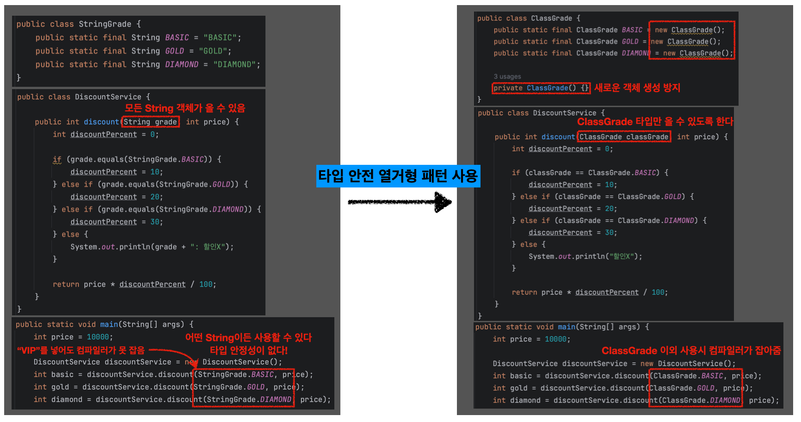
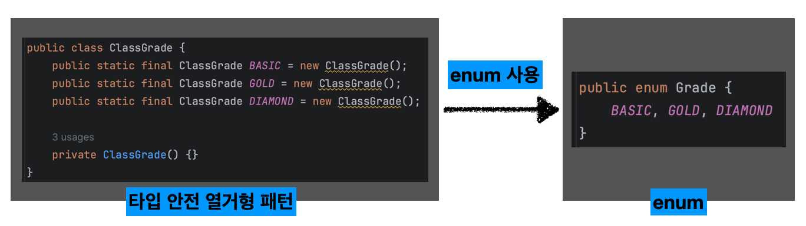

## Table of Contents

1. [타입 안정성(Type-safety)](https://github.com/seungki1011/Data-Engineering/tree/main/java/(020)%20Enum#1-%ED%83%80%EC%9E%85-%EC%95%88%EC%A0%95%EC%84%B1type-safety)
   * `String`은 타입 안정성이 떨어진다
   * 타입 안전 열거형 패턴(Type-safe Enum Pattern)
2. [열거형(`enum`)](https://github.com/seungki1011/Data-Engineering/tree/main/java/(020)%20Enum#2-%EC%97%B4%EA%B1%B0%ED%98%95enum)
   * `enum` 사용
   * `Enum` 클래스 메서드
   * 열거형을 이용한 리펙토링
   * 열거형 정리

---

## 1) 타입 안정성(Type-Safety)

### 1.1 `String`은 타입 안정성이 떨어진다

먼저 `String`을 사용하면 왜 타입 안전성이 부족한지 알아보자.

등급별 할인 적용을 위한 코드를 작성한다고 가정해보자.

* `BASIC` : 10% 할인
* `GOLD` : 20% 할인
* `DIAMOND` : 30% 할인

<br>

```java
public class StringGrade {
     public static final String BASIC = "BASIC";
     public static final String GOLD = "GOLD";
     public static final String DIAMOND = "DIAMOND";
}
```

```java
public class DiscountService {
     public int discount(String grade, int price) {
         int discountPercent = 0;
       
         if (grade.equals(StringGrade.BASIC)) {
             discountPercent = 10;
         } else if (grade.equals(StringGrade.GOLD)) {
             discountPercent = 20;
         } else if (grade.equals(StringGrade.DIAMOND)) {
             discountPercent = 30;
			 	 } else {
						 System.out.println(grade + ": 할인X");
         }
       
         return price * discountPercent / 100;
     }
}
```

```java
public class StringGradeMain {
     public static void main(String[] args) {
         
         int price = 10000;
       
         DiscountService discountService = new DiscountService();
       
         int basic = discountService.discount(StringGrade.BASIC, price);
         int gold = discountService.discount(StringGrade.GOLD, price);
         int diamond = discountService.discount(StringGrade.DIAMOND, price);
       
				 System.out.println("BASIC 등급의 할인 금액: " + basic); 
         System.out.println("GOLD 등급의 할인 금액: " + gold); 
       	 System.out.println("DIAMOND 등급의 할인 금액: " + diamond);
       
		 } 
}
```

* `String` 사용 시 타입 안정성 부족
  * `String` 으로 상태나 카테고리를 표현하면, 잘못된 문자열을 실수로 입력할 가능성이 있다
  * 예) `StringGrade.BASIC` 대신에 그냥 `VIP` 라고 입력해도 코드는 동작한다
  * 한마디로, 이러한 잘못된 값은 컴파일 시에는 감지되지 않고, 런타임에서만 문제가 발견되기 때문에 디버깅이 어려워질 수 있다


* 쉽게 말해서 지금 문제는 `discount(String grade, int price)`에서 `grade`에 `String` 타입이 올 수 있고, 특정 값만 사용하도록 강제할 수 없기 때문에 발생한다


이런 문제를 해결하기 위해서 타입 안전 열거형 패턴(Type safe Enum Pattern)이 등장한다.

<br>

---

### 1.2 타입 안전 열거형 패턴(Type-safe Enum Pattern)

타입 안전 열거형 패턴을 알아보자.

<br>

<p align="center">    </p>

* 먼저 회원 등글을 다루는 클래스를 만들고, 각 회원 등급별로 상수를 선언한다
  * 각 상수마다 별도의 인스턴스를 생성한다
  * 각 `BASIC`, `GOLD`, `DIAMOND` 는 자신만의 객체를 가지게 된다(쉽게 말해서 참조값이 전부 다르다)


* `discount`는 매개변수로 `ClassGrade` 클래스를 사용한다
  * `discount(ClassGrade grade, int price)`
  * 값을 비교할 때  `grade == ClassGrade.BASIC` 와 같이 `==` 참조값 비교를 사용하면 된다
  * 외부에서 임의로 `ClassGrade` 인스턴스를 생성하는 것을 막기 위해 기본 생성자를 `private`으로 설정한다


* 이제 `ClassGrade` 인스턴스를 사용할 때는 `ClassGrade` 내부에 정의한 상수를 사용해야 한다. 그렇지 않으면 컴파일 오류가 발생한다


* `ClassGrade` 타입의 상수만 사용할 수 있도록 강제를 하면서 이전에 `String`을 이용한 상수의 문제점을 해결했다
* 정해진 객체만 사용할 수 있기 때문에, 잘못된 값을 입력하는 문제를 근본적으로 방지한다
  * 클래스는 사전에 정의된 몇 개의 인스턴스만 생성하고, 외부에서는 이 인스턴스들만 사용한다
  * 잘못된 값이 할당되거나 사용되는 것을 컴파일 시점에 방지


* 정해진 객체만 사용하므로 데이터의 일관성이 보장된다

<br>

이 패턴의 문제점은 구현하기 위해서 많은 양의 코드를 작성해야 한다는 것이다. 이외에도 객체 생성방지를 위해서 `private` 생성자를 추가하는 등, 여러가지 유의사항들이 존재한다. 이 때문에, 자바는 타입 안전 열거형 패턴을 쉽게 사용할 수 있도록 `enum`이라는 열거형 타입을 제공한다.

<br>

---

## 2) 열거형(`enum`)

### 2.1 `enum` 사용

`enum`이란. 

* 요소 또는 멤버라고 불리는 값의 집합으로 이루어진 자료형
* 열거형은 서로 관련된 상수들을 같이 묶어 놓은 것이라고 생각하면 편하다(상수들의 집합)
* `enum`은 자바의 특수한 클래스로 구분됨

<br>

열거형을 정의하는 방법은 다음과 같다

```java
enum EnumName {상수명1, 상수명2, ...}
```

* `상수1` : `0`, `상수2` : `1`, ... `상수n` : `n` 부여
* `ordinal()` 메서드를 이용해서 선언 순서를 반환 받을 수 있음

<br>

이전의 예제를 이어서 바로 `enum`을 적용해보자.

```java
public enum Grade {
     BASIC, GOLD, DIAMOND
}
```

* 열거형을 정의할 때는 `class` 대신에 `enum` 을 사용한다
* 원하는 상수의 이름을 나열하면 된다
* `enum`은 자동으로 `java.lang.Enum`을 상속 받는다
* 외부에서 임의로 생성 불가

<br>

```java
public class DiscountService {
     public int discount(Grade grade, int price) {
       
         int discountPercent = 0;
				
         //enum switch 변경 가능
				 if (grade == Grade.BASIC) {
             discountPercent = 10;
         } else if (grade == Grade.GOLD) {
             discountPercent = 20;
         } else if (grade == Grade.DIAMOND) {
             discountPercent = 30;
         } else {
						 System.out.println("할인X"); 
         }
       
         return price * discountPercent / 100;
       
     }
}
```

```java
public class EnumMain {
     public static void main(String[] args) {
       
         int price = 10000;
       
         DiscountService discountService = new DiscountService();
       
         int basic = discountService.discount(Grade.BASIC, price);
         int gold = discountService.discount(Grade.GOLD, price);
         int diamond = discountService.discount(Grade.DIAMOND, price);
       
				 System.out.println("BASIC 등급의 할인 금액: " + basic); 
         System.out.println("GOLD 등급의 할인 금액: " + gold); 
         System.out.println("DIAMOND 등급의 할인 금액: " + diamond);
	   } 
}
```

* 사용법 자체는 앞의 타입 안전 열거형 패턴과 같다
* 그래도 `enum`의 경우 코드를 더 간결하게 할 수 있다

<br>

<p align="center">    </p>

<p align="center">열거형 사용</p>

<br>

---

### 2.2 `Enum` 클래스 메서드

모든 열거형은 `java.lang.Enum`을 자동으로 상속 받는다. 해당 클래스가 제공하는 기능들을 사용할 수 있다.

코드로 알아보자.

<br>

```java
public enum Direction {
    NORTH, EAST, SOUTH, WEST
}
```

```java
public class EnumMethod {
    public static void main(String[] args) {

        // 모든 Enum 반환
        Direction[] values = Direction.values();
        System.out.println("values = " + Arrays.toString(values));
        for (Direction value : values) {
            System.out.println("[name = " + value.name() + ", ordinal = " + value.ordinal() + "]");
        }

        // String -> Enum
        String input = "NORTH";
        Direction north = Direction.valueOf(input);
        System.out.println("north = " + north); // toString() 오버라이딩 가능

    }
}
```

* `values()` : 모든 ENUM 상수를 포함하는 배열을 반환
* `valueOf(String s)` : 주어진 이름과 일치하는 ENUM 상수를 반환
* `name()` : ENUM 상수의 이름을 문자열로 반환
* `ordinal()` : ENUM 상수의 선언 순서(0부터 시작)를 반환
* `toString()` : ENUM 상수의 이름을 문자열로 반환(오버라이딩 가능) 

<br>

> `ordinal()`의 사용은 권장되지 않는다
>
> * `ordinal()`을 사용해서 상수의 선언 순서를 활용하는 경우, 중간에 선언 위치가 변경되면 전체 상수의 위치가 변경될 수 있기 때문에 위험하다
> * 예) `Grade`의 `BASIC`과 `GOLD` 사이에 `SILVER`를 추가하면 `SILVER` 이후의 상수들은 선언 순서가 전부 1 증가한다

<br>

---

### 2.3 열거형을 이용한 리펙토링

열거형을 이용해서 우리의 예제를 리펙토링 해보자.

먼저 `DicsountService` 코드를 살펴보자.

```java
public class DiscountService {

    public int discount(Grade grade, int price) {
        int discountPercent = 0;

        if (grade == Grade.BASIC) {
            discountPercent = 10;
        } else if (grade == Grade.GOLD) {
            discountPercent = 20;
        } else if (grade == Grade.DIAMOND) {
            discountPercent = 30;
        } else {
            System.out.println("할인X");
        }

        return price * discountPercent / 100;
    }
}
```

* 이 코드에서 할인율(`discountPercent`)은 각각의 회원 등급별로 판단된다 → 따라서 열거형 `Grade`가 할인율(`discountPercent`)을 가지고 관리하도록 변경하자
* `if` 문 사용 제거

<br>

```java
public enum Grade {
  
    BASIC(10), GOLD(20), DIAMOND(30);

    private final int discountPercent;

    Grade(int discountPercent) {
        this.discountPercent = discountPercent;
    }

    public int getDiscountPercent() {
        return discountPercent;
    }
  	
  	// 기존 DiscountService 제거
  	public int discount(int price) {
         return price * discountPercent / 100;
     }

}
```

* `discountPercent` 필드를 추가하고, 생성자를 통해서 필드에 값을 저장한다


* 생성자를 통해서만 `discountPercent` 를 설정하도록 했고, 중간에 이 값이 변하지 않도록 불변으로 설계했다


* 열거형은 상수로 지정하는 것 외에 일반적인 방법으로 생성이 불가능하다
  * 생성자에 접근제어자를 선언할 수 없게 막혀있다
  *  `private` 이라고 생각하면 된다


* `BASIC(10)` 과 같이 상수 마지막에 괄호를 열고 생성자에 맞는 인수를 전달하면 적절한 생성자가 호출된다
* 값을 조회하기 위해 `getDiscountPercent()` 메서드를 추가


* 정리하면 상수를 정의할 때 각각의 등급에 따른 할인율(`discountPercent`)이 정해진다


* `Grade` 내부에 `discount()` 메서드를 만들어서, 이제 할인율을 스스로 계산한다
  * 객체지향 관점에서 `DiscountService`를 통해 자신의 데이터를 외부에 노출하는 것 보다는, `Grade` 클래스가 자신의 할인율을 어떻게 계산하는지 스스로 관리하는 것이 캡슐화 원칙에 더 맞다

<br>

```java
public class EnumRefMain {
    public static void main(String[] args) {
      
        int price = 10000;
      
        System.out.println("BASIC 등급의 할인 금액: " + Grade.BASIC.discount(price));
        System.out.println("GOLD 등급의 할인 금액: " + Grade.GOLD.discount(price));
        System.out.println("DIAMOND 등급의 할인 금액: " + Grade.DIAMOND.discount(price));
    }
}
```

* 각각의 등급별로 자신의 `discount()`를 직접 호출하면 할인율을 구할 수 있다
* `DiscountService` 를 제거해도 된다

<br>

---

### 2.4 열거형 정리

* 허용 가능한 타입을 제한해서, 타입 안전성(Type-safety)을 제공한다 → 잘못된 값을 넣을 경우 컴파일러가 잡아준다
* 코드의 가독성이 좋아진다


* `Enum` 클래스를 자동으로 상속받느다
  * `Enum` 클래스는 여러 메서드를 제공한다


* 열거형은 thread-safe하다
  * lazy initialization
  * 싱글톤 인스턴스
  * 불변(immutable)
  * 모든 스레드의 `enum` 상수가 정합성을 가지도록 함

<br>

---

## Reference

1. [티스토리 Inpa Dev - 열거형](https://inpa.tistory.com/entry/JAVA-%E2%98%95-%EC%97%B4%EA%B1%B0%ED%98%95Enum-%ED%83%80%EC%9E%85-%EB%AC%B8%EB%B2%95-%ED%99%9C%EC%9A%A9-%EC%A0%95%EB%A6%AC#enum_%EC%97%B4%EA%B1%B0_%ED%83%80%EC%9E%85)

