## Table of Contents

1. [중첩 클래스(Nested Class)](https://github.com/seungki1011/Data-Engineering/tree/main/java/(021)%20Nested%20Class#1-%EC%A4%91%EC%B2%A9-%ED%81%B4%EB%9E%98%EC%8A%A4nested-class)
   * 중첩 클래스 소개
2. [정적 중첩 클래스(Static Nested Class)](https://github.com/seungki1011/Data-Engineering/tree/main/java/(021)%20Nested%20Class#2-%EC%A0%95%EC%A0%81-%EC%A4%91%EC%B2%A9-%ED%81%B4%EB%9E%98%EC%8A%A4static-nested-class)
   * [정적 중첩 클래스 소개](https://github.com/seungki1011/Data-Engineering/tree/main/java/(021)%20Nested%20Class#21-%EC%A0%95%EC%A0%81-%EC%A4%91%EC%B2%A9-%ED%81%B4%EB%9E%98%EC%8A%A4-%EC%86%8C%EA%B0%9C)
   * [정적 중첩 클래스를 사용하는 경우](https://github.com/seungki1011/Data-Engineering/tree/main/java/(021)%20Nested%20Class#22-%EC%A0%95%EC%A0%81-%EC%A4%91%EC%B2%A9-%ED%81%B4%EB%9E%98%EC%8A%A4%EB%A5%BC-%EC%82%AC%EC%9A%A9%ED%95%98%EB%8A%94-%EA%B2%BD%EC%9A%B0)
3. [내부 클래스(Inner Class)](https://github.com/seungki1011/Data-Engineering/tree/main/java/(021)%20Nested%20Class#3-%EB%82%B4%EB%B6%80-%ED%81%B4%EB%9E%98%EC%8A%A4inner-class)
   * [내부 클래스 소개](https://github.com/seungki1011/Data-Engineering/tree/main/java/(021)%20Nested%20Class#31-%EB%82%B4%EB%B6%80-%ED%81%B4%EB%9E%98%EC%8A%A4-%EC%86%8C%EA%B0%9C)
   * [내부 클래스를 사용하는 경우](https://github.com/seungki1011/Data-Engineering/tree/main/java/(021)%20Nested%20Class#32-%EB%82%B4%EB%B6%80-%ED%81%B4%EB%9E%98%EC%8A%A4%EB%A5%BC-%EC%82%AC%EC%9A%A9%ED%95%98%EB%8A%94-%EA%B2%BD%EC%9A%B0)
4. [지역 클래스(Local Class)](https://github.com/seungki1011/Data-Engineering/tree/main/java/(021)%20Nested%20Class#4-%EC%A7%80%EC%97%AD-%ED%81%B4%EB%9E%98%EC%8A%A4local-class)
   * [지역 클래스 소개](https://github.com/seungki1011/Data-Engineering/tree/main/java/(021)%20Nested%20Class#41-%EC%A7%80%EC%97%AD-%ED%81%B4%EB%9E%98%EC%8A%A4-%EC%86%8C%EA%B0%9C)
   * [지역 클래스 예시](https://github.com/seungki1011/Data-Engineering/tree/main/java/(021)%20Nested%20Class#42-%EC%A7%80%EC%97%AD-%ED%81%B4%EB%9E%98%EC%8A%A4-%EC%98%88%EC%8B%9C)
   * [지역 변수 캡쳐(Variable Capture)](https://github.com/seungki1011/Data-Engineering/tree/main/java/(021)%20Nested%20Class#43-%EC%A7%80%EC%97%AD-%EB%B3%80%EC%88%98-%EC%BA%A1%EC%B3%90variable-capture)
     * 지역 변수 캡쳐 동작 과정
     * effectively final
5. [익명 클래스(Anonymous Class)](https://github.com/seungki1011/Data-Engineering/tree/main/java/(021)%20Nested%20Class#5-%EC%9D%B5%EB%AA%85%ED%81%B4%EB%9E%98%EC%8A%A4anonymous-class)
   * [익명 클래스 소개](https://github.com/seungki1011/Data-Engineering/tree/main/java/(021)%20Nested%20Class#51-%EC%9D%B5%EB%AA%85-%ED%81%B4%EB%9E%98%EC%8A%A4-%EC%86%8C%EA%B0%9C)
   * [익명 클래스를 사용하는 경우](https://github.com/seungki1011/Data-Engineering/tree/main/java/(021)%20Nested%20Class#52-%EC%9D%B5%EB%AA%85-%ED%81%B4%EB%9E%98%EC%8A%A4%EB%A5%BC-%EC%82%AC%EC%9A%A9%ED%95%98%EB%8A%94-%EA%B2%BD%EC%9A%B0)

---

## 1) 중첩 클래스(Nested Class)

### 1.1 중첩 클래스 소개

중첩 클래스(Nested Class)란 클래스 안에 클래스를 중첩해서 정의한 클래스를 말한다.

```java
class Outer {
  //...
  
  // 중첩 클래스
  class Nested {
    //...
  }
}
```

<br>

중첩 클래스는 클래스를 정의하는 위치에 따라서 분류할 수 있다.

<br>

<p align="center">   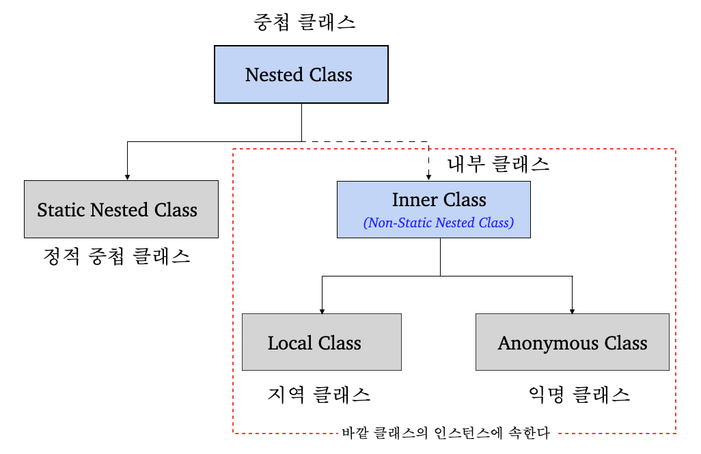 </p>

<p align="center">중첩 클래스의 분류</p>

<br>

**정적 중첩 클래스(Static Nested Class)**

```java
class Outer {
    //...
    // 정적 중첩 클래스
    static class StaticNested {
    //... 
    }
}
```

* 정적 중첩 클래스는 앞에 `static`이 붙어있다
* 정적 중첩 클래스는 바깥 클래스와 전형 다른 클래스이다
* **바깥 클래스의 인스턴스에 소속 되지 않는다**

<br>

**내부 클래스(Inner Class)**

```java
class Outer {

    private int memberVar;

    // 내부 클래스 - 인스턴스 변수와 같은 위치에 선언
    class Inner {
        //... 
    }

    public void process() {
        // 지역 변수
        int lcoalVar = 0;

        // 지역 클래스 - 지역 변수와 같은 위치에 선언
        class Local {
          //...
        }

        Local local = new Local();
    }
}
```

* 내부 클래스는 내부 클래스, 지역 클래스, 익명 클래스로 분류할 수 있다
  * 내부 클래스 : 인스턴스 변수와 같은 위치에 선언
  * 지역 클래스 : 지역 변수와 같은 위치에 선언
  * 익명 클래스 : 지역 클래스의 특별한 버전


* 중첩과 내부의 차이는 다음 처럼 생각하자
  * 중첩 : 어떤 것이 단순히 내부에 위치하거나 포함되는 구조
  * 내부 : 내부에 있는 구성 요소(바깥 클래스의 인스턴스에 소속된다)

<br>

> 보통 내부 클래스, 중첩 클래스를 엄밀하게 구분하지는 않는다. 상황과 문맥을 보면서 어떤 것을 사용하는 것인지 파악하자!

<br>

중첩 클래스는 언제 사용하나?

* 내부 클래스를 포함한 모든 중첩 클래스는 특정 클래스가 다른 하나의 클래스 안에서만 사용되거나, 두 클래스가 서로 긴밀히 연결되어 있는 특수한 경우에만 사용한다.
* 만약 외부의 여러 클래스가 특정 중첩 클래스를 사용한다면, 해당 클래스는 중첩 클래스로 만들면 안된다
  * 쉽게 말해서 다른 클래스에서도 중첩 클래스를 사용하면 바깥으로 빼자 그냥

<br>

---

## 2) 정적 중첩 클래스(Static Nested Class)

### 2.1 정적 중첩 클래스 소개

정적 중첩 클래스에 대해서 알아보자.

<br>

```java
public class NestedOuter {

    private static int outClassValue = 3;
    private int outInstanceValue = 2;

    static class Nested {
        private int nestedInstanceValue = 1;

        public void print() {
            // 자신의 멤버에 접근
            System.out.println(nestedInstanceValue);

            // 바깥 클래스의 인스턴스 멤버에 접근에는 접근할 수 없다.
            //System.out.println(outInstanceValue);

            // 바깥 클래스의 클래스 멤버에는 접근할 수 있다. private도 접근 가능
            System.out.println(NestedOuter.outClassValue);
        }
    }
}
```


<p align="center">   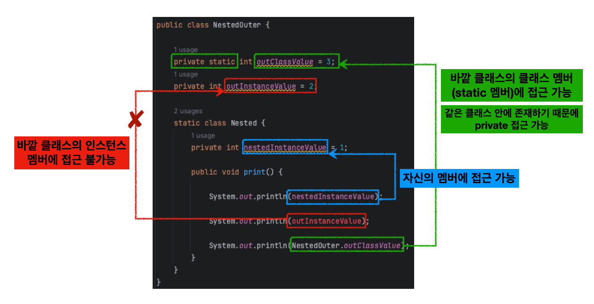 </p>

* 정적 중첩 클래스 앞에는 `static`이 붙는다

  

* 자신의 멤버에는 접근 가능 (`nestedInstanceValue`)

* 바깥 클래스의 인스턴스 멤버에는 접근 불가능 (`outInstanceValue`)


* 바깥 클래스의 클래스 멤버(`static` 멤버)에는 접근 가능(`NestedOuter.outClassValue`)
  * `NestedOuter.outClassValue` 대신 `outClassValue` 사용 가능
  * 같은 클래스 내부에 있기 때문에 `private`이 붙어도 접근 가능

<br>

```java
public class NestedOuterMain {

    public static void main(String[] args) {
      
        NestedOuter outer = new NestedOuter();
        NestedOuter.Nested nested = new NestedOuter.Nested();
        nested.print();

        System.out.println("nestedClass = " + nested.getClass());
    }
}
```

<p align="center">   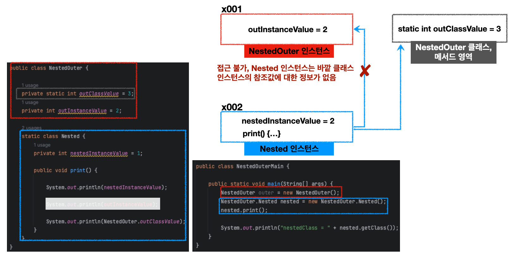 </p>

* 정적 중첩 클래스는 `new 바깥클래스.중첩클래스()` 로 생성할 수 있다
  * 예) `NestedOuter.Nested nested = new NestedOuter.Nested();`


* 중첩 클래스는 `NestedOuter.Nested`와 같이 `바깥 클래스.중첩클래스`로 접근할 수 있다
* 여기서 `new NestedOuter()`로 만든 바깥 클래스의 인스턴스와 `new NestedOuter.Nested()`로 만든 정적 중첩 클래스의 인스턴스는 서로 아무 관계가 없는 인스턴스이다


* 정적 중첩 클래스는 바깥 클래스의 정적 필드(메서드 영역)에는 접근할 수 있다
* 바깥 클래스가 만든 인스턴스 필드에는 바로 접근 불가능하다, 왜냐하면 바깥 클래스 인스턴스의 참조에 대한 정보가 없기 때문이다

<br>

정리하자면 정적 중첩 클래스는 단지 서로 다른 클래스를 중첩해 둔 것일 뿐이다. 사실 다음과 같이 서로 다른 클래스 두 개를 따로 만든것과 비슷하다.

```java
 class NestedOuter {
   //...
 }

 class Nested {
   //...
 }
```

<br>

---

### 2.2 정적 중첩 클래스를 사용하는 경우

그럼면 정적 중첩 클래스를 활용하는 경우에 대해서 알아보자.

<br>

<p align="center">   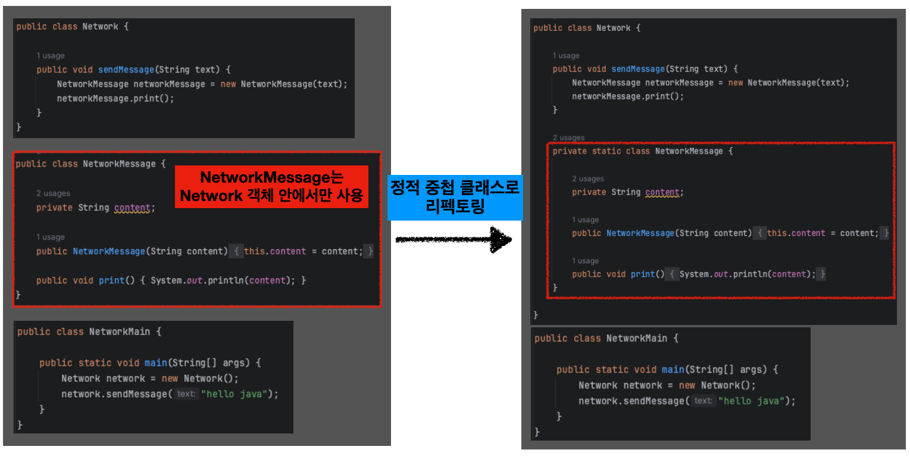 </p>

* 리펙토링 전에는 개발자는 `Network`과 `NetworkMessage`를 둘다 사용해야 하나 헷갈려할 것이다
  * 두 클래스의 코드를 직접 확인하고 나서야, `Network` 클래스만 사용하고, `NetworkMessage`는 `Network` 안에서만 사용된다는 것을 알 수 있을 것이다


* 어차피 `NetworkMessage`는 바깥에서 사용되는 클래스가 아니기 때문에, `Network` 안의 정적 중첩 클래스로 만들면 된다
* 리펙토링 후, 개발자는 `NetworkMessage`가 `Network` 클래스 내부에서만 단독으로 사용하는 클래스라고 바로 인지할 수 있다

<br>

---

## 3) 내부 클래스(Inner Class)

### 3.1 내부 클래스 소개

내부 클래스에 대해서 알아보자. 

<br>

```java
public class InnerOuter { // 바깥 클래스

    private static int outClassValue = 3;
    private int outInstanceValue = 2;
		
    // 내부 클래스
    class Inner {
        private int innerInstanceValue = 1;

        public void print() {
            // 자기 자신에 접근
            System.out.println(innerInstanceValue);

            // 외부 클래스의 인스턴스 멤버에 접근 가능, private도 접근 가능
            System.out.println(outInstanceValue);

            // 외부 클래스의 클래스 멤버에 접근 가능, private도 접근 가능
            System.out.println(outClassValue);
        }
    }
}
```

<p align="center">   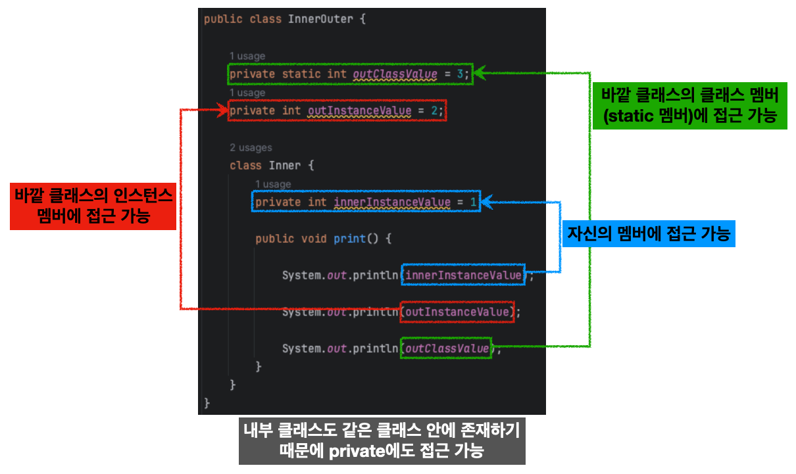 </p>

* 내부 클래스는 앞에 `static` 이 붙지 않는다
  * 쉽게 이야기해서 인스턴스 멤버가 된다


* 자신의 멤버에 접근 가능 (`innerInstanceValue`)
* 바깥 클래스의 인스턴스 멤버에 접근 가능 (`outInstanceValue`)
* 바깥 클래스의 클래스 멤버(`static` 멤버)에 접근 가능 (`outClassValue`)

<br>

```java
public class InnerOuterMain {

    public static void main(String[] args) {
        InnerOuter outer = new InnerOuter();
        InnerOuter.Inner inner = outer.new Inner();
        inner.print();

        System.out.println("innerClass = " + inner.getClass());

    }
}
```

<p align="center">   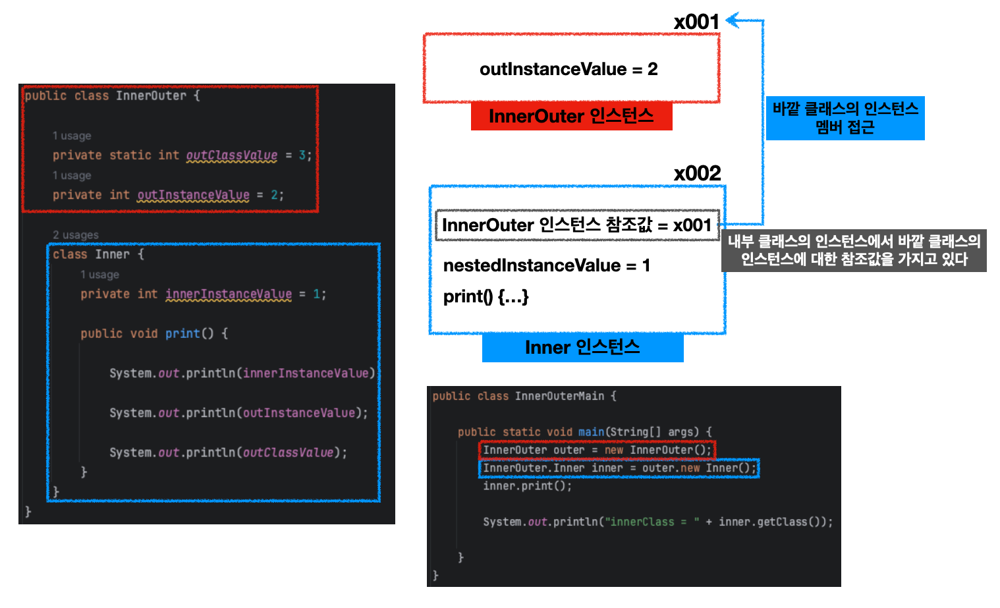 </p>

* `InnerOuter.Inner inner = outer.new Inner()` : 내부 클래스 생성
  * 내부 클래스는 바깥 클래스의 인스턴스에 소속되어야 한다
  * 따라서 내부 클래스를 생성할 때, 바깥 클래스의 인스턴스 참조가 필요하다
  * `outer` : 바깥 클래스의 인스턴스 참조를 가짐


* 내부 클래스는 바깥 클래스의 인스턴스에 소속된다,  따라서 바깥 클래스의 인스턴스 정보를 알아야 생성할 수 있다
  * 쉽게 말해서, 바깥 클래스의 인스턴스를 먼저 생성해야 내부 클래스의 인스턴스를 생성할 수 있다
  * 개념상 내부 클래스의 인스턴스는 바깥 클래스의 인스턴스 안에서 생성되는 걸로 이해하면 편하다 (실제 구현은 내부 인스턴스가 바깥 인스턴스의 참조 값을 보관한다)

<br>

정리하면, 내부 클래스는 바깥 클래스의 인스턴스 내부에서 구성 요소로 사용된다. 

<br>

---

### 3.2 내부 클래스를 사용하는 경우

내부 클래스를 어떻게 활용하는지 알아보자.

<br>

<p align="center">   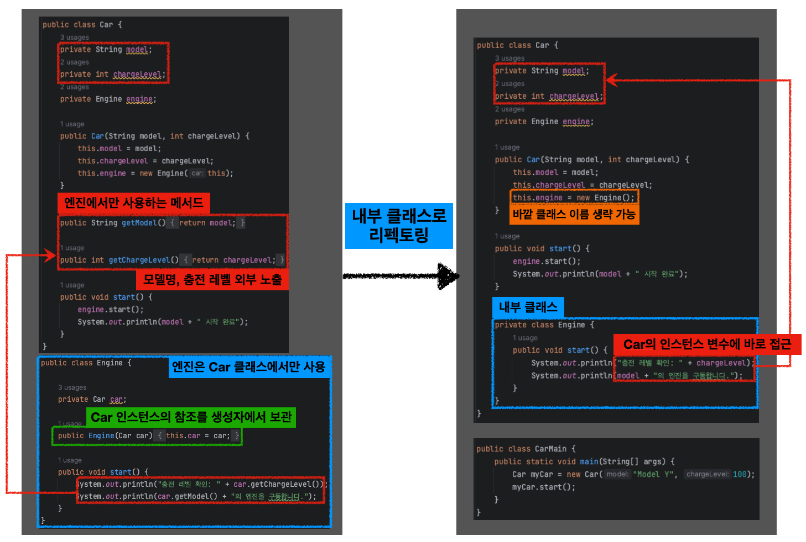 </p>

```java
public class CarMain {
    public static void main(String[] args) {
        Car myCar = new Car("Model Y", 100);
        myCar.start();
    }
}
```

* 리펙토링 전
  * `Engine` 클래스는 `Car` 클래스에서만 사용된다
  * `new Engine(this)` : `Engine` 인스턴스를 생성할 때 `Car` 자기 자신의 인스턴스를 넘겨줘야 함
  * 엔진을 시작하기 위해서 차의 충전 레벨과 모델명이 필요함
    * `Car` 인스턴스의 참조를 생성자에 보관
    * 충전 레벨과, 모델명 확인을 위한 메서드 필요 → 이 메서들은 엔진에서만 사용하고, 다른 곳에서는 사용하지 않는다
  * 결국 `Car` 클래스는 엔진에서만 사용하는 기능을 위해서 메서드를 추가해, 충전 레벨과 모델명을 외부에 노출해야 함


* `Engine`클래스를 내부 클래스로 리펙토링 후
  * `Car`의 인스턴스 변수인 `chargeLevel`, `model`에 직접 접근 가능
  * 바깥 클래스에서 내부 클래스의 인스턴스를 생성할 때 내부 클래스의 인스턴스는 자신을 생성한 바깥 클래스의 인스턴스를 자동으로 참조한다
  * 여기서 `new Engine()` 로 생성된 `Engine` 인스턴스는 자신을 생성한 바깥의 `Car` 인스턴스를 자동으로 참조한다


* 리펙토링을 통해서 `getModel()`, `getChargeLevel()`과 같은 메서드를 제거했다
  * 기존에는 해당 메서드들을 통해서 `Car` 클래스의 정보들이 추가로 외부에 노출되고 있기 때문에 캡슐화가 잘 되지 않았다
  * 메서드를 제거해서 결과적으로 꼭 필요한 메서드만 노출함으로써 `Car`의 캡슐화를 높일 수 있다

<br>

## 4) 지역 클래스(Local Class)

### 4.1 지역 클래스 소개

지역 클래스(Local Class)는 내부 클래스의 종류 중 하나이다. 따라서 내부 클래스의 특징을 그대로 가지고 있다.

<br>

<p align="center">   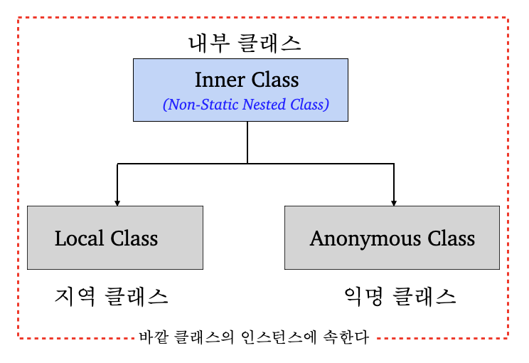 </p>

<p align='center'>지역 클래스는 내부 클래스</p>

*  지역 클래스는 내부 클래스이므로, 바깥 클래스의 멤버 변수에 직접 접근이 가능하다
* 지역 클래스는 지역 변수와 같이 코드 블럭 안에서 정의된다

<br>

```java
class Outer {

    public void process() { 
      
        // 지역 변수 - 지역 클래스가 접근 가능
        int localVar = 0; 
        
        // 지역 클래스
        class Local {
            //..    
        }
      
        Local local = new Local();
    } 
}
```

* 지역 클래스는 지역 변수처럼 코드 블럭 안에 클래스를 선언한다
* 지역 클래스는 지역 변수에 접근할 수 있음

<br>

---

### 4.2 지역 클래스 예시

예시를 통해 더 자세히 알아보자.

<br>

```java
public class LocalOuterV2 {

    private int outInstanceVar = 3; // 바깥 클래스의 인스턴스 멤버 변수에 접근 가능

    public void process(int paramVar) { // 지역 클래스는 자신이 속한 코드 블럭의 매개변수에 접근 가능

        int localVar = 1; // 지역 클래스는 자신이 속한 코드 블럭의 지역 변수에 접근 가능
				
      	// 지역 클래스 - 지역 클래스도 내부 클래스이다
        class LocalPrinter implements Printer { // 인터페이스 구현 가능
          
            int value = 0; // 자기 자신의 멤버 변수에 당연히 접근 가능

            @Override
            public void print() {
                System.out.println("value=" + value);
                System.out.println("localVar=" + localVar);
                System.out.println("paramVar=" + paramVar);
                System.out.println("outInstanceVar=" + outInstanceVar);
            }
        }

        LocalPrinter printer = new LocalPrinter();
        printer.print();
    }

    public static void main(String[] args) {
        LocalOuterV2 localOuter = new LocalOuterV2();
        localOuter.process(2);
    }
}
```


<p align="center">   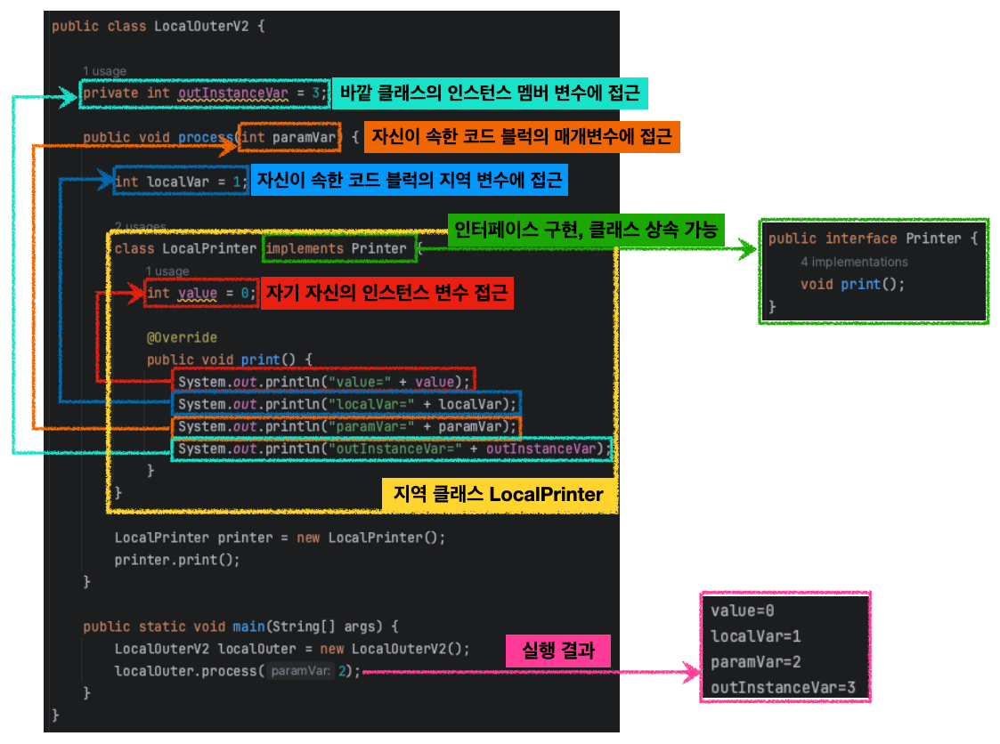 </p>

* 지역 변수는 내부 클래스의 한 종류이기 때문에, 내부 클래스가 가지는 특징을 전부 가진다
* 매개 변수도 지역 변수의 한 종류이다
* 내부 클래스를 포함한 중첩 클래스들도 일반 클래스 처럼 인터페이스를 구현하거나, 클래스를 상속할 수 있다

<br>

---

### 4.3 지역 변수 캡쳐(Variable Capture)

#### 4.3.1 지역 변수 캡쳐 동작 과정

지역 변수 캡쳐에 대해서 알아보자.

들어가기에 앞서 변수의 생명주기를 다시 한번 되짚어보고 가자.

* 클래스 변수(`static` 변수)
  * 메서드 영역(method area)에 존재
  * 클래스 정보를 읽어 들이는 순간부터 프로그램 종료까지 생존한다


* 인스턴스 변수(멤버 변수)
  * 힙 영역(heap area)에 존재
  * 본인이 소속된 인스턴스가 GC 되지 전까지 생존한다


* 지역 변수
  * 스택 영역의 스택 프레임 안에 존재한다
  * 메서드 호출이 되면서 생성이 되고, 메서드가 종료되면 스택 프레임이 제거 되면서 지역 변수도 제거된다
  * 대다수의 경우 클래스 변수, 인스턴스 변수에 비해 생존 주기가 아주 짧다

<br>

이제 지역 변수 캡쳐가 어떤 내용인지 예시를 통해서 한번 알아보자.

<br>

```java
public class LocalOuter {
    private int outInstanceVar = 3;

    public Printer process(int paramVar) {

        int localVar = 1;

        class LocalPrinter implements Printer {

            int value = 0;

            @Override
            public void print() {
                System.out.println("value=" + value);

                System.out.println("localVar=" + localVar);
                System.out.println("paramVar=" + paramVar);
                System.out.println("outInstanceVar=" + outInstanceVar);
            }
        }

        LocalPrinter printer = new LocalPrinter();
        return printer;
    }

    public static void main(String[] args) {
        LocalOuter localOuter = new LocalOuter();
        Printer printer = localOuter.process(2);

        printer.print();

        System.out.println("필드 확인");
        Field[] fields = printer.getClass().getDeclaredFields();
        for (Field field : fields) {
            System.out.println("field = " + field);
        }
    }
}
```

* 코드를 보면 대략적으로 다음의 순서로 코드가 실행된다

1. `main()` 스택 프레임이 올라감

2. `LocalOuter localOuter = new LocalOuter();` : `LocalOuter` 클래스의 인스턴스 생성 (바깥 클래스 인스턴스 생성)

3. `process()` 스택 프레임이 올라감

4. `LocalPrinter printer = new LocalPrinter();` : 지역 클래스 인스턴스를 생성

5. `return printer;` : 해당 지역 클래스 인스턴스 반환

6. `process()` 스택 프레임 종료 (스택 프레임 제거)

7. `print()` 스택 프레임 올라감

   * ```java
     @Override
     public void print() {
         System.out.println("value=" + value);
     	  System.out.println("localVar=" + localVar);
     	  System.out.println("paramVar=" + paramVar);
     	  System.out.println("outInstanceVar=" + outInstanceVar);
     }
     ```

<br>

<p align="center">   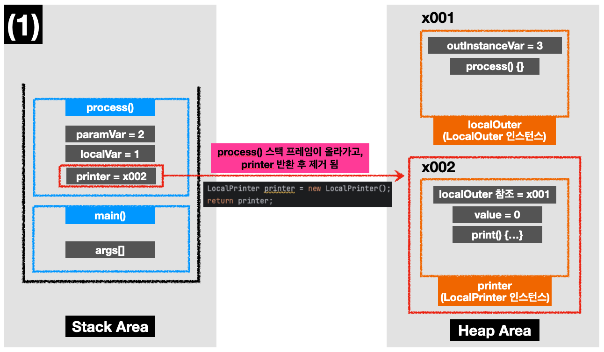 </p>

<br>

<p align="center">   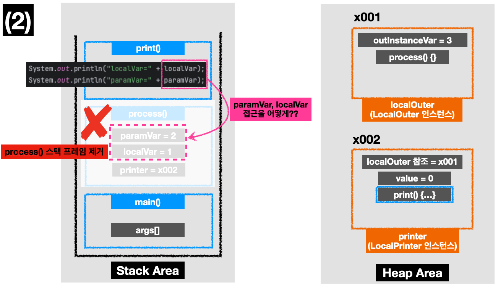 </p>

<br>

여기서 우리는 이상함을 느껴야한다. `print()` 스택 프레임 올라가고 메서드를 실행하면서 분명히, `localVar`과 `paramVar`를 사용한다(값이 정상적으로 출력된다). 그러나 이미 `process()` 스택 프레임이 제거되면서 `localVar`과 `paramVar`는 사라진 뒤다. 그러면 `print()`는 어떻게 두 지역변수를 사용하는 것일까?

여기서 자바는 **변수 캡쳐(Variable Capture)라는 것을 사용**한다. 실제로 일어나는 과정을 다음 그림으로 알아보자.

<br>

<p align="center">   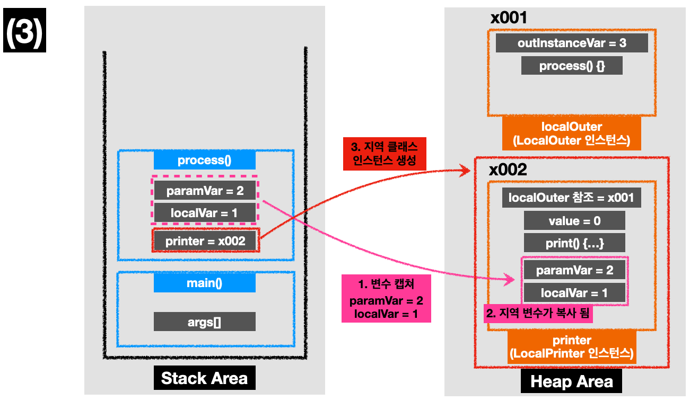 </p>

* `LocalPrinter`(지역 클래스) 인스턴스 생성 시도
  * 지역 클래스의 인스턴스를 생성할 때 지역 클래스가 접근하는 지역 변수를 확인한다
  * `print()` 에서 `paramVar`, `localVar`에 접근하는 것을 확인


* 지역 클래스가 사용하는 지역 변수를 복사한다
  * `paramVar`, `localVar`를 복사한다 (캡쳐 한다!)


* 복사한 지역 변수를 지역 클래스의 인스턴스에 포함한다
* 인스턴스의 생성을 완료한다

<br>

<p align="center">   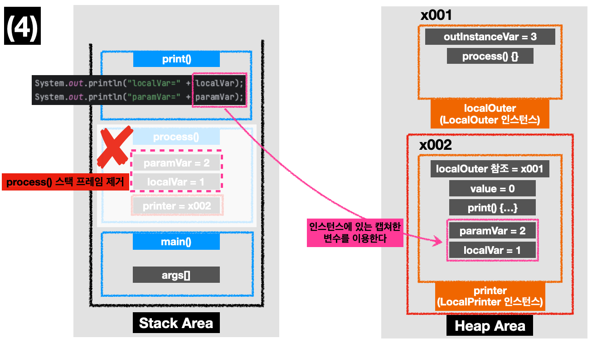 </p>

* 이제 캡쳐한 지역 변수를 지역 클래스 인스턴스를 통해서 접근할 수 있다
* 정리하자면 `paramVar`, `localVar`를 스택 영역의 지역 변수에 접근하는 것이 아니라, 지역 클래스 인스턴스에 있는 캡쳐한 변수에 접근한다 (어차피 스택 프레임이 제거 되면서 스택 영역의 변수는 접근하지도 못함)
* 결론적으로 변수 캡쳐를 통해서 지역 변수와 지역 클래스를 통해 생성한 인스턴스의 생명주기가 다른 문제를 해결한다

<br>

---

#### 4.3.2 effectively `final`

지역 클래스가 접근하는 지역 변수는 절대로 중간에 값이 변하면 안된다. 따라서 `final`로 선언하거나, 사실상(effectively) `final`이어야 함.

> 사실상 `final`이라는 것은 지역 변수에 `final` 키워드를 사용하지 않았지만, 값을 변경하지 않은 지역 변수를 뜻한다.
>
> 어차피 지역 클래스가 접근하는 지역 변수에 자바 컴파일러는 `final`을 강제한다. 지역 변수의 값을 변경하려고 시도하면 컴파일 오류가 뜸.

<br>

지역 클래스가 접근하는 지역 변수는 왜 중간에 값이 바뀌면 안되는지 알아보자.

<br>

<p align="center">   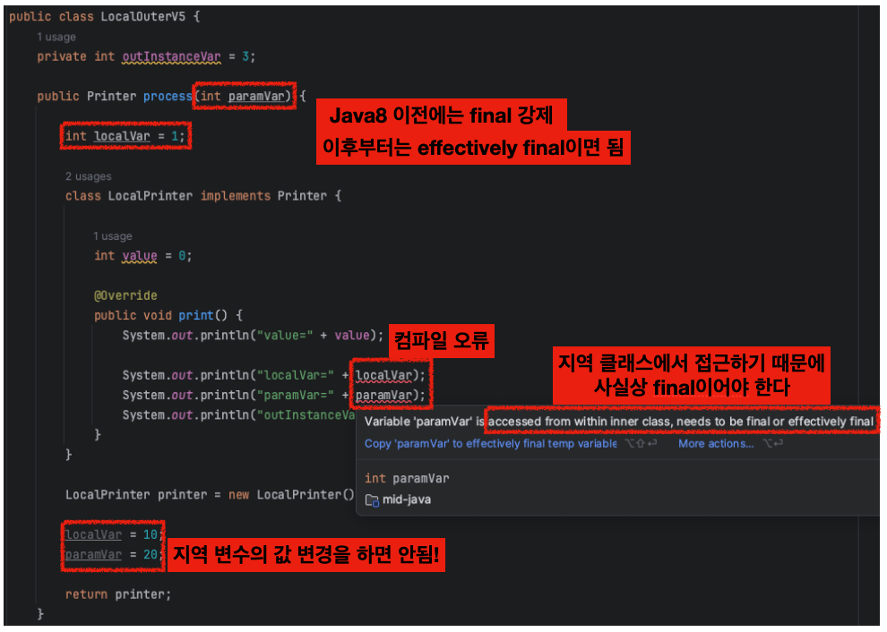 </p>

* 캡쳐 변수의 값을 변경하면 안되는 이유
  * 지역 변수의 값을 변경하면 인스턴스에 캡처한 변수의 값도 변경해야 한다
  * 반대로 인스턴스에 있는 캡처 변수의 값을 변경하면 해당 지역 변수의 값도 다시 변경해야 한다
  * 개발자 입장에서 예상하지 못한 곳에서 값이 변경될 수 있기 때문에 디버깅을 어렵게 한다
  * 지역 변수의 값과 인스턴스에 있는 캡처 변수의 값을 서로 동기화해야 함
    * 멀티 쓰레드 상황에서 이를 구현하기는 어려움 (Thread safety)


* **정리하자면, 그냥 지역 클래스가 접근하는 지역 변수의 값은 변경하면 안된다!**

<br>

---

## 5) 익명클래스(Anonymous Class)

### 5.1 익명 클래스 소개

* 지역 클래스의 특별한 종류 중 하나
* 이름이 없는 일회용 클래스
* 정의와 생성을 동시에 한다

<br>

우리가 사용했던 이전 예시를 익명 클래스로 만들어보자.

<br>

```java
public class AnonymousOuter {

    private int outInstanceVar = 3;

    public void process(int paramVar) {

        int localVar = 1;
      
				// 익명 클래스 정의와 생성 (Printer 인터페이스를 구현)
      	// 클래스의 인스턴스를 참조할 수 있는 참조 변수를 사용
        Printer printer = new Printer() { // 익명이라는 말 그대로 이름이 없음
            int value = 0;

            @Override
            public void print() {
                System.out.println("value=" + value);
                System.out.println("localVar=" + localVar);
                System.out.println("paramVar=" + paramVar);
                System.out.println("outInstanceVar=" + outInstanceVar);
            }
        };

        printer.print();
        System.out.println("printer.class=" + printer.getClass());
    }

    public static void main(String[] args) {
        AnonymousOuter main = new AnonymousOuter();
        main.process(2);
    }
}
```

<p align="center">   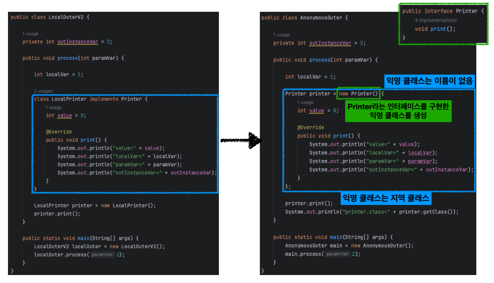 </p>

* 익명 클래스는 클래스의 본문(body)을 정의하면서 동시에 생성
* 익명 클래스는 부모 클래스를 상속 받거나, 또는 인터페이스를 구현해야 한다
  * 무조건 상위 클래스 또는 인터페이스 필요
* 익명 클래스는 말 그대로 이름이 없음

<br>

---

### 5.2 익명 클래스를 사용하는 경우

익명 클래스를 활용해보자.

<br>

다음과 두 개의 메서드가 실행되는 코드가 있다고 해보자.

```java
public class BeforeRefactorMain {
    public static void helloDice() {
      
        System.out.println("프로그램 시작");

        //코드 조각 시작
        int randomValue = new Random().nextInt(6) + 1;
        System.out.println("주시위 = " + randomValue);
        //코드 조각 종료

        System.out.println("프로그램 종료");
    }

    public static void helloSum() {
        System.out.println("프로그램 시작");

        //코드 조각 시작
        for (int i = 0; i < 3; i++) {
            System.out.println("i = " + i);
        }
        //코드 조각 종료

        System.out.println("프로그램 종료");
    }

    public static void main(String[] args) {
        helloDice();
        helloSum();
    }
}
```

```
프로그램 시작
주시위 = 3
프로그램 종료
프로그램 시작
i = 0
i = 1
i = 2
프로그램 종료
```

* 하나의 메서드에서 실행할 수 있도록 익명 클래스를 활용 해보자


* 코드를 분석해보자
  * 프로그램 시작, 종료를 출력하는 부분은 변하지 않음
  * 코드 조각의 시작과 종료까지 하는 부분은 변하는 부분이다
  * 하나의 메서드로 리팩토링 하기 위해서는 변하는 코드 조각 부분을 메서드가 전달 받아야한다


이제 외부에서 코드를 전달 받기 위해서 익명 클래스로 리펙토링 하는 과정을 다음 그림으로 살펴보자. 

<br>

```java
public interface Process {
    void run();
}
```

<p align="center">   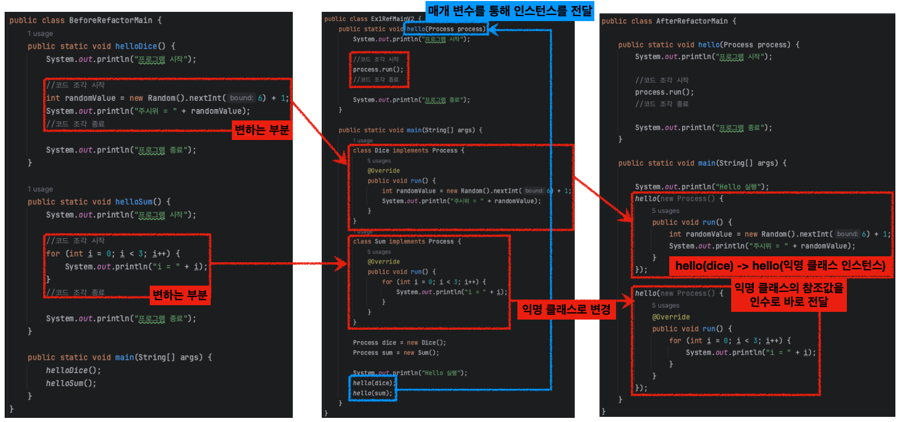 </p>

* 외부에서 코드 조각을 전달하기 위해서 인스턴스를 전달하고, 인스턴스에 있는 메서드를 호출하면 된다


* `Dice`, `Sum` 클래스는 `Process` 인터페이스를 구현하고, `run()` 메서드를 구현한다
  * 전달할 코드를 `run()`에 구현하면 된다


* 위의 예시에서는 지역 클래스를 사용했지만, 인스턴스를 전달하는 방식 자체는 그냥 외부에 클래스를 만들어서 사용하는 것도 가능하다


* `hello(Process process)` : `process` 매개변수를 통해서 인스턴스를 전달할 수 있다
  * 예) `hello(dice)`, `hello(sum)`
  * 전달한 인스턴스의 `run()` 메서드를 호출하면서, 필요한 코드를 실행할 수 있다


* 위의 예시에서 지역 클래스로 리펙토링한 코드를 다시 익명 클래스를 이용하도록 리팩토링하고 있다

  * 이때 익명 클래스의 참조값을 `hello()`에 바로 전달해서 사용하고 있다

  * 만약 바로 전달하지 않고 익명 클래스를 사용한다면 다음과 같이 사용했을 것이다

  * ```java
    Process dice = new Process() {
        @Override
        public void run() {
            int randomValue = new Random().nextInt(6) + 1;
            System.out.println("주시위 = " + randomValue);
        }
    };
    
    Process sum = new Process() {
        @Override
        public void run() {
            for (int i = 0; i < 3; i++) {
                System.out.println("i = " + i);
            }
        }
    };
    ```

<br>

> 만약 위의 예시를 람다(Lambda)를 사용하도록 리팩토링 한다면?
>
> ```java
> hello(() -> {
>     int randomValue = new Random().nextInt(6) + 1;
>     System.out.println("주시위 = " + randomValue);
> });
> 
> hello(() -> {
>     for (int i = 0; i < 3; i++) {
>         System.out.println("i = " + i);
>     }
> });
> ```
>
> * 클래스나 인스턴스를 정의하지 않고, 메서드(함수)의 코드 블럭을 직접 전달해서 사용

<br>

**익명 클래스를 사용하는 경우**

* 클래스를 별도로 정의하지 않고도 인터페이스나 추상 클래스를 즉석에서 구현할 수 있어 코드가 더 간결해진다
* 지역 클래스가 일회성으로 사용되는 경우나 간단한 구현을 제공할 때 사용한다

<br>

**익명 클래스를 사용하기 힘든 경우**

* 익명 클래스는 단 한 번만 인스턴스 생성이 가능하다
  * 만약 여러번 생성이 필요하다면 익명 클래스 사용 불가
