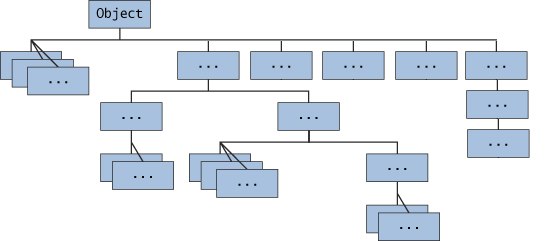
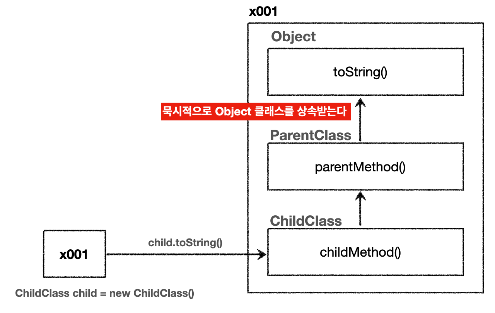

## Table of Contents

1. [`Object` 클래스](https://github.com/seungki1011/Data-Engineering/tree/main/java/(022)%20Object%2C%20String%20Class#1-object-%ED%81%B4%EB%9E%98%EC%8A%A4)
   * `java.lang` 패키지
   * [`Object` 클래스 소개](https://github.com/seungki1011/Data-Engineering/tree/main/java/(022)%20Object%2C%20String%20Class#12-object-%ED%81%B4%EB%9E%98%EC%8A%A4-%EC%86%8C%EA%B0%9C)
   * `Object` 배열
   * `toString()`
   * [`equals()`](https://github.com/seungki1011/Data-Engineering/tree/main/java/(022)%20Object%2C%20String%20Class#15-equals)
2. [`String` 클래스](https://github.com/seungki1011/Data-Engineering/tree/main/java/(022)%20Object%2C%20String%20Class#2-string-%ED%81%B4%EB%9E%98%EC%8A%A4)
   * `String` 클래스 소개
   * [`String` 객체 비교](https://github.com/seungki1011/Data-Engineering/tree/main/java/(022)%20Object%2C%20String%20Class#22-string-%EA%B0%9D%EC%B2%B4-%EB%B9%84%EA%B5%90)
   * `String`은 불변 객체
   * [`String` 메서드](https://github.com/seungki1011/Data-Engineering/tree/main/java/(022)%20Object%2C%20String%20Class#24-string-%EB%A9%94%EC%84%9C%EB%93%9C)
     * 문자열 정보 조회
     * 문자열 비교
     * 문자열 검색
     * 문자열 조작 및 변환
     * 문자열 분할 및 조합
     * 기타
   * [`StringBuilder`](https://github.com/seungki1011/Data-Engineering/tree/main/java/(022)%20Object%2C%20String%20Class#25-stringbuilder)

---

## 1) `Object` 클래스

### 1.1 `java.lang` 패키지

Java를 이루는 가장 기본이 되는 클래스들을 보관하는 패키지이다.

* `Object` : 모든 자바 객체의 부모 클래스(가장 최상위 클래스)
* `String` : 문자열
* `Integer`, `Double`, `Long` : 래퍼 클래스, 원시형 데이터 타입을 객체로 만든 것
* `Class` : 클래스 메타 정보
* `System` : 시스템과 관련된 기본 기능들 제공

<br>

`java.lang` 패키지는 모든 자바 애플리케이션에 자동 임포트(`import`) 된다.

먼저 `Object` 클래스에 대해서 알아보자.

<br>

---

### 1.2 `Object` 클래스 소개

 `Object` 클래스에 대해서 알아보자.

<br>

<p align="center">    </p>

<p align='center'>https://www.cs.auckland.ac.nz/references/java/java1.5/tutorial/java/IandI/subclasses.html</p>

* 자바에서 모든 클래스의 최상위 부모 클래스는 항상 `Object` 클래스 
* 아무 클래스도 상속 받지 않으면 묵시적으로 `Object` 클래스를 상속 받는다
  * `extends Object`

<br>

부모 클래스(`ParentClass`)와 부모 클래스를 상속 받는 자식 클래스(`ChildClass`)가 있다고 하자. `ParentClass`는 `Object` 클래스를 묵시적으로 상속 받았기 때문에 메모리에도 함께 생성된다.

<p align="center">    </p>

<p align='center'>Object 상속</p>

* `child.toString()` 호출
* 자기 자신의 타입인 `ChildClass`에 `toString()` 메서드를 찾는다. 없을 경우 상위 클래스로 올라가서 찾는다
* 찾다 보면 가장 최상위 클래스인 `Object`에서 `toString()`을 찾고 호출한다

<br>

`Object` 클래스가 최상위 클래스로 존재하는 이유.

* 공통 기능을 제공한다
  * 객체의 정보 제공, 비교, 클래스 확인, 등과 같은 기능은 모든 객체가 필요한 기능
  * `Object`는 이런 메서드들을 공통을 제공해준다
  * `toString()`
  * `equals()` : 객체가 서로 같은지 비교
  * `getClass()` : 객체의 클래스 정보 제공
  * 이외에도 여러가지 기능


* 다형성의 기본을 구현한다
  * 다형성을 지원하는 기본적인 메커니즘을 제공한다
  * 모든 자바 객체는 `Object` 타입으로 처리할 수 있고, 이는 다양한 타입의 객체를 통합적으로 처리가능하게 해준다
  * 쉽게 말해서 `Object`는 모든 타입의 객체를 담을 수 있다

<br>

---

### 1.3 `Object` 배열

 `Object`는 모든 타입의 객체를 담을 수 있다. 따라서 `Object[]`를 만들면 모든 타입의 객체를 담을 수 있는 배열을 만들 수 있다.

<br>

```java
class Item {
  
    String name = "Im a item";

    void itemMethod() {
        System.out.println("---itemMethod() called---");
    }

    @Override
    public String toString() {
        return "item"+"{ name = "+name+" }";
    }
}
```

```java
class Person {
  
    String name = "Im a person";
    int age = 50;

    void personMethod() {
        System.out.println("---personMethod() called---");
        System.out.println("name = " + name);
        System.out.println("age = " + age);
        System.out.println("---------------------------");

    }
}
```

```java
public class ObjectTest1 {
    public static void main(String[] args) {

        Item item = new Item();
        Person person = new Person();
        Object object = new Object(); // Object 인스턴스도 생성 가능

        Object[] objects = {item, person, object}; 
				
        size(objects);

    }

    private static void size(Object[] objects) {
        System.out.println("The number of objects : " + objects.length);
    }
}
```

```
The number of objects : 3
```

* `size(Object[] objects)` 메서드는 배열에 담긴 객체의 수를 세는 역할을 담당

<br>

---

### 1.4 `toString()`

* `Object.toString()` 메서드는 객체의 정보를 문자열 형태로 제공한다
* 디버깅과 로깅에 활용할 수 있다
*  `Object` 클래스에 정의되므로 모든 클래스에서 상속받아 오버라이딩 해서 사용할 수 있다

<br>

```java
public class ObjectTest2 {
    public static void main(String[] args) {
      
        Object object = new Object();
        String string = object.toString();

        //toString() 반환값 출력
        System.out.println(string);
        
        //object 직접 출력
        System.out.println(object);
    }
}
```

```
java.lang.Object@5ca881b5
java.lang.Object@5ca881b5
```

* `Object`가 제공하는 `toString()` 메서드는 기본적으로 패키지를 포함한 객체의 이름과 객체의 참조값(해시 코드)를 16진수로 제공한다

* ```java
  // 객체 이름 + @ + 객체의 해시 코드(참조값)
  public String toString() {
      return getClass().getName() + "@" + Integer.toHexString(hashCode());
  }
  ```

<br>

`Object` 배열의 예시를 다시 가져와보자.

```java
public class ObjectTest3 {
    public static void main(String[] args) {

        Item item = new Item();
        Person person = new Person();
        Object object = new Object();

        Object[] objects = {item, person, object};


        System.out.println(objects[0].toString());
        System.out.println(objects[0]); // println(objects[0].toString())와 동일

        System.out.println(item.toString());
        System.out.println(item); // println(item.toString())와 동일
        
        item.itemMethod();
        person.personMethod();
    }
}
```

```
item{ name = Im a item }
item{ name = Im a item }
item{ name = Im a item }
item{ name = Im a item }
---itemMethod() called---
---personMethod() called---
name = Im a person
age = 50
---------------------------
```

* `System.out.println()` 메서드는 내부에서 `toString()`을 호출한다
* 쉽게 말해서  `println()`을 사용할 때, `toString()`을 직접 호출할 필요 없이 객체를 바로 전달하면 객체의 정보를 출력 할 수 있다

<br>

만약 `toString()`을 오버라이딩 할 때 객체의 참조값을 출력하고 싶으면 다음과 같이 사용하면 된다.

```java
String refValue = Integer.toHexString(System.identityHashCode(item));
 System.out.println("refValue = " + refValue);
```

<br>

---

### 1.5 `equals()`

`Object`는 동등성 비교를 위한 `equals()` 메서드를 제공한다.

자바는 **"두 객체가 같다"**라는 표현을 2가지로 분리해서 제공한다.

* 동일성(identity) : `==` 연산자를 사용해서 두 객체의 참조가 동일한 객체를 가리키고 있는지 확인(객체 주소가 동일한지 확인)
  * 동일하다는 것은 완전히 같다는 뜻
  * 메모리 참조가 기준


* 동등성(equality) : `equals()` 메서드를 사용해서 두 객체가 논리적으로 동등한지 확인
  * 동등하다는 것은 가치나 수준이 같지만, 그 형태나 외관은 완전히 같지 않을 수 있다
  * 사람이 생각하는 논리적 기준에 맞추어 비교

<br>

예시를 통해 알아보자.

```java
User a = new User("id001") // 참고(객체 주소) : x001
User b = new User("id001") // 참고(객체 주소) : x002 
```

* 두 객체는 서로 물리적으로 다른 메모리에 위치하는 서로 다른 객체이다
* 회원 번호를 기준으로 논리적으로 같은 회원(`"id001"`)
* 동일하지 않지만, 동등하다

<br>

`equals()`를 사용하기 위해서는 `equals()`를 오버라이딩 해서 구현해야 한다. 그렇지 않으면 기본적으로 `==`와 비슷하게 참조 동일성을 확인하려고 한다. 그러나, `Strings`의 겨우, 자바에서도 특별한 클래스에 속하기 때문에 이미 `equals()`가 동등성을 확인하도록 오버라이딩 되어있다. 문자열 객체는 뒤에서 더 자세히 알아보자.

<br>

```java
public class EqualsTest {
    public static void main(String[] args) {
      
        String s1 = new String("Hello world!");
        String s2 = new String("Hello world!");

        // 1. s1과 s2는 똑같이 "Hello world!"로 값이 똑같다
        boolean isEqual = s1.equals(s2);
        System.out.println("s1과 s2는 동등한가? : " + isEqual);

        // 2. s1과 s2는 new String()으로 생성이 되었기 때문에 heap 메모리에 서로 다른 객체가 생성된다
        // s1과 s2는 동일하지 않다
        boolean isSameObject = (s1 == s2);
        System.out.println("s1과 s2는 동일한가? : " + isSameObject);

        // 3. literal로 String을 생성하면 string pool에 있는 같은 메모리를 참조한다
        String s3 = "Hello world!";
        String s4 = "Hello world!";

        // s3와 s4는 "Hello world!"로 값이 같다
        boolean isEqual2 = s3.equals(s4);
        System.out.println("s3와 s4는 동등한가? : " + isEqual2);

        // s3와 s4는 literal로 String을 생성했기 때문에 string pool의 같은 메모리 참조
        // s3와 s4는 동일하다
        boolean isSameObject2 = (s3 == s4);
        System.out.println("s3과 s4는 동일한가? : " + isSameObject2);
        
    }
}
```

* 리터럴로 `String` 객체 생성시 `string pool`에 넣는다
  * 만약 `"Hello World!"`라는 리터럴로 생성했다고 가정하면 `string pool`에 같은 문자열이 있는 확인하고, 만약 존재하면 해당 `String` 객체를 사용한다
  * 쉽게 말해서 리터럴로 `String` 객체 생성시 값이 같으면 같은 객체 주소를 참조한다


* `new String()`으로 `String` 객체 생성시 `heap 메모리`에 서로 다른 객체가 생성된다
  * 값이 같더라도 동일성을 확인하면 서로 다른 객체임을 확인할 수 있다


* `String`은 `equals()`를 굳이 구현하지 않아도 동등성 확인을 위해 사용할 수 있다

<br>

사용자 정의 클래스에서 `equals()`를 구현해보자. 사용자 정의 클래스에서는 어떤 필드에 의해 동등성을 정할 것인지 기준을 세울 수 있다.

<br>

```java
public class UserV2 {
  
    private String id;

    public UserV2(String id) {
        this.id = id;
    }
    
  
  	// IDE를 이용해서 구현하면 된다
    @Override
    public boolean equals(Object o) {
        if (this == o) return true; // 동일하면 바로 true 반환
        if (o == null || getClass() != o.getClass()) return false; // o가 null이거나, UserV2와 다른 클래스이면 false 반환
        UserV2 userV2 = (UserV2) o; // Object o를 UserV2 userV2로 캐스팅
        return Objects.equals(id, userV2.id); // id로 비교, id가 같으면 true 반환
    }

    @Override
    public int hashCode() { 
        return Objects.hash(id); // id 필드에 따라 UserV2 객체에 대한 해쉬코드 생성
    }
}
```

* 동등성 비교가 항상 필요한 것은 아님, 필요한 경우에만 `equals()`를 재정의하면 된다
* `equals()`와 `hashCode()`는 보통 함께 사용된다
* `hashCode()`를 오버라이딩 하는 이유
  * 만약 두 객체가 동등하면, 서로 해시 코드(hash code)도 똑같도록 설계하는 것이 해시 기반(hash-based)의 컬렉션(`collection`)의 성능을 보장한다

<br>

---

## 2) `String` 클래스

### 2.1 `String` 클래스 소개

자바에서 문자를 다루는 대표적인 2 가지 타입.

* `char` 

  * 기본형
  * 문자 하나를 다룸
  * 여러 문자를 다루기 위해서는 `char[]`사용 → 불편하기 때문에 자바는 `String` 클래스를 제공

   

* `String`

  * `String`은 클래스
    * 클래스 중에서도 조금 특별하다
  * 참조형이다
  * 문자열을 다룬다

<br>

`String` 클래스는 구조는 대략적으로 다음과 같이 생겼다.

```java
public final class String {
  //문자열 보관
  private final char[] value; // 자바 9 이전 
  private final byte[] value; // 자바 9 이후
  
  //여러 메서드
  public String concat(String str) {...} 
  public int length() {...}
  
  //이하 생략...
}
```

* `private final byte[] value;` 
  * `String`의 실제 문자열 값이 보관
  * 문자 데이터 자체는 `char[]`(Java 9 이후 `byte[]`)에 보관
  * 개발자가 직접 다루기 불편한 `char[]`을 내부에 감췄다
  * 편리하게 문자열을 다룰 수 있는 수 있도록 다양한 메서드를 제공

<br>

`String`은 참조형이다. 그래서 원래 같으면 문자열을 더하는 연산에 `+`를 사용하지 못하고, `concat()`과 같은 메서드를 사용해야 한다. 그러나 문자열은 특성상 자주 다루어지기 때문에 자바에서 편의상 `+` 연산을 제공해준다.

<br>

---

### 2.2 `String` 객체 비교

`String` 객체 끼리 비교할 때는 `==`가 아닌 `equals()`로 비교를 해야한다.

이전의 `equals()`에서 한번 다뤘던 예시를 다시보자.

<br>

```java
public class EqualsTest {
    public static void main(String[] args) {
      
        String s1 = new String("Hello world!");
        String s2 = new String("Hello world!");

        // 1. s1과 s2는 똑같이 "Hello world!"로 값이 똑같다
        boolean isEqual = s1.equals(s2);
        System.out.println("s1과 s2는 동등한가? : " + isEqual);

        // 2. s1과 s2는 new String()으로 생성이 되었기 때문에 heap 메모리에 서로 다른 객체가 생성된다
        // s1과 s2는 동일하지 않다
        boolean isSameObject = (s1 == s2);
        System.out.println("s1과 s2는 동일한가? : " + isSameObject);

        // 3. literal로 String을 생성하면 string pool에 있는 같은 메모리를 참조한다
        String s3 = "Hello world!";
        String s4 = "Hello world!";

        // s3와 s4는 "Hello world!"로 값이 같다
        boolean isEqual2 = s3.equals(s4);
        System.out.println("s3와 s4는 동등한가? : " + isEqual2);

        // s3와 s4는 literal로 String을 생성했기 때문에 string pool의 같은 메모리 참조
        // s3와 s4는 동일하다
        boolean isSameObject2 = (s3 == s4);
        System.out.println("s3과 s4는 동일한가? : " + isSameObject2);
        
    }
}
```

* 리터럴로 `String` 객체 생성시 `string pool`에 넣는다
  * 만약 `"Hello World!"`라는 리터럴로 생성했다고 가정하면 `string pool`에 같은 문자열이 있는 확인하고, 만약 존재하면 해당 `String` 객체를 사용한다
  * 쉽게 말해서 리터럴로 `String` 객체 생성시 값이 같으면 같은 객체 주소를 참조한다
  * `string pool`을 통해서 메모리와 성능 최적화
  * `string pool`은 `heap 영역`을 사용한다
  * `string pool`에서 문자열을 찾을 때는 해시 알고리즘을 사용한다


* `new String()`으로 `String` 객체 생성시 `heap 영역`에 서로 다른 객체가 생성된다
  * 값이 같더라도 동일성을 확인하면 서로 다른 객체임을 확인할 수 있다


* `String`은 `equals()`를 굳이 구현하지 않아도 동등성 확인을 위해 사용할 수 있다
  * `String`은 클래스 중에서도 특별한편에 속하기 때문에, 이미 오버라이딩 되어 있다

<br>

---

### 2.3 `String`은 불변 객체

`String`은 [불변 객체(immutable object)](https://github.com/seungki1011/Data-Engineering/tree/main/java/(027)%20Immutable%20Object#2-%EB%B6%88%EB%B3%80-%EA%B0%9D%EC%B2%B4immutable-object)이다. 생성 이후에 절대로 내부의 값을 변경할 수 없다.

* `private final byte[] value;`
* 불변이기 때문에, `String` 값을 다루는 메서드들은 전부 반환값이 있다

<br>

코드로 알아보자.

```java
public class StringTest1 {
    public static void main(String[] args) {
      
        String str1 = "Hello";
        String str2 = " world!";

        str1.concat(str2); // 그냥 메서드를 호출하는 것만으로는 아무것도 못한다

        // String은 불변이기 떼문에 값을 변경하는 메서드는 무조건 객체를 반환한다
        String str3 = str1.concat(str2);
        System.out.println("str1 = " + str1);
        System.out.println("str2 = " + str2);
        System.out.println("str3 = " + str3);

    }
}
```

```
str1 = Hello
str2 =  world!
str3 = Hello world!
```

<br>

---

### 2.4 `String` 메서드

`String` 클래스는 문자열을 편리하게 다루기 위한 다양한 메서드를 제공한다.

* API 문서 : [https://docs.oracle.com/javase/8/docs/api/java/lang/String.html](https://docs.oracle.com/javase/8/docs/api/java/lang/String.html)

<br>

코드로 알아보자.

<br>

#### 2.4.1 문자열 정보 조회

```java
public class StringTest2 {
    public static void main(String[] args) {
      
        String str = "광물 기타 중요한 지하자원·수산자원·수력과 경제상 이용할 수 있는 " +
                "자연력은 법률이 정하는 바에 의하여 일정한 기간 그 채취·개발 또는 이용을 특허할 수 있다.";

        System.out.println("문자열 길이 = " + str.length());
        System.out.println("문자열 비어 있나요? = " + str.isEmpty());
        System.out.println("믄자열 비어 있거나 공백이 있나요? = " + str.isBlank()); // Java 11 부터
        System.out.println("4번 인덱스의 문자 = " + str.charAt(4));

    }
}
```

```
문자열 길이 = 88
문자열 비어 있나요? = false
믄자열 비어 있거나 공백이 있나요? = false
4번 인덱스의 문자 = 타
```

* `length()` : 문자열의 길이를 반환한다
* `isEmpty()` : 문자열이 비어 있는지 확인한다 (길이가 0)
* `isBlank()` : 문자열이 비어 있는지 확인한다 (길이가 0이거나 공백만 있는 경우)
  * 공백 : `""`
* `charAt(int index)` : 지정된 인덱스에 있는 문자를 반환한다

<br>

---

#### 2.4.2 문자열 비교

```java
public class StringTest3 {
    public static void main(String[] args) {
      
        String str1 = "As the sun dipped below the horizon, painting the sky in hues of orange and pink," +
                " a sense of serenity washed over the tranquil seaside village of Polppero.";

        String str2 = "as the sun dipped below the horizon, painting the sky in hues of orange and pink," +
                " a sense of serenity washed over the tranquil seaside village of polppero.";
        

        System.out.println("str1 equals str2 = " + str1.equals(str2));
        System.out.println("str1 equalsIgnoreCase str2 = " + str1.equalsIgnoreCase(str2));

        System.out.println("'banana' compareTo 'apple' = " + "banana".compareTo("apple"));

        System.out.println("str1 starts with 'As' = " + str1.startsWith("As"));
        System.out.println("str1 ends with 'polperro.' = " + str1.endsWith("polperro."));
    }
}
```

```
str1 equals str2 = false
str1 equalsIgnoreCase str2 = true
'banana' compareTo 'apple' = 1
str1 starts with 'As' = true
str1 ends with 'polperro.' = false
```

* `equals(Object anObject)` : 두 문자열이 동일한지 비교한다
* `equalsIgnoreCase(String anotherString)` : 두 문자열을 대소문자 구분 없이 비교한다
* `compareTo(String anotherString)` : 두 문자열을 사전 순으로 비교한다
* `compareToIgnoreCase(String str)` : 두 문자열을 대소문자 구분 없이 사전적으로 비교한다
* `startsWith(String prefix)` : 문자열이 특정 접두사로 시작하는지 확인한다
* `endsWith(String suffix)` : 문자열이 특정 접미사로 끝나는지 확인한다

<br>

---

#### 2.4.3 문자열 검색

```java
public class StringTest4 {
    public static void main(String[] args) {
      
        String str = "As the sun dipped below the horizon, painting the sky in hues of orange and pink," +
                " a sense of serenity washed over the tranquil seaside village of Polppero.";

        System.out.println("문자열에 'tranquil'가 포함되어 있나요? =  " + str.contains("tranquil"));
        System.out.println("첫 번째 'sum'이 등장하는 인덱스: " + str.indexOf("sun"));
        System.out.println("인덱스 5부터 'sun'의 인덱스: " + str.indexOf("sun", 5));
        System.out.println("인덱스 10부터 'sun'의 인덱스: " + str.indexOf("sun", 10));
        System.out.println("'the'의 마지막 인덱스: " + str.lastIndexOf("the"));
        
    }
}
```

```
문자열에 'tranquil'가 포함되어 있나요? =  true
첫 번째 'sum'이 등장하는 인덱스: 7
인덱스 5부터 'sun'의 인덱스: 7
인덱스 10부터 'sun'의 인덱스: -1
'the'의 마지막 인덱스: 114
```

* `contains(CharSequence s)` : 문자열이 특정 문자열을 포함하고 있는지 확인한다
* `indexOf(String ch)` / `indexOf(String ch, int fromIndex)` : 문자열이 처음 등장하는 위치를 반환한다
* `lastIndexOf(String ch)` : 문자열이 마지막으로 등장하는 위치를 반환한다

<br>

---

#### 2.4.4 문자열 조작 및 변환

```java
public class StringTest5 {
    public static void main(String[] args) {
      
        String str = "The verdant meadows stretched out before us.";

        System.out.println("인덱스 7부터의 부분 문자열 = " + str.substring(7));
        System.out.println("인덱스 7부터 12까지의 부분 문자열 = " + str.substring(7, 12));
        System.out.println("문자열 + '..' 결합 = " + str.concat(".."));

        System.out.println("'meadows'을 'mountain'으로 대체: " + str.replace("meadows", "mountain"));
        System.out.println("첫 번째 'The'를 'Those'로 대체: " + str.replaceFirst("The", "Those"));
    }
}
```

```
인덱스 7부터의 부분 문자열 = dant meadows stretched out before us.
인덱스 7부터 12까지의 부분 문자열 = dant 
문자열 + '..' 결합 = The verdant meadows stretched out before us...
'meadows'을 'mountain'으로 대체: The verdant mountain stretched out before us.
첫 번째 'The'를 'Those'로 대체: Those verdant meadows stretched out before us.
```

* `substring(int beginIndex)` / `substring(int beginIndex, int endIndex)` : 문자열의 부분 문자열을 반환한다
* `concat(String str)` : 문자열의 끝에 다른 문자열을 붙인다
* `replace(CharSequence target, CharSequence replacement)` : 특정 문자열을 새 문자열로 대체 한다
* `replaceAll(String regex, String replacement)` : 문자열에서 정규 표현식과 일치하는 부분을 새 문자열로 대체한다
* `replaceFirst(String regex, String replacement)` : 문자열에서 정규 표현식과 일치하는 첫 번째 부분을 새 문자열로 대체한다

<br>

```java
public class StringTest6 {
    public static void main(String[] args) {
      
        String strWithSpace = "   Hello world!   ";

        System.out.println("소문자로 변환 = " + strWithSpace.toLowerCase());
        System.out.println("대문자로 변환 = " + strWithSpace.toUpperCase());

        System.out.println("원본 문자열 = \"" + strWithSpace + "\"");
        System.out.println("공백 제거(trim) = \"" + strWithSpace.trim() + "\"");
        System.out.println("공백 제거(strip) = \"" + strWithSpace.strip() + "\""); // Java 11

        System.out.println("머리쪽 공백 제거 = \"" + strWithSpace.stripLeading() + "\"");
        System.out.println("꼬리쪽 공백 제거 = \"" + strWithSpace.stripTrailing() + "\"");
    }
}
```

```
소문자로 변환 =    hello world!   
대문자로 변환 =    HELLO WORLD!   
원본 문자열 = "   Hello world!   "
공백 제거(trim) = "Hello world!"
공백 제거(strip) = "Hello world!"
머리쪽 공백 제거 = "Hello world!   "
꼬리쪽 공백 제거 = "   Hello world!"
```

* `toLowerCase()` / `toUpperCase()` : 문자열을 소문자나 대문자로 변환한다
* `trim()` : 문자열 양쪽 끝의 공백을 제거한다. 단순 `Whitespace` 만 제거할 수 있다
* `strip()` : `Whitespace` 와 유니코드 공백을 포함해서 제거한다 (Java 11)

<br>

---

#### 2.4.5 문자열 분할 및 조합

```java
public class StringTest7 {
    public static void main(String[] args) {
      
        String str = "Apple,Banana,Orange";

        // 1. split() - 주어진 정규 표현식 기준으로 분할
        String[] splitStr = str.split(","); // "," 구분자를 기준으로 문자열 분할

        for(String s : splitStr) {
            System.out.println(s);
        }

        // 2. join() - 주어진 구분자로 문자열 결합
        String joinedStr = String.join("-", "A", "B", "C"); // "-" 구분자로 결합
        System.out.println("연결된 문자열: " + joinedStr);

        // 문자열 배열 연결
        String result = String.join("-", splitStr);
        System.out.println("result = " + result);
    }
}
```

```
Apple
Banana
Orange
연결된 문자열: A-B-C
result = Apple-Banana-Orange
```

* `split(String regex)` : 문자열을 정규 표현식을 기준으로 분할한다
* `join(CharSequence delimiter, CharSequence... elements)` : 주어진 구분자로 여러 문자열을 결합한다

<br>

---

#### 2.4.6 기타

* `valueOf(Object obj)` : 다양한 타입을 문자열로 변환한다
* `toCharArray():` 문자열을 문자 배열로 변환한다
* `format(String format, Object... args)` : 형식 문자열과 인자를 사용하여 새로운 문자열을 생성한다
* `matches(String regex)` : 문자열이 주어진 정규 표현식과 일치하는지 확인한다

<br>

---

### 2.5 `StringBuilder`

불변인 `String`의 단점은 기존 불변의 단점과 유사하다. `String` 문자열을 더하거나 변경을 할 때 마다 계속 새로운 객체를 생성해야한다. 많은 변경이 필요한 경우에는 많은 `String` 객체를 생성하고 GC 해야한다. 결과적으로 서버의 CPU, 메모리 자원을 더 소모하게 된다.

이를 해결하기 위해서 자바는 `StringBuilder`라는 가변 `String`을 제공한다. 가변 `String`에서는 내부의 값을 직접 변경하면 된다. 실제로 `StringBuilder`의 내부를 살펴보면 `byte[]`에 `final`이 붙지 않는 것을 확인할 수 있다.

<br>

코드로 알아보자.

```java
public class StringBuilderTest1 {
    public static void main(String[] args) {
      
        StringBuilder sb = new StringBuilder();
        System.out.println("sb = " + sb);

        // 1. append() : 문자열 추가
        sb.append("H");
        sb.append("e");
        System.out.println("sb = " + sb);

        // 메서드를 체인해서 사용 가능
        sb.append("l")
                .append("l")
                .append("o");
        System.out.println("sb = " + sb);

        // 2. insert() : 특정 위치에 문자열 삽입
        sb.insert(5, " world!");
        System.out.println("--index 5에 \"world!\" 삽입--");
        System.out.println("sb = " + sb);

        // 3. delete() : 특점 범위의 문자열 삭제
        sb.delete(5, 12);
        System.out.println("--인덱스 5부터 11까지 삭제--");
        System.out.println("sb = " + sb);

        // 4. reverse() : 문자열 뒤집기
        sb.reverse();
        System.out.println("--문자열 뒤집기--");
        System.out.println("sb = " + sb);

        // 5. StringBuilder -> String
        String str = sb.toString();
        System.out.println("str = " + str);

    }
}
```

```
sb = 
sb = He
sb = Hello
--index 5에 "world!" 삽입--
sb = Hello world!
--인덱스 5부터 11까지 삭제--
sb = Hello
--문자열 뒤집기--
sb = olleH
str = olleH
```

* `toString()`을 이용해서 `StringBuilder`의 결과를 사용해서 `String`을 생성해서 반환할 수 있다


* `StringBuilder`는 가변이기 때문에, 하나의 `StringBuilder` 객체 안에서 문자열을 추가, 삭제, 수정 등을 계속 할 수 있다
  * 가변이기 때문에 변경을 할 때 마다 객체를 생성하지 않는다
  * 가변이기 때문에 [사이드 이펙트](https://github.com/seungki1011/Data-Engineering/tree/main/java/(027)%20Immutable%20Object#12-%EC%82%AC%EC%9D%B4%EB%93%9C-%EC%9D%B4%ED%8E%99%ED%8A%B8side-effect)를 조심해야 한다 


* `StringBuilder`는 문자열을 변경하는 동안만 사용하고, 문자열 변경이 끝나면 안전한 `String`(불변 객체)으로 변환하는 것이 좋다 


* 메서드 호출의 결과로 자기 자신의 참조값을 반환하면, 반환된 참조값을 사용해서 메서드 호출을 계속 이어갈 수 있다
  * 코드를 보면 `.`을 찍고 메서드를 계속 연결해서 사용한다, 이것이 메서드 체이닝이다
  * 메서드 체이닝이 가능한 이유는 자기 자신의 참조값을 반환하기 때문이다, 이 참조값에 `.`을 통해 메서드를 다시 호출할 수 있는 것이다


* `StringBuilder`를 사용하는 것이 좋은 경우
  * 반복문에서 반복해서 문자열을 연결할 때
  * 조건문을 통해 동적으로 문자열을 조합할 때
  * 복잡한 문자열의 특정 부분을 변경할 때
  * 매우 긴 대용량 문자열을 다룰 때

<br>

> `StringBuffer`
>
> `StringBuilder` 와 똑같은 기능을 수행하는 `StringBuffer` 클래스도 있다
>
> * `StringBuffer`
>   * 스레드 안전하다(Thread-Safe) : 멀티 스레드가 충돌 없이 버퍼의 내용을 변경하는 것이 가능하도록 synchronized 메서드들을 제공
>   * 이런 동기화로 인한 오버헤드(Overhead)로 인해 보통 `StringBuilder` 보다 느리다
>   * 멀티 스레드(Multi-Thread) 환경에서 같은 `StringBuffer` 객체를 접근하고 변경을 가해야하는 경우 사용된다
>
> 
>
> * `StringBuilder`
>   * 스레드 안전하지 않다
>   * 보통 `StringBuffer` 보다 성능이 빠르다
>   * 스레드 안전을 고려하지 않아도 되는 싱글 스레드 환경에서 많이 사용한다
>   * 성능이 중요한 경우 `StringBuilder` 사용

<br>

---

## Reference

1. [https://www.cs.auckland.ac.nz/references/java/java1.5/tutorial/java/IandI/subclasses.html](https://www.cs.auckland.ac.nz/references/java/java1.5/tutorial/java/IandI/subclasses.html)
