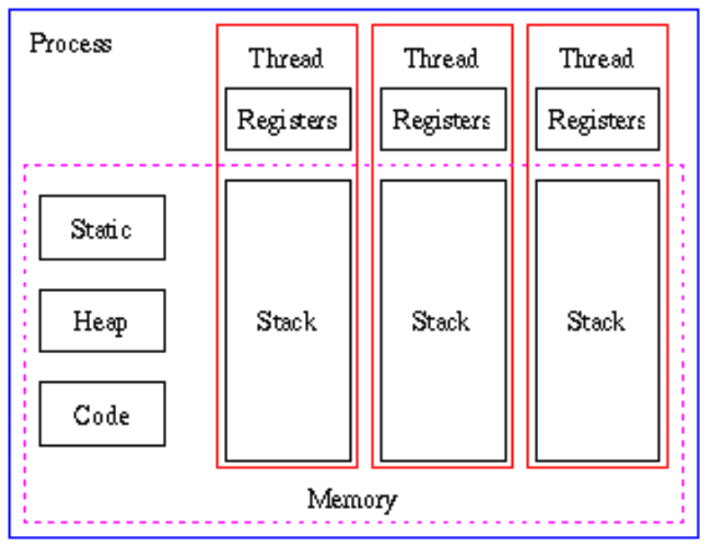
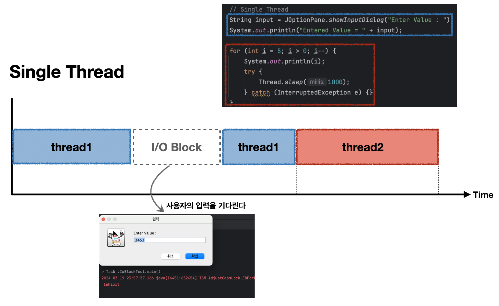
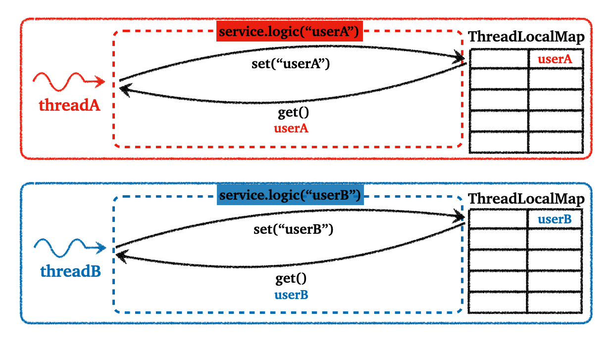

## Table of Contents

1. [스레드(Thread)](https://github.com/seungki1011/Data-Engineering/tree/main/java/(023)%20Thread)
   * `Thread` 클래스 상속
   * `Runnable` 인터페이스 구현
   * 스레드 사용해보기
2. [메인 스레드](https://github.com/seungki1011/Data-Engineering/tree/main/java/(023)%20Thread#2-%EB%A9%94%EC%9D%B8-%EC%8A%A4%EB%A0%88%EB%93%9Cmain-thread)
3. [스레드의 I/O Blocking](https://github.com/seungki1011/Data-Engineering/tree/main/java/(023)%20Thread#3-%EC%8A%A4%EB%A0%88%EB%93%9C%EC%9D%98-io-blocking)
4. [스레드 그룹(Thread Group)](https://github.com/seungki1011/Data-Engineering/tree/main/java/(023)%20Thread#4-%EC%8A%A4%EB%A0%88%EB%93%9C-%EA%B7%B8%EB%A3%B9thread-group)
5. [데몬 스레드(Daemon Thread)](https://github.com/seungki1011/Data-Engineering/tree/main/java/(023)%20Thread#5-%EB%8D%B0%EB%AA%AC-%EC%8A%A4%EB%A0%88%EB%93%9Cdaemon-thread)
6. [스레드 상태(Thread State)](https://github.com/seungki1011/Data-Engineering/tree/main/java/(023)%20Thread#6-%EC%8A%A4%EB%A0%88%EB%93%9C%EC%9D%98-%EC%83%81%ED%83%9Cthread-state)
7. [스레드의 동기화(synchronized)](https://github.com/seungki1011/Data-Engineering/tree/main/java/(023)%20Thread#7-%EC%8A%A4%EB%A0%88%EB%93%9C%EC%9D%98-%EB%8F%99%EA%B8%B0%ED%99%94-synchronized)
8. [`ThreadLocal`](https://github.com/seungki1011/Data-Engineering/tree/main/java/(023)%20Thread#8-threadlocal)
   * [동시성 문제](https://github.com/seungki1011/Data-Engineering/tree/main/java/(023)%20Thread#81-%EB%8F%99%EC%8B%9C%EC%84%B1-%EB%AC%B8%EC%A0%9C)
   * [`ThreadLocal`을 통해 문제 해결](https://github.com/seungki1011/Data-Engineering/tree/main/java/(023)%20Thread#82-threadlocal%EC%9D%84-%ED%86%B5%ED%95%B4-%EB%AC%B8%EC%A0%9C-%ED%95%B4%EA%B2%B0)

---

## 1) 스레드(Thread)

자바의 스레드에 대해서 알아보자

스레드의 구현과 실행에는 다음의 두 가지 방법이 있다.

* `Thread` 클래스 상속
* `Runnable` 인터페이스 구현 (권장)

<br>

---

### 1.1 `Thread` 클래스 상속

`Thread` 클래스를 상속하는 경우 다음과 같이 사용한다.

```java
class MyThread extends Thread {
  @Override
  public void run() {
    // Thread클래스의 run()을 오버라이딩해서 사용한다
  }
}
```

```
MyThread t1 = new MyThread(); // 스레드 생성
t1.start(); // 스레드 실행
```

<br>

---

### 1.2 `Runnable` 인터페이스 구현

`Runnable` 인터페이스는 다음과 같이 생겼다.

```java
public interface Runnable {
    /**
     * When an object implementing interface <code>Runnable</code> is used
     * to create a thread, starting the thread causes the object's
     * run() method to be called in that separately executing thread.
     * 
     * The general contract of the method run() is that it may
     * take any action whatsoever.
     */
    public abstract void run();
}
```

```java
class MyThread implements Runnable {
  @Override
  public void run() {
    // Runnable 인터페이스의 추상 메서드 run()을 구현한다
  }
}
```

```java
Runnable r = new MyThread();
Thread t2 = new Thread(r); // Thread(Runnable r)

// 위의 두줄을 한줄로 정리하면
Thread t2 = new Thread(new MyThread());

t2.start(); // 스레드 실행
```

<br>

---

### 1.3 스레드 사용해보기

스레드 사용을 여러 예시를 이용해서 연습해보자.

```java
public class ThreadTest1 {
    public static void main(String[] args) {
      
        Runnable r1 = new MyThread1();
        Thread t1 = new Thread(r1);

        Runnable r2 = new MyThread2();
        Thread t2 = new Thread(r2);

        t1.start(); // 스레드 t1 시작
        t2.start(); // 스레드 t2 시작
				
    }
}

class MyThread1 implements Runnable {
    @Override
    public void run() { // 스레드가 수행할 작업 작성
        for (int i = 0; i < 100; i++) {
            System.out.print("["+Thread.currentThread().getName()+"]");
        }
    }
}

class MyThread2 implements Runnable {
    @Override
    public void run() {
        for (int i = 0; i < 100; i++) {
            System.out.print("["+Thread.currentThread().getName()+"]");
        }
    }
}
```

```
[Thread-0][Thread-1][Thread-0][Thread-0][Thread-1][Thread-0][Thread-1][Thread-0][Thread-1][Thread-0][Thread-1][Thread-0][Thread-1][Thread-0][Thread-1][Thread-0][Thread-1][Thread-0][Thread-1][Thread-0][Thread-1][Thread-0][Thread-1][Thread-0][Thread-0][Thread-0][Thread-0][Thread-0][Thread-1][Thread-0]
```

* `Thread.currentThread().getName()` : 현재 실행중인 스레드의 이름 반환
* 스레드를 생성한 후에 `start()`를 호출해야 스레드의 작업이 시작한다
* `run()`을 이용하지 않고 `main`에서 로직을 그냥 작성했으면 싱글 스레드로 동작함
* **반면에 스레드의 `run()`을 이용하면 작업이 번갈아가면서 실행되는 것을 확인할 수 있다**


* **스레드의 실행 순서는 os의 스케쥴러가 결정한다**
  * 스레드가 먼저 `start()` 했다고 먼저 실행되는 것은 아님


* 자바 어플리케이션은 `main()`을 실행하는 기본 메인 스레드가 존재함
* JVM은 각 스레드에게 자기만의 JVM 스택을 줌 (각 스레드는 자기만의 호출 스택을 가진다)


<p align="center">    </p>

<p align='center'>https://medium.com/@Ravjan/java-threads-part-1-basics-5a131943979d</p>

<br>

---

## 2) 메인 스레드(Main Thread)

메인 스레드는 `main()`의 코드를 수행하는 스레드

자바에서 스레드는 두 가지로 나눌 수 있다

* 사용자 스레드(user thread) : 어플리케이션이 동작하도록 하는 스레드
  * 메인 스레드는 사용자 스레드에 해당한다
  * 모든 사용자 스레드가 종료되면 프로그램(JVM)도 종료된다
  * 메인 스레드가 종료되도 다른 사용자 스레드가 살아있으면 프로그램도 살아있음


* 데몬 스레드(daemon thread) : 보조 역할을 하는 스레드
  * 가비지 컬렉션과 같은 보조 역할을 백그라운드에서 하는 스레드

<br>

코드로 살펴보자.

```java
public class ThreadTest2 {

    static long startTime = 0;

    public static void main(String[] args) {

        Thread t1 = new Thread(new MyThread1());
        Thread t2 = new Thread(new MyThread2());

        t1.start();
        t2.start();
        startTime = System.currentTimeMillis();

        System.out.println();
        System.out.println("Total task time : "+ (System.currentTimeMillis()-startTime));
    } // main 스레드
}
```

```
[Thread-1]Total task time : 0
[Thread-0][Thread-1][Thread-0][Thread-1][Thread-1][Thread-0][Thread-1][Thread-0][Thread-1][Thread-1][Thread-0][Thread-1][Thread-0][Thread-1][Thread-0][Thread-1][Thread-0][Thread-1][Thread-0][Thread-1][Thread-1][Thread-0][Thread-1][Thread-1][Thread-0][Thread-0][Thread-1][Thread-0][Thread-1][Thread-1][Thread-1][Thread-1][Thread-1][Thread-0][Thread-0][Thread-0][Thread-1][Thread-0][Thread-1][Thread-0][Thread-1][Thread-0][Thread-0][Thread-0][Thread-1][Thread-0][Thread-1][Thread-1][Thread-1][Thread-1][Thread-1]
```

* 메인 스레드가 초반에 끝나버리는 것을 확인 가능 → 메인 스레드는 스레드 `t1`, `t2`를 시작하고 할일이 없으니깐 종료

<br>

```java
public class ThreadTest2 {

    static long startTime = 0;

    public static void main(String[] args) {

        Thread t1 = new Thread(new MyThread1());
        Thread t2 = new Thread(new MyThread2());

        t1.start();
        t2.start();
        startTime = System.currentTimeMillis();

        try {
            t1.join(); // main 스레드가 t1의 작업이 끝날 때까지 기다린다
            t2.join(); // main 스레드가 t2의 작업이 끝날 때까지 기다린다
        } catch (InterruptedException e) {}

        System.out.println();
        System.out.println("Total task time : "+ (System.currentTimeMillis()-startTime));
    } // main 스레드
}
```

```
[Thread-1][Thread-1][Thread-1][Thread-1][Thread-1][Thread-1][Thread-1][Thread-1][Thread-1][Thread-1][Thread-1][Thread-1][Thread-1][Thread-1][Thread-1][Thread-0][Thread-0][Thread-0][Thread-1][Thread-1][Thread-1][Thread-1][Thread-1][Thread-1][Thread-1][Thread-1][Thread-1][Thread-1][Thread-1][Thread-1][Thread-0][Thread-0][Thread-0][Thread-0][Thread-0][Thread-0][Thread-0][Thread-0][Thread-0][Thread-0][Thread-0][Thread-0][Thread-0][Thread-0][Thread-0][Thread-0][Thread-0][Thread-0][Thread-0][Thread-0][Thread-0][Thread-0][Thread-0][Thread-0][Thread-0][Thread-0][Thread-0][Thread-0][Thread-0][Thread-0][Thread-0]
Total task time : 3
```

* `join()`을 이용해서 메인 스레드의 종료를 나머지 스레드의 작업을 끝낼 때까지 지연시킨다 (기다리게 함)

<br>

---

## 3) 스레드의 I/O Blocking

I/O 블락킹 : 입출력 동안 작업이 중지

자바의 스레드의 I/O 블락킹에 대해서 알아보자.

<p align="center">    </p>

<p align='center'>싱글 스레드에서의 I/O 블락킹</p>

<br>

<p align="center">    </p>

<p align='center'>멀티 스레드에서의 I/O 블락킹</p>

* 멀티 스레드를 이용할 경우 작업을 더 효율적으로 진행할 수 있다

<br>

---

## 4) 스레드 그룹(Thread Group)

스레드 그룹에 대해서 알아보자.

스레드 그룹(thread group)은 서로 관련된 스레드를 그룹으로 묶어서 다루기 위해 사용한다. 모든 스레드는 반드시 하나의 그룹에 포함된다. 그러나 우리는 지금까지 스레드를 그룹에 지정하지 않고 사용해왔다. 그 이유는 그룹을 지정하지 않고 생성한 스레드는 `메인 스레드 그룹`에 속하기 때문이다.

스레드는 자신을 생성한 스레드(parent thread)의 그룹과 우선순위를 상속받는다.

<br>

---

## 5) 데몬 스레드(Daemon Thread)

데몬 스레드는 일반 스레드의 작업을 돕는 보조적인 역할을 수행한다. 데몬 스레드는 일반 스레드가 모두 종료되면 자동적으로 종료된다.

다음이 보조 역할에 해당하는 것들이다.

* 가비지 컬렉터
* 자동저장
* 화면 자동 갱신

<br>

데몬 스레드는 보통 무한루프와 조건문을 이용해서, 실행 후 대기하다가 특정 조건을 만족하면 작업을 수행하고 대기하도록 작성한다.

<br>

```java
boolean isDaemon() // 스레드가 데몬 스레드인지 확인한다. 만약 데몬 스레드라면 true 반환

void setDaemon(boolean on) // 스레드를 데몬 스레드 또는 사용자 스레드로 변경한다. on을 true로 지정하면 데몬 스레드로 변경된다.
```

* `setDaemon(on)`은 반드시 `start()`를 호출하기 전에 실행되어야한다. 그렇지 않은 경우 예외 발생!

<br>

---

## 6) 스레드의 상태(Thread state)

스레드의 상태에 대해서 알아보자.

* `NEW` : 스레드가 생성되고 아직 `start()`를 하지 않은 상태
* `RUNNABLE` : 스레드가 실행 중 이거나 실행 가능한 상태
*  `WAITING` : 스레드의 작업이 종료되지는 않았지만 실행가능하지 않은 일시 정지 상태
* `TIMED_WATING` : `WAITING`과 동일하지만 일시정지 시간이 지정된 경우
* `BLOCKED` : 락을 기다리는 동안 일시정지된(blocked) 상태
* `TERMINATED` : 스레드의 작업이 종료된 상태

<br>

<p align="center">    </p>

<p align='center'>https://www.codejava.net/java-core/concurrency/understanding-thread-states-thread-life-cycle-in-java</p>

<br>

<p align="center">    </p>

<p align='center'>https://javaconceptoftheday.com/java-threads-cheat-sheet/</p>

<br>

---

## 7) 스레드의 동기화 (`synchronized`)

멀티 스레드 프로세스에서는 한 스레드가 다른 스레드의 작업에 영향을 미칠 수 있다. 진행중인 작업이 다른 스레드에게 간섭 받지 않기 위해서는 동기화 작업이 필요하다. 

* 동기화하기 위해서는 간섭받지 않아야 하는 문장(statement)들을 임계 영역(critical section)으로 설정한다
* 임계 영역은 락(lock)을 얻은 단 하나의 스레드만 출입가능하다

<br>

임계 영역을 설정하는 방법을 알아보자.

```java
// 1. 메서드 전체를 임계 영역으로 지정
public synchronized void myMethod() {
  // 임계 영역
}
```

```java
// 2. 특정 영역을 임계 영역으로 지정
synchronized(객체 참조 변수) {
  // 임계 영역
}
```

* 임계 영역은 가능한 최소로 설정하는 것이 좋다

<br>

동기화의 효율을 높이기 위해 사용하는 메서드들. (`Object` 클래스에 정의, 동기화 블럭 내에서만 사용가능하다)

* `wait()` : 객체의 lock을 풀고 스레드를 해당 객체의 대기 풀(waiting pool)에 넣는다
* `notify()` : 대기 풀에서 대기중인 스레드 중의 하나를 깨운다
* `notifyAll()` : 대기 풀에서 대기중인 모든 스레드를 깨운다

<br>

> (macOS) IntelliJ IDEA > Preferences > search "console" > use soft wraps in console 
>
> 이 설정을 사용하면 콘솔의 내용을 자동 줄바꿈 해준다.

<br>

---

## 8) `ThreadLocal`

### 8.1 동시성 문제

동일한 객체의 필드에 여러 스레드가 접근하고 조회하면서 생기는 문제에 대해서 알아보자.

다음 코드를 살펴보자.

<br>

`FieldService`

```java
@Slf4j
public class FieldService {

    private String nameStore;

    public String logic(String name) {
        log.info("Stored name = {} -> nameStore = {}", name, nameStore);
        nameStore = name;
        SleepUtil.sleep(1000);
        log.info("Found nameStore = {}", nameStore);
        return nameStore;
    }
}
```

* `FieldService`라는 클래스의 `logic()`은 넘어온 파라미터(`name`)를 `nameStore`라는 필드에 저장한다. 그 후 `sleep(1000)`을 통해서 1초 대기하고 `nameStore`를 반환하다
* `sleep()`은 따로 `SleepUtil` 클래스를 만들어서 `try-catch`를 처리했다

<br>

이제 `FieldService`라는 클래스의 인스턴스를 생성하고, 두 스레드가 이용하는 경우를 살펴보자.

<br>

```FieldServiceTest```

```java
@Slf4j
public class FieldServiceTest {

    private FieldService fieldService = new FieldService();

    @Test
    void field() {
        log.info("Main thread start!");
				
      	// Runnable 인터페이스를 통해서 스레드를 구현
        Runnable userA = () -> {
            fieldService.logic("userA");
        };

        Runnable userB = () -> {
            fieldService.logic("userB");
        };

        Thread threadA = new Thread(userA);
        threadA.setName("threadA");
        Thread threadB = new Thread(userB);
        threadA.setName("threadB");
				
      	// 스레드A 시작
        threadA.start();
        //SleepUtil.sleep(2000); // 동시성 문제 발생 x
        SleepUtil.sleep(200); // 동시성 문제 발생 o
        // 스레드B 시작
        threadB.start();

        SleepUtil.sleep(3000); // Main thread 종료 대기
        log.info("Main Exit!");

    }
}
```

```
02:20:54.319 [Test worker] INFO FieldServiceTest -- Main thread start!
02:20:54.321 [threadA] INFO FieldService -- Stored name = userA -> nameStore = null
02:20:54.522 [threadB] INFO FieldService -- Stored name = userB -> nameStore = userA
02:20:56.327 [threadA] INFO FieldService -- Found nameStore = userB
02:20:56.527 [threadB] INFO FieldService -- Found nameStore = userB
02:20:57.526 [Test worker] INFO FieldServiceTest -- Main Exit!
```

* `FieldService`의 인스턴스인 `fieldService`를 통해서 두 스레드 `threadA`, `threadB`가 각각 `userA`, `userB`라는 파라미터를 넘기고 있다
* 동작 순서
  * `threadA` 시작
  * `"userA"`를 인스턴스의 필드인 `nameStore`에 저장
  * `threadA`는 아직 처리중(`sleep()`)
  * `threadB` 시작
  * `"userB"`를 인스턴스의 필드인 `nameStore`에 저장 (기존 `"userA"`→`"userB"`)
  * `threadA`에서 `nameStore` 조회 : `userB`를 받음
  * `threadB`에서 `nameStore` 조회 : `userB`를 받음

<br>

여기서의 문제는 로직의 동작 의도는 `threadA`에서 `userA`를 조회해야 하지만, `userB`를 조회했다는 것이다. 이것이 멀티 스레드에서 공통으로 사용하는 인스턴스의 필드에 접근시 격게되는 동시성 문제이다. 다음 그림을 통해서 문제를 다시 한번 살펴보자.

<br>

 <p align="center">    </p>

<p align='center'>동시성 문제</p>

위 그림에서도 살펴볼 수 있듯이, 다수의 스레드에서 객체의 필드에 접근해서 사용하게 되면, 의도하지 않는 결과를 만들어낼 수 있다.(`threadA`에서 `userB` 값을 조회)

이런 동시성 문제는 싱글톤 패턴 처럼 공통으로 사용하는 객체가 있거나, `static`과 같은 공용 필드에 값을 변경하기 때문에 발생한다.(값을 읽기만 하는 경우 발생하지 않는다) 

이런 문제를 해결하기 위해서 자바는 `ThreadLocal` 클래스를 제공한다.

<br>

---

### 8.2 `ThreadLocal`을 통해 문제 해결

자바가 제공하는 `java.lang.ThreadLocal` 클래스를 사용해보자.

들어가기에 앞서, 스레드 로컬의 기능을 아주 간단히 설명하자면 스레드 로컬을 사용하면 스레드 별로 별도의 내부 저장소를 제공한다. 스레드 별로 존재하기 때문에, 같은 인스턴스의 스레드 로컬 필드에 접근해도 별도로 저장되기 때문에 안전하다. 예시와 그림을 통해서 더 자세히 알아보자.

<br>

`ThreadLocalService`

```java
@Slf4j
public class ThreadLocalService {
    private ThreadLocal<String> nameStore = new ThreadLocal<>();

    public String logic(String name) {
        log.info("Stored name = {} -> nameStore = {}", name, nameStore.get());
        nameStore.set(name);
        SleepUtil.sleep(1000);
        log.info("Found nameStore = {}", nameStore.get());
        return nameStore.get();
    }
}
```

* `set(value)` : 값 저장
  * 현재 스레드 기준으로 `ThreadLocalMap` 객체에 값을 저장한다(없다면 생성)
* `get()` : 값 조회
  * 현재 스레드 기준으로 `ThreadLocalMap` 객체에 저장된 값을 찾아서 반환
* `remove()` : 값 제거
  * 현재 스레드 기준으로 `ThreadLocalMap` 객체에 해당 값을 제거

<br>

코드에서 구현하지는 않았지만 스레드 로컬 필드에 값을 저장후 사용이 끝났으면, 나중에 `remove()`로 값을 제거해줘야 문제가 발생하지 않는다.

<br>

`ThreadLocalServiceTest`

```java
@Slf4j
public class ThreadLocalServiceTest {

    private ThreadLocalService service = new ThreadLocalService();

    @Test
    void field() {
        log.info("Main thread start!");

        Runnable userA = () -> {
            service.logic("userA");
        };

        Runnable userB = () -> {
            service.logic("userB");
        };

        Thread threadA = new Thread(userA);
        threadA.setName("threadA");
        Thread threadB = new Thread(userB);
        threadB.setName("threadB");

        threadA.start();
        SleepUtil.sleep(100);
        threadB.start();

        SleepUtil.sleep(3000); // Main thread 종료 대기
        log.info("Main Exit!");

    }
}
```

```
16:48:58.456 [Test worker] INFO ThreadLocalServiceTest -- Main thread start!
16:48:58.459 [threadA] INFO ThreadLocalService -- Stored name = userA -> nameStore = null
16:48:58.564 [threadB] INFO ThreadLocalService -- Stored name = userB -> nameStore = null
16:48:59.464 [threadA] INFO ThreadLocalService -- Found nameStore = userA
16:48:59.569 [threadB] INFO ThreadLocalService -- Found nameStore = userB
16:49:01.568 [Test worker] INFO ThreadLocalServiceTest -- Main Exit!
```

* 기존 필드 저장 후 조회의 문제가 `ThreadLocal`을 도입하면서 해결된 것을 확인할 수 있다

<br>

다음 그림을 통해서 더 쉽게 이해해보자.

<br>

 <p align="center">    </p>

* `ThreadLocal`을 사용하면 각 스레드 별로 필드에 대한 별도의 저장소가 생김
* 스레드 별로 관리가 되기 때문에, 멀리 스레드 상황에서 스레드 로컬 필드에 접근해서 쓰기 작업을 하든 읽기 작업을 하든 문제가 생기지 않는다
* 주의할 점은 해당 스레드의 로직이 스레드 로컬 사용을 완료했으면 반드시 `remove()`로 저장된 값을 제거해줘야 한다

<br>

그럼 왜 `remove()`를 통해 스레드 로컬 필드의 값을 제거해줘야 할까?

그 이유는 스레드 풀을 사용할때 값을 제거하지 않는 경우 문제가 발생하기 때문이다.

<br>

 <p align="center">    </p>

* 기존 값을 제거하지 않는 경우 스레드풀에서 스레드를 재사용하는 과정에서 다시 `get()`을 통해 필드에 접근하면, 제거하지 않은 값을 그대로 조회할 수 있는 문제가 발생할 수 있다


<br>

---

## Reference

1. [https://medium.com/@Ravjan/java-threads-part-1-basics-5a131943979d](https://medium.com/@Ravjan/java-threads-part-1-basics-5a131943979d)
1. [https://www.codejava.net/java-core/concurrency/understanding-thread-states-thread-life-cycle-in-java](https://www.codejava.net/java-core/concurrency/understanding-thread-states-thread-life-cycle-in-java)
1. [https://javaconceptoftheday.com/java-threads-cheat-sheet/](https://javaconceptoftheday.com/java-threads-cheat-sheet/)
