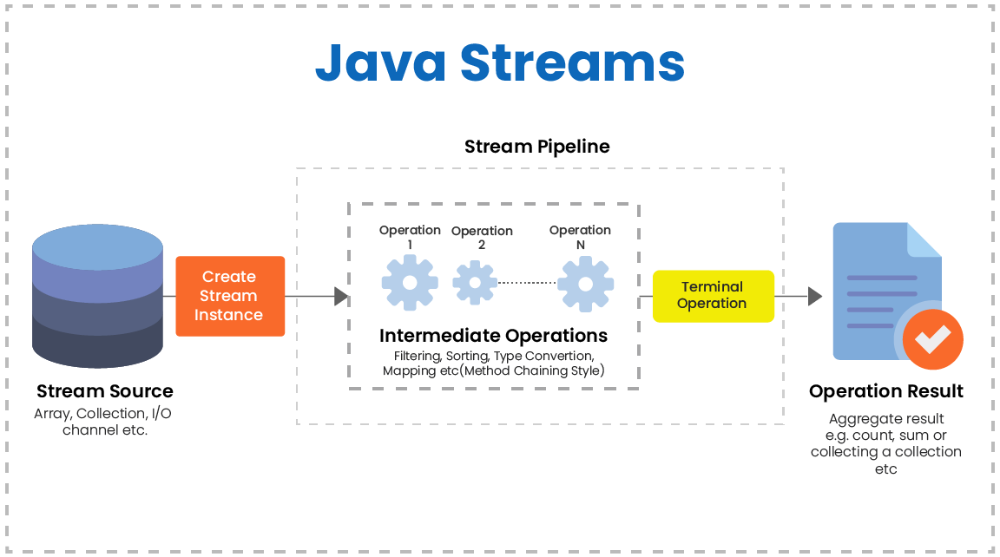
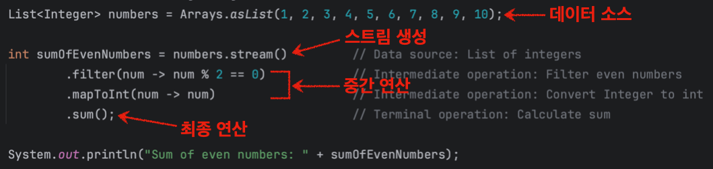
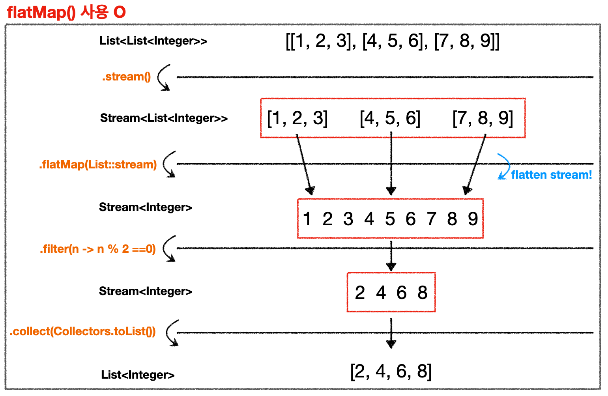
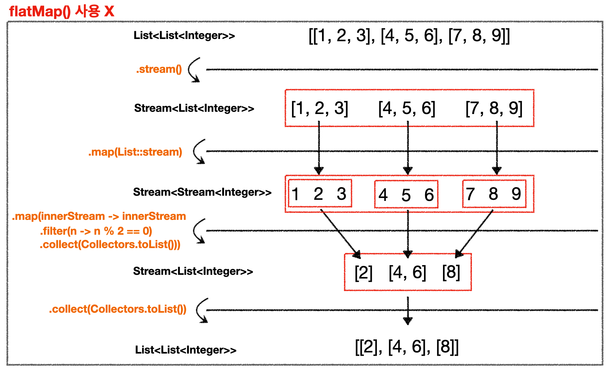

## Table of Contents

1. [스트림(Stream)](https://github.com/seungki1011/Data-Engineering/tree/main/java/(025)%20Stream#1-%EC%8A%A4%ED%8A%B8%EB%A6%BCstream)
   * 스트림 소개
   * 스트림의 특징
     * 읽기만 함(read-only)
     * 한번만 사용(use only once), 지연 연산(lazy evaluation)
     * 병렬 스트림(parallel stream)
     * 기본형 스트림(primitive stream)
2. [스트림 생성](https://github.com/seungki1011/Data-Engineering/tree/main/java/(025)%20Stream#2-%EC%8A%A4%ED%8A%B8%EB%A6%BC-%EC%83%9D%EC%84%B1)
   * 컬렉션
   * 배열
   * 난수, 특정 범위의 정수
   * `iterate()`, `generate()`
   * `Files`, `empty()`
3. [중간 연산(Intermediate Opertation)](https://github.com/seungki1011/Data-Engineering/tree/main/java/(025)%20Stream#3-%EC%A4%91%EA%B0%84-%EC%97%B0%EC%82%B0intermediate-operation)
   * `skip()`, `limit()`
   * `filter()`, `distinct()`
   * `sorted()`
   * `map()`, `flatMap()`
   * `peek()`
4. [`Optional<T>`](https://github.com/seungki1011/Data-Engineering/tree/main/java/(025)%20Stream#4-optionalt)
5. [최종 연산(Terminal Opertation)](https://github.com/seungki1011/Data-Engineering/tree/main/java/(025)%20Stream#5-%EC%B5%9C%EC%A2%85-%EC%97%B0%EC%82%B0terminal-operation)
   * `forEach()`
   * `xxxMatch()`
   * `findxxx()`
   * `reduce()`
   * `collect()`, `Collectors`
     * `collect()` 사용하기
     * `partitioningBy()`, `groupingBy()`

---

## 1) 스트림(Stream)

### 1.1 스트림 소개

스트림(Stream)에 대해서 알아보자.

스트림은 말 그대로 데이터의 흐름이다. 

스트림은 다양한 데이터 소스를 함수형(functional) 또는 선언적인(declarative) 방법으로 다루기 위한 인터페이스이다.

여기서 다양한 데이터 소스는 다음을 포함한다.

* `List`, `Set`, `Map` 등의 컬렉션
* 배열
* I/O channel
* generator function
* 기타의 다양한 데이터 소스

<br>

스트림의 과정을 살펴보면 다음과 같다.

<p align="center">    </p>

<p align="center">https://innovationm.co/concept-of-stream-api-java1-8/</p>

* **스트림 생성**
  * 데이터 소스로 부터 스트림을 생성한다


* **중간 연산(Intermediate operations)**
  * 중간 연산을 수행한다
  * 중간 연산은 **반복적 수행이 가능**하다


* **최종 연산(Terminal operation)**
  * 최종 연산을 수행한다
  * 최종 연산은 **단 1번만 수행**한다
  * 최종 연산을 통해서 결과가 만들어진다

<br>

<p align="center">    </p>

<p align="center">스트림의 연산 과정</p>

<br>

---

### 1.2 스트림의 특징

스트림의 특징에 대해서 알아보자.

<br>

#### 1.2.1 읽기만 함(read-only)

```java
// 스트림은 Read only (데이터 소스 변경 x)
List<Integer> list = Arrays.asList(3, 1, 5, 4, 2); // 데이터 소스

List<Integer> sortedList = list.stream().sorted() // list 정렬
         .collect(Collectors.toList()); // 새로운 sortedList에 저장

System.out.println(list); // [3, 1, 5, 4, 2]
System.out.println(sortedList); // [1, 2, 3, 4, 5]
```

```
[3, 1, 5, 4, 2]
[1, 2, 3, 4, 5]
```

* 스트림은 데이터 소스로 부터 데이터를 읽기만 하고, 변경하지는 않는다

<br>

---

#### 1.2.2 한번만 사용(use only once), 지연 연산(lazy evaluation)

```java
strStream.forEach(System.out::println); // 모든 요소를 화면에 출력하는 최종 연산(스트림이 닫힌다)

int numOfStr = strStream.count(); // 스트림이 닫혀서 에러!


```

* 스트림은 일회용이다
  * 필요하면 스트림을 다시 생성해서 사용해야 한다

<br>

```java
Stream<Integer> evenNumbers = Stream.iterate(0, n -> n + 2)
                .limit(5); // 최종 연산이 수행될 때 까지 연산을 수행하지 않는다
// 생략 ..
evenNumbers.forEach(System.out::println); // 최종 연산에서 연산 수행
```

* 스트림은 지연연산(Lazy evaluation)을 사용한다
  * 최종 연산 전까지 중간 연산이 수행되지 않는다
  *  쉽게 말해서 결과값이 필요할 때 까지 모든 연산을 늦춘다

<br>

---

#### 1.2.3 병렬 스트림(parallel stream)

```java
// 병렬 스트림(parallel stream)을 이용해서 스트림의 연산에 멀티스레드를 이용한다
// 1. parallelStream()
List<Integer> numbers = Arrays.asList(1, 2, 3, 4, 5, 6, 7, 8, 9, 10);
numbers.parallelStream().forEach(System.out::println);

// 2. parallel()
List<Integer> numbers = Arrays.asList(1, 2, 3, 4, 5, 6, 7, 8, 9, 10);
numbers.stream().parallel().forEach(System.out::println);
```

* 스트림은 병렬 스트림을 지원한다
  * 스트림의 작업을 멀티 스레드를 통해서 병렬로 처리할 수 있다
    * 사용자가 굳이 멀티 스레드를 매니지 할 필요 없음


* Fork/Join 프레임워크를 사용한다

* `parallel()`, `parallelStream()`을 통해서 병렬 스트림으로 전환 할 수 있다
  * `sequential()` : 다시 순차 스트림으로 전환 (모든 컬렉션 스트림은 기본적으로 sequential)

<br>

---

#### 1.2.4 기본형 스트림(primitive stream)

```java
// IntStream
IntStream.range(1, 6).forEach(System.out::println); // Prints integers from 1 to 5
int sum = IntStream.rangeClosed(1, 5).sum(); // Computes sum of integers from 1 to 5

// LongStream
LongStream.range(1, 6).forEach(System.out::println); // Prints long values from 1 to 5
long sum = LongStream.rangeClosed(1, 5).sum(); // Computes sum of long values from 1 to 5

// DoubleStream
DoubleStream.of(1.5, 2.5, 3.5).forEach(System.out::println); // Prints double values 1.5, 2.5, 3.5
double sum = DoubleStream.of(1.5, 2.5, 3.5).sum(); // Computes sum of double values
```

* 래퍼 클래스의 오토박싱, 언박싱의 비효율이 제거됨(`Stream<Integer>` 대신 `IntStream` 사용)
* 숫자와 관련된 메서드를 더 많이 제공해준다
  * `sum()`, `average()`, `max()`, `map()` 등 

<br>

---

## 2) 스트림 생성

### 2.1 컬렉션

`Collection` 인터페이스의 `stream()`으로 컬렉션을 데이터 소스로 하는 스트림을 생성해보자.

```java
List<Integer> list = Arrays.asList(3, 1, 5, 4, 2);
Stream<Integer> integerStream = list.stream(); // list를 데이터 소스로 하는 스트림 생성

integerStream.forEach(System.out::print); // 최종 연산(스트림 닫힘)
```

```
31542
```

<br>

---

### 2.2 배열

배열로 부터 스트림을 생성해보자.

```java
// 1. 객체 배열로 부터 스트림 생성하기
// Stream<T> Stream.of(v1, v2, .. vn)
Stream<String> stringStream1 = Stream.of("A", "B", "C");
stringStream1.forEach(System.out::print); // ABC

// Stream<T> Stream.of(T[])
Stream<String> stringStream2 = Stream.of(new String[]{"A", "B", "C"});
stringStream2.forEach(System.out::print); // ABC

// Stream<T> Arrays.stream(T[])
String[] strArr = {"A", "B", "C"};
Stream<String> stringStream3 = Arrays.stream(strArr);
stringStream3.forEach(System.out::print); // ABC
      
// 2. 기본형 배열로 부터 스트림 생성하기
int[] intArr = {10, 20, 30, 40};
IntStream intStream = Arrays.stream(intArr);
intStream.forEach(System.out::print); //10203040

// Stream<Integer>를 사용하고 싶으면 int[] -> Integer[] 사용한다
Integer[] integers = {10, 20, 30, 40};
Stream<Integer> intStream2 = Arrays.stream(integers);
intStream2.forEach(System.out::print); // 10203040
```

<br>

---

### 2.3 난수, 특정 범위의 정수

난수를 요소로 갖는 스트림을 생성해보자.

```java
// 1. 난수

// limit
IntStream intStream = new Random().ints(); // 무한 스트림이 생성 됨
intStream.limit(4).forEach(System.out::println); // 4개의 요소만 출력하도록 limit 사용

// limit 사용하지 않고 유한 스트림으로
IntStream intStream2 = new Random().ints(4); // 4개만
intStream2.forEach(System.out::println);

// 난수의 범위 지정
IntStream intStream3 = new Random().ints(0, 100); // 범위 : 0~99
intStream3.limit(4).forEach(System.out::println);

// 2. 특정 범위의 정수를 요소로 갖는 스트림

IntStream intStream4 = IntStream.range(1, 10); // 범위 : 1~9
// 끝의 수 까지 포함하고 싶으면 rangeClosed() 사용
intStream4.forEach(System.out::print); // 123456789
```

<br>

---

### 2.4 `iterate()`, `generate()`

람다식을 소스로 하는 스트림을 생성해보자.

```java
static <T> Stream<T> iterate(T seed, UnaryOperator<T> f) // 이전 요소에 종속적
static <T> Stream<T> generate(Supplier<T> s) // 이전 요소에 독립적
```

* 무한 스트림이라서 `limit` 같은 걸로 잘라야 함

<br>

예시를 통해 더 알아보자.

<br>

#### 2.4.1 `iterate()`

```java
Stream<Integer> evenNumbers = Stream.iterate(0, n -> n + 2) // 0부터 시작, 람다식 계산은 2씩 증가
                .limit(3);
evenNumbers.forEach(System.out::println);
```

```
0
2
4
```

* `iterate()`는 이전 요소를 `seed`로 해서 다음 요소를 계산한다
  * 이전 요소에 종속적이다

* `0` : 초기 `seed`
* `n -> n + 2` : 수행할 람다식

<br>

Java 9 부터 `Predicate`을 인자로 받아서 종료 조건을 명시할 수 있음.

```java
Stream<Integer> oddNumbers = Stream.iterate(1, n -> n < 6, n -> n + 2);

oddNumbers.forEach(System.out::println); // 1 3 5
```

```
1
3
5
```

* `n -> n < 6` : 종료 조건
* `n -> n + 2` : 람다식

<br>

---

#### 2.4.2 `generate()`

```java
Stream<Double> randomStream = Stream.generate(Math::random)
  .limit(3);
randomStream.forEach(System.out::println);

Stream<Integer> oneStream = Stream.generate(() -> 1)
  .limit(4);
oneStream.forEach(System.out::println);
```

```
0.3747181020913669
0.3423459654756499
0.8466661074652626
1
1
1
1
```

* `generate()`는 `seed`를 사용하지 않는다
  * 이전 요소에 독립적이다
* `generate()`의 인자는 `Supplier` 
  * `Supplier`는 출력만 있고, 입력은 없음 (주기만 한다!)

<br>

---

### 2.5 `Files`,  `empty()`

#### 2.5.1 `Files`

파일을 소스로 하는 스트림을 만들 수 있다.

```java
Stream<Path> Files.list(Path dir) // Path는 파일 또는 디렉토리
  
Stream<String> Files.lines(Path path) // 파일 내용을 라인 단위로 읽어서 문자열 스트림으로
Stream<String> Files.lines(Path path, Charset cs) // 
```

<br>

코드로 더 알아보자.

<br>

```testfile.txt```

```
this is line 1
this is line 2
this is line 3
this is line 4
this is line 5
```

```FileStreamTest```

```java
String filePath = "testfile.txt";

try (Stream<String> lines = Files.lines(Paths.get(filePath))) {
    // Stream processing
    lines.forEach(System.out::println);
} catch (IOException e) {
    e.printStackTrace();
}
```

```
this is line 1
this is line 2
this is line 3
this is line 4
this is line 5
```

* `filePath` : 파일 경로
* `Paths.get(filePath)` : `filePath`로 부터 `Path` 객체 생성
* `Files.lines(Paths.get(filePath))` : 파일을 열고, 파일의 각 줄을 읽고 `Stream<String>`을 만들어서 반환한다
  * 스트림의 각 요소는 파일의 각 줄
* `try` 블럭 내에서 스트림에 대한 연산을 수행하면 된다

---

<br>

#### 2.5.2 `empty()`

비어있는 스트림을 생성할 수 있다.

```java
Stream emptyStream = Stream.empty(); // empty()는 비어있는 스트림을 반환한다
long count = emptyStream.count(); // 비어 있으니깐 count는 0
```

<br>

---

## 3) 중간 연산(Intermediate Operation)

* **중간 연산(Intermediate operation)**
  * 중간 연산을 수행한다
  * 중간 연산은 **반복적 수행이 가능**하다
  * 연산 결과가 스트림이다

<br>

중간 연산들에 대해 알아보자.

### 3.1 `skip()`, `limit()`

스트림을 자르기 위한 중간 연산.

```java
Stream<T> skip(long n) // 앞에서부터 n개 건너뛰기
Stream<T> limit(long maxSize) // maxSize 이후의 요소는 잘라냄
```

```java
public class IntermediateTest1 {
    public static void main(String[] args) {
      
        String[] strArr = {"a", "b", "c", "d", "e", "f"};
        ArrayList<String> arrayList = new ArrayList<>(Arrays.asList(strArr));
        
        // 1. skip
        Stream<String> strStream1 = Arrays.stream(strArr)
                        .skip(2);
        strStream1.forEach(System.out::print); //cdef
        System.out.println();
        
        // 2. limit
        Stream<String> strStream2 = Arrays.stream(strArr)
                        .limit(2);
        strStream2.forEach(System.out::print); // ab
    }
}
```

<br>

---

### 3.2 `filter()`, `distinct()`

스트림의 요소를 걸러내기 위한 중간 연산.

```java
Stream<T> filter(Predicate<? super T> predicate) // 조건에 맞지 않는 요소 제거
Stream<T> distinct() // 중복 제거
```

```java
public class IntermediateTest2 {
    public static void main(String[] args) {

        // 1. distinct
        IntStream intStream = IntStream.of(1,1,2,2,2,3,4,5,5,6,7,8,9,9)
                .distinct();
        intStream.forEach(System.out::print); // 123456789
        System.out.println();

        // 2. filter
        IntStream intStream2 = IntStream.rangeClosed(1, 10)
                .filter(i -> i % 2 == 0); // 2와 나누어서 나머지가 0이 아니면 전부 거름(짝수 필터링)
        intStream2.forEach(System.out::print); // 246810
        System.out.println();

        // 3. filter를 여러번 사용하기
        IntStream intStream3 = IntStream.rangeClosed(1, 100)
                .filter(i -> i % 2 == 0) // 짝수 필터링
                .filter(i -> i < 30) // 30미만 필터링
                .filter(i -> i % 3 == 0); // 3의 배수 필터링
        intStream3.forEach(System.out::print);

    }
}
```

<br>

---

### 3.3 `sorted()`

스트림을 정렬하기.

```java
Stream<T> sorted() // 스트림의 요소 기본 정렬(Comparable)로 정렬
Stream<T> sorted(Comparator<? super T> comparator) // 지정된 Comparator로 정렬
```

```java
public class IntermediateTest3 {
    public static void main(String[] args) {

        // 1. 정수 스트림 natural order로 정렬하기
        Integer[] numbers = {5, 2, 8, 1, 3, 6};
        Stream<Integer> sortedStream = Arrays.stream(numbers)
                .sorted();
        sortedStream.forEach(System.out::print); // 123568
        System.out.println();

        // 2. 정수 스트림 reverse order로 정렬하기
        Stream<Integer> reverseStream = Arrays.stream(numbers)
                .sorted((i1, i2) -> i2.compareTo(i1)); // Comparator를 제공해서 정렬 기준 제공
        reverseStream.forEach(System.out::print); // 865321
        System.out.println();

        // 3. String 스트림 reverse order로 정렬하기
        String[] words = {"apple", "banana", "cantaloupe", "dinosaur"};
        Stream<String> reverseStream2 = Stream.of(words)
                .sorted((s1, s2) -> s2.compareTo(s1));
        reverseStream2.forEach(System.out::println); // dinosaur cantaloupe banana apple
        
    }
}
```

<br>

특정 객체의 스트림을 정렬해보자.

```java
public class IntermediateTest4 {
    public static void main(String[] args) {
        List<Person> people = List.of(
                new Person("Alice", 25),
                new Person("Bob", 30),
                new Person("Charlie", 20),
                new Person("David", 11)
        );

        // 1. Person 객체의 스트림을 나이를 기준으로 정렬하기
        List<Person> sortedByAge = people.stream()
                .sorted((p1, p2) -> Integer.compare(p1.getAge(), p2.getAge()))
                .collect(Collectors.toList()); // 스트림의 요소를 컬렉트해서 리스트로 만드는 최종 연산
     
        sortedByAge.forEach(System.out::println);
        System.out.println();

        // 2. Person 객체의 스트림을 이름을 기준으로 정렬하기
        List<Person> sortedByName = people.stream() 
                .sorted((p1, p2) -> p1.getName().compareTo(p2.getName()))
                .collect(Collectors.toList());
      
        sortedByName.forEach(System.out::println);
      
      	// 3. Person 객체의 스트림을 나이를 기준으로 역으로 정렬하기
        // Person::getAge = (Person p) -> p.getAge()
      	List<Person> revSortedByAge = people.stream()
                .sorted(Comparator.comparing(Person::getAge).reversed()) 
                .collect(Collectors.toList());
      
        revSortedByAge.forEach(System.out::println);
    }
}

class Person {
    private String name;
    private int age;

    public Person(String name, int age) {
        this.name = name;
        this.age = age;
    }

    public String getName() {
        return name;
    }

    public int getAge() {
        return age;
    }

    @Override
    public String toString() {
        return name + " - " + age;
    }
}
```

```
David - 11
Charlie - 20
Alice - 25
Bob - 30

Alice - 25
Bob - 30
Charlie - 20
David - 11

Bob - 30
Alice - 25
Charlie - 20
David - 11
```

* `collect(Collectors.toList())` : 스트림의 요소를 컬렉트해서 리스트로 만드는 최종 연산


* `sorted(Comparator.comparing(Person::getAge)` 
  *  `Person` 객체를 나이를 기준으로 비교하는 `Comparator` 생성
  * `getAge`로 각 `Person` 객체의 나이를 추출하고, `Comparator`는 나이를 이용해서 객체의 순서를 정한다
  * `Person::getAge`를 람다식으로 표현하면 `(Person p) -> p.getAge()`


* `reverse()` : 순서를 역으로

<br>

---

### 3.4 `map()`, `flatMap()`

#### 3.4.1 `map()`

스트림의 요소를 변환하기.

```java
Stream<R> map(Function<? super T, ? extends R> mapper) // Stream<T> -> Stream<R>
```

* 타입 `T`의 스트림을 타입 `R`의 스트림으로 변환

<br>

```java
public class MapTest {
    public static void main(String[] args) {

        // 1. map() 이용해서 각 요소를 대문자로 변환
        List<String> names = Arrays.asList("Alice", "Bob", "Charlie", "David");

        List<String> upperCaseNames = names.stream()
                .map(String::toUpperCase)
                .collect(Collectors.toList());

        upperCaseNames.forEach(System.out::println);

        // 2. map()을 이용해서 각 요소를 제곱한다
        List<Integer> numbers = Arrays.asList(1, 2, 3);

        List<Integer> squaredNumbers = numbers.stream()
                .map(n -> n * n)
                .collect(Collectors.toList());

        squaredNumbers.forEach(System.out::println);

        // 3. map()을 이용해서 String -> Integer로 변환
        List<String> strings = Arrays.asList("10", "20", "30");

        List<Integer> integers = strings.stream()
                .map(Integer::parseInt) // Stream<String> -> Stream<Integer>
                .collect(Collectors.toList());

        integers.forEach(System.out::println);

    }
}
```

```
ALICE
BOB
CHARLIE
DAVID

1
4
9

10
20
30
```

<br>

---

#### 3.4.2 `flatMap()`

여러 스트림의 차원을 축소(flatten) 시켜서 하나의 스트림으로 만든다.

```java
public class FlatMapTest {
    public static void main(String[] args) {
      
        // 1. flatMap()을 사용
        List<List<Integer>> nestedList = Arrays.asList( // 리스트 안의 리스트
                Arrays.asList(1, 2, 3),
                Arrays.asList(4, 5, 6),
                Arrays.asList(7, 8, 9)
        );

        // Using flatMap to flatten the nested list and filter even numbers
        List<Integer> flattenedAndFiltered = nestedList.stream()
                .flatMap(List::stream) // Flatten the nested list into a single stream
                .filter(n -> n % 2 == 0) // Filter even numbers
                .collect(Collectors.toList()); // Collect the result into a list

        System.out.println("Flattened and filtered list: " + flattenedAndFiltered);

        // 2. flatMap() 사용 X
        List<List<Integer>> nestedList2 = Arrays.asList( // 리스트 안의 리스트
                Arrays.asList(1, 2, 3),
                Arrays.asList(4, 5, 6),
                Arrays.asList(7, 8, 9)
        );

        List<List<Integer>> filteredLists = nestedList2.stream()
                .map(List::stream)
                .map(innerStream -> innerStream.filter(n -> n % 2 == 0).collect(Collectors.toList()))
                .collect(Collectors.toList());

        System.out.println("Filtered lists: " + filteredLists);
    }
}
```

```
Flattened and filtered list: [2, 4, 6, 8] // flatMap() 사용 O
Filtered lists: [[2], [4, 6], [8]] // flatMap() 사용 X
```

* `flatMap()`을 사용하지 않는 경우 각 내부 스트림들이 각각 리스트로 존재하는 것을 다시 리스트로 모아지는 결과가 나옴
* `flatMap()`을 사용하지 않고 `flatMap()`을 사용한 것과 같은 결과를 얻을 수 있는 방법들이 존재 하지만 더 복잡하다
* nested `collection`을 스트림으로 처리 할 때 `flatMap()`을 이용해서 하나로 합치는 것이 편하다

<br>

<p align="center">    </p>

<p align="center">flatMap()을 사용하는 경우</p>

<br>

<p align="center">    </p>

<p align="center">flatMap()을 사용하지 않는 경우</p>

<br>

---

### 3.5 `peek()`

스트림의 요소를 소비하지 않고 사용할 수 있다. `forEach()`와 유사하다.

중간 중간 요소의 상태를 확인할 수 있는 디버깅 용도로 사용할 수 있음. 쉽게 말해서 관찰 용도로 사용한다.

```java
Stream<T> peek(Consumer<? super T> action) // 중간 연산 (스트림의 요소 소비 X)
void forEach(Consumer<? super T> action) // 최종 연산 (스트림의 요소 소비 O)
```

```java
public class PeekTest {
    public static void main(String[] args) {

        // 1. peek()로 요소 출력
        Stream<Integer> stream = Stream.of(1, 2, 3);
        Stream<Integer> peekedStream = stream.peek(System.out::print); // peek()는 중간 연산이기 때문에 지연 연산
        // 지연 연산(lazy evaluation) : 최종 연산이 수행될 때 다 같이 연산 수행

        // peek()로 요소 하나 출력 -> forEach()로 요소 하나 출력 반복
        peekedStream.forEach(System.out::println); // 최종 연산

        // 2. peek()로 연산에 대한 로깅(logging)
        List<Integer> numbers = List.of(1, 2, 3, 4, 5, 6);

        // 필터링과 매핑 연산이 있는 스트림에 대해 peek()로 로깅
        List<Integer> squaredEvenNumbers = numbers.stream()
                .filter(n -> n % 2 == 0)
                .peek(n -> System.out.println("Filtered: " + n)) // 필터링한 요소 로깅
                .map(n -> n * n)
                .peek(n -> System.out.println("Mapped: " + n)) // 매핑한 요소 로깅
                .collect(Collectors.toList());

        System.out.println("Squared even numbers: " + squaredEvenNumbers);

    }
}
```

```
11
22
33
Filtered: 2
Mapped: 4
Filtered: 4
Mapped: 16
Filtered: 6
Mapped: 36
Squared even numbers: [4, 16, 36]
```

<br>

---

## 4) `Optional<T>`

`Optional<T>`은 `T` 타입 객체의 래퍼 클래스이다. 

* `non-null`, `null` 값이 들어 있을 수 있다
* 모든 종류의 객체를 저장 가능
* 값을 감싸는 래퍼 클래스이기 때문에, NPE가 발생하지 않도록 도와준다
* `null` 체크하는 코드를 포함하면 복잡해지고, `null`을 직접적으로 다루는 것은 위험하기 때문에 `Optional`을 사용하는 것을 권장
* 쉽게 말해서 `null`을 직접 사용하지 않고 `optional`에 담아서 간접적으로 이용하는 것으로 생각하면 편하다

<br>

```java
// Optional 객체 생성
Optional<String> optVal = Optional.of(str);
Optional<String> optVal = Optional.of("this is a string");
Optional<String> optVal = Optional.of(null); // NPE 발생
Optional<String> optVal = Optional.ofNullable(null); // null을 안전하게 다루기 위해서 ofNullable() 많이 사용
```

```java
public class OptionalTest {
    public static void main(String[] args) {
      
        // Create an Optional with a non-null value
        Optional<String> optionalWithValue = Optional.ofNullable("Hello");

        // Create an Optional with a null value
        Optional<String> optionalWithNull = Optional.ofNullable(null);

        // Check if the optional has a value
        if (optionalWithValue.isPresent()) {
            System.out.println("Value is present: " + optionalWithValue.get());
        } else {
            System.out.println("No value present");
        }

        // Check if the optional with null has a value
        if (optionalWithNull.isPresent()) {
            System.out.println("Value is present: " + optionalWithNull.get());
        } else {
            System.out.println("No value present");
        }
    }
}
```

```
Value is present: Hello
No value present
```

* `isPresent()` : `Optional` 객체의 값이 `null`이면 `false`, 아니면 `true` 반환
  * `Boolean` 타입

<br>

```java
// 1. Optional 객체 초기화
Optional<String> optVal = Optional.empty();

// 2. Optional 객체의 값 가져오기
String str1 = optVal.orElse(""); // optVal에 저장된 값이 null이면, ""를 반환
String str2 = optVal.orElseGet(String::new); // 람다식 사용가능, () -> new String()
```

<br>

---

## 5) 최종 연산(Terminal Operation)

최종 연산에 대해서 알아보자. 들어가기에 앞서 최종 연산의 특징을 다시 살펴보자.

* **최종 연산(Terminal operation)**
  * 최종 연산을 수행한다
  * 최종 연산은 **단 1번만 수행**한다
  * 최종 연산을 통해서 결과가 만들어진다
  * 결과는 스트림이 아니다(스트림의 요소를 소모)

<br>

---

### 5.1 `forEach()`

스트림의 모든 요소에 지정된 작업을 수행한다.

```java
void forEach(Consumer<? super T> action) // 병렬 스트림인 경우 순서가 보장되지 않는다
void forEachOrdered(Consumer<? super T> action) // 병렬 스트림인 경우에도 순서가 보장됨
```

```java
public class ForEachTest {
    public static void main(String[] args) {
      
        // 1. 맵의 각 요소를 forEach()를 이용해서 출력
        Map<Integer, String> studentMap = new HashMap<>();
        studentMap.put(1, "Alice");
        studentMap.put(2, "Bob");
        studentMap.put(3, "Charlie");

        studentMap.forEach((key, value) -> System.out.println("Key: " + key + ", Value: " + value));

        // 2. forEach()를 이용해서 리스트의 각 요소를 대문자로 변환
        List<String> fruits = Arrays.asList("Apple", "Banana", "Orange", "Mango");

        // 각 요소를 대문자로 변환
        fruits.forEach(fruit -> {
            String upperCaseFruit = fruit.toUpperCase();
            // 대문자로 변환된 요소를 출력하는 작업까지 포함
            System.out.println("Processed fruit: " + upperCaseFruit);
        });
    }
}
```

```
Key: 1, Value: Alice
Key: 2, Value: Bob
Key: 3, Value: Charlie

Processed fruit: APPLE
Processed fruit: BANANA
Processed fruit: ORANGE
Processed fruit: MANGO
```

* `forEach()`의 사용은 `Stream`에만 국한되는 것이 아님
* `Iterable` 인터페이스를 구현하는 객체면 `forEach()` 사용 가능

<br>

---

### 5.2 `xxxMatch()`

요소의 조건 검사를 위한 최종 연산.

```java
boolean allMatch(Predicate<? super T> predicate) // 모든 요소가 조건을 만족시키면 true
boolean anyMatch(Predicate<? super T> predicate) // 한 요소라도 조건을 만족시키면 true
boolean noneMatch(Predicate<? super T> predicate) // 모든 요소가 조건을 만족시키지 않으면 true
```

```java
public class MatchTest {
    public static void main(String[] args) {
      
        // 1. allMatch() - 모든 요소가 조건을 만족하면 true
        List<Integer> numbers = Arrays.asList(2, 4, 6, 8, 10);

        // Check if all numbers are even
        boolean allEven = numbers.stream().allMatch(n -> n % 2 == 0);
        System.out.println("All numbers are even: " + allEven);

        // 2. anyMatch() - 한 요소라도 조건을 만족하면 true

        // Check if at least one fruit starts with "B"
        boolean anyStartsWithB = Stream.of("Apple", "Banana", "Orange", "Mango").
                anyMatch(fruit -> fruit.startsWith("B"));
        System.out.println("At least one fruit starts with 'B': " + anyStartsWithB);

        // 3. noneMatch() - 모든 요소가 조건을 만족시키지 않으면 true
        List<Integer> oddNumbers = Arrays.asList(3, 5, 7, 9, 11);

        // Check if no number is even
        boolean noneEven = oddNumbers.stream().noneMatch(n -> n % 2 == 0);
        System.out.println("No number is even: " + noneEven);
    }
}
```

```
All numbers are even: true
At least one fruit starts with 'B': true
No number is even: true
```

<br>

---

### 5.3 `findxxx()`

조건에 일치하는 요소를 찾는다.

```java
Optional<T> findFirst() // 첫 번째 요소를 반환한다, 순차 스트림(sequential)에 사용
Optional<T> findAny() // 아무 요소 하나를 반환, 병렬 스트림(parallel)에 사용
```

```java
public class FindTest {
    public static void main(String[] args) {
      
        // 1. findFirst() - 첫 번째 요소를 반환
        Optional<String> first = Stream.of("apple", "banana", "cherry", "date")
                .findFirst();

        first.ifPresent(System.out::println); // 스트림에 findFirst() 연산을 통해 값이 존재하면 출력

        // 2. findAny() - 아무 요소 하나를 반환, (순차 스트림)
        Stream<String> stream = Stream.of("apple", "banana", "cherry", "date", "eclipse");
        Optional<String> any = stream.findAny();

        any.ifPresent(System.out::println); // 현재 스트림은 순차(sequential)이기 때문에 똑같이 apple 출력

        // 2. findAny() - (병렬 스트림)
        Optional<String> any2 = Stream.of("apple", "banana", "cherry", "date", "eclipse")
                .parallel()
                .findAny();

        any2.ifPresent(System.out::println); // apple, banana, cherry.. 아무 값이 올 수 있음

    }
}
```

```
apple
apple
cherry
```

* `ifPresent()` : `Optional` 객체가 값을 가지고 있으면 인자로 가지고 있는 `Consumer` 실행
  * 값이 `null`이면 넘어감
  * `void` 형

<br>

---

### 5.4 `reduce()`

스트림의 요소를 하나씩 줄여가면 누적연산을 수행한다. (제일 많이 사용)

```java
Optional<T> reduce(BinaryOperator<T> accumulator) // identity 생략, 스트림이 null이 될 수 있기 때문에 Optional 사용
T reduce(T identity, BinaryOperator<T> accumulator)
U reduce(U identity, BiFunction<U, T, U> accumulator, BinaryOperator<T> combiner)
```

* `identity` : 초기값
* `accumulator` : 이전 연산결과와 스트림의 요소에 수행할 연산
* `combiner` : 병렬 처리된 결과를 합치는데 사용할 연산 (병렬 스트림) 

<br>

```java
public class ReduceTest {
    public static void main(String[] args) {
      
      	List<Integer> numbers = Arrays.asList(1, 2, 3, 4, 5);
      
        // 1. reduce(BinaryOperator<T> accumulator)
        // Sum all elements of the stream
        int sum = numbers.stream()
                .reduce((a, b) -> a + b)
                .orElse(0);

        System.out.println("Sum of all elements = " + sum);

        // 2. reduce(T identity, BinaryOperator<T> accumulator)
        // Sum all elements of the stream with an initial value of 10
        int sum2 = numbers.stream()
                .reduce(10, (a, b) -> a + b);

        System.out.println("Sum of all elements with initial value 10 = " + sum2);

        // 3. reduce(T identity, BinaryOperator<T> accumulator) -
        Integer[] numbers2 = {1, 2, 3, 4, 5};

        // Calculate the product of all numbers using reduce
      	// 모든 요소의 곱
        int product = Arrays.stream(numbers2)
                .reduce(1, (a, b) -> a * b); // 누적 연산 결과 : a, 스트림의 요소 : b

        System.out.println("Product of numbers = " + product);  // 결과 : 120

        // 4. reduce(U identity, BiFunction<U,? super T,U> accumulator, BinaryOperator<U> combiner)
        // Parallel sum of all elements of the stream
        int sum3 = numbers.parallelStream()
                .reduce(0, (a, b) -> a + b, Integer::sum);

        System.out.println("Parallel sum of all elements: " + sum3);
        
    }
}
```

```
Sum of all elements = 15
Sum of all elements with initial value 10 = 25
Product of numbers = 120
Parallel sum of all elements: 15
```

<br>

---

### 5.5 `collect()`, `Collectors`

#### 5.5.1 `collect()` 사용하기

`collect()`는 `Collector`를 매개변수로 하는 스트림의 최종연산.

```java
Object collect(Collector collector) // Collector를 구현한 클래스의 객체를 매개변수로
Object collect(Supplier supplier, BiConsumer accumulator, BiConsumer combiner) // 잘 사용하지는 않음
```

* `Collector`는 `collect()`에 필요한 메서드를 정의해 놓은 인터페이스.

<br>

```java
public class CollectTest {
    public static void main(String[] args) {
      
        // 1. toList()
        List<String> words = Arrays.asList("apple", "banana", "cherry");

        List<String> resultList = words.stream()
                .collect(Collectors.toList());

        System.out.println("Result List: " + resultList); // Output: Result List: [apple, banana, cherry]

        // 2. toSet()
        Set<String> words2 = Arrays.asList("apple", "banana", "cherry", "banana").stream()
                .collect(Collectors.toSet());

        System.out.println("Result Set: " + words2); // Output: Result Set: [apple, banana, cherry]

        // 3. toMap()
        Map<String, Integer> wordLengthMap = Arrays.asList("apple", "banana", "cherry")
                .stream()
                .collect(Collectors.toMap(
                        word -> word,      // Key mapper
                        String::length)); // Value mapper

        System.out.println("Word Length Map: " + wordLengthMap); // Output: Word Length Map: {apple=5, banana=6, cherry=6}


        // 4. joining()
        // List of strings
        List<String> words3 = Arrays.asList("Hello", "World", "Java");

        // Collect the strings into a single comma-separated string
        String result = words3.stream()
                .collect(Collectors.joining(", "));

        System.out.println("Result: " + result);  // Output: Result: Hello, World, Java
      
      	// 5. summarizingInt()
        List<Integer> numbers = Arrays.asList(1, 2, 3, 4, 5);

        IntSummaryStatistics stats = numbers.stream()
                .collect(Collectors.summarizingInt(Integer::intValue));

        // Output: Statistics: IntSummaryStatistics{count=5, sum=15, min=1, average=3.000000, max=5}
        System.out.println("Statistics: " + stats);
        
    }
}
```

```
Result List: [apple, banana, cherry]
Result Set: [banana, apple, cherry]
Word Length Map: {banana=6, apple=5, cherry=6}
Result: Hello, World, Java
Statistics: IntSummaryStatistics{count=5, sum=15, min=1, average=3.000000, max=5}
```

* `Collectors`는 다양한 기능의 메서드 지원
  * 변환 : `mapping()`, `toList()`, `toSet()`, `toMap()`, `toCollection()`
  * 통계 : `counting()`, `summingInt()`, `maxBy()`, `summarizingInt()`
  * 문자열 결합 : `joining()`
  * 리듀싱 : `reducing()` - 그룹별 리듀싱 가능
  * 그룹화와 분할 : `groupingBy()`, `partitioningBy()`, `collectingAndThen()`

<br>

---

#### 5.5.2 `partitioningBy()`, `groupingBy()`

```java
partitioningBy(Predicate<? super T> predicate) // 스트림을 2분할
groupingBy(Function<? super T, ? extends K> classifier) // 스트림을 n분할
```

```java
public class CollectTest2 {
    public static void main(String[] args) {
      
        // 1. partitioningBy() - 스트림을 2분할
        List<Integer> numbers = Arrays.asList(1, 2, 3, 4, 5);

        // 2의 배수면 true, 2의 배수가 아니면 false로 분할
        Map<Boolean, List<Integer>> partitions = numbers.stream()
                .collect(Collectors.partitioningBy(n -> n % 2 == 0));

        System.out.println("Partitions: " + partitions); // Partitions: {false=[1, 3, 5], true=[2, 4]}

        // 2. groupingBy() - 스트림을 n분할
        List<String> words = Arrays.asList("apple", "banana", "cherry", "cantaloupe");

        // 각 문자열의 길이 별로 그룹핑
        Map<Integer, List<String>> groups = words.stream()
                .collect(Collectors.groupingBy(String::length));

        System.out.println("Groups: " + groups); // Groups: {5=[apple], 6=[banana, cherry], 10=[cantaloupe]}
        
    }
}
```

```
Partitions: {false=[1, 3, 5], true=[2, 4]}
Groups: {5=[apple], 6=[banana, cherry], 10=[cantaloupe]}
```

<br>

---

## Reference

1. [https://innovationm.co/concept-of-stream-api-java1-8/](https://innovationm.co/concept-of-stream-api-java1-8/)
