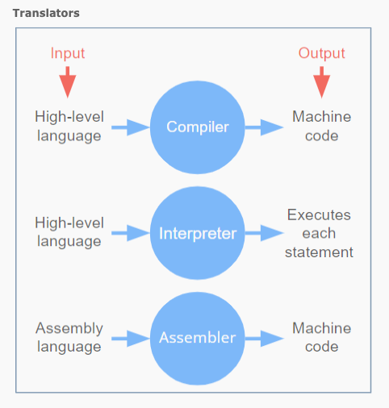
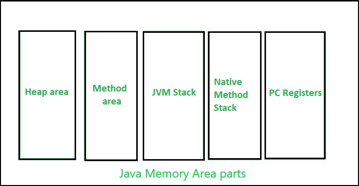
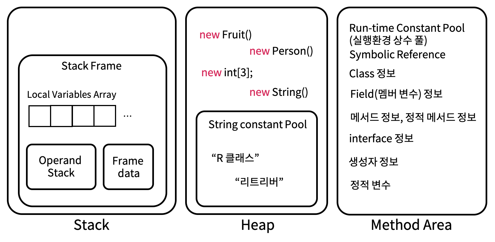

## 1) Java Introduction

### High Level Language

* 많은 경우 고급 프로그래밍 언어는 고급언어 > 어셈블리어 > 기계어 > 하드웨어로 추상화 됨

<p align="center">    </p>

<p align="center">https://www.cs.mtsu.edu/~xyang/2170/computerLanguages.html</p>

### Translator

* 프로그래머들이 작성한 코드를 컴퓨터가 이해할 수 있는 바이너리 형태로 변환해주는 프로그램
* [위키피디아 정의](https://en.wikipedia.org/wiki/Translator_(computing))
* [참고](https://www.helpteaching.com/lessons/1285/high-level-low-level-languages)

<p align="center">    </p>

<p align="center">https://www.helpteaching.com/lessons/1285/high-level-low-level-languages</p>

#### 컴파일러(compiler)

* 특정 프로그래밍 언어를 다른 프로그래밍 언어로 번역해주는 프로그램
* source code에서 object code로 변환
* 한번 컴파일하고 나면 다시 컴파일할 필요 없이 재사용 가능

#### 인터프리터(interpreter)

* 소스 코드를 한줄씩 읽으면서 실행


## 2) How Java Works

* Java의 경우 compiling과 interpretation 둘다 사용한다
* [참고](https://www.geeksforgeeks.org/compilation-execution-java-program/)
* 처음에 작성하는 코드(.java)는 자바 컴파일러(javac)에 의해 자바 바이트 코드(.class)로 변환
* 자바 바이트 코드는 JVM이 이해 가능한 언어
* JVM은 인터프리터와 JIT 컴파일러를 통해 각 운영체제에 맞는 기계어로 해석해서 실행
  * 이런 운영체제의 독립성은 자바의 주요한 특징 중 하나

<p align="center">    </p>

<p align="center">https://www.geeksforgeeks.org/compilation-execution-java-program/</p>

* 컴파일 : ```javac Main.java``` (```Main.class```파일 생성)
* 실행 : ```java Main```
* IDE를 사용하는 경우 보통 위의 과정을 한번에 처리해줌

## 3) Java Memory Structure

<p align="center">    </p>

<p align="center">https://www.geeksforgeeks.org/java-memory-management/</p>

<p align="center">    </p>

<p align="center">https://www.codelatte.io/courses/java_programming_basic/KUYNAB4TEI5KNSJV</p>

### 메서드 영역(Method Area)

* 프로그램을 실행하는데 필요한 공통 데이터 관리 (모든 영역에서 공유)
  * 예를 들어 메서드는 메서드 영역에서 공통으로 관리되고 실행된다

* 클래스 정보
  * 클래스의 실행 코드(바이트 코드)
  * 클래스의  필드, 메서드, 생성자 코드등의 모든 실행 코드가 존재
* ```static```영역: ```static```변수 보관
* Runtime Constant Pool

### 스택 영역(Stack Area)

* 자바 실행 시, 하나의 실행 스택 생성
* 각 스택 프레임은 지역 변수, 중간 연산 결과, 메서드 호출 등의 정보 포함
* 메서드 호출 시 스택 프레임이 하나 쌓이고, 메서드 종료시 해당 스택 프레임 제거
  * 스택 프레임 종료시 지역 변수도 함께 제거됨

* 스택 영역은 각 쓰레드(thread)별로 하나의 실행 스택이 생성됨
* Stack Overflow라는 것은 가능한 스택 영역을 초과하는 경우 발생
  * 보통 지나치게 깊은 재귀나 콜체인 때문에 발생

### 힙 영역(Heap Area)

* 인스턴스와 배열이 생성되는 영역
  * 인스턴스 변수 등이 여기에 포함

* 대부분 GC가 이루어지는 영역
  * 참조되지 않는 인스턴스는 GC에 의해 제거
* String Constant Pool

## 4) Further Reading

* JIT 컴파일러
* 클래스 로더
* JVM의 구조
* 메모리 구조
* Java Permgen vs Metaspace


## 참고

---

1. [김영한의 자바 입문](https://www.inflearn.com/course/%EA%B9%80%EC%98%81%ED%95%9C%EC%9D%98-%EC%9E%90%EB%B0%94-%EC%9E%85%EB%AC%B8)
2. [https://www.geeksforgeeks.org/compilation-execution-java-program/](https://www.geeksforgeeks.org/compilation-execution-java-program/)
3. [https://www.helpteaching.com/lessons/1285/high-level-low-level-languages](https://www.helpteaching.com/lessons/1285/high-level-low-level-languages)
4. [https://www.geeksforgeeks.org/java-memory-management/](https://www.geeksforgeeks.org/java-memory-management/)
5. [https://www.codelatte.io/courses/java_programming_basic/KUYNAB4TEI5KNSJV](https://www.codelatte.io/courses/java_programming_basic/KUYNAB4TEI5KNSJV)

