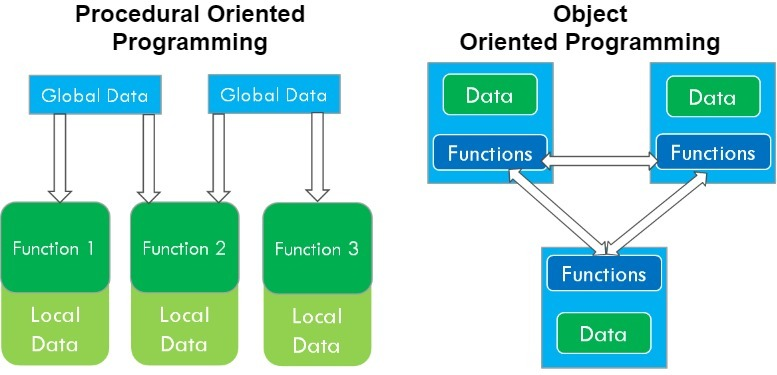
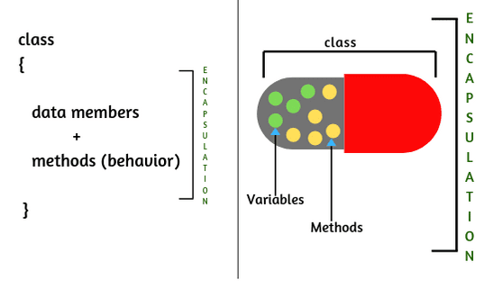

## 1) OOP vs POP

* 객체 지향 프로그래밍(Object-Oriented-Programming)
* [Python에서의 객체 지향 프로그래밍](https://seungki1011.github.io/python_6/#PythonObjectOrientedProgramming)
* 객체 지향 프로그래밍은 절차 지향(procedural)과 다르게 데이터와 해당 데이터에 대한 행동(메소드)이 하나의 객체 안에 함께 포함
  * 절차 지향적 프로그래밍의 한계의 원인중 하나는 데이터와 기능의 분리 때문 → 관리 포인트(manage point)의 증가


<p align="center">    </p>

<p align='center'>https://simplesnippets.tech/java-introduction-to-object-oriented-programming-oop/</p>

## 2) Instance Method

* 인스턴스 메소드는 인스턴스 생성 후 ```참조변수.methodName();```으로 호출
  * 인스턴스 메소드는 인스턴스 변수 관련된 작업을 할 수 있음
  * 메소드 내에서 인스턴스 변수 사용 가능

* 객체(instance)는 자신의 메소드를 통해 자신의 멤버 변수에 접근
* 클래스는 기능 역할을 하는 메소드도 포함한다
  * 속성(데이터) : 멤버 변수 + 기능 : 메소드

* 인스턴스 메소드는 ```static``` 접근 제어자 사용 불가

[아래 코드](https://github.com/seungki1011/Data-Engineering/blob/main/java/start-java/src/main/java/de/java/oop/ControllerData.java)

```java
public class ControllerData {
    int value;

    void increase() {
        value++;
        System.out.println("Increased value(+1) | value = "+value);
    }
}
```

[아래 코드](https://github.com/seungki1011/Data-Engineering/blob/main/java/start-java/src/main/java/de/java/oop/oop1.java)

```java
public class oop1 {
    public static void main(String[] args) {
        ControllerData controllerData = new ControllerData();
        System.out.println("Current value = "+controllerData.value);
        controllerData.increase();
        controllerData.increase();
        controllerData.increase();
        System.out.println("Current value = "+controllerData.value);
    }
}
```

```
Current value = 0
Increased value(+1) | value = 1
Increased value(+1) | value = 2
Increased value(+1) | value = 3
Current value = 3
```

## 3) Static Method

* 정적 메소드
* 객체(instance) 생성 없이 호출 가능
* 인스턴스 멤버와 관련 없는 작업 함
* 메소드 내에 인스턴스 변수 사용 불가
* [Static](https://github.com/seungki1011/Data-Engineering/blob/main/java/notes/(15)%20Static.md)에서 추가 설명

## 4) OOP Example

* 객체 지향 프로그래밍은 객체의 설계에 집중 해야함

[아래 코드](https://github.com/seungki1011/Data-Engineering/blob/main/java/start-java/src/main/java/de/java/oop/Account.java)

```java
public class Account {
    int balance;

    void checkStatus(){
        System.out.println("Current Balance: "+balance);
    }
    void deposit(int amount){
        System.out.println("(deposit) +"+amount);
        balance += amount;
    }
    void withdraw(int amount){
        if (balance >= amount){
            System.out.println("(withdraw) -"+amount);
            balance -= amount;
        } else {
            System.out.println("Insufficient Balance!");
            System.out.println("Current Balance: "+balance+", Withdraw Amount: "+amount);
        }
    }
}
```

[아래 코드](https://github.com/seungki1011/Data-Engineering/blob/main/java/start-java/src/main/java/de/java/oop/oop2.java)

```java
public class oop2 {
    public static void main(String[] args) {
        Account account = new Account();
        account.checkStatus();
        account.deposit(5000);
        account.withdraw(2000);
        account.checkStatus();
        account.withdraw(4000);
    }
}
```

```
Current Balance: 0
(deposit) +5000
(withdraw) -2000
Current Balance: 3000
Insufficient Balance!
Current Balance: 3000, Withdraw Amount: 4000
```


## 5) Encapsulation

* 캡슐화
* 속성과 기능을 묶어서 필요한 기능을 메소드를 통해 외부에 제공하는 것
* 변수에 대한 직접적인 접근을 막고 인스턴스가 제공하 필드와 메서드를 통해서 접근이 가능하도록 한다
* 캡슐화는 접근 제어자를 ```private```으로 설정해서 외 접근을 제한함
* 메소드는 ```public```으로 설정해서 메소드를 통한 간접 접근만 허용
* [접근제어자(Access Modifier)](https://github.com/seungki1011/Data-Engineering/blob/main/java/notes/(14)%20Access%20Modifier.md)에서 더 알아보기

<p align="center">    </p>

<p align='center'>https://waytoeasylearn.com/learn/encapsulation/</p>

## Further Reading

* [함수형 프로그래밍(Functional Programming)](https://www.geeksforgeeks.org/functional-programming-paradigm/)


## 참고

---

1. [김영한의 자바 기본](https://www.inflearn.com/course/%EA%B9%80%EC%98%81%ED%95%9C%EC%9D%98-%EC%8B%A4%EC%A0%84-%EC%9E%90%EB%B0%94-%EA%B8%B0%EB%B3%B8%ED%8E%B8/dashboard)
1. [자바의 정석-기초편](https://www.youtube.com/user/MasterNKS)
1. [https://www.geeksforgeeks.org/difference-between-oop-and-pop/](https://www.geeksforgeeks.org/difference-between-oop-and-pop/)
1. [https://simplesnippets.tech/java-introduction-to-object-oriented-programming-oop/](https://simplesnippets.tech/java-introduction-to-object-oriented-programming-oop/)
1. [https://waytoeasylearn.com/learn/encapsulation/](https://waytoeasylearn.com/learn/encapsulation/)