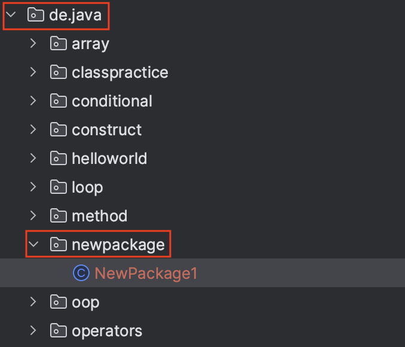

## Package

* 패키지
* 서로 관련된 클래스들의 묶음(Package)
* 패키지는 폴더로 볼 수 있음
  * 패키지안에 패키지가 들어갈 수 있음(하위 패키지)

<p align="center">    </p>


```java
package de.java.newpackage;

public class NewPackage1 {
    public static void main(String[] args) {

    }
}
```

* ```de```안의 ```java```안의 ```newpackage``` : ```de.java.newpackage```

## import

* ```import```는 사용할 클래스가 속한 패키지를 지정하는데 사용함
* ```import```문 사용시 클래스를 사용할 때 패키지명(풀네임)을 생략할 수 있음
* 같은 패키지 내의 클래스를 사용하는 경우 ```import```없이 또는 패키지 경로를 생략 가능한 상태로 사용 가능
* 같은 이름의 클래스가 있는 경우 ``import``는 둘중 하나만 선택 가능
  * 자주 사용하는 클래스를 ```import```
  * 자주 사용하지 않는 클래스는 풀 경로를 적어서 사용

### import 사용 x

```java
class ImportTest {
    java.util.Date today = new java.util.Date();
}
```

### import 사용 o

```java
import java.util.*;

class ImportTest {
    Date today = new Date();
}
```

* ```java.lang```패키지의 클래스는 import하지 않아도 사용할 수 있음
* ```import```문은 패키지문과 클래스 선언의 사이에 선언

> 1. ```package```
> 2. ```import```
> 3. ```class``` 선언

### static import

* ```static```메소드 사용시 클래스명 없이 바로 사용 가능

## Package Convention

* [자바 관례 참고](https://github.com/seungki1011/Data-Engineering/blob/main/java/notes/(2)%20Variables.md#2-java-convention)
* 관례라는 것은 무조건 지켜야 하는 것은 아님
* 패키지 이름은 모두 소문자
* 패키지 이름 앞부분은 보통 회사의 도메인 네임을 거꾸로 사용
  * 예시. ```com.company.myapp```
  * ```(회사, 조직).(제품, 서비스명).(기능적, 기술적 구분)```
* 패키지의 위계(hieararchy)를 구성할때는 보통 큰 분류에서 더 세부적인 분류로

> 위계 구조가 다음과 같다면
>
> * ```de```
>   * ```java```
>     * ```a```
>     * ```b```
>
> 패키지는 ```de.java.a```, ```de.java.b```, ```de.java```, ```de``` 총 4개가 존재함


## 참고

---

1. [김영한의 자바 기본](https://www.inflearn.com/course/%EA%B9%80%EC%98%81%ED%95%9C%EC%9D%98-%EC%8B%A4%EC%A0%84-%EC%9E%90%EB%B0%94-%EA%B8%B0%EB%B3%B8%ED%8E%B8/dashboard)
1. [자바의 정석-기초편](https://www.youtube.com/user/MasterNKS)
