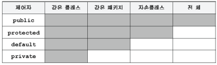
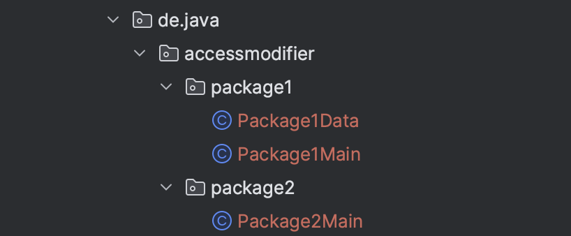

## [Index](https://github.com/seungki1011/Data-Engineering/blob/main/java/notes/JavaIndex.md)

1. [자바 소개(Introduction of Java)](https://github.com/seungki1011/Data-Engineering/blob/main/java/notes/(1)%20StartingJava.md)
2. [변수(Variables)](https://github.com/seungki1011/Data-Engineering/blob/main/java/notes/(2)%20Variables.md)
3. [연산자(Operators)](https://github.com/seungki1011/Data-Engineering/blob/main/java/notes/(3)%20Operators.md)
4. [조건문(Conditional)](https://github.com/seungki1011/Data-Engineering/blob/main/java/notes/(4)%20Conditional.md)
5. [반복문(Loop)](https://github.com/seungki1011/Data-Engineering/blob/main/java/notes/(5)%20Loop.md)
6. [형변환(Type Casting)](https://github.com/seungki1011/Data-Engineering/blob/main/java/notes/(6)%20Typecasting.md)
7. [배열(Array)](https://github.com/seungki1011/Data-Engineering/blob/main/java/notes/(7)%20Array.md)
8. [메서드(Method)](https://github.com/seungki1011/Data-Engineering/blob/main/java/notes/(8)%20Method.md)
9. [클래스(Class)](https://github.com/seungki1011/Data-Engineering/blob/main/java/notes/(9)%20Class.md)
10. [기본형과 참조형(Primitive Type & Reference Type)](https://github.com/seungki1011/Data-Engineering/blob/main/java/notes/(10)%20Reference%20Type.md)
11. [객체지향 프로그래밍(OOP)](https://github.com/seungki1011/Data-Engineering/blob/main/java/notes/(11)%20OOP.md)
12. [생성자(Constructor)](https://github.com/seungki1011/Data-Engineering/blob/main/java/notes/(12)%20Constructor.md)
13. [패키지(Package)](https://github.com/seungki1011/Data-Engineering/blob/main/java/notes/(13)%20Package.md)
14. [접근 제어자(Access Modifier)](https://github.com/seungki1011/Data-Engineering/blob/main/java/notes/(14)%20Access%20Modifier.md)
15. [Static](https://github.com/seungki1011/Data-Engineering/blob/main/java/notes/(15)%20Static.md)
16. [```final```](https://github.com/seungki1011/Data-Engineering/blob/main/java/notes/(16)%20Constant.md)
17. [상속(Inheritance)](https://github.com/seungki1011/Data-Engineering/blob/main/java/notes/(17)%20Inheritance.md)
18. [다형성(Polymorphism)](https://github.com/seungki1011/Data-Engineering/blob/main/java/notes/(18)%20Polymorphism.md)
19. [예외 처리(Exception Handling)](https://github.com/seungki1011/Data-Engineering/blob/main/java/notes/(20)%20Exception.md)
20. [```java.time```패키지](https://github.com/seungki1011/Data-Engineering/blob/main/java/notes/(21)%20Date%26Time.md)
21. [```Collection``` Framework](https://github.com/seungki1011/Data-Engineering/blob/main/java/notes/(22)%20Collection.md)
22. [제네릭스(Generics)]()
23. [스트림(Stream)]()
24. [쓰레드(Thread)]()

---

## 1) Access Modifier

* 접근 제어자
* 제어자들은 클래스, 변수, 메서드의 선언부에 사용되어 부가적인 의미를 부여함
  
* 그 중에 접근 제어자는 특정 필드나 메서드의 외부로부터의 접근을 제한할 수 있음
  
* 접근 제어자는 필드, 메서드, 생성자에 사용할 수 있음
  * 클래스에도 일부 접근 제어자 사용 가능

* 접근 제어자는 단 하나만 사용 가능

* 접근 제어자는 속성과 기능을 어느 범위로 외부로부터 숨길 것인지 설정하기 위해서 사용

* ```protected```는 [상속(inheritance)](https://github.com/seungki1011/Data-Engineering/blob/main/java/notes/(17)%20Inheritance.md#5-protected)에서 추가 설명

<p align="center">    </p>

<p align='center'>자바의 정석 - 기초</p>

* 범위 : ```public```>```protected```>```default(package-private)```>```private```

<br>

---

## 2) Using Access Modifiers

### Field, Method (접근 제어자의 사용)

<p align="center">    </p>

[```Package1Data.java```](https://github.com/seungki1011/Data-Engineering/blob/main/java/start-java/src/main/java/de/java/accessmodifier/package1/Package1Data.java)

```java
public class Package1Data {
    public int publicInt = 10;
    int defaultInt = 11;
    private int privateInt = 12;
    public String publicString = "This is a public String";
    String defaultString = "This is a package-private String";
    private String privateString = "This is a private String";

    public void publicMethod() {
        System.out.println("---------------------------------------------");
        System.out.println("1.public method is called");
        System.out.println("public Int = "+publicInt);
        System.out.println("public String = "+publicString);
    }
    private void privateMethod() {
        System.out.println("---------------------------------------------");
        System.out.println("3.private method is called");
        System.out.println("private Int = "+privateInt);
        System.out.println("private String = "+privateString);
    }
    void defaultMethod() {
        System.out.println("---------------------------------------------");
        System.out.println("2.package-private(default) method is called.");
        System.out.println("package-private(default) Int = "+defaultInt);
        System.out.println("package-private(default) String = "+defaultString);
    }
    public void innerAccess() {
        publicInt = 1;
        defaultInt = 2;
        // 같은 클래스의 필드에 접근 가능
        privateInt = 3;
        publicString = "This is a public String(Inner Access)";
        defaultString = "This is a package-private String(Inner Access)";
        privateString = "This is a private String(Inner Access)";
        publicMethod();
        defaultMethod();
        privateMethod();
    }
}
```

[```Package1Main.java```](https://github.com/seungki1011/Data-Engineering/blob/main/java/start-java/src/main/java/de/java/accessmodifier/package1/Package1Main.java)

```java
public class Package1Main {
    public static void main(String[] args) {
        Package1Data p = new Package1Data();
        p.publicMethod();
        p.defaultMethod();

        // private method를 다른 클래스(Package1Main -> Package1Data)에서 접근 하면 에러 발생
        // error: privateMethod() has private access in de.java.accessmodifier.package1.Package1Data
        // p.privateMethod();
				
        p.innerAccess();
    }
}
```

```
---------------------------------------------
1.public method is called
public Int = 10
public String = This is a public String
---------------------------------------------
2.package-private(default) method is called.
package-private(default) Int = 11
package-private(default) String = This is a package-private String
---------------------------------------------
1.public method is called
public Int = 1
public String = This is a public String(Inner Access)
---------------------------------------------
2.package-private(default) method is called.
package-private(default) Int = 2
package-private(default) String = This is a package-private String(Inner Access)
---------------------------------------------
3.private method is called
private Int = 3
private String = This is a private String(Inner Access)
```

[```Package2Main.java```](https://github.com/seungki1011/Data-Engineering/blob/main/java/start-java/src/main/java/de/java/accessmodifier/package2/Package2Main.java)

```java
public class Package2Main {
    public static void main(String[] args) {
        Package1Data p = new Package1Data();
        p.publicMethod();

        // default(package-private)는 서로 다른 패키지에서 접근 불가능 (package2 -> package1)
        // p.defaultMethod();
        // p.privateMethod();

        p.innerAccess();
    }
}
```

```
---------------------------------------------
1.public method is called
public Int = 10
public String = This is a public String
---------------------------------------------
1.public method is called
public Int = 1
public String = This is a public String(Inner Access)
---------------------------------------------
2.package-private(default) method is called.
package-private(default) Int = 2
package-private(default) String = This is a package-private String(Inner Access)
---------------------------------------------
3.private method is called
private Int = 3
private String = This is a private String(Inner Access)
```

* ```Package1Main```에서 ```innerAccess()```를 호출 → ```Package2Data```에서의 ```innerAccess()```는 ```public```, ```default```, ```private```에 해당하는 모든 필드 접근 가능 (같은 클래스 내)
* ```default```는 서로 다른 패키지에서 접근 불가능 (```de.java.accessmodifier.package1``` → ```de.java.accessmodifier.package2```)

<br>

### Constructor (접근 제어자의 사용)

* 일반적으로 생성자의 접근 제어자는 클래스의 접근 제어자와 일치함
* 생성자에 접근 제어자를 사용해서 인스턴스의 생성을 제할할 수 있음

### Class (접근 제어자의 사용)

* 클래스의 접근 제어자는 ```public```, ```default```만 사용 가능
* ```public``` 클래스는 반드시 파일명과 이름이 같아야 함
* 하나의 ```java```파일(소스 파일)에는 ```public```클래스는 단 하나만 존재 가능
  * ```java```파일에 ```default```를 사용하는 클래스는 무한정 생성 가능

<br>

---

## 3) Encapsulation

* [캡슐화](https://github.com/seungki1011/Data-Engineering/blob/main/java/notes/(11)%20OOP.md#5-encapsulation)
  * Recap: 캡슐화는 속성(data)과 기능(method)을 하나로 묶고, 외부에 꼭 필요한 기능만 노출하는 것 (나머지는 알약 처럼 내부에 숨기는 것)
* 캡슐화에서 데이터(속성)는 필수로 숨겨야 함
  * 유저가 데이터를 접근해서 변경하는 것을 막아야함
  * 데이터를 접근하기 위해서는 무조건 객체의 메서드를 통해서 접근하도록 한다
  * 대부분 데이터는 ```private```으로 막아둔다
* 캡슐화에서 내부에서만 사용하는 기능은 전부 숨긴다
  * 사용자가 필요한 기능만 노출한다

[```Item.java```](https://github.com/seungki1011/Data-Engineering/blob/main/java/start-java/src/main/java/de/java/accessmodifier/practice1/Item.java)

```java
public class Item {
    private String name;
    private int price;
    private int quantity;

    public Item(String name, int price, int quantity) {
        this.name = name;
        this.price = price;
        this.quantity = quantity;
    }

    public String getName() {
        return name;
    }

    public int getPrice() {
        return price;
    }

    public int getQuantity() {
        return quantity;
    }

    public int getItemTotalPrice() {
        return price * quantity;
    }
}
```

[```ShoppingCart.java```](https://github.com/seungki1011/Data-Engineering/blob/main/java/start-java/src/main/java/de/java/accessmodifier/practice1/ShoppingCart.java)

```java
public class ShoppingCart {
    // 1. 데이터(속성)는 전부 private
    private Item[] items = new Item[4];
    private int itemCount = 0;

    // 2. 유저가 사용하는 메서드는 public으로 노출
    public void addItem(Item item) {
        if(itemCount >= items.length){
            System.out.println("Shopping cart is full!");
            return;
        }
        items[itemCount] = item;
        itemCount++;
        System.out.println("item("+itemCount+") added");
    }
    public void displayItems(){
        System.out.println("Current Items in Shopping cart");
        for (int i = 0; i<itemCount; i++) {
            System.out.println("Name: "+items[i].getName()+", Price: "+items[i].getPrice()+", Quantity: "+items[i].getQuantity());
        }
        System.out.println("Total Price: "+getCartTotalPrice());
    }
  
    // 3. getCartTotalPrice는 내부에서만 사용하기 땨문에 private
    private int getCartTotalPrice() {
        int totalPrice = 0;
        for (int i = 0; i < itemCount; i++){
            totalPrice += items[i].getItemTotalPrice();
        }
        return totalPrice;
    }
}
```

[```ShoppingMain.java```](https://github.com/seungki1011/Data-Engineering/blob/main/java/start-java/src/main/java/de/java/accessmodifier/practice2/ShoppingMain.java)

```java
import de.java.accessmodifier.practice1.Item;
import de.java.accessmodifier.practice1.ShoppingCart;

public class ShoppingMain {
    public static void main(String[] args) {
        ShoppingCart c = new ShoppingCart();
        Item item1 = new Item("Chicken", 20000, 6);
        Item item2 = new Item("Cola", 2500, 4);
        Item item3 = new Item("Pizza", 32500, 2);
        Item item4 = new Item("MakGukSu", 11000, 1);
        Item item5 = new Item("Hamburger", 3000 , 15);

        c.addItem(item1);
        c.addItem(item2);
        c.addItem(item3);
        c.addItem(item4);
        c.addItem(item5);
        c.displayItems();
    }
}
```

```
item(1) added
item(2) added
item(3) added
item(4) added
Shopping cart is full!
Current Items in Shopping cart
Name: Chicken, Price: 20000, Quantity: 6
Name: Cola, Price: 2500, Quantity: 4
Name: Pizza, Price: 32500, Quantity: 2
Name: MakGukSu, Price: 11000, Quantity: 1
Total Price: 206000
```

<br>

---

## 4) Further Reading

* Getter and Setter를 사용하는 것이 좋은가?

<br>

## Reference

---

1. [김영한의 자바 기본](https://www.inflearn.com/course/%EA%B9%80%EC%98%81%ED%95%9C%EC%9D%98-%EC%8B%A4%EC%A0%84-%EC%9E%90%EB%B0%94-%EA%B8%B0%EB%B3%B8%ED%8E%B8/dashboard)
1. [자바의 정석-기초편](https://www.youtube.com/user/MasterNKS)

