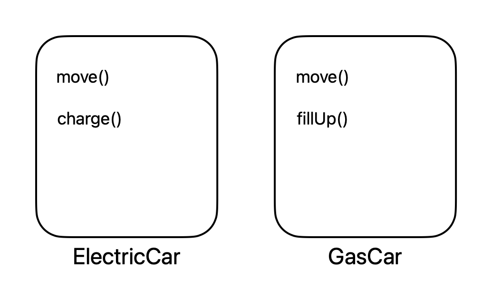
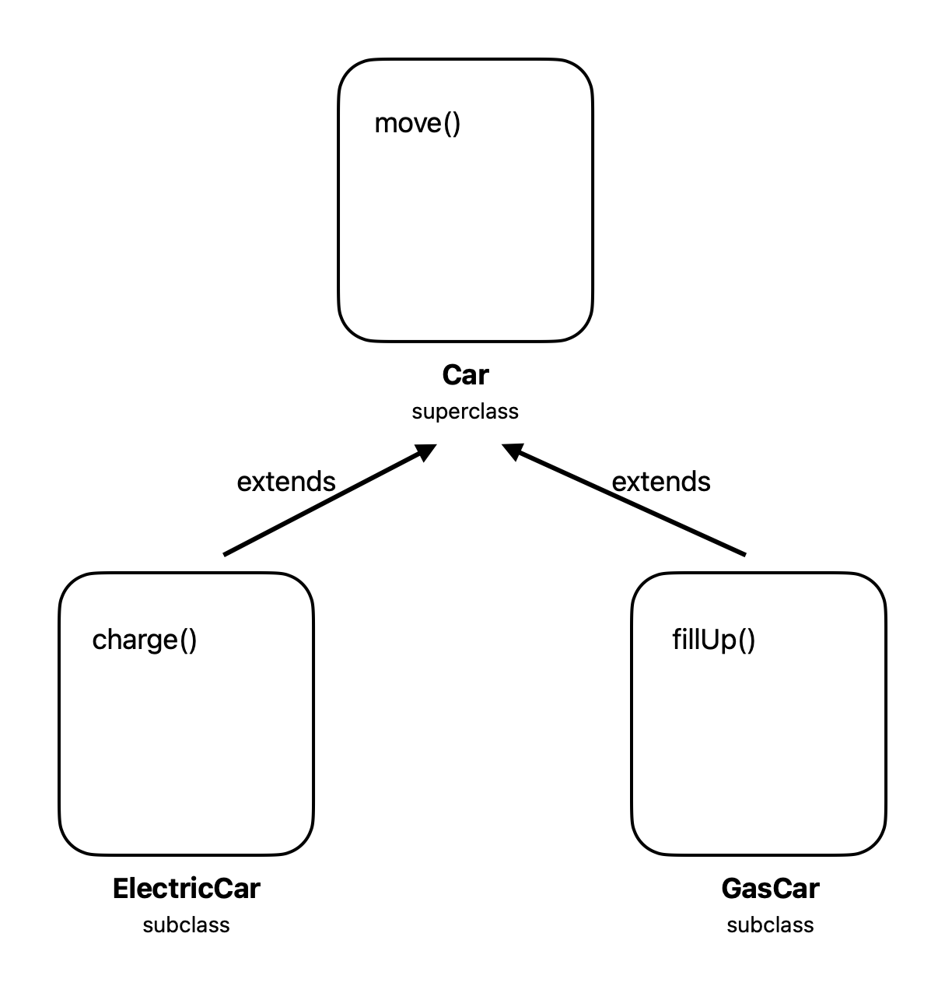
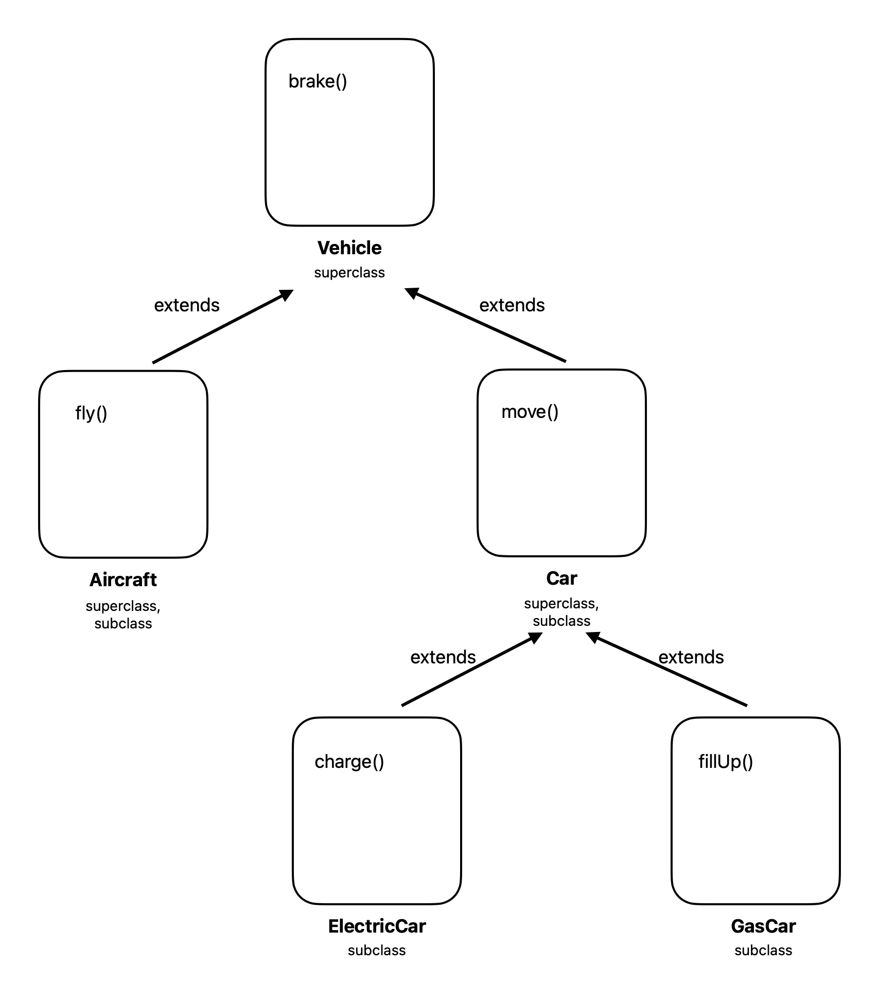
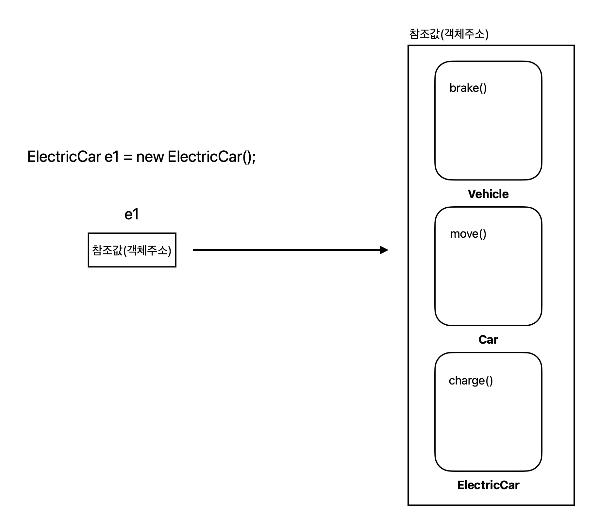
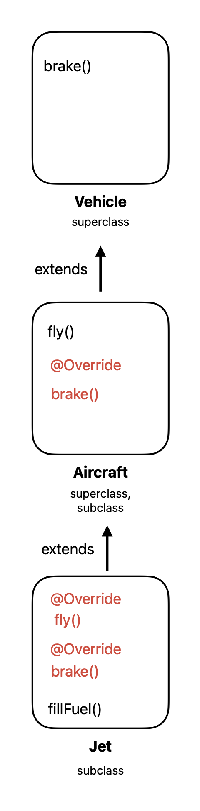
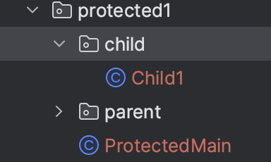
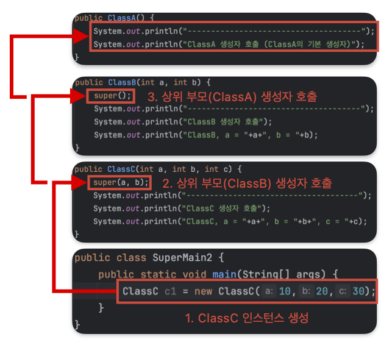

## 1) Inheritance

* 상속
* 상속은 기존의 클래스를 재사용해서 새로운 클래스를 작성하는 것
  * 기존 클래스의 필드와 메서드를 재사용하게 해줌

* 두 클래스를 조상(parent, superclass)과 자손(child, subclass)으로 관계를 맺음
* 자손은 조상의 모든 멤버를 상속 받음 (생서자, 초기화 블럭 제외)
* 자손의 멤버수는 조상보다 적을수 없음
* 상속을 위해서 ```extends``` 키워드 사용
* ```extends``` 대상은 하나만 선택 가능
* 자식 클래스는 부모 클래스를 상속 받기 때문에 접근이 가능하지만. 부모 클래스는 자식 클래스를 사용하는 것은 불가능

### 상속하지 않는 경우 (Without Inheritence)

```ElectricCar```

```java
public class ElectricCar {
    public void move() {
        System.out.println("The car is currently moving on ground!");
    }
    public void charge() {
        System.out.println("Charging the car!");
    }
}
```

```GasCar```

```java
public class GasCar {
    public void move() {
        System.out.println("The car is currently moving on ground!");
    }
    public void fillUp() {
        System.out.println("Filling up the car!");
    }
}
```

```ExtendsMain1```

```java
public class ExtendMain1 {
    public static void main(String[] args) {
        ElectricCar e1 = new ElectricCar();
        e1.move();
        e1.charge();

        GasCar g1 = new GasCar();
        g1.move();
        g1.fillUp();
    }
}
```

```
The car is currently moving on ground!
Charging the car!
The car is currently moving on ground!
Filling up the car!
```

* ```ElectricCar```과 ```GasCar```는 공통으로 사용하는 ```move()```가 존재함
  * ```move()``` : 모든 자동차들이 공통으로 가지는 기능(이동)

<p align="center">    </p>

<p align='center'>상속받지 않은 두 클래스</p>

### 상속하는 경우 (Using ```extends```)

* ```extends```를 사용해서 상속하는 경우
* 공통으로 가지는 메서드를 포함하는 조상 클래스를 만들고 자손 클래스가 상속 받게하면 됨

[```ElectricCar.java```](https://github.com/seungki1011/Data-Engineering/blob/main/java/start-java/src/main/java/de/java/inheritance/extend1/ElectricCar.java)

```java
public class ElectricCar extends Car { // ElectricCar가 Car를 상속받는다
    public void charge() {
        System.out.println("Charging the car!");
    }
}
```

[```GasCar.java```](https://github.com/seungki1011/Data-Engineering/blob/main/java/start-java/src/main/java/de/java/inheritance/extend1/GasCar.java)

```java
public class GasCar extends Car { // GasCar가 Car를 상속받는다
    public void fillUp() {
        System.out.println("Filling up the car!");
    }
}
```

[```Car.java```](https://github.com/seungki1011/Data-Engineering/blob/main/java/start-java/src/main/java/de/java/inheritance/extend1/Car.java)

```java
public class Car {
    // 기존에 사용하던 move()를 부모 클래스로 옮기고, 자식 클래스가 상속 받을수 있도록 한다
    public void move() {
        System.out.println("The car is currently moving on ground!");
    }
}
```

* 자손 클래스들이 공통으로 사용하는 기능은 부모 클래스로 옮겨서 ```extends```로 상속받아서 사용하도록 함

[```ExtendsMain2.java```](https://github.com/seungki1011/Data-Engineering/blob/main/java/start-java/src/main/java/de/java/inheritance/extend1/ExtendsMain2.java)

```java
public class ExtendsMain2 {
    public static void main(String[] args) {
        ElectricCar e1 = new ElectricCar();
        e1.move();
        e1.charge();

        GasCar g1 = new GasCar();
        g1.move();
        g1.fillUp();

        Car c1 = new Car();
        c1.move();
    }
}
```

```
The car is currently moving on ground!
Charging the car!
The car is currently moving on ground!
Filling up the car!
The car is currently moving on ground!
```


<p align="center">    </p>

<p align='center'>상속받는 경우</p>

## 2) Single Inheritance

* 단일 상속
* Java는 단일 상속만을 허용한다
  * Java는 다중 상속(multiple inheritance)을 허용하지 않음
  * Java는 [인터페이스(interface)]()를 사용해서 다중 상속과 비슷한것을 사용 가능
  * 다중 상속 허용시 발생하는 [다이아몬드 문제](https://en.wikipedia.org/wiki/Multiple_inheritance#The_diamond_problem) 또는 클래스 계층의 복잡화 같은 문제들 때문
* 부모 클래스가 부모 클래스를 가지는 multi-level inheritance는 가능하다

[```Aircraft.java```](https://github.com/seungki1011/Data-Engineering/blob/main/java/start-java/src/main/java/de/java/inheritance/extend1/Aircraft.java)

```java
public class Aircraft extends Vehicle{ // Aircraft는 Vehicle 클래스를 상속 받음
    public void fly() {
        System.out.println("This aircraft is currently flying!");
    }
}
```

[```Vehicle.java```](https://github.com/seungki1011/Data-Engineering/blob/main/java/start-java/src/main/java/de/java/inheritance/extend1/Vehicle.java)

```java
public class Vehicle {
    public void brake() {
        System.out.println("This vehicle used the brake!");
    }
}
```

* ```Car```클래스도 ```extends```로 ```Vehicle```클래스를 상속 받음
* ```Aircraft```과 ```Car``` 클래스가 공통으로 지니는 기능을 ```Vehicle``` 클래스에서 상속 받도록 함

[```ExtendsMain3.java```](https://github.com/seungki1011/Data-Engineering/blob/main/java/start-java/src/main/java/de/java/inheritance/extend1/ExtendsMain3.java)

```java
public class ExtendsMain3 {
    public static void main(String[] args) {
        ElectricCar e1 = new ElectricCar();
        e1.move();
        e1.brake(); // ElectricCar도 Vehicle의 메서드를 상속 받았음

        Aircraft a1 = new Aircraft();
        a1.fly();
        a1.brake();

        Vehicle v1 = new Vehicle();
        v1.brake();
    }
}
```

```
The car is currently moving on ground!
This vehicle used the brake!
This aircraft is currently flying!
This vehicle used the brake!
This vehicle used the brake!
```

<p align="center">    </p>

<p align='center'>Multilevel Inheritance</p>


## 3) Java Inheritance Memory Allocation

* Java 상속의 메모리 할당 구조
* **상속 관계의 인스턴스를 생성하면 그 인스턴스에는 부모 자식을 모두 포함해서 인스턴스를 생성함**

```java
ElectricCar e1 = new ElectricCar();
```

<p align="center">    </p>

<p align='center'>Inheritance Memory Allocation</p>

* 메서드를 호출하는 경우 호출하는 변수의 타입(클래스)을 기준으로 선택
  * 해당하는 타입이 우선순위를 가지고 만약 호출하려는 메서드가 없는 경우 부모 클래스를 순차적으로 올라가면서 확인 후 호출
* ```e1```에서 ```charge()```를 호출하는 경우 ```e1```의 타입은 ```ElectricCar```이기 때문에 해당 클래스에서 ```charge()```를 찾아서 호출
* ``e1``에서 ```move()```를 호출하는 경우 ```ElectricCar```를 확인하고, 존재하지 않는 경우 부모 클래스인 ```Car()```에서 찾아서 호출
* ```e1```에서 ```brake()```를 호출하는 경우 ```ElectricCar```부터 시작해서 상위 부모로 이동하면서 해당 메서드가 존재하는 클래스에서 찾아서 호출
  * 지금의 경우에는 ```Vehicle```클래스

## 4) Method Overriding

* 메서드 오버라이딩
* 조상 클래스로 부터 상속받은 메서드의 내용을 상속받는 클래스에 맞게 변경하는 것
  * 쉽게 말하자면 상속 받은 조상 클래스의 메서드를 자신에 맞게 덮어쓰는 것 (부모 클래스에 있는 메소드를 재정의하는 것)
* **오버라이딩의 조건**
  * 선언부가 같아야 한다(메서드명, 파라미터, 리턴타입)
  * 접근 제어자를 좁은 범위로 변경할 수 없다
    * 만약 조상의 메서드가 ```protected```라면, 범위가 같거나 넓은 ```protected```나 ```public```으로만 변경 가능
  * 조상 클래스의 메서드보다 많은 수의 예외를 선언할 수 없음
  * ```static```, ```final```, ```private```제어자가 붙은 메서드는 오버라이딩 불가능
    * ```static```은 그냥 클래스명을 통해 접근하면 됨
    * ```final```은 재정의 자체가 불가능함
    * ```private```은 해당 클래스 내에서만 접근 가능함
  * 생성자는 오버라이딩 불가능
* 오버라이딩하는 경우 ```@Override``` 어노테이션을 꼭 붙여주자
* 오버로딩(Overloading)은 메서드 이름이 같고 파라미터들이 다른 메서드를 여러개 정의하는 것 (유의하자)

[```Aircraft.java```](https://github.com/seungki1011/Data-Engineering/blob/main/java/start-java/src/main/java/de/java/inheritance/overriding/Aircraft.java)

```java
public class Aircraft extends Vehicle {
    public void fly() {
        System.out.println("This aircraft is currently flying!");
    }
    @Override // Vehicle의 brake()를 오버라이드
    public void brake() {
        System.out.println("This aircraft used the brake!");
    }
}
```

[```Jet.java```](https://github.com/seungki1011/Data-Engineering/blob/main/java/start-java/src/main/java/de/java/inheritance/overriding/Jet.java)

```java
public class Jet extends Aircraft {
    @Override // Aircraft의 fly()를 오버라이드
    public void fly() {
        System.out.println("This jet is currently flying!");
    }
    @Override // Vehicle의 brake()를 오버라이드
    public void brake() {
        System.out.println("This jet used the brake!");
    }
    public void fillFuel() {
        System.out.println("This jet is currently filling up fuel!");
    }
}
```

[```Vehicle.java```](https://github.com/seungki1011/Data-Engineering/blob/main/java/start-java/src/main/java/de/java/inheritance/overriding/Vehicle.java)

```java
public class Vehicle {
    public void brake() {
        System.out.println("This vehicle used the brake!");
    }
}
```

[```ExtendsMain4.java```](https://github.com/seungki1011/Data-Engineering/blob/main/java/start-java/src/main/java/de/java/inheritance/overriding/ExtendsMain4.java)

```java
public class ExtendsMain4 {
    public static void main(String[] args) {
        Jet j1 = new Jet();
        j1.fly();
        j1.brake();

        Aircraft a1 = new Aircraft();
        a1.fly();
        a1.brake();

        Vehicle v1 = new Vehicle();
        v1.brake();
    }
}
```

```
This jet is currently flying!
This jet used the brake!
This aircraft is currently flying!
This aircraft used the brake!
This vehicle used the brake!
```

<p align="center">    </p>

<p align='center'>Overriding</p>

## 5) Protected

* ```protected``` : 같은 패키지안에서의 호출은 허용
  * 또한 패키지가 달라도 상속 관계의 호출은 허용

<p align="center">    </p>

[```Parent.java```](https://github.com/seungki1011/Data-Engineering/blob/main/java/start-java/src/main/java/de/java/inheritance/protected1/parent/Parent.java)

```java
public class Parent {
    public String publicString = "This is a public string in the parent package";
    protected String protectedString = "This is a protected string in the parent package";
    private String privateString = "This is a private string in the parent package";
    String defaultString = "This is a default(package-private) string in the parent package";

    public void publicMethod() {
        System.out.println("Public method in the parent package, parent class.");
    }
    protected void protectedMethod() {
        System.out.println("Protected method in the parent package, parent class.");
    }
    private void privateMethod() {
        System.out.println("Private method in the parent package, parent class.");
    }
    void defaultMethod() {
        System.out.println("Default(package-private) method in the parent package, parent class.");
    }
    public void insideParent() {
        System.out.println("-----Inside Parent class which is inside the parent package-----");
        System.out.println("publicString = "+publicString);
        System.out.println("protectedString = "+protectedString);
        System.out.println("defaultString = "+defaultString);
        System.out.println("privateString = "+privateString);
        publicMethod();
        protectedMethod();
        defaultMethod();
        privateMethod();
    }
}
```

[```Child1.java```](https://github.com/seungki1011/Data-Engineering/blob/main/java/start-java/src/main/java/de/java/inheritance/protected1/child/Child1.java)

```java
import de.java.inheritance.protected1.parent.Parent;

public class Child1 extends Parent {
    public void callFromParent() {
        publicString = "This is a public string redefined in the Child1 class";
        protectedString = "This is a protected string redefined in the Child1 class";
        System.out.println(publicString);
        System.out.println(protectedString); // 서로 다른 패키지, 그러나 상속 관계라서 접근 가능

        // System.out.println(defaultString); // 서로 다른 패키지라서 접근 불가
        // System.out.println(privateString); // 서로 다른 클래스라서 접근 불가

        publicMethod();
        protectedMethod();

        insideParent();
    }
}
```

[```ProtectedMain.java```](https://github.com/seungki1011/Data-Engineering/blob/main/java/start-java/src/main/java/de/java/inheritance/protected1/ProtectedMain.java)

```java
public class ProtectedMain {
    public static void main(String[] args) {
        Child1 c1 = new Child1();
        c1.callFromParent();

        Parent p1 = new Parent();
        p1.insideParent();
    }
}
```

```
This is a public string redefined in the Child1 class
This is a protected string redefined in the Child1 class
Public method in the parent package, parent class.
Protected method in the parent package, parent class.
-----Inside Parent class which is inside the parent package-----
publicString = This is a public string redefined in the Child1 class
protectedString = This is a protected string redefined in the Child1 class
defaultString = This is a default(package-private) string in the parent package
privateString = This is a private string in the parent package
Public method in the parent package, parent class.
Protected method in the parent package, parent class.
Default(package-private) method in the parent package, parent class.
Private method in the parent package, parent class.
-----Inside Parent class which is inside the parent package-----
publicString = This is a public string in the parent package
protectedString = This is a protected string in the parent package
defaultString = This is a default(package-private) string in the parent package
privateString = This is a private string in the parent package
Public method in the parent package, parent class.
Protected method in the parent package, parent class.
Default(package-private) method in the parent package, parent class.
Private method in the parent package, parent class.
```


## 6) ```super```

* 참조 변수 ```super```
* ```this```같은 경우 인스턴스 자신을 가리키는 참조변수, 인스턴스의 주소가 저장되어 있음
  * 지역변수와 인스턴스 변수를 구분할때 사용
* ```super```도 ```this```와 유사함
  * 조상 클래스의 멤버와 자신의 멤버를 구별하는데 사용
* ```super```는 부모 클래스를 가리키는 참조 변수
  * 부모와 자식 클래스의 필드명이 같거나 메서드가 오버라이딩 되어 있으면 자식에서 부모의 필드나 메서드를 호출할 수 없음
  * ```super```는 부모 클래스에 대한 참조를 나타냄

[```Animal.java```](https://github.com/seungki1011/Data-Engineering/blob/main/java/start-java/src/main/java/de/java/inheritance/super1/Animal.java)

```java
public class Animal {
    public String name = "Animal";
    public String sound = "Growl!";

    public void eat() {
        System.out.println("Eating");
    }
}
```

[```Dog.java```](https://github.com/seungki1011/Data-Engineering/blob/main/java/start-java/src/main/java/de/java/inheritance/super1/Dog.java)

```java
public class Dog extends Animal{
    public String name = "Dog";

    @Override
    public void eat() {
        System.out.println("Eating meat");
    }
    public void bark() {
        System.out.println("Barking. Bow wow!");
    }
    void call() {
        System.out.println("----------Check Variable Values-----------");
        System.out.println("this.name = "+this.name);
        System.out.println("super.name = "+super.name); // 부모 클래스인 Animal의 name 사용
        System.out.println("sound = "+sound);

        System.out.println("----------Call methods-----------");
        System.out.print("called this.eat() : ");
        this.eat();
        System.out.print("called super.eat() : ");
        super.eat(); // 부모 클래스인 Animal의 eat()를 호출
        System.out.print("called bark() : ");
        bark();
    }
}
```

[```SuperMain1.java```](https://github.com/seungki1011/Data-Engineering/blob/main/java/start-java/src/main/java/de/java/inheritance/super1/SuperMain1.java)

```java
public class SuperMain1 {
    public static void main(String[] args) {
        Dog d1 = new Dog();
        d1.call();
    }
}
```

```
----------Check Variable Values-----------
name = Dog
super.name = Animal
sound = Growl!
----------Call methods-----------
called eat() : Eating meat
called super.eat() : Eating
called bark() : Barking. Bow wow!
```

* 자식 클래스에 부모 클래스와 동일한 변수가 존재하거나 오버라이드한 메서드가 존재하는 경우, ```super```를 이용해서 부모 클래스의 변수나 메서드를 호출할 수 있음


## 7) ```super()```

* 조상 클래스의 생성자
* ```this()```의 경우 내 클래스의 생성자를 호출하는 것
* 상속 관계의 인스턴스를 생성하는 경우, 메모리에서는 자식과 부모 클래스 영역이 각각 다 만들어짐(참조값은 동일)
  * 각 클래스에 대한 생성자도 모두 호출 됨

* **자식 클래스의 생성자에서 부모 클래스의 생성자를 반드시 호출해야 됨**
  * 기본 생성자의 경우 ```super()```생략 가능

[```ClassA.java```](https://github.com/seungki1011/Data-Engineering/blob/main/java/start-java/src/main/java/de/java/inheritance/superconstructor/ClassA.java)

```java
public class ClassA {
    public ClassA() {
        System.out.println("-------------------------------------");
        System.out.println("ClassA 생성자 호출 (ClassA의 기본 생성자)");
    }
}
```

[```ClassB.java```](https://github.com/seungki1011/Data-Engineering/blob/main/java/start-java/src/main/java/de/java/inheritance/superconstructor/ClassB.java)

```java
public class ClassB extends ClassA{
    public ClassB(int a) {
        super(); // 기본 생성자 생략 가능, 원래는 첫줄에서 부모의 생성자를 호출해야 함
        System.out.println("-------------------------------------");
        System.out.println("ClassB 생성자 호출");
        System.out.println("ClassB, a = "+a);
    }
    public ClassB(int a, int b) {
        super();
        System.out.println("-------------------------------------");
        System.out.println("ClassB 생성자 호출");
        System.out.println("ClassB, a = "+a+", b = "+b);
    }
}
```

[```ClassC.java```](https://github.com/seungki1011/Data-Engineering/blob/main/java/start-java/src/main/java/de/java/inheritance/superconstructor/ClassC.java)

```java
public class ClassC extends ClassB {

    public ClassC() {
        // super(); // ClassB에는 기본 생성자가 존재하지 않기 때문에 super() 불가능
        super(1); // super()에 직접 값 넣어서 사용해야 함
    }
    public ClassC(int a) {
        super(a);
        System.out.println("-------------------------------------");
        System.out.println("ClassC 생성자 호출");
        System.out.println("ClassC, a = "+a);
    }
    public ClassC(int a, int b) {
        super(a, b);
        System.out.println("-------------------------------------");
        System.out.println("ClassC 생성자 호출");
        System.out.println("ClassC, a = "+a+", b = "+b);
    }
    public ClassC(int a, int b, int c) {
        super(a, b);
        System.out.println("-------------------------------------");
        System.out.println("ClassC 생성자 호출");
        System.out.println("ClassC, a = "+a+", b = "+b+", c = "+c);
    }
}

```

[```SuperMain2.java```](https://github.com/seungki1011/Data-Engineering/blob/main/java/start-java/src/main/java/de/java/inheritance/superconstructor/SuperMain2.java)

```java
public class SuperMain2 {
    public static void main(String[] args) {
        ClassC c1 = new ClassC(10,20,30);
    }
}
```

```
-------------------------------------
ClassA 생성자 호출 (ClassA의 기본 생성자)
-------------------------------------
ClassB 생성자 호출
ClassB, a = 10, b = 20
-------------------------------------
ClassC 생성자 호출
ClassC, a = 10, b = 20, c = 30
```

* 생성자 순서는 ```ClassA ```→ ```ClassB```→ ```ClassC```
* 자식 생성자의 첫줄에서 부모의 생성자를 무조건 호출해야하기 때문에 생성자 실행 순서는 최상위 부모부터 시작

<p align="center">    </p>

<p align='center'>생성자 호출 순서</p>


## 참고

---

1. [김영한의 자바 기본](https://www.inflearn.com/course/%EA%B9%80%EC%98%81%ED%95%9C%EC%9D%98-%EC%8B%A4%EC%A0%84-%EC%9E%90%EB%B0%94-%EA%B8%B0%EB%B3%B8%ED%8E%B8/dashboard)
1. [자바의 정석-기초편](https://www.youtube.com/user/MasterNKS)
1. [https://www.w3schools.com/java/java_inheritance.asp](https://www.w3schools.com/java/java_inheritance.asp)
1. [https://www.javatpoint.com/super-keyword](https://www.javatpoint.com/super-keyword)