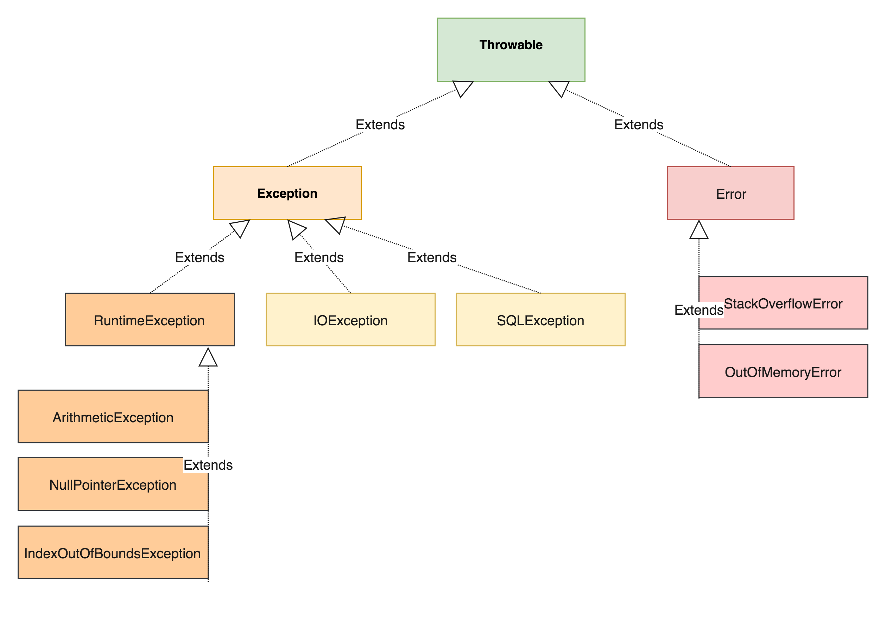
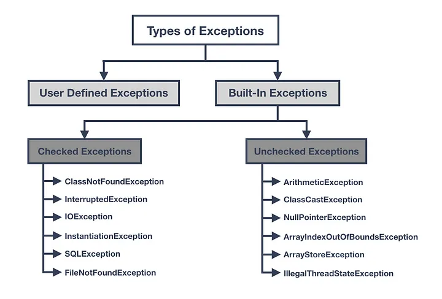
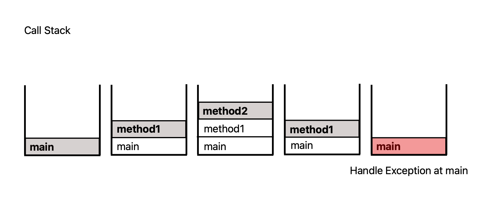

## 1) Exception, Error

* 자바의 런타임 에러는 예외(Exception)와 에러(Error)로 구분할 수 있다
* 예외(exception)는 개발자가 프로그램에서 구현한 코딩 로직의 실수 또는 사용자의 영향으로 발생한다
* 에러(error)는 시스템이 종료되어야 할 수준의 상황과 같이 수습할 수 없는 심각한 문제 (보통 시스템 레벨에서 발생)
  * 대표적인 에러: ```OutOfMemoryError``` (Heap 내에 할당 받을 수 있는 최대 메모리 이상을 사용하는 경우 발생)
  * 에러를 방지하기 위해 에러 상황을 어느 정도 예측할 줄 알아야 함 
* 예외 보다 에러가 더 심각하다
* 자바에서는 상속을 이용해서 예외를 표현한다
* 모든 예외 클래스는 ```Throwable```의 자손

<p align="center">    </p>

<p align='center'>https://www.javacodemonk.com/java-exception-class-hierarchy-92e8224e</p>

* 실제로는 위 그림 보다 많음
* ```RuntimeException```은 보통 개발자의 실수로 발생하는 예외
* 나머지 ```Exception```들은 사용자의 사용과 같은 외적인 요인으로 발생하는 예외


## 2) Exception Handling

* 예외 처리
* 프로그램 실행 시 발생할 수 있는 예외에 대비한 코드를 작성
* 예외 처리를 통해서 비정상 종료를 방지하고, 정상 실행 상태를 유지할 수 있도록 한다

```java
try {
	// 예외 발생 가능성이 있는 코드
} catch (Exception1 e) { // 변수는 보통 'e'로 설정
  // Exception1이 발생할 경우 처리하기 위한 로직
} catch (Exception2 e) {
  // Exception2가 발생할 경우 처리하기 위한 로직
}
```

[```ExceptionMain1.java```](https://github.com/seungki1011/Data-Engineering/blob/main/java/start-java/src/main/java/de/java/exception/ExceptionMain1.java)

```java
public class ExceptionMain1 {
    public static void main(String[] args) {

        // 1. Arithmetic Exception
        System.out.println(1);
        try {
            System.out.println(2/0);
        } catch (ArithmeticException e) { // 0으로 나눌 시 발생
            System.out.println("--------------Exception--------------");
            System.out.println("Wrong Calculation!");
            System.out.println("Arithmetic Exception has occurred.");
            System.out.println("-------------------------------------");
        }
        System.out.println(3);
        System.out.println(4);

        // 2. ArrayIndexOutOfBounds Exception
        int[] array = {1, 2, 3, 4};

        try {
            System.out.println(array[4]); // 배열의 범위를 벗어난 경우 ArrayIndexOutOfBoundsException
        } catch (ArrayIndexOutOfBoundsException e) {
            System.out.println("--------------Exception--------------");
            System.out.println("Tried to approach non-existing array index!");
            System.out.println("ArrayIndexOutOfBoundsException has occurred.");
            System.out.println("-------------------------------------");
        }

        // 3. try 블럭 내에 예외 발생 후 흐름
        try {
            System.out.println(1);
            System.out.println(0/0); // 여기서 예외 발생 -> 바로 catch 블럭으로 넘어감
            // 예외 발생 후 나머지 try 블럭 내의 코드는 실행되지 않음
            System.out.println(2); // 예외 발생 후 실행 x
            System.out.println(3); // 예외 발생 후 실행 x
        } catch (ArithmeticException e) {
            System.out.println("Arithmetic Exception has occurred.");
            System.out.println("try 블럭 안에서 예외 발생 하면 바로 catch 블럭으로 넘어감");
            System.out.println("try 블럭의 남은 코드는 실행되지 않는다.");
        }
        System.out.println(4);
    }
}
```

```
1
--------------Exception--------------
Wrong Calculation!
Arithmetic Exception has occurred.
-------------------------------------
3
4
--------------Exception--------------
Tried to approach non-existing array index!
ArrayIndexOutOfBoundsException has occurred.
-------------------------------------
1
Arithmetic Exception has occurred.
try 블럭 안에서 예외 발생 하면 바로 catch 블럭으로 넘어감
try 블럭의 남은 코드는 실행되지 않는다.
4
```

* ```try``` 블럭 내의 코드에서 예외가 발생 → ```catch```블럭으로 넘어가서 맞는 예외가 있는지 찾음 (남은 ```try```블럭의 코드는 실행하지 않고 넘어간다)   →  맞는 예외가 있는 경우 ```catch``` 블럭의 로직 실행
  * 만약 맞는 예외가 없을 경우 예외 처리에 실패한다

```java
        // 4. 예외 처리가 안되는 경우
        try {
            System.out.println(0/0); // 예외 발생
        } catch (ArrayIndexOutOfBoundsException e) {
            System.out.println("This is a ArrayIndexOutOfBoundsException");
        }
        System.out.println("This part is outside of the try-catch statement");
        // 맞는 예외를 처리할 수 있는 catch 블럭이 없기 때문에 예외는 처리되지 않는다
        // Exception in thread "main" java.lang.ArithmeticException: / by zero
        //	at de.java.exception.ExceptionMain1.main(ExceptionMain1.java:47)
```

```
Exception in thread "main" java.lang.ArithmeticException: / by zero
at de.java.exception.ExceptionMain1.main(ExceptionMain1.java:47)
```

* 부모 ```exception```을 상위에 배치하면 ```exception```의 우선순위에 의해 해당 상위(부모) ```exception```이 예외를 처리해버릴 수 있음
  * 예시 : 가장 상위에 존재하는 ```Exception```을 제일 높은 ```catch```블럭에 배치하면 해당 ```catch``` 블럭에서 모든 예외가 처리되어서 예외 처리의 의미가 없어진다 (귀찮다면 그냥 저렇게 해도 되겠지만)
* 아무튼 이런 예외의 우선 순위를 잘 생각해서 ```catch``` 블럭을 배치하자

[```ExceptionMain2.java```](https://github.com/seungki1011/Data-Engineering/blob/main/java/start-java/src/main/java/de/java/exception/ExceptionMain2.java)

```java
public class ExceptionMain2 {
    public static void main(String[] args) {
        int[] array = {1, 2, 3, 4, 5};

        // 1. Exception의 배치
        try {
            System.out.println(0);
            System.out.println(1);
            System.out.println(2);
            System.out.println(array[5]); // ArrayIndexOutOfBoundException이지만 그냥 Exception으로 처리할 예정
            // 어차피 위에서 예외가 발생하기 때문에 아래 코드는 실행되지 않는다
            System.out.println(4);
            System.out.println(5);
            System.out.println(0/0);
        } catch (ArithmeticException ae) {
            System.out.println("ArithmeticException 발생!");
        } catch (Exception e) { // 위의 catch 블럭에서 예외를 걸러내지 못해도 가장 아래에서 가장 상위인 Exception으로 예외를 처리
            System.out.println("Exception 발생!");
        }
        System.out.println("---------------------------");

        // 2. Exception을 가장 위에 배치하는 경우
        try {
            System.out.println(0);
            System.out.println(1);
            System.out.println(2);
            System.out.println(0/0); // ArithmeticException
            System.out.println(3);
        } catch (Exception e) { // Exception을 가장 상위에 배치하면 여기서 모든 예외가 처리되어 버린다
            System.out.println("Exception 발생!");
        }
        // 어차피 Exception을 가장 상위에 쓰면 더 낮은 계층의 Exception을 아래에 배치하면 컴파일 에러 발생
        // error: exception java.lang.ArithmeticException has already been caught
        // catch (ArithmeticException ae) { // 실제 발생한 것은 ArithmeticException이지만 위에서 걸러져버림
            // System.out.println("ArithmeticException 발생!");
        // }
    }
}
```

```
0
1
2
Exception 발생!
---------------------------
0
1
2
Exception 발생!
```

* 구체적인 하위의 ```Exception```을 위에, 가장 상위의 ```Exception```은 아래에


## 3) Exception Variable

* 통상적으로 ```e```를 많이 사용
* 예외 객체의 참조 변수
* ```e```의 스코프는 해당 예외의 ```catch``` 블럭내
* ```e```를 이용해서 예외에 대한 정보를 확인하거나 여러가지 상호작용을 할 수 있음

[```ExceptionMain3.java```](https://github.com/seungki1011/Data-Engineering/blob/main/java/start-java/src/main/java/de/java/exception/ExceptionMain3.java)

```java
public class ExceptionMain3 {
    public static void main(String[] args) {
        // 1. getMessage() 사용 - e의 detailMessage 출력 (디버깅으로 확인해보면 알 수 있음)
        System.out.println("-------------------------------------");
        System.out.println(0);
        System.out.println(1);
        try {
            System.out.println(0/0);
        } catch (ArithmeticException e) {
            System.out.println("e.getMessage() : "+ e.getMessage());
        } catch (Exception e) {
            System.out.println("e.getMessage() : "+ e.getMessage());
        }
        System.out.println("-------------------------------------");
        // 2. printStackTrace() 사용 - 발생한 예외 메세지를 보여줌
        try {
            System.out.println(0/0);
        } catch (ArithmeticException e) {
            e.printStackTrace(); // 에러 메세지를 그대로 보여줌. 보안상 이런 메세지는 보여주지 말고 따로 로깅해서 확인해야함
        } catch (Exception e) {
            System.out.println("e.getMessage() : "+ e.getMessage());
        }
        System.out.println("-------------------------------------");
        System.out.println("Remaining Code");
    }
}
```

```
-------------------------------------
0
1
e.getMessage() : / by zero
-------------------------------------
-------------------------------------
Remaining Code
```

```
java.lang.ArithmeticException: / by zero
	at de.java.exception.ExceptionMain3.main(ExceptionMain3.java:19)
```

* 예외 발생시 인스턴스가 생성되는데, 발생한 예외에 대한 정보들이 담겨 있음
  * 여러가지 메서드를 통해서 정보에 접근 가능
* ```getMessage()``` : 발생한 예외의 인스턴스에 저장된 ```detailMessage```를 얻을 수 있음
* ```printStackTrace()``` : 예외 발생 당시 Call Stack에 있었던 메서드 정보와 예외 메세지를 출력


## 4) Multi Catch

* ```|```를 이용해서 다수의 예외들이 공통으로 사용하는 로직을 하나의 블럭으로 연결 가능
* 이때 ```|```로 연결된 예외들은 상속 관계에 있으면 안됨
  * 공통된 조상의 멤버만 사용가능
* ```ExceptionA```, ```ExceptionB```, ```ExceptionC``` 가 있다고 가정할때 ```ExceptionA```에만 존재하는 ```methodA```를 사용하는 것은 안됨
  * 멀티 캐치 블럭 내에서 ```methodA```를 사용해야하는 겨우면 ```instanceof```로 인스턴스를 판별해서 사용
  * 보통 예외 별로 다른 처리가 필요한 경우 그냥 보통 사용하던 ```catch```문 여러개를 사용하는 것을 권장

```java
try{
  // 예외 발생 가능성 있는 코드
}catch(ExceptionA | ExceptionB | ExceptionC e){
   e.parentMethod(); // 공통의 메서드만 사용가능
   /*
   필요한 경우 instanceof로 판단 후 캐스팅으로 다른 메서드 사용
   if(e instanceof ExceptionA) {
       ExceptionA a = (ExceptionA) e;
       a.methodA();
   }
   */
}
```


## 5) ```throw```

* 예외 발생시키기
* 예외를 생성 후 ```throw``` 키워드를 이용해서 예외 발생 시킬수 있음

[```ExceptionMain4.java```](https://github.com/seungki1011/Data-Engineering/blob/main/java/start-java/src/main/java/de/java/exception/ExceptionMain4.java)

```java
public class ExceptionMain4 {
    public static void main(String[] args) {

        try {
            // 예외의 객체 생성(예외 생성)
            Exception e = new Exception("고의 Exception(This is the message)"); // 예외의 detailMessage
            throw e; // throw로 예외 발생
            // throw new Exception("Exception was made(This is the message)"); // 한줄로 표현
        } catch (Exception e) {
            System.out.println("e.getMessage : "+e.getMessage());
        }
    }
}
```

```
e.getMessage : Exception was made(This is the message)
```


## 6) Checked, Unchecked Exception

* checked exception : 컴파일러가 예외 처리 여부를 체크 함
  * 예외 처리가 필수 (```try-catch```가 필수)
  * ```Exception```과 자손
  
* unchecked exception : 컴파일러가 예외 처리 여부를 체크 하지 않음
  * 예외 처리는 선택
  * ```RuntimeException```과 자손
  * Runtime에서 확인 가능


<p align="center">    </p>

<p align='center'>https://medium.com/javarevisited/checked-and-unchecked-exceptions-in-java-19166e68b66f</p>


## 7) ```throws```

* 예외를 호출자로 떠넘길 수 있음
  * 메서드가 호출시 발생가능한 예외를 호출하는 쪽에 알릴 수 있음
* ```throws```가 붙은 메서드는 반드시 ```try``` 블럭내에 호출되어야 함

```java
void method() throws ExceptionA, ExceptionB {
  // method 
}
```

* ```method()```를 사용하는 경우 ```ExceptionA```, ```ExceptionB``` 발생 가능 → 호출하는 쪽에서 ```ExceptionA```, ```ExceptionB```에 대한 예외 처리 → ```throws```를 다시 사용해서 또 떠넘기는 것도 가능

### ```throws```가 처리되는 과정

[```ExceptionMain5.java```](https://github.com/seungki1011/Data-Engineering/blob/main/java/start-java/src/main/java/de/java/exception/ExceptionMain5.java)

```java
public class ExceptionMain5 {
    public static void main(String[] args) { // main에서 throws Exception 하면 JVM으로 넘김
        try {
            System.out.println("Called method1");
            method1();
        } catch (Exception e) {
            System.out.println("Handled Exception in main");
        }
    }
    static void method1() throws Exception {
        System.out.println("method1 calls method2");
        method2();
    }
    static void method2() throws Exception{
        System.out.println("Exception is made in method2");
        throw new Exception();
    }
}
```

```
Called method1
method1 calls method2
Exception is made in method2
Handled Exception in main
```

<p align="center">    </p>

* ```main```에서 ```method1``` 호출 → ```method1```에서 ```method2``` 호출 → ```method2```에서 예외 발생 → ```method2```에서 발생한 예외를 호출자로 던짐(이 경우 ```method1```) → ```method1```에서 예외를 호출자로 던짐(이 경우 ```main```)
  * ```main```에서 ```try-catch```로 예외 처리를 함
  * 만약 ```main```에서 예외 처리를 안하고 ```throws Exception```을 하는 경우 JVM으로 예외를 던짐 → JVM의 예외 처리기 예외 처리 진행
* 무조건 ```main```에서 예외 처리를 하라는 뜻은 아님
  * 상황에 따라 어디에서 예외 처리를 진행할지 판단하면 됨

### exception rethrow

* 예외 되던지기
* ```catch```에서 예외처리를 하고 다시 ```throw```로 예외를 던짐 → 메서드와 ```main``` 양쪽에서 예외를 처리


## 8) ```try-catch-finally```

* 예외 발생 여부와 관계없이 항상 수행되어야 하는 코드를 ```finally``` 블럭에 넣는다
* 예외가 발생하지 않는다면 ```try```→ ```finally``` 순으로 실행

[```ExceptionMain6.java```](https://github.com/seungki1011/Data-Engineering/blob/main/java/start-java/src/main/java/de/java/exception/ExceptionMain6.java)

```java
public class ExceptionMain6 {
    public static void main(String[] args) {
        FileWriter f = null;

        try {
            f = new FileWriter("data.txt");
            System.out.println("Writing data to data.txt!");
            f.write("Hello World!");
            // f.close(); // 위에서 예외가 발생하면 close가 실행되지 않는 문제가 발생
            // -> close를 finally에서 실행하도록 함
        } catch (IOException e) {
            System.out.println("Handle IOException : "+e.getMessage());
        } finally {
            System.out.println("[finally block] 아래 코드는 항상 실행");
            if(f != null) { // f가 null이 아니라면
                try {
                    f.close();
                } catch (IOException e) {
                    System.out.println("Handle IOException(for f.close()) : "+e.getMessage());
                }
            } else {
                System.out.println("f is null");
            }
        }
    }
}
```

```
Writing data to data.txt!
[finally block] 아래 코드는 항상 실행
```


## 9) ```try-with-resource```

* 리소스 작업을 포함하는 경우 예외 처리를 도와줌
* ```finally```의 예시 처럼 기존에는 명시적으로 ```close()```를 사용했어야 함 → 코드가 복잡해지는 경향이 있음
* ```try```문 안에서만 사용되는 자원을 ```try-catch```가 끝나면 자동으로 닫을 수 있도록 함
  * ```try```문을 벗어나는 순간 자동으로 ```close()``` 호출

* ```FileWriter```는 ```AutoClosable``` 인터페이스를 가짐
  * [Java docs - ``FileWriter``](https://docs.oracle.com/javase/8/docs/api/java/io/FileWriter.html)
  * [Java docs - ```AutoClosable```](https://docs.oracle.com/javase/8/docs/api/java/lang/AutoCloseable.html)

* ```I/O```와 자주 쓰임

[```ExceptionMain7.java```](https://github.com/seungki1011/Data-Engineering/blob/main/java/start-java/src/main/java/de/java/exception/ExceptionMain7.java)

```java
public class ExceptionMain7 {
    public static void main(String[] args) {
        try (FileWriter f = new FileWriter("Data2.txt")) {
            System.out.println("Writing data to Data2.txt!");
            f.write("Hello World2!");
        } catch (IOException e) {
            e.printStackTrace();
        }
    }
}
```

```
Writing data to Data2.txt!
```


## 10) User Defined Exception

* 사용자 정의 예외
* 기본적으로 자바에 미리 정의 되어 있는 예외를 사용
* 그러나 특정 예외를 표현할 수 없거나, 특별한 목적이 있는 예외가 필요하다면 ```Throwable``` 또는 그 아래의 예외 클래스를 상속 받아서 사용자 정의 예외를 만들 수 있다
  * 입출력 문제  → ```IOException``` 상속 받아서 정의
  * 실행도중 발생하는 문제 → ```RuntimeException``` 상속 받아서 정의
  * 상황에 맞는 클래스를 상속 받아서 사용자 정의 예외 구현

```java
class UserDefinedException extends Exception { // Exception을 상속 받으면 무조건 필수 처리(Checked)
		// Exception에 관한 정보
  	// 기본 생성자로 예외 메세지 넣는 경우가 많음
}
```


## Further Reading

* Transaction내의 예외 처리
* chained exception


## 참고

---

1. [자바의 정석-기초편](https://www.youtube.com/user/MasterNKS)
1. [생활코딩 - Java 예외](https://www.youtube.com/watch?v=2CgnJZ5oWYs&list=PLuHgQVnccGMCrFJLxpjhE0N5tvOVxJuVB&index=2)
1. [점프 투 자바 - 예외 처리](https://wikidocs.net/229)
1. [https://www.javacodemonk.com/java-exception-class-hierarchy-92e8224e](https://www.javacodemonk.com/java-exception-class-hierarchy-92e8224e)
1. [https://medium.com/javarevisited/checked-and-unchecked-exceptions-in-java-19166e68b66f](https://medium.com/javarevisited/checked-and-unchecked-exceptions-in-java-19166e68b66f)
1. [https://www.iitk.ac.in/esc101/05Aug/tutorial/essential/exceptions/definition.html](https://www.iitk.ac.in/esc101/05Aug/tutorial/essential/exceptions/definition.html)
1. [Java docs - ``FileWriter``](https://docs.oracle.com/javase/8/docs/api/java/io/FileWriter.html)
1. [Java docs - ```AutoClosable```](https://docs.oracle.com/javase/8/docs/api/java/lang/AutoCloseable.html)

