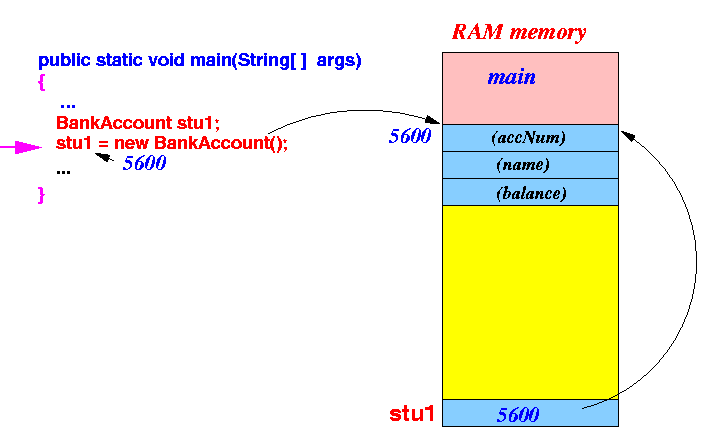

## Class & Instance

* 클래스
* [클래스는 첫글자 대문자, Camel Case](https://github.com/seungki1011/Data-Engineering/blob/main/java/notes/(2)%20Variables.md#2-java-convention)
* 하나의 소스파일에는 둘 이상의 ```public class```가 존재해선 안됨
* 표현하려는 대상의 속성(variable)과 기능(method)을 정의해 놓은 것 (객체를 정의 해놓은 것)
  * 클래스라는 것은 타입을 만드는 것이라고 볼 수 있음
  * 이런 사용자 정의 타입을 위한 설계도가 클래스

* 클래스의 용도는 객체를 생성하는데 사용
  * 클래스로 부터 만들어진 객체를 해당 클래스의 인스턴스(instance)라고 부름
  * 설계도인 클래스를 통해 메모리에 실제로 만들어진 실체를 인스턴스라고 함
* 많이 사용하는 비유가 붕어빵틀: 클래스, 붕어빵: 인스턴스

### 클래스 작성, 인스턴스 생성

```java
public class Customer {
    // 1. 클래스의 멤버 변수(필드)
    String name;
    String gender;
    int age;
    int point;
}
```

* 클래스에 정의한 변수들은 멤버 변수, 필드라고 함

```java
public class cp1 {
    public static void main(String[] args) {
        Customer customer1;
        // Customer 클래스를 기반으로 새로운 객체를 실제 메모리에 생성
      	// 생성한 객체에 접근할 수 있는 참조값(메모리 주소)을 customer1이라는 참조 변수를 통해서 접근 가능
        customer1 = new Customer();

        customer1.name = "Alex";
        customer1.gender = "Male";
        customer1.age = 25;
        customer1.point = 60000;

        Customer customer2 = new Customer();
        customer2.name = "Jane";
        customer2.gender = "Female";
        customer2.age = 22;
        customer2.point = 80000;

        System.out.println("Name: "+customer1.name+", Age: "+customer1.age+", Points: "+customer1.point);
        System.out.println("Name: "+customer2.name+", Age: "+customer2.age+", Points: "+customer2.point);
    }
}
```

```
Name: Alex, Age: 25, Points: 60000
Name: Jane, Age: 22, Points: 80000
```

* ```new```를 통해서 클래스에 대한 객체를 생성하면 해당 객체를 접근할 수 있는 참조값(메모리 주소) 반환
* 참조 변수가 해당 참조값을 가지고 객체에 접근이 가능하다(참조 변수를 통해 객체 접근)
  * 참조 변수 자체를 ```print```해서 확인해보면 됨

<p align="center">    </p>

<p align='center'>https://www.cs.emory.edu/~cheung/Courses/170/Syllabus/10/scope.html</p>

## Array of Instances

* 객체 배열
* 객체를 보관하는 배열
  * 참조 변수들의 배열 (인스턴스의 참조값들)
* 참조 변수의 디폴트값은 ```null```

```java
public class cp2 {
    public static void main(String[] args) {
        Customer customer1 = new Customer();
        customer1.name = "Alex";
        customer1.gender = "Male";
        customer1.age = 25;
        customer1.point = 60000;

        Customer customer2 = new Customer();
        customer2.name = "Jane";
        customer2.gender = "Female";
        customer2.age = 22;
        customer2.point = 80000;

        // 1. 객체 배열 생성
        Customer[] customers = new Customer[2]; // 참조 변수 customer1,2를 담기 위해 길이 2

        // 2. 객체 배열 초기화
        customers[0] = customer1;
        customers[1] = customer2;
        // Customer[] customers = new Customer[]{customer1, customer2};

        System.out.println("Name: "+customers[0].name+", Age: "+customers[0].age+", Points: "+customers[0].point);
```

* ```Customer c = customers[i];``` 같은 형식으로 축약 가능
  * 그냥 ```for-each```문 사용하는 것이 편함


## 참고

---

1. [김영한의 자바 기본](https://www.inflearn.com/course/%EA%B9%80%EC%98%81%ED%95%9C%EC%9D%98-%EC%8B%A4%EC%A0%84-%EC%9E%90%EB%B0%94-%EA%B8%B0%EB%B3%B8%ED%8E%B8/dashboard)
1. [자바의 정석-기초편](https://www.youtube.com/user/MasterNKS)
1. [https://www.cs.emory.edu/~cheung/Courses/170/Syllabus/10/scope.html](https://www.cs.emory.edu/~cheung/Courses/170/Syllabus/10/scope.html)

