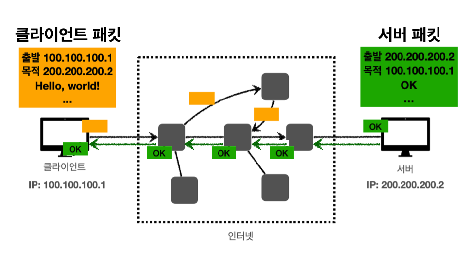

> HTTP에 관한 기초
>
> [인프런 - 모든 개발자를 위한 HTTP 웹 기본 지식](https://www.inflearn.com/course/http-%EC%9B%B9-%EB%84%A4%ED%8A%B8%EC%9B%8C%ED%81%AC/dashboard), 네트워크 하향식 접근, 등을 참고했습니다.

---

## Table of Contents

1. 웹 통신
   1. 인터넷
   2. IP
   3. TCP, UDP
   4. DNS

2. URI
   * URI, URL
3. HTTP
   * Stateful, Stateless
   * 비연결성(Connectionless)
   * HTTP Message
4. HTTP 메서드
   * HTTP API
   * GET,POST
   * PUT, PATCH, DELETE
   * HTTP 메서드의 속성
5. HTTP API
   * 클라이언트에서 서버로 데이터 전송
   * HTTP API 설계 예시
6. HTTP 상태코드
7. HTTP 헤더
   * HTTP 헤더 소개
   * 표현(Content)
   * 협상(Accept)
   * 전송 방식
   * 헤더의 일반 정보
   * 헤더의 특별한 정보
   * 인증
   * 쿠키(Cookie)
8. 캐시(Cache)


---

## 1) 웹 통신

### 1.1. 인터넷(Internet)

클라이언트(Client)과 서버(Server)간의 통신은 대다수의 경우 인터넷(Internet)을 통해서 이루어진다.


<p align="center">    </p>

<p align='center'>네트워크 하향식 접근 - 인터넷</p>

<br>

위의 그림에서 볼 수 있듯이 인터넷은 전세계 수십억의 컴퓨터를 연결해주는 네트워크이다. 그러면 인터넷에서 컴퓨터(노드, 호스트) 끼리의 통신은 어떻게 이루어질까? 출발 노드에 종착 노드까지 어떤 송수신 제어와 원리에 의해 데이터의 전송이 이루어질 것이다. HTTP에 대해 알아보기 전에 기본적으로 인터넷에서의 통신이 이루어지는 프로토콜에 대해서 알아보자.

<br>

---

### 1.2. IP(Internet Protocol)

클라이언에 IP 주소를 ```100.100.100.1``` 그리고 서버에는 ```200.200.200.2```를 부여했다고 가정하자.

<p align="center">    </p>

IP의 역할은 다음과 같다.

* 지정한 IP 주소(IP Address)에 데이터 전달
* 데이터를 전달할 때 패킷(packet)이라는 단위로 전달

<br>

그러면 이 IP 패킷은 어떻게 생긴 것일까?

<p align="center">    </p>

<p align='center'>IP Packet</p>

* 패킷에는 전송 데이터 외에도 출발지 IP, 목적지 IP, 등의 정보를 포함한다
* IP 주소를 바탕으로 노드끼리 패킷을 전달해서 목적 IP에 도착하도록 한다

<br>

<p align="center">    </p>

* 데이터인 ```Hello, world!```를 서버가 받으면, 성공적으로 받았다는 응답을 다시 보낸다
* 패킷을 전송할 때 클라이언트 → 서버의 경로와 서버 → 클라이언트의 경로를 다를 수 있다

<br>

그림만으로 확인하면 문제가 없어보이지만, 이 IP 주소만을 가지고 컴퓨터 끼리 통신하는 방식에는 한계가 존재한다. 

다음은 IP 프로토콜이 가지는 한계다.

* 비연결성(Connectionless)
  * **패킷이 받을 대상이 없거나 서비스 불능 상태여도 패킷을 전송한다**
* 비신뢰성(Unreliable)
  * IP 프로토콜은 최선형 전달(Best-Effort Delivery)을 사용한다
  * **쉽게 말해서, 패킷이 중간에 사라지거나 패킷이 순서대로 전달되지 않을 수 있다**
* 포트(Port) 구분이 불가능하다
  * 같은 IP를 사용하는 서버에서 통신하는 애플리케이션이 둘 이상이면 **포트로 구분해야 하지만, IP 프로토콜에서는 불가능하다**

<br>

이런 IP 프로토콜의 한계를 해결하기 위해서 TCP 프로토콜을 사용한다.

<br>

---

### 1.3. TCP(Transmission Control Protocol)

네트워크 계층을 설명할 때 많은 경우 OSI 7 계층을 설명한다. 그러나 OSI 7 계층의 경우 현실 세계에서 실제로 구현해서 사용한다기 보다는 개념적 모델(conceptual model)에 가깝다. 현실 세계의 인터넷의 경우 TCP/IP 4 계충으로 설명하는 것이 더 알맞은 경우가 많다(여기서 TCP/IP 4 계층도 개념적 모델이다). 관련 내용은 [네트워크 포스트]()에서 자세히 다룰 예정이다.

<br>

<p align="center">    </p>

<p align='center'>네트워크 계층의 개념적 모델</p>

* Application Layer(애플리케이션 계층) : HTTP, FTP
* Transport Layer(전송 계층) : TCP, UDP
* Network Layer(인터넷 계층) : IP
* Network Access(Interface) Layer

<br>

다음 그림은 TCP/IP 프로토콜에서 패킷이 전송되는 대략적인 과정이다.

<p align="center">    </p>

<p align='center'>TCP/IP Protocol</p>

* 이더넷 프레임은 [네트워크 포스트]()에서 다룰 예정이다
* 그냥 데이터가 어떤식으로 패킷이 담기고 전달되는지 인지하자

<br>

그러면 TCP/IP 패킷은 어떻게 생긴 것일까?

<p align="center">    </p>

<p align='center'>IP Packet + TCP Segment</p>

* TCP/IP 프로토콜에서는 TCP segment를 IP 패킷안에 추가한다
  * ~~데이터와 함께 TCP segment를 encapsulate한다고 표현하는 것 같다~~
* PORT와 관련된 정보. 전송 제어와 순서에 관란 정보, 등이 들어가서 기존 IP 프로토콜의 한계를 해결한다

<br>

TCP(Transmission Control Protocol, 전송 제어 프로토콜)의 특징은 다음과 같다.

* 연결지향
  * 3 way handshake (connection establish)
  * 4 way handshake (connection terminate)
* 데이터 전달 보증
* 순서 보장

<br>

먼저 TCP 3 way handshake에 대해서 알아보자.


<br>

---

## Further Reading

* Four-way Handshake


<br>

---

## Reference

1. [인프런 - 모든 개발자를 위한 HTTP 웹 기본 지식](https://www.inflearn.com/course/http-%EC%9B%B9-%EB%84%A4%ED%8A%B8%EC%9B%8C%ED%81%AC/dashboard)
2. 네트워크 하향식 접근
3. [https://www.computerhope.com/jargon/t/tcpip.htm](https://www.computerhope.com/jargon/t/tcpip.htm)
4. [https://www.geeksforgeeks.org/tcp-ip-model/](https://www.geeksforgeeks.org/tcp-ip-model/)
