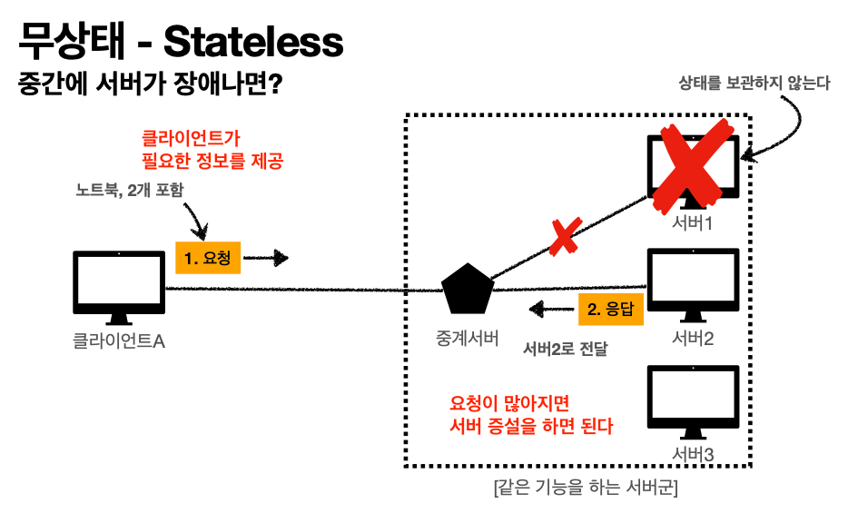
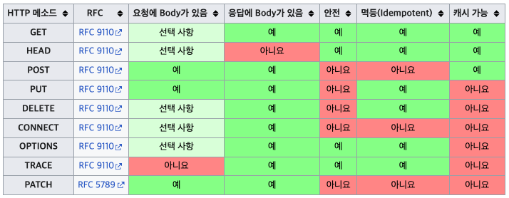

> HTTP에 관한 기초
>
> [인프런 - 모든 개발자를 위한 HTTP 웹 기본 지식](https://www.inflearn.com/course/http-%EC%9B%B9-%EB%84%A4%ED%8A%B8%EC%9B%8C%ED%81%AC/dashboard), 네트워크 하향식 접근, 등을 참고했습니다.

---

## Table of Contents

1. 웹 통신
   * 인터넷(Internet)
   * IP(Internet Protocol)
   * TCP(Transmission Control Protocol)
     * TCP 소개
     * Three way handshake
     * 데이터 전달 보증, 순서 보장
   * UDP(User Datagram Protocol)
   * PORT
   * DNS(Domain Name System)
   * URI(Uniform Name Identifier)
   * 요청의 흐름
3. HTTP
   * HTTP 소개
   * Client-Server
   * Stateless
   * Connectionless
   * HTTP Message
4. HTTP Method
   * HTTP API 설계
   * GET,POST
   * PUT, PATCH, DELETE
   * HTTP 메서드의 속성
   * HTTP 메서드의 활용
     * 클라이언트 → 서버 데이터 전송
     * 
6. HTTP 상태코드
7. HTTP 헤더
   * HTTP 헤더 소개
   * 표현(Content)
   * 협상(Accept)
   * 전송 방식
   * 헤더의 일반 정보
   * 헤더의 특별한 정보
   * 인증
   * 쿠키(Cookie)
8. 캐시(Cache)


---

## 1) 웹 통신

### 1.1 인터넷(Internet)

클라이언트(Client)과 서버(Server)간의 통신은 대다수의 경우 인터넷(Internet)을 통해서 이루어진다.


<p align="center">    </p>

<p align='center'>네트워크 하향식 접근 - 인터넷</p>

<br>

위의 그림에서 볼 수 있듯이 인터넷은 전세계 수십억의 컴퓨터를 연결해주는 네트워크이다. 그러면 인터넷에서 컴퓨터(노드, 호스트) 끼리의 통신은 어떻게 이루어질까? 출발 노드에 종착 노드까지 어떤 송수신 제어와 원리에 의해 데이터의 전송이 이루어질 것이다. HTTP에 대해 알아보기 전에 기본적으로 인터넷에서의 통신이 이루어지는 프로토콜에 대해서 알아보자.

<br>

---

### 1.2 IP(Internet Protocol)

클라이언에 IP 주소를 ```100.100.100.1``` 그리고 서버에는 ```200.200.200.2```를 부여했다고 가정하자.

<p align="center">    </p>

IP의 역할은 다음과 같다.

* 지정한 IP 주소(IP Address)에 데이터 전달
* 데이터를 전달할 때 패킷(packet)이라는 단위로 전달

<br>

그러면 이 IP 패킷은 어떻게 생긴 것일까?

<p align="center">    </p>

<p align='center'>IP Packet</p>

* 패킷에는 전송 데이터 외에도 출발지 IP, 목적지 IP, 등의 정보를 포함한다
* IP 주소를 바탕으로 노드끼리 패킷을 전달해서 목적 IP에 도착하도록 한다

<br>

<p align="center">    </p>

* 데이터인 ```Hello, world!```를 서버가 받으면, 성공적으로 받았다는 응답을 다시 보낸다
* 패킷을 전송할 때 클라이언트 → 서버의 경로와 서버 → 클라이언트의 경로를 다를 수 있다

<br>

그림만으로 확인하면 문제가 없어보이지만, 이 IP 주소만을 가지고 컴퓨터 끼리 통신하는 방식에는 한계가 존재한다. 

다음은 IP 프로토콜이 가지는 한계다.

* 비연결성(Connectionless)
  * **패킷이 받을 대상이 없거나 서비스 불능 상태여도 패킷을 전송한다**
* 비신뢰성(Unreliable)
  * IP 프로토콜은 **최선형 전달(Best-Effort Delivery)을 사용**한다
  * **쉽게 말해서, 패킷이 중간에 사라지거나 패킷이 순서대로 전달되지 않을 수 있다**
* 포트(Port) 구분이 불가능하다
  * 같은 IP를 사용하는 서버에서 통신하는 애플리케이션 프로세스가 둘 이상이면 **포트로 구분해야 하지만, IP 프로토콜에서는 불가능하다**

<br>

이런 IP 프로토콜의 한계를 해결하기 위해서 TCP 프로토콜을 사용한다.

<br>

---

### 1.3 TCP(Transmission Control Protocol)

#### 1.3.1 TCP 소개

네트워크 계층을 설명할 때 많은 경우 OSI 7 계층을 설명한다. 그러나 OSI 7 계층의 경우 현실 세계에서 실제로 구현해서 사용한다기 보다는 개념적 모델(conceptual model)에 가깝다. 현실 세계의 인터넷의 경우 TCP/IP 4 계충으로 설명하는 것이 더 알맞은 경우가 많다(여기서 TCP/IP 4 계층도 개념적 모델이다). 관련 내용은 [네트워크 포스트]()에서 자세히 다룰 예정이다.

<br>

<p align="center">    </p>

<p align='center'>네트워크 계층의 개념적 모델</p>

* Application Layer(애플리케이션 계층) : HTTP, FTP
* Transport Layer(전송 계층) : TCP, UDP
* Network Layer(인터넷 계층) : IP
* Network Access(Interface) Layer

<br>

다음 그림은 TCP/IP 프로토콜에서 패킷이 전송되는 대략적인 과정이다.

<p align="center">    </p>

<p align='center'>TCP/IP Protocol</p>

* 이더넷 프레임은 [네트워크 포스트]()에서 다룰 예정이다
* 그냥 데이터가 어떤식으로 패킷이 담기고 전달되는지 인지하자

<br>

그러면 TCP/IP 패킷은 어떻게 생긴 것일까?

<p align="center">    </p>

<p align='center'>IP Packet + TCP Segment</p>

* TCP/IP 프로토콜에서는 TCP segment를 IP 패킷안에 추가한다
  * ~~데이터와 함께 TCP segment를 encapsulate한다고 표현하는 것 같다~~
* PORT와 관련된 정보. 전송 제어와 순서에 관한 정보, 검증 정보, 등이 들어가서 기존 IP 프로토콜의 한계를 해결한다

<br>

TCP(Transmission Control Protocol, 전송 제어 프로토콜)의 특징은 다음과 같다.

* 연결지향형(connection oriented) - 데이터를 보내기 전에 연결을 위해서 핸드셰이크(handshake)가 필요
  * 3 way handshake(connection establish)
  * 4 way handshake(connection terminate)
* 데이터 전달 보증
* 순서 보장
* TCP 연결은 단일 송신자와 단일 수진사 사이의 점대점(point-to-point) 연결

<br>

---

#### 1.3.2 Three way handshake

TCP Three-way handshake에 대해서 알아보자.

<p align="center">    </p>

<p align='center'>TCP Three way Handshake</p>

1. 연결을 위해서 클라이언트에서 서버로 ```SYN```이라는 메세지를 보낸다
2. 서버가 ```SYN```을 받았으면, 요청 수락이라는 ```ACK``` 메세지와 함께 ```SYN```메세지를 다시 클라이언트로 보낸다
3. 마지막으로 클라이언트는 그러면 요청 수락인 ```ACK```를 서버로 보내고 연결이 성공적으로 이루어진다
   * 보통 이 과정에서 데이터도 함께 전송한다

* 여기서 알아야하는 것은 TCP 3 way handshake은 클라이언트와 서버간 논리적으로 연결되는 것이다. 

<br>

---

#### 1.3.3 데이터 전달 보증, 순서 보장

<br>

<p align="center">    </p>

* 클라이언트가 데이터를 전송하면 서버는 데이터를 잘 받았다고 응답 해준다
* 데이터를 보내는 경우 패킷의 순서를 보장해준다
  * 서버에서 패킷의 순서가 잘못되었음을 인지하면 클라이언트는 패킷을 순서에 맞게 다시 보낸다

<br>

이런 것들이 가능한 이유는 TCP/IP 패킷에 전송 제어, 순서, 검증 정보, 등에 대한 정보가 포함되어 있기 때문이다! 이런 요소들이 TCP를 신뢰할 수 있는 프로토콜이라고 부를 수 있도록 해준다.

<br>

---

### 1.4 UDP(User Datagram Protocol)

UDP에 대해 알아보자.

UDP의 특징은 다음과 같다.

* 기능이 거의 없음
* 연결지향(connection oriented) X
* 데이터 전달 보증 X
* 순서 보장 X
* 단순하고 빠름
* IP에 PORT와 체크섬이 추가된 정도
* 애플리케이션 레벨에서 추가 작업을 해서 사용 가능
* 보통 TCP를 많이 사용하지만, 요즘 다시 HTTP3에서 사용되면서 각광 받는중 

<br>

---

### 1.5 PORT

포트에 대해서 알아보자.

클라이언트가 여러 서버들과 통신을 하는 상황이라고 가정해보자. 예를 들어, 같은 IP 내에서 게임, 화상통화, 웹 브라우징을 한다고 해보자.

<p align="center">    </p>

<p align='center'>PORT</p>


* 포트(PORT)를 이용해서 같은 IP내의 프로세스를 구분할 수 있다
* 패킷에 출발지 포트와 목적지 포트가 포함되어 있다
* 포트 넘버
  * 0 ~ 65535 : 할당 가능
  * 0 ~ 1023 (Well known PORT) : 잘 알려진 포트, 사용하지 않는 것이 좋다
    * FTP - 20, 21
    * TELNET - 23
    * HTTP - 80
    * HTTPS - 443


<br>

---

### 1.6 DNS(Domain Name System)

DNS에 대해 알아보자.

클라이언트와 서버가 통신을 할 때, 서버의 IP는 고정이 아니라 언제든지 바뀔수 있다. 또한 호스트 네임(도메인 명)을 사용하기 위해서 해당 호스트 네임에 매칭된 IP 주소가 필요하다. 여기서 호스트 네임(hostname)은 ```www.naver.com```, ```www.google.com``` 처럼 문자로 구성된 도메인 명을 말한다.

DNS는 쉽게 말해서 호스트 네임을 IP 주소로 변환해주는 디렉토리 서비스이다(이외에도 여러가지 일을 하지만 여기서 다루지 않겠다).

<p align="center">    </p>

<p align='center'>DNS</p>

* DNS 서버에 도메인과 IP를 등록하면 그냥 호스트네임을 통해서 접속이 가능하다

<br>

---

### 1-7. URI(Uniform Resource Identifier)

URI, URL, URN에 대해 알아보자. 

<p align="center">    </p>

<p align='center'>URI</p>

* URI(Uniform Resource Locater) : 통일된 방식으로 리소스를 구분하는데 필요한 정보
  * 리소스(resource) : URI로 식별할 수 있는 모든 것
* URL, URN은 URI에 포함된다
* URL(Locater) : 리소스가 있는 위치를 지정
* URN(Name) : 리소스에 이름을 부여
  * URN 이름만으로 실제 리소스를 찾는 방법은 보편화 되진 않았음

<br>

그러면 URL의 형식을 한번 살펴보자.

> ```scheme://[userinfo@]host[:port][/path][?query][#fragement]```

* 예시 : ```https://www.google.com:443/search?q=hello&hl=ko```

* protocol : ```https```
  * 프로토콜은 어떤 방식으로 자원에 접근할 것인가 하는 약속, 규칙
  * 예) http, https, ftp..
* userinfo
  * URL에 사용자 정보를 포함해서 인증
  * 거의 사용하지 않음
* hostname : ```www.google.com```
  * 도메인명 또는 IP 주소를 직접 사용가능
* port number : ```443```
  * 접속 포트
  * http는 80, https는 443으로 생략 가능
* path : ```/search```
  * 리소스가 위치한 경로, 계층적 구조
  * 예) ```/home/file1.png```, ```members/1004```
* query string : ```q=hello&hl=ko```
  * key=value 형태
  * 웹서버에 제공하는 파라미터
  * ?로 시작하고, &로 추가 가능
* fragment
  * html 내부 북마크 등에 사용한다
  * 예) 깃헙의 마크다운 목차
  * 서버에 전송하는 정보는 아님

<br>

---

### 1-8. 웹에서의 요청의 흐름

웹 브라우저에서 요청을 보낼 때, 해당 요청의 흐름에 대해서 알아보자.

https://www.google.com/search?q=hello&hl=ko를 웹 브라우저에 입력해서 접속할때 일어나는 요청의 흐름을 살펴보자.

<p align="center">    </p>

1. HTTP 요청 메세지 생성
   * ```GET /search?q=hello&hl=ko HTTP/1.1```
   * ```Host: www.google.com```
   * 기타 내용
2. HTTP 요청 메세지를 소켓 라이브러리를 통해 전달하고 생성된 TCP/IP 패킷에 HTTP 메세지를 포함한다
3. 요청 패킷을 목적지(구글 서버)로 전달
4. 요청 패킷을 받고 해석 후, 서버(구글 서버)에서 응답 메세지를 생성하고 응답 패킷에 담는다
   * ```HTTP/1.1 200 OK```
   * ```Content-Type: text/html;charset=UTF-8```
   * ```Content-Length: 3423```
   * 기타 내용
   * 응답 내용 : HTML, 등..
5. 응답 패킷을 클라이언트 한테 전달
6. 클라이언트(웹브라우저)에서 받은 내용(이 경우에는 HTML)을 렌더링

<br>

<p align="center">    </p>

<p align='center'>HTTP 메세지 전송</p>

<br>

---

## 2) HTTP

### 2.1 HTTP 소개

HTTP(HyperText Transfer Protocol)에 대해 알아보자.

요즘 대부분의 통신은 HTTP를 통해서 이루어진다.

* HTML, text
* 이미지, 음성, 영상 파일
* **JSON, XML (API)**
* 거의 모든 형태의 데이터 전송 가능
* 서버간 데이터를 주고 받을 때도 많은 경우 HTTP 사용
* TCP를 직접 이용해서 연결하는 경우는 게임서버와 같은 특수한 경우

<br>

현재 대부분 HTTP/1.1을 사용한다

* HTTP/1.0 이하
* HTTP/1.1
  * 가장 많이 사용
  * 기반 프로토콜 : TCP
* HTTP/2
  * 성능 개선
  * 기반 프로토콜 : TCP
* HTTP/3
  * 성능 개선
  * 기반 프로토콜 : UDP

<br>

HTTP의 특징은 다음과 같다.

* 클라이언트-서버 구조
* Stateless protocol(무상태 프로토콜)
* 비연결성(connectionless)
* HTTP 메세지를 이용해서 통신
* 단순하고 확장 가능

<br>

---

### 2.2 Client - Server

HTTP는 기본적으로 클라이언트-서버 구조를 따른다.

* request response (요청-응답) 구조
* 클라이언트는 서버에 요청을 보내고 응답을 대기한다
* 서버는 받은 요청에 대한 결과를 만들어서 응답을 보낸다
* 비즈니스 로직은 오로지 서버만 다룬다

<br>

---

### 2.3 Stateless

HTTP는 무상태(stateless) 프로토콜을 지향한다. Stateless(무상태)와 Stateful(상태유지)에 대해서 알아보자.

Stateless라는 것은 다음과 같다.

* **서버가 클라이언트의 상태를 보존하지 않는다**
* 장점 : 서버의 확장성이 높다(scale-out)
* 단점 : 클라이언트가 추가 데이터를 전송해야 한다

<br>

Stateless와 Stateful에 대해 예시를 이용해서 알아보자.

고객이 마트에 가서 노트북을 구매하는 상황이라고 가정하자.

1. 
   * 고객 : 이 **품목 : 노트북** 얼마인가요?
   * 점원A : 100만원 입니다. (**품목: 노트북 상태유지**)
2. 
   * 고객 : **수량 : 2개**를 구매하겠습니다.
   * 점원A : 200만원 입니다. **수단 : 신용카드, 현금**중 어느 걸로 구매 하시겠어요?(**품목 : 노트북, 수량 : 2개 상태 유지**)
3. 
   * 고객 : **수단 : 신용카드**로 구매하겠습니다.
   * 점원A : 200만원 결제 완료되었습니다. (**품목 : 노트북, 수량 : 2개, 수단 : 신용카드 상태 유지**)

<br>

위의 예시에서 볼 수 있듯이 점원은 고객과의 대화에서 이전 대화의 문맥(context)을 알고 있다. 이것이 상태유자(stateful)이다.

다음은 무상태(stateless)에 대한 예시이다.

<br>

1. 
   * 고객 : 이 **품목 : 노트북** 얼마인가요?
   * 점원A : 100만원 입니다.
2. 
   * 고객 : **품목 : 노트북**을 **수량 : 2개** 구매하겠습니다.
   * 점원B : 200만원 입니다. **수단 : 신용카드, 현금**중 어느 걸로 구매 하시겠어요?
3. 
   * 고객 : **품목 : 노트북** **수량 : 2개**를 **수단 : 신용카드**로 구매하겠습니다.
   * 점원C : 200만원 결제 완료되었습니다.

<br>

무상태의 경우 이전 상황에 대한 문맥을 유지하지 않는다. 점원이 계속 바뀌는 상황이라고 볼 수 있다. 점원끼리 서로 내용을 공유하지 않는 이상 고객이 이전 점원과 했던 내용을 알수 없다. 그래서 고객은 새로운 점원을 만날때 마다 이전의 내용(context)를 전부 포함해서 구매를 진행하고 있다. 

<br>

그러면 상태유지에서 점원이 바뀌면 어떻게 될까? 점원은 당연히 이전의 대화 내용을 모르기 때문에 구매의 진행이 불가능 하다. 반면에 stateless에서는 고객이 점원이 바뀔때 마다 필요한 정보를 다 주기 때문에 구매의 진행이 가능하다.

<br>

정리하자면 다음과 같다.

* **Stateful(상태 유지)** : 중간에 다른 점원으로 바뀌면 안된다
  * 만약에 바뀐다면 해당 대화 내용(상태 정보, context)를 다음 점원에게 미리 알려줘야 한다
* **Stateless(무상태)** : 중간에 다른 점원으로 바뀌어도 OK
  * 이런 경우의 장점은 갑자기 고객이 증가해도 새로운 점원들을 대거 투입 가능하다
  * → 갑자기 클라이언트 요청이 증가해도 서버를 대거 투입 가능하다
  * 쉽게 말해서 무상태에서는 응답 서버를 쉽게 바꾸는 것이 가능하다 → 서버 증설이 쉽다

<br>

<p align="center">    </p>

<p align='center'>Stateless</p>

<br>

이렇게 좋아보이는 stateless도 한계가 존재한다.

* 무상태로 설계가 불가능한 경우도 존재한다
* 무상태(stateless)
  * 예) 로그인이 필요 없는 단순한 서비스 소개 화면
  * 무상태의 단점은 상태 유지에 비해서 데이터를 너무 많이 보내야하는 경우들이 발생한다
* 상태유지(stateful)
  * 예) 로그인
* 로그인한 사용자의 경우 로그인 했다는 상태를 서버에 유지

<br>

일반적으로 상태유지가 필요한 경우 브라우저 쿠기, 서버 세션, 등을 사용해서 상태 유지를 한다. 상태 유지는 최소한만 사용하는 것이 좋다.

<br>

---

### 2.4 Connectionless

비연결성(connectionless)에 대해서 알아보자.

만약 클라이언트와 서버가 연결을 계속 유지하는 모델이면 어떤 일이 일어날까? 클라이언트 1,2,3이 서버와 연결한 상황이라고 가정하자.

<p align="center">    </p>

<p align='center'>연결 유지</p>

* 서버가 계속 연결을 유지하기 때문에 서버는 자원을 지속적으로 소모한다

<br>

그럼 클라이언트와 서버가 연결을 유지하지 않는 모델은 어떨까?

<p align="center">    </p>

<p align='center'>Connectionless</p>

* HTTP는 기본이 연결을 유지하지 않는 모델이다
* 일반적으로 초 단위 이하의 빠른 속도로 응답
* 예) 1시간 동안 수천명이 서비스를 사용해도 실제 서버에서 동시에 처리하는 요청은 수십개 이하로 적다
  * 이유 : 사용자가 웹 브라우저에서 계속 연속해서 검색 버튼을 누리지는 않는다
* 서버 자원을 연결 유지에 비해서 효율적으로 사용할 수 있다

<br>

이런 비연결성(connectionless) 방식도 한계가 존재한다.

* TCP/IP 연결을 새로 맺어야 한다 (three way handshake에 대한 시간 추가)
* 웹 브라우저로 사이트를 요청하면 HTML 뿐만 아니라 Js, css, 추가 이미지 등 수 많은 자원이 함께 다운로드된다

<br>

이런 단점을 극복하기 위해서 지금은 HTTP **지속 연결(persistent connection)로 문제를 해결**하고 있다. 

이런 HTTP의 커넥션 관리에 대해서 조금 더 자세히 알아보자.

<br>

<p align="center">    </p>

<p align='center'>HTTP 커넥션 관리</p>

* 초기의 HTTP는 단기 커넥션(short-lived connection)을 이용했다 
  * 각각의 HTTP 요청이 직렬화(serialized)된 형태로 연결과 종료를 맺는다
    * 쉽게 말해서, 요청이 생길때 마다 TCP handshake를 이용해서 연결을 맺고 종료하는 것을 반복 했음
  * 이는 매우 비효율적이다
  * HTTP 1.0 에서 쓰던 방식
* **현재 HTTP는 지속 연결(persistent connection)을 이용한다**
  * 특정 시간 동안 연결을 유지해서 새로운 handshake를 할 필요 없이 요청과 응답이 진행된다
    * 특정 시간은 내부 메커니즘 마다 다름
  * HTTP 2,3 은 이를 더 효율적으로 개선 했음
    * HTTP pipelining, multiplexing 

<br>

---

### 2.5 HTTP Message

이전에도 봤던 HTTP 요청 메세지와 응답 메세지에 대해서 알아보자.

<p align="center">    </p>

<p align='center'>요청과 응답 메세지의 구조</p>

* 요청 메세지도 body 본문을 가질 수 있음

<br>

HTTP 메세지의 공식 스펙은 다음과 같다. (rfc7230)

```
HTTP-message = start-line
							 *( header-field CRLF)
							 CRLF
							 [ message-body ]
```

<br>

HTTP 메세지의 구성 요소를 더 자세히 살펴보자.

```
GET /search?q=hello&hl=ko HTTP/1.1
Host: www.google.com

```

<br>

* **요청 시작 라인(start-line)**
  * ```start-line = request-line / status-line```
  * 요청 메세지의 경우 ```request-line```
  *  ```request-line = method 공백 request-target 공백 HTTP-version CRLF```
  * HTTP 메서드(뒤의 [HTTP Method]() 섹션에서 더 자세히 알아볼 예정)
    * GET, POST, PUT, DELETE...
    * 서버가 수행해야 할 동작을 지정한다
      * GET : 리소스 조회
      * POST : 요청 내역 처리
  * 요청 대상(request-target)
    * ```절대경로[?query]```
    * ```/```로 시작하는 경로
  * HTTP Version
    * 많은 경우 HTTP 1.1

<br>

```
HTTP/1.1 200 OK
Content-Type: text/html;charset=UTF-8
Content-Length: 3423

<html>
	<body>...</body>
</html>
```

<br>

* **응답 시작 라인**
  * 응답 메세지의 경우 ```status-line```
  * ```status-line = HTTP-version 공백 status-code 공백 reason-phrase CRLF```
  * HTTP version
  * HTTP 상태코드(status-code) : 요청 성공, 실패 등의 상태를 나타냄
    * 200 : 성공
    * 400 : 클라이언트 요청 오류
    * 500 : 서버 내부 오류
  * 이유 문구(reason phrase)
    * 짧은 상태 코드 설명 글
    * 예) 200 OK → OK는 대충 성공이라는 뜻

<br>

* **HTTP 헤더**
  * ```header-field = field-name : OWS field-value OWS```
    * OWS(optional whitespace) : 띄어쓰기 허용
  * HTTP 헤더의 용도는 HTTP 전송에 필요한 모든 부가정보를 제공하기 위함
    * 예) 메세지 바디의 내용, 크기, 압축, 인증, 요청 클라이언트 정보, 캐시 관리 정보, 등...
  * 필요시 임의의 헤더 추가 가능
  * 뒤의 [HTTP Header]() 섹션에서 더 자세히 다룰 예정

<br>

* **HTTP 메세지 바디**
  * 실제 전송할 데이터가 들어감
  * 예) HTML, 이미지, 영상, JSON 등.. byte로 표현할 수 있는 모든 데이터를 전송 가능

<br>

---

## 3) HTTP Method

### 3.1 HTTP API 설계 

HTTP API를 설계 해보면서 HTTP 메서드에 대해 알아보자.

회원 정보 관리 API를 설계한다고 해보자. 요구 사항은 다음과 같을때, 해당 요구 사항에 맞게 이름을 한번 지어보자.

* 회원 목록 조회 /read-member-list
* 회원 조회 /read-member-by-id
* 회원 등록 /create-member
* 회원 수정 /update-member
* 회원 삭제 /delete-member

<br>

위와 같이 URI를 설계하는 것은 좋은 설계일까? **URI를 설계할 때 가장 중요한것은 리소스(resource)의 식별**이다. 리소스의 의미에 대해 생각해보자.

* 리소스의 의미
  * 회원 등록, 수정, 조회하는 것이 리소스가 아니다
  * 회원이라는 개념 자체가 리소스이다

<br>

그러면 이런 리소스를 어떻게 식별하는 것이 좋을까?

* 등록, 수정, 조회하는 것을 모두 배제한다
* 회원이라는 리소스만 식별 → **회원 리소스 자체를 URI에 매핑한다**

<br>

그러면 일단 URI에 적용해보자.

* 회원 목록 조회 /members
* 회원 조회 /members/{id}
* 회원 등록 /members/{id}
* 회원 수정 /members/{id}
* 회원 삭제 /members/{id}

<br>

이때 많은 경우 난감할 것이다. 왜냐하면 회원 조회, 등록, 수정, 삭제를 구분할 수 없기 때문이다. 여기서 HTTP 메서드가 중요한 역할을 한다.

* **URI로 리소스만 식별한다**
* 리소스와 해당 리소스를 사용하는 행위를 분리 해야한다
  * 리소스 : 회원(members)
  * 행위 : 조회, 등록, 수정, 삭제
* **이 행위를 HTTP 메서드를 이용해서 구분하는 것이다!**

<br>

> 리소스라고 사용은 했지만, 최근에는 Representation이라는 표현을 사용한다.
>
> REST API → Representational State Transfer API

<br>

---

### 3.2 GET, POST

* ```GET``` : 리소를 조회
* ```POST``` : 요청 데이터 처리, 주로 등록에 사용

```PUT```, ```PATCH```. ```DELETE```은 뒤에서 더 자세히 알아볼 예정. 

<br>

#### 3.2.1 GET

* 리소스 조회
* 서버에 전달하고 싶은 데이터는 쿼리(query string)를 통해서 전달
* 메세지 바디를 이용해서 데이터를 전달할 수 있지만, 권장하지 않는다 (쉽게 말해서 GET 요청은 페이로드를 담지 말아라)

<br>

<p align="center">    </p>

<p align='center'>GET 요청</p>

<br>

---

#### 3.2.2 POST

* 요청 데이터 처리
* 메세지 바디를 통해 서버로 요청 데이터 전달
* 서버는 요청 데이터를 처리
  * 메세지 바디를 통해 들어온 데이터를 처리하는 모든 기능을 수행한다
* 주로 전달된 데이터로 신규 리소스 등록, 프로세스 처리에 사용한다
  * 예) 회원 가입에 필요한 데이터 전달 → 서버는 받은 데이터로 회원 가입을 처리(수행)

<br>

<p align="center">    </p>

<p align='center'>POST 요청</p>

<br>

```POST```의 요청 데이터를 처리한다는 것은 정확히 어떤 뜻일까?

* POST specification(스펙) 

  * > The ```POST``` method requests that the [target resource](https://www.rfc-editor.org/rfc/rfc9110#target.resource) process the representation enclosed in the request according to the resource's own specific semantics. (rfc9110)

  * ```POST``` 메서드는 대상 리소스(representation)가 리소스 고유한 의미 체계에 따라 요청에 포함 된 표현을 처리하도록 요청한다 

<br>

예를 들자면 다음과 같은 기능에 사용한다.

* Providing a block of data, such as the fields entered into an HTML form, to a data-handling process;
  * HTML 폼에 입력 된 필드와 같은 데이터 블록을 데이터 처리 프로세스에 제공
  * 예) HTML form에 입력한 정보로 회원 가입, 주문 등에 사용
* Posting a message to a bulletin board, newsgroup, mailing list, blog, or similar group of articles;
  * 게시판, 뉴스, 메일링 리스트, 블로그 또는 유사한 뉴스 그룹에 메세지 게시
  * 예) 게시판 글쓰기, 댓글 달기
* Creating a new resource that has yet to be identified by the origin server;
  * 서버가 아직 식별하지 않은 새 리소스 생성
  * 예) 신규 주문 생성
* Appending data to a resource's existing representation(s).
  * 기존 자원에 데이터 추가
  * 예) 한 문서 끝에 내용 추가하기

<br>

결론적으로 리소스 URI에 POST 요청이 오면 요청 데이터를 어떻게 처리할지 리소스 마다 정해야 한다.

POST를 사용하는 경우를 정리해보면 다음과 같다.

* 새 리소스 등록(생성)
* 요청 데이터를 처리
  * 단순히 데이터를 생성, 변경하는 것을 넘어서 **특정 프로세스를 처리해야 하는 경우**
    * 예) 주문 : 결제완료 → 배달시작 → 배달완료 처럼 단순히 값 변경을 넘어 프로세스의 상태가 변경되는 경우
  * POST의 결과로 새 리소스가 생성되지 않을 수도 있음
    * 어쩔 수 없이 리소스만으로 설계가 안되기 때문에 행위를 포함해서 URI를 설계하는 경우도 있다
    * 예) ```POST /orders/{orderId}/start-delivery``` **(컨트롤 URI)**
* 다른 메서드로 처리하기 애매한 경우
  * 예) JSON으로 조회 데이터를 넘겨야 하는데 GET 메서드를 사용하기 어려운 경우
  * 웬만해서 애매하면 POST 사용하면 됨

<br>

---

### 3.3 PUT, PATCH, DELETE

* ```PUT``` : 리소스를 대체, 해당 리소스가 없다면 생성
* ```PATCH``` : 리소소를 부분 변경
* ```DELETE``` : 리소스 삭제

이외에도 ```HEAD```, ```OPTIONS```, ```CONNECT```, ```TRACE``` 등의 HTTP 메서드도 존재한다.

<br>

조금 더 자세히 알아보자.

1. ```PUT```
   * 리소스를 대체
     * 리소스가 존재하면 완전히 대체
       * 기존의 것을 완전히 지우고 생성
     * 리소스가 없으면 생성
     * 덮어버린다고 생각하면 쉬움
     * 예) ```PUT /members/100``` 으로 요청을 넣는 경우 존재하면 완전히 대체하고, 없다면 새로 생성한다
   * **클라이언트가 리소스를 식별한다**
     * 클라이언트가 리소스 위치를 알고 URI 지정한다
     * ```POST```에서는 리소스 위치를 몰라도 됨
2. ```PATCH```
   * 리소스 부분 변경
   * ```PUT```과는 다르게 리소스의 필드를 부분적으로 변경할 수 있다
   * ```PATCH```를 지원하지 않는 서버의 경우 그냥 ```POST```를 사용하면 됨
3. ```DELETE```
   * 리소스 제거

<br>

---

### 3.4 HTTP 메서드의 속성

HTTP 메서드의 속성에 대해서 알아보자.

<p align="center">    </p>

<p align='center'>https://ko.wikipedia.org/wiki/HTTP</p>

<br>

---

#### 3.4.1 안전(Safe)

* HTTP 메서드가 서버의 상태를 변경하지 않으면 그 메서드는 안전하다
* 쉽게 말해서, 호출해도 리소스를 변경하지 않으면 안전하다
  * ```GET```은 안전함
  * ```POST```, ```PUT```, ```PATCH```, ```DELETE``` 같은 메서드는 안전하지 않음

<br>

---

#### 3.4.2 멱등성(Idempotency)

* 동일한 요청을 한 번 보내는 것과 여러 번 연속으로 보내는 것이 같은 효과를 지니고, 서버의 상태도 동일하게 남을 때, 해당 HTTP 메서드는 멱등(Idempotent)하다
* **쉽게 말해서 한 번 호출하든, 100번 호출하든 결과가 똑같아야 멱등하다**고 할 수 있다
* 멱등 메서드는 통계기록을 제외하면 어떠한 부수효과(side-effect)를 가져선 안된다
* **멱등은 외부 요인으로 인해 중간에 리소스가 변경되는 것 까지 고려하지는 않는다**
  * 예) 잔액을 조회했을 때 10000원 조회 → 다른 사람이 10000원 이체 → 다시 조회하면 20000원
* 멱등 메서드
  * ```GET``` : 한 번 조회하든, 100번 조회하든 같은 결과가 조회된다
  * ```PUT``` : 결과를 대체한다. 같은 요청을 여러번 해도 최종 결과는 똑같다
  * ```DELETE``` : 결과를 삭제한다. 같은 요청을 여러 번 해도 삭제된다는 결과는 똑같다
* 멱등하지 않은 메서드
  * ```POST``` : 두 번 호출하면 같은 결제가 중복해서 발생할 수 있다.

<br>

---

#### 3.4.3 캐시 가능(Cacheable)

* 한 응답은 캐시할 수 있는 HTTP 응답으로, 나중에 검색하고 사용하기 위해 저장하여 새 요청을 서버에 저장한다
  * 모든 HTTP 응답을 캐시할 수 있는 것은 아니다
* **쉽게 말해서 응답 결과 리소를 캐시해서 사용해도 되는지에 대한 여부이다**
  * 예) 이미지를 요청 → 다시 요청하는 것은 비효율적이기 때문에 브라우저에서 이미지 저장(캐시)해서 사용
* ```GET```, ```HEAD```, ```POST```, ```PATCH``` 캐시 가능
* **실제로는** ```GET```, ```HEAD``` **정도만 캐시로 사용한다**
  * 캐시를 사용하기 위해서 
  * ```POST```, ```PATCH```는 본문 내용까지 캐시 키로 고려해야한다 → 구현이 쉽지 않다다
* 캐시에 대한 것은 뒤의 HTTP 헤더의 [캐시 섹션]()에서 더 자세히 다룰 예정

<br>

---

### 3.5 HTTP 메서드의 활용

HTTP 메서드는 어떤식으로 활용되는지, 다음의 경우에 대해서 알아보자.

* 클라이언트에서 서버로 데이터 전송
* HTTP API 설계

<br>

#### 3.5.1 클라이언트 → 서버 데이터 전송

데이터 전달 방식을 크게 2가지로 나눌 수 있다.

* 쿼리를 통한 데이터 전송
  * ```GET```
  * 주로 정렬 필터(검색어)
* 메세지 바디를 통한 데이터 전송
  * ```POST```, ```PUT```, ```PATCH```
  * 리소스 등록, 리소스 변경
    * 예) 회원 가입, 상품 주문

<br>

그러면 클라이언트에서 서버로 데이터 전송을 하는 몇가지 상황에 대해서 알아보자.

1. 정적 데이터 조회 : 이미지, 정적 텍스트(문서) 같은 데이터를 조회하는 경우
   * 쿼리 파라미터 미사용
   * ```GET /static/star.jpg HTTP1.1```
   * 단순히 URI 경로만으로 조회가 가능하다
2. 동적 데이터 조회 : 검색, 게시판 목록에서 정렬 필터
   * 
3. HTML Form을 통한 데이터 전송
4. HTTP API를 통한 데이터 전송


<br>

---

## Further Reading

* Four-way Handshake
* SYN flood attack
  * SYN cookie
* Multiplexing (HTTP 2)
* Socket Programming
* Port forwarding
* CDN


<br>

---

## Reference

1. [인프런 - 모든 개발자를 위한 HTTP 웹 기본 지식](https://www.inflearn.com/course/http-%EC%9B%B9-%EB%84%A4%ED%8A%B8%EC%9B%8C%ED%81%AC/dashboard)
2. 네트워크 하향식 접근
3. [https://www.computerhope.com/jargon/t/tcpip.htm](https://www.computerhope.com/jargon/t/tcpip.htm)
4. [https://www.geeksforgeeks.org/tcp-ip-model/](https://www.geeksforgeeks.org/tcp-ip-model/)
5. [https://developer.mozilla.org/ko/docs/Web/HTTP/Connection_management_in_HTTP_1.x](https://developer.mozilla.org/ko/docs/Web/HTTP/Connection_management_in_HTTP_1.x)
6. [https://developer.mozilla.org/ko/docs/Web/HTTP/Messages](https://developer.mozilla.org/ko/docs/Web/HTTP/Messages)
7. [https://httpwg.org/specs/rfc9110.html](https://httpwg.org/specs/rfc9110.html)

