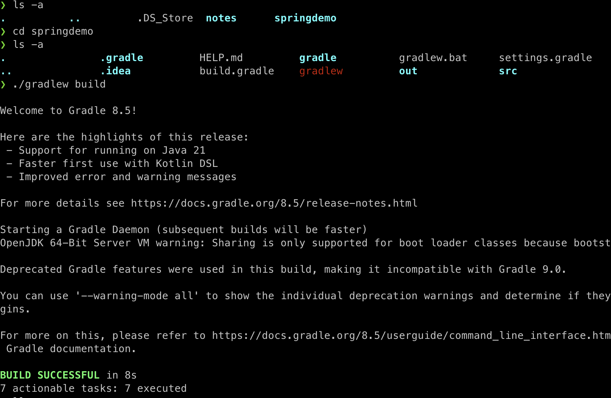

> Spring에 대한 간단한 소개 및 실습.
>
> [스프링 입문 - 코드로 배우는 스프링 부트, 웹 MVC, DB 접근 기술](https://www.inflearn.com/course/%EC%8A%A4%ED%94%84%EB%A7%81-%EC%9E%85%EB%AC%B8-%EC%8A%A4%ED%94%84%EB%A7%81%EB%B6%80%ED%8A%B8/) 를 참고 했습니다.
>
> 해당 포스트에서 작성한 [모든 코드](https://github.com/seungki1011/Data-Engineering/tree/main/spring/springdemo/src)

---

## Index

1. [Introduction](https://github.com/seungki1011/Data-Engineering/tree/main/spring/(001)Spring%20Introduction#1-introduction)
   * ```Spring```, ```SpringBoot``` 소개
   * ```Gradle```
   * MVC Pattern
2. [Spring Boot Project Configuration](https://github.com/seungki1011/Data-Engineering/tree/main/spring/(001)Spring%20Introduction#2-spring-boot-project-configuration)
   * Spring Boot 프로젝트 생성하기
   * 실행 확인하기
   * View 설정하기
   * 빌드 후 실행
3. [Spring 웹 개발](https://github.com/seungki1011/Data-Engineering/tree/main/spring/(001)Spring%20Introduction#3-spring-%EC%9B%B9-%EA%B0%9C%EB%B0%9C)
   * Static Contents
   * MVC & Template Engine
   * API
4. [회원 관리 기능 개발 I](https://github.com/seungki1011/Data-Engineering/tree/main/spring/(001)Spring%20Introduction#4-%ED%9A%8C%EC%9B%90-%EA%B4%80%EB%A6%AC-%EA%B8%B0%EB%8A%A5-%EA%B0%9C%EB%B0%9C-i)
   * 비즈니스 요구 사항
   * 애플리케이션 계층 구조
   * 클래스 의존 관계
   * 회원 저장소 코드, 테스트 코드
   * 회원 서비스 코드, 테스트 코드
5. [Spring Bean & Dependency](https://github.com/seungki1011/Data-Engineering/tree/main/spring/(001)Spring%20Introduction#5-spring-bean--dependency)
   * Component Scan
   * 자바 코드로 스프링 빈 등록
6. [회원 관리 기능 개발 II](https://github.com/seungki1011/Data-Engineering/tree/main/spring/(001)Spring%20Introduction#6-%ED%9A%8C%EC%9B%90-%EA%B4%80%EB%A6%AC-%EA%B8%B0%EB%8A%A5-%EA%B0%9C%EB%B0%9C-ii)
   * 홈 화면 추가
   * 등록
   * 조회
7. [Spring DB Access](https://github.com/seungki1011/Data-Engineering/tree/main/spring/(001)Spring%20Introduction#7-spring-db-access)
   * H2 데이터베이스 Setup
   * JdbcTemplate
   * 스프링 통합 테스트
   * JPA
8. [AOP](https://github.com/seungki1011/Data-Engineering/tree/main/spring/(001)Spring%20Introduction#8-aop)
   * AOP 소개
9. [전체 요약](https://github.com/seungki1011/Data-Engineering/tree/main/spring/(001)Spring%20Introduction#%EC%A0%84%EC%B2%B4-%EC%9A%94%EC%95%BD)

---

## 1) Introduction

들어가기 전 알아두면 좋을 선행 지식에 대해 아주 간단하게 알아보자.

<br>

### 1.1. Spring, Spring Boot 소개

#### Spring

* 스프링(Spring)은 Java 애플리케이션을 만들기 위한 프레임워크
* 컴포넌트 관리, 데이터베이스 액세스 관리, 웹 개발 단순화, 트랜잭션 관리 등 많은 기능을 제공한다

#### Spring Boot

* 스프링 부트(Spring Boot)는 스프링으로 Java 애플리케이션을 빌드하기 쉽게해주는 프레임워크
* 밑바닥 부터 모든 걸 할 필요 없이 setup과 configuration의 많은 부분을 처리해줌
* 웹 앱을 위한 템플릿 엔진 등, 여러 툴 제공

스프링 프레임워크가 Java 애플리케이션을 쉽게 빌드해주기 위한 도구를 많이 제공해주는 툴박스라면, 스프링 부트는 스프링 프레임워크를 이용한 프로젝트를 쉽게 시작할 수 있도록 해주는 마법같은 도구로 생각하면 간편하다.

<br>

---

### 1.2. Gradle

* 빌드 자동화 툴
* 프로젝트의 dependency(의존관계) 관리, 프로젝트 빌드 등을 해준다
* ```build.gradle``` 파일로 설정 관리

```Gradle```이 ```Maven```보다 flexible 하고 성능이 좋다. (그냥 ```Gradle```을 사용해서 프로젝트 진행하자) 

<br>

---

### 1.3. MVC Pattern

MVC 패턴은 Model-View-Controller의 3가지 컴포넌트로 구성된 소프트웨어 디자인 패턴이다. 웹 개발의 많은 경우 이 MVC 패턴을 이용해서 개발된다. (스프링 뿐만 아니라 다른 프레임워크들도 MVC라는 명칭이 아니라도 비슷한 컨셉의 패턴을 이용해서 개발하는 것으로 알고 있다.)

<p align="center">    </p>

<p align='center'>https://www.geeksforgeeks.org/mvc-framework-introduction/</p>

#### Model

* 데이터와 관련된 로직을 책임진다

#### View

* 사용자에게 보여지는 부분을 책임진다(UI)

#### Controller

* 모델과 뷰 사이를 이어주는 중개(intermediary)의 역할
* 모델과 뷰는 서로 소통을 할 수 없기 때문에, 컨트롤러가 변경 내용을 각 구성 요소로 통지

> 예시를 들어보겠다.
>
> 1. Request
>    * 유저가 링크를 클릭하거나 폼을 작성하는 작업 등으로 나의 웹 애플리케이션으로 요청을 보낸다.
> 2. Controller
>    * 컨트롤러는 요청을 받고, 유저가 정확히 요구하는 것이 무엇인지 그리고 모델의 어느 부분이 필요한것인지 판단한다.
> 3. Model
>    * 모델은 실제로 데이터베이스에서 데이터를 fetch하거나 데이터 관련 로직을 처리하는 작업을 한다.
> 4. View
>    * 컨트롤러는 모델에서 통지 받고 뷰에서 해당 결과물을 보여준다.
> 5. Response
>    * 마지막 결과(응답)를 유저가 받는다

실제로 MVC 패턴으로 개발을 하면서 지켜야하는 규칙 같은 것들이 많다. 이런 MVC의 세부적인 내용은 이후 SpringMVC 포스트에서 다룰 예정이다.

<br>

---

## 2) Spring Boot Project Configuration

스프링 부트를 이용한 프로젝트 생성, 설정 그리고 빌드하는 방법에 대해서 알아보자.

<br>

### 2.1. Spring Boot 프로젝트 생성하기

[https://start.spring.io/](https://start.spring.io/)에서 프로젝트 생성하기

<p align="center">    </p>

* Dependencies : ```Spring Web```, ```Thymeleaf```
* Generate로 프로젝트 생성하고, ```build.gradle``` 파일을 통해서 프로젝트를 오픈

<br>

---

### 2.2. 정상적으로 실행되는지 확인

```SpringdemoApplication```을 실행해보고 정상 동작하는지 확인해보자.

<p align="center">    </p>

* ```SpringdemoApplication```을 실행 후 ```localhost:8080```에서 Whitelabel Error Page를 확인할 수 있으면 스프링이 정상적으로 동작한다는 것을 알 수 있다
* ```build.gradle```에서 ```plugins```, ```dependencies```, ```repositories``` 등을 관리할 수 있다
* ```External Libraries```에서 땡겨온 라이브러리를 확인할 수 있다

<p align="center">    </p>

* ```Dependencies```에서 의존 관계를 계층적으로 확인 가능하다

<br>

---

### 2.3. View 설정하기

아래는 스프링 부트 2.3.1의 공식문서에서 설명한 Welcome Page 설정하는 방법이다.

> #### 7.1.6. Welcome Page
>
> Spring Boot supports both static and templated welcome pages. It first looks for an `index.html` file in the configured static content locations. If one is not found, it then looks for an `index` template. If either is found, it is automatically used as the welcome page of the application.

[https://docs.spring.io/spring-boot/docs/3.2.2/reference/html/index.html](https://docs.spring.io/spring-boot/docs/3.2.2/reference/html/index.html)

<br>

위의 설명에서 알 수 있듯이 ```resources/static```에 ```index.html```파일을 위치하면 정적 welcome page로 설정할 수 있다.

```index.html```

```html
<!DOCTYPE HTML>
<html>
<head>
    <title>Hello</title>
    <meta http-equiv="Content-Type" content="text/html; charset=UTF-8" />
</head>
<body>
This is a Static index.html
<a href="/hello">hello</a>
</body>
</html>
```

* 위의 ```index.html```의 경우 그냥 정적 페이지이기 때문에 그냥 단순히 웹서버가 브라우저에 응답으로 넘겨주는 것

<p align="center">    </p>

* [```thymeleaf```](https://www.thymeleaf.org/)같은 템플릿 엔진을 사용해서 동적인 요소가 들어간 페이지를 만들 수 있다

<br>

이제 컨트롤러(controller)를 만들어보자. 템플릿 엔진을 이용한 동적 페이지를 만들기 위해 웹 애플리케이션의 첫 번째 진입점인 컨트롤러 부터 만들어 볼 것이다.

```HelloController```

```java
@Controller // Controller임을 나타내는 스프링 어노테이션
public class HelloController {
    
    @GetMapping("hello") // "/hello"로 매핑된 GET 요청을 핸들링
    public String hello(Model model) {
        model.addAttribute("data", "loll"); // 모델로 "data"라는 attribute를 부여, 값은 "loll"
        // 이 attribute는 view에서 접근 가능
        return "hello"; // 리턴값 "hello"는 viewResolver가 hello라는 이름의 view를 찾도록 함
    }
}
```

```hello.html```

```html
<!DOCTYPE HTML>
<html xmlns:th="http://www.thymeleaf.org"> <!--Thymeleaf expression 사용을 가능하게 해줌-->
<head>
  <title>Hello</title>
  <meta http-equiv="Content-Type" content="text/html; charset=UTF-8" />
</head>
<body>
<!--${data}는 모델에서 추가된 "data" attribute. ${data}는 동적으로 실제값으로 치환 됨-->
<p th:text="'Hello to ' + ${data}" >Hello to our Customers.</p>
</body>
</html>
```

<p align="center">    </p>

<p align='center'>스프링 입문 - 코드로 배우는 스프링 부트, 웹 MVC, DB 접근 기술</p>

* ```viewName``` 매핑은 ```resources:templates/```+``` {viewName}```+```.html``` 처럼 이루어짐
* 위의 경우 ```hello```가 ```viewName```

<br>

---

### 2.4. 빌드하고 실행

1. ```gradlew```가 존재하는 디렉토리로 이동 : ```cd springdemo```
2. ```gradlew```로 빌드 : ```./gradlew build```
   * 문제가 있을 경우 ```./gradlew clean build``` 시도
3. 빌드 완료 후 ```build/libs```의 ```jar```파일 확인
4. ```jar``` 파일 실행 : ```java -jar springdemo-0.0.1-SNAPSHOT.jar```
5. ```localhost:8080```에서 정상 동작하는지 확인

<p align="center">    </p>

<p align="center">    </p>

<br>

---

## 3) Spring 웹 개발

정적 컨텐츠, MVC 그리고 API 방식에 대해 알아보자.

<br>

### 3.1. Static Contents

정적 컨텐츠의 경우 그냥 정적 html 자체를 건내주는 방식. 동작 방식은 다음과 같다. 웹 브라우저에서 ```/static.html```로 접근을 할 경우 스프링 부트의 내장 웹서버(디폴트 : 톰캣 서버)에서 ```static```과 매핑된 컨트롤러를 찾는다. 존재하지 않을 경우 ```resources: static/static.html```을 찾아서 넘겨준다. 

<br>

---

### 3.2. MVC & Template Engine

MVC는 Model-View-Controller로 역할을 나눴다고 생각하면 편함.

**Controller**

```controller.MVCController```

```java
@Controller
public class MVCController {
    @GetMapping("hello-mvc") // "/hello-mvc"로 매핑된 GET 요청 핸들링
    public String helloMvc(@RequestParam("name") String name, Model model) { // 요청 URL의 name 파라미터에서 값을 추출
        model.addAttribute("name", name); // "name"이라는 attribute를 모델에 추가, URL에서 추출된 파라미터 값으로 설정
        return "hello-template"; // "hello-template"이라는 viewname을 찾음
    }
}
```

<br>

**View**

```resources/template/hello-template.html```

```html
<html xmlns:th="http://www.thymeleaf.org">
<body>
<p th:text="'hello ' + ${name}">hello! empty</p>
</body>
</html>
```

<p align="center">    </p>

<p align='center'>스프링 입문 - 코드로 배우는 스프링 부트, 웹 MVC, DB 접근 기술</p>

<br>

애플리케이션을 실행시키고 ```/hello-mvc```에 들어가면 Error Page가 뜨는 것을 확인할 수 있다. 그 이유는 URL에서 ```name```으로 넘길 값을 명시하지 않았기 때문이다. URL 뒤에 ```?name=name_value``` 같은 형식으로 파라미터를 넘길 수 있다.

 <p align="center">    </p>

* 참고로 ```?```뒤에 오는 것을 [Query String](https://en.wikipedia.org/wiki/Query_string)이라고 한다.

<br>

---

### 3.3. API

**API**의 경우 HTML 뷰를 랜더링하기 보다는 구조화 된 데이터를 ```json``` 형식으로 반환을 한다. (```xml```형식도 가능하지만 최근에는 거의 쓰이지 않음)

```controller.ApiController```

```java
@Controller
public class ApiController {
    @GetMapping("hello-api")
    @ResponseBody // 값이 바로 response body로 쓰여진다는 어노테이션
    // 그냥 응답이 JSON 형태로 변환 되었다고 생각하면 편함
    public Hello helloApi(@RequestParam("name") String name) {
        Hello hello = new Hello();
        hello.setName(name);
        return hello;
    }

    static class Hello { // static nested class 사용
        private String name;

        public String getName() {
            return name;
        }
        public void setName(String name) {
            this.name = name;
        }
    }
}
```

<p align="center">    </p>

<p align='center'>스프링 입문 - 코드로 배우는 스프링 부트, 웹 MVC, DB 접근 기술</p>

<br>

* ```@ResponseBody``` 애노테이션이 붙어 있을 경우 http 응답에 데이터를 그대로 넘기는 것으로 판단
* ```HttpMessageConverter```가 동작하게 된다
  * 이 때 반환이 객체인 경우 ```JsonConverter```가 동작해서 ```json```으로 변환하고 응답으로 준다
    * ```MappingJackson2HttpMessageConverter```, ```Gson```
  * 반환이 문자인 경우 ```StringConverter```가 동작

<br>

---

## 4) 회원 관리 기능 개발 I

간단한 회원 관리 기능에 대한 백엔드 개발을 해보자.

<br>

### 4.1. 비즈니스 요구 사항

* 데이터: 회원 ID(시스템이 관리), 이름
* 기능: 회원 등록, 조회
* DB는 선정되지 않았다고 가정

<br>

---

### 4.2. 애플리케이션 계층 구조

<p align="center">    </p>

<p align='center'>스프링 입문 - 코드로 배우는 스프링 부트, 웹 MVC, DB 접근 기술</p>

* 컨트롤러: MVC의 컨트롤러 역할
* 서비스: 비즈니스 로직 구현
* 리포지토리: DB 접근, 도메인 객체를 DB에 저장하고 관리
* 도메인: 비즈니스 도메인의 객체 (현재의 경우 회원)
  * 주로 데이터베이스에 저장하고 관리된다

<br>

---

### 4.3. 클래스 의존 관계

* DB가 선정되지 않았다고 가정된 상태이기 때문에, 인터페이스로 구현 클래스를 변경할 수 있도록 설계할 것이다
* 초기 개발 단계에서는 구현체로 메모리 기반의 대이터 저장소를 이용
* ```MemberRepository```를 인터페이스로 만들고, ```MemoryMemberRepository```로 구현

<br>

---

### 4.4. 회원 저장소 코드

```domain/Member``` : 회원 객체


```java

public class Member {
    private Long id; // 데이터를 식별하기 위해 시스템이 정하는 아이디
    private String name;

    /**
     * 간단한 예제이기 때문에 Getter Setter 전부 구현
    */
    public Long getId() {
        return id;
    }
    
    public void setId(Long id) {
        this.id = id;
    }
    
    public String getName() {
        return name;
    }
    
    public void setName(String name) {
        this.name = name;
    }
}   
```


```repository/MemberRepository``` : 회원 저장소 인터페이스

```java
public interface MemberRepository {
    Member save(Member member); // 회원을 저장소에 저장
    Optional<Member> findById(Long id);
    Optional<Member> findByName(String name);
    List<Member> findAll(); // 지금까지 저장한 모든 회원 리스트 반환  
}
```

```repository/MemoryMemberRepository``` : 회원 저장소 메모리 구현체

```java
/*
 * 간단한 예시이기 때문에 동시성 문제를 고려하지 않음
 */

public class MemoryMemberRepository implements MemberRepository{
    private static Map<Long, Member> store = new HashMap<>();
    private static long sequence = 0L;
    @Override
    public Member save(Member member) {
        member.setId(++sequence);
        store.put(member.getId(), member);
        return member;
    }

    @Override
    public Optional<Member> findById(Long id) {
        return Optional.ofNullable(store.get(id)); // null일 가능성을 위해 ofNullable로 감싸기
    }

    @Override
    public Optional<Member> findByName(String name) {
        return store.values().stream()
                .filter(member -> member.getName().equals(name))
                .findAny();
    }

    @Override
    public List<Member> findAll() {
        return new ArrayList<>(store.values());
    }

    public void clearStore() {
        store.clear();
    }
}  
```

<br>

---

### 4.5. 회원 저장소 테스트 코드

* 테스트 코드의 경우, 테스트가 각각 독립적으로 실행되도록 설계해야한다
* 테스트 순서에 의존 관계가 있는 것은 좋지 않다

```test/java/de/springdemo/repository/MemoryMemberRepositoryTest``` : 회원 저장소 테스트 코드

<details>
  <summary>코드 보기</summary>

```java
class MemoryMemberRepositoryTest {

    MemoryMemberRepository repository = new MemoryMemberRepository();

    /**
     * 각 테스트에서 저장소에 저장하는 작업이 있기 때문에 테스트 후 비워주는 작업이 필요함
     * 테스트는 순서에 의존 관계가 없도록 설계해야 함
    */
    @AfterEach // 메서드가 끝날때 마다 특정 동작(콜백 함수라고 생각하면 됨
    public void afterEach() {
        repository.clearStore();
    }

    @Test
    public void save() {
        Member member = new Member();
        member.setName("spring"); // 이름을 "spring"으로

        repository.save(member); // 저장소에 멤버 저장
        Member result = repository.findById(member.getId()).get();

        // 1. 일치하면 true 반환
        System.out.println("Result = "+(result == member));
        // 2. 기대한 값과 일치하는지 확인, 다를 경우 AssertionFailedError
        Assertions.assertEquals(result, member);
        // 3. org.assertj.core.api.Assertions.assertThat 사용
        assertThat(member).isEqualTo(result); // static import로 처리하면 편함
    }

    @Test
    public void findByName() {
        Member member1 = new Member();
        member1.setName("spring1");
        repository.save(member1);

        Member member2 = new Member();
        member2.setName("spring1");
        repository.save(member2);

        Member result1 = repository.findByName("spring1").get();
        assertThat(result1).isEqualTo(member1);
        // 일치하지 않기 때문에 오류 발생
        /*
        Member result1 = repository.findByName("spring2").get();
        assertThat(result1).isEqualTo(member1);
        */
    }

    @Test
    public void findAll() {
        Member member1 = new Member();
        member1.setName("spring1");
        repository.save(member1);

        Member member2 = new Member();
        member2.setName("spring1");
        repository.save(member2);

        List<Member> result = repository.findAll();
        assertThat(result.size()).isEqualTo(2); // 입력한 멤버가 2개
    }
}  
```
</details>

<br>

---

### 4.6. 회원 서비스 코드

```service/MemberService``` : 회원 서비스


```java
/**
 * 서비스 레이어쪽은 비즈니스에 의존적으로 네이밍하고 설계한다
 * cmd+shift+t : Create New Test
 */

public class MemberService {
    private final MemberRepository memberRepository;
		
    /**
		 * 기존에는 회원 서비스가 메모리 회원 레포지토리를 직업 생성했음
     private final MemberRepository memberRepository = new MemoryMemberRepository();
     */
	  
  	// 생성자를 이용해서 회원 서비스 코드를 DI가 가능하도록 변경
    public MemberService(MemberRepository memberRepository) {
        this.memberRepository = memberRepository;
    }

    /**
     * Join as a member (회원가입)
     */
    public Long join(Member member) {
        //  같은 이름의 중봅 회원 금지
        /*
        Optional<Member> result = memberRepository.findByName(member.getName());
        result.ifPresent(m -> {
            throw new IllegalStateException("This member already exists.");
        });
        */

        /* 권장 하는 코드
         * 이 경우 메서드로 뽑는 것이 좋음 ctrl+t : extract method
        memberRepository.findByName(member.getName())
            .ifPresent(m -> {
            throw new IllegalStateException("This member already exists.");
            });
        */
        validateDuplicateMember(member); // 같은 이름의 중복 회원 검증
        memberRepository.save(member);
        return member.getId();
    }

    private void validateDuplicateMember(Member member) {
        memberRepository.findByName(member.getName())
                .ifPresent(m -> {
                    throw new IllegalStateException("This member already exists.");
                });
    }

    /**
     * Check all members(전체 회원 조회)
     */
    public List<Member> findMembers() {
        return memberRepository.findAll();
    }

    public Optional<Member> findOne(Long memberId) {
        return memberRepository.findById(memberId);
    }

}  
```

<br>

---

### 4.7. 회원 서비스 테스트 코드

```test/java/de/springdemo/service/MemberServiceTest``` : 회원 서비스 테스트 코드

<details>
  <summary>코드 보기</summary>

```java
/**
 * 테스트 코드는 이름을 한글로 작성 가능
 * given, when, then으로 로직을 나누는 것이 항상 맞는 것은 아니다
 * 상황을 잘 보면서 사용
 * 테스트는 정상 로직 뿐만 아니라 예외 상황도 제대로 캐치하는지 확인하는 것이 중요함
 */

class MemberServiceTest {

    MemberService memberService;
    /**
     * 사실상 다른 MemoryMemberRepository로 테스트 되는 것
     * MemberService에서 MemberRepository를 새로 생성하지 않고 생성자를 사용
     */
    MemoryMemberRepository memberRepository;

    @BeforeEach
    public void beforeEach() {
        /**
         * MemberService의 입장에서 외부에서 memberRepository를 넣어주는 것 (의존성 주입)
         */
        memberRepository = new MemoryMemberRepository();
        memberService = new MemberService(memberRepository);
    }

    @AfterEach
    public void afterEach() {
        memberRepository.clearStore();
    }

    @Test
    void join() {
        // given - 주어진 상황(데이터, 등)
        Member member = new Member();
        member.setName("hello");

        // when - 이것을 실행할 때
        Long saveId = memberService.join(member);

        // then - 이 결과가 나와야 함(검증)
        Member findMember = memberService.findOne(saveId).get();
        Assertions.assertThat(member.getName()).isEqualTo(findMember.getName());
    }

    @Test
    void duplicateMemberException() {
        // given
        Member member1 = new Member();
        member1.setName("spring");

        Member member2 = new Member();
        member2.setName("spring");

        // when - 똑같은 name으로 join 하면 예외가 터져야 함
        memberService.join(member1);
        IllegalStateException e = assertThrows(IllegalStateException.class, () -> memberService.join(member2));

        Assertions.assertThat(e.getMessage()).isEqualTo("This member already exists.");


        /** try-catch문으로 작성 시
        memberService.join(member1);
        try {
            memberService.join(member2);
            fail();
        } catch (IllegalStateException e) { // 예외 메세지가 일치해야 함
            Assertions.assertThat(e.getMessage()).isEqualTo("This member already exists. xx");
        }
        */

    }
}  
```
</details>

* ```@BeforeEach``` : 각 테스트 실행 전에 호출됨. 테스트가 서로 영향이 없도록 새로운 객체를 생성하고, 의존관계도 새로 맺어 줌
  * 기존의 문제점은  ```MemoryMemberRepository``` 객체를 새로 생성을 해서 사용했기 때문에 사실상 서로 다른 객체로 테스트를 진행했음
  * ```MemberService```의 입장에서 외부에서 생성한 ```MemoryMemberRepository``` 객체를 주입하는 형식으로 사용 (DI, 의존성 주입)

DI에 관한 내용은 아래에서 그리고 이후의 포스트에서 더 자세히 다룰 예정이다.

<br>

---

## 5) Spring Bean & Dependency

> 스프링 빈(Spring Bean)을 등록하는 것에는 **컴포넌트 스캔(Component Scan)**과 **Java 코드로 직접 스프링 빈을 등록**하기의 두 가지 방법이 있다.
>
> 스프링 빈, 의존성 주입(Dependency Injection) 그리고 위의 두 가지 방법에 대한 간단한 소개를 다룬다.

<br>

```MemberController```를 추가 해보자. ```MemberController```는 ```MemberService```를 통해서 회원 가입과 조회 등이 가능해야 한다. 이런 경우를 ```MemberController```가 ```MemberService```를 의존한다고 표현한다. 

<br>

### 5.1. 컴포넌트 스캔(Component Scan)

```controller/MemberController```

```java
/**
 * @Controller가 있으면 스프링 컨테이너에 MemberController 객체를 생성해서 넣어둔고, 스프링이 관리한다
 * 이것을 스프링 컨테이너에서 스프링 빈(Spring Bean)이 관리된다고 표현한다
 */
@Controller
// @Component로도 사용 가능
public class MemberController {
    /**
     * 스프링이 관리를 하게 되면 컨테이너에 등록이 되고, 컨테이너로 부터 받아서 쓰도록 해야함
     * new를 사용하면 MemberController가 아니더라도 다른 Controller들이 MemberService를 사용할 수 있게 됨
     * private final MemberService memberService = new MemberService();
     */

    private final MemberService memberService;

    /**
     * @Autowired가 있으면 스프링 컨테이너의 MemberService와 연결 시켜줌
     * 생성자의 @Autowired를 통해서 스프링이 연관된 객체를 컨테이너에서 찾아서 넣어준다 - 의존성 주입
     * MemberService에 @Service 애노테이션이 있어야 함
     * @Service가 있아야 컨테이너에 MemberService를 등록 해줌
     */
    @Autowired
    public MemberController(MemberService memberService) {
        this.memberService = memberService;
    }
}
```

* ```@Controller```가 있으면 스프링 컨테이너에 ```MemberController``` 객체를 자동으로 생성해서 넣어두고, 스프링이 관리한다
* 이것을 스프링 컨테이너에서 **스프링 빈(Spring Bean)**이 관리된다고 한다
* 생성자에 ```@Autowired```를 사용하면 객체 생성 시점에 스프링 컨테이너에서 해당 스프링 빈을 찾아서 주입한다(DI)
  * 생성자가 1개만 있으면 ```@Autowired```는 생략 가능
  * ```@Autowired```는 스프링이 관리하는 객체에서만 동작한다. 스프링 빈으로 등록하지 않고 내가 직접 생성한 객체에 대해서 동작하지 않는다.

```java
// @Service로 컨테이너에 빈을 등록하지 않고 애플리케이션을 실행하는 경우
Description:

Parameter 0 of constructor in de.springdemo.controller.MemberController required a bean of type 'de.springdemo.service.MemberService' that could not be found.


Action:

Consider defining a bean of type 'de.springdemo.service.MemberService' in your configuration.
```

* ```MemberService```에 ```@Service```를 추가하지 않으면 컨테이너에 빈으로 등록되지 않는다

> 객체 의존 관계를 외부에서 넣어주는 것을 **의존성 주입(Dependency Injection)**이라고 한다.
>
> DI에는 **Field Injection(필드 주입), Setter Injection(설정자 주입), Construction Injection(생성자 주입)**의 3가지 방식이 있다.
>
> 주로 생성자 주입을 권장한다.

<br>

```service/MemberService```

```java
@Service
public class MemberService {
  
    private final MemberRepository memberRepository;

    @Autowired
    public MemberService(MemberRepository memberRepository) {
        this.memberRepository = memberRepository;
    }
		/**
		 * 나머지 구현 부분
     */
}
```

* ```MemberService```에 ```@Service``` 애노테이션이 있어야 함
  * ```@Service```가 있아야 컨테이너에 ```MemberService```를 등록 해줌
* ```MemberService```도 생성자에 ```@Autowired```가 있어야 ```MemberRepository```를 찾아서 넣어줌

<br>

```repository/MemoryMemberRepository```

```java
@Repository
public class MemoryMemberRepository implements MemberRepository{}
```

* 레포지토리 구현체에도 ```@Repository```를 붙인다

<br>

<p align="center">    </p>

<p align='center'>스프링 입문 - 코드로 배우는 스프링 부트, 웹 MVC, DB 접근 기술</p>

* ```@Autowired```를 통해서 ```memberController```가 ```memberService```를 사용 가능
  * ```memberService``` 또한 ```memberRepository```를 사용할 수 있게 해줌

> * 컴포넌트 스캔은 ```@Component```애노테이션을 포함하는 ```@Service```, ```@Controller```, ```@Repository``` 같은 스프링 빈을 찾아서 자동으로 등록 해준다. 
> * 스프링 컨테이너에 스프링 빈이 등록될 때 기본적으로 [싱글톤(Singleton)](https://docs.spring.io/spring-framework/reference/core/beans/factory-scopes.html)으로 등록된다.(유일하게 하나만 등록해서 공유) 따라서 같은 스프링 빈이면 같은 인스턴스이다.
> * 컨트롤러, 서비스, 레포지토리와 같이 정형화 되어 있을 경우 보통 컴포낸트 스캔을 사용한다.
> * 보통 스프링 빈으로 등록되는 범위는 애플리케이션의 패키지를 포함한 하위 패키지들 까지.

<br>

---

### 5.2. 자바 코드로 직접 스프링 빈 등록

```MemberService```, ```MemberRepository```에 ```@Component``` 애노테이션이 붙지 않았을 경우. (```@Autowired```도 지움, ```@Controller```는 유지한다.)

```service/MemberService```

```java
public class MemberService {
  
    private final MemberRepository memberRepository;

    public MemberService(MemberRepository memberRepository) {
        this.memberRepository = memberRepository;
    }
		/**
		 * 나머지 구현 부분
     */
}
```

```repository/MemberRepository```

```java
public class MemoryMemberRepository implements MemberRepository{}
```

<br>

직접 빈을 코드로 추가하기 위해서 ```SpringConfig```를 추가해보자.(```SpringDemoApplication```과 같은 위치)

```SpringConfig```

```java
@Configuration // Configuration Class이고, bean들을 정의하고 있음 나타냄 
public class SpringConfig {

    @Bean
    public MemberService memberService() {
        return new MemberService(memberRepository()); // 생성자 주입으로 MemoryRepository의 구현체를 주입
    }
    
    @Bean
    public MemberRepository memberRepository() {
        return new MemoryMemberRepository(); // MemberRepository의 구현체
    }
}
```

자바 코드로 직접 빈을 설정하는 방법은 컴포넌트 스캔이 비해서 복잡해보이는데 왜 사용할까? 일단 정형화 되지 않거나, 상황에 따라 구현 클래스를 변경해야하는 경우 설정을 통해서 스프링 빈으로 등록한다. 예를 들어, 현재 우리가 사용하는 ```MemoryMemberRepository```는 DB가 선정되지 않았다는 가상의 상황을 설정하에 사용하는 ```MemberRepository```인터페이스의 구현체이다. 이 때 코드로 빈을 설정해서 사용하는 경우, **기존에 운영하던 코드를 건들지 않고 ```MemoryMemberRepository```를 변경할 수 있다**.

* 이후에 ```SpringConfig```에서 ```MemoryMemberRepository```를 ```DbMemberRepository```로 변경하기만 하면 됨

<br>

---

## 6) 회원 관리 기능 개발 II

회원 관리 예제에 대한 웹 기능 추가 그리고 컨트롤러를 통해서 회원을 등록하고 조회하는 기능을 개발해보자.

<br>

### 6.1. 홈 화면 추가

홈 화면을 추가해보자.

<br>

```controller/HomeController```

```java
@Controller
public class HomeController {
    @GetMapping("/")
    public String home() {
        return "home";
    }
}
```

```resources/template/home.html```

```html
<!DOCTYPE HTML>
<html xmlns:th="http://www.thymeleaf.org">
<body>
<div class="container">
  <div>
    <h1>Hello Spring</h1> <p>회원 기능</p>
    <p>
      <a href="/members/new">회원 가입</a>
      <a href="/members">회원 목록</a> </p>
  </div>
</div> <!-- /container -->
</body>
</html>
```

 <p align="center">    </p>

* 기존의 ```index.html```이 표시되지 않는 이유는 컨트롤러가 정적 컨텐츠보다 우선 순위가 높기 때문이다

<br>

---

### 6.2. 회원 등록(가입) 기능

회원 등록 기능을 구현하자.

<br>

```controller/MemberController``` - 기존의 ```MemberController``` 사용

```java
@Controller
public class MemberController {

    private final MemberService memberService;

    @Autowired
    public MemberController(MemberService memberService) {
        this.memberService = memberService;
    }

    @GetMapping("/members/new")
    public String createForm() {
        return "members/createMemberForm"; // "templates/members/createMemberForm.html"
    }
  	
  	@PostMapping("/members/new")
    public String create(MemberForm form) {
        Member member = new Member();
        member.setName(form.getName());

        memberService.join(member); // join을 통해서 회원 등록

        return "redirect:/"; // 홈 화면으로 돌려보내기
    }
}
```

```templates/member/createMemberForm.html```

```html
<!DOCTYPE HTML>
<html xmlns:th="http://www.thymeleaf.org">
<body>
<div class="container">
  <form action="/members/new" method="post">
    <div class="form-group">
      <label for="name">이름</label>
      <!-- 폼에 이름을 입력하면 해당 이름이 서버로 넘어감 -->
      <input type="text" id="name" name="name" placeholder="이름을 입력하세요">
    </div>
    <button type="submit">등록</button> </form>
</div> <!-- /container -->
</body>
</html>
```

```controller/MemberForm```

```java
public class MemberForm {
    private String name; // createMemberForm의 "name"과 매칭

    // getter and setter
    public String getName() {
        return name;
    }
    public void setName(String name) {
        this.name = name;
    }
}
```

<br>

회원 등록의 동작 과정은 다음과 같다.

1. 회원가입(```/members/new```)으로 들어가면(```GET``` 방식) ```@GetMapping```에 의해 ```createMemberForm.html```이 렌더링
2. ```form``` 태그에서 이름을 입력하고 등록을 진행하면 ```members/new```에 ```POST```방식으로 넘어간다
3. ```@PostMapping```에서 ```MemberForm```의 ```name```에 입력한 이름을 넣어준다
4. ```member.setName(form.getName());``` : 폼에서 이름을 꺼내고, ```member```에 ```setName```
5. ```join```으로 회원(멤버) 등록

<br>

---

### 6.3. 회원 조회 기능

기존의 ```MemberController``` 에 조회 기능을 추가하자.

<br>

```controller/MemberController```

```java
@Controller
public class MemberController {
    /**
     * 기존의 코드 
     */
  
    @GetMapping("/members")
    public String list(Model model) {
        List<Member> members = memberService.findMembers();
        model.addAttribute("members", members); // 뷰에서 데이터를 볼 수 있도록 addAttribute
        return "members/memberList";
    }
}
```

```templates/members/memberList.html```

```html
<!DOCTYPE HTML>
<html xmlns:th="http://www.thymeleaf.org">
<body>
<div class="container">
  <div>
    <table>
      <thead>
      <tr>
        <th>#</th>
        <th>이름</th> </tr>
      </thead>
      <tbody>
      <!-- 테이블 형식으로 모델의 멤버들을 루프로 돌려서 보여줌 -->
      <tr th:each="member : ${members}">
        <td th:text="${member.id}"></td>
        <td th:text="${member.name}"></td>
      </tr>
      </tbody>
    </table>
  </div>
</div> <!-- /container -->
</body>
</html>
```

* 메모리 내에서 처리하고 있기 때문에 서버 재시작 하면 데이터가 전부 날아감 

<br>

 <p align="center">    </p>

<br>

---

## 7) Spring DB Access

> 스프링에서의 DB 접근.


### 7.1. H2 데이터베이스 Setup

테스트 용도로 간편하게 이용가능한 ```h2database```를 이용할 것이다. 다음의 순서로 구축하자.

* [다운로드 및 설치](https://www.h2database.com/html/main.html)
* 755 권한 주기 : ```chmod 755 h2.sh```
* ```h2/bin``` 내에서 ```./h2.sh```

<br>

 <p align="center">    </p>

* 접속이 안되면 아이피 대신 ```localhost```로 바꿔서 접속
* 최초의 한번은 ```jdbc:h2/~test```로 Connect (데이터베이스 파일 생성)
* ```~/test.mv.db``` 파일이 생성된 것을 확인하면 이후부터는 ```jdbc:h2:tcp://localhost/~/test```로 접속
  * (애플리케이션과 웹콘솔에서 동시에 접근하게 되면 오류가 생길 수 있어서 소켓을 통해서 접근)

<br>

```sql/ddl.sql```

```sql
drop table if exists member CASCADE;
 create table member
 (
     id   bigint generated by default as identity,
     name varchar(255),
     primary key (id)
);
```

 <p align="center">    </p>

<br>

데이터베이스 설정을 완료했으니 JdbcTemplate을 이용해서 기존의 ```MemoryMemberRepository```를 대체할 것이다.

<br>

---

### 7.2. 스프링 ```JdbcTemplate``` 사용

JdbcTemplate을 이용해서 레포지토리를 구현할 것이다. JdbcTemplate은 순수 JDBC API의 반복 코드를 대부분 제거해준다. SQL문은 직접 작성해야한다. 

>  아주 옛날에는 순수 JDBC를 이용해서 구현했다. 지금은 JdbcTemplate이나 JPA를 이용한다. 

<br>

먼저 ```build.gradle```에 필요한 라이브러리를 추가해야 한다.

```build.gradle```

```java
dependencies {
	implementation 'org.springframework.boot:spring-boot-starter-thymeleaf'
	implementation 'org.springframework.boot:spring-boot-starter-web'
	implementation 'org.springframework.boot:spring-boot-starter-jdbc'
	runtimeOnly 'com.h2database:h2'
	testImplementation 'org.springframework.boot:spring-boot-starter-test'
}
```

<br>

다음으로 스프링 부트 데이터베이스에 대한 연결 설정을 추가해야 한다.

```resources/application.properties```

```java
 spring.datasource.url=jdbc:h2:tcp://localhost/~/test
 spring.datasource.driver-class-name=org.h2.Driver
 spring.datasource.username=sa
```

* ```spring.datasource.username=sa```에서 ```sa``` 앞뒤로 공백이 존재하면 안된다

<br>

스프링 ```JdbcTemplate```을 이용한 회원 리포지토리는 다음과 같다. (그냥 이런식으로 사용하는구나 하고 감을 잡으면 될듯)

```repository/JdbcTemplateMemberRepository```

```java
public class JdbcTemplateMemberRepository implements MemberRepository {

    private final JdbcTemplate jdbcTemplate;

    @Autowired
    public JdbcTemplateMemberRepository(DataSource dataSource) {
        jdbcTemplate = new JdbcTemplate(dataSource);
    }

    @Override
    public Member save(Member member) {
        SimpleJdbcInsert jdbcInsert = new SimpleJdbcInsert(jdbcTemplate);
        jdbcInsert.withTableName("member").usingGeneratedKeyColumns("id");

        Map<String, Object> parameters = new HashMap<>();
        parameters.put("name", member.getName());

        Number key = jdbcInsert.executeAndReturnKey(new
                MapSqlParameterSource(parameters));
        member.setId(key.longValue());
        return member;
    }

    @Override
    public Optional<Member> findById(Long id) {
        List<Member> result = jdbcTemplate.query("select * from member where id = ?", memberRowMapper(), id);
        return result.stream().findAny();
    }

    @Override
    public Optional<Member> findByName(String name) {
        List<Member> result = jdbcTemplate.query("select * from member where name = ?", memberRowMapper(), name);
        return result.stream().findAny();
    }

    @Override
    public List<Member> findAll() {
        return jdbcTemplate.query("select * from member", memberRowMapper());
    }

    private RowMapper<Member> memberRowMapper() {
        return (rs, rowNum) -> {
            Member member = new Member();
            member.setId(rs.getLong("id"));
            member.setName(rs.getString("name"));
            return member;
        };
    }
}

```

```SpringConfig```

```java
@Configuration
public class SpringConfig {

    // @Autowired DataSource dateSource;
    private DataSource dataSource;

    @Autowired
    public SpringConfig(DataSource dataSource) {
        this.dataSource = dataSource;
    }

    @Bean
    public MemberService memberService() {
        return new MemberService(memberRepository());
    }

    @Bean
    public MemberRepository memberRepository() {
//        return new MemoryMemberRepository();
        return new JdbcTemplateMemberRepository(dataSource); // 단순히 이 부분을 변경하는 것만으로도 확장이 가능함
    }
}
```

<br>

---

### 7.3. 스프링 통합 테스트

스프링 컨테이너와 DB까지 연결한 통합 테스트를 해보자.

<br>

```MemberServiceIntegrationTest``` : 회원 서비스 통합 테스트

```java
@SpringBootTest
@Transactional
class MemberServiceIntegrationTest {

    @Autowired MemberService memberService;
    @Autowired MemberRepository memberRepository;

    /**
     * @SpringBootTest : 스프링 컨테이너와 테스트를 함께 실행한다
     * 기존에 BeforeEach, AfterEach를 사용한 이유는 메모리에 남아 있는 데이터베이스 기록을 지우기 위해 사용
     * @Transactional : 테스트 시작전에 트랜잭션을 시작하고, 테스트 완료 후에 할상 롤백(다음 테스트 영향 x)
     * @Commit : 커밋 남길 수 있음
     */

    @Test
    void join() {
        // given - 주어진 상황(데이터, 등)
        Member member = new Member();
        member.setName("hello");

        // when - 이것을 실행할 때
        Long saveId = memberService.join(member);

        // then - 이 결과가 나와야 함(검증)
        Member findMember = memberService.findOne(saveId).get();
        assertEquals(member.getName(), findMember.getName());
    }

    @Test
    void duplicateMemberException() {
        // given
        Member member1 = new Member();
        member1.setName("spring");

        Member member2 = new Member();
        member2.setName("spring");

        // when
        memberService.join(member1);
        IllegalStateException e = assertThrows(IllegalStateException.class, () -> memberService.join(member2));

        assertThat(e.getMessage()).isEqualTo("This member already exists.");

    }
}
```

* 스프링 컨테이너의 실행 없이 실행한 테스트는 통합 테스트보다 훨씬 빠르다
* 기능을 최소한의 단위로 자바 코드로만 테스트하는 것을 단위 테스트라고 한다
* 단위로 쪼개서하는 단위 테스트를 잘하는 것이 중요하다
  * 통합 테스트가 필요 없다는 뜻은 아님!

<br>

---

### 7.4. ```JPA``` 사용

> JPA는 Java Persistence API를 뜻함.
>
> JPA는 기존의 반복 코드의 제거와 함께 SQL 까지 만들어서 처리 해준다.
>
> JPA를 사용해서 반복적인 작업을 없애고, 개발자들이 비즈니스 로직에 집중할 수 있도록 한다. (개발 생산성 증가)
>
> JPA는 구현체를 제공하지 않고 인터페이스이다. (구현은 각 벤더(vendor)가 한다. 일반적으로 Hibernate 사용)

<br>

JPA를 사용해서 회원 레포지토리를 만들면 다음과 같다.(JdbcTemplate을 사용 했을때와 마찬가지로 어떤 느낌으로 사용하는지 감만 잡자)

<br>

먼저 필요한 라이브러리를 추가하자.

* ```implementation 'org.springframework.boot:spring-boot-starter-data-jpa'``` 추가
* 기존의 ```implementation 'org.springframework.boot:spring-boot-starter-jdbc'```는 제거 가능

<br>

그 다음 ```application.properties```에 다음의 JPA 설정을 추가하자

```java
 spring.jpa.show-sql=true
 spring.jpa.hibernate.ddl-auto=none
```

* ```show-sql```은 JPA가 생성하는 SQL을 출력해준다
* ```ddl-auto```는 JPA가 테이블을 자동으로 생성하도록 할 것인지 설정(```none```은 해당 기능을 끄겠다는 뜻)

<br>

Entity를 매핑한다. 엔티티(Entity)는 관계형 데이터베이스에서 테이블을 나타내주는 클래스이다. 각 엔티티의 인스턴스는 테이블에서 하나의 행을 나타내고, attribute는 열을 나타낸다.

```domain.Member```

```java
@Entity
public class Member {
    @Id
    @GeneratedValue(strategy = GenerationType.IDENTITY)
    private Long id;
    private String name;

    // 일단 간단한 예제이기 때문에 Getter Setter 전부 구현
    public Long getId() { return id; }

    public void setId(Long id) { this.id = id; }

    public String getName() { return name; }

    public void setName(String name) { this.name = name; }
}
```

* ```@Entity``` : JPA가 관리하는 엔티티라는 것을 나타냄

<br>

```service/MemberService```

```java
import org.springframework.transaction.annotation.Transactional

@Transactional
public class MemberService {}
```

* 서비스 레이어에 ```@Transactional``` 추가
* 스프링은 해당 클래스의 메서드를 실핼할 때 트랜잭션 시작, 메서드가 정상 종료되면 트랜잭션 커밋, 런타임 예외시 롤백
* JPA를 통한 모든 데이터 변경은 트랜잭션 내에서 실행해야 함

<br>

```repository/JpaMemberRepository``` : JPA를 이용한 회원 저장소

```java
public class JpaMemberRepository implements MemberRepository {
  
    private final EntityManager em;
  
    public JpaMemberRepository(EntityManager em) {
        this.em = em;
    }
  
    public Member save(Member member) {
        em.persist(member);
        return member;
    }
    public Optional<Member> findById(Long id) {
        Member member = em.find(Member.class, id);
        return Optional.ofNullable(member);
    }
    public List<Member> findAll() {
        return em.createQuery("select m from Member m", Member.class)
                .getResultList();
    }
    public Optional<Member> findByName(String name) {
        List<Member> result = em.createQuery("select m from Member m where m.name = :name", Member.class)
                .setParameter("name", name)
                .getResultList();
        return result.stream().findAny();
    }
}
```

* JPA는 많은 것이 ```EntityManager```를 통해서 동작함

<br>

```SpringConfig```

```java
@Configuration
public class SpringConfig {

    // @Autowired DataSource dateSource;
  	/**
    private DataSource dataSource;

    @Autowired
    public SpringConfig(DataSource dataSource) {
        this.dataSource = dataSource;
    }
    */
  
		//  원래는 @PersistenceContext 사용, 그러나 @Autowired로 DI 받아도 됨
    private EntityManager em;
    
    @Autowired
    public SpringConfig(EntityManager em) {
        this.em = em;
    }
  
    @Bean
    public MemberService memberService() {
        return new MemberService(memberRepository());
    }

    @Bean
    public MemberRepository memberRepository() {
//        return new MemoryMemberRepository();
//        return new JdbcTemplateMemberRepository(dataSource);
        return new JpaMemberRepository(em);
    }
}
```

<br>

JPA를 다시 한번 감싸서 편하게 사용할 수 있는 스프링 데이터 JPA도 존재한다. 학습을 할 경우 JPA부터 공부하고 스프링 데이터 JPA를 이용하는 것을 권장한다. 

스프링 데이터 JPA를 사용할 경우

* 구현 클래스 없이 인터페이스만으로 개발이 가능
* 반복 개발해온 CRUD 기능을 전부 제공하고 있음
* 메서드 이름 만으로 기능을 제공

실무에서는 JdbcTemplate, JPA, Spring Data JPA 모두 조합해서 사용하는 경우가 많다.

<br>

---

## 8) AOP

> AOP(Aspect Oriented Programming, 관점 지향 프로그래밍) 소개

AOP는 핵심 관심 사항(core concern)을 공통 관심 사항(cross-cutting concern)을 분리해서 모듈성을 증가시키는 것이 목표이다. 보통 여기서 핵심 관심 사항은 핵심 비즈니스 로직이 속하고, 공통 관심 사항에는 부가적인 기능(핵심 로직을 실행하기 위해 행해지는 기능, 또는 관련이 없는 기능)이 속한다.

* 핵심 관심 사항(core concern) : 회원 가입, 조회
* 공통 관심 사항(cross-cutting concern) : 메서드 호출 시간 측정

결국에는 AOP는 이런 핵심 관심과 공통 관심을 분리해서 유지보수 편의성을 증가 시키고, 분리한 공통 관심 사항을 적용하고 싶은 대상을 선택해서 사용할 수 있도록 한다. 

AOP의 동작 및 동작 원리는 나중의 포스트에서 다룰 예정이다.

<br>

---

## 전체 요약 

* Spring은 Java 개발 편의성을 위한 도구들을 제공하는 프레임워크
* Spring Boot는 스프링 프로젝트를 쉽게 설정하고 생성하도록 도와주는 스프링 프로젝트 중 하나
* 대부분 프로젝트는 MVC 패턴으로 개발
* 테스트 코드 매우 중요(특히 단위 테스트를 잘 짜는 것이 중요!)
* Spring Bean이 싱글톤(Default scope)으로 컨테이너에 등록 됨
  * 이를 통해서 의존성 주입 (뭔가 DI를 위한 글로벌 객체? 같은 느낌인듯)
* JdbcTemplate, JPA, 스프링 데이터 JPA의 조합으로 많이 사용
* AOP는 핵심 관심 사항과 공통 관심 사항을 분리  → 유지 보수 편의성 증가, 공통 관심 사항 편하게 사용 가능 등..

<br>

---

## Reference

1. [스프링 입문 - 코드로 배우는 스프링 부트, 웹 MVC, DB 접근 기술](https://www.inflearn.com/course/%EC%8A%A4%ED%94%84%EB%A7%81-%EC%9E%85%EB%AC%B8-%EC%8A%A4%ED%94%84%EB%A7%81%EB%B6%80%ED%8A%B8/) 
1. [https://www.geeksforgeeks.org/mvc-framework-introduction/](https://www.geeksforgeeks.org/mvc-framework-introduction/)
1. [https://docs.spring.io/spring-boot/docs/3.2.2/reference/html/index.html](https://docs.spring.io/spring-boot/docs/3.2.2/reference/html/index.html)
1. [https://www.thymeleaf.org/](https://www.thymeleaf.org/)
1. [https://en.wikipedia.org/wiki/Query_string](https://en.wikipedia.org/wiki/Query_string)
1. [https://docs.spring.io/spring-framework/reference/core/beans/factory-scopes.html](https://docs.spring.io/spring-framework/reference/core/beans/factory-scopes.html)
