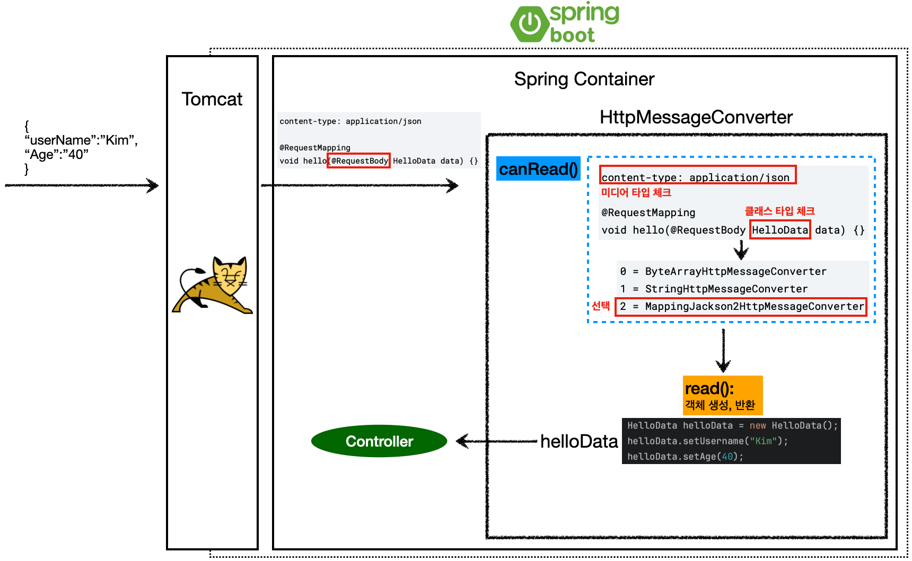

> Spring의 핵심 원리에 대한 이론 및 실습
>

> * 만약 빌드 옵션을 `IntelliJ IDEA`으로 선택했고, 스프링 부트 3.2 이상이면 `Java compiler` 필드에 `-parameters` 옵션(`IllegalArgumentException` 방지)

---

## Index

1. [Web Application](https://github.com/seungki1011/Data-Engineering/tree/main/spring/(003)Spring%20MVC%20-%201#1-web-application)
   * [Web Server, WAS](https://github.com/seungki1011/Data-Engineering/tree/main/spring/(003)Spring%20MVC%20-%201#11-web-server-was)
   * [Thread Pool](https://github.com/seungki1011/Data-Engineering/tree/main/spring/(003)Spring%20MVC%20-%201#12-thread-pool)
   * AJAX
   * [SSR(서버 사이드 렌더링), CSR(클라이언트 사이드 렌더링)](https://github.com/seungki1011/Data-Engineering/tree/main/spring/(003)Spring%20MVC%20-%201#15-ssrserver-side-rendering-csrclient-side-rendering)
2. [MVC(Model View Controller)](https://github.com/seungki1011/Data-Engineering/tree/main/spring/(003)Spring%20MVC%20-%201#2-mvcmodel-view-controller)
   * [MVC 소개](https://github.com/seungki1011/Data-Engineering/tree/main/spring/(003)Spring%20MVC%20-%201#21-mvc-%EC%86%8C%EA%B0%9C)
   * [Front Controller](https://github.com/seungki1011/Data-Engineering/tree/main/spring/(003)Spring%20MVC%20-%201#22-front-controller)
   * Front Controller 도입
   * View 분리
   * Model 도입
   * 사용성 개선
   * Adapter 도입
3. [Spring MVC](https://github.com/seungki1011/Data-Engineering/tree/main/spring/(003)Spring%20MVC%20-%201#3-spring-mvc)
   * [Spring MVC 구조](https://github.com/seungki1011/Data-Engineering/tree/main/spring/(003)Spring%20MVC%20-%201#31-spring-mvc-%EA%B5%AC%EC%A1%B0)
     * `HandlerMapping`, `HandlerAdapter`
     * `ViewResolver`
   * Spring MVC 사용해보기
   * 사용성 개선
4. [Spring MVC - 기능 살펴보기](https://github.com/seungki1011/Data-Engineering/tree/main/spring/(003)Spring%20MVC%20-%201#4-spring-mvc---%EA%B8%B0%EB%8A%A5-%EC%82%B4%ED%8E%B4%EB%B3%B4%EA%B8%B0)
   * [Logging](https://github.com/seungki1011/Data-Engineering/tree/main/spring/(003)Spring%20MVC%20-%201#41-logging)
   * [`MappingController`(요청 매핑)](https://github.com/seungki1011/Data-Engineering/tree/main/spring/(003)Spring%20MVC%20-%201#42-mappingcontroller%EC%9A%94%EC%B2%AD-%EB%A7%A4%ED%95%91)
   * [HTTP Header 조회](https://github.com/seungki1011/Data-Engineering/tree/main/spring/(003)Spring%20MVC%20-%201#43-http-header-%EC%A1%B0%ED%9A%8C)
   * [HTTP Request Parameter](https://github.com/seungki1011/Data-Engineering/tree/main/spring/(003)Spring%20MVC%20-%201#44-http-request-parameter)
     * `@RequestParam`
     * `@ModelAttribute`
   * [HTTP Request Message](https://github.com/seungki1011/Data-Engineering/tree/main/spring/(003)Spring%20MVC%20-%201#45-http-request-message)
     * Text 전달
     * JSON 전달
   * [HTTP Response](https://github.com/seungki1011/Data-Engineering/tree/main/spring/(003)Spring%20MVC%20-%201#46-http-response)
     * Static Resource 제공
     * View Template 사용
     * HTTP 메세지 사용(메세지 바디에 직접 입력)
   * [`HttpMessageConverter`](https://github.com/seungki1011/Data-Engineering/tree/main/spring/(003)Spring%20MVC%20-%201#47-httpmessageconverter)
   * [`RequestMappingHandlerAdapter`](https://github.com/seungki1011/Data-Engineering/tree/main/spring/(003)Spring%20MVC%20-%201#48-requestmappinghandleradapter)
5. [Spring 메세지, 국제화 (Message, Internationalization)](https://github.com/seungki1011/Data-Engineering/tree/main/spring/(003)Spring%20MVC%20-%201#5-%EC%8A%A4%ED%94%84%EB%A7%81-%EB%A9%94%EC%84%B8%EC%A7%80-%EA%B5%AD%EC%A0%9C%ED%99%94-messages-internationalization)
   * [메세지, 국제화 소개](https://github.com/seungki1011/Data-Engineering/tree/main/spring/(003)Spring%20MVC%20-%201#51-%EB%A9%94%EC%84%B8%EC%A7%80-%EA%B5%AD%EC%A0%9C%ED%99%94-%EC%86%8C%EA%B0%9C)
     * 메세지
     * 국제화
   * [메세지 적용하기](https://github.com/seungki1011/Data-Engineering/tree/main/spring/(003)Spring%20MVC%20-%201#52-%EB%A9%94%EC%84%B8%EC%A7%80-%EC%A0%81%EC%9A%A9%ED%95%98%EA%B8%B0)
     * 메세지 소스(`MessageSource`) 설정
     * 타임리프 메세지 적용
   * [국제화 적용하기](https://github.com/seungki1011/Data-Engineering/tree/main/spring/(003)Spring%20MVC%20-%201#53-%EA%B5%AD%EC%A0%9C%ED%99%94-%EC%A0%81%EC%9A%A9%ED%95%98%EA%B8%B0)
6. [검증(Validation)](https://github.com/seungki1011/Data-Engineering/tree/main/spring/(003)Spring%20MVC%20-%201#6-%EA%B2%80%EC%A6%9Dvalidation)
   * [검증 소개](https://github.com/seungki1011/Data-Engineering/tree/main/spring/(003)Spring%20MVC%20-%201#61-%EA%B2%80%EC%A6%9D-%EC%86%8C%EA%B0%9C)
   * [`BindingResult`](https://github.com/seungki1011/Data-Engineering/tree/main/spring/(003)Spring%20MVC%20-%201#62-bindingresult)
   * [오류 코드, 메세지 처리](https://github.com/seungki1011/Data-Engineering/tree/main/spring/(003)Spring%20MVC%20-%201#63-%EC%98%A4%EB%A5%98-%EC%BD%94%EB%93%9C-%EB%A9%94%EC%84%B8%EC%A7%80-%EC%B2%98%EB%A6%AC)
     * `errors.properties`
     * `rejectValue()`, `reject()`
     * `MessageCodesResolver`
     * 스프링이 직접 만든 오류 메세지 처리
   * [Validator 분리](https://github.com/seungki1011/Data-Engineering/tree/main/spring/(003)Spring%20MVC%20-%201#64-validator-%EB%B6%84%EB%A6%AC)
7. [Bean Validation](https://github.com/seungki1011/Data-Engineering/tree/main/spring/(003)Spring%20MVC%20-%201#7-bean-validation)
   * [Bean Validation 사용해보기](https://github.com/seungki1011/Data-Engineering/tree/main/spring/(003)Spring%20MVC%20-%201#71-bean-validation-%EC%82%AC%EC%9A%A9%ED%95%B4%EB%B3%B4%EA%B8%B0)
   * [Bean Validation 검증 순서](https://github.com/seungki1011/Data-Engineering/tree/main/spring/(003)Spring%20MVC%20-%201#72-bean-validation-%EA%B2%80%EC%A6%9D-%EC%88%9C%EC%84%9C)
   * 에러 코드 수정
   * Bean Validation `ObjectError`
   * Bean Validation의 한계와 `groups`
   * [Form 객체의 분리](https://github.com/seungki1011/Data-Engineering/tree/main/spring/(003)Spring%20MVC%20-%201#76-form-%EA%B0%9D%EC%B2%B4%EC%9D%98-%EB%B6%84%EB%A6%AC)
   * [`@RequestBody`에 `@Validated` 적용](https://github.com/seungki1011/Data-Engineering/tree/main/spring/(003)Spring%20MVC%20-%201#77-requestbody%EC%97%90-validated-%EC%A0%81%EC%9A%A9)
8. [쿠키, 세션(Cookie, Session)](https://github.com/seungki1011/Data-Engineering/tree/main/spring/(003)Spring%20MVC%20-%201#8-%EC%BF%A0%ED%82%A4-%EC%84%B8%EC%85%98-cookie-session)
   * 로그인을 위한 요구 사항
   * 화면과 기능 구현
     * 홈 화면
     * 회원 가입
     * 로그인
   * [쿠키 사용(Cookie)]()
   * [세션 사용(Seesion)]()
     * 세션 소개
     * `HttpSession`으로 세션 구현
     * 세션 타임아웃
9. [필터, 인터셉터(Filter, Interceptor)](https://github.com/seungki1011/Data-Engineering/tree/main/spring/(003)Spring%20MVC%20-%201#9-%ED%95%84%ED%84%B0-%EC%9D%B8%ED%84%B0%EC%85%89%ED%84%B0filter-interceptor)
   * [서블릿 필터(Servlet Filter) 소개](https://github.com/seungki1011/Data-Engineering/tree/main/spring/(003)Spring%20MVC%20-%201#91-%EC%84%9C%EB%B8%94%EB%A6%BF-%ED%95%84%ED%84%B0servlet-filter-%EC%86%8C%EA%B0%9C)
   * 필터 예시
     * 예시 1 - 사용자 요청 로깅
     * 예시 2 - 로그인 체크
   * [스프링 인터셉터(Interceptor) 소개](https://github.com/seungki1011/Data-Engineering/tree/main/spring/(003)Spring%20MVC%20-%201#93-%EC%8A%A4%ED%94%84%EB%A7%81-%EC%9D%B8%ED%84%B0%EC%85%89%ED%84%B0interceptor-%EC%86%8C%EA%B0%9C)
   * 인터셉터 예시
     * 예시 1 - 사용자 요청 로깅
     * 예시 2 - 로그인 체크
10. [오류 페이지(Error Page)](https://github.com/seungki1011/Data-Engineering/tree/main/spring/(003)Spring%20MVC%20-%201#10-%EC%98%A4%EB%A5%98-%ED%8E%98%EC%9D%B4%EC%A7%80error-page)
    * 서블릿에서의 예외 처리
       * [스프링 부트에서 제공하는 오류 페이지 기능](https://github.com/seungki1011/Data-Engineering/tree/main/spring/(003)Spring%20MVC%20-%201#102-%EC%8A%A4%ED%94%84%EB%A7%81-%EB%B6%80%ED%8A%B8%EC%97%90%EC%84%9C-%EC%A0%9C%EA%B3%B5%ED%95%98%EB%8A%94-%EC%98%A4%EB%A5%98-%ED%8E%98%EC%9D%B4%EC%A7%80-%EA%B8%B0%EB%8A%A5)
         * 오류 페이지 사용
         * `BasicErrorController`가 제공하는 정보
11. [API 예외 처리](https://github.com/seungki1011/Data-Engineering/tree/main/spring/(003)Spring%20MVC%20-%201#11-api-%EC%98%88%EC%99%B8-%EC%B2%98%EB%A6%AC)
    * `HandlerExceptionResolver` 소개
    * 스프링이 제공하는 `ExceptionResolver`
      * [`ExceptionHandlerExceptionResolver`](https://github.com/seungki1011/Data-Engineering/tree/main/spring/(003)Spring%20MVC%20-%201#1121-exceptionhandlerexceptionresolver)
    * `@ControllerAdvice`
12. [스프링 타입 컨버터](https://github.com/seungki1011/Data-Engineering/tree/main/spring/(003)Spring%20MVC%20-%201#12-%EC%8A%A4%ED%94%84%EB%A7%81-%ED%83%80%EC%9E%85-%EC%BB%A8%EB%B2%84%ED%84%B0)
    * [`Converter`](https://github.com/seungki1011/Data-Engineering/tree/main/spring/(003)Spring%20MVC%20-%201#121-converter)
    * `ConversionService`
    * [`Converter` 사용하기](https://github.com/seungki1011/Data-Engineering/tree/main/spring/(003)Spring%20MVC%20-%201#123-converter-%EC%82%AC%EC%9A%A9%ED%95%98%EA%B8%B0)
    * [`Formatter`](https://github.com/seungki1011/Data-Engineering/tree/main/spring/(003)Spring%20MVC%20-%201#124-formatter)
    * `FormattingConversionService`
    * [스프링 제공 `Formatter`](https://github.com/seungki1011/Data-Engineering/tree/main/spring/(003)Spring%20MVC%20-%201#126-%EC%8A%A4%ED%94%84%EB%A7%81-%EC%A0%9C%EA%B3%B5-formatter)
13. [파일 업로드](https://github.com/seungki1011/Data-Engineering/tree/main/spring/(003)Spring%20MVC%20-%201#13-%ED%8C%8C%EC%9D%BC-%EC%97%85%EB%A1%9C%EB%93%9C)
---

## 1) Web Application

### 1.1 Web Server, WAS

웹 서버는 주로 웹 브라우저에서의 HTTP 요청에 응답하여 정적 웹 컨텐츠(예: HTML 페이지, 파일, 이미지, 비디오)를 제공한다. 일반적으로 애플리케이션 서버에서 웹 컨텐츠도 제공할 수 있으나, 이 서버의 주 기능은 최종 사용자 클라이언트와 서버 측 애플리케이션 코드(이른바 **비즈니스 로직**을 표현하는 코드) 간의 상호 작용을 통해 동적 컨텐츠, 이를테면 트랜잭션 결과, 의사결정 지원, 실시간 분석 등을 생성하고 제공하는 것이다. 

<br>

* **웹 서버(Web Server)**
  * 웹 서버는 웹 사이트를 호스팅하고 간단한 요청에 대한 응답을 제공
  * 웹 서버에 사용되는 기본 프로토콜은 HTTP 프로토콜
    * FTP, SMTP를 지원하는 웹 서버도 존재
  * **대부분 정적 콘텐츠 제공**
  * 대부분의 웹서버는 멀티스레딩을 지원하지 않는다
  * 예) Nginx, Apache


* **웹 애플리케이션 서버(WAS)**
  * **프로그램 코드를 실행해서 애플리케이션 로직(비즈니스 로직)을 처리**
  * 웹 서버에 사용되는 프로토콜 외에도 추가 통신 프로토콜을 사용하여 다른 소프트웨어 구성 요소와 통신
    * 예) RMI, RPC
  * 정적 콘텐츠도 제공 가능하지만, 대부분 동적 콘텐츠를 제공
  * **애플리케이션 서버는 멀티스레딩을 사용하여 높은 확장성과 효율성을 제공(동시 요청을 위한 멀티쓰레드 지원)**
    * 요청에 외부 리소스가 필요한 경우 애플리케이션 서버는 별도의 스레드를 사용하여 이러한 상호 작용을 처리
  * 예) Tomcat, Jetty, Undertow

<br>

최근에는 웹 서버와 애플리케이션 서버의 구분이 많이 모호해졌다. 웹 서버도 프로그램을 실행하는 기능을 포함하기도 하면서, WAS도 웹 서버의 기능을 제공해주기 때문이다. 일단은 **WAS는 애플리케이션 코드를 실행하는데 더 특화**되어 있다고 생각하자.

그러면 웹 서비스를 구성할 때 "WAS만 사용하는가?" 라고 물어보면, 답은 "아니요"다. WAS만으로 시스템을 구성하면 다음과 같은 문제가 발생한다.

* WAS가 너무 많은 역할을 담당, 서버 과부하 우려
* 자원을 가장 많이 소모하는 애플리케이션 로직이 정적 리소스 때문에 수행이 어려울 수 있다
* WAS 장애시 오류 화면 노출이 불가능하다

<br>

위와 같은 문제 때문에 보통 웹 서비스 시스템을 구성할 때 WAS앞에 웹서버를 배치한다. 이렇게 구성하는 경우 다음과 같은 이점을 얻을 수 있다.

* 정적 리소스는 웹서버가 처리하도록 할 수 있다
* 이 때 웹서버는 애플리케이션 로직같은 동적인 처리는 WAS에 요청을 위임한다
* WAS는 중요한 애플리케이션 로직만 처리하도록 할 수 있다
* 정적 리소스가 많아지면 → 웹 서버 증설
* 애플리케이션 로직 처리가 많아지면 → WAS 증설
* 애플리케이션 로직이 동작하는 WAS의 경우, 장애가 날 확률이 웹서버 보다 높다
* WAS, DB 장애시 웹서버가 오류 화면을 제공해줄 수 있다

<br>

<p align="center">    </p>

<p align='center'>Web Server, WAS</p>

<br>

---

### 1.2 Thread Pool

Thread-per-request(요청 당 스레드) 모델의 단점과, 스레드 풀(thread pool)을 이용하는 이유를 알아보자.

먼저 웹 애플리케이션에서 스레드는 무엇일까?

* 애플리케이션 코드를 하나씩 순차적으로 실행하는 것이 스레드(thread)
* 자바 메인 메서드를 처음 실행하면 main이라는 이름의 스레드가 실행
* 스레드는 한번에 하나의 코드 라인만 수행
* 이때 동시 처리가 필요한 경우 스레드를 추가로 생성해서 사용한다(multi-thread)

<br>

웹 애플리케이션에서 여러 요청이 들어올 때, 요청 마다 스레드를 생성하는 것은 단일 스레드를 이용하는 것과 달리 동시 요청을 처리할 수 있도록 해준다. 그러나 이런 요청 당 스레드(thread-per-request) 모델에는 단점들이 존재한다.

<p align="center">    </p>

<p align='center'>Thread per Request</p>

* 처리 속도보다 더 빠르게 요청이 늘어나면 어떤 일이 일어날까?
  * 요청마다 스레드가 계속 생성되기 때문에 스레드 수가 계속 늘어난다 (스레드 생성에 제한이 없다)
  * 스레드의 생성 비용은 비싼편이다 → 스레드 생성 소요시간으로 인해 요청 처리 시간이 더 오래 걸릴 수 있다
  * 스레드 수 증가 → 메모리 고갈
  * 컨텍스트 스위칭이 더 자주 발생한다 → CPU 오버헤드 증가
  * **이런 문제가 계속 늘어나면 결국에 서버 전체가 응답 불가능 상태에 빠진다!**

<br>

이런 문제를 해결하기 위해서 쓰레드 풀(thread pool)이라는 것을 사용한다.

<p align="center">    </p>

<p align='center'>Thread Pool</p>

스레드 풀 동작 과정

1. 요청이 들어와서 스레드가 필요한 경우, 스레드 풀에서 이미 생성되어 있는 스레드를 꺼내서 사용한다
2. 요청에 스레드의 사용을 종료하면 해당 스레드를 스레드 풀에 다시 반납한다
3. 최대 스레드(max thread) 만큼 모두 사용중이어서 스레드 풀에 스레드가 없는 경우
   *  기다리는 요청을 거절하거나 특정 숫자만큼 대기하도록 설정할 수 있다

<br>

스레드 풀을 정리하자면 다음과 같다.

* **스레드 풀은 정해진 수 만큼의 스레드(max thread)를 미리 만들어놓고 스레드를 재사용하는 방법이다**
  * Tomcat은 기본 설정으로 max thread를 200으로 설정한다
* 미리 스레드를 만들어 놓기 때문에 스레드 생성 시간을 절약할 수 있다 → 쓰레드 생성 비용 절약, 응답 시간이 빨라진다 
* 제한된 개수의 스레드를 운용하는 것이기 때문에 스레드의 무제한 생성을 방지 할 수 있다 → 많은 요청이 들어와도 기존 요청을 안전하게 처리 가능하다

<br>

WAS의 주요 튜닝 포인트는 최대 스레드(max thread)이다.

* 최대 스레드가 너무 낮은 경우
  * 동시 요청이 많아질 때, 서버 리소스는 남아 돌지만 클라이언트는 응답 지연을 겪는다
* 최대 스레드가 너무 높은 경우
  * 동시 요청이 많아질 때, 서버의 자원(CPU, 메모리) 임계점 초과로 서버 다운

<br>

이상적인 최대 스레드 수는 작업 형태, 서버 성능, 아키텍쳐에 따라 달라질 수 있기 때문에 경험적으로 찾아야한다. 큐 사이즈에 제한이 없으면 요청이 무한히 쌓이는 위험 요인(메모리 고갈)이 될 수 있으니, 가능한 큐 사이즈를 확인해보는 것도 중요하다.

테스트는 실제 서비스와 유사하게 성능 테스트를 해보자. (툴 : Apache ab, nGrinder 등) 

<br>

---

### 1.4 AJAX

AJAX는 Asynchronous JavaScript and XML의 약자로, 말 그대로 JavaScript와 XML을 이용한 비동기적 정보 교환 기법이다. 이름에 XML이라고 명시되어있긴 하지만 JSON이나 일반 텍스트 파일과 같은 다른 데이터 오브젝트들도 사용 가능해서 요즘엔 XML을 잘 안 쓰고 대부분 JSON을 사용한다.

AJAX의 동작 원리는 다음과 같다.

1. 브라우저가 사이트에 접속하면 서버는 사이트의 기본 구조를 담은 '템플릿'을 전달한다
2. 브라우저는 수신받은 템플릿 HTML과 CSS를 해석해 화면의 기본 모양을 랜더링한다
3. 계속해서 서버는 데이터의 요청 방식과 수신받은 데이터를 어떻게 가공해야 하는지를 기술한 자바스크립트 파일을 전달한다
4. 브라우저는 자바스크립트 파일을 해석해서 파일에 기술된 방식대로 서버에 추가 데이터를 요청한다
5. 서버는 순수 데이터를 응답으로 되돌려준다 (보통 JSON)
6. 브라우저는 수신한 데이터를 해석하여 템플릿의 적절한 위치에 삽입한다. 데이터의 가공 방식에 따라 삽입 외의 작업(변경, 삭제)을 할 수도 있다

<br>

AJAX가 등장하면서 Gmail과 같은 SPA(Single Page Application)도 점점 나오기 하기 시작했다.

<br>

---

### 1.5 SSR(Server Side Rendering), CSR(Client Side Rendering)

SSR은 요청에 대한 결과 HTML을 서버에서(Server Side) 생성해서 클라이언트에 전달하는 방식이다. SSR의 과정은 다음과 같다.

1. 클라이언트에서 요청을 보낸다
2. 서버에서 응답을 위해 즉시 렌더링 가능한 HTML을 생성한다
3. 클라이언트에 HTML을 전달한다.
   * HTML은 브라우저에서 즉시 렌더링된다
   * 클라이언트가 자바스크립트를 다운로드하기 전까지 동적으로 상호작용이 불가능하다 (JS 다운로드 전까지의 조작을 기억한다)

<br>

반면에 CSR은 결과 HTML을 자바스크립트를 사용해 웹 브라우저에서 동적으로 내용을 생성해서 적용하는 것이다. CSR의 과정은 다음과 같다.

1. 클라이언트에서 요청을 보낸다
2. 서버는 클라이언트에게 비어있는 HTML과 자바스크립트 링크를 클라이언트에게 보낸다
3.  클라이언트는 자바스크립트를 요청
4. 서버는 자바스크립트를 클라이언트에게 전달
   * 자바스크립트 안에 클라이언트 로직과 HTML을 렌더링하는 코드가 들어가 있음
5. 클라이언트는 HTTP API를 가지고 데이터를 요청함
6. 서버는 해당 데이터 요청에 대한 JSON을 클라이언트에게 응답으로 전달
7. 클라이언트는 해당 데이터(JSON)를 가지고 동적으로 HTML 내용 렌더링 

<br>

SSR VS CSR의 특징을 정리해보자.

* SSR
  * 초기 로딩 속도가 빠름
  * 주로 정적인 화면에 사용
  * 모든 데이터가 담긴 HTML을 브라우저로 전달하기 때문에 SEO에 유리
  * SSR을 사용하더라도, JS를 사용해서 화면 일부를 동적으로 변경 가능
  * 관련 기술 : JSP, 타임리프(템플릿 엔진)


* CSR
  * 초기 로딩 이후의 구동 속도가 빠름
    * SSR에 비해 초기 로딩 속도가 느림
  * 주로 동적인 화면에 사용
  * 대부분 HTML의 내용이 비어있기 때문에 SEO에 불리
  * 서버 부하를 줄일 수 있음
  * 관련 기술 : React, Vue

<br>

<p align="center">    </p>

<p align='center'>SSR vs CSR</p>

<br>

> CSR + SSR을 동시 사용할 수 있는 웹프레임워크들도 존재

<br>

---

## 2) MVC(Model View Controller)

### 2.1 MVC 소개

기존의 서블릿이나 JSP만 사용하게 되면, **비즈니스 로직과 뷰(view)가 분리되어 있지 않았다. 결과적으로 유지보수가 어려워진다**. 예를 들자면, 비즈니스 로직을 처리하는 코드를 변경해야하는 경우 뷰가 함께 있는 코드를 수정해야한다. 반대로 UI를 변경하는 일에도 비즈니스 로직이 있는 코드도 함께 수정해야 한다.

MVC 패턴은 기존에 하나의 영역으로 처리하던 것을 컨트롤러(Controller), 뷰(View), 모델(Model)의 3개 영역으로 분리하는 디자인 패턴이다. 웹 애플리케이션의 많은 경우 이 MVC 패턴을 이용한다.

<p align="center">    </p>

<p align='center'>MVC Pattern</p>

* **컨트롤러(Controller)**: HTTP 요청을 받아서 파라미터를 검증하고, 비즈니스 로직을 실행한다. 그리고 뷰에 전달할 결과 데이터를 조회해서 모델에 담는다.
  * 컨틀로러에 비즈니스 로직을 둘 수도 있지만, 이 경우 컨트롤러가 너무 많은 역할을 담당한다
  * **비즈니스 로직을 서비스 레이어라는 계층을 별도로 만들어서 처리하는 경우가 많다**
  * 컨트롤러는 비즈니스 로직이 있는 서비스를 호출하는 역할


* **모델(Model)**: 뷰에 출력할 데이터를 담아둔다
  * 뷰는 비즈니스 로직이나 데이터 접근을 몰라도 됨


* **뷰(View)** : 모델에 담겨있는 데이터를 이용해 화면을 그린다(대부분 HTML 생성을 말한다)

<br>

---

### 2.2 Front Controller

기존 MVC 패턴의 단점은 다수의 컨트롤러에서 중복되는 코드들이다. 이런 중복 코드를 메서드로 공통화 할 순 있지만, 결국에 해당 메서드도 항상 직접 호출해야하는건 변함이 없다.

기능이 복잡해질 수록 컨트롤러에서 공통으로 처리해야 하는 부분이 점점 더 많이 증가할 것이다. 단순히 공통 기능을 메서드로 뽑으면 될 것 같지만, 결과적으로 해당 메서드를 항상 호출해야 하고, 실수로 호출하지 않으면 문제가 될 것이 다. 그리고 호출하는 것 자체도 중복이다.

이를 해결하기 위해서 **컨트롤러 호출전에 공통 기능을 처리하는 프론트 컨틀로러(Front Controller)를 도입**하면 된다. (Centralized request handling)

<br>

<p align="center">    </p>

<p align='center'>Front Controller</p>

* Front Controller 도입 전에는 컨트롤러의 공통 로직이 계속 중복되어서 들어갔다
* Front Controller 도입 후에는 공통의 로직을 하나의 서블릿으로 모아서 처리한다
* Front Controller의 특징은 다음과 같다
  * 프론트 컨트롤러 서블릿 하나로 클라이언트의 요청을 받는다(Centralized request handling)
  * 프론트 컨트롤러가 요청에 맞는 컨트롤러를 찾아서 호출한다
  * 프론트 컨트롤러를 제외한 나머지 컨트롤러는 서블릿을 사용하지 않아도 된다
    * 서블릿을 만들었던 이유는 싱글톤으로 관리되는 서블릿을 통해 요청을 받고 응답을 생성하기 위함이였음 → 이제는 프론트 컨틀롤러 서블릿을 통해 요청을 다 받으면 됨 → 나머지 컨틀로러는 서블릿을 사용하지 않아도 됨


* 스프링 웹 MVC의 `DispatcherServlet`이 프론트 컨트롤러 패턴으로 구현되어 있음

<br>

---

### 2.3 Front Controller 도입

프론트 컨트롤러와 나머지 컨트롤러를 구현하기 이전에, 구현할 애플리케이션의 요구사항을 간단하게 짚고 넘어가자. 

회원 관리 웹 애플리케이션 요구사항

* 회원 정보
  * 이름 : `username`
  * 나이 : `age`
* 기능 요구사항
  * 회원 저장
  * 회원 목록 조회

<br>

프론트 컨트롤러를 도입하고 점진적으로 리팩토링을 진행해보자. 프론트 컨트롤러 도입 전에 컨틀로러 인터페이스를 만들자. 프론트 컨트롤러를 제외한 나머지 컨트롤러들은 이 인턴페이스를 구현하면 된다. 프론트 컨트롤러는 이 인터페이스를 호출해서 구현과 관계없이 로직의 일관성을 가져갈 수 있다.

`ControllerV1`

```java
public interface ControllerV1 {
     void process(HttpServletRequest request, HttpServletResponse response) throws ServletException, IOException;
 }
```

이 인터페이스를 구현할 컨트롤러는 

* 회원 등록 컨트롤러
* 회원 저장 컨트롤러
* 회원 목록 컨트롤러

<br>

프론트 컨트롤러 도입을 위해 `FrontControllerServletV1`을 만들자.

```java
@WebServlet(name = "frontControllerServletV1", urlPatterns = "/front-controller/v1/*")

public class FrontControllerServletV1 extends HttpServlet {

    private Map<String, ControllerV1> controllerMap = new HashMap<>();
		
    // 컨트롤러 맵을 통해서 URL과 호출될 컨트롤러를 매핑한다
    public FrontControllerServletV1() {
        controllerMap.put("/front-controller/v1/members/new-form", new MemberFormControllerV1());
        controllerMap.put("/front-controller/v1/members/save", new MemberSaveControllerV1());
        controllerMap.put("/front-controller/v1/members", new MemberListControllerV1());
    }

    @Override
    protected void service(HttpServletRequest request, HttpServletResponse response) throws ServletException, IOException {
        System.out.println("FrontControllerServletV1.service");

        String requestURI = request.getRequestURI();

        ControllerV1 controller = controllerMap.get(requestURI);
        if (controller == null) {
            response.setStatus(HttpServletResponse.SC_NOT_FOUND);
            return;
        }

        controller.process(request, response);
    }
}
```

* `urlPatterns = "/front-controller/v1/*"`:  `/front-controller/v1`를 포함한 하위 모든 요청을 이 서블릿애서 받아들인다
* `controllerMap`을 통해 URL과 호출될 컨트롤러를 매핑
* `requestURI` 를 조회해서 실제 호출할 컨트롤러를 `controllerMap` 에서 찾는다
  * 없으면 : `404 Not Found` 반환
  * 찾으면 : `controller.process(request, response);` 을 호출해서 해당 컨트롤러를 실행

<br>

그림으로 살펴보면 다음과 같다. 

<p align="center">    </p>

<p align='center'>Front Controller V1</p>

<br>

---

### 2.4 View 분리

구현된 컨트롤러에서 뷰로 이동하는 부분에 중복이 있었다. (컨트롤러에서 JSP forward하는 부분)

```java
String viewPath = "/WEB-INF/views/new-form.jsp";
RequestDispatcher dispatcher = request.getRequestDispatcher(viewPath);
dispatcher.forward(request, response);
```

<br>

중복되는 부분을 분리하기 위해서 별도로 뷰를 처리하는 객체 `MyView`를 만들고, 기존 컨트롤러들이 `MyView`를 반환하도록 컨트롤러들을 수정해보자.

이를 위해서 기존 컨트롤러 인터페이스의 구현이 `MyView`를 반환하도록 수정해야 한다.

`ControllerV2`

```java
public interface ControllerV2 {
    MyView process(HttpServletRequest request, HttpServletResponse response) throws ServletException, IOException;
}
```

<br>

`MyView`에서는 `render()`를 통해서 `forward`로직을 수행해서 JSP가 실행된다.

<br>

그림으로 구조를 살펴보면 다음과 같다.

<p align="center">    </p>

<p align='center'>View seperation + Front Controller V2</p>

* `ControllerV2`를 구현한 컨트롤러들을 살펴보면, 복잡하게 뷰로 이동하던 로직들의 중복이 제거되었다
* 프론트 컨트롤러의 도입으로 `MyView` 객체의 `render()` 를 호출하는 부분을 모두 일관되게 처리할 수 있다
* 각각의 컨트롤러는 `MyView` 객체를 생성만 해서 반환하면 된다

<br>

---

### 2.5 Model 도입

Model을 도입해보자.

* 서블릿 종속성 제거
  * 컨틀로러 입장에서 `HttpServletRequest`, `HttpServletResponse`는 필요하지 않다
  * 요청 파라미터의 정보는 `Map`으로 대신 넘기도록 하면 지금 구조에서 컨트롤러가 서블릿 기술을 몰라도 동작 가능
  * `request` 개체를 모델로 사용하는 대신, 별도의 모델 객체를 만들어서 반환하면 된다


* 뷰 이름 중복 제거
  * 컨트롤러에서 지정하는 뷰 이름에 중복이 있다
  * 컨트롤러는 뷰의 논리 이름을 반환하고, 실제 물리 위치의 이름은 프론트 컨트롤러에서 처리하도록 하자 → 향후 뷰의 폴더 위치가 함께 이동해도 프론트 컨트롤러만 수정하면 된다 (논리 이름 : 의미를 나타내는 이름)
    * `/WEB-INF/views/new-form.jsp` → 논리 이름 : `new-form`
    *  `/WEB-INF/views/save-result.jsp` → 논리 이름 : `save-result`
    * `/WEB-INF/views/members.jsp` → 논리 이름 : `members`

<br>

<p align="center">    </p>

<p align='center'>MemberSaveControllerV2</p>

<br>

지금까지 컨트롤러에서 서블릿에 종속적인 `HttpServletRequest`를 사용했다. 그리고 Model도 `request.setAttribute()` 를 통해 데이터를 저장하고 뷰에 전달했다.

서블릿의 종속성을 제거하기 위해 Model을 직접 만들고, 추가로 View 이름까지 전달하는 객체를 만들어야한다. (이번 버전에서는 컨트롤러에서 HttpServletRequest를 사용할 수 없다. 따라서 직접 `request.setAttribute()` 를 호출할 수 도 없다. 따라서 Model이 별도로 필요.)

이를 위해서 `ModelView`를 만든다.

<br>

`ModelView`

```java
public class ModelView {
     private String viewName;
  
     private Map<String, Object> model = new HashMap<>();
     
     public ModelView(String viewName) { this.viewName = viewName; }
  
     public String getViewName() { return viewName; }
  
     public void setViewName(String viewName) { this.viewName = viewName; }
  
     public Map<String, Object> getModel() { return model; }
  
     public void setModel(Map<String, Object> model) { this.model = model; }	 
}
```

* 뷰의 이름과 뷰를 렌더링할 때 필요한 model 객체를 가지고 있다
* model은 단순히 map으로 되어 있으므로 컨트롤러에서 뷰에 필요한 데이터를 key, value로 넣어주면 된다

<br>

```ControllerV3```

```java
public interface ControllerV3 {
     ModelView process(Map<String, String> paramMap);
}
```

* `HttpServletRequest`가 제공하는 파라미터는 프론트 컨트롤러가 `paramMap`에 담아서 호출해주면 된다
* 응답 결과로 뷰 이름과 뷰에 전달할 Model 데이터를 포함하는 `ModelView` 객체를 반환하면 된다

<br>

`FrontControllerV3`

```java
    @Override
    protected void service(HttpServletRequest request, HttpServletResponse response) throws ServletException, 		IOException {

        String requestURI = request.getRequestURI();

        ControllerV3 controller = controllerMap.get(requestURI);
        if (controller == null) {
            response.setStatus(HttpServletResponse.SC_NOT_FOUND);
            return;
        }

        Map<String, String> paramMap = createParamMap(request);
        ModelView mv = controller.process(paramMap);

        String viewName = mv.getViewName();
        MyView view = viewResolver(viewName);

        view.render(mv.getModel(), request, response);
    }

    private MyView viewResolver(String viewName) {
        return new MyView("/WEB-INF/views/" + viewName + ".jsp");
    }

    private Map<String, String> createParamMap(HttpServletRequest request) {
        Map<String, String> paramMap = new HashMap<>();
        request.getParameterNames().asIterator()
                .forEachRemaining(paramName -> paramMap.put(paramName, request.getParameter(paramName)));
        return paramMap;
    }
```

* `view.render(mv.getModel(), request, response)`의 동작을 위해서 `MyView`에 필요한 메서드를 추가해야 한다


<br>

그림으로 살펴보자.

<p align="center">    </p>

<p align='center'>Servlet Dependency elimination + Front Controller V3</p>

* `view.render(mv.getModel(), request, response)`
  * 뷰 객체를 통해서 HTML 화면을 렌더링 한다
  * 뷰 객체의 `render()` 는 모델 정보도 함께 받는다
  * JSP는 `request.getAttribute()` 로 데이터를 조회하기 때문에, 모델의 데이터를 꺼내서`request.setAttribute()` 로 담아둔다
  * JSP로 `forward` 해서 JSP를 렌더링 한다

<br>

---

### 2.6 사용성 개선

지금까지 구현한 컨트롤러의 개선 방법. 사용성이 더 편리하도록 개선해보자.

* 지금의 구조에서 컨트롤러가 `ModelView`를 반환하지 않고 `ViewName`만 반환하도록 한다

```Java
public interface ControllerV4 {
  String process(Map<String, String> paramMap, Map<String, Object> model);
 }
```

* model 객체는 파라미터로 전달해서 컨트롤러에서 그냥 사용하면 된다
* 결과로 뷰의 이름(`ViewName`)만 반환해주면 된다

<br>

```java
@WebServlet(name = "frontControllerServletV4", urlPatterns = "/front-controller/v4/*")
public class FrontControllerServletV4 extends HttpServlet {
  /** 기존 구현 */
  
  Map<String, String> paramMap = createParamMap(request);
  Map<String, Object> model = new HashMap<>(); //추가
  
  String viewName = controller.process(paramMap, model);
  
  // 컨트롤러가 직접 뷰의 논리 이름을 반환하기 때문에 이 값을 그대로 사용해서 실제 물리 경로 찾을 수 있음
  MyView view = viewResolver(viewName);
  view.render(model, request, response);
  
  /** 기존 구현 */
}
```

* `Map<String, Object> model = new HashMap<>();` 
  * 모델 객체를 프론트 컨트롤러에서 생성해서 넘겨준다
  * 컨트롤러에서 모델 객체에 값을 담으면 여기에 그대로 담긴다

<br>

그림으로 살펴보자.

<p align="center">    </p>

<p align='center'>Controller V3 사용성 개선</p>

<br>

---

### 2.7 Adapter 도입

우리가 기존의 `ControllerV3` 방식으로도 개발을 하고, 개선된 컨트롤러 방식으로도 개발을 하고 싶으면 어떻게 할까? 현재의 코드로는 한가지 방식의 컨트롤러 인터페이스만 사용가능하다. 이를 해결하기 위해서 어댑터(Adapter)를 도입해보자.

> 어댑터 패턴(Adapter Pattern) : 기존의 request들이 compatible 하도록 중간에 바꿔주는 어댑터를 도입하는 패턴을 어댑터 패턴이라고 한다

<br>

어댑터를 도입한 구조를 그림으로 살펴보면 다음과 같다.

<p align="center">    </p>

<p align='center'>Adapter 도입</p>

* **핸들러 어댑터**: 중간에 어댑터 역할을 하는 어댑터(Adapter)가 추가되었는데 이름이 핸들러 어댑터이다. 여기서 어댑터 역할을 해주는 덕분에 다양한 종류의 컨트롤러를 호출할 수 있다.
  * 어댑터는 실제 컨트롤러를 호출하고, 그 결과로 `ModelView`를 반환해야 한다 (이제부터 어댑터를 통해서 컨트롤러 호출)
  * 컨트롤러가 `ModelView`를 반환하지 못하면, 어댑터가 `ModelView`를 직접 생성해서라도 반환해야 한다


* **핸들러**: 컨트롤러의 이름을 더 넓은 범위인 핸들러로 변경했다. 그 이유는 이제 어댑터가 있기 때문에 꼭 컨트롤러의 개념 뿐만 아니라 어떠한 것이든 해당하는 종류의 어댑터만 있으면 다 처리할 수 있기 때문이다.

<br>

<p align="center">    </p>

* 결론적으로 어댑터를 이용하면 프레임워크를 더 유연하고 확장성 있게 설계할 수 있다.

<br>

---

## 3) Spring MVC

### 3.1 Spring MVC 구조

우리가 이전까지 구성했던 프레임워크와 스프링 MVC를 비교해보면 구성요소가 같다는 것을 확인할 수 있다. 명칭은 다음과 같이 대응된다.

* `FrontController` → `DispatcherServlet`
* `handlerMappingMap` → `HandlerMapping`
* `MyHandlerAdapter` → `HandlerAdapter`
* `ModelView` → `ModelAndView`
* `viewResolver` → `ViewResolver`
* `MyView` → `View`

<br>

<p align="center">    </p>

<p align='center'>Spring MVC</p>

* `DispatcherServlet` : 스프링 MVC의 프론트 컨트롤러
  * `HttpServlet`을 상속 받아서 사용하고, 서블릿으로 동작한다
  * 스프링 부트는 `DispatcherServlet`을 서블릿으로 자동 등록하면서 모든 경로(`urlPatterns="/"`)에 대해 매핑한다


* `DispatcherServlet` 호출 → `HttpServlet`이 제공하는 `service()` 호출 → `FrameworkServlet.service()`를 시작으로 여러 메서드 호출 → 그 중에서 제일 중요한 것은 `DispatcherServlet.doDispatch()`의 호출이다

<br>

 `DispatcherServlet.doDispatch()`의 코드를 살펴보자.(예외처리와 인터셉터 기능은 전부 제외했다)

```java
 protected void doDispatch(HttpServletRequest request, HttpServletResponse response) throws Exception {
     
     HttpServletRequest processedRequest = request;
     HandlerExecutionChain mappedHandler = null;
     ModelAndView mv = null;
   
     // 1. 핸들러 조회
     mappedHandler = getHandler(processedRequest); 
     if (mappedHandler == null) {
         noHandlerFound(processedRequest, response);
         return; 
     }

     // 2. 핸들러 어댑터 조회 - 핸들러를 처리할 수 있는 어댑터
     HandlerAdapter ha = getHandlerAdapter(mappedHandler.getHandler());

     // 3. 핸들러 어댑터 실행 -> 4. 핸들러 어댑터를 통해 핸들러 실행 -> 5. ModelAndView 반환 
     mv = ha.handle(processedRequest, response, mappedHandler.getHandler());

     processDispatchResult(processedRequest, response, mappedHandler, mv, dispatchException);
 }

 private void processDispatchResult(HttpServletRequest request, HttpServletResponse response,  HandlerExecutionChain mappedHandler, ModelAndView mv, Exception exception) throws Exception {
   	 
     // 뷰 렌더링 호출
     render(mv, request, response);
 }

 protected void render(ModelAndView mv, HttpServletRequest request, HttpServletResponse response) throws  Exception {
   
     View view;
     String viewName = mv.getViewName();

     // 6. 뷰 리졸버를 통해서 뷰 찾기, 7. View 반환
     view = resolveViewName(viewName, mv.getModelInternal(), locale, request);

     // 8. 뷰 렌더링
     view.render(mv.getModelInternal(), request, response);
 }
```

<br>

---

#### 3.1.1 `HandlerMapping`, `HandlerAdapter`

 `HandlerMapping`, `HandlerAdapter`를 더 자세히 살펴보자.

과거에 주로 사용했던 스프링이 제공하는 컨트롤러를 이용해서 이해해보자.

```java
 public interface Controller {
     // 과거에 사용했던 컨트롤러
     ModelAndView handleRequest(HttpServletRequest request, HttpServletResponse response) 
     throws Exception;
 }
```

<br>

이 컨트롤러 인터페이스를 이용해서 컨트롤러를 구현해보자.

```java
 @Component("/springmvc/old-controller")
 public class OldController implements Controller {
   
     @Override
     public ModelAndView handleRequest(HttpServletRequest request, HttpServletResponse response) throws 	        Exception {
         System.out.println("OldController.handleRequest");
         return null;
		 } 
 }
```

* `/springmvc/old-controller`이라는 이름으로 스프링 빈 등록
* 빈의 이름으로 URL 매핑할 예정

<br>

http://localhost:8080/springmvc/old-controller을 실행해보면 `OldController.handleRequest`의 출력을 확인 할 수 있다.

그럼 이 컨트롤러의 호출 방법을 살펴보자.

* `HandlerMapping`(핸들러 매핑)
  * 핸들러 매핑에서 이 컨트롤러를 찾을 수 있어야 한다
  * 예) 스프링 빈의 이름으로 핸들러를 찾을 수 있는 핸들러 매핑이 필요하다 → `/springmvc/old-controller`으로 핸들러를 찾을 수 있는 매핑 필요
* `HandlerAdapter`(핸들어 어댑터)
  * 핸들러 매핑을 통해서 찾은 핸들러를 실행할 수 있는 핸들러 어댑터가 필요하다
  * 예) `Controller` 인터페이스를 실행할 수 있는 핸들러 어댑터를 찾고 실행해야 한다

<br>

스프링은 필요한 핸들러 매핑과 어댑터를 대부분 구현해두었다. 스프링 부트는 자동으로 여러가지 `HandlerMapping`과  `HandlerAdapter`를 등록해둔다.

* `HandlerMapping`
  1. `RequestMappingHandlerMapping` : 애노테이션 기반의 컨트롤러인 `@RequestMapping`에서 사용한다
  2. `BeanNameUrlHanlderMapping` : 스프링 빈의 이름으로 핸들러를 찾는다 (위의 예시에서 사용)


* `HandlerAdapter`
  1. `RequestMappingHandlerAdapter` : 애노테이션 기반의 컨트롤러인 `@RequestMapping`에서 사용한다
  2. `HttpRequestHandlerAdapter` : `HttpRequestHandler` 처리
  3. `SimpleControllerHandlerAdapter` : `Controller` 인터페이스 처리(애노테이션X, 과거에 사용, 위의 예시에서 사용) 

<br>

개발할 때는 대부분 `@RequestMapping` 사용.

<br>

---

#### 3.1.2 `ViewResolver`

뷰 리졸버에 대해서 자세히 알아보자.

`View`를 사용할 수 있도록 위에서 구현한 `OldController`에 다음 코드를 추가해보자 `return new ModelAndView("new-form");`. 그러나 `springmvc/old-controller`에 들어가보면 에러 페이지가 나오는 것을 확인 할 수 있다. 이를 해결하기 위해서 다음 코드를 추가해보자.

`application.properties`

```java
 spring.mvc.view.prefix=/WEB-INF/views/
 spring.mvc.view.suffix=.jsp
```

* 스프링 부트는 `InternalResourceViewResolver` 라는 뷰 리졸버를 자동으로 등록한다
* `application.properties` 에 등록한 `spring.mvc.view.prefix` , `spring.mvc.view.suffix` 설정 정보를 사용해서 등록한다

<br>

스프링 부트가 자동으로 등록하는 `ViewResolver`를 몇 가지 알아보자.

1. `BeanNameViewResolver` : 빈 이름으로 뷰를 찾아서 반환한다
2. `InternalResourceViewResolver` : JSP를 처리할 수 있는 뷰를 반환한다

<br>

동작 과정을 한번 살펴보자.

1. 핸들러 어댑터 호출
   * 핸들러 어댑터를 통해 `new-form`이라는 뷰의 논리 이름을 획득한다
2. `ViewResolver` 호출
   * `new-form`이라는 뷰 이름으로 `viewResolver`를 순서대로 호출한다
   * `BeanNameViewResolver`는 `new-form`이라는 이름의 스프링 빈으로 등록된 뷰를 찾지만 없다
   * `InternalResourceViewResolver`가 호출
3. `InternalResourceViewResolver`
   * `InternalResourceView` 반환
4. `InternalResourceView` 
   * `InternalResourceView` 는 JSP처럼 포워드 `forward()` 를 호출해서 처리할 수 있는 경우에 사용한다
5. `view.render()` 
   * `view.render()` 가 호출되고 `InternalResourceView` 는 `forward()` 를 사용해서 JSP를 실행한다

<br>

* 다른 뷰는 실제 뷰를 렌더링하지만, JSP의 경우 `forward()` 통해서 해당 JSP로 이동(실행)해야 렌더링이 된다. JSP를 제외한 나머지 뷰 템플릿들은 `forward()` 과정 없이 바로 렌더링 된다.
* Thymeleaf 뷰 템플릿을 사용하면 `ThymeleafViewResolver` 를 등록해야 한다. 최근에는 라이브러리만 추가하면 스프링 부트가 이런 작업도 모두자동화해준다.

<br>

---

### 3.2 Spring MVC 사용해보기

이전의 회원 등록 애플리케이션을 스프링 MVC를 이용해서 구현해보자.

들어가기에 앞서, 스프링이 제공하는 컨트롤러는 애노테이션 기반으로 동작해서, 매우 실용적이다.

<br>

`SpringMemberControllerV2`

```java
 /**
  * 클래스 단위 -> 메서드 단위
  * @RequestMapping 클래스 레벨과 메서드 레벨 조합 
  */

 @Controller
 @RequestMapping("/springmvc/v2/members") // 매핑 URL의 중복을 제거
 public class SpringMemberControllerV2 {
   
     private MemberRepository memberRepository = MemberRepository.getInstance();
     
     @RequestMapping("/new-form")
     public ModelAndView newForm() {
         return new ModelAndView("new-form");
		 }
   	 
     // 위의 @RequestMapping("/springmvc/v2/members")를 통해서 "/springmvc/v2/members" + "/save"으로 사용
     @RequestMapping("/save")
     public ModelAndView save(HttpServletRequest request, HttpServletResponse response) {
         
         String username = request.getParameter("username");
         int age = Integer.parseInt(request.getParameter("age"));
         
         Member member = new Member(username, age);
         memberRepository.save(member);
         
         ModelAndView mav = new ModelAndView("save-result");
         mav.addObject("member", member); // Model 데이터 추가
         
         return mav;
     }
   	 
     // "/springmvc/v2/members" 자체가 URL
     @RequestMapping
     public ModelAndView members() {
         
         List<Member> members = memberRepository.findAll();
         
         ModelAndView mav = new ModelAndView("members");
         mav.addObject("members", members); 
         
         return mav;
} 
```

* `@Controller`
  * 스프링이 자동으로 스프링 빈으로 등록한다. (내부에 `@Component` 애노테이션이 있어서 컴포넌트 스캔의 대상이 됨)
  * 스프링 MVC에서 애노테이션 기반 컨트롤러로 인식한다


* `@RequestMapping`
  * 요청 정보를 매핑한다
  * 해당 URL이 호출되면 이 메서드가 호출된다
  * 애노테이션을 기반으로 동작하기 때문에, 메서드의 이름은 임의로 지으면 된다


* `ModelAndView`
  * 모델과 뷰 정보를 담아서 반환


* 기존에는 분리되어 있던 컨트롤러 클래스들을 하나로 통합했다
* 클래스 레벨의 `@RequestMapping`를 이용해서 URL의 중복을 제거 할 수 있다
  * 예) 클래스 레벨 : `@RequestMapping("/springmvc/v2/members")` + 메서드 레벨 : `@RequestMapping("/new-form")`

<br>

> 기존에는 스프링 빈 중에 클래스 레벨에 `@RequestMapping`이 붙어 있었으면 `RequestMappiongHandlerMapping`이 매핑정보로 인식 했지만, **스프링 3.0 부터 클래스 레벨에 `@RequestMapping`이 붙어 있는 스프링 빈이어도 스프링 컨트롤러로 인식하지 않는다. 무조건 `@Controller`가 붙어 있어야 스프링 컨트롤러로 인식한다.**

<br>

---

### 3.3 사용성 개선

지금까지 만들었던 스프링 MVC 컨트롤러의 사용성을 개선해보자.

개선하고 싶은 부분은 다음과 같다.

* `ViewName`을 직접 반환하도록 하고 싶다(뷰의 논리 이름 반환)
* Model 파라미터를 받고 싶다
* HTTP 요청 파라미터를 직접 받고 싶다
* `@RequestMapping` 으로 URL만 매칭하는 것이 아니라, HTTP 메서드도 구분하고 싶다

<br>

개선한 코드를 살펴보자.

`SpringMemberControllerV3`

```java
 /**
  * Model 도입
  * ViewName 직접 반환
  * @RequestParam 사용
  * @RequestMapping -> @GetMapping, @PostMapping
  */

 @Controller
 @RequestMapping("/springmvc/v3/members")
 public class SpringMemberControllerV3 {
     private MemberRepository memberRepository = MemberRepository.getInstance();
     
     // @RequestMapping(value = "/new-form", method = RequestMethod.GET)
     @GetMapping("/new-form")
     public String newForm() {
         return "new-form";
     }
     
     // @RequestMapping(value = "/save", method = RequestMethod.POST)
     @PostMapping("/save")
     public String save(
             @RequestParam("username") String username,
             @RequestParam("age") int age,
             Model model) {
         Member member = new Member(username, age);
         memberRepository.save(member);
         model.addAttribute("member", member);
         return "save-result";
     }
     
     @GetMapping
     public String members(Model model) {
         List<Member> members = memberRepository.findAll();
         model.addAttribute("members", members);
         return "members";
     } 
 }
```

* `ModelAndView`로 반환해도 되고, 뷰 이름으로 그냥 반환해도 된다
* 기존의 `HttpServletRequest request, HttpServletResponse response`를 파라미터를 직접 받도록 할 수 있다
  * 스프링은 HTTP 요청 파라미터를 `@RequestParam` 으로 받을 수 있다
  * `@RequestParam("username")` 은 `request.getParameter("username")` 와 거의 같은 코드라 생각하면 된다
  * 그냥 Model 파라미터를 받고 `model.addAttribute("member", member)` 을 사용해도 된다


* `@RequestMapping` 은 URL만 매칭하는 것이 아니라, HTTP Method도 함께 구분할 수 있도록 할 수 있다
  * 예) 처음에는 `@RequestMapping("/new-form")` → `@RequestMapping(value = "/new-form", method = RequestMethod.GET)` → `@GetMapping("/new-form")`
  * 위에서 볼 수 있듯이, `@GetMapping`, `@PostMapping` 등 으로 더 편리하게 사용할 수 있다
  * `GET`, `POST` 외에도 `PUT`, `DELETE`, `PATCH` 등의 애노테이션도 전부 구현되어 있다

<br>

---

## 4) Spring MVC - 기능 살펴보기

로깅에 대해서 알아보고, Spring MVC의 기본적인 기능들을 살펴보자

<br>

### 4.1 Logging

로깅에 대해서 알아보자.

`System.out.ln()`으로 콘솔에 출력하는 것보자, 별도의 로깅 라이브러리를 사용해서 로그를 출력하는 것이 더 좋다.

> 스프링 부트를 사용하면 로깅 라이브러리(`spring-boot-starter-logging`)가 함께 포함된다.
>
> `spring-boot-starter-logging`는 기본적으로 다음 로길 라이브러리를 사용한다.
>
> * [SLF4J](http://www.slf4j.org) : 다양한 로그 라이브러리들을 통합해서 인터페이스로 제공
> * [Logback](http://logback.qos.ch) : SLF4J를 구현한 구현체로 생각하면 편하다
>   * 실무에서는 기본적으로 제공하는 Logback을 대부분 사용

<br>

`LogTestController`

```java
// @Slf4j
@RestController // 문자를 반환은 문자 그대로 반환(뷰 이름으로 반환 x)
public class LogTestController {
    // @Slf4j 사용시 생략 가능
    // LogTestController.class 대신에 getClass() 사용가능
    private final Logger log = LoggerFactory.getLogger(LogTestController.class);

    @GetMapping("/log-test")
    public String logTest() {
        String name = "Spring";

        // 운영 서버에 무조건 남기 때문에 좋지 않다
        System.out.println("name = "+name);

        // 1. 로그 레벨 별로 정해서 출력할 수 있다
        log.trace("trace log = {}", name); // {}는 name으로 치환됨
        log.debug("debug log = {}", name);

        log.info("info log = {}", name);
        log.warn("warn log = {}", name);
        log.error("error log = {}", name);

        return "OK";
    }
}
```

```
name = Spring
2024-03-14T23:18:46.748+09:00  INFO 47413 --- [springmvc2] [nio-8080-exec-1] de.springmvc2.basic.LogTestController    : info log = Spring
2024-03-14T23:18:46.749+09:00  WARN 47413 --- [springmvc2] [nio-8080-exec-1] de.springmvc2.basic.LogTestController    : warn log = Spring
2024-03-14T23:18:46.749+09:00 ERROR 47413 --- [springmvc2] [nio-8080-exec-1] de.springmvc2.basic.LogTestController    : error log = Spring
```

* `@RestController`
  * `@Controller` 는 반환 값이 `String` 이면 뷰 이름으로 인식된다. 그래서 뷰를 찾고 뷰가 랜더링 된다.
  * `@RestController` 는 반환 값으로 뷰를 찾는 것이 아니라, HTTP 메시지 바디에 바로 입력한다.
    * 실행 결과로 그냥 스트링을 받을 수 있다


* 로그 포맷 : `time` `log_level` `process_id` `thread_name` `class_name` `log_message`


* 콘솔에서 `trace`와 `debug` 로그를 확인할 수 없다 → 로그 레벨 설정을 변경하면 볼 수 있다
  * LEVEL: `TRACE > DEBUG > INFO > WARN > ERROR`
  * 개발 서버는 `debug` 출력
  * 운영 서버는` info` 출력


* `@Slf4j`(Lombok)를 사용하면 `private final Logger log = LoggerFactory.getLogger(LogTestController.class);`를 생략할 수 있다


* `log.debug("data="+data)` 방식으로 사용하면 안된다
  * 로그 출력 레벨을 info로 설정해도 해당 코드에 있는 "data="+data가 실제 실행이 되어 버린다. 결과적으로 문자 더하기 연산이 발생한다.

<br>

로그 레벨 설정은 `application.properties`에서 다음과 같이 설정 할 수 있다.

```java
// 전체 로그 레벨 설정(기본 info), (info, warn, error만 출력)
logging.level.root=info
  
// de.springmvc2 패키지와 그 하위의 로그 레벨 설정
logging.level.de.springmvc2=debug
```

<br>

> 로그 사용의 장점
>
> * 쓰레드 정보, 클래스 이름 같은 부가 정보를 함께 볼 수 있고, 출력 모양을 조정할 수 있다.
> * 로그 레벨에 따라 개발 서버에서는 모든 로그를 출력하고, 운영서버에서는 출력하지 않는 등 로그를 상황에 맞게 조절할 수 있다.
> * 시스템 아웃 콘솔에만 출력하는 것이 아니라, 파일이나 네트워크 등, 로그를 별도의 위치에 남길 수 있다. 특히 파 일로 남길 때는 일별, 특정 용량에따라 로그를 분할하는 것도 가능하다.
> * 성능도 일반 `System.ou`t보다 좋다. (내부 버퍼링, 멀티 쓰레드 등등) 그래서 실무에서는 꼭 로그를 사용해야 한다.

<br>

---

### 4.2 `MappingController`(요청 매핑)

요청 매핑하는 여러 방법에 대해 알아보자.

`MappingController`

```java
@Slf4j
@RestController
public class MappingController {

    /**
     * 1.
     * Spring Boot 3.0 부터는 /hello-basic 과 /hello-basic/은 다르게 취급 ("/"유지)
     * {"/hello-basic", "/hello-basic2"} 으로 다중 URL 설정 가능
     * GET 메서드 허용
     */
    @RequestMapping(value = {"/hello-basic", "/hello-basic2"}, method = RequestMethod.GET)
    public String helloBasic() {
        log.info("hello basic");
        return "OK";
    }

    /**
     * 2.
     * 축약 애노테이션 사용
     * GET 메서드 허용
     */
    @GetMapping("/mapping-get-v2")
    public String mappingGetV2() {
        log.info("mapping-get-v2");
        return "OK";
    }

    /**
     * 3. PathVariable(경로 변수) 사용
     * 변수명이 같으면 생략 가능
     * @PathVariable("userId") String userId -> @PathVariable String userId
     */
    @GetMapping("/mapping/{userId}")
    public String mappingPath(@PathVariable("userId") String data) {
        log.info("mappingPath userId = {} ", data);
        return "OK";
    }

    /**
     * 4. PathVariable 다중 사용
     */
    @GetMapping("/mapping/users/{userId}/orders/{orderId}")
    public String mappingPath(@PathVariable String userId, @PathVariable Long orderId) {
        log.info("mappingPath userId = {}, orderId = {}", userId, orderId);
        return "OK";
    }

    /**
     * 5. Content-Type 헤더 기반 추가 매핑(consumes)
     * consumes : 컨틀로러가 받아들이는 미디어 타입
     * consumes = "application/json"
     * consumes = "!application/json"
     * consumes = "application/*"
     * consumes = "*\/*"
     * application/json 대신 MediaType.APPLICATION_JSON_VALUE 사용 권장
     */
    // content-type이 application/json인 경우에만 호출
    @PostMapping(value = "/mapping-consume", consumes = "application/json")
    public String mappingConsumes() {
        log.info("mappingConsumes");
        return "OK";
    }

    /**
     * 6. Accept 헤더 기반 추가 매핑(produces)
     * produces : 컨트롤러가 만들어내는 미디어 타입
     * produces = "application/json"
     * produces = "!application/json"
     * produces = "application/*"
     * produces = "*\/*"
     */
    @PostMapping(value = "/mapping-produce", consumes = "application/json")
    public String mappingProduces() {
        log.info("mappingProduces");
        return "OK";
    }
}
```

* `@RequestMapping` 은 URL 경로를 템플릿화 할 수 있는데, `@PathVariable` 을 사용하면 매칭되는 부분을 편리하게 조회할 수 있다

<br>

이전에도 사용한 회원 관리 애플리케이션의 HTTP API를 만든다고 가정하고, 매핑을 어떻게 하는지 알아보자. (데이터 넘어가는 부분은 제외)

* 회원 관리 API
  * 회원 목록 조회: `GET` `/users`
  * 회원 등록:        `POST` `/users`
  * 회원 조회:        `GET` `/users/{userId}`
  * 회원 수정:        `PATCH` `/users/{userId}`
  * 회원 삭제:        `DELETE` `/users/{userId}`

<br>

`MappingClassController`

```java
@RestController
@RequestMapping("/mapping/users")
public class MappingClassController {

    @GetMapping // URL을 클래스 레벨의 @RequestMapping("/mapping/users") 이용 (메서드 레벨의 정보와 조합해서 사용)
    public String user() {
        return "get users";
    }

    @PostMapping
    public String addUser() {
        return "post users";
    }

    @GetMapping("/{userId}")
    public String findUser(@PathVariable String userId) {
        return "get userId = "+ userId;
    }

    @PatchMapping("/{userId}")
    public String updateUser(@PathVariable String userId) {
        return "update userId = "+ userId;
    }

    @DeleteMapping("/{userId}")
    public String deleteUser(@PathVariable String userId) {
        return "delete userId = "+ userId;
    }
}
```

<br>

---

### 4.3 HTTP Header 조회

HTTP 헤더 정보를 조회하는 방법에 대해 알아보자.

<br>

`RequestHeaderController`

```java
@Slf4j
@RestController
public class RequestHeaderController {

    @RequestMapping("/headers")
    public String headers(HttpServletRequest request,
                          HttpServletResponse response,
                          HttpMethod httpMethod,
                          Locale locale,
                          @RequestHeader MultiValueMap<String, String> headerMap,
                          @RequestHeader("host") String host, // 헤더를 개별로 조회하고 싶을 때
                          @CookieValue(value = "myCookie", required = false) String cookie) {

        log.info("request={}", request);
        log.info("response={}", response);
        log.info("httpMethod={}", httpMethod);
        log.info("locale={}", locale);
        log.info("headerMap={}", headerMap);
        log.info("header host={}", host);
        log.info("myCookie={}", cookie);

        return "OK";
    }
}
```

* `@RequestHeader MultiValueMap<String, String> headerMap` 
  * 모든 HTTP 헤더를 `MultiValueMap` 형식으로 조회한다
  * `MultiValueMap` : `Map`과 유사하지만, 하나의 키에 여러 값을 받을 수 있다
    * `value`들은 배열 형태로 저장된다


* `@RequestHeader("host") String host`
  * 특정 HTTP 헤더를 조회한다
  * `required` : 필수 값 여부
  * `defaultValue` : 기본 값


* `@CookieValue(value = "myCookie", required = false) String cookie`
  * 특정 쿠키 조회
  * `required` : 필수 값 여부
  * `defaultValue` : 기본 값

<br>

---

### 4.4 HTTP Request Parameter

HTTP 요청 메세지를 통해서 클라이언트에서 서버로 데이터를 전달하는 방법에 대해 알아보자.

들어가기에 앞서, 클라이언트에서 서버로 요청 데이터를 전달할 때 주로 사용하는 3가지 방법을 되짚어보자.

* `GET` - 쿼리 파라미터
  * `/url?username=hello&age=99`
  * 메세지 본문 없이, URL의 쿼리 스트링에 데이터를 포함해서 전달하는 방식
  * 검색, 필터, 정렬, 페이징 등에 많이 사용한다


* `POST` - HTML Form
  * `content-type: application/x-www-form-urlencoded` 
  * 메세지 본문에 쿼리 스트링 형태로 전달을 한다
  * 회원 가입, 상품 주문, HTML 폼 등에 사용


* `POST`, `PUT`, `PATCH` - HTTP 메세지 본문에 데이터를 직접 담아서 요청
  * HTTP API에 주로 사용
  * 데이터 형식은 주로 JSON을 사용

<br>

---

#### 4.4.1 `@RequestParam`

스프링이 제공하는 `@RequestParam`을 사용하면 요청 파라미터를 편리하게 사용할 수 있다.

<br>

`RequestParamController`

```java
@Slf4j
@Controller
public class RequestParamController {

    // 1. request.getParameter()
    @RequestMapping("/request-param-v1")
    public void requestParamV1(HttpServletRequest request, HttpServletResponse response) throws IOException {
        String username = request.getParameter("username");
        int age = Integer.parseInt(request.getParameter("age"));
        log.info("username = {}, age = {} ", username, age);

        response.getWriter().write("ok");
    }

    // 2. @RequestParam()
    @ResponseBody // 반환 스트링을 그대로 응답 메세지에 넣고 반환, @RestController 대신에 사용 가능
    @RequestMapping("/request-param-v2")
    public String requestParamV2(
            // @RequestParam String username : 파라미터명과 변수명을 같게 하면 생략 가능
            @RequestParam("username") String memberName,
            @RequestParam("age") int memberAge
    ) {
        log.info("username = {}, age = {} ", memberName, memberAge);
        return "ok";
    }

    // 3. @RequestParam() 개선
    // Strint, int, Integer 같은 단순 타입이면 @RequestParam도 생략 가능
    @ResponseBody
    @RequestMapping("/request-param-v3")
    public String requestParamV3(String username, int age) {
        log.info("username = {}, age = {} ", username, age);
        return "ok";
    }

    // 4. @RequestParam - required
    // 파라미터 필수 여부
    // "/request-param-required?username= " -> 빈문자로 통과한다!
    @ResponseBody
    @RequestMapping("/request-param-required")
    public String requestParamRequired(
            // required = true가 디폴트
            // required = true : 파라미터가 무조건 있어야 함
            @RequestParam(required = true) String username,
            // required = false : 파라미터가 없어도 가능
            // int를 사용하고 파라미터 값이 없으면 int에 null이 입력되기 때문에 예외 발생 -> Integer를 사용해야 한다
            @RequestParam(required = false) int age) { // 500 예외 발생
        log.info("username = {}, age = {} ", username, age);
        return "ok";
    }

    // 4. @RequestParam - defaultValue
    // 기본값 설정 - 빈 문자의 경우에도 기본값이 적용된다
    @ResponseBody
    @RequestMapping("/request-param-default")
    public String requestParamDefault(
            // defaultValue를 사용하면 사실 required는 필요가 없음(값이 없으면 무조건 기본값으로 설정되기 때문에)
            @RequestParam(required = true, defaultValue = "guest") String username,
            @RequestParam(required = false, defaultValue = "-1") Integer age) {
        log.info("username = {}, age = {} ", username, age);
        return "ok";
    }

    // 5. @RequestParam - 파라미터를 Map으로 조회하기
    // Map(key=value)
    // MultiValueMap(key=[value1,value2,..])
    @ResponseBody
    @RequestMapping("/request-param-map")
    public String requestParamMap(@RequestParam Map<String, Object> paramMap) {
        log.info("username = {}, age = {} ", paramMap.get("username"), paramMap.get("age"));
        return "ok";
    }
}
```

<br>

---

#### 4.4.2 `@ModelAttribute`

개발을 하게되면 다음과 같이 요청 파라미터를 받아서 필요한 객체를 만들고 그 객체에 값을 넣어주어야 한다.

```java
 @RequestParam String username;
 @RequestParam int age;
 
 HelloData data = new HelloData();
 data.setUsername(username);
 data.setAge(age);
```

<br>

스프링은 위의 과정을 `@ModelAttribute`라는 기능을 통해 자동화 시킬 수 있다.

<br>

요청 파라미터를 바인딩 받을 객체 `HelloData`

`HelloData`

```java
@Data
public class HelloData {
    private String username;
    private int age;
}
```

* `@Data`(Lombok) : `@Getter`, `@Setter` , `@ToString` , `@EqualsAndHashCode` , `@RequiredArgsConstructor` 자동 적용

<br>

```java
    // 1. @ModelAttribute 사용
    // model.addAttribute(helloData) 도 함께 자동 적용
    @ResponseBody
    @RequestMapping("/model-attribute-v1")
    public String modelAttributeV1(@ModelAttribute HelloData helloData) { // @ModelAttribute를 생략 가능
        log.info("username={}, age={}", helloData.getUsername(), helloData.getAge());
        return "ok";
    }
```

* `HelloData` 객체가 생성되고, 요청 파라미터의 값도 모두 들어가 있다

* `@ModelAttribute` 동작

  * `@ModelAttribute`가 있으면 `HelloData` 객체 생성
  * 요청 파라미터의 이름으로 `HelloData` 객체의 프로퍼티를 찾는다
  * 해당 프로퍼티의 setter를 호출해서 파라미터의 값을 입력(바인딩)한다
  * 예) 파라미터 이름이 `username` 이면 `setUsername()` 메서드를 찾아서 호출하면서 값을 입력한다

  

* `@ModelAttribute`가 하는 일 정리

  * 요청 파라미터 처리 : `HelloData` 객체 생성 → 요청 파라미터의 값을 프로퍼티 접근법(setXxx)으로 입력해준다
  * `Model`추가 : 모델에 `@ModelAttribute`로 지정한 객체를 자동으로 넣어준다 → `model.addAttribute` 생략 가능


* `@ModelAttribute`를 생략 가능하다 → `@RequestParam`과 마찬가지로 생략하는 것은 권장하지 않음

<br>

---

### 4.5 HTTP Request Message

HTTP 요청 메세지로 데이터를 전달하는 것을 알아보기 전에 이전에 알아본 내용을 되짚어보자.

* `POST`, `PUT`, `PATCH` - HTTP 메세지 본문에 데이터를 직접 담아서 요청
  * HTTP API에 주로 사용
  * 데이터 형식은 주로 JSON을 사용

<br>

요청 파라미터와 다르게, HTTP 메시지 바디를 통해 데이터가 직접 넘어오는 경우는 `@RequestParam` , `@ModelAttribute` 를 사용할 수 없다.

<br>

---

#### 4.5.1 Text 전달

`RequestBodyStringController`

```java
@Slf4j
@Controller
public class RequestBodyStringController {
    /**
     * 1.
     * Stream은 바이트코드이기 때문에, 문자로 받을 때는 인코당 방법을 설정해야 한다
     */
    @PostMapping("/request-body-string-v1")
    public void requestBodyStringV1(HttpServletRequest request, HttpServletResponse response) throws IOException {
        ServletInputStream inputStream = request.getInputStream();
        String messageBody = StreamUtils.copyToString(inputStream, StandardCharsets.UTF_8);

        log.info("messageBody = {}", messageBody);
        response.getWriter().write("ok");
    }

    /**
     * 2. 코드 더 단순화
     * InputStream(Reader), OutputStream(Writer) 등을 지원
     */
    @PostMapping("/request-body-string-v2")
    public void requestBodyStringV2(InputStream inputStream, Writer responseWriter) throws IOException {
        String messageBody = StreamUtils.copyToString(inputStream, StandardCharsets.UTF_8);
        log.info("messageBody = {}", messageBody);
        responseWriter.write("ok");
    }

    /**
     * 3. HttpEntity 사용
     * HttpEntity: HTTP header, body 정보를 편리하게 조회
     * - 메시지 바디 정보를 직접 조회(@RequestParam X, @ModelAttribute X)
     * - 요청 파라미터를 조회하는 기능과 관계 없음
     * - HttpMessageConverter 사용 -> StringHttpMessageConverter 적용
     *
     * 응답에서도 HttpEntity 사용 가능
     * - 메시지 바디 정보 직접 반환
     * - view 조회 X
     * - 헤더 정보 포함 가능
     * - HttpMessageConverter 사용 -> StringHttpMessageConverter 적용
     */
    @PostMapping("request-body-string-v3")
    public HttpEntity<String> requestBodyStringV3(HttpEntity<String> httpEntity) {
        String messageBody = httpEntity.getBody();
        log.info("messageBody = {}", messageBody);
        return new HttpEntity<>("ok");
    }

    /**
     * 4. @RequestBody 사용
     *
     * @RequestBody
     * - 메시지 바디 정보를 직접 조회(@RequestParam X, @ModelAttribute X)
     * - HttpMessageConverter 사용 -> StringHttpMessageConverter 적용
     *
     * @ResponseBody
     * - 메시지 바디 정보 직접 반환
     * - view 조회 X
     * - HttpMessageConverter 사용 -> StringHttpMessageConverter 적용
     */
    @ResponseBody
    @PostMapping("/request-body-string-v4")
    public String requestBodyStringV4(@RequestBody String messageBody) {
        log.info("messageBody={}", messageBody);
        return "ok";
    }
}
```

* `@RequestBody`
  * `@RequestBody` 를 사용하면 HTTP 메시지 바디 정보를 편리하게 조회할 수 있다
  * 헤더 정보가 필요하다면 `HttpEntity` 를 사용하거나 `@RequestHeader` 를 사용하면 된다
  * 이렇게 메시지 바디를 직접 조회하는 기능은 요청 파라미터를 조회하는 `@RequestParam` , `@ModelAttribute` 와 전혀 관계가 없다
    * `HttpMessageConverter`가 동작함


* `@ResponseBody` 
  * `@ResponseBody` 를 사용하면 응답 결과를 HTTP 메시지 바디에 직접 담아서 전달할 수 있다
  * view 조회 x

<br>

---

#### 4.5.2 JSON 전달

`RequestBodyJsonController`

```java
@Slf4j
@Controller
public class RequestBodyJsonController {
    /**
     * {"username":"hello", "age":20}
     * content-type: application/json
     */
    private ObjectMapper objectMapper = new ObjectMapper();

    /**
     * 1.
     */
    @PostMapping("/request-body-json-v1")
    public void requestBodyJsonV1(HttpServletRequest request, HttpServletResponse response) throws IOException {
        ServletInputStream inputStream = request.getInputStream();
        String messageBody = StreamUtils.copyToString(inputStream, StandardCharsets.UTF_8);
        log.info("messageBody={}", messageBody);

        HelloData data = objectMapper.readValue(messageBody, HelloData.class);
        log.info("username={}, age={}", data.getUsername(), data.getAge());
        response.getWriter().write("ok");
    }

    /**
     * 2.
     * @RequestBody
     * - HttpMessageConverter 사용 -> StringHttpMessageConverter 적용
     * @ResponseBody
     * - 모든 메서드에 @ResponseBody 적용
     * - 메시지 바디 정보 직접 반환(view 조회X)
     * - HttpMessageConverter 사용 -> StringHttpMessageConverter 적용
     */
    @ResponseBody
    @PostMapping("/request-body-json-v2")
    public String requestBodyJsonV2(@RequestBody String messageBody) throws
            IOException {
        HelloData data = objectMapper.readValue(messageBody, HelloData.class);
        log.info("username={}, age={}", data.getUsername(), data.getAge());
        return "ok";
    }

    /**
     * 3.
     * @RequestBody 생략 불가능(@ModelAttribute가 적용되어 버림)
     * - HttpMessageConverter 사용 -> MappingJackson2HttpMessageConverter (content-type: application/json)
     * - @RequestBody에 직접 만든 객체를 지정할 수 있다
     * - HttpEntity, @RequestBody를 사용하면 HTTP 메시지 컨버터가 HTTP 메시지 바디의 내용을 우리가 원하는 문자나 객체로 변환해준다
     * - HTTP 메시지 컨버터는 문자 뿐만 아니라 JSON도 객체로 변환해준다
     */
    @ResponseBody
    @PostMapping("/request-body-json-v3")
    public String requestBodyJsonV3(@RequestBody HelloData data) {
        log.info("username={}, age={}", data.getUsername(), data.getAge());
        return "ok";
    }

    /**
     * 4.
     * HttpEntity 사용 가능
     */
    @ResponseBody
    @PostMapping("/request-body-json-v4")
    public String requestBodyJsonV4(HttpEntity<HelloData> httpEntity) {
        HelloData data = httpEntity.getBody();
        log.info("username={}, age={}", data.getUsername(), data.getAge());
        return "ok";
    }

    /**
     * 5.
     * @RequestBody 생략 불가능(@ModelAttribute가 적용되어 버림)
     * - HttpMessageConverter 사용 -> MappingJackson2HttpMessageConverter (content-type:application/json)
     * - JSON 요청 -> HTTP 메세지 컨버터 -> 객체
     *
     * @ResponseBody 적용
     * - 메시지 바디 정보 직접 반환(view 조회X)
     * - HttpMessageConverter 사용 -> MappingJackson2HttpMessageConverter 적용(Accept:application/json)
     * - 응답의 경우에도 @ResponseBody를 사용하면 해당 객체를 HTTP 메시지 바디에 직접 넣어줄 수 있다
     * - 이 경우에도 HttpEntity를 사용해도 된다
     * - 객체 -> HTTP 메세지 컨버터 -> JSON 응답
     */
    @ResponseBody
    @PostMapping("/request-body-json-v5")
    public HelloData requestBodyJsonV5(@RequestBody HelloData data) {
        log.info("username={}, age={}", data.getUsername(), data.getAge());
        return data;
    }
}
```

<br>

---

### 4.6 HTTP Response

들어가기에 앞서, 스프링(서버)에서 응답 데이터를 만드는 방법을 다시 살펴보자.

* 정적 리소스(static resource)
  * 예) 웹 브라우저에 정적인 HTML, CSS, JS를 제공할 때 정적 리소스 사용
* 뷰 템플릿(View Template) 사용
  * 예) 웹 브라우저에 동적인 HTML을 제공할 때는 뷰 템플릿을 사용
* HTTP 메시지 사용
  * HTTP API를 제공하는 경우에는 HTML이 아니라 데이터를 전달해야 하므로, HTTP 메시지 바디에 JSON 같은 형식으로 데이터를 실어 보낸다

<br>

---

#### 4.6.1 Static Resource 제공

스프링 부트는 클래스패스(class path)의 다음 디렉토리에 있는 정적 리소스를 제공한다.

* `/static`, `/public`, `/resources`, `/META-INF/resources`
* `src/main/resources` 는 리소스를 보관하는 곳이고, 또 클래스패스의 시작 경로이다
  * 리소스를 넣어두면 스프링 부트가 정적 리소스로 서비스를 제공한다
* 정적 리소스는 해당 파일을 변경 없이 그대로 서비스하는 것

<br>

---

#### 4.6.2 View Template 사용

뷰 템플릿을 거쳐서 HTML이 생성되고, 뷰가 응답을 만들어서 전달한다. 일반적으로 HTML을 동적으로 생성하는 용도로 사용하지만, 다른 것들도 가능하다.뷰 템플릿이 만들 수 있는 것이라 면 뭐든지 가능하다.

* 스프링 부트 기본 뷰 템플릿 경로 : `src/main/resources/templates`

<br>

뷰 템플릿을 사용하는 간단한 예시를 한번 살펴보자.

`ResponseViewController` - 뷰 템플릿을 호출하는 컨트롤러

```java 
 @Controller
 public class ResponseViewController {
   	 
     /**
      * ModelAndView 반환
      */
     @RequestMapping("/response-view-v1")
     public ModelAndView responseViewV1() {
         ModelAndView mav = new ModelAndView("response/hello") 
                 .addObject("data", "hello!");
				 return mav; 
     }
   		
     /**
      * return "response/hello"; : 뷰의 논리적 이름을 그대로 반환
      * @ResponseBody, @RestController를 사용하면 뷰로 안가고 그냥 문자 그대로 보임
      * @ResponseBody가 없으면 "response/hello"로 뷰 리졸버가 실행되어서 뷰를 찾고 렌더링한다
      * "response/hello" -> "templates/response/hello.html" 실행
      */
     @RequestMapping("/response-view-v2")
     public String responseViewV2(Model model) {
         model.addAttribute("data", "hello!!");
         return "response/
     }
   	 
     /**
      * Void를 반환하는 경우
      * 뷰 이름 생략 - 명시성이 떨어지기 때문에 권장하지 않는다!
      */
     @RequestMapping("/response/hello")
     public void responseViewV3(Model model) {
         model.addAttribute("data", "hello!!");
     }
} 
```

`templates/response/hello.html`

```html
<!DOCTYPE html>
<html xmlns:th="http://www.thymeleaf.org">
<head>
     <meta charset="UTF-8">
     <title>Title</title>
</head>
<body>
 <p th:text="${data}">empty</p>
</body>
</html>
```

* `Void`를 반환하는 경우
  * `@Controller` 를 사용하고, `HttpServletResponse` , `OutputStream(Writer)` 같은 HTTP 메시지 바디를 처리하는 파라미터가 없으면 요청 URL을 참고해서 논리 뷰 이름으로 사용
    * 요청 URL: `/response/hello`
    * 실행: `templates/response/hello.html`

<br>

---

#### 4.6.3 HTTP 메세지 사용(메세지 바디에 직접 입력)

HTTP API를 제공하는 경우에는 HTML이 아니라 데이터를 전달해야 하므로, HTTP 메시지 바디에 JSON 같은 형식 으로 데이터를 실어 보낸다. 참고로 HTML이나 뷰 템플릿을 사용해도 HTTP 응답 메시지 바디에 HTML 데이터가 담겨서 전달된다. 정적 리소스나 뷰 템플릿을 거치지 않고, 직접 HTTP 응답 메시지를 전달하는 경우를 살펴보자.

<br>

```java
@GetMapping("/response-body-string-v1")
public void responseBodyV1(HttpServletResponse response) throws IOException {
    response.getWriter().write("ok");
}
```

* 서블릿을 직접 다룰 때 처럼 `HttpServletResponse` 객체를 통해서 HTTP 메시지 바디에 직접 `ok` 응답 메시지를 전달한다

<br>

```java
/**
 * HttpEntity, ResponseEntity(Http Status 추가)
 */
@GetMapping("/response-body-string-v2")
public ResponseEntity<String> responseBodyV2() {
    return new ResponseEntity<>("ok", HttpStatus.OK);
}
```

* `ResponseEntity` 엔티티는 `HttpEntity` 를 상속 받았음
  * `HttpEntity`는 HTTP 메시지의 헤더, 바디 정보를 가지고 있다
* `ResponseEntity` 는 여기에 더해서 HTTP 응답 코드를 설정할 수 있다
* `HttpStatus.CREATED` 로 변경하면 201 응답이 나가는 것을 확인할 수 있다

<br>

```java
@ResponseBody
@GetMapping("/response-body-string-v3")
public String responseBodyV3() {
    return "ok";
}
```

* `@ResponseBody` 를 사용하면 view를 사용하지 않고, HTTP 메시지 컨버터를 통해서 HTTP 메시지를 직접 입력할 수 있다
* `ResponseEntity` 도 동일한 방식으로 동작한다

<br>

```java
@GetMapping("/response-body-json-v1")
public ResponseEntity<HelloData> responseBodyJsonV1() {
    HelloData helloData = new HelloData();
    helloData.setUsername("userA");
    helloData.setAge(20);
      
    return new ResponseEntity<>(helloData, HttpStatus.OK);
}
```

* `ResponseEntity` 를 반환한다
* HTTP 메시지 컨버터를 통해서 JSON 형식으로 변환되어서 반환된다

<br>

```java
@ResponseStatus(HttpStatus.OK)
@ResponseBody
@GetMapping("/response-body-json-v2")
public HelloData responseBodyJsonV2() {
    HelloData helloData = new HelloData();
    helloData.setUsername("userA");
    helloData.setAge(20);
      
    return helloData;
}
```

* `ResponseEntity` 는 HTTP 응답 코드를 설정할 수 있는데, `@ResponseBody` 를 사용하면 이런 것을 설정하기 까다롭다
* `@ResponseStatus(HttpStatus.OK)` 애노테이션을 사용하면 응답 코드도 설정할 수 있다
* 프로그램 조건에 따라서 동적으로 변경하려면 `ResponseEntity` 를 사용하면 된다

<br>

> `@Controller`랑 `@ResponseBody` 합쳐 놓은게 `@RestController`

---

### 4.7 `HttpMessageConverter`

뷰 템플릿으로 HTML을 생성해서 응답하는 것이 아니라, HTTP API처럼 JSON 데이터를 HTTP 메시지 바디에서 직접 읽거나 쓰는 경우 HTTP 메시지 컨버터를 사용하면 편리하다.

`@ResponseBody`의 사용 원리를 다시 살펴보자. 

<p align="center">    </p>

<p align='center'>@ResponseBody 원리</p>

* `@ResponseBody` 애노테이션이 붙어 있을 경우 HTTP 응답에 데이터를 그대로 넘기는 것으로 판단
* `ViewResolver` 대신 `HttpMessageConverter`가 동작하게 된다
  * 이 때 반환이 객체인 경우 `JsonConverter`가 동작해서 `json`으로 변환하고 응답으로 준다
    * 객체 처리 : `MappingJackson2HttpMessageConverter`, `gson`
    * 문자 처리 : `StringHttpMessageConverter`
* byte 처리 등등 기타 여러 `HttpMessageConverter`가 기본으로 등록되어 있음

<br>

스프링 MVC는 다음의 경우에 HTTP 메세지 컨버터를 적용한다. HTTP 메세지 컨버터는 요청, 응답 들 다에 사용된다.

* HTTP 요청 : `@RequestBody`, `HttpEntity(RequestEntity)`
* HTTP 응답 : `@ResponseBody`, `HttpEntity(ResponseEntity)`

<br>

스프링 부트는 다양한 메세지 컨버터를 제공한다. 이때 메세지 컨버터는, 대상 클래스 타입과 미디어 타입을 체크해서 사용여부를 결정한다. 조건을을 만족하지 않을 경우 다음 메세지 컨버터로 우선순위가 넘어간다.

```
 0 = ByteArrayHttpMessageConverter
 1 = StringHttpMessageConverter
 2 = MappingJackson2HttpMessageConverter
```

* `ByteArrayHttpMessageConverter` : `byte[]` 데이터를 처리한다
  * 클래스 타입: `byte[]` , 미디어타입: `*/*` 
  * 요청 예) `@RequestBody byte[] data`
  * 응답 예) `@ResponseBody return byte[]` 쓰기 미디어타입 `application/octet-stream`


* `StringHttpMessageConverter` : `String` 문자로 데이터를 처리한다.
  * 클래스 타입: `String` , 미디어타입: `*/*`
  * 요청 예) `@RequestBody String data`
  * 응답 예) `@ResponseBody return "ok"` 쓰기 미디어타입 `text/plain`


* `MappingJackson2HttpMessageConverter` : `application/json`
  * 클래스 타입: 객체 또는 `HashMap` , 미디어타입 `application/json` 관련
  * 요청 예) `@RequestBody HelloData data`
  * 응답 예) `@ResponseBody return helloData` 쓰기 미디어타입 `application/json` 관련

<br>

<p align="center">    </p>

<p align='center'>HttpMessageConverter</p>

* **HTTP 요청 데이터 읽기**
  * HTTP 요청이 오고, 컨트롤러에서 `@RequestBody` 또는  `HttpEntity` 파라미터를 사용한다
  * 메세지 컨버터가 메시지를 읽을 수 있는지 확인하기 위해 `canRead()` 를 호출한다
    * `canRead()`는 대상 클래스 타입을 지원하는지 확인
      * 예) `@RequestBody` 의 대상 클래스 ( `byte[]` , `String` , `HelloData` )
    * HTTP 요청의 Content-Type 미디어 타입을 지원하는지 확인
      * 예) `text/plain` , `application/json` , `*/*`
  * `canRead()` 조건을 만족하면 `read()` 를 호출해서 객체 생성하고, 반환한다

<br>

* **HTTP 응답 데이터 생성**
  * 컨트롤러에서 `@ResponseBody` 또는 `HttpEntity` 로 값이 반환된다
  * 메시지 컨버터가 메시지를 쓸 수 있는지 확인하기 위해 `canWrite()` 를 호출한다
    * `canWrite()`는 대상 클래스 타입을 지원하는지 확인
      * 예) return의 대상 클래스 ( `byte[]` , `String` , `HelloData` )
    * HTTP 요청의 Accept 미디어 타입을 지원하는가.(더 정확히는 `@RequestMapping` 의 `produces` )
      * 예) `text/plain` , `application/json` , `*/*`
  * `canWrite()` 조건을 만족하면 `write()` 를 호출해서 HTTP 응답 메시지 바디에 데이터를 생성한다

<br>

---

### 4.8 `RequestMappingHandlerAdapter`

요청 매핑 핸들러 어댑터(`RequestMappingHandlerAdapter`)의 동작 방식을 알아보자.

<br>

<p align="center">    </p>

<p align='center'>RequestMappingHandlerAdapter</p>

* `ArgumentResolver`
  * 애노테이션 기반의 컨트롤러는 매우 다양한 파라미터를 사용할 수 있었다
  * `HttpServletRequest` , `Model` 은 물론이고 `@RequestParam` , `@ModelAttribute` 같은 애노테이션 그리고`@RequestBody` , `HttpEntity` 같은 HTTP 메시지를 처리하는 부분까지 매우 큰 유연함을 보여주었다
  * 이렇게 파라미터를 유연하게 처리할 수 있는 이유가 바로 `ArgumentResolver` 덕분
  * 애노테이션 기반 컨트롤러를 처리하는 `RequestMappingHandlerAdapter` 는 바로 이 `ArgumentResolver` 를 호출해서 컨트롤러(핸들러)가 필요로 하는 다양한 파라미터의 값(객체)을 생성한다
  * 파리미터의 값이 모두 준비되면 컨트롤러를 호출하면서 값을 넘겨준다


* `ReturnValueHandler`
  * `HandlerMethodReturnValueHandler` 를 줄여서 `ReturnValueHandler` 라 부른다
  * `ArgumentResolver` 와 비슷한데, 이것은 응답 값을 변환하고 처리한다
  * 컨트롤러에서 String으로 뷰 이름을 반환해도, 동작하는 이유가 바로 `ReturnValueHandler` 덕분

<br>

* HTTP 메시지 컨버터를 사용하는 `@RequestBody` 도 컨트롤러가 필요로 하는 파라미터의 값에 사용된다
  * 요청의 경우 `@RequestBody` 를 처리하는 `ArgumentResolver` 가 있고, `HttpEntity` 를 처리하는 `ArgumentResolver` 가 있다
  * `ArgumentResolver` 들이 HTTP 메시지 컨버터를 사용해서 필요한 객체를 생성 하는 것이다


* `@ResponseBody` 의 경우도 컨트롤러의 반환 값을 이용한다
  * 응답의 경우 `@ResponseBody` 와 `HttpEntity` 를 처리하는 `ReturnValueHandler` 가 있다
  * 여기에서 HTTP 메시지 컨버터를 호출해서 응답 결과를 만든다


* `@RequestBody` 또는 `@ResponseBody` → `RequestResponseBodyMethodProcessor()` 사용
* `HttpEntity` → `HttpEntityMethodProcessor()` 사용

<br>

---

## 5) 스프링 메세지, 국제화 (Messages, Internationalization)

> 들어가기 전에 [타임리프(Thymeleaf)의 기본적인 기능들](https://github.com/seungki1011/Data-Engineering/tree/main/spring/(004)%20Thymeleaf)을 알아보고 가자.

---

### 5.1 메세지, 국제화 소개

#### 5.1.1 메세지(Messages)

만약 우리가 구성한 페이지의 "상품명"이라는 단어를 모두 "상품이름"으로 변경하고 싶다면 어떻게 해야할까? "상품명"을 포함해서 가격, 수량, 확인 등의 단어를 모든 label을 일일이 찾아가면서 변경하는 것은 어렵고 비효율적이다. 그 이유는 해당 단어들이 `html`파일에 전부 하드코딩 되어 있기 때문이다.

이런 문제를 해결하기 위해서 메세지 기능을 제공한다. 간단히 설명하자면, `messages.properties`라는 메세지 관리용 파일을 하나 만들고, 변경 가능성이 있는 데이터를 key 값으로 불러서 사용하는 것이다.

```messages.properties```

```groovy
item=상품
item.id=상품 ID
item.itemName=상품명
item.price=가격
item.quantity=수량
```

* `<label for="itemName" th:text="#{item.itemName}"></label>`
* `<label for="itemName" th:text="#{item.price}"></label>`
* 만약 기존의 **"상품명"**을 **"상품 이름"**으로 변경하고 싶으면 단순히 `item.itemName=상품 이름`으로 변경하면 된다

<br>

---

#### 5.1.2 국제화(Internationalization)

국제화는 메세지 파일(`messages.properties`)을 나라별로 별도도 관리해서 페이지(서비스)를 국제화 할 수 있다.

만약 한국어, 영어로 별도 관리하고 싶으면 다음과 같이 구성하면 되는 것이다.

```messages_ko.properties```

```
item.id=상품 ID
item.itemName=상품명
생략...
```

```messages_en.properties```

```
item.id=Item ID
item.itemName=Item Name
생략...
```

* 만약 영어를 사용하면 `messages_en.properties` 를 사용
* 한국어를 사용하면 `messages_ko.properties` 를 사용
* 한국에서 접근한 것인지 영어에서 접근한 것인지는 인식하는 방법은 기본적으로 HTTP `accept-language` 해더 값을 사용한다
  * 그러나 유연성을 제공하기 위해서 사용자가 직접 언어를 선택하도록 하고, 쿠키 등을 사용해서 처리할 수 있도록 구현할 수도 있다다

<br>

스프링은 기본적인 메시지와 국제화 기능을 모두 제공한다. 그리고 타임리프도 스프링이 제공하는 메시지와 국제화 기능을 편리하게 통합해서 제공한다.

<br>

---

### 5.2 메세지 적용하기

웹 애플리케이션에 메세지를 적용해보자.

#### 5.2.1 메세지 소스(`MessageSource`) 설정

**메세지 관리 기능을 사용하기 위해서는 스프링이 제공하는 `MessageSource` 를 스프링 빈으로 등록**하면 된다. `MessageSource` 는 인터페이스이다. 따라서 구현체인 `ResourceBundleMessageSource` 를 스프링 빈으로 등록하면 된다. 그러나 우리가 직접할 필요는 없다. 왜냐하면 **스프링 부트를 사용하는 경우  `MessageSource` 를 자동으로 스프링 빈으로 등록**해주기 때문이다.

<br>

스프링부트를 사용할 때 메세지 소스를 다음과 같이 설정할 수 있다.

`application.properties`

```
spring.messages.basename=messages,config.i18n.messages
```

* 디폴트는 `spring.messages.basename=messages`이다

<br>

메세지 파일을 등록해보자.

`messages.properties`

```
hello=안녕
hello.name=안녕 {0}

label.item=상품(message.properties)
label.item.id=상품 ID(message.properties)
label.item.itemName=상품명(message.properties)
label.item.price=가격(message.properties)
label.item.quantity=수량(message.properties)

page.items=상품 목록(message.properties)
page.item=상품 상세(message.properties)
page.addItem=상품 등록(message.properties)
page.updateItem=상품 수정(message.properties)

button.save=저장(message.properties)
button.cancel=취소(message.properties)
```

* `(message.properties)` 문구는 전후 차이를 쉽게 보기 위해서 추가함
* `Locale`이 파악이 안되면 제일 기본인 `messages` 사용

<br>

```messages_en.properties```

```
hello=hello
hello.name=hello {0}

label.item=Item
label.item.id=Item ID
label.item.itemName=Item Name
label.item.price=price
label.item.quantity=quantity

page.items=Item List
page.item=Item Detail
page.addItem=Item Add
page.updateItem=Item Update

button.save=Save
button.cancel=Cancel
```

* `Locale`이 `en`으로 파악이 되면 `messages_en`를 사용한다
* `Locale`이 `en_US` 의 경우 `messages_en_US` → `messages_en` → `messages` 순서로 찾게 된다
* 구체적 → 디폴트 방향으로 찾는다
* `hello.name=hello {0}`에서 `{0}` 부분에 매개변수를 전달해서 치환할 수도 있다
  * 예) `hello.name=hello {0}` → `Spring`을 매개변수로 전달 → `hello Spring`


<br>

---

#### 5.2.2 타임리프 메세지 적용

타임리프의 메시지 표현식 `#{...}` 를 사용하면 스프링의 메시지를 편리하게 조회할 수 있다. 예를 들어서  `#{label.item}`을 이용해서 메세지 파일의 ` label.item`을 조회할 수 있다.

적용해서 전후 차이를 살펴보자. 다음은 타임리프의 메세지 표현식을 사용하기 전이다.

<br>

<p align="center">    </p>

<p align='center'>메세지 적용 전</p>

<br>

이제 타임리프 메세지 표현식을 적용해보자.

```html
<div class="container">
  
<div class="py-5 text-center">
  <h2 th:text="#{page.addItem}">상품 등록</h2>
</div>
  
<h4 class="mb-3">상품 입력</h4>
  <form action="item.html" th:action th:object="${item}" method="post">
    <div>
      <label for="itemName" th:text="#{label.item.itemName}">상품명</label> 
      <input type="text" id="itemName" th:field="*{itemName}" class="form-control" placeholder="이름을 입력하세요"> 
    </div>

    <div>
      <label for="price" th:text="#{label.item.price}">가격</label> 
      <input type="text" id="price" th:field="*{price}" class="form-control" placeholder="가격을 입력하세요"> 			</div>
		
    <div>
      <label for="quantity" th:text="#{label.item.quantity}">수량</label> 
      <input type="text" id="quantity" th:field="*{quantity}" class="form-control" placeholder="수량을 입력하세요"> 
    </div>
    
    <hr class="my-4">
    <div class="row">
    <div class="col">
      <button class="w-100 btn btn-primary btn-lg" 
              type="submit" 
              th:text="#{button.save}">저장</button>
    </div>
      
    <div class="col">
      <button class="w-100 btn btn-secondary btn-lg" 
              onclick="location.href='items.html'" 
              th:onclick="|location.href='@{/message/items}'|" 
              type="button" 
              th:text="#{button.cancel}">취소</button>
    </div>
    </div>
</form>
</div> <!-- /container -->
```

* 페이지 이름에 적용 : `<h2>상품 등록 폼</h2>` → `<h2 th:text="#{page.addItem}">상품 등록</h2>`


* `label`에 적용
  * `<label for="itemName">` → `<label for="itemName" th:text="#{label.item.itemName}">`
  * price, quantity에 마찬가지로 적용


* `button`에 적용
  * `<button type="submit">`→ `<button type="submit" th:text="#{button.save}">`
  * `<button type="button">`→ `<button type="button" th:text="#{button.cancel}">`

<br>

결과를 살펴보면 다음과 같다.

<p align="center">    </p>

<p align='center'>메세지 기능을 사용</p>

* 파라미터의 경우 다음과 같이 사용할 수 있다
  * `hello.name=안녕 {0}`
  * `<p th:text="#{hello.name(${item.itemName})}"></p>`

<br>

---

### 5.3 국제화 적용하기

국제화 적용은 간단하다. 그냥 `messages_en.properties`를 만들고 추가하면 된다. 

```
label.item=Item
label.item.id=Item ID
label.item.itemName=Item Name
label.item.price=price
label.item.quantity=quantity

page.items=Item List
page.item=Item Detail
page.addItem=Item Add
page.updateItem=Item Update

button.save=Save
button.cancel=Cancel
```

<br>

적용을 확인해보고 싶으면 크롬 브라우저의 언어 순위를 영어가 최상위로 오도록 변경해보면 된다. 이렇게 변경하는 경우, 요청시 `Accept-Language` 헤더가 `en`으로 값이 변경된다. 

<br>

<p align="center">    </p>

<p align='center'>국제화 사용</p>

<br>

---

## 6) 검증(Validation)

스프링 웹 애플리케이션에서의 검증에 대해 알아보자.

### 6.1 검증 소개

먼저 이전의 예시에서 검증 요구 사항을 정해보자.

* 타입 검증
  * 가격, 수량에 문자가 들어가면 검증 오류 처리


* 필드 검증
  * `itemName` : 상품명을 필수로 입력해야한다
  * `price` : 가격은 1000원 이상 ~ 1백만원 이하
  * `quantity` : 수량은 최대 9999개
  * 공백은 허용하지 않는다


* 특정 필드의 범위를 넘어서는 검증
  * `price * quantity`은 10000원 이상이어야 한다

<br>

지금까지는 폼 입력시 숫자를 문자로 작성하거나해서 검증 오류가 발생하면 오류 화면으로 바로 이동했다. 그러나 이것은 사용성 측면에서 좋지 않다. 웹 서비스는 폼 입력시 오류가 발생하면, 고객이 입력한 데이터를 유지한 상태로 어떤 오류가 발생했는지 친절하게 알려주어야 한다.

**컨트롤러의 중요한 역할중 하나는 HTTP 요청이 정상인지 아닌지 검증하는 것이다.**

클라이언트 사이드 검증의 경우, 클라이언트 쪽에서 조작할 수 있기 때문에 보안에 취약하다. 반면에 서버만으로 검증하는 경우, 즉각적인 고객 사용성이 부족해진다. 베스트 프랙티스는 클라이언트 사이드와 서버 사이드 검증 둘 모두 사용하되, 최종적으로 서버 검증은 필수로 사용하는 것이다. 또한 API 방식을 사용하는 경우 API 스펙을 장 정의해서 검증 오류를 API 응답 결에 잘 남겨주어야 한다. (HTTP 상태 코드, 등)

<br>

<p align="center">    </p>

<p align='center'>검증 과정</p>

고객이 상품 등록 폼에서 상품명을 입력하지 않거나, 가격, 수량 등이 범위를 벗어나면, 서버 검증 로직이 실패해야 한다. 검증에 실패한 경우 유저에게 다시 상품 등록 폼을 보여주고, 어떤 값을 잘못 입력했는 알려줘야한다.

<br>

---

### 6.2 `BindingResult`

스프링이 제공하는 `BindingResult`에 대해서 알아보자.

* `BindingResult`는 스프링이 제공하는 검증 오류를 보관하는 객체이다
  * 검증 오류 발생시 여가에ㅐ 보관하면 된다


* `BindingResult` 가 있으면 `@ModelAttribute`에 데이터 바인딩 시 오류가 발생해도 컨트롤러가 호출된다
  * `BindingResult`를 사용하지 않았을 때 타입 오류 발생 → 400 오류가 발생하면서 컨트롤러가 호출되지 않고, 오류 페이지로 이동한다
  * `BindingResult`를 사용한 경우 타입 오류 발생 → 오류 정보(`FieldError`)를 `BindingResult`에 담아서 컨트롤러를 정상 호출한다


* `BindingResult`는 `Model`에 자동으로 포함된다


`BindingResult`에 검증 오류를 적용하는 3가지 방법은 다음과 같다.

* `@ModelAttribute` 의 객체에 타입 오류 등으로 바인딩이 실패하는 경우 스프링이 `FieldError` 생성해서 `BindingResult` 에 넣어준다
* 개발자가 직접 넣어준다
* `Validator` 사용


`BindingResult`와 `Error`

* `BindingResult` 는 인터페이스이고, `Errors` 인터페이스를 상속받는다
* 실제 넘어오는 구현체는 `BeanPropertyBindingResult` 라는 것인데, 둘다 구현하고 있으므로 `BindingResult` 대신에 `Errors` 를 사용해도 된다
* `Errors` 인터페이스는 단순한 오류 저장과 조회 기능을 제공한다
* 관례상 `BindingResult` 를 많이 사용한다


<br>

```java
 @PostMapping("/add")
 public String addItemV2(@ModelAttribute Item item, BindingResult bindingResult,
 RedirectAttributes redirectAttributes) {
   
     if (!StringUtils.hasText(item.getItemName())) {
         bindingResult.addError(new FieldError("item", "itemName", item.getItemName(), false, null, null, "상품 이름은 필수입니다.")); 
     }
     if (item.getPrice() == null || item.getPrice() < 1000 || item.getPrice() > 1000000) {
         bindingResult.addError(new FieldError("item", "price", item.getPrice(), false, null, null, "가격은 1,000 ~ 1,000,000 까지 허용합니다."));
     }
     if (item.getQuantity() == null || item.getQuantity() >= 10000) {
         bindingResult.addError(new FieldError("item", "quantity", item.getQuantity(), false, null, null, "수량은 최대 9,999 까지 허용합니다."));
     }
   
     //특정 필드 예외가 아닌 전체 예외
     if (item.getPrice() != null && item.getQuantity() != null) {
         int resultPrice = item.getPrice() * item.getQuantity();
         
         if (resultPrice < 10000) {
             bindingResult.addError(new ObjectError("item", null, null, "가격 * 수량 의 합은 10,000원 이상이어야 합니다. 현재 값 = " + resultPrice));
         } 
     }
     if (bindingResult.hasErrors()) {
         log.info("errors={}", bindingResult);
         return "validation/v2/addForm";
     }

   //성공 로직
   Item savedItem = itemRepository.save(item); 
   redirectAttributes.addAttribute("itemId", savedItem.getId()); 
   redirectAttributes.addAttribute("status", true);

   return "redirect:/validation/v2/items/{itemId}";
}
```

* `BindingResult bindingResult` 파라미터의 위치는 `@ModelAttribute Item item`다음에 와야 한다


* `FieldError`는 두 가지 생성자를 제공한다

  * ```java
     public FieldError(String objectName, String field, String defaultMessage);
     public FieldError(String objectName, String field, @Nullable Object rejectedValue, 
                       boolean bindingFailure, @Nullable String[] codes, @Nullable Object[] arguments, 											 @Nullable String defaultMessage)
    ```

  * `objectName` : 오류가 발생한 객체 이름

  * `field` : 오류 필드

  * `rejectedValue` : 사용자가 입력한 값(거절된 값)

  * `bindingFailure` : 타입 오류 같은 바인딩 실패인지, 검증 실패인지 구분 값

    * 바인딩 실패 : 타입 오류 같은 경우
    * 검증 실패 : validation 로직을 통과하지 못한 경우

  * `codes` : 메시지 코드

  * `arguments` : 메시지에서 사용하는 인자

  * `defaultMessage` : 기본 오류 메시지


* 예시) `FieldError("item", "itemName", item.getItemName(), false, null, null, "상품 이름은 필수입니다.")`
  * 사용자의 입력 데이터가 컨트롤러의 `@ModelAttribute` 에 바인딩되는 시점에 오류가 발생하면 모델 객체에 사용자 입력 값을 유지하기 어렵다
  * 가격에 숫자가 아닌 문자가 입력된다면 가격은 `Integer` 타입이므로 문자를 보관할 수 있는 방법이 없다
  * `FieldError` 는 오류 발생시 사용자 입력 값을 저장하는 기능을 제공한다
  * 이렇게 보관한 사용자 입력 값을 검증 오류 발생시 화면에 다시 출력할 것이다

<br>

**글로벌 오류 처리**

```html
<div th:if="${#fields.hasGlobalErrors()}">
  <p class="field-error" th:each="err : ${#fields.globalErrors()}" th:text="$ {err}">전체 오류 메시지</p>
</div>
```

* `#fields` : `#fields` 로 `BindingResult` 가 제공하는 검증 오류에 접근할 수 있다

<br>

**필드 오류 처리**

```html
<div>
    <label for="itemName" th:text="#{label.item.itemName}">상품명</label> 
    <input type="text" id="itemName" th:field="*{itemName}"
                                     th:errorclass="field-error" 
                                     class="form-control" 
                                     placeholder="이름을 입력하세요">
 
    <div class="field-error" th:errors="*{itemName}">상품명 오류</div>
</div>
```

* `th:errorclass` : `th:field` 에서 지정한 필드에 오류가 있으면 `class` 정보를 추가한다


* `th:field="*{itemName}"`
  * 타임리프의 `th:field` 는 매우 똑똑하게 동작하는데, 정상 상황에는 모델 객체의 값을 사용하지만, 오류가 발생하면 `FieldError` 에서 보관한 값을 사용해서 값을 출력한다


* `th:errors` : 해당 필드에 오류가 있는 경우에 태그를 출력한다
  *  `th:if`를 생각하면 편하다


* 검증과 오류 메세지 공식 문서 : [https://www.thymeleaf.org/doc/tutorials/3.0/thymeleafspring.html#validation-and-error-messages](https://www.thymeleaf.org/doc/tutorials/3.0/thymeleafspring.html#validation-and-error-messages)

<br>

---

### 6.3 오류 코드, 메세지 처리

#### 6.3.1 `errors.properties`

오류 메세지를 관리하기 위해서 이전에 메세지 파일을 별도로 만들었던 것 처럼, `errors.properties` 라는 별도의 파일을 만들어서 관리할 수 있다.

스프링 부트가 해당 메세지 파일을 인식할 수 있게 다음 설정을 추가하면 된다.

<br>

`application.properties`

```groovy
spring.messages.basename=messages,errors
```

* `messages.properties` , `errors.properties` 두 파일을 모두 인식한다. (생략하면 `messages.properties` 를 기본으로 인식한다.)

<br>

`error.properties`

```groovy
#required.item.itemName=상품 이름은 필수입니다. 
#range.item.price=가격은 {0} ~ {1} 까지 허용합니다. 
#max.item.quantity=수량은 최대 {0} 까지 허용합니다. 
#totalPriceMin=가격 * 수량의 합은 {0}원 이상이어야 합니다. 현재 값 = {1}

#==ObjectError==

#Level1
totalPriceMin.item=상품의 가격 * 수량의 합은 {0}원 이상이어야 합니다. 현재 값 = {1}

#Level2 - 생략
totalPriceMin=전체 가격은 {0}원 이상이어야 합니다. 현재 값 = {1}

#==FieldError==
#Level1
required.item.itemName=상품 이름은 필수입니다. 
range.item.price=가격은 {0} ~ {1} 까지 허용합니다. 
max.item.quantity=수량은 최대 {0} 까지 허용합니다.

#Level2 - 생략
#Level3
required.java.lang.String = 필수 문자입니다. 
required.java.lang.Integer = 필수 숫자입니다. 
min.java.lang.String = {0} 이상의 문자를 입력해주세요. 
min.java.lang.Integer = {0} 이상의 숫자를 입력해주세요. 
range.java.lang.String = {0} ~ {1} 까지의 문자를 입력해주세요. 
range.java.lang.Integer = {0} ~ {1} 까지의 숫자를 입력해주세요. 
max.java.lang.String = {0} 까지의 문자를 허용합니다.
max.java.lang.Integer = {0} 까지의 숫자를 허용합니다.

#Level4
required = 필수 값 입니다.
min= {0} 이상이어야 합니다.
range= {0} ~ {1} 범위를 허용합니다.
max= {0} 까지 허용합니다
```

* 레벨별로 나눈 이유
  * 모든 오류 코드에 대해서 메시지를 각각 다 정의하면 개발자 입장에서 관리하기 너무 힘들다
  * 크게 중요하지 않은 메시지는 범용성 있는 `requried` 같은 메시지로 끝내고, 정말 중요한 메시지는 꼭 필요할 때 구체 적으로 적어서 사용하는 방식이 더 효과적이다


* 구체적 : 레벨 1 → 덜 구체적(범용성 높은) : 레벨 4

<br>

---

#### 6.3.2 `rejectValue()`, `reject()`

그럼 `errors`에 등록한 메세지를 사용하도록 코드를 변경해보자.

```java
 @PostMapping("/add")
 public String addItemV4(@ModelAttribute Item item, BindingResult bindingResult, 
                         RedirectAttributes redirectAttributes) {
     
     log.info("objectName={}", bindingResult.getObjectName());
     log.info("target={}", bindingResult.getTarget());
     
     if (!StringUtils.hasText(item.getItemName())) {
         bindingResult.rejectValue("itemName", "required");
     }
     if (item.getPrice() == null || item.getPrice() < 1000 || item.getPrice() > 1000000) {
         bindingResult.rejectValue("price", "range", new Object[]{1000, 1000000}, null);
     }
     if (item.getQuantity() == null || item.getQuantity() > 10000) {
         bindingResult.rejectValue("quantity", "max", new Object[]{9999}, null);
     }

     //특정 필드 예외가 아닌 전체 예외
     if (item.getPrice() != null && item.getQuantity() != null) {
         int resultPrice = item.getPrice() * item.getQuantity();
         
         if (resultPrice < 10000) {
             bindingResult.reject("totalPriceMin", new Object[]{10000,resultPrice}, null);
         }
     }
     if (bindingResult.hasErrors()) {
         log.info("errors={}", bindingResult);
          
         return "validation/v2/addForm";
     }

     //성공 로직
     Item savedItem = itemRepository.save(item); 
     redirectAttributes.addAttribute("itemId", savedItem.getId()); 
     redirectAttributes.addAttribute("status", true);

     return "redirect:/validation/v2/items/{itemId}";
}
```


`rejectValue()` , `reject()`를 사용하기 이전에는 `FieldError`를 직접 생성해서 사용했다.

* ```java 
  bindingResult.addError(new FieldError("item", "price", item.getPrice(), false, new String[]{"range.item.price"}, new Object[]{1000, 1000000}, null))
  ```

* → `bindingResult.rejectValue("price", "range", new Object[]{1000, 1000000}, null);`


* 원래는 `new FieldError("item", "price", item.getPrice(), false, new String[]{"range.item.price"}, new Object[]{1000, 1000000}, null)`를 사용할 수 있었다
  * `codes` : `range.item.price` 를 사용해서 메시지 코드를 지정. 메시지 코드는 하나가 아니라 배열로 여러 값을 전달할 수 있는데, 순서대로 매칭해서 처음 매칭되는 메시지가 사용된다.
  * `arguments` : `Object[]{1000, 1000000}` 를 사용해서 코드의 `{0}` , `{1}` 로 치환할 값을 전달한다


* `new FieldError(...)` 같은 방식으로 다루기는 너무 번거롭다!

* 이를 해결하기 위해서 `BindingResult`가 제공하는 `rejectValue()` , `reject()`를 사용하면 `FieldError` , `ObjectError`를 직

  접 생성하지 않고, 깔끔하게 검증 오류를 다룰 수 있다

* 컨트롤러에서 `BindingResult`는 검증해야 할 객체인 `target` 바로 다음에 온다

* `BindingResult`는 이미 본인이 검증해야 할 객체인 `target` 을 알고 있다 (예시에서의 경우 `item`)

<br>

**`rejectValue()`**

```java
 void rejectValue(@Nullable String field, String errorCode, @Nullable Object[] errorArgs, @Nullable String defaultMessage);
```

* `field` : 오류 필드명
* `errorCode` : 오류 코드(이 오류 코드는 메시지에 등록된 코드가 아니다, `messageResolver`를 위한 오류 코드이다)
* `errorArgs` : 오류 메시지에서 `{0}` 을 치환하기 위한 값
* `defaultMessage` : 오류 메시지를 찾을 수 없을 때 사용하는 기본 메시지

<br>

`new FieldError(...)`를 사용하는 경우 오류 코드를 `range.item.price`와 같이 객체명, 필드명을 모두 조합해서 사용한 오류 코드를 전부 입력해서 사용했다. 그러나 위의 컨트롤러 코드를 살펴보면, `rejectValue()`를 사용할 때 오류 코드를 단순히 `required`, `range`, `max` 를 입력해서 사용하고 있다.

이렇게 사용할 수 있는 이유는 `MessageCodesResolver` 때문이다.

<br>

---

#### 6.3.3 `MessageCodesResolver`

`MessageCodesResolver`의 사용을 알아보자.

먼저 `MessageCodesResolver`는 인터페이스이며, 기본 구현체로  `DefaultMessageCodesResolver`를 사용한다.

동작 방식은 다음과 같다.

* `rejectValue()` , `reject()` 는 내부에서 `MessageCodesResolver` 를 사용한다
  * 여기에서 메세지 코드들을 생성한다


* `FieldError` , `ObjectError` 의 생성자를 살펴보면, 여러 오류 코드를 가질 수 있다
* `MessageCodesResolver`를 통해서 순서대로 생성된 오류 코드를 보관한다

<br>

그림으로 동작 방식을 그려보면 대략적으로 다음과 같이 동작할 것이다.

<p align="center">    </p>

<p align='center'>MessageCodesResolver</p>

* `MessageCodesResolver` 는 `required.item.itemName` 처럼 구체적인 것을 먼저 만들어주고, `required` 처럼 덜 구체적인 것을 가장 나중에 만든다

<br>

`DefaultMessageCodesResolver`의 기본 메시지 생성 규칙

```
객체 오류의 경우 다음 순서로 2가지 생성 

1.: code + "." + object name 
2.: code

예) 오류 코드: required, object name: item

1.: required.item
2.: required
```

```
필드 오류의 경우 다음 순서로 4가지 메시지 코드 생성 

1.: code + "." + object name + "." + field 
2.: code + "." + field
3.: code + "." + field type
4.: code

예) 오류 코드: typeMismatch, object name "user", field "age", field type: int 

1. "typeMismatch.user.age"
2. "typeMismatch.age"
3. "typeMismatch.int"
4. "typeMismatch"
```

<br>

> 타임리프 화면을 렌더링 할 때 `th:errors`가 실행된다. 만약 이때 오류가 있다면 생성된 오류 메시지 코드를 순서대로 돌아가면서 메시지를 찾는다. 그리고 없으면 디폴트 메시지를 출력한다.

<br>

---

#### 6.3.4 스프링이 직접 만든 오류 메시지 처리

검증 오류 코드는 다음과 같이 2가지로 나눌 수 있다.

* 개발자가 직접 설정한 오류 코드 : `rejectValue()`를 통해 직접 호출하는 경우
* 스프링이 직접 검증 오류에 추가한 경우(주로 타입 정보가 맞지 않은 경우)

<br>

타입 정보가 맞지 않은 경우를 한번 살펴보자. Integer가 들어가야하는 필드에 문자를 입력하고 로그를 확인해보면 `BindingResult` 에 `FieldError`가 담겨있고, 다음과 같은 메시지 코드들이 생성된 것을 확인 할 수 있다.

`codes[typeMismatch.item.price,typeMismatch.price,typeMismatch.java.lang.Integer,ty peMismatch]`

<br>

스프링은 타입 오류가 발생하면 `typeMismatch` 라는 오류 코드를 사용한다. 이 오류 코드가 `MessageCodesResolver`를 통하면서  다음의 4가지 메시지 코드를 생성한다. 

* `typeMismatch.item.price`
* `typeMismatch.price`
* `typeMismatch.java.lang.Integer`
* `typeMismatch`

<br>

출력된 메세지를 확인하면 다음과 같다. 

`Failed to convert property value of type java.lang.String to required type java.lang.Integer for property price; nested exception is java.lang.NumberFormatException: For input string:`

<br>

아직 `error.properties`에 메세지 코드를 등록하지 않았기 때문에 스프링이 생성한 기본 메세지가 출력되는 것이다. `error.properties`에 다음과 같이 추가해서 원하는 메세지를 단계별로 설정할 수 있다.

```groovy
typeMismatch.java.lang.Integer=숫자를 입력해주세요.
typeMismatch=타입 오류입니다.
```

<br>

---

### 6.4 Validator 분리

컨틀롤러에서 검증 로직이 차지하는 부분이 매우 큰 것을 알 수 있다. 이런 경우 별도의 클래스로 검증 로직을 분리하는 것이 좋다. 

먼저 코드로 살펴보자.

<br>

기존 컨트롤러에 다음 `init`을 추가하자.

```java
 @InitBinder
 public void init(WebDataBinder dataBinder) {
     log.info("init binder {}", dataBinder);
     dataBinder.addValidators(itemValidator); // 검증기 추가
 }
```

* `WebDataBinder`는 스프링의 파라미터 바인딩의 역할을 해주고 검증 기능도 내부에 포함한다
* 이렇게 `WebDataBinder` 에 검증기를 추가하면 해당 컨트롤러에서는 검증기를 자동으로 적용할 수 있다
* `@InitBinder` : 해당 컨트롤러에만 적용된다 (글로벌하게 동작하도록 하려면 별도로 설정해야 한다)

<br>

검증 로직을 `ItemValidator`라는 별도 클래스로 분리해내자. 

```java
@Component
public class ItemValidator implements Validator {

    @Override
    public boolean supports(Class<?> clazz) {
        return Item.class.isAssignableFrom(clazz);
    }

    @Override
    public void validate(Object target, Errors errors) {
        Item item = (Item) target;

        if (!StringUtils.hasText(item.getItemName())) {
            errors.rejectValue("itemName", "required");
        }
        if (item.getPrice() == null || item.getPrice() < 1000 || item.getPrice() > 1000000) {
            errors.rejectValue("price", "range", new Object[]{1000, 10000000}, null);
        }
        if (item.getQuantity() == null || item.getQuantity() >= 9999) {
            errors.rejectValue("quantity", "max", new Object[]{9999}, null);
        }

        //특정 필드가 아닌 복합 룰 검증
        if (item.getPrice() != null && item.getQuantity() != null) {
            int resultPrice = item.getPrice() * item.getQuantity();
            if (resultPrice < 10000) {
                errors.reject("totalPriceMin", new Object[]{10000, resultPrice}, null);
            }
        }
    }
}
```

<br>

이렇게 검증 로직을 `ItemValidator`으로 분리해내면, 컨트롤러의 코드는 다음과 같이 줄일 수 있다.

```java
 @InitBinder
 public void init(WebDataBinder dataBinder) {
     log.info("init binder {}", dataBinder);
     dataBinder.addValidators(itemValidator); // 검증기 추가
 }

 @PostMapping("/add")
 public String addItemV6(@Validated @ModelAttribute Item item, BindingResult bindingResult,  RedirectAttributes redirectAttributes) { // @Validated가 추가됨
   
     if (bindingResult.hasErrors()) {
         log.info("errors={}", bindingResult);
         return "validation/v2/addForm";
     }
   
     //성공 로직
     Item savedItem = itemRepository.save(item); 
     redirectAttributes.addAttribute("itemId", savedItem.getId());  
     redirectAttributes.addAttribute("status", true);
   
     return "redirect:/validation/v2/items/{itemId}";
}
```

* validator를 직접 호출하는 부분이 사라지고, 대신에 검증 대상 앞에 `@Validated` 가 붙었다


동작 방식은 다음과 같다.

* `@Validated` 는 검증기를 실행하라는 애노테이션이다
* 이 애노테이션이 붙으면 앞서 `WebDataBinder` 에 등록한 검증기를 찾아서 실행한다
* 만약 여러 검증기를 등록했다면 그 중에 어떤 검증기가 실행되어야 할지 구분이 필요하다
* 이때 `supports()`가 사용된다 


```java
@Override
public boolean supports(Class<?> clazz) {
    return Item.class.isAssignableFrom(clazz);
}
```

* `supports(Item.class)` 호출되고, 결과가 `true` 이므로 `ItemValidator` 의 `validate()` 가 호출된다
  * 쉽게 말해서, `supports()`는 해당 검증기를 지원하는지의 여부를 확인한다

<br>

---

## 7) Bean Validation

### 7.1 Bean Validation 사용해보기

Bean Validation을 어떻게 코드로 사용하는지 알아보자.

사용하기 위해서는 먼저 다음 의존관계를 추가한다.

`build.gradle`

```groovy
implementation 'org.springframework.boot:spring-boot-starter-validation'
```

<br>

이제 `Item`에 Bean validation 애노테이션을 적용해보자.

```java
@Data
 public class Item {
     
     private Long id;
     
     @NotBlank
     private String itemName;
     
     @NotNull
     @Range(min = 1000, max = 1000000)
     private Integer price;
     
     @NotNull
     @Max(9999)
     private Integer quantity;
     
     public Item() {
     }
   
     public Item(String itemName, Integer price, Integer quantity) {
         this.itemName = itemName;
         this.price = price;
         this.quantity = quantity;
     }
}
```

* `@NotBlank` : 빈값 + 공백만 있는 경우를 허용하지 않는다
* `@NotNull` : `null`을 허용하지 않는다
* `@Range(min = 1000, max = 1000000)` : 범위 안의 값이어야 한다
* `@Max(9999)` : 최대 9999까지만 허용한다

<br>

기존의 컨트롤러에 추가했던 `ItemValidator`를 제거하자.

```java
 // ---------------이 부분 제거---------------
 private final ItemValidator itemValidator;
 
 @InitBinder
 public void init(WebDataBinder dataBinder) {
     log.info("init binder {}", dataBinder);
     dataBinder.addValidators(itemValidator);
 }
 // ----------------------------------------
```

<br>

실행을 하면 애노테이션 기반의 Bean Validation이 정상적으로 동작하는 것을 확인할 수 있다. 그러면 스프링 MVC는 어떻게 Bean Validator를 사용하는 것일까? 

우리가 처음에 추가했던 `'org.springframework.boot:spring-boot-starter-validation'` 라이브러리를 기억해보자. 스프링 부트가 `spring-boot-starter-validation`라이브러리를 넣으면 자동으로 Bean Validator를 인지하고 스프링에 통합한다. 이때 스프링 부트는 자동으로 `LocalValidtorFactoryBean`을 그로벌 Validator로 등록한다. 이 Validator는 `@NotNull` 같은 애노테이션을 보고 검증을 수행한다.

이런 글로벌 Validator가 적용되어 있기 때문에, `@Validated`만 적용하면 Bean Validation이 동작하는 것이다. 검증 오류가 발생하면, `FieldError` , `ObjectError` 를 생성해서 `BindingResult` 에 담아준다.

<br>

---

### 7.2 Bean Validation 검증 순서

검증 순서는 다음과 같다.

1. `@ModelAttribute` 각각의 필드에 타입 변환을 시도한다
   * 만약 성공하면 다음 과정(Validator 적용)
   * 실패하는 경우 `typeMismatch`로 `FieldError` 추가


2. Validator를 적용한다
   * 바인딩에 성공한 필드만 Bean Validation이 적용된다(일단 모델 객체에 바인딩 받는 값이 정상으로 들어와야 검증도 의미가 있다)

<br>

---

### 7.3 에러 코드 수정

만약 Bean Validation이 기본으로 제공하는 오류 메시지를 변경하고 싶으면 어떻게 하면 될까? 일단 Bean Validation에서는 검증 오류 코드가 애노테이션 이름으로 등록된다.

예를 들어 `NotBlank` 라는 오류 코드를 기반으로 `MessageCodesResolver`를 통해 다음과 같이 다양한 메시지 코드가 순서대로 생성된다.

`@NotBlank`

* NotBlank.item.itemName
* NotBlank.itemName
* NotBlank.java.lang.String
* NotBlank

<br>

오류 메세지를 변경, 설정하기 위해서 우리가 이전에 했던 것 처럼 `errors.properties`에 오류 메세지를 등록할 수 있다.

```
#Bean Validation 추가 

NotBlank={0} 공백X 
Range={0}, {2} ~ {1} 허용 
Max={0}, 최대 {1}
```

<br>

Bean Validation이 메세지를 찾는 순서는 다음과 같다. (`@NotBlank(message = "공백은 입력할 수 없습니다.")`를 예시로)

* 생성된 메시지 코드 순서대로 `messageSource` 에서 메시지 찾기
* 애노테이션의 `message` 속성 사용 → `@NotBlank(message = "공백은 입력할 수 없습니다.")`
* 라이브러리가 제공하는 디폴트 값 사용 → "공백일 수 없습니다."

<br>

---

### 7.4 Bean Validation `ObjectError`

Bean Validation에서 특정 필드(`FieldError`)가 아닌 해당 오브젝트 관련 오류(`ObjectError`)는 어떻게 처리할 수 있을까?

이 경우에는 `@ScriptAssert()`를 사용할 수 있다.

```java
 @Data
 @ScriptAssert(lang = "javascript", script = "_this.price * _this.quantity >= 10000")
 public class Item {
     //...
 }
```

<br>

그러나 실제 사용해보면 제약이 많고 복잡하다. 또한, 개발하다보면 검증 기능이 해당 객체의 범위를 넘어서는 경우들도 등장하는데, 그런 경우 대응이 어렵다. 권장하는 방법은 오브젝트 오류(글로벌 오류)의 경우, 오브젝트 오 류 관련 부분만 직접 자바 코드로 작성하는 것을 권장한다.

```java
//특정 필드 예외가 아닌 전체 예외
if (item.getPrice() != null && item.getQuantity() != null) {
  
    int resultPrice = item.getPrice() * item.getQuantity();
    
    if (resultPrice < 10000) {
        errors.reject("totalPriceMin", new Object[]{10000, resultPrice}, null);
    }
}
```

* 우리가 이전에 컨트롤러에 직접 검증 로직을 구현했던 것 처럼 사용하면 된다.

<br>

---

### 7.5 Bean Validation의 한계와 `groups`

이렇게 편한 Bean Validation에도 한계가 존재한다. 

데이터를 등록할 때와 수정할 때의 검증 요구사항이 다른 경우 어떻게 해야할까? 가령 등록과 다르게 수정시에는 `quantity`를 무제한으로 수정 가능하고, `id` 값은 필수라는 검증이 있어야한다고 하자. 그리고 요구 사항에 맞게 Bean Validation을 위한 애노테이션을 다음과 같이 수정해보자.

```java
@Data
public class Item {
  
     @NotNull // 수정 요구사항 추가
     private Long id;
  
     @NotBlank
     private String itemName;
  
     @NotNull
     @Range(min = 1000, max = 1000000)
     private Integer price;
     
     @NotNull
     //@Max(9999) // 수정 요구사항 추가 
     private Integer quantity;
     
     //...
}
```

* 이 경우에는 수정 요구 사항을 맞추더라도, 이제는 등록의 검증에 문제가 생겨버린다

<br>

이런 문제를 해결하기 위해서 동일한 모델 객체를 등록할 때와 수정할 때 각각 다르게 검증하는 방법을 `groups`라는 기능을 통해 해결할 수 있다.

`groups`의 사용법은 간단하다. 코드로 살펴보자.

<br>

저장용 `groups`을 위한 인터페이스 생성

```java
public interface SaveCheck {
}
```

수정용 `groups`을 위한 인터페이스  생성

```java
public interface UpdateCheck {
}
```

<br>

`Item`에 `groups` 적용

```java
 @Data
 public class Item {
     
     @NotNull(groups = UpdateCheck.class) //수정시에만 적용 
     private Long id;
     
     @NotBlank(groups = {SaveCheck.class, UpdateCheck.class}) // 수정, 등록 둘다 적용
     private String itemName;
     
     @NotNull(groups = {SaveCheck.class, UpdateCheck.class})
     @Range(min = 1000, max = 1000000, groups = {SaveCheck.class, UpdateCheck.class})
     private Integer price;
     
     @NotNull(groups = {SaveCheck.class, UpdateCheck.class}) 
     @Max(value = 9999, groups = SaveCheck.class) //등록시에만 적용 
     private Integer quantity;
   
     public Item() {
     }
   
     public Item(String itemName, Integer price, Integer quantity) {
         this.itemName = itemName;
         this.price = price;
         this.quantity = quantity;
         }
 }
```

* `groups` 기능을 사용해서 등록과 수정시에 각각 다른 검증 로직을 적용할 수 있다
* 사실 `groups` 기능은 실무에서 잘 사용하지 않는다. 그 이유는 주로 등록용 폼 객체와 수정용 폼 객체를 분리해서 사용하기 때문이다

<br>

---

### 7.6 Form 객체의 분리

등록용 폼 객체와 수정용 폼 객체를 분리해보자.

실무에서는 `groups` 를 잘 사용하지 않는데, 그 이유는 등록시 폼에서 전달하는 데이터가 `Item` 도메인 객체와 딱 맞지 않기 때문이다. 실무에서는 회원 등록시 회원과 관련된 데이터만 전달받는 것이 아니라, 약관정보도 추가로 받는 등, `Item` 과 관계없는 수 많은 부가 데이터가 넘어온다. 

그래서 `Item` 을 직접 전달받는 것이 아니라, 복잡한 폼의 데이터를 컨트롤러까지 전달할 별도의 객체를 만들어서 전달한다. 

예를 들면 `ItemSaveForm`이라는 폼을 전달받는 전용 객체를 만들어서 `@ModelAttribute`로 사용한다. 이것을 통해 컨트롤러에서 폼 데이터를 전달 받고, 이후 컨트롤러에서 필요한 데이터를 사용해서 `Item` 을 생성한다.

과정을 살펴보자면 다음과 같다.

* `HTML Form → ItemSaveForm → Controller → Item 생성 → Repository`

<br>

이제 `Item`에서 검증은 사용하지 않기 때문에 검증 코드(검증 애노테이션들)를 제거하자.

```java
@Data
public class Item {
   
    private Long id;
    private String itemName;
    private Integer price;
    private Integer quantity;
     
    // ...
}
```

<br>

이제 각 폼에 대한 객체를 만들자.

`ItemSaveForm` (`Item` 등록용 폼에서 사용할 객체)

```java
 @Data
 public class ItemSaveForm {
     // Item을 등록할 때는 id가 필요하지 않음
    
     @NotBlank
     private String itemName;
     
     @NotNull
     @Range(min = 1000, max = 1000000)
     private Integer price;
     
     @NotNull
     @Max(value = 9999)
     private Integer quantity;
     
 }
```

<br>

`ItemUpdateForm` (`Item` 수정용 폼에서 사용할 객체)

```java
 @Data
 public class ItemUpdateForm {
     // 수정에는 id가 필수로 필요
     @NotNull
     private Long id;
     
     @NotBlank
     private String itemName;
     
     @NotNull
     @Range(min = 1000, max = 1000000)
     private Integer price;
     
     //수정에서는 수량은 자유롭게 변경할 수 있다. 
     private Integer quantity;
     
 }
```

<br>

컨트롤러는 다음과 같이 수정하면 된다.

```java
@PostMapping("/add")
public String addItem(@Validated @ModelAttribute("item") ItemSaveForm form, BindingResult bindingResult, RedirectAttributes redirectAttributes) {

    //특정 필드 예외가 아닌 전체 예외
    if (form.getPrice() != null && form.getQuantity() != null) {
        int resultPrice = form.getPrice() * form.getQuantity();
        
        if (resultPrice < 10000) {
            bindingResult.reject("totalPriceMin", new Object[]{10000, resultPrice}, null);
						} 
        }
        if (bindingResult.hasErrors()) {
            log.info("errors={}", bindingResult);
            return "validation/v4/addForm";
            }
       
        //성공 로직
        Item item = new Item(); // 아이템 생성
  
        item.setItemName(form.getItemName()); 
        item.setPrice(form.getPrice()); 
        item.setQuantity(form.getQuantity());
  
        Item savedItem = itemRepository.save(item);
  
        redirectAttributes.addAttribute("itemId", savedItem.getId());
        redirectAttributes.addAttribute("status", true);
  
        return "redirect:/validation/v4/items/{itemId}";
}


@PostMapping("/{itemId}/edit")
public String edit(@PathVariable Long itemId, @Validated @ModelAttribute("item") ItemUpdateForm form, BindingResult bindingResult) {
  
    //특정 필드 예외가 아닌 전체 예외
    if (form.getPrice() != null && form.getQuantity() != null) {
        int resultPrice = form.getPrice() * form.getQuantity();
            if (resultPrice < 10000) {
                bindingResult.reject("totalPriceMin", new Object[]{10000, resultPrice}, null);
        } 
    }
    if (bindingResult.hasErrors()) {
        log.info("errors={}", bindingResult);
        return "validation/v4/editForm";
    }
    
    Item itemParam = new Item();
        
    itemParam.setItemName(form.getItemName());
    itemParam.setPrice(form.getPrice());
    itemParam.setQuantity(form.getQuantity());
    
    itemRepository.update(itemId, itemParam);
        
    return "redirect:/validation/v4/items/{itemId}";
}
```

* 이제 `Item` 대신에 `ItemSaveform` 또는 `ItemUpdateform`을 전달 받는다
* `@Validated`로 검증을 수행하고, `BindingResult`로 검증 결과를 받는다


* 현재의 예시에서는 `@ModelAttribute("item")` 에 `item`을 넣어주고 있다
  * 이렇게 하지 않으면  `ItemSaveForm`의 경우 규칙에 의해 `itemSaveForm`이라는 이름으로 MVC Model에 담기게 된다(`ItemUpdateForm`도 마찬가지로)
  * 만약 그렇게 하는 경우  `th:object`의 이름도 `item`에서 `itemSaveForm`로 전부 수정해야 한다
  * 처음 부터 다시 개발한다면 `item`을 사용하지 않고 그냥 나누어서 사용하는 것이 좋을 수도 있다

<br>

---

### 7.7 `@RequestBody`에 `@Validated` 적용

지금까지 Bean Validation 하면서 다룬 `@ModelAttribute`는 HTTP 요청 파라미터(URL 쿼리 스트링, POST Form)를 다룰 때 사용한다.

반면에 `@RequestBody`는 HTTP Body의 데이터를 객체로 변환할 때 사용한다. 주로 API JSON 요청을 다룰 때 사용한다.

API 요청의 경우 3가지 케이스를 나누어서 생각해야한다.

* 성공 요청 : 정상적으로 성공
* 실패 요청 : JSON을 객체로 생성하는 것 자체가 실패
* 검증 오류 요청 : JSON을 객체로 생성하는 것은 성공했지만, 검증에서 실패함

<br>

코드로 한번 살펴보자. 먼저 API 요청을 위한 컨트롤러를 만들어보자.

```java
 @Slf4j
 @RestController
 @RequestMapping("/validation/api/items")
 public class ValidationItemApiController {
     @PostMapping("/add")
     public Object addItem(@RequestBody @Validated ItemSaveForm form, BindingResult bindingResult) { 			            log.info("API 컨트롤러 호출");
 
         if (bindingResult.hasErrors()) {
              log.info("검증 오류 발생 errors={}", bindingResult); return bindingResult.getAllErrors();
         }

         log.info("성공 로직 실행");
         return form;
      }
 }
```

<br>

JSON 객체로 변환에 실패하는 경우를 생각해보자. 가령 `price` 필드에 숫자가 아닌 문자를 보내면 `HttpMessageConverter`에서 요청 JSON을 `ItemSaveForm` 객체로 생성하는데 실패한다. 이 경우는 `ItemSaveForm` 객체를 만들지 못하기 때문에 컨트롤러 자체가 호출되지 않고 그 전에 예외가 발생한다. Validator도 실행되지 않는다.

**POSTMAN으로 요청 보내기**

```
POST http://localhost:8080/validation/api/items/add
{"itemName":"hello", "price":"A", "quantity": 10}
```

<br>

**실패 요청 결과**

```
{
     "timestamp": "2021-04-20T00:00:00.000+00:00",
     "status": 400,
     "error": "Bad Request",
     "message": "",
     "path": "/validation/api/items/add"
}
```

**실패 로그**

```
.w.s.m.s.DefaultHandlerExceptionResolver : Resolved
[org.springframework.http.converter.HttpMessageNotReadableException: JSON parse error: Cannot deserialize value of type `java.lang.Integer` from String "A": not a valid Integer value; nested exception is com.fasterxml.jackson.databind.exc.InvalidFormatException: Cannot deserialize value of type `java.lang.Integer` from String "A": not a valid Integer value
```

<br>

`HttpMessageConverter`는 성공하지만 검증(Validator)에서 오류가 발생하는 경우는 살펴보자. `quantuty`에서 수량 제한 보다 많은 양인 10000을 보내는 경우이다.

**POSTMAN으로 요청 보내기**

```
POST http://localhost:8080/validation/api/items/add
{"itemName":"hello", "price":1000, "quantity": 10000}
```

<br>

**실패 요청 결과**

```
[
	{
    "codes": [
      "Max.itemSaveForm.quantity",
      "Max.quantity",
      "Max.java.lang.Integer",
      "Max"
    ],
    "arguments": [
      {
        "codes": [
          "itemSaveForm.quantity",
          "quantity"
        ],
        "arguments": null,
        "defaultMessage": "quantity",
        "code": "quantity"
      },
      9999
  ],
  "defaultMessage": "9999 이하여야 합니다", 
  "objectName": "itemSaveForm", 
  "field": "quantity",
  "rejectedValue": 10000, 
  "bindingFailure": false,
  "code": "Max"
  }
]
```

* `return bindingResult.getAllErrors();` 는 `ObjectError` 와 `FieldError` 를 반환한다
* 스프링이 이 객체를 JSON으로 변환해서 클라이언트에 전달
* 여기서는 예시로 보여주기 위해서 검증 오류 객체들을 그대로 반환함
* 실제 개발할 때는 이 객체들을 그대로 사용하지 말고, 필요한 데이터만 뽑아서 별도의 API 스펙을 정의하고 그에 맞는 객체를 만들어서 반환한다

<br>

`@RequestBody`에서의 `HttpMessageConverter` 는 `@ModelAttribute`와 다르게 각각의 필드 단위로 적용되는 것이 아니라, 전체 객체 단위로 적용된다. 

쉽게 말해서 `@RequestBody` 는 `HttpMessageConverter` 단계에서 JSON 데이터를 객체로 변경하지 못하면 이후 단계 자체가 진행되지 않고 예외가 발생한다. 컨트롤러도 호출되지 않고, Validator도 적용할 수 없다.

<br>

---

## 8) 쿠키, 세션 (Cookie, Session)

### 8.1 로그인을 위한 요구 사항

* 홈 화면 - 로그인 전
  * 회원 가입
  * 로그인
* 홈 화면 - 로그인 후
  * 환영 메세지 또는 고객 이름 표시("xx님 안녕하세요!")
  * 상품 관리
  * 로그아웃
* 보안
  * 로그인 사용자만 상춤에 접근, 관리 가능
  * 비 로그인 사용자가 상품 관리 접근 시 로그인 화면으로 이동

<br>

<p align="center">    </p>

<p align='center'>로그인 요구 사항</p>

<br>

---

### 8.2 화면과 기능 구현

#### 8.2.1 홈 화면

`HomeController`에서 홈 화면으로 가도록 설정 한다.

```java
@Slf4j
@Controller
public class HomeController {

    @GetMapping("/")
    public String home() {
        return "home";
    }
}
```

* `templates/home.html`을 만들어준다

<br>

대략적으로 다음과 같이 생김.

```html
<body>
<div class="container" style="max-width: 600px">
    <div class="py-5 text-center">
        <h2>홈 화면</h2> </div>
    <div class="row">
        <div class="col">
            <button class="w-100 btn btn-secondary btn-lg" type="button"
                    th:onclick="|location.href='@{/members/add}'|">
                회원 가입
            </button>
        </div>
        <div class="col">
            <button class="w-100 btn btn-dark btn-lg"
                    onclick="location.href='items.html'"
                    th:onclick="|location.href='@{/login}'|" type="button">
                로그인
            </button>
        </div>
    </div>
    <hr class="my-4">
</div> <!-- /container -->
</body>
```

<br>

---

#### 8.2.2 회원 가입

회원 가입을 위한 `Member` 클래스를 만들자.

```java
 @Data
 public class Member {
   
     private Long id;

     @NotEmpty
     private String loginId; //로그인 ID
     @NotEmpty
     private String name; //사용자 이름
     @NotEmpty
     private String password;
   
}
```

<br>

현재 예시에서는 `MemberRepository`를 바로 구현하겠다. 원래 같으면 인터페이스를 만들고 구현하는 것이 좋음.

```java
 @Slf4j
 @Repository
 public class MemberRepository {
     /**
       * 동시성 문제가 고려되어 있지 않음, 실무에서는 ConcurrentHashMap, AtomicLong 사용 고려
       */
     private static Map<Long, Member> store = new HashMap<>(); //static 사용 
     private static long sequence = 0L; //static 사용
     
     public Member save(Member member) {
         member.setId(++sequence);
         log.info("save: member={}", member);
         store.put(member.getId(), member);
         return member;
     }
   
     public Member findById(Long id) {
         return store.get(id);
     }
   
     public Optional<Member> findByLoginId(String loginId) {
         return findAll().stream()
                 .filter(m -> m.getLoginId().equals(loginId))
                 .findFirst();
     }
   
     public List<Member> findAll() {
         return new ArrayList<>(store.values());
     }
   
     public void clearStore() {
         store.clear();
     } 
}
```

<br>

`MemberController`

```java
 @Controller
 @RequiredArgsConstructor
 @RequestMapping("/members")
 public class MemberController {
   
     private final MemberRepository memberRepository;
     
     @GetMapping("/add")
     public String addForm(@ModelAttribute("member") Member member) {
         return "members/addMemberForm";
     }
   
     @PostMapping("/add")
     public String save(@Valid @ModelAttribute Member member, BindingResult result) {
         if (result.hasErrors()) {
             return "members/addMemberForm";
         }
       
         memberRepository.save(member);
         return "redirect:/";
     }
 }
```

<br>

**회원 가입을 위한 템플릿**은 대략적으로 다음과 같이 구현하면 된다.

```html
<h4 class="mb-3">회원 정보 입력</h4>
<form action="" th:action th:object="${member}" method="post">
        <div th:if="${#fields.hasGlobalErrors()}">
            <p class="field-error" 
               th:each="err : ${#fields.globalErrors()}"
               th:text="${err}">전체 오류 메시지</p>
          
        <!-- 필드 입력 생략 -->
          
        <hr class="my-4">
        <div class="row">
            <div class="col">
              <button class="w-100 btn btn-primary btn-lg" 
                      type="submit">회원 가입</button>
            </div>
            
            <div class="col">
              <button class="w-100 btn btn-secondary btn-lg"
                      onclick="location.href='items.html'"
                      th:onclick="|location.href='@{/}'|" 
                      type="button">취소</button>
            </div>
         </div>
</form>
```

<br>

---

#### 8.2.3 로그인

로그인 구현을 위한 `LoginService` 레이어를 만들자.

```java
 @Service
 @RequiredArgsConstructor
 public class LoginService {
   
     private final MemberRepository memberRepository;
     /**
       * @return null이면 로그인 실패 
       */
     public Member login(String loginId, String password) {
         return memberRepository.findByLoginId(loginId)
                 .filter(m -> m.getPassword().equals(password))
                 .orElse(null);
     }
 } 
```

* 로그인의 핵심 비즈니스 로직은 회원을 조회한 다음에 파라미터로 넘어온 password와 비교해서 같으면 회원을 반환한다
* 만약 password가 다르면 `null` 을 반환한다

<br>

`LoginForm`은 다음과 같다.

```java
 @Data
 public class LoginForm {
     @NotEmpty
     private String loginId;
     @NotEmpty
     private String password;
}
```

<br>

`LoginController`

```java
 @Slf4j
 @Controller
 @RequiredArgsConstructor
 public class LoginController {
   
     private final LoginService loginService;
   
     @GetMapping("/login")
     public String loginForm(@ModelAttribute("loginForm") LoginForm form) {
         return "login/loginForm";
     }
   
     @PostMapping("/login")
     public String login(@Valid @ModelAttribute LoginForm form, BindingResult bindingResult) {
         if (bindingResult.hasErrors()) {
             return "login/loginForm";
         }
       
         Member loginMember = loginService.login(form.getLoginId(), form.getPassword());
       
         log.info("login? {}", loginMember);
         if (loginMember == null) {
             bindingResult.reject("loginFail", "아이디 또는 비밀번호가 맞지 않습니다."); 
             return "login/loginForm";
         }
       
         //로그인 성공 처리 TODO
         return "redirect:/";
     } 
 }
```

* 로그인 컨트롤러는 로그인 서비스를 호출해서 로그인에 성공하면 홈 화면으로 이동
* 로그인에 실패하면 `bindingResult.reject()`를 사용해서 글로벌 오류(`ObjectError`)를 생성한다
* 정보를 다시 입력하도록 로그인 폼을 뷰 템플릿으로 사용한다
* 로그인 폼 뷰 템플릿에는 `loginId` , `password` 가 틀리면 글로벌 오류가 나타나도록 하면 된다

<br>

로그인 상태에서는 홈 화면에 고객 이름이 보여여한다는 요구 사항이 있었다. 로그인 상태를 유지하면서, 로그인에 성공한 사용자는 홈 화면에 접근시 이름을 보여주기 위해서는 쿠기를 사용할 수 있다.

<br>

---

### 8.3 쿠키 사용(Cookie)

[쿠키 복습하러가기](https://github.com/seungki1011/Data-Engineering/tree/main/network%20and%20http/(002)HTTP%20-%201#6-cookie-header)

<br>

일단 브라우저 종료시 로그아웃 되기를 기대하기 때문에, 영속 쿠키가 아닌 세션 쿠키를 사용할 것이다.

동작 과정은 대략적으로 다음과 같이 동작할 것이다.

<br>

<p align="center">    </p>

<p align='center'>쿠키 과정</p>

<br>

**쿠키 생성 로직**을 로그인 컨트롤러에 추가한다.

```java
// 로그인 성공 처리

// 쿠키에 대한 시간 정보를 주지 않으면 세션 쿠키
Cookie idCookie = new Cookie("memberId", String.valueOf(loginMember.getId()));
response.addCookie(idCookie);
```

* 로그인에 성공하면 쿠키를 생성하고 `HttpServletResponse`에 담는다
* 쿠키 이름은 `memberId`이고, 값은 회원의 `id`를 담아둔다
* 웹 브라우저는 종료 전까지 회원의 `id`를 서버에 계속 보내줄 것이다

<br>

`HomeController`에서 로그인 처리는 다음과 같이 할 것이다.

```java
@GetMapping("/")
public String homeLogin( @CookieValue(name = "memberId", required = false) Long memberId, Model model) {
    if (memberId == null) {
        return "home";
    }
  
    //로그인
    Member loginMember = memberRepository.findById(memberId); 
    if (loginMember == null) {
            return "home";
    }
  
    model.addAttribute("member", loginMember);
    return "loginHome";
}
```

* `@CookieValue` 를 사용하면 편리하게 쿠키를 조회할 수 있다
* 로그인 하지 않은 사용자도 홈에 접근할 수 있기 때문에 `required = false`를 사용한다


* 로그인 쿠키(`memberId`)가 없는 사용자는 기존 `home`으로 보낸다
  * 로그인 쿠키가 있어도 회원이 없으면`home`으로 보낸다


* 로그인 쿠키가 있는 사용자는 로그인 사용자 전용 홈 화면인 `loginHome`으로 보낸다
  * 홈 화면에 회원 관련 정보도 출력해야 해서 `member`데이터도 모델에 담아서 전달한다

<br>

`loginHome.html`

```html
<div class="container" style="max-width: 600px">
    <div class="py-5 text-center">
      <h2>홈 화면</h2> 
    </div>
  
    <h4 class="mb-3" th:text="|로그인: ${member.name}|">로그인 사용자 이름</h4>
    <hr class="my-4">
  
    <div class="row">
        <div class="col">
            <button class="w-100 btn btn-secondary btn-lg" 
                    type="button"
                    th:onclick="|location.href='@{/items}'|">
              상품 관리
            </button>
        </div>
        <div class="col">
            <form th:action="@{/logout}" method="post">
            <button class="w-100 btn btn-dark btn-lg" 
                    type="submit">
              로그아웃
            </button>
            </form>
        </div>
    </div>
  
    <hr class="my-4">
</div> <!-- /container -->
```

* `th:text="|로그인: ${member.name}|"`  : 로그인에 성공한 사용자 이름을 출력한다
* 상품 관리, 로그아웃 버튼을 노출시킨다

<br>

로그인 컨트롤러에 **로그아웃 기능을 추가**한다.

```java
 @PostMapping("/logout")
 public String logout(HttpServletResponse response) {
     expireCookie(response, "memberId");
     return "redirect:/";
 }

 private void expireCookie(HttpServletResponse response, String cookieName) {
     Cookie cookie = new Cookie(cookieName, null);
     cookie.setMaxAge(0);
     response.addCookie(cookie);
}
```

* `cookie.setMaxAge(0)`로 쿠키 종료

<br>

지금 까지 구현한 쿠키를 통한 로그인 유지는 심각한 보안 문제가 있다.

* 클라이언트 사이드에서 쿠키 값을 임의로 변경 가능
  * 예) `Cookie: memberId=1` → `Cookie: memberId=2`로 변경시 다른 사용자로 로그인 상태가 변경 됨


* 쿠키에 보관된 정보는 훔쳐갈 수 있다
  * 쿠키에 보관된 정보에 민감한 정보가 포함되면 안됨
  * 추정 불가능한 임의의 식별자 값을 사용해서 연결해야 함


* 한번 훔친 쿠키로 계속 악의적인 요청을 시도 할 수 있다

<br>

---

### 8.4 세션 사용(Session)

#### 8.4.1 세션 소개

이전에 구현한 쿠키의 보안 문제를 해결하기 위해 다음을 지키도록한다.

* 쿠키에 중요한 값을 넣지 않는다


* 쿠키에는 사용자 별로 예측 불가능한 임의의 토큰(세션 id)을 노출하고, 서버에서 토큰과 사용자 `id`를 매핑해서 인식한다
  * 보통 세션 id에는 `UUID` 사용
  * 서버에서 토큰을 관리한다
  * 토큰은 비정상적인 사용자가 임의의 값을 넣어도 사용하지 못하도록 예측 불가능해야 한다


* 토큰을 탈취 당해도, 시간이 지나면 사용할 수 없도록 서버에서 해당 토큰의 만료 시간을 짧게(30분~1시간) 유지 한다
* 비정상적인 요청 패턴(외국에서 접속)이 있으면 토큰을 강제로 제거한다 

<br>

이런 보안 문제를 해결하기 위해서 세션을 도입하자.

세션의 동작 과정은 다음과 같다.

<br>

<p align="center">    </p>

<p align='center'>세션 동작 과정</p>

* 사용자는 `loginId`, `password`를 로그인 요청으로 전달하면, 서버는 해당 사용자가 맞는지 확인한다
* `sessionId`를 생성하는데 `UUID`를 사용한다(추정이 불가능해진다)
* 생성된 `sessionId`와 해당 세션에 보관할 값(`testuser`)을 서버의 세션 저장소에 보관한다
* 서버는 클라이언트에 `mySessionId`라는 이름으로 `sessionId`만 쿠키에 담아서 전달한다
* 클라이언트는 쿠키 저장소에 쿠키를 보관한다
* 이제 부터 클라이언트는 요청시 항상 `mySessionId` 쿠키를 전달한다
* 서버에서는 `mySessionId` 쿠키 정보로 세션 저장소를 조회하고, 로그인시 보관한 세션 정보를 사용한다
* 세션 만료 시간은 30분 정도로 설정한다. 이 때 만료 시간의 기준은 로그인 시간이 아닌 마지막 요청을 기준으로 설정한다

<br>

이와 같이 세션을 도입해서 다음 문제를 해결할 수 있다.

* 쿠키에 사용한 `sessionId`는 추정 불가능한 값이다(`UUID`를 이용한 `sessionId`)
* 쿠키에 보관하는 정보는 사용자를 특정할 수 있거나 민감한 정보가 없다
* 쿠키를 탈취 당해도 만료 시간이 30분이다

<br>

---

#### 8.4.2 `HttpSession`으로 세션 구현 

서블릿은 세션을 위해 `HttpSession`이라는 기능을 제공하는데, 지금까지 나온 문제들을 해결해준다.

서블릿을 통해 `HttpSession`을 생성하면 다음과 같은 쿠키를 생성한다. 쿠키 이름은 `JSESSIONID`이고, 값은 추정 불가능한 랜덤 값으로 이루어져 있다.

* 예) `Cookie: JSESSIONID=5B78E23B513F50164D6FDD8C97B0AD05`

<br>

코드로 알아보자.

`HttpSession`에 데이터를 보관하고 조회할 때, 같은 이름이 중복 되어 사용되므로, 상수를 하나 정의한다.

`SessionConst`

```java
public class SessionConst {
     public static final String LOGIN_MEMBER = "loginMember";
}
```

<br>

`LoginController` - `@PostMapping("/login")`

```java
 @PostMapping("/login")
 public String loginV3(@Valid @ModelAttribute LoginForm form, BindingResult bindingResult,
                       HttpServletRequest request) {
     if (bindingResult.hasErrors()) {
         return "login/loginForm";
     }
   
     Member loginMember = loginService.login(form.getLoginId(), form.getPassword());
     log.info("login? {}", loginMember);
   
     if (loginMember == null) {
         bindingResult.reject("loginFail", "아이디 또는 비밀번호가 맞지 않습니다."); 
         return "login/loginForm";
     }
   
     //로그인 성공 처리
     //세션이 있으면 세션 반환, 없으면 신규 세션 생성
     HttpSession session = request.getSession(); // getSession(true)와 동일
   
     //세션에 로그인 회원 정보 보관 
     session.setAttribute(SessionConst.LOGIN_MEMBER, loginMember);
   
     return "redirect:/";
 }
```

* 세션을 생성하려면 `request.getSession(true)`를 사용


* `request.getSession(true)`
  * 세션이 있으면 기존 세션을 반환한다
  * 세션이 없으면 새로운 세션을 생성해서 반환한다
  * `request.getSession()`와 동일하다


* `request.getSession(false)`
  * 세션이 있으면 기존 세션을 반환한다
  * 세션이 없으면 새로운 세션을 생성하지 않는다, `null`을 반환한다


* `session.setAttribute(SessionConst.LOGIN_MEMBER, loginMember);` 
  * 세션에 로그인 회원 정보를 보관한다
  * `request.setAttribute(..)`와 유사하다

<br>

`LoginController` - `@PostMapping("/logout")`

```java
 @PostMapping("/logout")
 public String logoutV3(HttpServletRequest request) {
     //세션을 삭제한다.
     HttpSession session = request.getSession(false); 
     if (session != null) {
         session.invalidate();
     }
     return "redirect:/";
 }
```

* `session.invalidate()` : 세션을 제거한다

<br>

`HomeController` - `@GetMapping("/")`

```java
 @GetMapping("/")
 public String homeLoginV3(HttpServletRequest request, Model model) {
   
     //세션이 없으면 home
     HttpSession session = request.getSession(false); 
   
     if (session == null) {
         return "home";
     }
   
     Member loginMember = (Member)
     session.getAttribute(SessionConst.LOGIN_MEMBER);
   
     //세션에 회원 데이터가 없으면 home 
     if (loginMember == null) {
         return "home";
     }
   
     //세션이 유지되면 로그인으로 이동 
     model.addAttribute("member", loginMember); 
     return "loginHome";
}
```

* `request.getSession(false)`
  * 세션을 찾아서 사용하는 시점에는 `create: false` 옵션을 사용해서 세션을 생성하지 않아야 한다


* `session.getAttribute(SessionConst.LOGIN_MEMBER)`
  * 로그인 시점에 세션에 보관한 회원 객체를 찾는다

<br>

세션을 더 편리하게 사용할 수 있는 `@SessionAttribute` 사용.

`HomeController` - `@GetMapping("/")`

```java
 @GetMapping("/")
 public String homeLoginV3Spring(
         @SessionAttribute(name = SessionConst.LOGIN_MEMBER, required = false)
 Member loginMember,
         Model model) {
   
   //세션에 회원 데이터가 없으면 home 
   if (loginMember == null) {
         return "home";
      }
   
   //세션이 유지되면 로그인으로 이동 
   model.addAttribute("member", loginMember); 
   return "loginHome";
}
```

* 세션을 찾고, 세션에 들어있는 데이터를 찾는 번거로운 과정을  `@SessionAttribute`을 통해서 한번에 편리하게 처리해준다

<br>

---

#### 8.4.3 세션 타임아웃

마지막으로 세션 타임아웃을 설정해보자.

세션은 사용자가 로그아웃을 직접 호출해서 `session.invalidate()`가 호출 되는 경우에 삭제된다. 그런데 대부분의 사용자는 로그아웃을 선택하지 않고, 그냥 웹 브라우저를 종료한다. 문제는 HTTP가 비연결성(Connectionless)이기 때문에 서버 입장에서는 해당 사용자가 웹 브라우저를 종료한 것인지 아닌지를 인식할 수 없다. 따라서 세션의 종료 시점을 시간으로 설정 할 것이다.

세션 종료 시점은 마지막 요청으로 부터 30분이 되도록 갱신하는 방식을 사용하는 것이 좋다. 그 이유는 로그인을 기준으로 잡으면 30분 마다 재로그인을 해야하는 귀찮은 상황에 직면하기 떄문이다.

<br>

**세션 타임아웃 설정하기.**

`application.properties`

```groovy
server.servlet.session.timeout=60 // 60초, 기본은 1800(30분)

// 특정 세션 단위로 시간 설정
session.setMaxInactiveInterval(1800); //1800초
```

<br>

> TrackingModes
>
> * 로그인을 처음 시도하면 URL이 다음과 같이 `jsessionid` 를 포함하고 있는 것을 확인할 수 있다.
>
> * `http://localhost:8080/;jsessionid=F59911518B921DF62D09F0DF8F83F8`
>
> <br>
>
> * URL 전달 방식을 끄고 항상 쿠키를 통해서만 세션을 유지하고 싶으면 다음 옵션을 추가하자.
>
> * `application.properties`
>
> * ```groovy
>   server.servlet.session.tracking-modes=cookie
>   ```

<br>

---

## 9) 필터, 인터셉터(Filter, Interceptor)

### 9.1 서블릿 필터(Servlet Filter) 소개

필터나 인터셉터를 사용해서 공통 관심사(cross-sutting concern)에 대한 처리를 할 수 있다.

> 공통 관심사란(cross-cutting concern)?
>
> 애플리케이션 여러 로직에서 공통으로 관심이 있는 있는 것. 이전의 예시에서는 등록, 수정, 삭제, 조회 등의 여러 로직에서 인증(로그인) 여부를 확인해야 한다(관심이 있다). 이를 필터나, 인터셉터를 이용해서 처리하지 않는다면 향후 로그인과 관련된 로직이 변경된다면, 해당 기능에 대한 코드를 많은 곳에서 수정을 해야한다.
>
> 공통 관심사는 추후에 다룰 AOP를 통해 처리할 수도 있다, 그러나 웹과 관련된 공통 관심사는 필터나 인터셉터를 통해서 처리하는 것이 좋다. 그 이유는 웹과 관련된 공통 관심사를 처리할 때는 HTTP 헤더 정보 또는 URL 정보들이 필요한데, 필터와 인터셉터는 `HttpServletRequest`를 제공한다.

<br>

필터의 특성은 다음과 같다.

```java
// 필터의 흐름
HTTP 요청 -> WAS -> 필터 -> 서블릿 -> 컨트롤러
```

* 필터를 적용하면 필터 호출 후 서블릿 호출
* 모든 고객의 요청 로그를 남기는 요구사항이 있다고 하면 필터 사용 가능
* 필터는 특정 URL 패턴에 적용할 수 있다
  * 예) `/*` 이라고 하면 모든 요청에 필터 적용
* 서블릿은 스프링의 디스패처 서블릿(`DispatcherServlet`)이다

<br>

```java
// 필터의 제한
// 1. 로그인 사용자인 경우
HTTP 요청 -> WAS -> 필터 -> 서블릿 -> 컨트롤러 // 로그인한 사용자
// 2. 비로그인 사용자
HTTP 요청 -> WAS -> 필터 // 필터에서 적절하기 않은 요청이라고 판단하고 서블릿을 호출하지 않는다
```

* 필터에서 요청을 판단해서, 적절하지 않다고 판단하면 거기에서 요청을 끝낼 수 있다
* 로그인 여부 체크 같은 인증에 사용 가능

<br>

```java
// 필터 체인(chain)
HTTP 요청 -> WAS -> 필터1 -> 필터2 -> 필터3 -> 서블릿 -> 컨트롤러
```

* 필터는 체인으로 구성해서, 중간에 자유롭게 필터를 추가할 수 있다
* 예) ` -> 필터1(모든 요청을 기록하는 필터) -> 필터2(로그인 체크 필터) -> `

<br>

필터 인터페이스는 다음과 같다.

```java
public interface Filter {
  
     public default void init(FilterConfig filterConfig) throws ServletException {}
  
     public void doFilter(ServletRequest request, ServletResponse response,
             FilterChain chain) throws IOException, ServletException;
  
     public default void destroy() {}
}
```

* `Filter` 인터페이스를 구현하고 등록하면 서블릿 컨테이너가 필터를 싱글통 객체로 생성하고 관리한다
* `init()` : 필터 초기화 메서드, 서블릿 컨테이너가 생성될 때 호출
* `doFilter()` : 고객의 요청이; 올 떄 마다 해당 메서드가 호출, 필터의 로직을 구현하면 됨
* `destroy()` : 필터 종료 메서드, 서블릿 컨테이너 종료시 호출

<br>

---

### 9.2 필터 예시

필터를 적용해서 다음의 두 기능을 구현해보자. (대충 어떤식으로 사용하고 구현하는지 살펴보자)

* 모든 사용자 요청 로깅
* 사용자 인증(로그인) 체크

<br>

#### 9.2.1 예시1 - 사용자 요청 로깅 

모든 사용자의 요청을 로깅하자.

<br>

**로그 필터**

```java
@Slf4j
public class LogFilter implements Filter { // 필터를 사용하기 위해서 인터페이스 구현

    @Override
    public void init(FilterConfig filterConfig) throws ServletException {
        log.info("log filter init");
    }

    /**
  	 * HTTP 요청이 오면 doFliter 호출
     * 
     * ServletRequest request : HTTP 요청이 아닌 경우까지 고려해서 만든 인터페이스
     * HTTP 사용하는 경우 HttpServletRequest httpRequest = (HttpServletRequest) request; 처럼 다운캐스팅 사용
     */
    @Override
    public void doFilter(ServletRequest request, ServletResponse response, FilterChain chain) throws IOException, ServletException {
        log.info("log filter doFilter");

        HttpServletRequest httpRequest = (HttpServletRequest) request; // HTTP 요청 사용을 위한 다운캐스팅
        String requestURI = httpRequest.getRequestURI();

        String uuid = UUID.randomUUID().toString(); // HTTP 요청을 구분하기 위해 요청당 임의의 uuid 부여

        try {
            log.info("REQUEST [{}][{}]", uuid, requestURI); // uuid, requestURI 로깅(출력)
            chain.doFilter(request, response); // 다음 필터가 있으면 필터 호출, 없으면 서블릿 호출
            // 이 로직을 호출하지 않으면 다음 단계로 진행되지 않음
        } catch (Exception e) {
            throw e;
        } finally {
            log.info("RESPONSE [{}][{}]", uuid, requestURI);
        }

    }

    @Override
    public void destroy() {
        log.info("log filter destroy");
    }
}
```

<br>

**필터 설정**

```java
@Configuration
public class WebConfig implements WebMvcConfigurer {

    @Bean
    public FilterRegistrationBean logFilter() { // 필터 등록
        FilterRegistrationBean<Filter> filterRegistrationBean = new FilterRegistrationBean<>();
        filterRegistrationBean.setFilter(new LogFilter()); // 등록할 필터를 지정한다 (이 경우 LogFilter)
        filterRegistrationBean.setOrder(1); // 필터는 체인으로 동작, 낮을 수록 먼저 동작한다
        filterRegistrationBean.addUrlPatterns("/*"); // 필터를 적용할 URL 패턴 지정

        return filterRegistrationBean;
    }
}
```

* `@ServletComponentScan` `@WebFilter(filterName = "logFilter", urlPatterns = "/*")`로 필터 등록이 가능하지만 필터 순서 조절이 안된다, 따라서  `FilterRegistrationBean`을 사용 권장

* 필터를 등록할 때 `urlPattern`을 `/*`로 등록했기 때문에 모든 요청에 해당 필터가 적용된다

<br>

---

#### 9.2.2 예시2 - 로그인 체크

로그인 되지 않는 사용자는 특정 페이지를 제외하고 접근하지 못하도록 하자.

<br>

**인증 체크 필터**

```java
@Slf4j
public class LoginCheckFilter implements Filter {
		
    /**
     * 인증 필터를 적용해도 특정 페이지나 리소스에는 접근이 가능해야 함
     * 화이트리스트를 만들어서, 인증과 무관하게 항상 허용하도록 한다
     * 화이트리스트를 제외한 나머지 모든 경로에는 인증 체크 로직 적용
     */
    private static final String[] whitelist = {"/", "/members/add", "/login", "/logout", "/css/*"};

    @Override
    public void doFilter(ServletRequest request, ServletResponse response, FilterChain chain) throws IOException, ServletException {

        HttpServletRequest httpRequest = (HttpServletRequest) request;
        String requestURI = httpRequest.getRequestURI();

        HttpServletResponse httpResponse = (HttpServletResponse) response;

        try {
            log.info("인증 체크 필터 시작 {}", requestURI);

            if (isLoginCheckPath(requestURI)) { // 화이트리스트를 제외한 모든 경로에 인증 체크 적용
                log.info("인증 체크 로직 실행 {}", requestURI);
                HttpSession session = httpRequest.getSession(false);
                // 만약 미인증(비로그인) 사용자라면
                if (session == null || session.getAttribute(SessionConst.LOGIN_MEMBER) == null) { 

                    log.info("미인증 사용자 요청 {}", requestURI);
                    /**
                     * 로그인으로 redirect
                     * 미인증 사용자는 로그인 화면으로 redirect
                     * 사용자 편의를 위해서, 로그인 화면으로 redirect 후에 원래보던 화면(경로)으로 다시 돌아가 주는 것이 좋다
                     * 이를 위해서, 현재 요청한 경로인 requestURI를 '/login'에 쿼리 파라미터로 전달
                     * '/login' 컨트롤러에서 로그인 성공시 해당 경로로 이동하는 기능은 추가로 개발해야 함
                     */
                    httpResponse.sendRedirect("/login?redirectURL=" + requestURI);
                    /**
                     * 미인증 사용자의 경우 다음으로 진행하지 않는다
                     * 필터를 더 이상 진행하지 않는다
                     * 서블릿, 컨트롤러도 더 이상 호출되지 않는다
                     * redirect를 사용했기 때문에, redirect가 응답으로 적용되고 요청이 끝난다
                     */
                    return;
                }
            }
          
            chain.doFilter(request, response);
        } catch (Exception e) {
            throw e; // 예외 로깅 가능 하지만, 톰캣까지 예외를 보내주어야 함
        } finally {
            log.info("인증 체크 필터 종료 {} ", requestURI);
        }
    }

    /**
     * 화이트 리스트의 경우 인증 체크X
     * 화이트리스트를 제외한 모든 경로에 인증 체크 적용
     */
    private boolean isLoginCheckPath(String requestURI) {
        return !PatternMatchUtils.simpleMatch(whitelist, requestURI);
    }
}
```

<br>

**필터 설정에 `loginCheckFilter()` 추가**

```java
@Configuration
public class WebConfig implements WebMvcConfigurer {

    // 사용자 요청 로그를 위한 필터
    @Bean
    public FilterRegistrationBean logFilter() {
        FilterRegistrationBean<Filter> filterRegistrationBean = new FilterRegistrationBean<>();
        filterRegistrationBean.setFilter(new LogFilter());
        filterRegistrationBean.setOrder(1);
        filterRegistrationBean.addUrlPatterns("/*");

        return filterRegistrationBean;
    }

    // 로그인 체크를 위한 필터 추가
    Bean
    public FilterRegistrationBean loginCheckFilter() {
        FilterRegistrationBean<Filter> filterRegistrationBean = new FilterRegistrationBean<>();
        filterRegistrationBean.setFilter(new LoginCheckFilter()); // 로그인 필터를 등록한다
        filterRegistrationBean.setOrder(2); // 순서를 2번으로 설정, 로그 필터 다음으로 적용된다
        filterRegistrationBean.addUrlPatterns("/*"); // 모든 요청에 로그인 필터를 적용한다

        return filterRegistrationBean;
    }
}
```

<br>

**로그인 컨트롤러에 로그인 성공시 처음에 요청한 URL로 이동하는 기능 추가**

```java
    // 로그인 이후 redirect 처리
    @PostMapping("/login")
    public String loginV4(@Valid @ModelAttribute LoginForm form, BindingResult bindingResult,
                          @RequestParam(defaultValue = "/") String redirectURL,
                          HttpServletRequest request) {

        if (bindingResult.hasErrors()) {
            return "login/loginForm";
        }

        Member loginMember = loginService.login(form.getLoginId(), form.getPassword());

        if (loginMember == null) {
            bindingResult.reject("loginFail", "아이디 또는 비밀번호가 맞지 않습니다.");
            return "login/loginForm";
        }

        //로그인 성공 처리
        //세션이 있으면 있는 세션 반환, 없으면 신규 세션을 생성
        HttpSession session = request.getSession();
        //세션에 로그인 회원 정보 보관
        session.setAttribute(SessionConst.LOGIN_MEMBER, loginMember);

        return "redirect:" + redirectURL;

    }
```

* `loginCheckFilter()`에서, 미인증 사용자는 요청 경로를 포함해서 `/login`에 `redirectURL` 요청 파라미터를 추가해서 요청했음, 이 값을 사용해서 로그인 성공시 해당 경로로 사용자를 `redirect` 한다

<br>

필터를 이용해서 공통 관심사를 분리해서 구현했기 때문에, 향후에 로그인 관련 부분이 변경이 되어도, 해당 부분만 수정하면 된다.

서블릿 필터는 서블릿이 제공하는 기술이라면, 다음에 설명할 인터셉터는 스프링 MVC가 제공하는 기술이다. (필터보다 인터셉터를 더 많이 사용한다)

<br>

---

### 9.3 스프링 인터셉터(Interceptor) 소개

스프링 인터셉터도 서블릿 필터와 같이 웹과 관련된 공통 관심 사항을 효과적으로 해결할 수 있는 기술이다.

<br>

```java
// 인터셉터의 흐름
HTTP 요청 -> WAS -> 필터 -> 서블릿 -> 스프링 인터셉터 -> 컨트롤러
```

* 스프링 인터셉터는 디스패처 서블릿(`DispatcherServlet`)과 컨트롤러 사이에서, 컨트롤러 호출 직전에 호출 된다
* 스프링 인터셉터는 스프링 MVC가 제공하는 기능이기 때문에 결국 디스패처 서블릿 이후에 등장한다
* 인터셉터에도 URL 패턴을 적용할 수 있는데, 서블릿 URL 패턴과 다르게 매우 정밀하게 설정 가능하다

<br>

```java
// 인터셉터 제한
// 1. 로그인한 사용자
HTTP 요청 -> WAS -> 필터 -> 서블릿 -> 스프링 인터셉터 -> 컨트롤러
// 2. 비로그인(미인증) 사용자
HTTP 요청 -> WAS -> 필터 -> 서블릿 -> 스프링 인터셉터 // 인터셉터에서 적절하지 않은 요청으로 판단하고, 컨트롤러를 호출하지 않는다
```

* 필터와 유사하게 인터셉터에서 적절하지 않은 요청이라고 판단하면, 컨트롤러를 호출하지 않고 거기서 끝낼 수 있다

<br>

```java
// 인터셉터 체인(chain)
HTTP 요청 -> WAS -> 필터 -> 서블릿 -> 인터셉터1 -> 인터셉터2 -> 컨트롤러
```

* 필터와 유사하게 여러 체인으로 구성할 수 있다

<br>

설명만 보자면 인터셉터는 호출되는 순서만 다를 뿐, 필터와 제공하는 기능이 유사한 것으로 보인다. 그러나 인터셉터는 필터보다 편리하고 다양한 기능을 지원한다.

<br>

인터셉터를 사용하기 위해서 `HandlerInterceptor` 인터페이스를 구현하면 된다.

```java
public interface HandlerInterceptor {

  default boolean preHandle(HttpServletRequest request, HttpServletResponse response, Object handler)
      throws Exception { return true; }

  default void postHandle(HttpServletRequest request, HttpServletResponse response, Object handler,
      @Nullable ModelAndView modelAndView) throws Exception {}

  default void afterCompletion(HttpServletRequest request, HttpServletResponse response, Object handler,
      @Nullable Exception ex) throws Exception {}
  
}
```

* 서블릿 필터의 경우 단순하게 `doFilter()` 하나만 제공된다, 반면에 인터셉터는 호출 전(`preHandle`), 호출 후(`postHandle`), 요청 완료 이후(`afterCompletion`)와 같이 단계적으로 잘 세분화 되어 있다
* 서블릿 필터의 경우 단순히 `request` , `response`만 제공했지만, 인터셉터는 어떤 컨트롤러(`handler`)가 호출되는지 호출 정보도 받을 수 있다
* 어떤  `modelAndView`가 반환되는지 응답 정보도 받을 수 있다

<br>

**스프링 인터셉터의 호출 흐름**

<p align="center">    </p>

<p align='center'>인터셉터 호출 흐름</p>

* `preHandle` : 컨트롤러 호출 전에 호출된다 (더 정확히는 핸들러 어댑터 호출 전에 호출된다, `HandlerAdapter` → `Controller`)
  * `preHandle`의 응답값이 `true`이면 다음으로 진행하고, `false`이면 더는 진행하지 않는다
  * `false`인 경우 나머지 인터셉터는 물론이고, 핸들러 어댑터도 호출되지 않는다


* `postHandle` : 컨트롤러 호출 후에 호출된다 (더 정확히는 핸들러 어댑터 호출 후에 호출된다)


* `afterCompletion` : 뷰가 렌더링 된 이후에 호출된다

<br>

**예외 상황에서의 호출 흐름**

<p align="center">    </p>

<p align='center'>인터셉터 예외 상황</p>

* `preHandle` : 컨트롤러 호출 전에 호출된다
* `postHandle` : 컨트롤러에서 예외 발생시, `postHandle`은 호출되지 않는다
* `afterCompletion`은 항상 호출된다
  * 예외(`ex`)를 파라미터로 맏아서 어떤 예외가 발생했는지 로그로 출력가능
  * 예외가 발생하면 `postHandle()`은 호출되지 않기 때문에, 예외와 무관하게 공통 처리를 하기 위해서는 `afterCompletion()`을 사용해야 함

<br>

---

### 9.4 인터셉터 예시

인터셉터를 사용하는 방법을 알아보자.

#### 9.4.1 예시1 - 사용자 요청 로깅

<br>

```java
@Slf4j
public class LogInterceptor implements HandlerInterceptor {

    public static final String LOG_ID = "logId";

    @Override
    public boolean preHandle(HttpServletRequest request, HttpServletResponse response, Object handler) throws Exception {

        String requestURI = request.getRequestURI();
        String uuid = UUID.randomUUID().toString(); // 요청 로그를 구분하기 위한 uuid 생성

        /**
         * 서블릿 필터의 경우 지역변수로 해결가능했지만, 스프링 인터셉터는 호출 시점이 완전히 분리되어 있다
         * preHandle()에서 지정한 값을 postHandle(), afterCompletion()에서 함께 사용하기 위해서는 어딘가에 담아둬야함
         * LogInterceptor도 싱글톤 처럼 사용되기 때문에 멤버변수를 사용하는 것은 위험하다
         * 따라서 request에 담는다
         * 이 값은 afterCompletion에서 request.getAttribute(LOG_ID)로 찾아서 사용가능
         */
        request.setAttribute(LOG_ID, uuid);

        // @RequestMapping: HandlerMethod
        // 정적 리소스가 호출되는 경우 ResourceHttpRequestHandler
        if (handler instanceof HandlerMethod) {
            HandlerMethod hm = (HandlerMethod) handler; // 호출할 컨트롤러 메서드의 모든 정보가 포함되어 있다
        }

        log.info("REQUEST [{}][{}][{}]", uuid, requestURI, handler);
        return true; // true면 정상 호출, 다음 인터셉터나 컨트롤러가 호출된다
    }

    @Override
    public void postHandle(HttpServletRequest request, HttpServletResponse response, Object handler, ModelAndView modelAndView) throws Exception {
        log.info("postHandle [{}]", modelAndView);
    }

    /**
     * 종료 로그를 afterCompletion에서 실행하는 이유는, 예외가 발생할 경우 postHandle이 호출되지 않기 때문 
     */
    @Override
    public void afterCompletion(HttpServletRequest request, HttpServletResponse response, Object handler, Exception ex) throws Exception {
        String requestURI = request.getRequestURI();
        String logId = (String) request.getAttribute(LOG_ID);
        log.info("RESPONSE [{}][{}][{}]", logId, requestURI, handler);
        if (ex != null) {
            log.error("afterCompletion error!!", ex);
        }

    }
}
```

<br>

**인터셉터 등록**

```java
@Configuration
public class WebConfig implements WebMvcConfigurer {

    @Override
    public void addInterceptors(InterceptorRegistry registry) {
        registry.addInterceptor(new LogInterceptor()) // 인터셉터 등록
                .order(1) // 호출 순서 지정, 낮을수록 먼저 호출된다
                .addPathPatterns("/**") // 인터셉터를 적용할 URL 패턴 지정
                .excludePathPatterns("/css/**", "/*.ico", "/error"); // 인터셉터에서 제외할 패턴을 지정
    }

}
```

* `WebMvcConfigurer`가 제공하는 `addInterceptors()`를 사용해서 인터셉터를 등록할 수 있다
* `.excludePathPatterns("/css/**", "/*.ico", "/error");` : 이전의 필터에서는 화이트리스트를 만들어서 경로를 제외했다면, 인터셉터에서는 인터셉터를 등록하면서 패턴을 정밀하게 설정이 가능하다
* `PagePattern` 문서 : [https://docs.spring.io/spring-framework/docs/current/javadoc-api/org/springframework/web/util/pattern/PathPattern.html](https://docs.spring.io/spring-framework/docs/current/javadoc-api/org/springframework/web/util/pattern/PathPattern.html)

<br>

---

#### 9.4.2 예시2 - 로그인 체크

**로그인 체크 인터셉터**

```java
@Slf4j
public class LoginCheckInterceptor implements HandlerInterceptor {

    @Override
    public boolean preHandle(HttpServletRequest request, HttpServletResponse response, Object handler) throws Exception {

        String requestURI = request.getRequestURI();

        log.info("인증 체크 인터셉터 실행 {}", requestURI);

        HttpSession session = request.getSession();

        if (session == null || session.getAttribute(SessionConst.LOGIN_MEMBER) == null) {
            log.info("미인증 사용자 요청");
            //로그인으로 redirect
            response.sendRedirect("/login?redirectURL=" + requestURI);
            return false;
        }

        return true;
    }
}
```

* 인증이라는 것은 컨트롤러 호출 전에만 호출되면 된다, 따라서 `preHandle`만 구현하면 된다

<br>

**로그인 인터셉터 추가**

```java
    @Override
    public void addInterceptors(InterceptorRegistry registry) {
        // 로그 인터셉터
        registry.addInterceptor(new LogInterceptor())
                .order(1)
                .addPathPatterns("/**")
                .excludePathPatterns("/css/**", "/*.ico", "/error");
				
        // 로그인 체크 인터셉터
        registry.addInterceptor(new LoginCheckInterceptor())
                .order(2)
                .addPathPatterns("/**") // 적용할 패턴
                .excludePathPatterns("/", "/members/add", "/login", "/logout",
                        "/css/**", "/*.ico", "/error"); // 제외할 패턴
    }
```

* `.addPathPatterns("/**")` : 모든 경로에 인터셉터 적용

<br>

---

## 10) 오류 페이지(Error Page)

### 10.1 서블릿에서의 예외 처리

스프링이 아닌 순수 서블릿 컨테이너에서의 예외 처리에 대해서 알아보자.

서블릿은 2가지 방식으로 예외 처리를 지원.

* `Exception`

  * 자바에서 `main()`을 직접 실행하는 경우, `main`이라는 이름의 스레드가 실행된다. 예외가 발생해서 `main()`에서 처리하지 못하면 `main()` 밖으로 예외가 던져지고 해당 스레드는 종료된다.

  * 웹 애플리케이션에서는 사용자 요청별로 스레드가 할당되고, 서블릿 컨테이너 안에서 실행된다. 애플리케이션에서 예외를 잡지 못하고, 서블릿 밖까지 예외가 전달되는 경우를 살펴보자.

  * ```
    WAS(여기까지 전파) <- 필터 <- 서블릿 <- 인터셉터 <- 컨트롤러(예외발생)
    ```

  * 예외가 WAS(톰캣)까지 전달되면 톰캣이 기본으로 제공하는 오류 화면이 출력되는 것을 확인할 수 있다


* `response.sendError(HTTP_STATUS_CODE, errorMessage)`

  * 오류 발생 시  `HttpServletResponse`가 제공하는 `sendError`라는 메서드 사용 가능

  * `sendError()`의 흐름은 다음과 같다

  * ```
    WAS(sendError 호출 기록 확인) <- 필터 <- 서블릿 <- 인터셉터 <- 컨트롤러(response.sendError())
    ```

  * `response.sendError()`를 호출하면 `response` 내부에는 오류가 발생했다는 상태를 저장해둔다

  * 서블릿 컨테이너는 고객에게 응답 전에 `response`에 `sendError()`가 호출되었는지 확인한다

  * 호출되었다면 설정한 오류 코드에 맞추어 기본 오류 페이지를 보여준다

<br>

서블릿 컨테이너가 제공하는 기본 예외 처리 화면은 사용자가 보기에 불편하고, 의미를 파악하기 어렵다. 의미가 있는 오류 화면을 제공하기 위해서는 서블릿이 제공하는 오류 화면 기능을 사용해야 한다.

<br>

**서블릿 페이지 오류 등록**

```java
@Component
public class WebServerCustomizer implements WebServerFactoryCustomizer<ConfigurableWebServerFactory> {
    @Override
    public void customize(ConfigurableWebServerFactory factory) {

        ErrorPage errorPage404 = new ErrorPage(HttpStatus.NOT_FOUND, "/error-page/404");
        ErrorPage errorPage500 = new ErrorPage(HttpStatus.INTERNAL_SERVER_ERROR, "/error-page/500");

        ErrorPage errorPageEx = new ErrorPage(RuntimeException.class, "/error-page/500");

        factory.addErrorPages(errorPage404, errorPage500, errorPageEx);
    }
}
```

**오류를 컨트롤할 컨트롤러**

```java
@Slf4j
@Controller
public class ErrorPageController {

    @RequestMapping("/error-page/404")
    public String errorPage404(HttpServletRequest request, HttpServletResponse response) {
        log.info("errorPage 404");
        return "error-page/404";
    }

    @RequestMapping("/error-page/500")
    public String errorPage500(HttpServletRequest request, HttpServletResponse response) {
        log.info("errorPage 500");
        return "error-page/500";
    }
}
```

<br>

**예외 발생과 오류 페이지 요청 흐름**

1. `WAS(여기까지 전파)` ← `필터` ← `서블릿` ← `인터셉터` ← `컨트롤러(예외발생)`
2. `WAS에서 /error-page/500 다시 요청` → `필터` → `서블릿` → `인터셉터` → `컨트롤러(/error-page/500)`→ `View`

<br>

서블릿에서의 예외 발생과 오류 페이지 요청에서 오류 페이지를 출력하기 위해 WAS 내부에서 다시 한번 호출이 발생하는 비효율적인 과정들이 포함된다. 서블릿은 이를 해결하기 위해 `DispatcherType`이라는 정보를 제공한다. 이 정보를 통해서 실제 고객이 요청한 것인지, 서버가 내부에서 오류 페이지를 요청하는 것인지 구분할 수 있다. 이 정보를 사용해서 필터의 중복 호출을 제거할 수 있다. (인터셉터의 경우 스프링이 제공하는 기능이라서, 중복 호출을 제거하기 위해서는 오류 페이지 경로를 `excludePathPatterns`를 사용해서 빼주면 된다)

<br>

---

### 10.2 스프링 부트에서 제공하는 오류 페이지 기능

#### 10.2.1 오류 페이지 사용

서블릿에서 예외 처리 페이지를 만들기 위해서 다음과 같은 복잡한 과정을 거쳤다.

* `WebServerCustomizer`에서 예외 종류에 따라 `ErrorPage` 등록
* 예외 처리용 `ErrorPageController` 만들기
* 필요한 경우 오류 정보를 `request`의 `attribute`에 추가해서 넘겨주기
* 뿐만 아니라, 에러 페이지를 위한 요청도 WAS에서 다시 한번 호출이 발생하는 등, 비효율적인 과정들이 포함되어 있다

<br>

스프링 부트는 이런 과정을 모두 기본으로 제공한다.

* `ErrorPage` 를 자동으로 등록한다, 이때 `/error` 라는 경로로 기본 오류 페이지를 설정한다
  * `new ErrorPage("/error")` , 상태코드와 예외를 설정하지 않을 경우 `/error` 에서의 기본 오류 페이지 사용


* `BasicErrorController` 라는 스프링 컨트롤러를 자동으로 등록한다
  * `ErrorPage` 에서 등록한 `/error` 를 매핑해서 처리하는 컨트롤러

<br>

스프링 부트가 제공하는 기본 오류 메커니즘을 사용하면 오류가 발생했을 때 오류 페이지로 `/error` 를 기본 요청한다. 스프링 부트가 자동 등록한 `BasicErrorController`는 이 경로를 기본으로 받는다. 이제 개발자는 오류 페이지만 우선순위에 따라서 등록하기만 하면 된다.

<br>

<p align="center">    </p>

<p align='center'>스프링 부트 기본 오류 페이지 기능</p>

* 해당 경로 위치에 HTTP 상태 코드 이름의 뷰 파일을 넣으면 된다
* 우선 순위
  * `뷰 템플릿` > `정적 리소스`
  * `구체적` > `덜 구체적`
  * 예) `400.html` > `4xx.html`

<br>

---

#### 10.2.2 `BasicErrorController`가 제공하는 정보

`BasicErrorController` 컨트롤러는 다음 정보를 model에 담아서 뷰에 전달한다. 뷰 템플릿에서 이 값을 활용해 출력할 수 있다.

```
* timestamp: Fri Feb 05 00:00:00 KST 2021
* status: 400
* error: Bad Request
* exception: org.springframework.validation.BindException * trace: 예외 trace
* message: Validation failed for object='data'. Error count: 1
* errors: Errors(BindingResult)
* path: 클라이언트 요청 경로 (`/hello`)
```

<br>

**뷰에 오류 정보 추가**

```html
<ul>
<li>오류 정보</li> 
  <ul>
             <li th:text="|timestamp: ${timestamp}|"></li>
             <li th:text="|path: ${path}|"></li>
             <li th:text="|status: ${status}|"></li>
             <li th:text="|message: ${message}|"></li>
             <li th:text="|error: ${error}|"></li>
             <li th:text="|exception: ${exception}|"></li>
             <li th:text="|errors: ${errors}|"></li>
             <li th:text="|trace: ${trace}|"></li>
	</ul>
</li> 
</ul>
```

* 오류 정보들을 고객에게 노출하는 것은 좋지 않다
* 오류 정보를 `model`에 포함할지의 여부를 선택 할 수 있다

<br>

`application.properties`

```
server.error.include-exception=false
server.error.include-message=never
server.error.include-stacktrace=never
server.error.include-binding-errors=never
```

* `never` : 사용하지 않음
* `always` : 항상 사용
* `on_param` : 파라미터가 있을 때 사용

<br>

**스프링 부트 오류 관련 옵션**

`application.properties`

```java
server.error.whitelabel.enabled=true // 오류 처리 화면을 못 찾을 시, 스프링 whitelabel 오류 페이지 적용
server.error.path=/error // 오류 페이지 경로
// 스프링이 자동 등록하는 서블릿 글로벌 오류 페이지 경로, BasicErrorController 오류 컨트롤러 경로와 함께 사용
```

<br>

---

## 11) API 예외 처리

HTML 페이지의 경우 지금까지 설명했던 것 처럼 4xx, 5xx와 같은 오류 페이지만 있으면 대부분의 문제를 해결할 수 있다.

API의 경우는 생각할 내용이 더 많다. 오류 페이지는 단순히 고객에게 오류 화면을 보여주고 끝이지만, API는 각 오류 상황에 맞는 오류 응답 스펙을 정하고, JSON으로 데이터를 내려주어야 한다.

API의 예외 처리에 대해서 알아보자.

<br>

### 11.1 `HandlerExceptionResolver` 소개

API 예외 처리도 스프링 부트가 제공하는 `BasicErrorController`를 사용할 수 있다. 스프링 부트는 `BasicErrorController` 가 제공하는 기본 정보들을 활용해서 오류 API를 생성해준다. 

`BasicErrorController`는 HTML 페이지를 제공하는 경우에 편리하다. 그러나 API 오류 처리의 경우 다르다. API 마다, 각각의 컨틀롤러나 예외 마다 서로 다른 응답 결과를 출력해야할 수도 있다.

* 예) 회원 관련 API에서의 예외와 상품 관련 API에서의 예외인지에 따라 결과를 다르게 보내야할 수 있다

쉽게 말해서 매우 세밀하고 복잡하게 컨트롤해야 한다. 물론 `BasicErrorController`를 확장하면 JSON 메시지도 변경할 수 있다, 그러나 `@ExceptionHadler`가 제공하는 기능을 사용하는 것이 더 나은 방법이다.

<br>

스프링 MVC는 컨트롤러 밖으로 예외가 던져진 경우 예외를 해결하고, 동작을 새로 정의할 수 있는 방법을 제공한다. 컨트롤러 박으로 던져진 예외를 해결하고, 동작 방식을 변경하고 싶은 경우 `HandlerExceptionResolver`를 사용하면 된다.(`ExceptionResolver`라고 부른다)

<br>

<p align="center">    </p>

<p align='center'>ExceptionResolver 적용</p>

* `ExceptionResolver` 로 예외를 해결해도 `postHandle()`은 호출되지 않는다
* `HandlerExceptionResolver` 인터페이스를 구현해서 커스텀 예외 처리 로직을 설정할 수 있다
  * 그러나 직접 구현하는 것은 복잡하기 때문에, 스프링이 제공하는 `ExceptionResolver`를 사용하는 경우가 많다
  * 그 중에서도 `ExceptionHandlerExceptionResolver`를 제일 많이 사용한다


* 쉽게 설명하자면, 애플리케이션에서 요청에 대한 예외가 발생할 때, `DispatcherServlet`은 이를 해결할 수 있는 `HandlerExceptionResolver`를 찾고 맞는 `ExceptionResolver`를 찾으면, 해당 리졸버는 예외에 대한 처리 로직을 실행한다
* 이런 `ExceptionResolver`를 사용하면 예외 처리에 대한 코드 유지 보수가 좋아진다

<br>

---

### 11.2 스프링이 제공하는 `ExceptionResolver`

스프링 부트가 제공하는 `ExceptionResolver`는 다음과 같다.

`HandlerExceptionResolverComposite` 에 다음 순서로 등록된다.

1. `ExceptionHandlerExceptionResolver`
   * 제일 많이 사용
   * `@ExceptionHandler` 통해서 사용


2. `ResponseStatusExceptionResolver`
   * 다음의 2가지 경우 처리
   * `@ResponseStatus` 가 달려있는 예외
   * `ResponseStatusException` 예외


3. `DefaultHandlerExceptionResolver`
   * 스프링 내부에서 발생하는 스프링 예외를 해결
   * 예) 파라미터 바인딩 시점에 타입이 맞지 않으면 내부에서 `TypeMismatchException`이 발생
   * `DefaultHandlerExceptionResolver`로 스트링 내부 오류를 어떻게 처리할지 정의되어 있음

<br>

---

#### 11.2.1 `ExceptionHandlerExceptionResolver`

지금까지 소개한 `BasicErrorController`를 사용하거나 `HandlerExceptionResolver`를 직접 구현하는 방식으로 API 예외를 다루기는 쉽지않다.

API 예외 처리의 어려운 점.

* `HandlerExceptionResolver` 를 떠올려 보면 `ModelAndView` 를 반환해야 했다. API 응답에는 필요하지 않다
* API 응답을 위해서 `HttpServletResponse` 에 직접 응답 데이터를 넣어주었다. 이것은 매우 불편하다
* 특정 컨트롤러에서만 발생하는 예외를 별도로 처리하기 어렵다
  * 회원관리 컨트롤러 vs 상품관리 컨트롤러에서 서로 다르게 처리하고 싶은 경우

<br>

스프링은 API 예외 처리 문제를 해결하기 위해 `@ExceptionHandler` 라는 애노테이션을 사용하는 편리한 예외 처리 기능을 제공한다. 이것이 `ExceptionHandlerExceptionResolver`다.

* `@ExceptionHandler`을 처리한다
* API 예외 처리는 대부분 이 기능으로 해결한다
* 우선 순위가 제일 높다

<br>

`ExceptionHandlerExceptionResolver`의 사용법을 알아보자.

```java
@Data
@AllArgsConstructor
public class ErrorResult {
    private String code;
    private String message;
}
```

* `ErrorResult` : 예외가 발생했을 때 API 응답으로 사용하는 객체

```java
@Slf4j
@RestController
public class ApiExceptionV2Controller {

    /**
     * 컨트롤러를 호출한 결과 IllegalArgumentException 예외가 컨트롤러 밖으로 던져진다
     * 예외가 발생했기 때문에 ExceptionResolver가 작동한다
     * 우선순위가 제일 높은 ExceptionHandlerExceptionResolver 실행
     * ExceptionHandlerExceptionResolver는 해당 컨트롤러에 IllegalArgumentException을 처리할 수 있는 @ExceptionHandler가 있는 확인한다
     * illegalExHandle() 실행
     * @RestController이므로 illegalExHandle()에도 @ResponseBody가 적용된다
     * HttpConverter가 사용되고, 응답이 JSON으로 반환된다
     * @ResponseStatus를 HTTP 상태 코드 400 지정(400으로 응답)
     */
    @ResponseStatus(HttpStatus.BAD_REQUEST)
    @ExceptionHandler(IllegalArgumentException.class)
    public ErrorResult illegalExHandler(IllegalArgumentException e) {
        log.error("[exceptionHandler] ex", e);
        return new ErrorResult("BAD", e.getMessage());
    }

    /**
     * @ExceptionHandler에 예외를 지정하지 않으면 해당 메서드 파라미터 예외를 사용한다(UserException 사용)
     * ResponseEntity를 사용해서 HTTP 메세지 바디에 직접 응답(HttpConverter 사용됨)
     * ResponseEntity를 사용하면 HTTP 응답 코드를 프로그래밍해서 동적으로 변경할 수 있다
     */
    @ExceptionHandler
    public ResponseEntity<ErrorResult> userExHandler(UserException e) {
        log.error("[exceptionHandler] ex", e);
        ErrorResult errorResult = new ErrorResult("USER-EX", e.getMessage());
        return new ResponseEntity(errorResult, HttpStatus.BAD_REQUEST);
    }
		
    /**
     * RuntimeException 발생, 컨트롤러 밖으로 RuntimeException이 던져짐
     * RuntimeException은 Exception의 자식이기 때문에 이 메서드가 호출된다
     * HTTP 상태 코드 500으로 응답
     */
    @ResponseStatus(HttpStatus.INTERNAL_SERVER_ERROR)
    @ExceptionHandler
    public ErrorResult exHandler(Exception e) {
        log.error("[exceptionHandler] ex", e);
        return new ErrorResult("EX", "내부 오류");
    }

    @GetMapping("/api2/members/{id}")
    public MemberDto getMember(@PathVariable("id") String id) {

        if (id.equals("ex")) {
            throw new RuntimeException("잘못된 사용자");
        }
        if (id.equals("bad")) {
            throw new IllegalArgumentException("잘못된 입력 값");
        }
        if (id.equals("user-ex")) {
            throw new UserException("사용자 오류");
        }

        return new MemberDto(id, "hello " + id);
    }

    @Data
    @AllArgsConstructor
    static class MemberDto {
        private String memberId;
        private String name;
    }
}
```

* `@ExceptionHandler` 예외 처리 방법
  * `@ExceptionHandler` 애노테이션을 선언하고, 해당 컨트롤러에서 처리하고 싶은 예외를 지정해주면 된다
  * 해당 컨트롤러에서 예외가 발생하면 이 메서드가 호출된다
  * 지정한 예외 그리고 그 예외의 자식 클래스를 모두 잡는다


* `@ExceptionHandler` 문서 : [https://docs.spring.io/spring-framework/reference/web/webmvc/mvc-controller/ann-exceptionhandler.html#mvc-ann-exceptionhandler-args](https://docs.spring.io/spring-framework/reference/web/webmvc/mvc-controller/ann-exceptionhandler.html#mvc-ann-exceptionhandler-args)

<br>

---

### 11.3 `@ControllerAdvice`

`@ExceptionHandler`를 사용해서 예외를 깔끔하게 처리할 수 있게 되었지만, 정상 코드와 예외 처리 코드가 하나의 컨트롤러에 섞여 있다. `@ControllerAdvice` 또는 `@RestControllerAdvice`를 사용하면 둘을 분리할 수 있다.

<br>

<p align="center">    </p>

<p align='center'>@ControllerAdvice 적용</p>

* `@ControllerAdvice`는 대상으로 지정한 여러 컨트롤러에 `@ExceptionHandler` , `@InitBinder` 기능을 부여해주는 역할
* `@ControllerAdvice`에 대상을 지정하지 않으면 모든 컨트롤러에 적용된다(글로벌 적용)
* `@RestControllerAdvice`는 `@ControllerAdvice`와 같고, `@ResponseBody`가 추가되어 있다

<br>

**대상 컨트롤러 지정 방법**

```java
// Target all Controllers annotated with @RestController
// 특정 컨트롤러 단위
@ControllerAdvice(annotations = RestController.class)
public class ExampleAdvice1 {}

// Target all Controllers within specific packages
// 특정 패키지 단위
@ControllerAdvice("org.example.controllers")
public class ExampleAdvice2 {}

// Target all Controllers assignable to specific classes
// 특정 클래스 단위
@ControllerAdvice(assignableTypes = {ControllerInterface.class,
AbstractController.class})
public class ExampleAdvice3 {}
```

<br>

---

## 12) 스프링 타입 컨버터

문자를 숫자로 변경하거나, 객체를 문자로 변환하거나 등, 애플리케이션을 개발하다 보면 타입을 변환해야 하는 경우가 많다. 스프링에서의 타입 변환에 대해서 알아보자.

<br>

### 12.1 `Converter`

개발자가 새로운 타입을 만들어서 변환하고 싶은 경우, 스프링이 제공하는 `Converter`라는 확장 가능한 인터페이스를 사용할 수 있다.

```java
package org.springframework.core.convert.converter;

public interface Converter<S, T> {
   T convert(S source);
}
```

* 개발자는 추가적인 타입 변환이 필요한 경우 이 컨버터 인터페이스를 구현해서 등록하면 된다

<br>

문자를 숫자로 바꾸는 타입 컨버터를 만들어보자.

```java
@Slf4j
public class StringToIntegerConverter implements Converter<String, Integer> {

    @Override
    public Integer convert(String source) {
        log.info("convert source={}", source);
        return Integer.valueOf(source);
    }
}
```

* 소스는 `String`
* 숫자를 반환
* 반대의 경우도 비슷하게 구현하면 된다

<br>

그러면 이번에는 사용자 정의 타입에 대한 컨버터를 만들어보자.

`127.0.0.1:8080`과 같이 `IP`, `PORT`를 입력하면 `IpPort` 객체로 변환하는 컨버터를 만들어보자.

```java
@Getter
@EqualsAndHashCode
public class IpPort {

    private String ip;
    private int port;

    public IpPort(String ip, int port) {
        this.ip = ip;
        this.port = port;
    }
}
```

* Lombok의  `@EqualsAndHashCode`를 넣으면 모든 필드를 사용해서 `equals()` , `hashcode()`를 생성한다
  * 쉽게 말해서, 모든 필드의 값이 같다면  `a.equals(b)`의 결과가 참이 된다

<br>

`String` → `IpPort` 컨버터

```java
@Slf4j
public class StringToIpPortConverter implements Converter<String, IpPort> {

    @Override
    public IpPort convert(String source) {
        log.info("convert source={}", source);
        //"127.0.0.1:8080" -> IpPort 객체
        String[] split = source.split(":"); // ":"를 기준으로 문자열 split
        String ip = split[0];
        int port = Integer.parseInt(split[1]);
        return new IpPort(ip, port);
    }
}
```

* `127.0.0.1:8080` 같은 `String`으로 이루어진 주소를 입력하면 `IpPort` 객체로 만들어서 반환

<br>

 `IpPort` → `String` 컨버터

```java
@Slf4j
public class IpPortToStringConverter implements Converter<IpPort, String> {
    @Override
    public String convert(IpPort source) {
        log.info("convert source={}", source);
        //IpPort 객체 -> "127.0.0.1:8080"
        return source.getIp() + ":" + source.getPort();
    }
}
```

* `IpPort` 객체를 `127.0.0.1:8080` 같은 문자로 반환하다

<br>

위의 예시에서는 `String`에서 `Integer`로 변환하는 컨버터를 구현했다. 그러나 사실 스프링은 문자, 숫자, 불린, Enum등 일반적인 타입에 대한 대부분의 컨버터를 기본으로 제공한다. 관련 구현체를 찾아보면 수 많은 컨버터를 확인할 수 있다. 물론 개발자가 직접 만든 타입(클래스)에 대한 컨버터는 직접 구현해야한다.

<br>

---

### 12.2 `ConversionService`

이제 만든 컨버터들을 하나하나 찾아서 사용하는 것은 불편하다. 스프링은 개별 컨버터들을 모아두고, 편리하게 사용할 수 있는 `ConversionService`라는 기능을 제공한다.

<br>

`ConversionService` 인터페이스

```java
public interface ConversionService {

  boolean canConvert(@Nullable Class<?> sourceType, Class<?> targetType);
  boolean canConvert(@Nullable TypeDescriptor sourceType, TypeDescriptor targetType);

  @Nullable
  <T> T convert(@Nullable Object source, Class<T> targetType);

  @Nullable
  Object convert(@Nullable Object source, @Nullable TypeDescriptor sourceType, TypeDescriptor targetType);

}
```

<br>

`ConversionService` 사용하기.

```java
public class ConversionServiceTest {

    @Test
    void conversionService() {
        // 등록
        DefaultConversionService conversionService = new DefaultConversionService();
        conversionService.addConverter(new StringToIntegerConverter());
        conversionService.addConverter(new IntegerToStringConverter());
        conversionService.addConverter(new StringToIpPortConverter());
        conversionService.addConverter(new IpPortToStringConverter());

        // 사용
        assertThat(conversionService.convert("10", Integer.class)).isEqualTo(10);
        assertThat(conversionService.convert(10, String.class)).isEqualTo("10");

        IpPort ipPort = conversionService.convert("127.0.0.1:8080", IpPort.class);
        assertThat(ipPort).isEqualTo(new IpPort("127.0.0.1", 8080));

        String ipPortString = conversionService.convert(new IpPort("127.0.0.1", 8080), String.class);
        assertThat(ipPortString).isEqualTo("127.0.0.1:8080");

    }
}
```

* `DefaultConversionService`는 추가로 컨버를 등록하는 기능도 제공
* 컨버터를 등록하는 입장에서는 컨버터를 정확히 알아야하지만, 사용하는 입장에서는 컨버터를 몰라도 된다
* `IpPort ipPort = conversionService.convert("127.0.0.1:8080", IpPort.class);`
  * 변환할 값, 목표 타입만 입력하면 변환(물론 변환할 수 있는 컨버터가 존재해야함)

<br>

---

### 12.3 `Converter` 사용하기

웹 애플리케이션에 `Converter`를 사용해보자.

<br>

`WebConfig`에 컨버터 등록.

```java
@Configuration
public class WebConfig implements WebMvcConfigurer {

    @Override
    public void addFormatters(FormatterRegistry registry) {
        registry.addConverter(new StringToIntegerConverter());
        registry.addConverter(new IntegerToStringConverter());
        registry.addConverter(new StringToIpPortConverter());
        registry.addConverter(new IpPortToStringConverter());
    }
}
```

* 스프링 내부에서 `ConversionService` 제공
* `WebMvcConfigurer`가 제공하는 `addFormatters()`를 사용해서 컨버터를 등록하면 된다

<br>

이제 뷰 템플릿에 컨버터를 적용해보자.

```java
@Controller
public class ConverterController {

    @GetMapping("/converter-view")
    public String converterView(Model model) {
        model.addAttribute("number", 10000);
        model.addAttribute("ipPort", new IpPort("127.0.0.1", 8080));
        return "converter-view";
    }

}
```

* `Model`에 숫자 `10000` 그리고 `ipPort` 객체를 담아서 뷰템플릿에 전달

```html
<!DOCTYPE html>
<html xmlns:th="http://www.thymeleaf.org">
<head>
    <meta charset="UTF-8">
    <title>Title</title>
</head>
<body>
<ul>
    <li>${number}: <span th:text="${number}" ></span></li>
    <li>${{number}}: <span th:text="${{number}}" ></span></li>
    <li>${ipPort}: <span th:text="${ipPort}" ></span></li>
    <li>${{ipPort}}: <span th:text="${{ipPort}}" ></span></li>
</ul>

</body>
</html>
```

```
${number}: 10000
${{number}}: 10000
${ipPort}: hello.typeconverter.type.IpPort@59cb0946
${{ipPort}}: 127.0.0.1:8080
```

* `${{}}` : 자동으로 `ConversionService`를 사용해서 변환된 결과를 출력해준다 (스프링과 통합된 기능을 사용하는 것임)

<br>

이번에는 컨버터를 폼(Form)에 적용해보자.

```java
@Controller
public class ConverterController {

    // 생략 ...	
  
    @GetMapping("/converter/edit")
    public String converterForm(Model model) {
        IpPort ipPort = new IpPort("127.0.0.1", 8080);
        Form form = new Form(ipPort);
        model.addAttribute("form", form);
        return "converter-form";
    }

    @PostMapping("/converter/edit")
    public String converterEdit(@ModelAttribute Form form, Model model) {
        IpPort ipPort = form.getIpPort();
        model.addAttribute("ipPort", ipPort);
        return "converter-view";
    }

    @Data
    static class Form {
        private IpPort ipPort;

        public Form(IpPort ipPort) {
            this.ipPort = ipPort;
        }
    }
}
```

* `GET /converter/edit` : `IpPort` 를 뷰 템플릿 폼에 출력한다
* `POST /converter/edit` : 뷰 템플릿 폼의 `IpPort` 정보를 받아서 출력한다

```html
<!DOCTYPE html>
<html xmlns:th="http://www.thymeleaf.org">
<head>
    <meta charset="UTF-8">
    <title>Title</title>
</head>
<body>

<form th:object="${form}" th:method="post">
    th:field <input type="text" th:field="*{ipPort}"><br/>
    th:value <input type="text" th:value="*{ipPort}">(보여주기 용도)<br/>
    <input type="submit"/>
</form>

</body>
</html>
```

<p align="center">    </p>

* 타임리프의 `th:field`에는 컨버전 서비스 기능도 포함한다

<br>

---

### 12.4 `Formatter`

`Converter` 는 입력과 출력 타입에 제한이 없는, 범용 타입 변환 기능을 제공한다. 그러나 보통 문자를 다른 객체로 변환하거나, 객체를 문자로 변환하는 경우가 대다수이다.

객체를 특정한 포멧에 맞추어 문자로 출력하거나 또는 그 반대의 역할을 하는 것에 특화된 기능을 가진것이 `Formatter`이다.

* 문자에 특화(객체 → 문자, 문자 → 객체)
* 현지화(Locale) 정보 사용 가능
  * 예) 날짜나 숫자의 표현 방법이 Locale 마다 다를 수 있음

<br>

다음은 `Formatter` 인터페이스이다.

```java
public interface Printer<T> {
     String print(T object, Locale locale);
}

public interface Parser<T> {
     T parse(String text, Locale locale) throws ParseException;
}

public interface Formatter<T> extends Printer<T>, Parser<T> {
}
```

* `String print(T object, Locale locale)` : 객체를 문자로 변경한다
* `T parse(String text, Locale locale)` : 문자를 객체로 변경한다

<br>

이제 `Formatter`를 만들어보자.

숫자 `1000`을 문자 `1,000`으로 변환해주는 포맷을 적용하고, 그 반대 과정도 처리해주는 `Formatter`를 구현해보자.

```java
@Slf4j
public class MyNumberFormatter implements Formatter<Number> {


    @Override
    public Number parse(String text, Locale locale) throws ParseException {
        log.info("text={}, locale={}", text, locale);
        //"1,000" -> 1000 (문자를 숫자로)
        NumberFormat format = NumberFormat.getInstance(locale);
        return format.parse(text);
    }

    @Override
    public String print(Number object, Locale locale) {
        // 객체를 문자로
        log.info("object={}, locale={}", object, locale);
        return NumberFormat.getInstance(locale).format(object);
    }
}
```

* `"1,000"` 처럼 숫자 중간의 쉼표를 적용하기 위해서 자바가 기본으로 제공하는 `NumberFormat` 객체를 사용하면 된다
  * `Locale` 정보를 활용해서 나라별로 다른 숫자 포맷을 적용할 수 있다

<br>

---

### 12.5 `FormattingConversionService`

기존의 `ConversionService`에는 컨버터만 등록할 수 있고, 포맷터는 등록할 수 없다.

`FormattingConversionService`를 사용하면 내부에서 어댑터 패턴을 사용해서 `Formatter`가 `Converter` 처럼 동작하도록 지원한다.

쉽게 말해서 `FormattingConversionService`를 사용해야 포맷터를 등록해서 사용할 수 있다.

<br>

```java
public class FormattingConversionServiceTest {

    @Test
    void formattingConversionService() {
        DefaultFormattingConversionService conversionService = new DefaultFormattingConversionService();
        //컨버터 등록
        conversionService.addConverter(new StringToIpPortConverter());
        conversionService.addConverter(new IpPortToStringConverter());
        //포멧터 등록
        conversionService.addFormatter(new MyNumberFormatter());

        //컨버터 사용
        IpPort ipPort = conversionService.convert("127.0.0.1:8080", IpPort.class);
        assertThat(ipPort).isEqualTo(new IpPort("127.0.0.1", 8080));
        //포멧터 사용
        assertThat(conversionService.convert(1000, String.class)).isEqualTo("1,000");
        assertThat(conversionService.convert("1,000", Long.class)).isEqualTo(1000L);

    }
}
```

* `FormattingConversionService` 는 `ConversionService` 관련 기능을 상속받기 때문에 컨버터, 포맷터 둘 모두 등록 가능

<br>

애플리케이션에서 사용할 수 있도록, `WebConfig`에 등록해보자.

```java
@Configuration
public class WebConfig implements WebMvcConfigurer {

    @Override
    public void addFormatters(FormatterRegistry registry) {
        // registry.addConverter(new StringToIntegerConverter());
        // registry.addConverter(new IntegerToStringConverter());
        registry.addConverter(new StringToIpPortConverter());
        registry.addConverter(new IpPortToStringConverter());

        // 추가
        registry.addFormatter(new MyNumberFormatter());
    }
}
```

* 우선 순위는 `Converter` > `Formatter`이다. 위의 `MyNumberFormatter`도 문자와 숫자간 변환이 일어나기 때문에, 위의 주석 처리한 컨버터들과 기능이 겹친다. 만약 주석 처리한 컨버터들의 주석을 해제하면, 컨버터의 우선순위가 항상 높기 때문에 포맷터가 적용되지 않고 컨버터가 적용된다. 주의하자!

<br>

---

### 12.6 스프링 제공 `Formatter`

스프링은 자바에서 기본으로 제공하는 타입들에 대해 수 많은 포맷터를 기본으로 제공한다.

또한 스프링은 애노테이션 기반으로 원하는 형식을 지정해서 사용할 수 있는 유용한 포맷터 2 가지를 제공한다.

* `@NumberFormat` : 숫자 관련 형식 지정 포맷터 사용
* `@DateTimeFormat` : 날짜 관련 형식 지정 포맷터 사용

<br>

다음과 같이 사용하면 된다.

```java
@Data
static class Form {
    @NumberFormat(pattern = "###,###")
    private Integer number;

    @DateTimeFormat(pattern = "yyyy-MM-dd HH:mm:ss")
    private LocalDateTime localDateTime;
}
```

<br>

---

## 13) 파일 업로드

바로 예시를 통해서 알아보자.

```html
<!DOCTYPE html>
<html xmlns:th="http://www.thymeleaf.org">
<head>
    <meta charset="UTF-8">
    <title>File Upload</title>
</head>
<body>
    <h1>Upload File</h1>
    <form action="#" th:action="@{/upload}" method="post" enctype="multipart/form-data">
        <input type="file" name="file" multiple>
        <button type="submit">Upload</button>
    </form>
</body>
</html>
```

* `enctype="multipart/form-data"` : 멀티파트를 사용해야 파일을 바이너리 데이터로 변환해서 서버로 전송
* `<input type="file" name="file" multiple>` : `multiple`을 통해서 복수의 파일 선택 가능

<br>

```java
@Controller
public class FileUploadController {

    @PostMapping("/upload")
    public String uploadFiles(@RequestParam("file") MultipartFile[] files) {
        // Process uploaded files
        for (MultipartFile file : files) {
            // Handle each file (e.g., save it to a directory, process it, etc.)
            // Example: file.transferTo(new File("path/to/save/" + file.getOriginalFilename()));
        }
        return "redirect:/upload-success"; // Redirect to a success page
    }
}
```

<br>

`application.properties`

```
spring.servlet.multipart.max-file-size=10MB
spring.servlet.multipart.max-request-size=10MB
```

* 업로드 하는 파일 크기, 총 크기 제한 가능
* 이외에도 여러 옵션 설정 가능

<br>

---

## Reference

1. [스프링 MVC - 백엔드 웹 개발 핵심 기술](https://www.inflearn.com/course/%EC%8A%A4%ED%94%84%EB%A7%81-mvc-1)
1. [쉬운 코드 - 스레드 풀](https://www.youtube.com/watch?v=B4Of4UgLfWc)
1. [https://community.fs.com/article/application-server-guide-a-detailed-perspective.html](https://community.fs.com/article/application-server-guide-a-detailed-perspective.html)
1. [https://www.geeksforgeeks.org/spring-mvc-framework/](https://www.geeksforgeeks.org/spring-mvc-framework/)
