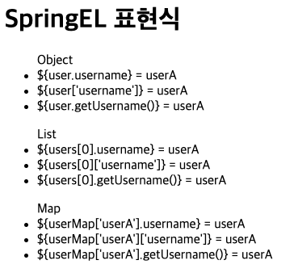
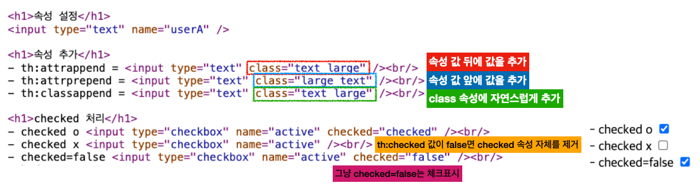
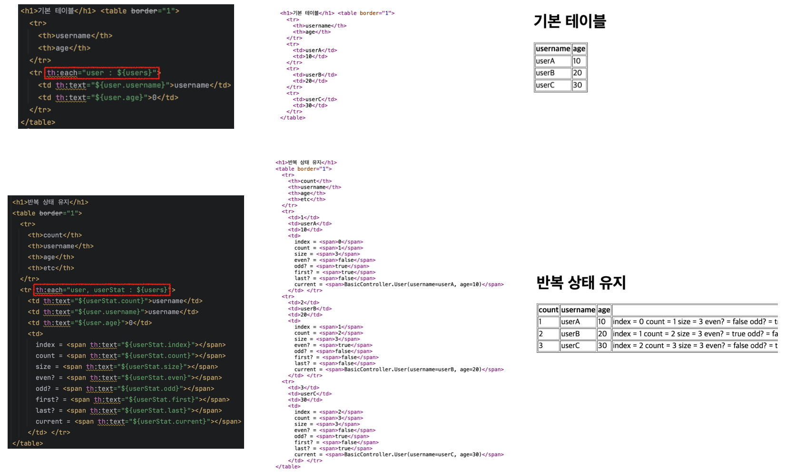
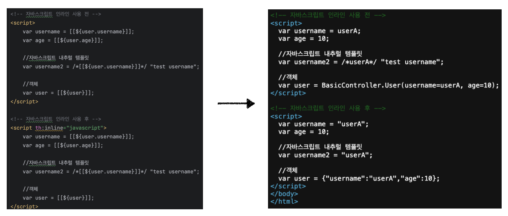
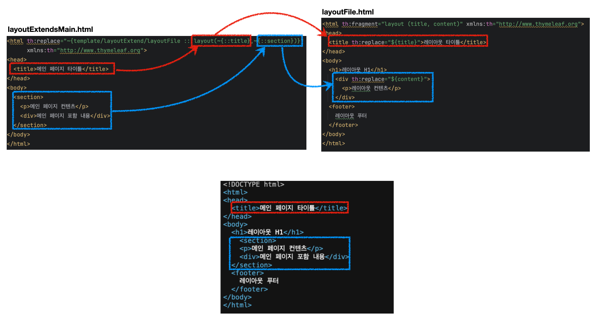
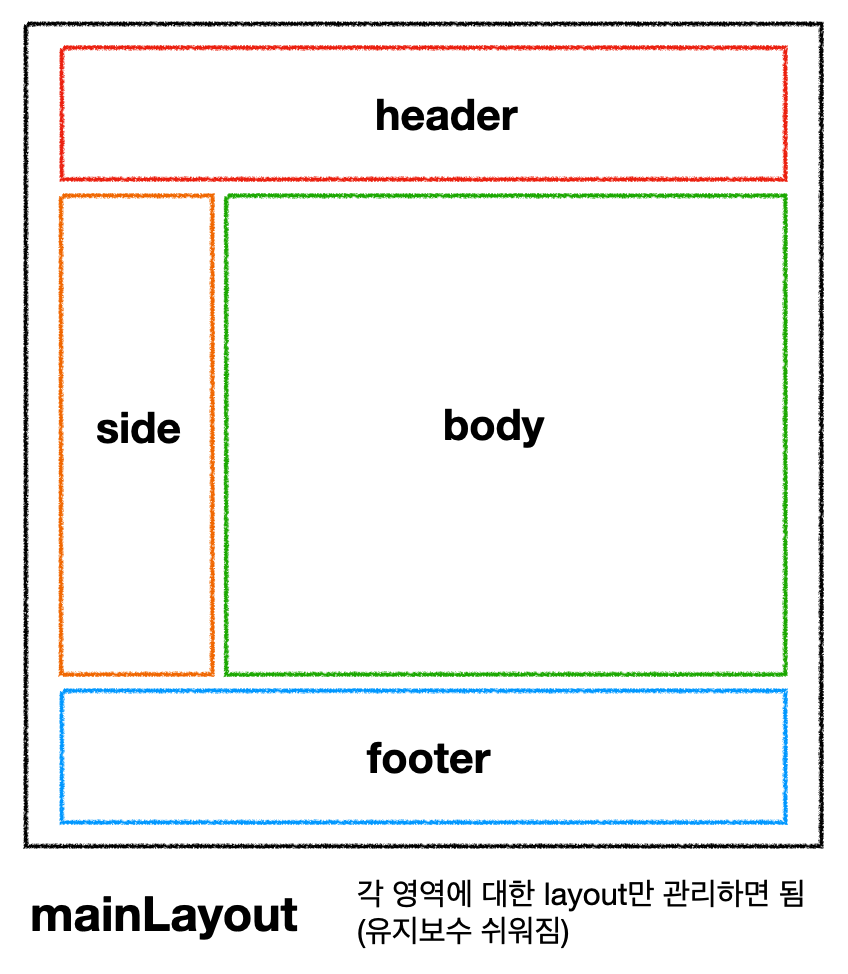

## Index

1. [타임리프(Thymeleaf) 소개](https://github.com/seungki1011/Data-Engineering/tree/main/spring/(004)%20Thymeleaf#1-%ED%83%80%EC%9E%84%EB%A6%AC%ED%94%84thymeleaf-%EC%86%8C%EA%B0%9C)
2. [타임리프의 기본 기능](https://github.com/seungki1011/Data-Engineering/tree/main/spring/(004)%20Thymeleaf#2-%ED%83%80%EC%9E%84%EB%A6%AC%ED%94%84%EC%9D%98-%EA%B8%B0%EB%B3%B8-%EA%B8%B0%EB%8A%A5)
   * [`th:href`, `th:onclick`](https://github.com/seungki1011/Data-Engineering/tree/main/spring/(004)%20Thymeleaf#20-thhref-thonclick)
   * [`text`, `utext`](https://github.com/seungki1011/Data-Engineering/tree/main/spring/(004)%20Thymeleaf#21-text-utext)
   * [SpringEL](https://github.com/seungki1011/Data-Engineering/tree/main/spring/(004)%20Thymeleaf#22-springel)
     * 변수 표현식 사용해보기
     * 타임리프 지역 변수
   * [기본 객체](https://github.com/seungki1011/Data-Engineering/tree/main/spring/(004)%20Thymeleaf#23-%EA%B8%B0%EB%B3%B8-%EA%B0%9D%EC%B2%B4)
   * [유틸리티 객체](https://github.com/seungki1011/Data-Engineering/tree/main/spring/(004)%20Thymeleaf#24-%EC%9C%A0%ED%8B%B8%EB%A6%AC%ED%8B%B0-%EA%B0%9D%EC%B2%B4)
   * [URL 링크](https://github.com/seungki1011/Data-Engineering/tree/main/spring/(004)%20Thymeleaf#25-url-%EB%A7%81%ED%81%AC-%EC%A4%91%EC%9A%94)
   * [리터럴 대체](https://github.com/seungki1011/Data-Engineering/tree/main/spring/(004)%20Thymeleaf#26-%EB%A6%AC%ED%84%B0%EB%9F%B4-%EB%8C%80%EC%B2%B4)
   * [연산](https://github.com/seungki1011/Data-Engineering/tree/main/spring/(004)%20Thymeleaf#27-%EC%97%B0%EC%82%B0)
   * [속성값 설정](https://github.com/seungki1011/Data-Engineering/tree/main/spring/(004)%20Thymeleaf#28-%EC%86%8D%EC%84%B1%EA%B0%92-%EC%84%A4%EC%A0%95)
   * [반복(Loop)](https://github.com/seungki1011/Data-Engineering/tree/main/spring/(004)%20Thymeleaf#29-%EB%B0%98%EB%B3%B5loop)
   * [조건부](https://github.com/seungki1011/Data-Engineering/tree/main/spring/(004)%20Thymeleaf#210-%EC%A1%B0%EA%B1%B4%EB%B6%80)
   * [주석](https://github.com/seungki1011/Data-Engineering/tree/main/spring/(004)%20Thymeleaf#211-%EC%A3%BC%EC%84%9D)
   * [`th:block`](https://github.com/seungki1011/Data-Engineering/tree/main/spring/(004)%20Thymeleaf#212-thblock)
   * [자바스크립트 인라인](https://github.com/seungki1011/Data-Engineering/tree/main/spring/(004)%20Thymeleaf#213-%EC%9E%90%EB%B0%94%EC%8A%A4%ED%81%AC%EB%A6%BD%ED%8A%B8-%EC%9D%B8%EB%9D%BC%EC%9D%B8)
   * [템플릿 조각, 레이아웃(template fragment, layout)](https://github.com/seungki1011/Data-Engineering/tree/main/spring/(004)%20Thymeleaf#2132-%EC%9E%90%EB%B0%94%EC%8A%A4%ED%81%AC%EB%A6%BD%ED%8A%B8-%EC%9D%B8%EB%9D%BC%EC%9D%B8-each)
     * 템플릿 조각
     * 레이아웃
     * 레이아웃을 `<html>` 전체로 확장
3. [타임리프 - 스프링](https://github.com/seungki1011/Data-Engineering/tree/main/spring/(004)%20Thymeleaf#3-%ED%83%80%EC%9E%84%EB%A6%AC%ED%94%84---%EC%8A%A4%ED%94%84%EB%A7%81)
   * [입력 Form 처리](https://github.com/seungki1011/Data-Engineering/tree/main/spring/(004)%20Thymeleaf#31-%EC%9E%85%EB%A0%A5-form-%EC%B2%98%EB%A6%AC)
   * [단일 체크박스](https://github.com/seungki1011/Data-Engineering/tree/main/spring/(004)%20Thymeleaf#32-%EB%8B%A8%EC%9D%BC-%EC%B2%B4%ED%81%AC%EB%B0%95%EC%8A%A4)
   * [멀티 체크박스](https://github.com/seungki1011/Data-Engineering/tree/main/spring/(004)%20Thymeleaf#33-%EB%A9%80%ED%8B%B0-%EC%B2%B4%ED%81%AC%EB%B0%95%EC%8A%A4)


---

## 1) 타임리프(Thymeleaf) 소개

타임리프 공식 문서 : [https://www.thymeleaf.org/documentation.html](https://www.thymeleaf.org/documentation.html)

타임리프의 특징은 다음과 같다.

* [SSR(server-side rendering)](https://github.com/seungki1011/Data-Engineering/tree/main/spring/(003)Spring%20MVC%20-%201#15-ssrserver-side-rendering-csrclient-side-rendering)
* 스프링 통합 지원
  * 타임리프는 스프링의 다양한 기능을 편리하게 사용할 수 있도록 지원한다

<br>

> Natural Templates
>
> HTML templates written in Thymeleaf still look and work like HTML, letting the actual templates that are run in your application keep working as useful design artifacts.
>
> 쉽게 말해서 타임리프는 순수 HTML을 최대한 유지하는 특징이 있다. 타임리프로 작성한 파일은 HTML을 유지하기 때문에 웹 브라우저에서 파일을 직접 열어도 내용을 확인할 수 있고, 서버를 통해 뷰 템플릿을 거치면 동적으로 변경된 결과를 확인할 수 있다.

<br>

---

## 2) 타임리프의 기본 기능

타임리프의 기본 기능들을 살펴보자.

<br>

### 2.0 `th:href`, `th:onclick`

#### 2.0.1 `th:href`

```html
<link href="../css/bootstrap.min.css" th:href="@{/css/bootstrap.min.css}" rel="stylesheet">
```

* `th:href="@{/css/bootstrap.min.css}"`
  * `href="value1"` 을 `th:href="value2"` 의 값으로 변경한다
  * 타임리프 뷰 템플릿을 거치게 되면 원래 값을 `th:xxx` 값으로 변경한다. 만약 값이 없다면 새로 생성한다.
  * HTML을 그대로 볼 때는 `href` 속성이 사용되고, 뷰 템플릿을 거치면 `th:href`의 값이 `href`로 대체되면서 동적으로 변경할 수 있다
  * 대부분의 HTML 속성을 `th:xxx` 로 변경할 수 있다


* **URL 링크 표현식** :  `th:href="@{/css/bootstrap.min.css}"`
  * `@{...}` : 타임리프는 URL 링크를 사용하는 경우 `@{...}` 를 사용한다. 이것을 URL 링크 표현식이라 한다.
  * URL 링크 표현식을 사용하면 서블릿 컨텍스트를 자동으로 포함한다

<br>

---

#### 2.0.2 `th:onclick`

누르면 해당 URL로 이동하도록 처리하는 것에 타임리프를 적용하면 다음과 같다

* `onclick="location.href='addForm.html'"` → `th:onclick="|location.href='@{/basic/items/add}'|"`

<br>

---

### 2.1 `text`, `utext`

#### 2.1.1 `text`

텍스트를 출력하는 기능을 알아보자.

타임리프는 기본적으로 HTML 태그의 속성에 기능을 정의해서 동작한다.

* 예시) `<span th:text="${data}">` : HTML 컨텐츠에 데이터를 출력할 때 `th:text`를 이용하면 됨

<br>

태그 속성이 아니라, HTML 컨텐츠 영역안에서 직접 데이터를 출력하고 싶으면 다음과 같이 사용하면 된다.

* `[[${data}]]`

<br>

코드로 직접 사용해보자. `BasicController`를 생성해보자.

```java
@Controller
@RequestMapping("/basic")
public class BasicController {

    @GetMapping("text-basic")
    public String textBasic(Model model) {
        model.addAttribute("data", "Hello Spring!");
        return "basic/text-basic";
    }
}
```

<br>

`text-basic.html`

```html
<!DOCTYPE html>
<html xmlns:th="http://www.thymeleaf.org">
<head>
    <meta charset="UTF-8">
    <title>Title</title>
</head>
<body>

<h1>컨텐츠에 데이터 출력하기</h1>
<ul>
  <li>th:text 사용<span th:text="${data}"></span></li>
  <li>컨텐츠안에 직접 출력하기 = [[${data}]]</li>
</ul>

</body>
</html>
```

* `<html xmlns:th="http://www.thymeleaf.org">` : 타임리프 사용을 위해 필요
* `<span th:text="${data}"></span>` : Hello Spring! 출력
* `[[${data}]]` : `Hello Spring!` 출력

<br>

---

#### 2.1.2 `utext`

웹 브라우저는 `<`를 HTML 태그의 시작으로 인식한다. 따라서 `<`를 태그의 시작이 아니라 문자로 표현할 수 있는 방법이 필요한데, 이것을 HTML 엔티티라 한다. 그리고 이렇게 HTML에서 사용하는 특수 문자를 HTML 엔티티로 변경하는 것을 이스케이프(escape)라고 한다. 

타임리프가 제공하는 `th:text` , `[[...]]` 는 **기본적으로 이스케이프를 제공**한다.

이스케이프를 사용하지 않기 위해서는 `th:utext` 또는 `[(...)]` 처럼 사용하면 된다.

`data`가 `Hello Spring!` 이 아니라  `Hello <b>Spring!</b>`이라고 해보자. 

```java
    @GetMapping("text-basic")
    public String textBasic(Model model) {
        model.addAttribute("data", "<b>Hello Spring!</b>");
        return "basic/text-basic";
    }
```

<br>

```html
<ul>
  <li>th:text 사용<span th:utext="${data}"></span></li>
  <li>컨텐츠안에 직접 출력하기 = [(${data})]</li>
</ul>
```


<p align="center">    </p>

<p align='center'>이스케이프 기능 사용하지 않기</p>

* 문제 발생을 방지하기 위해서 기본적으로 이스케이프 처리를 하는 것이 좋다
* 필요할 때만 unescape 사용

<br>

---

### 2.2 SpringEL

#### 2.2.1 변수 표현식 사용해보기

타임리프에서 변수를 사용할 때 변수 표현식을 사용한다.

* 예) `${data}`

<br>

이 변수 표현식에는 스프링 EL이라는 스프링이 제공하는 표현식을 사용할 수 있다.

코드로 살펴보자. 먼저 컨트롤러를 추가해보자.

```java
    @GetMapping("/variable")
    public String variable(Model model) {
        User userA = new User("userA", 20);
        User userB = new User("userB", 30);

        List<User> list = new ArrayList<>();
        list.add(userA);
        list.add(userB);

        Map<String, User> map = new HashMap<>();
        map.put("userA", userA);
        map.put("userB", userB);

        model.addAttribute("user", userA);
        model.addAttribute("users", list);
        model.addAttribute("userMap", map);

        return "basic/variable";
    }

    @Data
    static class User {
        private String username;
        private int age;

        public User(String username, int age) {
            this.username = username;
            this.age = age;
        }
    }
```

<br>

```html
<h1>SpringEL 표현식</h1>

<ul>Object
  <li>${user.username} = <span th:text="${user.username}"></span></li>
  <li>${user['username']} = <span th:text="${user['username']}"></span></li>
  <li>${user.getUsername()} = <span th:text="${user.getUsername()}"></span></li>
</ul>

<ul>List
  <li>${users[0].username}    = <span th:text="${users[0].username}"></span></li>
  <li>${users[0]['username']} = <span th:text="${users[0]['username']}"></span></li>
  <li>${users[0].getUsername()} = <span th:text="${users[0].getUsername()}"></span></li>
</ul>

<ul>Map
  <li>${userMap['userA'].username} =  <span th:text="${userMap['userA'].username}"></span></li>
  <li>${userMap['userA']['username']} = <span th:text="${userMap['userA']['username']}"></span></li>
  <li>${userMap['userA'].getUsername()} = <span th:text="${userMap['userA'].getUsername()}"></span></li>
</ul>
```

* `user.username` : `user`의 `username`을 프로퍼티 접근 → `user.getUsername()`
* `user['username']` : `user.username`와 같음 → `user.getUsername()`

<br>

<p align="center">    </p>

<p align='center'>Spring EL 결과</p>

<br>

---

#### 2.2.2 타임리프 지역변수

타임리프 안에서도 `th:with`를 통해서 지역 변수 선언이 가능하다. 지역 변수는 선언한 태그 안에서만 사용할 수 있다.

```html 
<h1>지역 변수 - (th:with)</h1>
<div th:with="first=${users[0]}">
	<p>처음 사람의 이름은 <span th:text="${first.username}"></span></p>
</div>
```

<br>

---

### 2.3 기본 객체

타임리프의 기본 객체들에 대해서 알아보자. 타임리프는 다음과 같은 기본 객체들을 제공한다.

* `${#request}`
* `${#response}`
* `${#session}`
* `${#servletContext}`
* `${#locale}`

<br>

코드로 알아보자.

```java
    @GetMapping("/basic-objects")
    public String basicObjects(Model model, HttpServletRequest request, HttpServletResponse response, HttpSession session) {
        session.setAttribute("sessionData", "Hello Session");
        model.addAttribute("request", request);
        model.addAttribute("response", response);
        model.addAttribute("servletContext", request.getServletContext());
        return "basic/basic-objects";
    }

    @Component("helloBean")
    static class HelloBean {
        public String hello(String data) {
            return "Hello" + data;
        }
    }
```

* 스프링 부트 3.0 부터는 `${#request}` , `${#response}` , `${#session}` , `${#servletContext}` 를 지원하지 않는다
* 스프링 부트 3.0 부터는 직접 `model` 에 해당 객체를 추가해서 사용해야 한다

<br>

```html
<h1>식 기본 객체 (Expression Basic Objects)</h1> <ul>
  <li>request = <span th:text="${request}"></span></li>
  <li>response = <span th:text="${response}"></span></li>
  <li>session = <span th:text="${session}"></span></li>
  <li>servletContext = <span th:text="${servletContext}"></span></li>
  <li>locale = <span th:text="${#locale}"></span></li>
</ul>

<h1>편의 객체</h1> <ul>
  <li>Request Parameter = <span th:text="${param.paramData}"></span></li>
  <li>session = <span th:text="${session.sessionData}"></span></li>
  <li>spring bean = <span th:text="${@helloBean.hello('Spring!')}"></span></li> </ul>
```

* 편리하게 요청 파라미터, 빈, 세션 등에 접근할 수 있게 편의 객체를 지원한다
* `${param.paramData}` : 요청 파라미터 접근
* `${session.sessionData}` : 세션 접근
* `${@helloBean.hello('Spring!')}` : 스프링 빈 접근, `helloBean`이라는 빈을 접근해서 `hello('Spring!')` 호출

<br>

<p align="center">    </p>

<p align='center'>타임리프 기본 객체, 편의 객체</p>

<br>

---

### 2.4 유틸리티 객체

타임리프는 문자, 숫자, 날짜, URI 등을 편리하게 다룰수 있게 해주는 유틸리티 객체들을 제공한다.

[https://www.thymeleaf.org/doc/tutorials/3.0/usingthymeleaf.html#expression-utility-objects](https://www.thymeleaf.org/doc/tutorials/3.0/usingthymeleaf.html#expression-utility-objects)

객체 예시 : [https://www.thymeleaf.org/doc/tutorials/3.0/usingthymeleaf.html#appendix-b-expression-utility-objects](https://www.thymeleaf.org/doc/tutorials/3.0/usingthymeleaf.html#appendix-b-expression-utility-objects)

* `#message` : 메세지, 국제화 처리
* `#uris` : URI 이스케이프 지원
* `#dates` : `java.util.date` 서식 지원
* `#calendars` : `java.util.Calendar` 서식 지원
* `#temporals` : Java8 날짜 서식 지원
* `#numbers` : 숫자 서식 지원
* `#strings` : 문자 관련 기능
* `#objects` : 객체 관령 기능
* `#bools` : 불린(boolean) 관련 기능
* `#arrays` : 배열 관련 기능
* `#lists`, `#sets`, `#maps` : 컬렉션 관련 기능 
* `#ids` : 아이디 처리 관련 기능

<br>

---

### 2.5 URL 링크 (중요)

타임리프에서 URL 링크를 사용하는 방법에 대해서 알아보자.

타임리프에서는 URL을 생성할 때 `@{...}` 처럼 사용하면 된다. 코드로 알아보자.

<br>

```java
    @GetMapping("/link")
    public String link(Model model) {
        model.addAttribute("param1", "data1");
        model.addAttribute("param2", "data2");
        return "basic/link";
    }
```

<br>

```html
<h1>URL 링크</h1> 
<ul>
    <li><a th:href="@{/hello}">basic url</a></li>
    <li><a th:href="@{/hello(param1=${param1}, param2=${param2})}">hello query param</a></li>
    <li><a th:href="@{/hello/{param1}/{param2}(param1=${param1}, param2=${param2})}">path variable</a></li>
    <li><a th:href="@{/hello/{param1}(param1=${param1}, param2=${param2})}">path variable + query parameter</a></li>
</ul>
```

* **단순한 URL**
  * `@{/hello}` → `/hello`


* **쿼리 파라미터(query parameter)**
  * `@{/hello(param1=${param1}, param2=${param2})}` → `/hello?param1=data1&param2=data2``
  * ``()`에 있는 부분은 쿼리 파라미터로 처리된다


* **경로 변수(path variable)**
  * `@{/hello/{param1}/{param2}(param1=${param1}, param2=${param2})}` → `/hello/data1/data2`
  * URL 경로상에 변수가 있으면 `()` 부분은 경로 변수로 처리된다


* **경로 변수 + 쿼리 파라미터**
  * `@{/hello/{param1}(param1=${param1}, param2=${param2})}` → `/hello/data1?param2=data2`
  * 경로 변수와 쿼리 파라미터를 함께 사용할 수 있다


* **상대 경로, 절대 경로, 프로토콜 기준 표현도 가능**
  * `/hello` : 절대 경로
  * `hello` : 상대 경로

<br>

---

### 2.6 리터럴 대체

> 들어가기에 앞서 타임리프의 리터럴 대체에 대해서 알아보자.
>
> 다음과 같이 사용하면 `<span th:text="|hello ${data}|">` 작은 따옴표의 사용없이 편하게 사용할 수 있다.
>
> * 예) `<li>리터럴 대체 |hello ${data}| = <span th:text="|hello ${data}|"></span></li>`
> * `<span th:text="|hello ${data}|">` → `hello Spring!`

<br>

---

### 2.7 연산

타임리프 안에서의 연산에 대해서 알아보자. 타임리프에서의 산술, 비교, 삼항식 연산은 자바와 비슷하다.

타임리프의 Elvis 연산자와 No-operation에 대해서 알아보자.

<br>

```java
    @GetMapping("/operation")
    public String operation(Model model) {
        model.addAttribute("nullData", null);
        model.addAttribute("data", "Spring!");
        return "basic/operation";
    }
```

<br>

```html
<li>Elvis 연산자 
   <ul>
    <li>${data}?: '데이터가 없습니다.' = <span th:text="${data}?: '데이터가 없습니다.'"></span></li>
    <li>${nullData}?: '데이터가 없습니다.' = <span th:text="${nullData}?: '데이터가 없습니다.'"></span></li>
  </ul> 
 </li>
    
 <li>No-Operation
   <ul>
     <li>${data}?: _ = <span th:text="${data}?: _">데이터가 없습니다.</span></li>
     <li>${nullData}?: _ = <span th:text="${nullData}?: _">데이터가 없습니다.</span></li>
   </ul> 
 </li>
```

* Elvis 연산자 : 자바의 삼항 연산자의 편의 버전
  * `{data}?: '데이터가 없습니다.'` 
    * `data`가 `null`이면 `데이터가 없습니다.` 선택
    * `null` 아니면 `data`선택


* No-operation :  `_` 인 경우 마치 타임리프가 실행되지 않는 것 처럼 동작한다. 이것을 잘 사용하면 HTML의 내용 그대로 활용할 수 있다. 마지막 예를 보면 `데이터가 없습니다.` 부분이 그대로 출력된다.
  * `nullData` → `_` 선택 → `데이터가 없습니다. `출력

<br>

<p align="center">    </p>

<p align='center'>Elvis, No-operation</p>

<br>

---

### 2.8 속성값 설정

타임리프는 주로 HTML 태그에 `th:*` 속성을 지정하는 방식으로 동작한다. `th:*`로 속성을 적용하면 기존 속성을 대체한다. 기존 속성이 없으면 새로 만든다.

쉽게 말하자면 `th:*` 속성을 지정하면 타임리프는 기존 속성을 `th:*` 로 지정한 속성으로 대체한다. 기존 속성이 없다면 새로 만든다.

* 예) `<input type="text" name="mock" th:name="userA" />` → 타임리프 렌더링 후 :  `<input type="text" name="userA" />`

<br>

코드로 살펴보자.

```java
    @GetMapping("/attribute")
    public String attribute() {
        return "basic/attribute";
    }
```

<br>

```html
<h1>속성 설정</h1>
<input type="text" name="mock" th:name="userA" />

<h1>속성 추가</h1>
- th:attrappend = <input type="text" class="text" th:attrappend="class=' large'" /><br/>
- th:attrprepend = <input type="text" class="text" th:attrprepend="class='large '" /><br/>
- th:classappend = <input type="text" class="text" th:classappend="large" /><br/>

<h1>checked 처리</h1>
- checked o <input type="checkbox" name="active" th:checked="true" /><br/>
- checked x <input type="checkbox" name="active" th:checked="false" /><br/> 
- checked=false <input type="checkbox" name="active" checked="false" /><br/>
```

* `th:attrappend` : 속성 값의 뒤에 값을 추가한다
* `th:attrprepend` : 속성 값의 앞에 값을 추가한다
* `th:classappend` : class 속성에 자연스럽게 추가한다


* `checked` 처리
  * HTML에서는 `<input type="checkbox" name="active" checked="false" />`의 경우에도, `checked` 속성이 있기 때문에 체크박스에 `checked` 처리가 되어버린다
  * HTML에서 `checked` 속성은 `checked` 속성의 값과 상관없이 `checked` 라는 속성만 있어도 체크가 된다. 이런 부분이 `true` , `false` 값을 주로 사용하는 개발자 입장에서는 불편하다
  * 타임리프의 `th:checked` 는 값이 `false` 인 경우 `checked` 속성 자체를 제거한다
  * `<input type="checkbox" name="active" th:checked="false" />` → 타임리프 렌더링 후 : `<input type="checkbox" name="active" />`

<br>

<p align="center">    </p>

<p align='center'>Attribute 값 설정</p>

<br>

---

### 2.9 반복(loop)

타임리프에서의 반복에 대해서 알아보자.

타임리프에서 반복은 `th:each`를 사용하면 된다. 반복에서 사용할 수 있는 여러 상태값도 지원한다. 코드로 알아보자.

<br>

```java
 @GetMapping("/each")
 public String each(Model model) {
     addUsers(model);
     return "basic/each";
 }

 private void addUsers(Model model) {
     List<User> list = new ArrayList<>();
     list.add(new User("userA", 10));
     list.add(new User("userB", 20));
     list.add(new User("userC", 30));
     model.addAttribute("users", list);
 }
```

<br>

```html
<h1>기본 테이블</h1> <table border="1">
  <tr>
    <th>username</th>
    <th>age</th>
  </tr>
  <tr th:each="user : ${users}">
    <td th:text="${user.username}">username</td>
    <td th:text="${user.age}">0</td>
  </tr>
</table>
<h1>반복 상태 유지</h1>
<table border="1">
  <tr>
    <th>count</th>
    <th>username</th>
    <th>age</th>
    <th>etc</th>
  </tr>
  <tr th:each="user, userStat : ${users}">
    <td th:text="${userStat.count}">username</td>
    <td th:text="${user.username}">username</td>
    <td th:text="${user.age}">0</td>
    <td>
      index = <span th:text="${userStat.index}"></span>
      count = <span th:text="${userStat.count}"></span>
      size = <span th:text="${userStat.size}"></span>
      even? = <span th:text="${userStat.even}"></span>
      odd? = <span th:text="${userStat.odd}"></span>
      first? = <span th:text="${userStat.first}"></span>
      last? = <span th:text="${userStat.last}"></span>
      current = <span th:text="${userStat.current}"></span>
    </td> </tr>
</table>
```

* `<tr th:each="user : ${users}">`
  * 반복시 오른쪽 컬렉션( `${users}` )의 값을 하나씩 꺼내서 왼쪽 변수( `user` )에 담아서 태그를 반복 실행한다
  * `th:each` 는 `List` 뿐만 아니라 배열, `java.util.Iterable` , `java.util.Enumeration` 을 구현한 모든 객체를 반복에 사용할 수 있다
  * `Map` 도 사용할 수 있는데 이 경우 변수에 담기는 값은 `Map.Entry` 이다


* 반복 상태 : `<tr th:each="user, userStat : ${users}">`
  * 반복의 두번째 파라미터를 설정해서 반복의 상태를 확인 할 수 있다
  * 두번째 파라미터는 생략이 가능한데, 생략하면 지정한 변수명( `user` ) + `Stat` 를 사용하면 된다

<br>

<p align="center">    </p>

<p align='center'>반복</p>

<br>

---

### 2.10 조건부

바로 코드로 알아보자.

```java
 @GetMapping("/condition")
 public String condition(Model model) {
     addUsers(model);
     return "basic/condition";
 }
```

<br>

```html
<h1>if, unless</h1>
<table border="1">
  <tr>
    <th>count</th>
    <th>username</th>
    <th>age</th>
  </tr>
  <tr th:each="user, userStat : ${users}">
    <td th:text="${userStat.count}">1</td>
    <td th:text="${user.username}">username</td>
    <td>
      <span th:text="${user.age}">0</span>
      <span th:text="'미성년자'" th:if="${user.age lt 20}"></span>
      <span th:text="'미성년자'" th:unless="${user.age ge 20}"></span>
    </td>
  </tr>
</table>
<h1>switch</h1>
<table border="1">
  <tr>
    <th>count</th>
    <th>username</th>
    <th>age</th>
  </tr>
  <tr th:each="user, userStat : ${users}">
    <td th:text="${userStat.count}">1</td>
    <td th:text="${user.username}">username</td>
    <td th:switch="${user.age}">
      <span th:case="10">10살</span>
      <span th:case="20">20살</span>
      <span th:case="*">기타</span>
    </td>
  </tr>
</table>
```

* `if`, `unless`
  * 타임리프는 해당 조건이 맞지 않으면 태그 자체를 렌더링하지 않는다
  * 조건이 `false` 인 경우 `<span>...<span>` 부분 자체가 렌더링 되지 않고 사라진다
  * `<span th:text="'미성년자'" th:if="${user.age lt 20}"></span>` → `userA`는 10살이기 때문에 만족, `unless`도 만족


* `switch`
  * `*`는 만족하는 조건이 없을 때 사용하는 디폴트이다

<br>

<p align="center">    </p>

<br>

---

### 2.11 주석

**주석 사용**

```html
<h1>1. 표준 HTML 주석</h1>
<!--
<span th:text="${data}">html data</span> 
-->

<h1>2. 타임리프 파서 주석(Thymeleaf parser-level comment)</h1> 
<!--/* [[${data}]] */-->

<!--/*-->
<span th:text="${data}">html data</span>
<!--*/-->

<h1>3. 타임리프 프로토타입 주석</h1>
<!--/*/
<span th:text="${data}">html data</span> 
/*/-->
```

<br>

**결과**

```html
<h1>예시</h1> 
<span>Spring!</span>

<h1>1. 표준 HTML 주석</h1>
<!--
<span th:text="${data}">html data</span>
-->

<h1>2. 타임리프 파서 주석</h1>

<h1>3. 타임리프 프로토타입 주석</h1>
<span>Spring!</span>
```

* 표준 HTML 주석 :
  * 자바스크립트의 표준 HTML 주석은 타임리프가 렌더링 하지 않고, 그대로 남겨둔다


* 타임리프 파서 주석(parser-level comment) : 
  * 타임리프 파서 주석은 타임리프의 진짜 주석이다
  * 렌더링에서 주석 부분을 제거한다


* 타임리프 프로토타입 주석
  * HTML 주석에 약간의 구문을 더했다
  * HTML 파일을 웹 브라우저에서 그대로 열어보면 HTML 주석이기 때문에 이 부분을 웹 브라우저는 렌더링하지 않는다
  * 타임리프 렌더링을 거치면 이 부분이 정상 렌더링 된다 → HTML 파일을 그대로 열어보면 주석처리가 되지만, 타임리프를 렌더링 한 경우에 보인다

<br>

---

### 2.12 `th:block`

타임리프 블록에 대해서 알아보자.

`<th:block>`는 타임리프의 유일한 자체 태그이다.

<br>

<p align="center">    </p>

<p align='center'>th:block</p>

* 대충 봐도 사용법을 알 수 있다

<br>

---

### 2.13 자바스크립트 인라인

타임리프에서 자바스크립트를 이용할 수 있는 자바스크립트 인라인 기능을 살펴보자.

<br>

#### 2.13.1 `<script th:inline="javascript">`

다음과 같이 사용하면 된다. `<script th:inline="javascript">`. 코드로 알아보자.

<br>

```java
    @GetMapping("/javascript")
    public String javascript(Model model) {
        model.addAttribute("user", new User("userA", 10));
        addUsers(model);

        return "basic/javascript";
    }
```

<br>

```html
<!-- 자바스크립트 인라인 사용 전 -->
<script>
  var username = [[${user.username}]];
  var age = [[${user.age}]];

  //자바스크립트 내추럴 템플릿
  var username2 = /*[[${user.username}]]*/ "test username";

  //객체
  var user = [[${user}]];
</script>

<!-- 자바스크립트 인라인 사용 후 -->
<script th:inline="javascript">
  var username = [[${user.username}]];
  var age = [[${user.age}]];

  //자바스크립트 내추럴 템플릿
  var username2 = /*[[${user.username}]]*/ "test username";

  //객체
  var user = [[${user}]];
</script>
```

* `var username = [[${user.username}]];`
  * 인라인 사용 전 : `var username = userA;`
  * 인라인 사용 후 : `var username = "userA";`


* 인라인 사용 전 렌더링 결과를 보면 `userA` 라는 변수 이름이 그대로 남아있다. 타임리프 입장에서는 정확하게 렌더링 한 것이지만, 개발자가 기대한 것은 다음과 같은 `"userA"`라는 문자일 것이다. 결과적으로 `userA`가 변수명으로 사용되어서 자바스크립트 오류가 발생한다


* 인라인사용후렌더링결과를보면문자타입인경우 `"` 를포함해준다.추가로자바스크립트에서문제가될수있 는 문자가 포함되어 있으면 이스케이프 처리도 해준다
  * 예) `"` → `/"`


* `var username2 = /*[[${user.username}]]*/ "test username";`
  * 인라인 사용 전 : `var username2 = /*userA*/ "test username";`
  * 인라인 사용 후 : `var username2 = "userA";`
    * 인라인 사용 후 결과를 보면 주석 부분이 제거되고, 기대한 `"userA"`가 정확하게 적용된다

<br>

<p align="center">    </p>

<p align='center'>Javascript inline</p>

* 객체
  * 타임리프의 자바스크립트 인라인 기능을 사용하면 객체를 JSON으로 자동으로 변환해준다


* `var user = [[${user}]];`
  * 인라인 사용 전 : `var user = BasicController.User(username=userA, age=10);`
  * 인라인 사용 후 : `var user = {"username":"userA","age":10};` 
    * 객체를 JSON으로 변환해준것을 확인할 수 있다

<br>

---

#### 2.13.2 자바스크립트 인라인 `each`

자바스크립트 인라인에서 지원하는 `each`를 사용해보자.

```html
<!-- 자바스크립트 인라인 each --> '
<script th:inline="javascript">
     [# th:each="user, stat : ${users}"]
     var user[[${stat.count}]] = [[${user}]];
     [/]
</script>
```

<br>

**결과**

```html
 <script>
 var user1 = {"username":"userA","age":10};
 var user2 = {"username":"userB","age":20};
 var user3 = {"username":"userC","age":30};
</script>
```

<br>

---

### 2.14 템플릿 조각, 레이아웃 (template fragment, layout)

웹 페이지를 개발할 때는 공통 영역이 많이 존재한다. 예를 들어서 상단 영역이나 하단 영역, 좌측 카테고리 등 여러 페이지에서 함께 사용하는 영역들이 있다. 이런 부분의 코드를 반복적으로 복사해서 사용할 때, 변경이 필요한 경우 여러 페이지를 다 수정해야 하므로 상당히 비효율적이다.

이런 문제를 해결하기 위해서 타임리프는 템플릿 조각과 레이웃 기능을 지원한다.

<br>

#### 2.14.1 템플릿 조각(template fragment)

코드를 통해 알아보자.

`TemplateController`

```java
@Controller
@RequestMapping("/template")
public class TemplateController {
    @GetMapping("/fragment")
    public String template() {
        return "template/fragment/fragmentMain";
    }
}
```

<br>

```templates/template/fragment/footer.html```

```html
<html xmlns:th="http://www.thymeleaf.org">
<body>

<footer th:fragment="copy"> footer 자리 입니다.
</footer>

<footer th:fragment="copyParam (param1, param2)">
    <p>parameter 자리 입니다.</p>
    <p th:text="${param1}"></p>
    <p th:text="${param2}"></p>
</footer>
</body>
</html>
```

* `footer`는 다른 타임리프에서 불러서 사용할 템플릿 조각을 포함한다

<br>

`templates/template/fragment/fragmentMain.html`

```html
<html xmlns:th="http://www.thymeleaf.org">
<head>
  <meta charset="UTF-8">
  <title>Title</title>
</head>
<body>

<h1>부분 포함</h1>
<h2>부분 포함 insert</h2>
<!-- footer의 copy를 불러옴-->
<div th:insert="~{template/fragment/footer :: copy}"></div>

<h2>부분 포함 replace</h2>
<div th:replace="~{template/fragment/footer :: copy}"></div>

<h2>부분 포함 단순 표현식</h2>
<div th:replace="template/fragment/footer :: copy"></div>

<h1>파라미터 사용</h1>
<!-- footer의 copyParam을 불러옴-->
<div th:replace="~{template/fragment/footer :: copyParam ('데이터1', '데이터2')}"></div> 

</body>
</html>
```

* `template/fragment/footer :: copy` : `footer`템플릿에 있는 `th:fragment="copy"`라는 부분을 템플릿 조각으로 가져와서 사용한다는 의미이다
* `th:insert`는 내부에 삽입 (`div` 태그를 내부에 추가)
* `th:replace`는 대체 (`div` 태그를 대체 해버림)
* `~{...}` 를 사용하는 것이 원칙이지만 템플릿 조각을 사용하는 코드가 단순하면 이 부분을 생략 가능


* `<div th:replace="~{template/fragment/footer :: copyParam ('데이터1', '데이터2')}"></ div>` 처럼 파라미터를 전달해서 조각을 동적으로 렌더링할 수 있다

<br>

<p align="center">    </p>

<p align='center'>Template Fragment</p>

<br>

---

#### 2.14.2 레이아웃(layout)

이전에는 일부 코드 조각을 가져와서 사용했다면, 이번에는 코드 조각을 레이아웃에 넘겨서 사용하는 방법에 대해서 알아보자.

예를 들어서 `<head>` 에 공통으로 사용하는 `css` , `javascript` 같은 정보들이 있는데, 이러한 공통 정보들을 한 곳에 모아둔 다음에, 각 페이지마다 필요한 정보를 더 추가해서 사용하고 싶다면 다음과 같이 사용하면 된다.

<br>

```java
 @GetMapping("/layout")
 public String layout() {
     return "template/layout/layoutMain";
 }
```

<br>

`/templates/template/layout/base.html`

```html
<html xmlns:th="http://www.thymeleaf.org">
<head th:fragment="common_header(title,links)">

    <title th:replace="${title}">레이아웃 타이틀</title>

    <!-- 공통 -->
    <link rel="stylesheet" type="text/css" media="all" th:href="@{/css/awesomeapp.css}">
    <link rel="shortcut icon" th:href="@{/images/favicon.ico}">
    <script type="text/javascript" th:src="@{/sh/scripts/codebase.js}"></script>

    <!-- 추가 -->
    <th:block th:replace="${links}" />
</head>
```

<br>

`/templates/template/layout/layoutMain.html`

```html
<!DOCTYPE html>
<html xmlns:th="http://www.thymeleaf.org">
<head th:replace="template/layout/base :: common_header(~{::title},~{::link})">
    <title>메인 타이틀</title>
    <link rel="stylesheet" th:href="@{/css/bootstrap.min.css}">
    <link rel="stylesheet" th:href="@{/themes/smoothness/jquery-ui.css}">
</head>
<body> 메인 컨텐츠 </body>
</html>
```

* `common_header(~{::title},~{::link})`
  * `::title` 은 현재 페이지의 title 태그들을 전달한다 → 메인 타이틀이 전달한 부분으로 교체됨
  * `::link` 는 현재 페이지의 link 태그들을 전달한다 → 공통 부분은 그대로 유지되고, 추가 부분에 전달한 `<link>`들이 포함된 것을 확인 가능

<br>

---

#### 2.14.2 레이아웃을  `<html>` 전체로 확장

이번에는 `<head>`에만 적용하는 것이 아니라 `<html>` 전체에 적용해보자.

```java
 @GetMapping("/layoutExtend")
 public String layoutExtends() {
     return "template/layoutExtend/layoutExtendMain";
 }
```

<br>

`/templates/template/layoutExtend/layoutFile.html`

```html
<!DOCTYPE html>
<html th:fragment="layout (title, content)" xmlns:th="http://www.thymeleaf.org">
<head>
  <title th:replace="${title}">레이아웃 타이틀</title>
</head>
<body>
  <h1>레이아웃 H1</h1>
    <div th:replace="${content}">
      <p>레이아웃 컨텐츠</p>
    </div>
  <footer>
    레이아웃 푸터
  </footer>
</body>
</html>
```

<br>

`/templates/template/layoutExtend/layoutExtendMain.html`

```html
<!DOCTYPE html>
<html th:replace="~{template/layoutExtend/layoutFile :: layout(~{::title},~{::section})}"
      xmlns:th="http://www.thymeleaf.org">
<head>
  <title>메인 페이지 타이틀</title>
</head>
<body>
  <section>
    <p>메인 페이지 컨텐츠</p>
    <div>메인 페이지 포함 내용</div>
  </section>
</body>
</html>
```

<br>

<p align="center">    </p>

<p align='center'>Layout</p>

<br>

<p align="center">    </p>

<p align='center'>Layout</p>

<br>

---

## 3) 타임리프 - 스프링

타임리프는 스프링 없이도 동작하지만, 스프링과 통합을 위한 다양한 기능을 편리하게 제공한다.

타임리프 스프링 통합 메뉴얼 : [https://www.thymeleaf.org/doc/tutorials/3.0/thymeleafspring.html](https://www.thymeleaf.org/doc/tutorials/3.0/thymeleafspring.html)

다음은 스프링 통합으로 추가되는 기능들이다.

* 스프링 EL 문법 통합
* `${@myBean.doSomething()}` 처럼 스프링 빈 호출 지원
* 편리한 폼 관리를 위한 추가 속성
* 펌 컴포넌트 기능
  * 체크박스, 라디오 버튼, 리스트 등을 편리하게 사용할 수 있는 기능 지원
* 스프링의 메세지, 국제화 기능의 편리한 통합
* 스프링의 검증, 오류 처리 통합
* 스프링의 ConversionService 통합

<br>

`build.gradle`에 다음한 줄을 추가하면 Gradle은 타임리프와 관련 된 라이브러리를 다운로드 받고, 스프링 부트는 타임리프와 관련된 설정용 스프링 빈을 자동으로 등록해준다.

```groovy
implementation 'org.springframework.boot:spring-boot-starter-thymeleaf'
```

* 스프링 부트가 제공하는 타임리프 설정 : [https://docs.spring.io/spring-boot/docs/current/reference/html/appendix-application-properties.html#common-application-properties-templating](https://docs.spring.io/spring-boot/docs/current/reference/html/appendix-application-properties.html#common-application-properties-templating)

<br>

---

### 3.1 입력 Form 처리

타임리프가 제공하는 입력 폼 기능을 적용해서 폼 기능을 적용하지 않은 폼 코드를 개선해보자.

사용할 기능에 대한 설명부터 보자.

* `th:object` : 사용할 객체를 지정한다


* `*{...}` : 선택 변수 식
  *  `th:object`에서 선택한 객체에 접근한다


* `th:field`
  * HTML 태그의 `id` , `name` , `value` 속성을 자동으로 처리해준다

<br>

```java
    @GetMapping("/add")
    public String addForm(Model model) {
        model.addAttribute("item", new Item());
        return "form/addForm";
    }
```

* `th:object` 를 적용하려면 먼저 해당 오브젝트 정보를 넘겨주어야 한다
* 등록 폼이기 때문에 데이터가 비어있는 빈 오브젝트를 만들어서 뷰에 전달한다

<br>

```html
<form action="item.html" th:action th:object="${item}" method="post">
	<div>
  	<label for="itemName">상품명</label>
    <input type="text" id="itemName" th:field="*{itemName}" class="form-control" placeholder="이름을 입력하세요">
  </div>
  <div>
    <label for="price">가격</label>
    <input type="text" id="price" th:field="*{price}" class="form-control" placeholder="가격을 입력하세요">
  </div>
  <div>
    <label for="quantity">수량</label>
    <input type="text" id="quantity" th:field="*{quantity}" class="form-control" placeholder="수량을 입력하세요">
  </div>
```

* `th:object="${item}"` : `<form>` 에서 사용할 객체를 지정한다


* `th:field="*{itemName}"`
  * `*{itemName}`이라는 선택 변수 식을 사용했는데, `${item.itemName}`과 같다
  * 선택 변수 식( `*{...}` )을 적용할 수 있는 이유는 앞서 `th:object` 로 `item` 을 선택했기 때문이다


* `th:field` 는 `id` , `name` , `value` 속성을 모두 자동으로 만들어준다
  * `id` : `th:field` 에서 지정한 변수 이름과 같다. `id="itemName"`
    * `id` 속성을 제거해도 `th:field` 가 자동으로 만들어준다(위 예제에서는 그냥 추가해서 사용함)
  * `name` : `th:field` 에서 지정한 변수 이름과 같다. `name="itemName"`
  * `value` : `th:field` 에서 지정한 변수의 값을 사용한다. `value=""`

<br>

```html
// 1. 렌더링 전
 <input type="text" id="itemName" th:field="*{itemName}" class="form-control" placeholder="이름을 입력하세요">

// 2. 렌더링 후
<input type="text" id="itemName" class="form-control" placeholder="이름을 입력하세요" name="itemName" value="">
```

<br>

---

### 3.2 단일 체크박스

타임리프가 지원하는 기능으로 단일 체크박스를 만들어보자.

```html
 <!-- single checkbox -->
<div>판매 여부</div> <div>
     <div class="form-check">
         <input type="checkbox" id="open" th:field="*{open}" class="form-check-input">
				 <label for="open" class="form-check-label">판매 오픈</label>
     </div>
 </div>
```

<br>

레더링 후의 결과를 살펴보자

```html
<!-- single checkbox -->
<div>판매 여부</div> <div>
     <div class="form-check">
         <input type="checkbox" id="open" class="form-check-input" name="open" value="true">
				 <input type="hidden" name="_open" value="on"/>
				 <label for="open" class="form-check-label">판매 오픈</label>
     </div>
</div>
```

* 보면 히든필드 `<input type="hidden" name="_open" value="on"/>` 가 자동으로 생성 되어있는 것을 확인 할 수 있다

<br>

> 히든필드를 사용하는 이유
>
> 타임리프를 사용하지 않고 체크박스를 구현하는 경우, 체크박스의 체크를 해제하고 폼을 전송하는 경우 `open`이라는 필드 자체가 서버로 전송되지 않는 것을 확인할 수 있다. 이런 경우 `item.open`은 `null`이 된다. `null`이 오는 상황에 대한 처리를 서버에서 구현을 했다면 상관이 없겠지만, 그렇지 않은 경우 문제들이 발생할 수 있다. 이를 해결하기 위해서, 히든필드를 하나 만들고 체크박스 이름 앞에 `_`를 붙여서 전송하면 체크를 해제하고 폼을 보내는 경우에도 인식할 수 있다. 
>
> 체크 해제를 인식하기 위한 히든 필드 : `<input type="hidden" name="_open" value="on"/>`
>
> 체크를 해제해서 폼을 보내는 경우, `open`은 전송되지 않지만, 히든 필드의 `_open`은 전송된다. 이 경우 스프링 MVC는 체크를 해제했다고 판단한다.
>
> 체크를 해제하지 않고 보내는 경우 `open`에 값이 있는 것을 확인하고 사용한다. `_open`은 무시된다.

<br>

다시 돌아와서 타임리프를 사용하는 경우 굳이 히든필드를 일일이 넣어줄 필요없이 자동으로 생성된다.

실행 로그를 확인해보면 다음과 같다. (로그 : `log.info("item.open={}", item.getOpen());`)

```
FormItemController        : item.open=true //체크 박스를 선택하는 경우
FormItemController        : item.open=false //체크 박스를 선택하지 않는 경우
```

* 이제 체크를 해제해도 `null`이 아니라 `false`로 온다

<br>

상품 상세 페이지 처럼 정보만 확인하는 페이지에서는 체크박스나 라디오 같은 요소를 비활성화 시키고 싶은 경우 `disabled`을 추가하면 된다.

```html
<input type="checkbox" id="open" class="form-check-input" disabled name="open" value="true" checked="checked"> <!-- disabled 추가 -->
```

<br>

---

### 3.3 멀티 체크박스

다중으로 체크박스를 추가해서 여러개를 선택할 수 있도록 해보자.

폼 컨트롤러에 `@ModelAttribute`를 추가해서 사용해보자.

```java
@ModelAttribute("regions")
public Map<String, String> regions() {
	Map<String, String> regions = new LinkedHashMap<>(); 
  regions.put("SEOUL", "서울");
	regions.put("BUSAN", "부산");
	regions.put("JEJU", "제주");
	return regions;
}
```

* 등록 폼, 상세화면, 수정 폼에서 모두 서울, 부산, 제주라는 체크 박스를 반복해서 보여주어야 한다. 이렇게 하려면 각각의 컨트롤러에서`model.addAttribute(...)`을 사용해서 체크 박스를 구성하는 데이터를 반복해서 넣어주어야 한다
* `@ModelAttribute` 는 이렇게 컨트롤러에 있는 별도의 메서드에 적용할 수 있다
* 이렇게하면 해당 컨트롤러를 요청할 때 `regions` 에서 반환한 값이 자동으로 모델( `model` )에 담기게 된다
* 이 방법이 효율적인 방법이라는 것은 아니다

<br>

```html
<!-- multi checkbox -->
<div>
	<div>등록 지역</div>
	<div th:each="region : ${regions}" class="form-check form-check-inline">
		<input type="checkbox" th:field="*{regions}" th:value="${region.key}" class="form-check-input">
		<label th:for="${#ids.prev('regions')}" th:text="${region.value}" class="form-check-label">서울</label>
  </div>
</div>
```

* `th:for="${#ids.prev('regions')}"`
  * 멀티 체크박스는 같은 이름의 여러 체크박스를 만들 수 있다
  * 문제는 이렇게 반복해서 HTML 태그를 생성할 때, 생성된 HTML 태그 속성에서 `name` 은 같아도 되지만, `id` 는 모두 달라야 한다
  * 타임리프는 체크박스를 `each` 루프 안에서 반복해서 만들 때 임의로 `1` ,`2` ,`3` 숫자를 뒤에 붙여준다

<br>

결과

```html
<input type="checkbox" value="SEOUL" class="form-check-input" id="regions1" name="regions">

<input type="checkbox" value="BUSAN" class="form-check-input" id="regions2" name="regions">

<input type="checkbox" value="JEJU" class="form-check-input" id="regions3" name="regions">
```

<br>


> * 라디오 버튼이나, 선택 리스트도 체크박스와 비슷하게 사용할 수 있다
>
> 
>
> * HTTP 요청 메세지를 서버에서 보고 싶으면 `application.properties`에 다음 설정을 추가하자
>   * `logging.level.org.apache.coyote.http11=trace`
