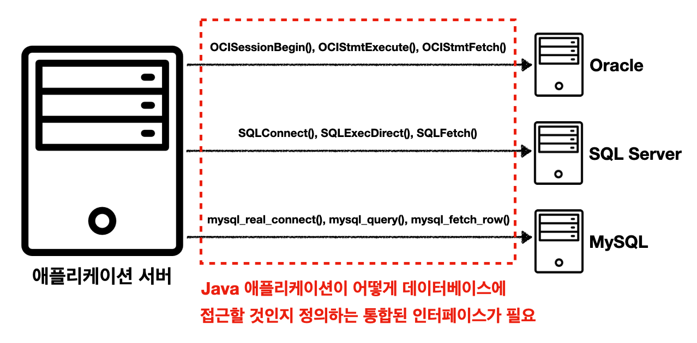
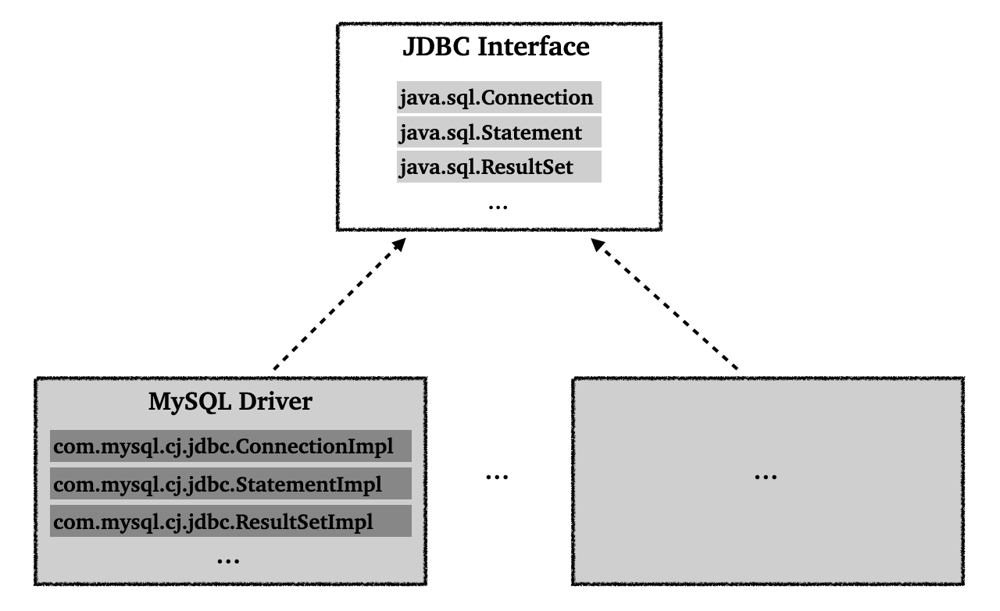
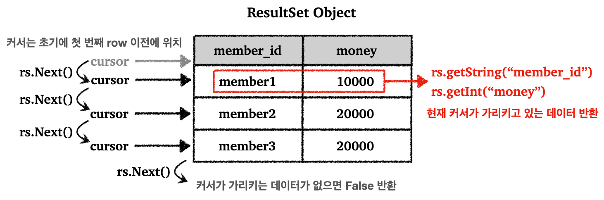

> JDBC, 데이터소스, 커넥션 풀, 트랜잭션에 대하여.

---

## Index


---

## 1) JDBC(Java Database Connectivity)

### 1.1 JDBC 소개

JDBC의 등장 배경부터 살펴보자.

기존 자바 애플리케이션에서 데이터베이스에 접근하기 위해서는 특정 벤더가 제공해주는 API를 사용했다 (또는 ODBC). 문제는 이런 데이터베이스의 사용법은 각각의 벤더마다 달랐다.

<br>

<p align="center">    </p>

<p align='center'>JDBC 이전</p>

이러한 문제를 해결하기 위해서 JDBC라는 자바 표준 인터페이스가 등장한다.

<br>

<p align="center">    </p>

<p align='center'>JDBC 인터페이스</p>

* JDBC(Java Database Connectivity)는 자바에서 데이터베이스에 접속할 수 있도록 하는 자바 API
* JDBC는 데이터베이스에서 자료를 쿼리하거나 업데이트하는 방법을 제공한다


* JDBC는 다음 3가지 기능을 표준 인터페이스로 정의해서 제공한다
  * `java.sql.Connection` - 연결
  * `java.sql.Statement` - SQL을 담은 내용
  * `java.sql.ResultSet` - SQL 요청 응답


* JDBC에는 `JDBC-ODBC bridge Driver`, `Native-API Driver`, `Network Protocol Driver`, `Thin Driver` 의 4가지 드라이버가 존재한다. 여기서 `Thin Driver`를 보편적으로 많이 사용한다
* 참고 : [https://www.javatpoint.com/jdbc-driver#](https://www.javatpoint.com/jdbc-driver#)

<br>

<p align="center">    </p>

<p align='center'>JDBC 이후</p>

* JDBC 인터페이스를 사용하기 위해서는 각 DB 벤더에서 DB에 맞게 구현한 라이브러리로 제공한다. 이를 JDBC 드라이버라고 한다.
* JDBC의 등장으로 2가지 문제가 해결되었다
  * 데이터베이스 벤더를 변경시 애플리케이션 서버의 데이터베이스 코드도 변경해야하는 문제. 애플리케이션은 JDBC 인터페이스만 의존하기 때문에, 구현 라이버러리만 변경하고 애플리케이션 서버의 코드를 유지할 수 있다
  * 각 벤더사의 사용법을 새로 익혀야 했던 문제

<br>

> JDBC의 한계
>
> * 각각의 데이터베이스 마다 SQL이나 데이터타입의 사용법이 일부 다르다
> * JDBC 코드는 변경하지 않더라도, SQL은 해당 데이터베이스에 맞게 사용해야 한다
> * 반복되는 보일러 플레이트(boiler-plate) 코드가 많다
>
> <br>
>
> 추후에도 설명하겠지만 이를 위해서 SQL Mapper 기술인 JdbcTemplate 그리고 ORM 기술인 JPA(Java Persistence API)를 사용할 수 있다.
>
> 이런 기술들도 결국에 JDBC를 이용해서 동작하기 때문에, JDBC의 사용법을 알아두는 것은 중요하다.

<br>

---

### 1.2 JDBC 사용하기 - 1(`DriverManager`)

JDBC의 사용법에 대해서 알아보자. (`DriverManager` 사용)

먼저 MySQL 컨테이너를 만들고 스프링 부트 애플리케이션에 연결해보자.

* [컨테이너를 설정하고 실행하는 방법](../../container/(001)Docker#4-docker-compose)

<br>

`build.gradle`에 `runtimeOnly 'com.mysql:mysql-connector-j'` 추가

```groovy
dependencies {
	implementation 'org.springframework.boot:spring-boot-starter-jdbc'
	implementation 'org.springframework.boot:spring-boot-starter-web'
	compileOnly 'org.projectlombok:lombok'
	runtimeOnly 'com.mysql:mysql-connector-j'
	annotationProcessor 'org.projectlombok:lombok'
	testImplementation 'org.springframework.boot:spring-boot-starter-test'

	testCompileOnly 'org.projectlombok:lombok'
	testAnnotationProcessor 'org.projectlombok:lombok'
}
```

<br>

데이터베이스 이름은 `test_database`로 하자.

`resources/schema.sql` 파일을 만들자.

```sql
drop table if exists member;

create table member (
     member_id varchar(10),
     money integer not null default 0,
     primary key (member_id)
);

insert into member(member_id, money) values ('hi1',10000);
insert into member(member_id, money) values ('hi2',20000);
```

* 초기 데이터 입력은 `data.sql`에 정의하는것이 권장 되지만, 편의상 `schema.sql`에 그냥 쿼리 작성 함

<br>

---

#### 1.2.1 데이터베이스 연결

JDBC의 `DriverManager`를 통한 연결에 대해서 알아보자.

<br>

<p align="center">    </p>

* MySQL 드라이버는 JDBC의 `java.sql.Connection` 인터페이스를 구현한 `com.mysql.cj.jdbc.ConnectionImpl`이라는 구현체를 제공

<br>

<p align="center">    </p>

<p align='center'>DriverManager 커넥션 요청 흐름</p>

* `DriverManager`는 라이브러리에 등록된 데이터베이스 드라이버들을 관리하고, 커넥션을 획득하는 기능을 제공한다

<br>

이제 데이터베이스에 연결하기 위한 코드를 작성해보자.

MySQL 데이터베이스에 접속하기 위한 상수 정의.

```java
public abstract class ConnectionConst {
  
    public static final String URL = "jdbc:mysql://localhost:3306/test_database?serverTimezone=Asia/Seoul";
    public static final String USERNAME = "root";
    public static final String PASSWORD = "admin";

}
```

* 뒤에서 다루겠지만, 스프링 부트를 이용하는 경우 `application.properties`에 데이터베이스의 엔드포인트를 설정하고, `DataSource`를 의존성 주입으로 받아서 사용가능

<br>

JDBC를 사용해서 실제로 데이터베이스 연결하는 코드를 작성해보자.

```java
@Slf4j
public class DBConnectionUtil {
  
    public static Connection getConnection() {
        Connection connection = null;
        try {
            // ConnectionConst 상수 static import 처리
            connection = DriverManager.getConnection(URL, USERNAME, PASSWORD);
            log.info("get connection={}, class={}", connection, connection.getClass());
            return connection;
        } catch (SQLException e) {
            throw new IllegalStateException(e);
        }
    }
}
```

* 데이터베이스에 연결하기 위해서 JDBC가 제공하는 `DriverManager.getConnection()`을 사용
* `getConnection()`은 라이브러리에 있는 데이터베이스 드라이버를 찾아서 해당 드라이버가 제공하는 커넥션 반환

<br>

동작을 확인하기 위한 테스트 코드를 작성해보자.

```java
@Slf4j
public class DBConnectionUtilTest {

    @Test
    void connection() {
        Connection connection = DBConnectionUtil.getConnection();
        Assertions.assertThat(connection).isNotNull();
    }
}
```

```
[main] INFO de.jdbc.connection.DBConnectionUtil -- get connection=com.mysql.cj.jdbc.ConnectionImpl@c94fd30, class=class com.mysql.cj.jdbc.ConnectionImpl
```

* `com.mysql.cj.jdbc.ConnectionImpl` : MySQL 드라이버가 제공하는 MySQL 전용 커넥션

<br>

---

#### 1.2.2 등록(`insert`)

`Member` 데이터를 데이터베이스에 등록하는 기능을 JDBC를 사용해서 개발해보자.

<br>

```java
@Data
@NoArgsConstructor
public class Member {

    private String memberId;
    private int money;

}
```

* 롬복의 `@Data` :  `@RequiredArgsConstructor`, `@Getter`, `@Setter`, `@ToString`, `@EqualsAndHashCode` 포함
* `memberId` : 회원의 아이디
* `money` : 회원이 소지한 금액

<br>

회원 객체를 데이터베이스에 저장하는 코드를 작성해보자.

```java
/**
 * DriverManager 사용
 */
@Slf4j
public class DriverManagerMemberRepository {

    public Member save(Member member) throws SQLException {
        String sql = "insert into member(member_id, money) values(?, ?)";

        Connection con = null;
        PreparedStatement pstmt = null;

        try {
            con = getConnection();
            pstmt = con.prepareStatement(sql);
            // 파라미터 바인딩
            pstmt.setString(1, member.getMemberId());
            pstmt.setInt(2, member.getMoney());
          	// 쿼리 실행
            pstmt.executeUpdate();
            return member;
        } catch (SQLException e) {
            log.error("db error", e);
            throw e;
        } finally {
            // 외부 자원 해제
            close(con, pstmt, null);
        }

    }

    // 할당된 자원의 해제 과정 중에 예외 발생에 대한 처리를 해야 안정적인 코드
    private void close(Connection con, Statement stmt, ResultSet rs) {
        
        if(rs != null) {
            try {
                rs.close();
            } catch (SQLException e) {
                log.info("error", e);
            }
        }

        if(stmt != null) {
            try {
                stmt.close();
            } catch (SQLException e) {
                log.info("error", e);
            }
        }

        if(con != null) {
            try {
                con.close();
            } catch (SQLException e) {
                log.info("error", e);
            }
        }
    }
		
    private static Connection getConnection() {
        return DBConnectionUtil.getConnection();
    }
}
```

* `getConnection()` : `DBConnectionUtil`를 통해서 데이터베이스 커넥션을 획득
* `sql` : 데이터베이스에 전달할 쿼리 정의


* `con.prepareStatement(sql)` : 데이터베이스에 전달할 SQL과 파라미터로 전달할 데이터들을 준비
  * 각 `?`에 바인딩할 값 지정


* `pstmt.executeUpdate()` : `Statement`를 통해 준비된 `sql`을 커넥션을 통해 데이터베이스에 전달
  * 데이터 추가, 변경에는 `executeUpdate()` 사용하면 됨


* `close()` : 쿼리 실행후 리소스 정리. 리소스 정리는 항상 역순으로 진행
  * `ResultSet`은 나중에 결과 조회 때 사용한다


* SQL 인젝션을 방지하기 위해서 `PreparedStatement`의  `?`를 통한 파라미터 바인딩 방식을 사용한다

<br>

---

#### 1.2.3 조회(`select`)

데이터베이스에 저장한 데이터를 조회하는 기능을 개발해보자.

<br>

회원을 조회하는 코드를 추가하자.

```java
public Member findById(String memberId) throws SQLException {
    String sql = "select * from member where member_id = ?";

    Connection con = null;
    PreparedStatement pstmt = null;
    ResultSet rs = null;

    try {
        con = getConnection();
        pstmt = con.prepareStatement(sql);
        pstmt.setString(1, memberId);
        // 데이터 조회를 위해서는 executeQuery() 사용 
        rs = pstmt.executeQuery();
				
      	// 목적은 회원 하나를 찾아서 조회
        if (rs.next()) {
            Member member = new Member();
            member.setMemberId(rs.getString("member_id"));
            member.setMoney(rs.getInt("money"));
            return member;
        } else {
            throw new NoSuchElementException("member not found! memberId = " + memberId);
        }
    } catch (SQLException e) {
        log.error("DB error", e);
        throw e;
    } finally {
        close(con, pstmt, rs);
    }
}
```

* `executeQuery()`는 결과를 `ResultSet`에 담아서 반환한다
* `ResultSet`의 모양은 아래 그림과 같다

<br>

<p align="center">    </p>

* `findById()`의 목적은 회원 하나를 찾아서 조회하는 것이기 때문에, `if`를 사용해서 `member` 반환

<br>

---

#### 1.2.4 수정, 삭제(`update`, `delete`)

데이터베이스에 등록된 데이터를 수정 또는 삭제해보자.

<br>

다음 코드를 추가하자.

```java
```


<br>

---

#### 1.2.5

<br>

`application.properties`는 다음과 같이 설정하자.

```properties
spring.application.name=jdbc
# spring 2.5.x 부터 deprecated, 아래의 init.mode 사용
# spring.datasource.initialization-mode=always
spring.sql.init.mode=always
spring.datasource.driver-class-name=com.mysql.cj.jdbc.Driver
# 3306 포트의 mysql 컨테이너의 test_database에 연결
spring.datasource.url=jdbc:mysql://localhost:3306/test_database?serverTimezone=Asia/Seoul
spring.datasource.username=root
spring.datasource.password=admin
```

<br>

애플리케이션을 실행하고 `member` 테이블을 조회하면 다음과 같이 쿼리 결과가 나와야한다.

```
mysql> select * from member;
+-----------+-------+
| member_id | money |
+-----------+-------+
| hi1       | 10000 |
| hi2       | 20000 |
+-----------+-------+
```

<br>

---

#### 1.2.6


<br>

---

### 1.3 


---

## Reference

1. [https://www.javatpoint.com/jdbc-driver#](https://www.javatpoint.com/jdbc-driver#)
