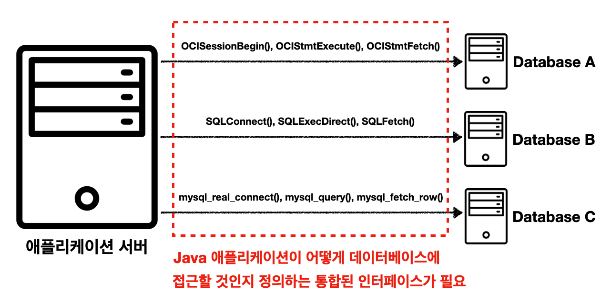
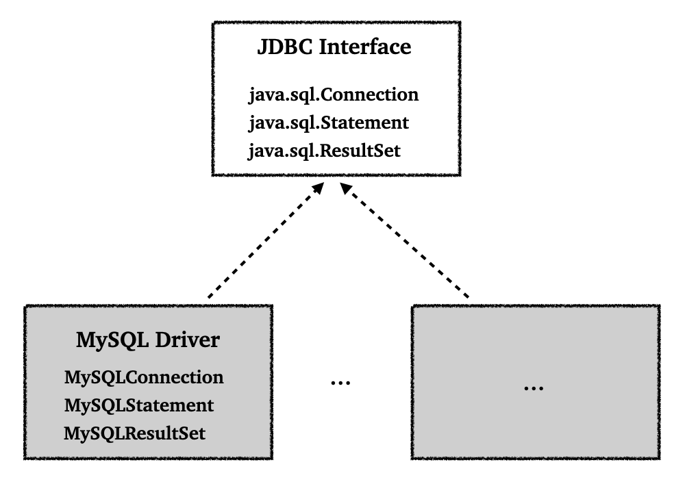
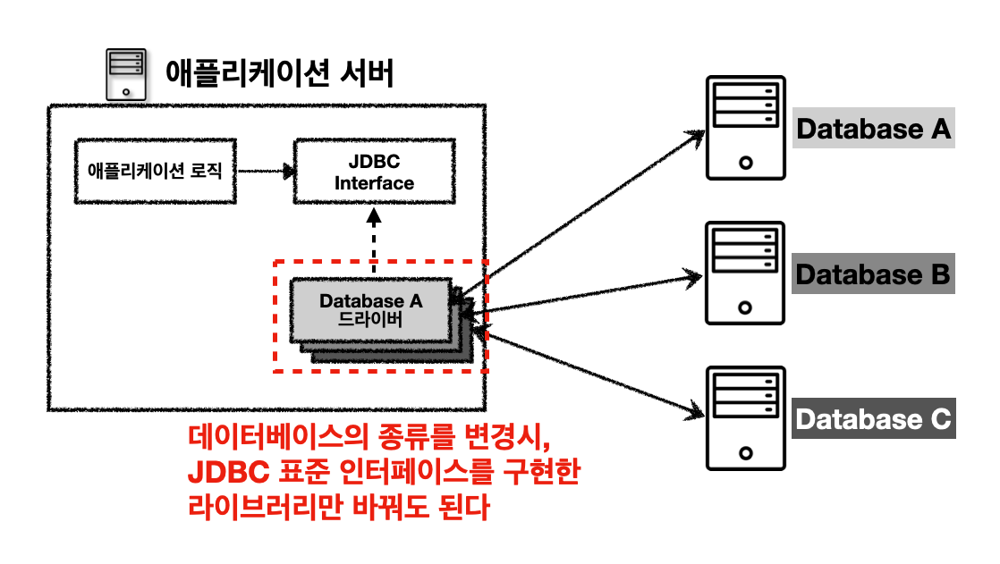

> JDBC, 데이터소스, 커넥션 풀, 트랜잭션에 대하여.

---

## Index

---

## 1) JDBC(Java Database Connectivity)

### 1.1 JDBC 소개

JDBC의 등장 배경부터 살펴보자.

기존 자바 애플리케이션에서 데이터베이스에 접근하기 위해서는 특정 벤더가 제공해주는 API를 사용했다 (또는 ODBC). 문제는 이런 데이터베이스의 사용법은 각각의 벤더마다 달랐다.

 

    

JDBC 이전

이러한 문제를 해결하기 위해서 JDBC라는 자바 표준 인터페이스가 등장한다.

 

    

JDBC 인터페이스

* JDBC(Java Database Connectivity)는 자바에서 데이터베이스에 접속할 수 있도록 하는 자바 API
* JDBC는 데이터베이스에서 자료를 쿼리하거나 업데이트하는 방법을 제공한다

* JDBC는 다음 3가지 기능을 표준 인터페이스로 정의해서 제공한다
  * `java.sql.Connection` - 연결
  * `java.sql.Statement` - SQL을 담은 내용
  * `java.sql.ResultSet` - SQL 요청 응답

* JDBC에는 `JDBC-ODBC bridge Driver`, `Native-API Driver`, `Network Protocol Driver`, `Thin Driver` 의 4가지 드라이버가 존재한다. 여기서 `Thin Driver`를 보편적으로 많이 사용한다
* 참고 : [https://www.javatpoint.com/jdbc-driver#](https://www.javatpoint.com/jdbc-driver#)

 

    

JDBC 이후

* JDBC 인터페이스를 사용하기 위해서는 각 DB 벤더에서 DB에 맞게 구현한 라이브러리로 제공한다. 이를 JDBC 드라이버라고 한다.
* JDBC의 등장으로 2가지 문제가 해결되었다
  * 데이터베이스 벤더를 변경시 애플리케이션 서버의 데이터베이스 코드도 변경해야하는 문제. 애플리케이션은 JDBC 인터페이스만 의존하기 때문에, 구현 라이버러리만 변경하고 애플리케이션 서버의 코드를 유지할 수 있다
  * 각 벤더사의 사용법을 새로 익혀야 했던 문제

 

> JDBC의 한계
>
> * 각각의 데이터베이스 마다 SQL이나 데이터타입의 사용법이 일부 다르다
> * JDBC 코드는 변경하지 않더라도, SQL은 해당 데이터베이스에 맞게 사용해야 한다
> * 반복되는 보일러 플레이트(boiler-plate) 코드가 많다
>
>  
>
> 추후에도 설명하겠지만 이를 위해서 SQL Mapper 기술인 JdbcTemplate 그리고 ORM 기술인 JPA(Java Persistence API)를 사용할 수 있다.
>
> 이런 기술들도 결국에 JDBC를 이용해서 동작하기 때문에, JDBC의 사용법을 알아두는 것은 중요하다.

 

---

### 1.2 JDBC 사용하기

JDBC의 사용법에 대해서 알아보자.

 

---

### 1.3 

---

## Reference

1. [https://www.javatpoint.com/jdbc-driver#](https://www.javatpoint.com/jdbc-driver#)
