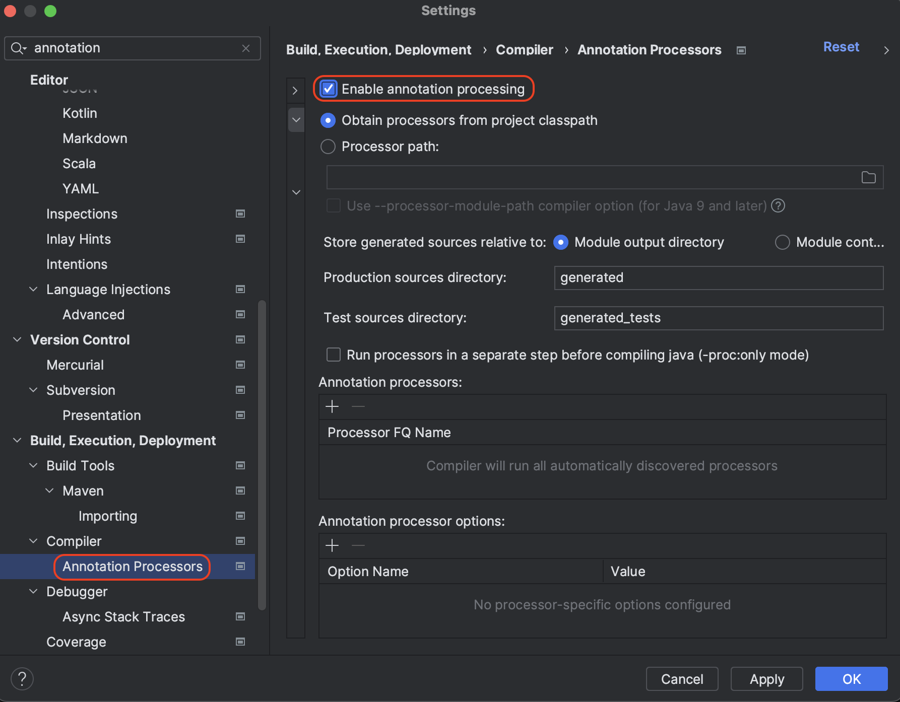

> Lombok 사용법

---

## Lombok 적용

Lombok은 자바 프로젝트의 보일러 플레이트(boilerplate) 코드를 줄여주는 라이브러리다. 생성자, getter & setter, ```toString()``` 등의 보일러 플레이트 코드를 애노테이션을 이용해서 대체할 수 있다.

<br>

<p align="center">    </p>

* 인텔이제이 ```settings```의 ```Plugins```에서 ```Lombok```을 인스톨한다

<br>

<p align="center">    </p>

* ```settings```의 `Annotation Processors`에서 `Enable annotation processing`을 체크하고 적용해야 한다

<br>

---

## Further Reading

* Lombok 공식 : [https://projectlombok.org/setup/intellij](https://projectlombok.org/setup/intellij)
