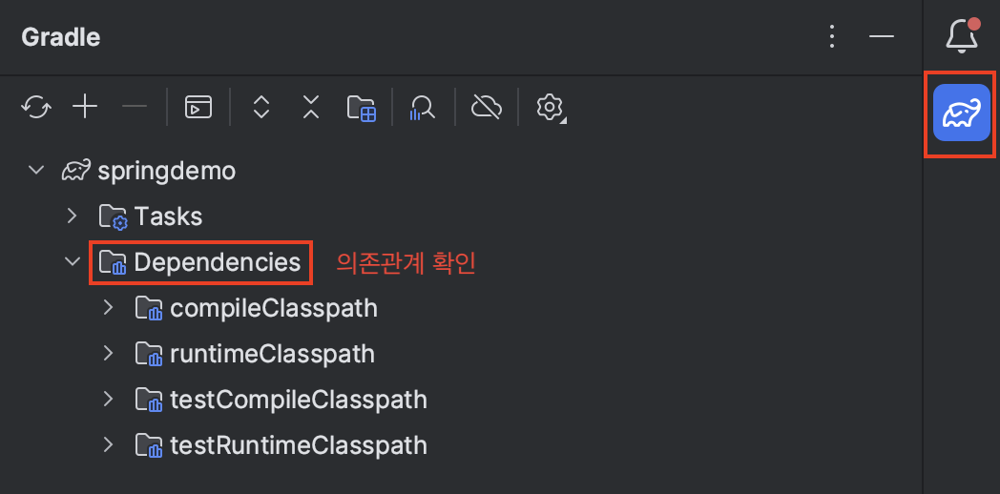

> Spring에 대한 간단한 소개 및 실습
>
> [스프링 입문 - 코드로 배우는 스프링 부트, 웹 MVC, DB 접근 기술](https://www.inflearn.com/course/%EC%8A%A4%ED%94%84%EB%A7%81-%EC%9E%85%EB%AC%B8-%EC%8A%A4%ED%94%84%EB%A7%81%EB%B6%80%ED%8A%B8/) 를 참고 했습니다

---

## Index

1. Introduction
   * ```Spring```, ```SpringBoot``` 소개
   * ```Gradle```
   * MVC Pattern
2. Spring Boot Project Configuration
   * Spring Boot 프로젝트 생성하기
   * 실행 확인하기
   * View 설정하기
   * 빌드 후 실행
3. Spring 웹 개발
   * Static Contents
   * MVC & Template Engine
   * API
4. 회원 관리 기능 개발 I
5. Spring Bean & Dependency
6. 회원 관리 기능 개발 II
7. Spring DB Access
8. AOP


---

## Requirements

* Java 17 or 21
* Spring Boot 3.2.2
* h2database 1.4.200

---

## 1) Introduction

> 들어가기 전 알아두면 좋을 선행 지식에 대한 간단한 소개

### 1-1. Spring, Spring Boot 소개

#### Spring

* 스프링(Spring)은 Java 애플리케이션을 만들기 위한 프레임워크
* 컴포넌트 관리, 데이터베이스 액세스 관리, 웹 개발 단순화, 트랜잭션 관리 등 많은 기능을 제공한다

#### Spring Boot

* 스프링 부트(Spring Boot)는 스프링으로 Java 애플리케이션을 빌드하기 쉽게해주는 프레임워크
* 밑바닥 부터 모든 걸 할 필요 없이 setup과 configuration의 많은 부분을 처리해줌
* 웹 앱을 위한 템플릿 엔진 등, 여러 툴 제공

스프링 프레임워크가 Java 애플리케이션을 쉽게 빌드해주기 위한 도구를 많이 제공해주는 툴박스라면, 스프링 부트는 스프링 프레임워크를 이용한 프로젝트를 쉽게 시작할 수 있도록 해주는 마법같은 도구로 생각하면 간편하다.


### 1-2. Gradle

* 빌드 자동화 툴
* 프로젝트의 dependency(의존관계) 관리, 프로젝트 빌드 등을 해준다
* ```build.gradle``` 파일로 설정 관리

```Gradle```이 ```Maven```보다 flexible 하고 성능이 좋다. (그냥 ```Gradle```을 사용해서 프로젝트 진행하자) 


### 1-3. MVC Pattern

MVC 패턴은 Model-View-Controller의 3가지 컴포넌트로 구성된 소프트웨어 디자인 패턴이다. 웹 개발의 많은 경우 이 MVC 패턴을 이용해서 개발된다. (스프링 뿐만 아니라 다른 프레임워크들도 MVC라는 명칭이 아니라도 비슷한 컨셉의 패턴을 이용해서 개발하는 것으로 알고 있다.)

<p align="center">    </p>

<p align='center'>https://www.geeksforgeeks.org/mvc-framework-introduction/</p>

#### Model

* 데이터와 관련된 로직을 책임진다

#### View

* 사용자에게 보여지는 부분을 책임진다(UI)

#### Controller

* 모델과 뷰 사이를 이어주는 중개(intermediary)의 역할
* 모델과 뷰는 서로 소통을 할 수 없기 때문에, 컨트롤러가 변경 내용을 각 구성 요소로 통지

> 예시를 들어보겠다.
>
> 1. Request
>    * 유저가 링크를 클릭하거나 폼을 작성하는 작업 등으로 나의 웹 애플리케이션으로 요청을 보낸다.
> 2. Controller
>    * 컨트롤러는 요청을 받고, 유저가 정확히 요구하는 것이 무엇인지 그리고 모델의 어느 부분이 필요한것인지 판단한다.
> 3. Model
>    * 모델은 실제로 데이터베이스에서 데이터를 fetch하거나 데이터 관련 로직을 처리하는 작업을 한다.
> 4. View
>    * 컨트롤러는 모델에서 통지 받고 뷰에서 해당 결과물을 보여준다.
> 5. Response
>    * 마지막 결과(응답)를 유저가 받는다

실제로 MVC 패턴으로 개발을 하면서 지켜야하는 규칙 같은 것들이 많다. 이런 MVC의 세부적인 내용은 이후 SpringMVC 포스트에서 다룰 예정이다.

---

## 2) Spring Boot Project Configuration

> 스프링 부트를 이용한 프로젝트 생성, 설정 그리고 빌드

### 2-1. Spring Boot 프로젝트 생성하기

[https://start.spring.io/](https://start.spring.io/)에서 프로젝트 생성하기

<p align="center">    </p>

* Dependencies : ```Spring Web```, ```Thymeleaf```
* Generate로 프로젝트 생성하고, ```build.gradle``` 파일을 통해서 프로젝트를 오픈

### 2-2. 정상적으로 실행되는지 확인

```SpringdemoApplication```을 실행해보고 정상 동작하는지 확인해보자.

<p align="center">    </p>

* ```SpringdemoApplication```을 실행 후 ```localhost:8080```에서 Whitelabel Error Page를 확인할 수 있으면 스프링이 정상적으로 동작한다는 것을 알 수 있다
* ```build.gradle```에서 ```plugins```, ```dependencies```, ```repositories``` 등을 관리할 수 있다
* ```External Libraries```에서 땡겨온 라이브러리를 확인할 수 있다

<p align="center">    </p>

* ```Dependencies```에서 의존 관계를 계층적으로 확인 가능하다

### 2-3. View 설정하기

아래는 스프링 부트 2.3.1의 공식문서에서 설명한 Welcome Page 설정하는 방법이다.

> #### 7.1.6. Welcome Page
>
> Spring Boot supports both static and templated welcome pages. It first looks for an `index.html` file in the configured static content locations. If one is not found, it then looks for an `index` template. If either is found, it is automatically used as the welcome page of the application.

[https://docs.spring.io/spring-boot/docs/3.2.2/reference/html/index.html](https://docs.spring.io/spring-boot/docs/3.2.2/reference/html/index.html)

위의 설명에서 알 수 있듯이 ```resources/static```에 ```index.html```파일을 위치하면 정적 welcome page로 설정할 수 있다.

```index.html```

```html
<!DOCTYPE HTML>
<html>
<head>
    <title>Hello</title>
    <meta http-equiv="Content-Type" content="text/html; charset=UTF-8" />
</head>
<body>
This is a Static index.html
<a href="/hello">hello</a>
</body>
</html>
```

* 위의 ```index.html```의 경우 그냥 정적 페이지이기 때문에 그냥 단순히 웹서버가 브라우저에 응답으로 넘겨주는 것

<p align="center">    </p>

* [```thymeleaf```](https://www.thymeleaf.org/)같은 템플릿 엔진을 사용해서 동적인 요소가 들어간 페이지를 만들 수 있다

이제 컨트롤러(controller)를 만들어보자. 템플릿 엔진을 이용한 동적 페이지를 만들기 위해 웹애플리케이션의 첫 번째 진입점인 컨트롤러 부터 만들어 볼 것이다.

```HelloController```

```java
@Controller // Controller임을 나타내는 스프링 어노테이션
public class HelloController {
    
    @GetMapping("hello") // "/hello"로 매핑된 GET 요청을 핸들링
    public String hello(Model model) {
        model.addAttribute("data", "loll"); // 모델로 "data"라는 attribute를 부여, 값은 "loll"
        // 이 attribute는 view에서 접근 가능
        return "hello"; // 리턴값 "hello"는 viewResolver가 hello라는 이름의 view를 찾도록 함
    }
}
```

```hello.html```

```html
<!DOCTYPE HTML>
<html xmlns:th="http://www.thymeleaf.org"> <!--Thymeleaf expression 사용을 가능하게 해줌-->
<head>
  <title>Hello</title>
  <meta http-equiv="Content-Type" content="text/html; charset=UTF-8" />
</head>
<body>
<!--${data}는 모델에서 추가된 "data" attribute. ${data}는 동적으로 실제값으로 치환 됨-->
<p th:text="'Hello to ' + ${data}" >Hello to our Customers.</p>
</body>
</html>
```

<p align="center">    </p>

<p align='center'>스프링 입문 - 코드로 배우는 스프링 부트, 웹 MVC, DB 접근 기술</p>

* ```viewName``` 매핑은 ```resources:templates/```+``` {viewName}```+```.html``` 처럼 이루어짐
* 위의 경우 ```hello```가 ```viewName```

### 2-4. 빌드하고 실행

1. ```gradlew```가 존재하는 디렉토리로 이동 : ```cd springdemo```
2. ```gradlew```로 빌드 : ```./gradlew build```
   * 문제가 있을 경우 ```./gradlew clean build``` 시도
3. 빌드 완료 후 ```build/libs```의 ```jar```파일 확인
4. ```jar``` 파일 실행 : ```java -jar springdemo-0.0.1-SNAPSHOT.jar```
5. ```localhost:8080```에서 정상 동작하는지 확인

<p align="center">    </p>

<p align="center">    </p>


---

## 3) Spring 웹 개발

> 정적 컨텐츠, MVC 그리고 API 방식에 대한 소개

### 3-1. Static Contents

정적 컨텐츠의 경우 그냥 정적 html 자체를 건내주는 방식. 동작 방식은 다음과 같다. 웹 브라우저에서 ```/static.html```로 접근을 할 경우 스프링 부트의 내장 웹서버(디폴트 : 톰캣 서버)에서 ```static```과 매핑된 컨트롤러를 찾는다. 존재하지 않을 경우 ```resources: static/static.html```을 찾아서 넘겨준다. 

### 3-2. MVC & Template Engine

MVC는 Model-View-Controller로 역할을 나눴다고 생각하면 편함.

**Controller**

```controller.MVCController```

```java
@Controller
public class MVCController {
    @GetMapping("hello-mvc") // "/hello-mvc"로 매핑된 GET 요청 핸들링
    public String helloMvc(@RequestParam("name") String name, Model model) { // 요청 URL의 name 파라미터에서 값을 추출
        model.addAttribute("name", name); // "name"이라는 attribute를 모델에 추가, URL에서 추출된 파라미터 값으로 설정
        return "hello-template"; // "hello-template"이라는 viewname을 찾음
    }
}
```

**View**

```resources/template/hello-template.html```

```html
<html xmlns:th="http://www.thymeleaf.org">
<body>
<p th:text="'hello ' + ${name}">hello! empty</p>
</body>
</html>
```

<p align="center">    </p>

<p align='center'>스프링 입문 - 코드로 배우는 스프링 부트, 웹 MVC, DB 접근 기술</p>

애플리케이션을 실행시키고 ```/hello-mvc```에 들어가면 Error Page가 뜨는 것을 확인할 수 있다. 그 이유는 URL에서 ```name```으로 넘길 값을 명시하지 않았기 때문이다. URL 뒤에 ```?name=name_value``` 같은 형식으로 파라미터를 넘길 수 있다.

 <p align="center">    </p>

* 참고로 ```?```뒤에 오는 것을 [Query String](https://en.wikipedia.org/wiki/Query_string)이라고 한다.

### 3-3. API

HTML 뷰를 랜더링하기 보다는 구조화 된 데이터를 ```json``` 형식으로 반환을 한다. (```xml```형식도 가능하지만 최근에는 거의 쓰이지 않음)

```controller.ApiController```

```java
@Controller
public class ApiController {
    @GetMapping("hello-api")
    @ResponseBody // 값이 바로 response body로 쓰여진다는 어노테이션
    // 그냥 응답이 JSON 형태로 변환 되었다고 생각하면 편함
    public Hello helloApi(@RequestParam("name") String name) {
        Hello hello = new Hello();
        hello.setName(name);
        return hello;
    }

    static class Hello { // static nested class 사용
        private String name;

        public String getName() {
            return name;
        }
        public void setName(String name) {
            this.name = name;
        }
    }
}
```

<p align="center">    </p>

* ```@ResponseBody``` 애노테이션이 붙어 있을 경우 http 응답에 데이터를 그대로 넘기는 것으로 판단
* ```HttpMessageConverter```가 동작하게 된다
  * 이 때 반환이 객체인 경우 ```JsonConverter```가 동작해서 ```json```으로 변환하고 응답으로 준다
    * ```MappingJackson2HttpMessageConverter```, ```Gson```
  * 반환이 문자인 경우 ```StringConverter```가 동작


---

## 4) 회원 관리 기능 개발 I

> 간단한 회원 관리 기능에 대한 백엔드 개발을 다룬다.

### 4-1. 비즈니스 요구 사항

* 데이터: 회원 ID(시스템이 관리), 이름
* 기능: 회원 등록, 조회
* DB는 선정되지 않았다고 가정

### 4-2. 애플리케이션 계층 구조

<p align="center">    </p>

* 컨트롤러: MVC의 컨트롤러 역할
* 서비스: 비즈니스 로직 구현
* 리포지토리: DB 접근, 도메인 객체를 DB에 저장하고 관리
* 도메인: 비즈니스 도메인의 객체 (현재의 경우 회원)
  * 주로 데이터베이스에 저장하고 관리된다

### 4-3. 클래스 의존 관계

* DB가 선정되지 않았다고 가정된 상태이기 때문에, 인터페이스로 구현 클래스를 변경할 수 있도록 설계할 것이다
* 초기 개발 단계에서는 구현체로 메모리 기반의 대이터 저장소를 이용
* ```MemberRepository```를 인터페이스로 만들고, ```MemoryMemberRepository```로 구현

### 4-4. 코드

```domain/Member``` : 회원 객체

<details>
<summary>코드 보기</summary>

```java

public class Member {
    private Long id; // 데이터를 식별하기 위해 시스템이 정하는 아이디
    private String name;

    /**
     * 간단한 예제이기 때문에 Getter Setter 전부 구현
    */
    public Long getId() {
        return id;
    }
    
    public void setId(Long id) {
        this.id = id;
    }
    
    public String getName() {
        return name;
    }
    
    public void setName(String name) {
        this.name = name;
    }
}   
```

</details>


---

## 5) Spring Bean & Dependency

> 컴포넌트 스캔(Component Scan), 의존관계, 스프링 빈, 의존성 주입(DI)에 대한 간단한 소개

```MemberController```를 추가 해보자. ```MemberController```는 ```MemberService```를 통해서 회원 가입과 조회 등이 가능해야 한다. 이런 경우를 ```MemberController```가 ```MemberService```를 의존한다고 표현한다. 


---

## 6) 회원 관리 기능 개발 II


---

## 7) Spring DB Access


---

## 8) AOP


## Reference

---

1. [스프링 입문 - 코드로 배우는 스프링 부트, 웹 MVC, DB 접근 기술](https://www.inflearn.com/course/%EC%8A%A4%ED%94%84%EB%A7%81-%EC%9E%85%EB%AC%B8-%EC%8A%A4%ED%94%84%EB%A7%81%EB%B6%80%ED%8A%B8/) 
1. [https://www.geeksforgeeks.org/mvc-framework-introduction/](https://www.geeksforgeeks.org/mvc-framework-introduction/)
1. [https://docs.spring.io/spring-boot/docs/3.2.2/reference/html/index.html](https://docs.spring.io/spring-boot/docs/3.2.2/reference/html/index.html)
1. [https://www.thymeleaf.org/](https://www.thymeleaf.org/)
1. [https://en.wikipedia.org/wiki/Query_string](https://en.wikipedia.org/wiki/Query_string)
