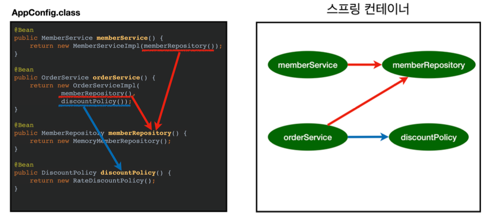

> Spring의 핵심 원리에 대한 이론 및 실습.
>
> [스프링 핵심 원리 - 기본편](https://www.inflearn.com/course/%EC%8A%A4%ED%94%84%EB%A7%81-%ED%95%B5%EC%8B%AC-%EC%9B%90%EB%A6%AC-%EA%B8%B0%EB%B3%B8%ED%8E%B8#)을 듣고 정리한 포스트 입니다.
>
> 해당 포스트에서 나오는 [코드 보기](https://github.com/seungki1011/Data-Engineering/tree/main/spring/springbasic1/src)

---

## Index

1. Object Oriented Design(객체 지향 설계)
   * SOLID 원칙
     * SRP
     * OCP
     * LSP
     * ISP
     * DIP
     * 요약
   * OOD와 Spring
2. Spring 핵심 원리 I - 예제 생성
   * 프로젝트 생성
   * 비즈니스 요구 사항과 설계
   * 회원 도메인 설계, 개발, 테스트
   * 주문과 할인 도메인 설계, 개발, 테스트
3. Spring 핵심 원리 II - 객체 지향 적용
   * 새로운 할인 정책 개발
   * 관심사 분리
   * 새로운 구조와 할인 정책 적용
   * IoC, DI, 컨테이너
     * IoC
     * DI
     * IoC, DI 컨테이너
   * 스프링으로 전환
4. Spring Container, Bean
   * 스프링 컨테이너
   * 스프링 빈 조회
     * 컨테이너에 등록된 모든 빈 조회
     * 빈 조회하기
5. Singleton Container
6. Component Scan
7. Dependency Injection (DI, 의존관계 주입)
8. Bean Lifecycle(빈 생명주기)
9. Bean Scope

---

## Requirements

* Java 17 or 21
* Spring Boot 3.2.2

> 향후에 언제든지 바뀔 수 있기 때문에 현재의 스테이블 버전을 사용하면 될 듯 

---

## 1) Object Oriented Design(객체 지향 설계)

### 1-1. SOLID 원칙

**SOLID**란 객체 지향 설계의 5가지 원칙이다. 각 원칙은 다음과 같다.

1. Single Responsibility Principle(SRP) : 단일 책임 원칙
1. Open Close Principle(OCP) : 개방 폐쇄 원칙
1. Liskov Substitution Principle(LSP) : 리스코프 치환 원칙
1. Interface Segragation Principle(ISP) : 인터페이스 분리 원칙
1. Dependency Inversion Principle(DIP) : 의존관계 역전 원칙

<br>

#### 1-1-1. SRP (단일 책임 원칙)

* **하나의 클래스는 하나의 책임만 가진다**
* 책임이라는 것은 무엇일까?
* 이 **책임의 범위라는 것은 문맥과 상황에 따라 다를 수 있다** → 적절히 밸런스를 맞추는 것이 중요
* 어떤 변경이 있을 때 파급 효과가 적다면 SRP를 잘 따른 것
  * 예) 객체의 생성과 사용의 분리

책임의 범위라는 것을 예를 들어 설명하자면, ```Shape```라는 클래스가 존재한다고 하자.

```python
# 이번 예시는 파이썬 사용
class Shape:
    def draw(self):
        # draw the shape

    def resize(self):
        # resize the shape

    def calculate_area(self):
        # calculate the area of the shape
```

```Shape``` 라는 클래스는 ```draw```, ```resize``` 등 여러가지 메서드를 통해 여러 작업이 가능하기 때문에, 좁은 범위의 SRP에서는 위의 클래스는 SRP를 위반하는 것일 수 있다. 그러나 넓은 범위로 SRP를 해석하는 경우, ```Shape```라는 클래스는 어떤 모양(도형)을 나타내고 조정하는 하나의 단일 책임을 나타내기 때문에 SRP를 잘 따른다고 볼 수도 있는 것이다.

이 처럼 SRP에서 책임의 범위를 상황에 따라 잘 정해서, 특정 변경이 있을 때 파급 효과가 적도록 설계한다면 SRP를 잘 따른다고 생각하면 편하다.

<br>

#### 1-1-2. OCP (개방 폐쇄 원칙)

* **소프트웨어 요소는 확장에 열려있으나 변경에는 닫혀 있어야 한다**
* 새로운 기능이나 요소를 추가할 때 기존의 코드 변경 없이 추가가 가능해야 한다 
* 다형성을 활용하면 된다!
  * 다형성을 통해서 클라이언트를 변경하지 않고 서버의 구현된 기능을 유연하게 변경 가능해야 한다
* 인터페이스를 구현한 새로운 클래스를 만들어서 새로운 기능을 구현하거나 추가한다
* 역할과 구현의 분리를 생각하면 된다 (물론 이것만으로 OCP를 지켰다고 볼 수는 없다)
  * 예) 역할 : 도형 / 구현 : 원, 사각형, 삼각형 등
  * 역할과 구현의 분리를 위해서 인터페이스를 안정적으로 잘 설계하는 것이 중요하다

이전의 [Spring 소개](https://github.com/seungki1011/Data-Engineering/blob/main/spring/notes/(001)Spring%20Introduction.md)에서의 [회원 관리 기능 예제](https://github.com/seungki1011/Data-Engineering/blob/main/spring/notes/(001)Spring%20Introduction.md#4-%ED%9A%8C%EC%9B%90-%EA%B4%80%EB%A6%AC-%EA%B8%B0%EB%8A%A5-%EA%B0%9C%EB%B0%9C-i)에서 레포지토리의 인터페이스를 바탕으로 클래스를 구현해서 갈아 끼우듯이 사용한 것을 떠올려보자. 

```java
public class MemberService {
    // private MemberRepository memberRepository = new MemoryMemberRepository(); // 기존 코드
    private MemberRepository memberRepository = new JDBCMemberRepository(); // 새로운 코드로 변경
    /*
     * ...
     */
}
```

<p align="center">    </p>

<p align='center'>인프런 - 스프링 핵심 원리 : 기본편</p>

위의 경우에 다형성을 사용했지만 OCP 원칙을 완변히 지켰다고 볼 수는 없다. 왜냐하면 ```MemberService``` 클라이언트가 구현 클래스를 직접 선택하고 있기 때문이다. 구현 객체를 변경하기 위해서는 클라이언트 코드를 변경해야하는 경우 인것이다. 이 **문제를 해결하기 위해서는 객체를 생성하고, 연관관계를 맺어주는 별도의 조립, 설정자가 필요하다.** (이것을 해결하기 위해 스프링의 DI, IoC 컨테이너 등을 사용한다고 볼 수 있다) 

> 전략 패턴(Strategy Pattern) 찾아보기

<br>

#### 1-1-3. LSP (리스코프 치환 원칙)

* 프로그램의 객체는 프로그램의 정확성을 깨드리지 않으면서 하위 타입의 인스턴스로 바꿀 수 있어야 한다
  * objects of a superclass should be able to be replaced with objects of a subclass without affecting the correctness of the program
  * in simpler terms, if a class is a subtype of another class, it should be usable wherever its parent class is used
* LSP를 지킨다는 것은 다형성에서 하위 클래스는 인터페이스 규약을 다 지켜야 한다는 것
  * 예) 자동차 인터페이스의 엑셀 기능은 앞으로 가는 기능이다, 만약에 엑셀을 통해서 뒤로 갈 수 있도록 구현을 하게되면 LSP를 위반한 것임
* 인터페이스를 구현한 구현체를 믿고 사용하기 위한 원칙이라고 볼 수 있음

<br>

#### 1-1-4. ISP (인터페이스 분리 원칙)

* 자신이 사용하지 않는 메서드에 의존하지 않는다
  * 쉽게 말해서 클래스는 사용하지 않을 인터페이스는 구현하지 않아야 한다는 원칙이다
* 특정 클라이언트를 위한 인터페이스 여러개가 범용적인 인터페이스 하나보다 낫다
  * 예) 자동차 인터페이스 → 운전 인터페이스, 정비 인터페이스 등으로 분리
  * 예) 사용자 클라이언트 → 운전자 클라이언트, 정비사 클라이언트 등으로 분리
  * 인터페이스를 분리하면 정비 인터페이스 자체가 변해도 운전자 클라이언트에 영향을 주지 않음
* 분리하면 인터페이스가 명확해지고, 대체 가능성이 높아진다

ISP 원칙이라는 것은 결국 인터페이스가 너무 광범위하면 인터페이스를 구현하는 클래스들이 사용하지도 않을 메서드를 오버라이딩 해야하는 상황이 발생한다. 이를 방지하기 위해서 인터페이스는 지나치게 많은 기능을 구현하면 안되고, 인터페이스를 사용하는 객체 기준으로 적당히 분리되어야 한다.

<br>

#### 1-1-5. DIP (의존관계 역전 원칙)

* 추상화에 의존 해야하고, 구체화에 의존하면 안된다 → 의존성 주입은 이 원칙을 따르는 방법 중 하나다
* 쉽게 이야기해서 구현 클래스에 의존하지 말고 인터페이스에 의존하라는 뜻이다
  * 클라이언트가 인터페이스에 의존해야 유연하게 구현체를 변경할 수 있다
* 역할과 구현에서 "역할"을 바라보고 의존해야 한다는 것 

이전의 **OCP**에서 사용한 예시를 가져와보자.

```java
public class MemberService {
    // private MemberRepository memberRepository = new MemoryMemberRepository(); // 기존 코드
    private MemberRepository memberRepository = new JDBCMemberRepository(); // 새로운 코드로 변경
    /*
     * ...
     */
}
```

```MemberService```는 ```MemoryMemberRepository```에 대해 알고 있다. 알고 있다는 것은 의존한다는 것과 같다. 이것은 **DIP 원칙을 위반**한다는 뜻. ```MemberRepository```만 의존해야하는데, 그 구현체인 ```MemoryMemberRepositor```와 ```JDBCMemberRepository```에도 의존하고 있다. 

<br>

#### 1-1-6. 요약

* 객체 지향의 핵심은 다형성
* 다형성만 가지고 구현 객체를 변경할 때 클라이언트 코드도 함께 변경된다
* **다형성만으로 OCP, DIP 원칙을 지킬 수 없다** 

다형성외에 추가적으로 필요한 요소를 스프링에서 찾아보자.

<br>

---

### 1-2. OOD와 스프링

스프링은 결국 의존성 주입(DI)와 DI 컨테이너 등의 기술을 지원해서 **다형성에 OCP, DIP를 가능하게 해준다**. 이를 통해 스프링을 이용하면 클라이언트 코드의 변경 없이 기능 확장이 가능하다. 

스프링이 나오게 된 배경은 결국 다음과 같다.

* 순수하게 자바로만 OCP, DIP 원칙을 통해 개발을 하면 너무 어려움(할 일이 너무 많음)
* 스프링 없이 OCP, DIP를 구현하려고 하면 결국에는 스프링 프레임워크(정확하게는 DI 컨테이너의 개념)를 만들어서 개발을 하게 되는 방향성으로 흘러감

> 실무에서의 고민
>
> * 인터페이스 도입에는 추상화라는 비용이 발생
> * 기능 확장의 가능성이 없다면, 구체 클래스를 직접 사용하고 향후에 필요한 경우 리팩토링해서 인터페이스를 구현하는 것도 방법

<br>

---

## 2) Spring 핵심 원리 I - 예제 생성

처음의 예시 프로젝트는 스프링 없이 순순하게 자바만을 사용해서 구현. (프로젝트 생성은 스프링 부트 사용)

### 2-1. 프로젝트 생성

[https://start.spring.io/](https://start.spring.io/)에서 프로젝트 생성하기

<p align="center">    </p>

* 스프링이나 자바 필요에 맞게 스테이블한 버전을 선택해서 사용하면 됨 
* Generate로 생성 후  ```build.gradle``` 파일을 통해 프로젝트 오픈

<br>

<p align="center">    </p>

* Mac : 위의 탭으로 가서 ```File``` → ```Project Structure``` 선택

<br>

<p align="center">    </p>

* 위의 탭으로 가서 ```IntelliJIDEA``` → ```Settings``` 에서 ```Gradle``` 설정으로 들어간다
* Build and Run 설정은 ```IntelliJ IDEA``` 사용
* **필수 아님!** ```IntelliJ IDEA```로 빌드와 런하는 것이 프로젝트 설정, 규모에 따라 빠를수도 있음

<br>

---

### 2-2. 비즈니스 요구 사항과 설계

예시 프로젝트의 비즈니스 요구 사항이 무엇이고, 대략적인 설계에 대한 내용.

먼저 **비즈니스 요구 사항**에 알아보자.

1. 회원
   * 회원 가입과 조회가 가능하다
   * 회원 등급에는 일반과 VIP 등급이 존재한다
   * 회원 데이터를 위해 자체 DB를 구축할 수 있고, 외부 시스템을 사용할 수도 있다 (미정)
2. 주문과 할인 정책
   * 회원은 상품 주문이 가능하다
   * 회원 등급에 따라 할인 정책이 다르게 적용될 수 있다
   * 할인 정책에서 VIP는 1000원을 할인해주는 고정 금액 할인을 적용한다 (나중에 변경 가능)
   * 할인 정책은 변경 가능성이 높다
     * 회사의 기본 할인 정책은 정해지지 않았다 (미정)
     * 서비스 개시 전 까지 고민하고, 최악의 경우 할인 적용이 없을 수도 있다 (미정)

일단 인터페이스를 만들어서 구현체를 언제든지 변경할 수 있는 객체 지향적 설계를 시도하기도 한다.

<br>

---

### 2-3. 회원 도메인 설계

비즈니스 요구 사항을 들었으니 회원 도메인에 대한 설계를 해보자. 들어가기에 앞서 회원 도메인에 대한 요구사항 다시 한번 살펴보자.

* 회원 도메인
  * 회원 가입과 조회가 가능하다
  * 회원 등급에는 일반과 VIP 등급이 존재한다
  * 회원 데이터를 위해 자체 DB를 구축할 수 있고, 외부 시스템을 사용할 수도 있다 (미정)

이제 회원 도메인에 대한 설계를 해보자.

<p align="center">    </p>

<p align='center'>회원 도메인의 협력 관계도</p>

* 클라이언트가 회원 서비스를 호출한다, 이때 회원 서비스는 다음의 두 가지 기능을 제공해주는 레이어다
  * 회원 가입
  * 회원 조회
* 회원 저장소 인터페이스를 만들 것이다
* 회원 저장소 인터페이스의 구현체는 다음의 3가지 구현체를 만들 것
  * 메모리 회원 저장소 : 로컬 내의 메모리에 데이터를 저장하는 저장소 (오로지 개발용)
  * DB 회원 저장소
  * 외부 시스템 연동 회원 저장소 

<br>

<p align="center">    </p>

<p align='center'>회원 클래스 다이어그램</p>

* 실제 구현은 위의 다이어그램대로 구현할 예정
* 외부 시스템 연동 회원 저장소도 추가 될 가능성이 있음

<br>

<p align="center">    </p>

<p align='center'>회원 객체 다이어그램</p>

* 실제 서버에 올라갈 때 객체간의 참조는 다음과 같이 된다
  * 클라이언트 → 회원 서비스(```MemberServiceImpl```) → 메모리 회원 저장소 (```MemoryMemberRepository```)

<br>

---

### 2-4. 회원 도메인 개발

이전 설계를 바탕으로 회원 도메인에 대한 개발을 시작해보자.

```member/Grade```

```java
public enum Grade {
    BASIC,
    VIP
}
```

```member/Member```

```java
public class Member {
    private Long id;
    private String name;
    private Grade grade;

    public Member(Long id, String name, Grade grade) {
        this.id = id;
        this.name = name;
        this.grade = grade;
    }

    // Getter and Setter
    public Long getId() { return id; }
    public void setId(Long id) { this.id = id; }
    public String getName() { return name; }
    public void setName(String name) { this.name = name; }
    public Grade getGrade() { return grade; }
    public void setGrade(Grade grade) { this.grade = grade; }
}
```

```member/MemberRepository```

```java
public interface MemberRepository {
    // 회원 저장
    void save(Member member);
    // 회원 아이디로 회원 찾기
    Member findById(Long memberId);
}
```

```member/MemoryMemberRepository```

```java
public class MemoryMemberRepository implements MemberRepository{
    // 간단한 예시라서 동시성 고려 없이 구현 (Concurrent HashMap 사용 x)
    private static Map<Long, Member> store = new HashMap<>();
    
  	@Override
    public void save(Member member) {
        store.put(member.getId(), member);
    }

    @Override
    public Member findById(Long memberId) {
        return store.get(memberId);
    }
```

* 원래 인터페이스에 대한 구현체는 다른 패키지에 관리하는 것을 권장하지만, 간단한 예시이므로 같은 패키지에서 개발

<br>

```member/MemberService```

```java
public interface MemberService {
    // 회원 가입
    void join(Member member);
    // 회원 조회
    Member findMember(Long memberId);
}
```

```member/MemberServiceImpl```

```java
public class MemberServiceImpl implements MemberService{
    // 구현 객체를 선택해야 함
    private final MemberRepository memberRepository = new MemoryMemberRepository();
    
  	@Override
    public void join(Member member) {
        memberRepository.save(member);
    }

    @Override
    public Member findMember(Long memberId) {
        return memberRepository.findById(memberId);
    }
}
```

* 단일 구현체인 경우 관례상 이름에 ```Impl```을 붙여주는 경우가 많다

<br>

---

### 2-5. 회원 도메인 실행과 테스트

회원 도메인이 정상적으로 동작하는지 확인해보자.

```test/member/MemberServiceTest```

```java
public class MemberServiceTest {

    MemberService memberService = new MemberServiceImpl();

    @Test
    void join() {
        // given - 주어진 상황(데이터, 등)
        Member member = new Member(1L, "messi", Grade.VIP);

        // when - 이것을 실행할 때
        memberService.join(member);
        Member findMember = memberService.findMember(1L);

        // then - 이런 결과가 나와야 한다(검증)
        Assertions.assertThat(member).isEqualTo(findMember);
    }
}
```

* given, when, then 으로 테스트 코드를 짜는 것은 공식이 아님!
  * 상황에 따라서 적용하는 일종의 가이드 처럼 생각하는게 편함

지금까지 개발한 회원 도메인에서 문제가 존재함. ```MemberServiceImpl```에서 추상화(```MemberRepository```)에도 의존하고 구현체(```MemoryMemberRepository```)에도 의존하고 있음. 즉 DIP를 위반하고 있다. 

<br>

---

### 2-6. 주문과 할인 도메인 설계

주문과 할인 도메인을 설계 해보자. 들어가기에 앞서 주문과 할인 정책에 대한 요구사항을 다시 한번 살펴보자.

* 주문과 할인 정책
  * 회원은 상품 주문이 가능하다
  * 회원 등급에 따라 할인 정책이 다르게 적용될 수 있다
  * 할인 정책에서 VIP는 1000원을 할인해주는 고정 금액 할인을 적용한다 (나중에 변경 가능)
  * 할인 정책은 변경 가능성이 높다
    * 회사의 기본 할인 정책은 정해지지 않았다 (미정)
    * 서비스 오픈 전 까지 고민하고, 최악의 경우 할인 적용이 없을 수도 있다 (미정)

이제 주문과 할인 도메인에 대한 설계를 해보자.

<p align="center">    </p>

<p align='center'>주문 도메인의 관계, 역할, 책임</p>

* **주문 생성** : 클라이언트는 주문 서비스에 주문 생성을 요청할 수 있다
  * 간단한 예제를 위해서 그냥 상품의 정보 자체를 넘김
  * 실제로 개발할 때는 아이템이라는 객체를 만들어서  사용함
* **회원 조회** : 할인을 위해서는 회원 등급이 필요하기 때문에 주문 서비스는 회원 저장소에서 회원을 조회한다
  * 회원 정보에서 등급과 같은 정보를 조회 
* **할인 적용** : 주문 서비스는 회원 등급에 따른 할인 여부를 할인 정책에 위임한다 
* **주문 결과 반환** : 주문 서비스는 할인 결과를 포함한 주문 결과를 반환한다
* 간단한 예시를 위해 주문 데이터를 DB에 저장하는 과정은 생략 

<br>

이제 구현에 대한 내용까지 포함한 다이어그램을 살펴보자.

<p align="center">    </p>

<br>

<p align="center">    </p>

<p align='center'>주문 도메인의 구현체</p>

**역할과 구현의 분리**를 통해서 구현 객체의 조립이 자유로워진다. 

<br>

---

### 2-7. 주문과 할인 도메인 개발

이전 설계를 바탕으로 주문과 할인 도메인에 대한 개발을 진행한다.

```discount/DiscountPolicy```

```java
public interface DiscountPolicy {
    /**
     * @return 할인 대상 금액 (호출시 할인 금액을 리턴)
     */
    int discount(Member member, int price);
}
```

```discount/FixDiscountPolicy```

```java
public class FixDiscountPolicy implements DiscountPolicy{
    
  	private int discountFixAmount = 1000; // 고정 할인값 : 1000원
  
    @Override
    public int discount(Member member, int price) {
        if (member.getGrade() == Grade.VIP) { // enum은 "==" 사용해도 됨
            return discountFixAmount;
        } else {
            return 0;
        }
    }
}
```

<br>


```order/Order```

```java
public class Order {
    private Long memberId;
    private String itemName;
    private int itemPrice;
    private int discountPrice;

    public Order(Long memberId, String itemName, int itemPrice, int discountPrice) {
        this.memberId = memberId;
        this.itemName = itemName;
        this.itemPrice = itemPrice;
        this.discountPrice = discountPrice;
    }

    // 계산 로직 (최종 가격 계산)
    public int calculatePrice() {
        return itemPrice - discountPrice;
    }

		/**
		 * Getter and Setter 구현
		 */

    // 객체 출력시 toString의 결과가 나옴
    @Override
    public String toString() {
        return "Order{" +
                "memberId=" + memberId +
                ", itemName='" + itemName + '\'' +
                ", itemPrice=" + itemPrice +
                ", discountPrice=" + discountPrice +
                '}';
    }
}
```

```order/OrderService```

```java
public interface OrderService {
    // 주문 생성
    Order createOrder(Long memberId, String itemName, int itemPrice);
}
```

```order/OrderServiceImpl```

```java
public class OrderServiceImpl implements OrderService{
    /*
     * OrderService는 할인에 대한 변경을 건들 필요가 없음!(단일 책임의 원칙)
     * 할인에 대한 내용은 DiscountPolicy가 담당
     */
    private final MemberRepository memberRepository = new MemoryMemberRepository();
    private final DiscountPolicy discountPolicy = new FixDiscountPolicy();
    @Override
    public Order createOrder(Long memberId, String itemName, int itemPrice) {
        Member member = memberRepository.findById(memberId);
        int discountPrice = discountPolicy.discount(member, itemPrice);
        // 최종 생성되는 주문 반환
        return new Order(memberId, itemName, itemPrice, discountPrice);
    }
}
```

<br>

---

### 2-8. 주문과 할인 도메인 실행과 테스트

개발한 주문과 할인 도메인에 대한 테스트.

```test/order/OrderServiceTest```

```java
public class OrderServiceTest {

    MemberService memberService = new MemberServiceImpl();
    OrderService orderService = new OrderServiceImpl();

    @Test
    void createOrder() {
        Long memberId = 1L;
        Member member = new Member(memberId, "messi", Grade.VIP);
        memberService.join(member);

        Order order = orderService.createOrder(memberId, "pizza", 18000);
        Assertions.assertThat(order.getDiscountPrice()).isEqualTo(1000);
    }
}
```

<br>

---

## 3) Spring 핵심 원리 II - 객체 지향 적용

객체 지향의 원리들을 다시 한번 알아보면서, 지금까지 작성했던 코드에 적용해본다.

### 3-1. 기존 예제의 할인 정책 변경

기존의 고정 할인 정책을 정률 할인으로 바꿀려고 함.

* 예) 20000원에 10% 할인 적용 → 2000원 할인

기존의 ```FixDiscountPolicy```를 ```RateDiscountPolicy```로 변경해서 개발하면 됨. (구현체 추가)

```discount/RateDiscountPolicy```

```java
public class RateDiscountPolicy implements DiscountPolicy{

    private int discountPercent = 10; // 정률 할인 비율 : 10% 할인

    @Override
    public int discount(Member member, int price) {
        if (member.getGrade() == Grade.VIP) {
            return price * discountPercent / 100;
        } else {
            return 0;
        }
    }
}
```

* 인텔리제이 : 오버라이드한 메서드 위에 ```ctrl + shift + t``` 단축키로 테스트 코드를 위한 패키지와 클래스 생성 해줌

<br>

```test/discount/RateDiscountPolicyTest```

```java
class RateDiscountPolicyTest {
    RateDiscountPolicy discountPolicy = new RateDiscountPolicy();

    @Test
    @DisplayName("VIP는 10% 할인 적용")
    void vip_o() {
        // given
        Member member = new Member(1l, "mbappeVip", Grade.VIP);
        // when
        int discount = discountPolicy.discount(member, 20000);
        // then
        Assertions.assertThat(discount).isEqualTo(2000); // Assertions 스태틱 임포트 권장
    }

    // 실패하는 경우도 테스트
    @Test
    @DisplayName("VIP가 아닌 경우 할인 없음")
    void vip_x() {
        // given
        Member member = new Member(2l, "ronaldoBasic", Grade.BASIC);
        // when
        int discount = discountPolicy.discount(member, 20000);
        // then
        Assertions.assertThat(discount).isEqualTo(2000);
    }
}
```

<br>

이제 ```RateDiscountPolicy```를 적용해보자.

```order/OrderServiceImpl```

```java
public class OrderServiceImpl implements OrderService{

    private final MemberRepository memberRepository = new MemoryMemberRepository();
  
//    private final DiscountPolicy discountPolicy = new FixDiscountPolicy();
    private final DiscountPolicy discountPolicy = new RateDiscountPolicy();

		/**
		 * 기존 구현
		 */
}
```

* 할인 정책 변경을 위해서는 클라이언트 코드인 ```OrderServiceImpl```를 고쳐야 한다
* 지금 상태의 코드는 다형성을 활용해서 인터페이스와 구현 객체를 분리했지만 **OCP, DIP를 준수했다고 보기는 어렵다**
  * 왜?
    * DIP : 인터페이스인 ```DiscountPolicy``` 뿐만 아니라, 구현체인 ```FixDiscountPolicy```와 ```RateDiscountPolicy```에도 의존하고 있다
    * OCP : 현재의 코드에 기능을 확장하려면 결국 클라이언트 코드를 변경해줘야 한다

<br>

<p align="center">    </p> 

<p align='center'>OCP 위반</p>

<br>
 DIP와 OCP 위반을 해결하기 위한 방법은 무엇일까?

* 먼저 DIP 위반은 추상(인터페이스)에만 의존하도록 변경해야 한다

그러면 인터페이스에만 의존하도록 설계를 바꿔보자.

```order/OrderServiceImpl```

```java
public class OrderServiceImpl implements OrderService{

    private final MemberRepository memberRepository = new MemoryMemberRepository();
  	
  	private DiscountPolicy discountPolicy; // 인터페이스에만 의존!
		// private final DiscountPolicy discountPolicy = new FixDiscountPolicy();
    // private final DiscountPolicy discountPolicy = new RateDiscountPolicy();

		/**
		 * 나머지 구현 부분
		 */
}
```

* ```discountPolicy```에 아무것도 할당 되어있지 않기 때문에 ```NullPointerException```
* 이 문제를 해결하기 위해서는 누군가 클라이언트인 ```OrdserServieImpl```에 ```DiscountPolicy```의 **구현 객체를 대신 생성하고 주입해줘야 함!**

<br>

---

### 3-2. 관심사의 분리

* 관심사를 분리하자! 그런데 관심사를 분리한다는 건 뭔 뜻일까?
* 구현 객체는 딱 본인의 역할에 집중을 해야한다 → 구현 객체에게 맡겨지지 않은 책임은 다른 곳으로 분리해야 함

책임을 분리하기 위해서 ```AppConfig```라는 클래스를 도입해보자.

```AppConfig```

```java
public class AppConfig {
    // 생성자 주입을 통해서 구현체 선택
    public MemberService memberService() {
        return new MemberServiceImpl(new MemoryMemberRepository());
    }

    public OrderService orderService() {
        return new OrderServiceImpl(
                new MemoryMemberRepository(), new FixDiscountPolicy()
        );
    }
}
```

* ```AppConfig```는 애플리케이션의 전체 동작 방식을 설정(구성)하기 위해서, 구현 객체를 생성하고 연결해주는 책임을 가지는 별도의 클래스이다
* ```AppConfig```는 동작에 필요한 구현 객체를 생성 해줌
  * ```MemberServiceImpl```
  * ```MemoryMemberRepository```
  * ```OrderServiceImpl```
  * ```FixDiscountPolicy```
* 생성한 인스턴스의 참조를 생성자를 통해 주입(연결) 해줌
  * ```MemberServiceImpl```→```MemoryMemberRepository```
  * ```OrderServiceImpl```→```MemoryMemberRepository```, ```FixDiscountPolicy```

<br>

```member/MemberServiceImpl```

```java
public class MemberServiceImpl implements MemberService{

		// 오로지 인터페이스에만 의존!
    private MemberRepository memberRepository;

    // 생성자를 통해서 구현체를 선택할 것이다 (주입)
    public MemberServiceImpl(MemberRepository memberRepository) {
        this.memberRepository = memberRepository;
    }

		/**
		 * 나머지 구현 부분
		 */
}
```

```order/OrderServiceImpl```

```java
public class OrderServiceImpl implements OrderService{
		
  	// 오로지 인터페이스에만 의존!
    private final MemberRepository memberRepository;
    private final DiscountPolicy discountPolicy;
		
  	// 생성자를 통해 주입
    public OrderServiceImpl(MemberRepository memberRepository, DiscountPolicy discountPolicy) {
        this.memberRepository = memberRepository;
        this.discountPolicy = discountPolicy;
    }
  
		/**
		 * 나머지 구현 부분
		 */
}
```

* 이제는 어떤 구현 객체를 주입하는지는 오로지 ```AppConfig```가 결정하기 때문에 ```MemberServiceImpl```, ```OrderServiceImpl```은 실행에만 집중하면 된다
*  객체를 생성하고 연결(주입)하는 책임 그리고 실행하는 책임이 분리되었기 때문에 관심사를 분리했다고 볼 수 있다
* 이제 추상(인터페이스)에만 의존하기 때문에 DIP를 준수한다 

<br>

<p align="center">    </p> 

* 클라이언트인 ```memberServiceImpl``` 입장에서는 의존관계(Dependecy)를 마치 외부에서 주입해주는 것 같다고 해서 DI(Dependency Injection, 의존성 주입)라고 한다

<br>

그럼 ```AppConfig```를 사용하도록 테스트 코드를 수정해보자.

```test/order/OrderServiceTest```

```java
public class OrderServiceTest {

    MemberService memberService;
    OrderService orderService;

    // MemberService memberService = new MemberServiceImpl(memberRepository);
    // OrderService orderService = new OrderServiceImpl(memberRepository, discountPolicy);

    @BeforeEach
    public void beforeEach() {
        AppConfig appConfig = new AppConfig();
        memberService = appConfig.memberService();
        orderService = appConfig.orderService();
    }

    @Test
		/**
		 * 기존 구현
		 */
}
```

* ```MemberServiceTest```도 동일하게 ```AppConfig```를 사용하도록 변경하면 된다

<br>

이제 ```AppConfig```를 리팩토링 해보자. 현재 ```AppConfig```의 문제점은 역할에 따른 구현이 잘 안보인다는 것이다.

```AppConfig```

 ```java
 public class AppConfig {
   
     public MemberService memberService() {
         return new MemberServiceImpl(memberRepository());
     }
 
     // 추후에 변경시 이 부분만 수정하면 됨
     public MemberRepository memberRepository() {
         return new MemoryMemberRepository();
     }
 
     public OrderService orderService() {
         return new OrderServiceImpl(memberRepository(), discountPolicy());
     }
 
     // 추후에 변경시 이 부분만 수정하면 됨
     public DiscountPolicy discountPolicy() {
         return new FixDiscountPolicy();
     }
 
 }
 ```

* 인텔리제이 : ```cmd + option + m``` 으로 메서드 추출

<br>

---

### 3-3. 새로운 구조와 할인 정책 적용

정액 할인 정책(```FixedDiscoutPolicy```)을 정률 할인 정책(```RateDiscountPolicy```)로 변경해보자.

<p align="center">    </p>  

<p align='center'>할인 정책 변경</p>

* 구성 영역만 변경하면 되고, 사용 영역은 전혀 영향을 받지 않는다

<br>

```AppConfig``` 를 수정하자.

```java
public class AppConfig {
  
		/**
		 * 기존 구현
		 */

    // 추후에 변경시 이 부분만 수정하면 됨 -> 이제 여기를 수정하면 된다
    public DiscountPolicy discountPolicy() {
        // return new FixDiscountPolicy();
      	return new RateDiscountPolicy(); // FixDiscount-> RateDiscount로 변경
    }
}
```

* 정액 할인 정책(```FixedDiscoutPolicy```)을 정률 할인 정책(```RateDiscountPolicy```)로 변경했다
* 아주 간단하게 ```AppConfig```의 일부만 수정해서 할인 정책을 변경했다
  * 사용 영역은 그 어떤 부분도 건들지 않았음!

이제 코드는 OCP와 DIP를 전부 준수하는 코드이다.

> 지금까지의 코드는 SRP, DIP, OCP를 적용했다
>
> * SRP
>   * 단일 책임의 원칙을 따르면서 관심사를 분리
>   * ```AppConfig```를 통해서 관심사를 분리
>   * ```AppConfig```는 구현 객체를 생성하고 연결해주는 책임을 가짐
>   * 클라이언트는 실행하는 책임만 가짐
> * DIP
>   * ```AppConfig```가 구현체를 생성하고 클라이언트 코드에 주입해주기 때문에, 클라이언트 코드는 추상(인터페이스)만 의존한다
> * OCP
>   * 다형성을 사용하면서 DIP도 준수
>   * 사용 영역과 구성 영역(```AppConfig```)으로 나눔
>   * 새로운 요소를 추가해도 사용 영역은 닫혀 있음 (코드 변경 안해도 됨)

<br>

---

### 3-4. IoC, DI, 컨테이너

IoC(제어의 역전, Inversion of Control), DI(Dependecny Injection) 그리고 컨테이너(Container)에 대해서 알아보자.

#### 3-4-1. IoC(제어의 역전)

> 말 그대로 제어의 역전을 의미한다. 프로그래머가 작성한 프로그램이 프레임워크의 [흐름 제어](https://ko.wikipedia.org/wiki/흐름_제어)를 받게 되는 소프트웨어 디자인 패턴을 말한다. 줄여서 **IoC**(Inversion of Control)이라고 부른다. 전통적인 프로그램에서의 흐름은 프로그래머가 작성한 프로그램이 라이브러리의 코드를 호출해 이용한다. 하지만 제어의 역전이 적용된 구조에서는 프레임워크의 코드가 프로그래머가 작성한 코드를 호출한다.

* 기존에는 클라이언트 구현 객체가 스스로 필요한 서버 구현 객체를 생성, 연결, 실행했음 → 즉, 구현 객체가 프로그램의 제어 흐름을 컨트롤
* **제어의 역전(IoC)**이라는 것은 구현 객체가 자신의 로직을 실행하는 역할만 담당하고, 제어의 흐름은 외부에서 컨트롤 되는 것을 말한다
* 우리의 코드를 예시로 들자면, ```AppConfig```가 프로그램의 제어 흐름을 컨트롤 해주고, ```OrderServiceImpl```은 자신의 로직만을 실행한다

<br>

#### 3-4-2. DI(의존성 주입)

> 의존성 주입은 프로그램 디자인이 [결합도](https://ko.wikipedia.org/wiki/결합도)를 느슨하게 되도록하고 [의존관계 역전 원칙](https://ko.wikipedia.org/wiki/의존관계_역전_원칙)과 단일 책임 원칙(SRP)을 따르도록 클라이언트의 생성에 대한 의존성을 클라이언트의 행위로부터 분리하는 것이다.
>
> 의존성 주입의 의도는 객체의 생성과 사용의 관심을 분리하는 것이다.

* 의존관계는 정적인 클래스의 의존관계와. 실행 시점에 결정되는 동적인 객체(인스턴스)의 의존관계를 분리해서 생각해야 한다
* **정적인 클래스 의존관계** : 클래스가 사용하는 ```import``` 코드만 보고 의존관계를 판단할 수 있다
  * 예) ```OrderServiceImpl```은 ```MemberRepository```, ```DiscountPolicy```에 의존하는 것을 알 수 있다
  * 이 의존관계 만으로는 실제 어떤 객체가 주입될지는 모른다 
* **동적인 객체(인스턴스) 의존관계** : 애플리케이션의 실행 시점(runtime)에 실제 생성된 객체의 참조가 연결된 의존 관계
  * 실행이 되어야 ```MemoryMemberRepository```, ```RateDiscountPolicy```를 의존한다는 것을 알 수 있다
* **애플리케이션 실행 시점(runtime)에 외부에서 실제 구현 객체를 생성하고 클라이언트에 전당해서 클라이언트와 서버의 실제 의존관계가 연결되는 것을 의존관계 주입(Dependency Injection)**이라고 한다

<br>

#### 3-4-3. IoC, DI 컨테이너

* 객체를 생성하고 의존관계를 연결해주는 역할을 해주는 것을 **IoC 컨테이너** 또는 **DI 컨테이너**라고 한다
  *  예) ```AppConfig```가 이 역할을 수행 해준다고 볼 수 있다
* 최근에는 DI 컨테이너로 주로 불리며(의존 관계 주입에 초점을 맞춤), 오브젝트 팩토리라고 부르기도 한다

<br>

---

### 3-5. 스프링으로 전환하기

지금까지 순순하게 자바 코드만으로 DI를 적용한 것을 스프링을 이용하는 것으로 전환해보자.

```AppConfig```

```java
@Configuration 
public class AppConfig {

    @Bean
    public MemberService memberService() {
        return new MemberServiceImpl(memberRepository());
    }

    @Bean
    public OrderService orderService() {
        return new OrderServiceImpl(memberRepository(), discountPolicy());
    }

    @Bean
    public MemberRepository memberRepository() {
        return new MemoryMemberRepository();
    }

    @Bean
    public DiscountPolicy discountPolicy() { return new RateDiscountPolicy(); }
}
```

* ```@Configuration``` : 스프링 컨테이너에 설정에 관한 메타 데이터 제공
  * 한 개 이상의 ```@Bean```을 정의
  * 쉽게 말해서 스프링 컨테이너는 ```@Configuration```이 붙은 클래스를 설정 정보로 이용한다
* ```@Bean``` : 스프링 컨테이너는 ```@Bean```이 붙은 메서드를 호출해서 반환된 객체를 전부 스프링 컨테이너에 등록
  * 스프링 컨테이너에서 빈(Bean)을 관리

<br>

```MemberApp```

```java
public class MemberApp {
    public static void main(String[] args) {

        // AppConfigJava appConfig = new AppConfigJava();
        // MemberService memberService = appConfig.memberService();

        ApplicationContext applicationContext = new AnnotationConfigApplicationContext(AppConfig.class);
        MemberService memberService = applicationContext.getBean("memberService", MemberService.class);

				/**
		 		 * 기존 구현
		 		 */
    }
}
```

<br>

```OrderApp```

```java
public class OrderApp {
    public static void main(String[] args) {
        
        // AppConfig appConfig = new AppConfig();
        // MemberService memberService = appConfig.memberService();
        // OrderService orderService = appConfig.orderService();

        ApplicationContext applicationContext = new AnnotationConfigApplicationContext(AppConfig.class);
        MemberService memberService = applicationContext.getBean("memberService", MemberService.class);
        OrderService orderService = applicationContext.getBean("orderService", OrderService.class);

				/**
		 		 * 기존 구현
		 		 */
    }
}
```

* ```getBean``` : 해당 빈의 인스턴스를 얻을 수 있다

<br>

---

## 4) 스프링 컨테이너(Container)와 빈(Bean)

스프링 컨테이너와 스프링 빈에 대해서 알아보자.

### 4-1. 스프링 컨테이너

```java
ApplicationContext applicationContext = new AnnotationConfigApplicationContext(AppConfig.class);
```

* 스프링 컨테이너 생성
* ```ApplicationContext``` : 스프링의 컨테이너를 나타내는 인터페이스
  * 빈의 수명주기, 의존관계, 설정 등을 관리
* ```AnnotationConfigApplicationContext``` : ```@Configuration```을 이용해서 스프링 컨테이너에 설정을 제공해주고 싶을 때 사용하는 ```ApplicationContext```의 구현체
* ```AppConfig.class```를 넘겨줘서 해당 설정을 사용한다 

> 스프링 컨테이너는 ```BeanFactory```와 ```ApplicationContext```를 구분해서 이야기 한다.

<br>

스프링에서 컨테이너가 생성되는 과정을 살펴보자.

<p align="center">    </p>  

<p align='center'>스프링 컨테이너 생성</p>

* 스프링 컨테이너를 생성할 때 구성 정보를 지정해야 함

<br>

<p align="center">    </p>  

<p align='center'>스프링 빈 등록</p>

* 컨테이너는 파라미터로 넘어온 설정 클래스 정보를 이용해서 스프링 빈 등록
* ```@Bean```이 붙은 메서드를 전부 호출해서 반환된 객체를 등록한다
* **빈 이름의 경우 항상 다른 이름을 부여해야 한다**

<br>

<p align="center">    </p>  

<p align='center'>스프링 빈 의존관계 설정</p>

* 스프링 컨테이너는 설정 정보를 참고해서 의존관계 주입(DI)
* 여기서 코드로 스프링 빈을 등록할 때 생성자를 호출하면서 DI도 한꺼번에 처리된다
  * 위의 경우 이해를 돕기 위해 개념적으로 나누어서 설명하고 있다

<br>

---

### 4-2. 스프링 빈 조회

이제 스프링 컨테이너에서 데이터를 조회해보자.

#### 4-2-1. 컨테이너에 등록된 모든 빈 확인

컨테이너에 등록된 모든 빈들을 확인해보자.

```test/beanfind/ApplicationContextInfoTest```

```java
public class ApplicationContextInfoTest {
    AnnotationConfigApplicationContext ac = new AnnotationConfigApplicationContext(AppConfig.class);

    @Test
    @DisplayName("Print All Beans")
    void findAllBean() {
        String[] beanDefinitionNames = ac.getBeanDefinitionNames();
        for (String beanDefinitionName : beanDefinitionNames) {
            Object bean = ac.getBean(beanDefinitionName);
            System.out.println("name = "+beanDefinitionName + " object = "+ bean);
        }
    }
}
```

```
name = org.springframework.context.annotation.internalConfigurationAnnotationProcessor object = org.springframework.context.annotation.ConfigurationClassPostProcessor@46b61c56
name = org.springframework.context.annotation.internalAutowiredAnnotationProcessor object = org.springframework.beans.factory.annotation.AutowiredAnnotationBeanPostProcessor@2e48362c
... 생략
name = appConfig object = de.springbasic1.AppConfig$$SpringCGLIB$$0@12d2ce03
name = memberService object = de.springbasic1.member.MemberServiceImpl@7e5c856f
name = orderService object = de.springbasic1.order.OrderServiceImpl@413f69cc
name = memberRepository object = de.springbasic1.member.MemoryMemberRepository@1f53a5dc
name = discountPolicy object = de.springbasic1.discount.RateDiscountPolicy@1b75c2e3
```

<br>

모든 빈이 아니라 애플리케이션의 빈만 출력하고 싶으면 다음을 추가하면 된다.

```java
    @Test
    @DisplayName("Print All Application Beans")
    void findApplicationBean() {
        String[] beanDefinitionNames = ac.getBeanDefinitionNames();
        for (String beanDefinitionName : beanDefinitionNames) {
            BeanDefinition beanDefinition = ac.getBeanDefinition(beanDefinitionName);

            if (beanDefinition.getRole() == BeanDefinition.ROLE_APPLICATION) {
                Object bean = ac.getBean(beanDefinitionName);
                System.out.println("name = "+beanDefinitionName + " object = "+ bean);
            }
        }
    }
```

```
name = appConfig object = de.springbasic1.AppConfig$$SpringCGLIB$$0@2e48362c
name = memberService object = de.springbasic1.member.MemberServiceImpl@1efe439d
name = orderService object = de.springbasic1.order.OrderServiceImpl@be68757
name = memberRepository object = de.springbasic1.member.MemoryMemberRepository@7d446ed1
name = discountPolicy object = de.springbasic1.discount.RateDiscountPolicy@12d2ce03
```

* ```ac.getBeanDefinitionNames()``` : 스프링에 등록된 모든 빈 이름을 조회한다
* ```ac.getBean()``` : 빈 이름으로 빈 인스턴스(객체)를 조회한다 
* ```ROLE_APPLICATION``` : 직업 등록한 애플리케이션 빈
* ```ROLE_INFRASTRUCTURE``` : 스프링 내부에서 사용하는 빈

<br>

#### 4-2-2. 빈 조회하기

스프링 빈을 조회하는 방법들에 대해 알아보자.

* ```ac.getBean(빈이름, 타입)```
* ```ac.getBean(타입)```
* 만약 조회 대상이 없다면 예외 발생

<br>

다음은 기본적인 스프링 빈을 조회하는 방법들이다.

```test/beanfind/ApplicationContextBasicFindTest```

```java
public class ApplicationContextBasicFindTest {
    AnnotationConfigApplicationContext ac = new AnnotationConfigApplicationContext(AppConfig.class);

    @Test
    @DisplayName("Find with Bean Name")
    void findBeanByName() {
        MemberService memberService = ac.getBean("memberService", MemberService.class);

        System.out.println("memberService = " + memberService);
        // System.out.println("memberService.getClass() = " + memberService.getClass());
        Assertions.assertThat(memberService).isInstanceOf(MemberServiceImpl.class);
    }

    @Test
    @DisplayName("Find with Bean Type")
    void findBeanByType() {
        MemberService memberService = ac.getBean(MemberService.class); // 타입으로만 조회

        System.out.println("memberService = " + memberService);
        Assertions.assertThat(memberService).isInstanceOf(MemberServiceImpl.class);
    }

    @Test
    @DisplayName("Find with Specific Type, 구체 타입으로 조회") // 권장하지 않음
    void findBeanBySpecificType() {
        MemberService memberService = ac.getBean("memberService", MemberServiceImpl.class);

        Assertions.assertThat(memberService).isInstanceOf(MemberServiceImpl.class);
    }

    // 실패 테스트
    @Test
    @DisplayName("Find with Bean Name Failed")
    void findBeanByNameFail() {
        // MemberService memberService = ac.getBean("memberService", MemberService.class);

        // 오른쪽의 로직을 실행하면 왼쪽의 예외가 터져야 성공!
        org.junit.jupiter.api.Assertions.assertThrows(NoSuchBeanDefinitionException.class, () ->
                ac.getBean("xxxxx", MemberService.class)); // 스태틱 임포트 권장
    }
}
```

```
memberService = de.springbasic1.member.MemberServiceImpl@46b61c56
memberService.getClass() = class de.springbasic1.member.MemberServiceImpl
```

<br>

이번에는 동일한 타입이 둘 이상 존재하는 경우 스프링 빈을 조회하는 경우를 살펴보자.

* 타입으로 조회시 같은 타입의 빈이 둘 이상이면 오류가 발생한다 → 이때 빈 이름을 지정하자
* ```ac.getBeansOfType()```을 사용하면 해당 타입의 모든 빈을 조회할 수 있다

<br>

```test/beanfind/ApplicationContextSameBeanFindTest```

```java
public class ApplicationContextSameBeanFindTest {
    // AppConfig 대신 아래에서 만든 SameBeanConfig를 사용
    AnnotationConfigApplicationContext ac = new AnnotationConfigApplicationContext(SameBeanConfig.class);

    // 1. 타입으로 빈 조회시 같은 타입이 둘 이상 존재하면 중복 오류 발생
    @Test
    @DisplayName("Find Bean with identical name - 중복 오류")
    void findBeanByDuplicate() {
        // MemberRepository bean = ac.getBean(MemberRepository.class);
        Assertions.assertThrows(NoUniqueBeanDefinitionException.class, () -> ac.getBean(MemberRepository.class));
    }

    // 2. 중복 오류가 발생하면 빈 이름을 지정하면 됨
    @Test
    @DisplayName("빈 이름 지정")
    void findBeanBYName () {
        // 조회하고 싶은 빈의 이름을 직접 지정하면 된다
        MemberRepository memberRepository = ac.getBean("memberRepository1", MemberRepository.class);
        assertThat(memberRepository).isInstanceOf(MemberRepository.class);
    }
    
    // 기존 AppConfig 수정하지 않기 위해서 SameBeanConfig을 새로 만들어서 사용
    @Configuration
    static class SameBeanConfig {
        @Bean
        public MemberRepository memberRepository1() {
            return new MemoryMemberRepository();
        }

        @Bean
        public MemberRepository memberRepository2() {
            return new MemoryMemberRepository();
        }
    }
}
```

중복 오류의 발생은 다음 처럼 나타남.

```
org.springframework.beans.factory.NoUniqueBeanDefinitionException: No qualifying bean of type 'de.springbasic1.member.MemberRepository' available: expected single matching bean but found 2: memberRepository1,memberRepository2
```

<br>

만약 특정 타입을 모두 조회하고 싶으면 다음 처럼 조회하면 된다.

```java
    // 3. 특정 타입 모두 조회하기
    @Test
    @DisplayName("Find all Beans of specific type")
    void findAllBeanByType() {
        Map<String, MemberRepository> beansOfType =
                ac.getBeansOfType(MemberRepository.class);
        
        for (String key : beansOfType.keySet()) {
            System.out.println("key = " + key + " value = " +
                    beansOfType.get(key));
        }

        System.out.println("beansOfType = " + beansOfType);
        assertThat(beansOfType.size()).isEqualTo(2); // 등록 된 빈 2개, 원래는 더 자세하게 검증함
    }
```

```
key = memberRepository1 value = de.springbasic1.member.MemoryMemberRepository@d771cc9
key = memberRepository2 value = de.springbasic1.member.MemoryMemberRepository@36b4091c
beansOfType = {memberRepository1=de.springbasic1.member.MemoryMemberRepository@d771cc9, memberRepository2=de.springbasic1.member.MemoryMemberRepository@36b4091c}
```

<br>

#### 4-2-3. 상속 관계의 빈 조회

* 부모 타입으로 조회하는 경우, 자식 타입도 함께 조회한다
* 자바 객체의 최고 부모인 ```Object``` 타입으로 조회하면 모든 스프링 빈을 조회한다

 <p align="center">    </p>  

<p align='center'>상속 관계의 빈 조회</p>

* 예) ```2```번 빈을 조회하면 그 자식 타입인 ```4```, ```5```도 함께 조회
* 부모 타입으로 조회시 자식이 둘 이상 있으면 중복 오류가 발생한다 → 이때 빈 이름을 지정하자
* 특정 하위 타입으로 조회하는 방법도 있지만 권장하지는 않는다

<br>

---

### 4-3. BeanFactory, ApplicationContext

```BeanFactory```와 ```ApplicationContext```에 대하여 알아보자.

 <p align="center">    </p>  

<p align='center'>BeanFactory, ApplicationContext</p>

1. ```BeanFactory```
   * 스프링 컨테이너의 최상위 인터페이스
   * 스프링 빈을 조회하고 관리하는 역할을 담당한다
     * ```getBean()``` 제공
   * 지금까지 사용해왔던 대부분의 기능을 ```BeanFactory```가 제공했음
   * Lazy-loading : 빈 사용의 요청을 받았을 때 빈을 로딩
2. ```ApplicationContext```
   * ```BeanFactory```의 기능을 모두 상속받아서 제공한다
   * ```ApplicationContext```의 경우 빈을 관리하고 조회하는 기능을 포함해서 수 많은 부가기능을 제공한다
     *  ```MessageSource```를 이용한 국제화 기능
     * ```EnvironmentCapable``` 을 이용한 환경변수 처리 기능
     * ```ApplicationEventPublisher```를 이용한 애플리케이션 이벤트 기능
     * ```ResourceLoader```를 이용한 리소스 조회 기능
     * AOP
     * 위의 기능 외에도 여러가지 부가 기능
   * Eager-loading : 런타임 시작시 모든 빈을 미리 로딩

<br>

> * ```ApplicationContext``` 는 ```BeanFactory```가 제공하는 기능을 포함해서 편리한 부가 기능을 지원한다
> * 대부분의 경우 ```ApplicationContext```를 사용한다
> * ```BeanFactory```, ```ApplicationContext```를 스프링 컨테이너라 부른다
> * 스프링 컨테이너는 우리가 자바 코드로 설정 정보를 넘겼던 방법 외에도, XML 형식을 포함한 여러가지 형식의 설정 정보를 받아드릴 수 있다
>   * ```AnnotationConfigApplicationContext``` : 우리가 사용했던 ```AppConfig.class```
>   * XML을 이용하는 경우 ```GenericXmlApplicationContext```
>     * XML을 이용하는 레거시 프로젝트들이 아직 남아 있다
>     * XML 사용시 컴파일 없이 XML 파일을 변경하는 것 만으로도 빈 설정 변경이 가능 
>   * 사용자가 정의한 형식을 사용하는것도 가능하다다

<br>

---

## 5) Singleton Container

싱글톤(Singleton) 컨테이너에 대해 알아보자.

### 5-1. 웹애플리케이션과 싱글톤


 


