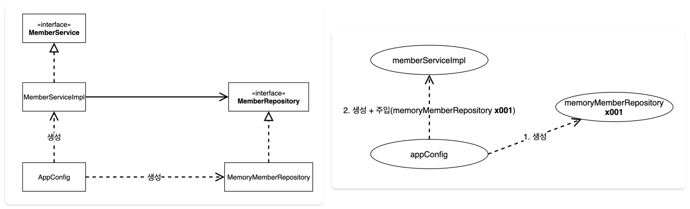
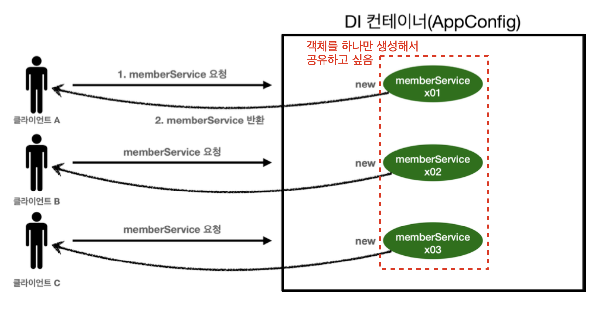
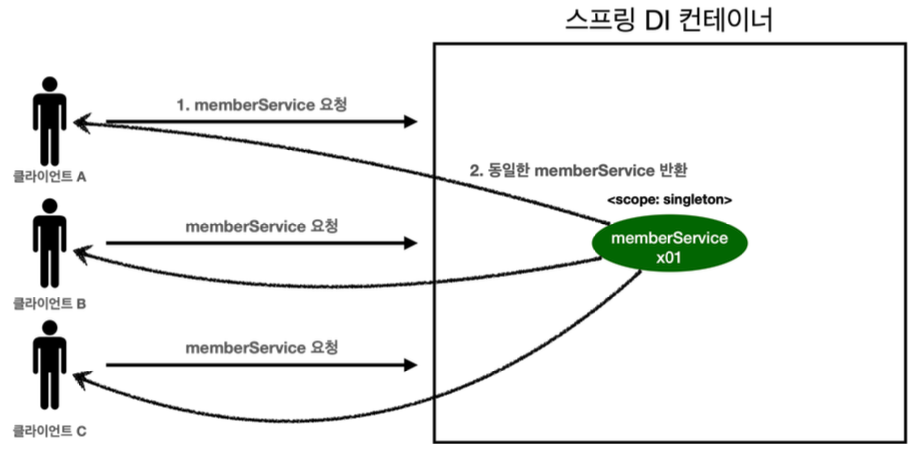

> Spring의 핵심 원리에 대한 이론 및 실습.
>
> [스프링 핵심 원리 - 기본편](https://www.inflearn.com/course/%EC%8A%A4%ED%94%84%EB%A7%81-%ED%95%B5%EC%8B%AC-%EC%9B%90%EB%A6%AC-%EA%B8%B0%EB%B3%B8%ED%8E%B8#)을 듣고 정리한 포스트 입니다.
>
> 해당 포스트에서 나오는 [코드 보기](https://github.com/seungki1011/Data-Engineering/tree/main/spring/springbasic1/src)

---

## Index

1. Object Oriented Design(객체 지향 설계)
   * SOLID 원칙
     * SRP
     * OCP
     * LSP
     * ISP
     * DIP
     * 요약
   * OOD와 Spring
2. Spring 핵심 원리 I - 예제 생성
   * 프로젝트 생성
   * 비즈니스 요구 사항과 설계
   * 회원 도메인 설계, 개발, 테스트
   * 주문과 할인 도메인 설계, 개발, 테스트
3. Spring 핵심 원리 II - 객체 지향 적용
   * 새로운 할인 정책 개발
   * 관심사 분리
   * 새로운 구조와 할인 정책 적용
   * IoC, DI, 컨테이너
     * IoC
     * DI
     * IoC, DI 컨테이너
   * 스프링으로 전환
4. Spring Container, Bean
   * 스프링 컨테이너
   * 스프링 빈 조회
     * 컨테이너에 등록된 모든 빈 조회
     * 빈 조회하기
     * 상속관계의 빈 조회
   * ```BeanFactory```, ```ApplicationContext```
5. Singleton Container
   * 스프링이 없는 순수한 DI 컨테이너
   * 싱글톤 패턴(Singleton Pattern)
   * 스프링의 싱글톤 컨테이너
   * 싱글톤 방식의 주의점
   * ```@Configuration```
6. Component Scan
   * ```@ComponentScan```, ```@Autowired```
   * ```@ComponentScan```의 탐색 위치와 스캔 대상
   * 필터, 중복 등록과 충돌
     * 필터
     * 중복 등록과 충돌돌
7. Dependency Injection (DI, 의존관계 주입)
   * DI(의존관계 주입)
     * 생성자 주입
     * 수정자 주입
     * 필드 주입
     * 메서드 주입
   * ```@Autowired``` 옵션 처리
   * 생성자 주입 권장
   * ```@Autowired 필드명```, ```@Qualifier```, ```@Primary```
     * 조회되는 빈이 2개 이상인 문제
     * ```@Autowired 필드명``` 매칭
     * ```@Qualifier```
     * ```@Primary```
   * 조회한 빈이 모두 필요한 경우
8. Spring Bean Lifecycle Callbacks(빈 생명주기 콜백)
   * 빈 생명주기 콜백
   * 초기화, 소멸 메서드 지정
   * ```@PostConstruct```, ```@PreDestroy```
9. Spring Bean Scope
   * Singleton vs Prototype
     * 싱글톤과 프로토타입 비교
     * 싱글톤과 프로토타입 함께 사용시의 문제
   * Provider
   * Web Scope
     * 웹 스코프 소개
     * Request Scope
10. 전체 요약

---

## Requirements

* Java 17 or 21
* Spring Boot 3.2.2

---

## 1) Object Oriented Design(객체 지향 설계)

### 1-1. SOLID 원칙

**SOLID**란 객체 지향 설계의 5가지 원칙이다. 각 원칙은 다음과 같다.

1. Single Responsibility Principle(SRP) : 단일 책임 원칙
1. Open Close Principle(OCP) : 개방 폐쇄 원칙
1. Liskov Substitution Principle(LSP) : 리스코프 치환 원칙
1. Interface Segragation Principle(ISP) : 인터페이스 분리 원칙
1. Dependency Inversion Principle(DIP) : 의존관계 역전 원칙

<br>

#### 1-1-1. SRP (단일 책임 원칙)

* **하나의 클래스는 하나의 책임만 가진다**
* 책임이라는 것은 무엇일까?
* 이 **책임의 범위라는 것은 문맥과 상황에 따라 다를 수 있다** → 적절히 밸런스를 맞추는 것이 중요
* 어떤 변경이 있을 때 파급 효과가 적다면 SRP를 잘 따른 것
  * 예) 객체의 생성과 사용의 분리

책임의 범위라는 것을 예를 들어 설명하자면, ```Shape```라는 클래스가 존재한다고 하자.

```python
# 이번 예시는 파이썬 사용
class Shape:
    def draw(self):
        # draw the shape

    def resize(self):
        # resize the shape

    def calculate_area(self):
        # calculate the area of the shape
```

```Shape``` 라는 클래스는 ```draw```, ```resize``` 등 여러가지 메서드를 통해 여러 작업이 가능하기 때문에, 좁은 범위의 SRP에서는 위의 클래스는 SRP를 위반하는 것일 수 있다. 그러나 넓은 범위로 SRP를 해석하는 경우, ```Shape```라는 클래스는 어떤 모양(도형)을 나타내고 조정하는 하나의 단일 책임을 나타내기 때문에 SRP를 잘 따른다고 볼 수도 있는 것이다.

이 처럼 SRP에서 책임의 범위를 상황에 따라 잘 정해서, 특정 변경이 있을 때 파급 효과가 적도록 설계한다면 SRP를 잘 따른다고 생각하면 편하다.

<br>

#### 1-1-2. OCP (개방 폐쇄 원칙)

* **소프트웨어 요소는 확장에 열려있으나 변경에는 닫혀 있어야 한다**
* 새로운 기능이나 요소를 추가할 때 기존의 코드 변경 없이 추가가 가능해야 한다 
* 다형성을 활용하면 된다!
  * 다형성을 통해서 클라이언트를 변경하지 않고 서버의 구현된 기능을 유연하게 변경 가능해야 한다
* 인터페이스를 구현한 새로운 클래스를 만들어서 새로운 기능을 구현하거나 추가한다
* 역할과 구현의 분리를 생각하면 된다 (물론 이것만으로 OCP를 지켰다고 볼 수는 없다)
  * 예) 역할 : 도형 / 구현 : 원, 사각형, 삼각형 등
  * 역할과 구현의 분리를 위해서 인터페이스를 안정적으로 잘 설계하는 것이 중요하다

이전의 [Spring 소개](https://github.com/seungki1011/Data-Engineering/blob/main/spring/notes/(001)Spring%20Introduction.md)에서의 [회원 관리 기능 예제](https://github.com/seungki1011/Data-Engineering/blob/main/spring/notes/(001)Spring%20Introduction.md#4-%ED%9A%8C%EC%9B%90-%EA%B4%80%EB%A6%AC-%EA%B8%B0%EB%8A%A5-%EA%B0%9C%EB%B0%9C-i)에서 레포지토리의 인터페이스를 바탕으로 클래스를 구현해서 갈아 끼우듯이 사용한 것을 떠올려보자. 

```java
public class MemberService {
    // private MemberRepository memberRepository = new MemoryMemberRepository(); // 기존 코드
    private MemberRepository memberRepository = new JDBCMemberRepository(); // 새로운 코드로 변경
    /*
     * ...
     */
}
```

<p align="center">    </p>

<p align='center'>인프런 - 스프링 핵심 원리 : 기본편</p>

위의 경우에 다형성을 사용했지만 OCP 원칙을 완변히 지켰다고 볼 수는 없다. 왜냐하면 ```MemberService``` 클라이언트가 구현 클래스를 직접 선택하고 있기 때문이다. 구현 객체를 변경하기 위해서는 클라이언트 코드를 변경해야하는 경우 인것이다. 이 **문제를 해결하기 위해서는 객체를 생성하고, 연관관계를 맺어주는 별도의 조립, 설정자가 필요하다.** (이것을 해결하기 위해 스프링의 DI, IoC 컨테이너 등을 사용한다고 볼 수 있다) 

> 전략 패턴(Strategy Pattern) 찾아보기

<br>

#### 1-1-3. LSP (리스코프 치환 원칙)

* 프로그램의 객체는 프로그램의 정확성을 깨드리지 않으면서 하위 타입의 인스턴스로 바꿀 수 있어야 한다
  * objects of a superclass should be able to be replaced with objects of a subclass without affecting the correctness of the program
  * in simpler terms, if a class is a subtype of another class, it should be usable wherever its parent class is used
* LSP를 지킨다는 것은 다형성에서 하위 클래스는 인터페이스 규약을 다 지켜야 한다는 것
  * 예) 자동차 인터페이스의 엑셀 기능은 앞으로 가는 기능이다, 만약에 엑셀을 통해서 뒤로 갈 수 있도록 구현을 하게되면 LSP를 위반한 것임
* 인터페이스를 구현한 구현체를 믿고 사용하기 위한 원칙이라고 볼 수 있음

<br>

#### 1-1-4. ISP (인터페이스 분리 원칙)

* 자신이 사용하지 않는 메서드에 의존하지 않는다
  * 쉽게 말해서 클래스는 사용하지 않을 인터페이스는 구현하지 않아야 한다는 원칙이다
* 특정 클라이언트를 위한 인터페이스 여러개가 범용적인 인터페이스 하나보다 낫다
  * 예) 자동차 인터페이스 → 운전 인터페이스, 정비 인터페이스 등으로 분리
  * 예) 사용자 클라이언트 → 운전자 클라이언트, 정비사 클라이언트 등으로 분리
  * 인터페이스를 분리하면 정비 인터페이스 자체가 변해도 운전자 클라이언트에 영향을 주지 않음
* 분리하면 인터페이스가 명확해지고, 대체 가능성이 높아진다

ISP 원칙이라는 것은 결국 인터페이스가 너무 광범위하면 인터페이스를 구현하는 클래스들이 사용하지도 않을 메서드를 오버라이딩 해야하는 상황이 발생한다. 이를 방지하기 위해서 인터페이스는 지나치게 많은 기능을 구현하면 안되고, 인터페이스를 사용하는 객체 기준으로 적당히 분리되어야 한다.

<br>

#### 1-1-5. DIP (의존관계 역전 원칙)

* 추상화에 의존 해야하고, 구체화에 의존하면 안된다 → 의존성 주입은 이 원칙을 따르는 방법 중 하나다
* 쉽게 이야기해서 구현 클래스에 의존하지 말고 인터페이스에 의존하라는 뜻이다
  * 클라이언트가 인터페이스에 의존해야 유연하게 구현체를 변경할 수 있다
* 역할과 구현에서 "역할"을 바라보고 의존해야 한다는 것 

이전의 **OCP**에서 사용한 예시를 가져와보자.

```java
public class MemberService {
    // private MemberRepository memberRepository = new MemoryMemberRepository(); // 기존 코드
    private MemberRepository memberRepository = new JDBCMemberRepository(); // 새로운 코드로 변경
    /*
     * ...
     */
}
```

```MemberService```는 ```MemoryMemberRepository```에 대해 알고 있다. 알고 있다는 것은 의존한다는 것과 같다. 이것은 **DIP 원칙을 위반**한다는 뜻. ```MemberRepository```만 의존해야하는데, 그 구현체인 ```MemoryMemberRepositor```와 ```JDBCMemberRepository```에도 의존하고 있다. 

<br>

#### 1-1-6. 요약

* 객체 지향의 핵심은 다형성
* 다형성만 가지고 구현 객체를 변경할 때 클라이언트 코드도 함께 변경된다
* **다형성만으로 OCP, DIP 원칙을 지킬 수 없다** 

다형성외에 추가적으로 필요한 요소를 스프링에서 찾아보자.

<br>

---

### 1-2. OOD와 스프링

스프링은 결국 의존성 주입(DI)와 DI 컨테이너 등의 기술을 지원해서 **다형성에 OCP, DIP를 가능하게 해준다**. 이를 통해 스프링을 이용하면 클라이언트 코드의 변경 없이 기능 확장이 가능하다. 

스프링이 나오게 된 배경은 결국 다음과 같다.

* 순수하게 자바로만 OCP, DIP 원칙을 통해 개발을 하면 너무 어려움(할 일이 너무 많음)
* 스프링 없이 OCP, DIP를 구현하려고 하면 결국에는 스프링 프레임워크(정확하게는 DI 컨테이너의 개념)를 만들어서 개발을 하게 되는 방향성으로 흘러감

> 실무에서의 고민
>
> * 인터페이스 도입에는 추상화라는 비용이 발생
> * 기능 확장의 가능성이 없다면, 구체 클래스를 직접 사용하고 향후에 필요한 경우 리팩토링해서 인터페이스를 구현하는 것도 방법

<br>

---

## 2) Spring 핵심 원리 I - 예제 생성

처음의 예시 프로젝트는 스프링 없이 순순하게 자바만을 사용해서 구현. (프로젝트 생성은 스프링 부트 사용)

### 2-1. 프로젝트 생성

[https://start.spring.io/](https://start.spring.io/)에서 프로젝트 생성하기

<p align="center">    </p>

* 스프링이나 자바 필요에 맞게 스테이블한 버전을 선택해서 사용하면 됨 
* Generate로 생성 후  ```build.gradle``` 파일을 통해 프로젝트 오픈

<br>

<p align="center">    </p>

* Mac : 위의 탭으로 가서 ```File``` → ```Project Structure``` 선택

<br>

<p align="center">    </p>

* 위의 탭으로 가서 ```IntelliJIDEA``` → ```Settings``` 에서 ```Gradle``` 설정으로 들어간다
* Build and Run 설정은 ```IntelliJ IDEA``` 사용
* **필수 아님!** ```IntelliJ IDEA```로 빌드와 런하는 것이 프로젝트 설정, 규모에 따라 빠를수도 있음

<br>

---

### 2-2. 비즈니스 요구 사항과 설계

예시 프로젝트의 비즈니스 요구 사항이 무엇이고, 대략적인 설계에 대한 내용.

먼저 **비즈니스 요구 사항**에 알아보자.

1. 회원
   * 회원 가입과 조회가 가능하다
   * 회원 등급에는 일반과 VIP 등급이 존재한다
   * 회원 데이터를 위해 자체 DB를 구축할 수 있고, 외부 시스템을 사용할 수도 있다 (미정)
2. 주문과 할인 정책
   * 회원은 상품 주문이 가능하다
   * 회원 등급에 따라 할인 정책이 다르게 적용될 수 있다
   * 할인 정책에서 VIP는 1000원을 할인해주는 고정 금액 할인을 적용한다 (나중에 변경 가능)
   * 할인 정책은 변경 가능성이 높다
     * 회사의 기본 할인 정책은 정해지지 않았다 (미정)
     * 서비스 개시 전 까지 고민하고, 최악의 경우 할인 적용이 없을 수도 있다 (미정)

일단 인터페이스를 만들어서 구현체를 언제든지 변경할 수 있는 객체 지향적 설계를 시도하기도 한다.

<br>

---

### 2-3. 회원 도메인 설계

비즈니스 요구 사항을 들었으니 회원 도메인에 대한 설계를 해보자. 들어가기에 앞서 회원 도메인에 대한 요구사항 다시 한번 살펴보자.

* 회원 도메인
  * 회원 가입과 조회가 가능하다
  * 회원 등급에는 일반과 VIP 등급이 존재한다
  * 회원 데이터를 위해 자체 DB를 구축할 수 있고, 외부 시스템을 사용할 수도 있다 (미정)

이제 회원 도메인에 대한 설계를 해보자.

<p align="center">    </p>

<p align='center'>회원 도메인의 협력 관계도</p>

* 클라이언트가 회원 서비스를 호출한다, 이때 회원 서비스는 다음의 두 가지 기능을 제공해주는 레이어다
  * 회원 가입
  * 회원 조회
* 회원 저장소 인터페이스를 만들 것이다
* 회원 저장소 인터페이스의 구현체는 다음의 3가지 구현체를 만들 것
  * 메모리 회원 저장소 : 로컬 내의 메모리에 데이터를 저장하는 저장소 (오로지 개발용)
  * DB 회원 저장소
  * 외부 시스템 연동 회원 저장소 

<br>

<p align="center">    </p>

<p align='center'>회원 클래스 다이어그램</p>

* 실제 구현은 위의 다이어그램대로 구현할 예정
* 외부 시스템 연동 회원 저장소도 추가 될 가능성이 있음

<br>

<p align="center">    </p>

<p align='center'>회원 객체 다이어그램</p>

* 실제 서버에 올라갈 때 객체간의 참조는 다음과 같이 된다
  * 클라이언트 → 회원 서비스(```MemberServiceImpl```) → 메모리 회원 저장소 (```MemoryMemberRepository```)

<br>

---

### 2-4. 회원 도메인 개발

이전 설계를 바탕으로 회원 도메인에 대한 개발을 시작해보자.

```member/Grade```

```java
public enum Grade {
    BASIC,
    VIP
}
```

```member/Member```

```java
public class Member {
    private Long id;
    private String name;
    private Grade grade;

    public Member(Long id, String name, Grade grade) {
        this.id = id;
        this.name = name;
        this.grade = grade;
    }

    // Getter and Setter
    public Long getId() { return id; }
    public void setId(Long id) { this.id = id; }
    public String getName() { return name; }
    public void setName(String name) { this.name = name; }
    public Grade getGrade() { return grade; }
    public void setGrade(Grade grade) { this.grade = grade; }
}
```

```member/MemberRepository```

```java
public interface MemberRepository {
    // 회원 저장
    void save(Member member);
    // 회원 아이디로 회원 찾기
    Member findById(Long memberId);
}
```

```member/MemoryMemberRepository```

```java
public class MemoryMemberRepository implements MemberRepository{
    // 간단한 예시라서 동시성 고려 없이 구현 (Concurrent HashMap 사용 x)
    private static Map<Long, Member> store = new HashMap<>();
    
  	@Override
    public void save(Member member) {
        store.put(member.getId(), member);
    }

    @Override
    public Member findById(Long memberId) {
        return store.get(memberId);
    }
```

* 원래 인터페이스에 대한 구현체는 다른 패키지에 관리하는 것을 권장하지만, 간단한 예시이므로 같은 패키지에서 개발

<br>

```member/MemberService```

```java
public interface MemberService {
    // 회원 가입
    void join(Member member);
    // 회원 조회
    Member findMember(Long memberId);
}
```

```member/MemberServiceImpl```

```java
public class MemberServiceImpl implements MemberService{
    // 구현 객체를 선택해야 함
    private final MemberRepository memberRepository = new MemoryMemberRepository();
    
  	@Override
    public void join(Member member) {
        memberRepository.save(member);
    }

    @Override
    public Member findMember(Long memberId) {
        return memberRepository.findById(memberId);
    }
}
```

* 단일 구현체인 경우 관례상 이름에 ```Impl```을 붙여주는 경우가 많다

<br>

---

### 2-5. 회원 도메인 실행과 테스트

회원 도메인이 정상적으로 동작하는지 확인해보자.

```test/member/MemberServiceTest```

```java
public class MemberServiceTest {

    MemberService memberService = new MemberServiceImpl();

    @Test
    void join() {
        // given - 주어진 상황(데이터, 등)
        Member member = new Member(1L, "messi", Grade.VIP);

        // when - 이것을 실행할 때
        memberService.join(member);
        Member findMember = memberService.findMember(1L);

        // then - 이런 결과가 나와야 한다(검증)
        Assertions.assertThat(member).isEqualTo(findMember);
    }
}
```

* given, when, then 으로 테스트 코드를 짜는 것은 공식이 아님!
  * 상황에 따라서 적용하는 일종의 가이드 처럼 생각하는게 편함

지금까지 개발한 회원 도메인에서 문제가 존재함. ```MemberServiceImpl```에서 추상화(```MemberRepository```)에도 의존하고 구현체(```MemoryMemberRepository```)에도 의존하고 있음. 즉 DIP를 위반하고 있다. 

<br>

---

### 2-6. 주문과 할인 도메인 설계

주문과 할인 도메인을 설계 해보자. 들어가기에 앞서 주문과 할인 정책에 대한 요구사항을 다시 한번 살펴보자.

* 주문과 할인 정책
  * 회원은 상품 주문이 가능하다
  * 회원 등급에 따라 할인 정책이 다르게 적용될 수 있다
  * 할인 정책에서 VIP는 1000원을 할인해주는 고정 금액 할인을 적용한다 (나중에 변경 가능)
  * 할인 정책은 변경 가능성이 높다
    * 회사의 기본 할인 정책은 정해지지 않았다 (미정)
    * 서비스 오픈 전 까지 고민하고, 최악의 경우 할인 적용이 없을 수도 있다 (미정)

이제 주문과 할인 도메인에 대한 설계를 해보자.

<p align="center">    </p>

<p align='center'>주문 도메인의 관계, 역할, 책임</p>

* **주문 생성** : 클라이언트는 주문 서비스에 주문 생성을 요청할 수 있다
  * 간단한 예제를 위해서 그냥 상품의 정보 자체를 넘김
  * 실제로 개발할 때는 아이템이라는 객체를 만들어서  사용함
* **회원 조회** : 할인을 위해서는 회원 등급이 필요하기 때문에 주문 서비스는 회원 저장소에서 회원을 조회한다
  * 회원 정보에서 등급과 같은 정보를 조회 
* **할인 적용** : 주문 서비스는 회원 등급에 따른 할인 여부를 할인 정책에 위임한다 
* **주문 결과 반환** : 주문 서비스는 할인 결과를 포함한 주문 결과를 반환한다
* 간단한 예시를 위해 주문 데이터를 DB에 저장하는 과정은 생략 

<br>

이제 구현에 대한 내용까지 포함한 다이어그램을 살펴보자.

<p align="center">    </p>

<br>

<p align="center">    </p>

<p align='center'>주문 도메인의 구현체</p>

**역할과 구현의 분리**를 통해서 구현 객체의 조립이 자유로워진다. 

<br>

---

### 2-7. 주문과 할인 도메인 개발

이전 설계를 바탕으로 주문과 할인 도메인에 대한 개발을 진행한다.

```discount/DiscountPolicy```

```java
public interface DiscountPolicy {
    /**
     * @return 할인 대상 금액 (호출시 할인 금액을 리턴)
     */
    int discount(Member member, int price);
}
```

```discount/FixDiscountPolicy```

```java
public class FixDiscountPolicy implements DiscountPolicy{
    
  	private int discountFixAmount = 1000; // 고정 할인값 : 1000원
  
    @Override
    public int discount(Member member, int price) {
        if (member.getGrade() == Grade.VIP) { // enum은 "==" 사용해도 됨
            return discountFixAmount;
        } else {
            return 0;
        }
    }
}
```

<br>


```order/Order```

```java
public class Order {
    private Long memberId;
    private String itemName;
    private int itemPrice;
    private int discountPrice;

    public Order(Long memberId, String itemName, int itemPrice, int discountPrice) {
        this.memberId = memberId;
        this.itemName = itemName;
        this.itemPrice = itemPrice;
        this.discountPrice = discountPrice;
    }

    // 계산 로직 (최종 가격 계산)
    public int calculatePrice() {
        return itemPrice - discountPrice;
    }

		/**
		 * Getter and Setter 구현
		 */

    // 객체 출력시 toString의 결과가 나옴
    @Override
    public String toString() {
        return "Order{" +
                "memberId=" + memberId +
                ", itemName='" + itemName + '\'' +
                ", itemPrice=" + itemPrice +
                ", discountPrice=" + discountPrice +
                '}';
    }
}
```

```order/OrderService```

```java
public interface OrderService {
    // 주문 생성
    Order createOrder(Long memberId, String itemName, int itemPrice);
}
```

```order/OrderServiceImpl```

```java
public class OrderServiceImpl implements OrderService{
    /*
     * OrderService는 할인에 대한 변경을 건들 필요가 없음!(단일 책임의 원칙)
     * 할인에 대한 내용은 DiscountPolicy가 담당
     */
    private final MemberRepository memberRepository = new MemoryMemberRepository();
    private final DiscountPolicy discountPolicy = new FixDiscountPolicy();
    @Override
    public Order createOrder(Long memberId, String itemName, int itemPrice) {
        Member member = memberRepository.findById(memberId);
        int discountPrice = discountPolicy.discount(member, itemPrice);
        // 최종 생성되는 주문 반환
        return new Order(memberId, itemName, itemPrice, discountPrice);
    }
}
```

<br>

---

### 2-8. 주문과 할인 도메인 실행과 테스트

개발한 주문과 할인 도메인에 대한 테스트.

```test/order/OrderServiceTest```

```java
public class OrderServiceTest {

    MemberService memberService = new MemberServiceImpl();
    OrderService orderService = new OrderServiceImpl();

    @Test
    void createOrder() {
        Long memberId = 1L;
        Member member = new Member(memberId, "messi", Grade.VIP);
        memberService.join(member);

        Order order = orderService.createOrder(memberId, "pizza", 18000);
        Assertions.assertThat(order.getDiscountPrice()).isEqualTo(1000);
    }
}
```

<br>

---

## 3) Spring 핵심 원리 II - 객체 지향 적용

객체 지향의 원리들을 다시 한번 알아보면서, 지금까지 작성했던 코드에 적용해본다.

### 3-1. 기존 예제의 할인 정책 변경

기존의 고정 할인 정책을 정률 할인으로 바꿀려고 함.

* 예) 20000원에 10% 할인 적용 → 2000원 할인

기존의 ```FixDiscountPolicy```를 ```RateDiscountPolicy```로 변경해서 개발하면 됨. (구현체 추가)

```discount/RateDiscountPolicy```

```java
public class RateDiscountPolicy implements DiscountPolicy{

    private int discountPercent = 10; // 정률 할인 비율 : 10% 할인

    @Override
    public int discount(Member member, int price) {
        if (member.getGrade() == Grade.VIP) {
            return price * discountPercent / 100;
        } else {
            return 0;
        }
    }
}
```

* 인텔리제이 : 오버라이드한 메서드 위에 ```ctrl + shift + t``` 단축키로 테스트 코드를 위한 패키지와 클래스 생성 해줌

<br>

```test/discount/RateDiscountPolicyTest```

```java
class RateDiscountPolicyTest {
    RateDiscountPolicy discountPolicy = new RateDiscountPolicy();

    @Test
    @DisplayName("VIP는 10% 할인 적용")
    void vip_o() {
        // given
        Member member = new Member(1l, "mbappeVip", Grade.VIP);
        // when
        int discount = discountPolicy.discount(member, 20000);
        // then
        Assertions.assertThat(discount).isEqualTo(2000); // Assertions 스태틱 임포트 권장
    }

    // 실패하는 경우도 테스트
    @Test
    @DisplayName("VIP가 아닌 경우 할인 없음")
    void vip_x() {
        // given
        Member member = new Member(2l, "ronaldoBasic", Grade.BASIC);
        // when
        int discount = discountPolicy.discount(member, 20000);
        // then
        Assertions.assertThat(discount).isEqualTo(2000);
    }
}
```

<br>

이제 ```RateDiscountPolicy```를 적용해보자.

```order/OrderServiceImpl```

```java
public class OrderServiceImpl implements OrderService{

    private final MemberRepository memberRepository = new MemoryMemberRepository();
  
//    private final DiscountPolicy discountPolicy = new FixDiscountPolicy();
    private final DiscountPolicy discountPolicy = new RateDiscountPolicy();

		/**
		 * 기존 구현
		 */
}
```

* 할인 정책 변경을 위해서는 클라이언트 코드인 ```OrderServiceImpl```를 고쳐야 한다
* 지금 상태의 코드는 다형성을 활용해서 인터페이스와 구현 객체를 분리했지만 **OCP, DIP를 준수했다고 보기는 어렵다**
  * 왜?
    * DIP : 인터페이스인 ```DiscountPolicy``` 뿐만 아니라, 구현체인 ```FixDiscountPolicy```와 ```RateDiscountPolicy```에도 의존하고 있다
    * OCP : 현재의 코드에 기능을 확장하려면 결국 클라이언트 코드를 변경해줘야 한다

<br>

<p align="center">    </p> 

<p align='center'>OCP 위반</p>

<br>
 DIP와 OCP 위반을 해결하기 위한 방법은 무엇일까?

* 먼저 DIP 위반은 추상(인터페이스)에만 의존하도록 변경해야 한다

그러면 인터페이스에만 의존하도록 설계를 바꿔보자.

```order/OrderServiceImpl```

```java
public class OrderServiceImpl implements OrderService{

    private final MemberRepository memberRepository = new MemoryMemberRepository();
  	
  	private DiscountPolicy discountPolicy; // 인터페이스에만 의존!
		// private final DiscountPolicy discountPolicy = new FixDiscountPolicy();
    // private final DiscountPolicy discountPolicy = new RateDiscountPolicy();

		/**
		 * 나머지 구현 부분
		 */
}
```

* ```discountPolicy```에 아무것도 할당 되어있지 않기 때문에 ```NullPointerException```
* 이 문제를 해결하기 위해서는 누군가 클라이언트인 ```OrdserServieImpl```에 ```DiscountPolicy```의 **구현 객체를 대신 생성하고 주입해줘야 함!**

<br>

---

### 3-2. 관심사의 분리

* 관심사를 분리하자! 그런데 관심사를 분리한다는 건 뭔 뜻일까?
* 구현 객체는 딱 본인의 역할에 집중을 해야한다 → 구현 객체에게 맡겨지지 않은 책임은 다른 곳으로 분리해야 함

책임을 분리하기 위해서 ```AppConfig```라는 클래스를 도입해보자.

```AppConfig```

```java
public class AppConfig {
    // 생성자 주입을 통해서 구현체 선택
    public MemberService memberService() {
        return new MemberServiceImpl(new MemoryMemberRepository());
    }

    public OrderService orderService() {
        return new OrderServiceImpl(
                new MemoryMemberRepository(), new FixDiscountPolicy()
        );
    }
}
```

* ```AppConfig```는 애플리케이션의 전체 동작 방식을 설정(구성)하기 위해서, 구현 객체를 생성하고 연결해주는 책임을 가지는 별도의 클래스이다
* ```AppConfig```는 동작에 필요한 구현 객체를 생성 해줌
  * ```MemberServiceImpl```
  * ```MemoryMemberRepository```
  * ```OrderServiceImpl```
  * ```FixDiscountPolicy```
* 생성한 인스턴스의 참조를 생성자를 통해 주입(연결) 해줌
  * ```MemberServiceImpl```→```MemoryMemberRepository```
  * ```OrderServiceImpl```→```MemoryMemberRepository```, ```FixDiscountPolicy```

<br>

```member/MemberServiceImpl```

```java
public class MemberServiceImpl implements MemberService{

		// 오로지 인터페이스에만 의존!
    private MemberRepository memberRepository;

    // 생성자를 통해서 구현체를 선택할 것이다 (주입)
    public MemberServiceImpl(MemberRepository memberRepository) {
        this.memberRepository = memberRepository;
    }

		/**
		 * 나머지 구현 부분
		 */
}
```

```order/OrderServiceImpl```

```java
public class OrderServiceImpl implements OrderService{
		
  	// 오로지 인터페이스에만 의존!
    private final MemberRepository memberRepository;
    private final DiscountPolicy discountPolicy;
		
  	// 생성자를 통해 주입
    public OrderServiceImpl(MemberRepository memberRepository, DiscountPolicy discountPolicy) {
        this.memberRepository = memberRepository;
        this.discountPolicy = discountPolicy;
    }
  
		/**
		 * 나머지 구현 부분
		 */
}
```

* 이제는 어떤 구현 객체를 주입하는지는 오로지 ```AppConfig```가 결정하기 때문에 ```MemberServiceImpl```, ```OrderServiceImpl```은 실행에만 집중하면 된다
*  객체를 생성하고 연결(주입)하는 책임 그리고 실행하는 책임이 분리되었기 때문에 관심사를 분리했다고 볼 수 있다
* 이제 추상(인터페이스)에만 의존하기 때문에 DIP를 준수한다 

<br>

<p align="center">    </p> 

* 클라이언트인 ```memberServiceImpl``` 입장에서는 의존관계(Dependecy)를 마치 외부에서 주입해주는 것 같다고 해서 DI(Dependency Injection, 의존성 주입)라고 한다

<br>

그럼 ```AppConfig```를 사용하도록 테스트 코드를 수정해보자.

```test/order/OrderServiceTest```

```java
public class OrderServiceTest {

    MemberService memberService;
    OrderService orderService;

    // MemberService memberService = new MemberServiceImpl(memberRepository);
    // OrderService orderService = new OrderServiceImpl(memberRepository, discountPolicy);

    @BeforeEach
    public void beforeEach() {
        AppConfig appConfig = new AppConfig();
        memberService = appConfig.memberService();
        orderService = appConfig.orderService();
    }

    @Test
		/**
		 * 기존 구현
		 */
}
```

* ```MemberServiceTest```도 동일하게 ```AppConfig```를 사용하도록 변경하면 된다

<br>

이제 ```AppConfig```를 리팩토링 해보자. 현재 ```AppConfig```의 문제점은 역할에 따른 구현이 잘 안보인다는 것이다.

```AppConfig```

 ```java
 public class AppConfig {
   
     public MemberService memberService() {
         return new MemberServiceImpl(memberRepository());
     }
 
     // 추후에 변경시 이 부분만 수정하면 됨
     public MemberRepository memberRepository() {
         return new MemoryMemberRepository();
     }
 
     public OrderService orderService() {
         return new OrderServiceImpl(memberRepository(), discountPolicy());
     }
 
     // 추후에 변경시 이 부분만 수정하면 됨
     public DiscountPolicy discountPolicy() {
         return new FixDiscountPolicy();
     }
 
 }
 ```

* 인텔리제이 : ```cmd + option + m``` 으로 메서드 추출

<br>

---

### 3-3. 새로운 구조와 할인 정책 적용

정액 할인 정책(```FixedDiscoutPolicy```)을 정률 할인 정책(```RateDiscountPolicy```)로 변경해보자.

<p align="center">    </p>  

<p align='center'>할인 정책 변경</p>

* 구성 영역만 변경하면 되고, 사용 영역은 전혀 영향을 받지 않는다

<br>

```AppConfig``` 를 수정하자.

```java
public class AppConfig {
  
		/**
		 * 기존 구현
		 */

    // 추후에 변경시 이 부분만 수정하면 됨 -> 이제 여기를 수정하면 된다
    public DiscountPolicy discountPolicy() {
        // return new FixDiscountPolicy();
      	return new RateDiscountPolicy(); // FixDiscount-> RateDiscount로 변경
    }
}
```

* 정액 할인 정책(```FixedDiscoutPolicy```)을 정률 할인 정책(```RateDiscountPolicy```)로 변경했다
* 아주 간단하게 ```AppConfig```의 일부만 수정해서 할인 정책을 변경했다
  * 사용 영역은 그 어떤 부분도 건들지 않았음!

이제 코드는 OCP와 DIP를 전부 준수하는 코드이다.

> 지금까지의 코드는 SRP, DIP, OCP를 적용했다
>
> * SRP
>   * 단일 책임의 원칙을 따르면서 관심사를 분리
>   * ```AppConfig```를 통해서 관심사를 분리
>   * ```AppConfig```는 구현 객체를 생성하고 연결해주는 책임을 가짐
>   * 클라이언트는 실행하는 책임만 가짐
> * DIP
>   * ```AppConfig```가 구현체를 생성하고 클라이언트 코드에 주입해주기 때문에, 클라이언트 코드는 추상(인터페이스)만 의존한다
> * OCP
>   * 다형성을 사용하면서 DIP도 준수
>   * 사용 영역과 구성 영역(```AppConfig```)으로 나눔
>   * 새로운 요소를 추가해도 사용 영역은 닫혀 있음 (코드 변경 안해도 됨)

<br>

---

### 3-4. IoC, DI, 컨테이너

IoC(제어의 역전, Inversion of Control), DI(Dependecny Injection) 그리고 컨테이너(Container)에 대해서 알아보자.

#### 3-4-1. IoC(제어의 역전)

> 말 그대로 제어의 역전을 의미한다. 프로그래머가 작성한 프로그램이 프레임워크의 [흐름 제어](https://ko.wikipedia.org/wiki/흐름_제어)를 받게 되는 소프트웨어 디자인 패턴을 말한다. 줄여서 **IoC**(Inversion of Control)이라고 부른다. 전통적인 프로그램에서의 흐름은 프로그래머가 작성한 프로그램이 라이브러리의 코드를 호출해 이용한다. 하지만 제어의 역전이 적용된 구조에서는 프레임워크의 코드가 프로그래머가 작성한 코드를 호출한다.

* 기존에는 클라이언트 구현 객체가 스스로 필요한 서버 구현 객체를 생성, 연결, 실행했음 → 즉, 구현 객체가 프로그램의 제어 흐름을 컨트롤
* **제어의 역전(IoC)**이라는 것은 구현 객체가 자신의 로직을 실행하는 역할만 담당하고, 제어의 흐름은 외부에서 컨트롤 되는 것을 말한다
* 우리의 코드를 예시로 들자면, ```AppConfig```가 프로그램의 제어 흐름을 컨트롤 해주고, ```OrderServiceImpl```은 자신의 로직만을 실행한다

<br>

#### 3-4-2. DI(의존성 주입)

> 의존성 주입은 프로그램 디자인이 [결합도](https://ko.wikipedia.org/wiki/결합도)를 느슨하게 되도록하고 [의존관계 역전 원칙](https://ko.wikipedia.org/wiki/의존관계_역전_원칙)과 단일 책임 원칙(SRP)을 따르도록 클라이언트의 생성에 대한 의존성을 클라이언트의 행위로부터 분리하는 것이다.
>
> 의존성 주입의 의도는 객체의 생성과 사용의 관심을 분리하는 것이다.

* 의존관계는 정적인 클래스의 의존관계와. 실행 시점에 결정되는 동적인 객체(인스턴스)의 의존관계를 분리해서 생각해야 한다
* **정적인 클래스 의존관계** : 클래스가 사용하는 ```import``` 코드만 보고 의존관계를 판단할 수 있다
  * 예) ```OrderServiceImpl```은 ```MemberRepository```, ```DiscountPolicy```에 의존하는 것을 알 수 있다
  * 이 의존관계 만으로는 실제 어떤 객체가 주입될지는 모른다 
* **동적인 객체(인스턴스) 의존관계** : 애플리케이션의 실행 시점(runtime)에 실제 생성된 객체의 참조가 연결된 의존 관계
  * 실행이 되어야 ```MemoryMemberRepository```, ```RateDiscountPolicy```를 의존한다는 것을 알 수 있다
* **애플리케이션 실행 시점(runtime)에 외부에서 실제 구현 객체를 생성하고 클라이언트에 전당해서 클라이언트와 서버의 실제 의존관계가 연결되는 것을 의존관계 주입(Dependency Injection)**이라고 한다

<br>

#### 3-4-3. IoC, DI 컨테이너

* 객체를 생성하고 의존관계를 연결해주는 역할을 해주는 것을 **IoC 컨테이너** 또는 **DI 컨테이너**라고 한다
  *  예) ```AppConfig```가 이 역할을 수행 해준다고 볼 수 있다
* 최근에는 DI 컨테이너로 주로 불리며(의존 관계 주입에 초점을 맞춤), 오브젝트 팩토리라고 부르기도 한다

<br>

---

### 3-5. 스프링으로 전환하기

지금까지 순순하게 자바 코드만으로 DI를 적용한 것을 스프링을 이용하는 것으로 전환해보자.

```AppConfig```

```java
@Configuration 
public class AppConfig {

    @Bean
    public MemberService memberService() {
        return new MemberServiceImpl(memberRepository());
    }

    @Bean
    public OrderService orderService() {
        return new OrderServiceImpl(memberRepository(), discountPolicy());
    }

    @Bean
    public MemberRepository memberRepository() {
        return new MemoryMemberRepository();
    }

    @Bean
    public DiscountPolicy discountPolicy() { return new RateDiscountPolicy(); }
}
```

* ```@Configuration``` : 스프링 컨테이너에 설정에 관한 메타 데이터 제공
  * 한 개 이상의 ```@Bean```을 정의
  * 쉽게 말해서 스프링 컨테이너는 ```@Configuration```이 붙은 클래스를 설정 정보로 이용한다
* ```@Bean``` : 스프링 컨테이너는 ```@Bean```이 붙은 메서드를 호출해서 반환된 객체를 전부 스프링 컨테이너에 등록
  * 스프링 컨테이너에서 빈(Bean)을 관리

<br>

```MemberApp```

```java
public class MemberApp {
    public static void main(String[] args) {

        // AppConfigJava appConfig = new AppConfigJava();
        // MemberService memberService = appConfig.memberService();

        ApplicationContext applicationContext = new AnnotationConfigApplicationContext(AppConfig.class);
        MemberService memberService = applicationContext.getBean("memberService", MemberService.class);

				/**
		 		 * 기존 구현
		 		 */
    }
}
```

<br>

```OrderApp```

```java
public class OrderApp {
    public static void main(String[] args) {
        
        // AppConfig appConfig = new AppConfig();
        // MemberService memberService = appConfig.memberService();
        // OrderService orderService = appConfig.orderService();

        ApplicationContext applicationContext = new AnnotationConfigApplicationContext(AppConfig.class);
        MemberService memberService = applicationContext.getBean("memberService", MemberService.class);
        OrderService orderService = applicationContext.getBean("orderService", OrderService.class);

				/**
		 		 * 기존 구현
		 		 */
    }
}
```

* ```getBean``` : 해당 빈의 인스턴스를 얻을 수 있다

<br>

---

## 4) Spring Container & Bean

스프링 컨테이너와 스프링 빈에 대해서 알아보자.

### 4-1. 스프링 컨테이너

```java
ApplicationContext applicationContext = new AnnotationConfigApplicationContext(AppConfig.class);
```

* 스프링 컨테이너 생성
* ```ApplicationContext``` : 스프링의 컨테이너를 나타내는 인터페이스
  * 빈의 수명주기, 의존관계, 설정 등을 관리
* ```AnnotationConfigApplicationContext``` : ```@Configuration```을 이용해서 스프링 컨테이너에 설정을 제공해주고 싶을 때 사용하는 ```ApplicationContext```의 구현체
* ```AppConfig.class```를 넘겨줘서 해당 설정을 사용한다 

> 스프링 컨테이너는 ```BeanFactory```와 ```ApplicationContext```를 구분해서 이야기 한다.

<br>

스프링에서 컨테이너가 생성되는 과정을 살펴보자.

<p align="center">    </p>  

<p align='center'>스프링 컨테이너 생성</p>

* 스프링 컨테이너를 생성할 때 구성 정보를 지정해야 함

<br>

<p align="center">    </p>  

<p align='center'>스프링 빈 등록</p>

* 컨테이너는 파라미터로 넘어온 설정 클래스 정보를 이용해서 스프링 빈 등록
* ```@Bean```이 붙은 메서드를 전부 호출해서 반환된 객체를 등록한다
* **빈 이름의 경우 항상 다른 이름을 부여해야 한다**

<br>

<p align="center">    </p>  

<p align='center'>스프링 빈 의존관계 설정</p>

* 스프링 컨테이너는 설정 정보를 참고해서 의존관계 주입(DI)
* 여기서 코드로 스프링 빈을 등록할 때 생성자를 호출하면서 DI도 한꺼번에 처리된다
  * 위의 경우 이해를 돕기 위해 개념적으로 나누어서 설명하고 있다
* 스프링 컨테이너에서 DI에 관한 내용은 [```@Autowired```](https://github.com/seungki1011/Data-Engineering/blob/main/spring/notes/(002)Spring%20Core%20-%201.md#7-%EC%9D%98%EC%A1%B4%EA%B4%80%EA%B3%84-%EC%9E%90%EB%8F%99-%EC%A3%BC%EC%9E%85autowired)에서 더 자세하게 다룸

<br>

---

### 4-2. 스프링 빈 조회

이제 스프링 컨테이너에서 데이터를 조회해보자.

#### 4-2-1. 컨테이너에 등록된 모든 빈 확인

컨테이너에 등록된 모든 빈들을 확인해보자.

```test/beanfind/ApplicationContextInfoTest```

```java
public class ApplicationContextInfoTest {
    AnnotationConfigApplicationContext ac = new AnnotationConfigApplicationContext(AppConfig.class);

    @Test
    @DisplayName("Print All Beans")
    void findAllBean() {
        String[] beanDefinitionNames = ac.getBeanDefinitionNames();
        for (String beanDefinitionName : beanDefinitionNames) {
            Object bean = ac.getBean(beanDefinitionName);
            System.out.println("name = "+beanDefinitionName + " object = "+ bean);
        }
    }
}
```

```
name = org.springframework.context.annotation.internalConfigurationAnnotationProcessor object = org.springframework.context.annotation.ConfigurationClassPostProcessor@46b61c56
name = org.springframework.context.annotation.internalAutowiredAnnotationProcessor object = org.springframework.beans.factory.annotation.AutowiredAnnotationBeanPostProcessor@2e48362c
... 생략
name = appConfig object = de.springbasic1.AppConfig$$SpringCGLIB$$0@12d2ce03
name = memberService object = de.springbasic1.member.MemberServiceImpl@7e5c856f
name = orderService object = de.springbasic1.order.OrderServiceImpl@413f69cc
name = memberRepository object = de.springbasic1.member.MemoryMemberRepository@1f53a5dc
name = discountPolicy object = de.springbasic1.discount.RateDiscountPolicy@1b75c2e3
```

<br>

모든 빈이 아니라 애플리케이션의 빈만 출력하고 싶으면 다음을 추가하면 된다.

```java
    @Test
    @DisplayName("Print All Application Beans")
    void findApplicationBean() {
        String[] beanDefinitionNames = ac.getBeanDefinitionNames();
        for (String beanDefinitionName : beanDefinitionNames) {
            BeanDefinition beanDefinition = ac.getBeanDefinition(beanDefinitionName);

            if (beanDefinition.getRole() == BeanDefinition.ROLE_APPLICATION) {
                Object bean = ac.getBean(beanDefinitionName);
                System.out.println("name = "+beanDefinitionName + " object = "+ bean);
            }
        }
    }
```

```
name = appConfig object = de.springbasic1.AppConfig$$SpringCGLIB$$0@2e48362c
name = memberService object = de.springbasic1.member.MemberServiceImpl@1efe439d
name = orderService object = de.springbasic1.order.OrderServiceImpl@be68757
name = memberRepository object = de.springbasic1.member.MemoryMemberRepository@7d446ed1
name = discountPolicy object = de.springbasic1.discount.RateDiscountPolicy@12d2ce03
```

* ```ac.getBeanDefinitionNames()``` : 스프링에 등록된 모든 빈 이름을 조회한다
* ```ac.getBean()``` : 빈 이름으로 빈 인스턴스(객체)를 조회한다 
* ```ROLE_APPLICATION``` : 직업 등록한 애플리케이션 빈
* ```ROLE_INFRASTRUCTURE``` : 스프링 내부에서 사용하는 빈

<br>

#### 4-2-2. 빈 조회하기

스프링 빈을 조회하는 방법들에 대해 알아보자.

* ```ac.getBean(빈이름, 타입)```
* ```ac.getBean(타입)```
* 만약 조회 대상이 없다면 예외 발생

<br>

다음은 기본적인 스프링 빈을 조회하는 방법들이다.

```test/beanfind/ApplicationContextBasicFindTest```

```java
public class ApplicationContextBasicFindTest {
    AnnotationConfigApplicationContext ac = new AnnotationConfigApplicationContext(AppConfig.class);

    @Test
    @DisplayName("Find with Bean Name")
    void findBeanByName() {
        MemberService memberService = ac.getBean("memberService", MemberService.class);

        System.out.println("memberService = " + memberService);
        // System.out.println("memberService.getClass() = " + memberService.getClass());
        Assertions.assertThat(memberService).isInstanceOf(MemberServiceImpl.class);
    }

    @Test
    @DisplayName("Find with Bean Type")
    void findBeanByType() {
        MemberService memberService = ac.getBean(MemberService.class); // 타입으로만 조회

        System.out.println("memberService = " + memberService);
        Assertions.assertThat(memberService).isInstanceOf(MemberServiceImpl.class);
    }

    @Test
    @DisplayName("Find with Specific Type, 구체 타입으로 조회") // 권장하지 않음
    void findBeanBySpecificType() {
        MemberService memberService = ac.getBean("memberService", MemberServiceImpl.class);

        Assertions.assertThat(memberService).isInstanceOf(MemberServiceImpl.class);
    }

    // 실패 테스트
    @Test
    @DisplayName("Find with Bean Name Failed")
    void findBeanByNameFail() {
        // MemberService memberService = ac.getBean("memberService", MemberService.class);

        // 오른쪽의 로직을 실행하면 왼쪽의 예외가 터져야 성공!
        org.junit.jupiter.api.Assertions.assertThrows(NoSuchBeanDefinitionException.class, () ->
                ac.getBean("xxxxx", MemberService.class)); // 스태틱 임포트 권장
    }
}
```

```
memberService = de.springbasic1.member.MemberServiceImpl@46b61c56
memberService.getClass() = class de.springbasic1.member.MemberServiceImpl
```

<br>

이번에는 동일한 타입이 둘 이상 존재하는 경우 스프링 빈을 조회하는 경우를 살펴보자.

* 타입으로 조회시 같은 타입의 빈이 둘 이상이면 오류가 발생한다 → 이때 빈 이름을 지정하자
* ```ac.getBeansOfType()```을 사용하면 해당 타입의 모든 빈을 조회할 수 있다

<br>

```test/beanfind/ApplicationContextSameBeanFindTest```

```java
public class ApplicationContextSameBeanFindTest {
    // AppConfig 대신 아래에서 만든 SameBeanConfig를 사용
    AnnotationConfigApplicationContext ac = new AnnotationConfigApplicationContext(SameBeanConfig.class);

    // 1. 타입으로 빈 조회시 같은 타입이 둘 이상 존재하면 중복 오류 발생
    @Test
    @DisplayName("Find Bean with identical name - 중복 오류")
    void findBeanByDuplicate() {
        // MemberRepository bean = ac.getBean(MemberRepository.class);
        Assertions.assertThrows(NoUniqueBeanDefinitionException.class, () -> ac.getBean(MemberRepository.class));
    }

    // 2. 중복 오류가 발생하면 빈 이름을 지정하면 됨
    @Test
    @DisplayName("빈 이름 지정")
    void findBeanBYName () {
        // 조회하고 싶은 빈의 이름을 직접 지정하면 된다
        MemberRepository memberRepository = ac.getBean("memberRepository1", MemberRepository.class);
        assertThat(memberRepository).isInstanceOf(MemberRepository.class);
    }
    
    // 기존 AppConfig 수정하지 않기 위해서 SameBeanConfig을 새로 만들어서 사용
    @Configuration
    static class SameBeanConfig {
        @Bean
        public MemberRepository memberRepository1() {
            return new MemoryMemberRepository();
        }

        @Bean
        public MemberRepository memberRepository2() {
            return new MemoryMemberRepository();
        }
    }
}
```

중복 오류의 발생은 다음 처럼 나타남.

```
org.springframework.beans.factory.NoUniqueBeanDefinitionException: No qualifying bean of type 'de.springbasic1.member.MemberRepository' available: expected single matching bean but found 2: memberRepository1,memberRepository2
```

<br>

만약 특정 타입을 모두 조회하고 싶으면 다음 처럼 조회하면 된다.

```java
    // 3. 특정 타입 모두 조회하기
    @Test
    @DisplayName("Find all Beans of specific type")
    void findAllBeanByType() {
        Map<String, MemberRepository> beansOfType =
                ac.getBeansOfType(MemberRepository.class);
        
        for (String key : beansOfType.keySet()) {
            System.out.println("key = " + key + " value = " +
                    beansOfType.get(key));
        }

        System.out.println("beansOfType = " + beansOfType);
        assertThat(beansOfType.size()).isEqualTo(2); // 등록 된 빈 2개, 원래는 더 자세하게 검증함
    }
```

```
key = memberRepository1 value = de.springbasic1.member.MemoryMemberRepository@d771cc9
key = memberRepository2 value = de.springbasic1.member.MemoryMemberRepository@36b4091c
beansOfType = {memberRepository1=de.springbasic1.member.MemoryMemberRepository@d771cc9, memberRepository2=de.springbasic1.member.MemoryMemberRepository@36b4091c}
```

<br>

#### 4-2-3. 상속 관계의 빈 조회

* 부모 타입으로 조회하는 경우, 자식 타입도 함께 조회한다
* 자바 객체의 최고 부모인 ```Object``` 타입으로 조회하면 모든 스프링 빈을 조회한다

 <p align="center">    </p>  

<p align='center'>상속 관계의 빈 조회</p>

* 예) ```2```번 빈을 조회하면 그 자식 타입인 ```4```, ```5```도 함께 조회
* 부모 타입으로 조회시 자식이 둘 이상 있으면 중복 오류가 발생한다 → 이때 빈 이름을 지정하자
* 특정 하위 타입으로 조회하는 방법도 있지만 권장하지는 않는다

<br>

---

### 4-3. BeanFactory, ApplicationContext

```BeanFactory```와 ```ApplicationContext```에 대하여 알아보자.

 <p align="center">    </p>  

<p align='center'>BeanFactory, ApplicationContext</p>

1. ```BeanFactory```
   * 스프링 컨테이너의 최상위 인터페이스
   * 스프링 빈을 조회하고 관리하는 역할을 담당한다
     * ```getBean()``` 제공
   * 지금까지 사용해왔던 대부분의 기능을 ```BeanFactory```가 제공했음
   * Lazy-loading : 빈 사용의 요청을 받았을 때 빈을 로딩
2. ```ApplicationContext```
   * ```BeanFactory```의 기능을 모두 상속받아서 제공한다
   * ```ApplicationContext```의 경우 빈을 관리하고 조회하는 기능을 포함해서 수 많은 부가기능을 제공한다
     *  ```MessageSource```를 이용한 국제화 기능
     * ```EnvironmentCapable``` 을 이용한 환경변수 처리 기능
     * ```ApplicationEventPublisher```를 이용한 애플리케이션 이벤트 기능
     * ```ResourceLoader```를 이용한 리소스 조회 기능
     * AOP
     * 위의 기능 외에도 여러가지 부가 기능
   * Eager-loading : 런타임 시작시 모든 빈을 미리 로딩

<br>

> * ```ApplicationContext``` 는 ```BeanFactory```가 제공하는 기능을 포함해서 편리한 부가 기능을 지원한다
> * 대부분의 경우 ```ApplicationContext```를 사용한다
> * ```BeanFactory```, ```ApplicationContext```를 스프링 컨테이너라 부른다
> * 스프링 컨테이너는 우리가 자바 코드로 설정 정보를 넘겼던 방법 외에도, XML 형식을 포함한 여러가지 형식의 설정 정보를 받아드릴 수 있다
>   * ```AnnotationConfigApplicationContext``` : 우리가 사용했던 ```AppConfig.class```
>   * XML을 이용하는 경우 ```GenericXmlApplicationContext```
>     * XML을 이용하는 레거시 프로젝트들이 아직 남아 있다
>     * XML 사용시 컴파일 없이 XML 파일을 변경하는 것 만으로도 빈 설정 변경이 가능 
>   * 사용자가 정의한 형식을 사용하는것도 가능하다다

<br>

---

## 5) Singleton Container

싱글톤(Singleton) 컨테이너에 대해 알아보자.

### 5-1. 스프링 없는 순수한 DI 컨테이너

싱글톤에 대해 들어가기 전에 스프링 없이 DI 컨테이너를 구현하는 경우의 문제점을 한번 보고 가자.

 <p align="center">    </p>  

<p align='center'>싱글톤을 적용하지 않은 DI 컨테이너</p>

* 스프링이 없는 순수한 DI 컨테이너의 경우 요청을 할 때 마다 객체를 새로 생성한다
  * 1000개의 요청이 있으면 1000개의 객체가 생성된다 → 메모리 낭비가 심하다!
* 해당 객체가 딱 1개만 생성되도록 하고, 공유하도록 설계하면 어떨까? → 이것이 **싱글톤(Singleton)** 패턴

<br>

---

### 5-2. 싱글톤 패턴(Singleton Pattern)

* 싱글톤 패턴은 클래스의 인스턴스가 딱 1개 생성되는 디자인 패턴이다
* 인스턴스가 2개 이상 생성되지 못하도록 막아야한다 → ```private``` 생성자를 사용해서 외부에서 임의로 ```new```를 사용하지 못하도록 막는다

코드로 한번 살펴보자.

<br>

```test/singleton/SingletonService``` - 동작원리 확인만 할 것이기 때문에 ```test``` 위치에 생성하자

```java
public class SingletonService {
    // 1. static 영역에 객체를 딱 1개만 생성
    private static final SingletonService instance = new SingletonService();

    // 2. public으로 열어서 인스턴스가 필요하면 이 static 메서드를 통해서만 조회하도록 허용
    public static SingletonService getInstance() {
        return instance;
    }

    // 3. 생성자를 private으로 선언해서 외부에서 new를 사용하지 못하도록 막는다
    private SingletonService() {}

    public void logic() {
        System.out.println("싱글톤 객체 로직 호출");
    }
}
```

```test/singleton/SingletonTest```

```java
public class SingletonTest {

    @Test
    @DisplayName("싱글톤 패턴을 적용한 객체 사용")
    public void singletonServiceTest() {
        // private으로 생성자를 막아두었다
        // new 사용시 컴파일 오류가 발생
        // new SingletonService();

        //1. 조회: 호출할 때 마다 같은 객체를 반환
        SingletonService singletonService1 = SingletonService.getInstance();
        //2. 조회: 호출할 때 마다 같은 객체를 반환
        SingletonService singletonService2 = SingletonService.getInstance();

        //참조값이 같은 것을 확인
        System.out.println("singletonService1 = " + singletonService1);
        System.out.println("singletonService2 = " + singletonService2);

        // singletonService1 == singletonService2
        assertThat(singletonService1).isSameAs(singletonService2);
        singletonService1.logic();
    }
}
```

```
singletonService1 = de.springbasic1.singleton.SingletonService@6156496
singletonService2 = de.springbasic1.singleton.SingletonService@6156496
싱글톤 객체 로직 호출
```

* ```SingletonService```에 대한 인스턴스가 오로지 1 개만 생성되며, 반복적으로 호출해도 같은 객체 인스턴스를 반환한다는 것을 확인할 수 있다
* 싱글톤 패턴 구현에는 여러 방법이 존재한다

<br>

---

### 5-3. 스프링의 싱글톤 컨테이너

싱글톤 패턴은 만들어진 객체를 공유해서 효율적으로 사용할 수 있다는 장점을 가지고 있지만 다음과 같은 단점들도 존재한다.

* 싱글톤 패턴 구현 코드가 많이 들어간다
* 의존 관계상 클라이언트가 구체 클래스에 의존한다 → DIP 위반, OCP 위반 가능성이 높다
* 테스트가 어렵다
* 내부 속성의 변경이나 초기화가 어렵다
* ```private```으로 인한 자식 클래스 생성이 어렵다
* 유연성이 떨어진다

<br>

스프링 컨테이너는 이런 싱글톤 패턴의 문제점들을 해결하면서, 객체 인스턴스를 싱글톤으로 관리한다. (스프링 빈이 싱글톤으로 관리된다.)

* 스프링 컨테이너는 객체 인스턴스를 싱글톤으로 관리한다
* 스프링 컨테이너가 싱글톤 컨테이너의 역할을 한다
  * 싱글톤 객체를 생성하고 관리하는 기능을 싱글톤 레지스트리라고 한다
* 스프링 컨테이너의 이러한 기능 덕분에 싱글턴 패턴의 단점들을 해결하면서 객체를 싱글톤으로 유지할 수 있다
  * 싱글톤 패턴을 위한 지저분한 코드 불필요
  * DIP, OCP, ```private``` 생성자로 부터 자유롭게 싱글톤 사용

<br>

 <p align="center">    </p>  

<p align='center'>싱글톤 컨테이너를 적용 후</p>

* 스프링 컨테이너의 빈 등록은 디폴트 스코프(Scope)가 싱글톤 방식이지만, 싱글톤 방식만 지원하는 것은 아니다 → 요청할 때 마다 새로운 객체를 생성해서 반환하는 것도 가능하다 

<br>

---

### 5-4. 싱글톤 방식의 주의점

싱글톤 방식을 사용할 때의 주의점에 대해서 알아보자.

* 싱글톤 패턴을 사용하든, 싱글톤 컨테이너 방식을 사용하든, 객체 인스턴스를 하나만 생성해서 공유하는 싱글톤 방식은 여러 클라이언트가 하나의 같은 객체 인스턴스를 공유하기 때문에 **싱글톤 객체는 상태를 유지(stateful)하게 설계하면 안된다**
* **무상태(stateless)하게  설계해야 한다**
  * 특정 클라이언트에 의존적인 필드가 있으면 안된다
  * 틀정 클라이언트가 값을 변경할 수 있는 필드가 있으면 안된다
  * 가급적 읽기만 가능해야 한다
  * 필드 대신에 자바에서 공유되지 않는 지역변수, 파라미터, ```ThreadLocal```등을 사용해야 한다
    * ```ThreadLocal``` 
      *  thread-local 변수를 제공해주는 클래스
      * 간단히 말하자면 각 쓰레드에 로컬한 변수를 만들 수 있도록 해준다
* Stateless하다는 것을 쉽게 설명하자면 다음과 같다
  * 싱글톤으로 생성된 하나의 인스턴스를 어떤 직원이라고 생각하자. 이 직원이 "stateless" 하다는 것은 하나의 작업에서 다음 작업으로 옮겨갈 때 아무것도 기억하지 않는다는 뜻이다. 즉, 새로운 작업을 할 때 마다 마치 새로고침 당한것 처럼 이전 작업에 대한 기록이나 기억이 없는 것이다.
  * 이런 stateless 상태의 장점은 서로 다른 요청들에 대한 혼란 없이 간단하고 안전하게 요청을 수행할 수 있다는 것이다
* **스프링 빈의 필드에 공유 값을 성정하면 큰 장애가 발생 할 수 있다!**

<br>

코드로 한번 살펴보자.

```test/singleton/StatefulService```

```java
public class StatefulService {
    private int price; // 상태를 유지하는 필드

    public void order(String name, int price) {
        System.out.println("name = " + name + " price = " + price);
        this.price = price; // 문제 발생!
    }

    public int getPrice() {
        return price;
    }
}
```

```test/singleton/StatefulServiceTest```

```java
class StatefulServiceTest {

    @Test
    void statefulServiceSingleton() {

        ApplicationContext ac = new AnnotationConfigApplicationContext(TestConfig.class);

        StatefulService statefulService1 = ac.getBean("statefulService", StatefulService.class);
        StatefulService statefulService2 = ac.getBean("statefulService", StatefulService.class);

        // ThreadA: A사용자 10000원 주문
        statefulService1.order("userA", 10000);
        // ThreadB: B사용자 20000원 주문
        statefulService2.order("userB", 20000);
        // ThreadA: 사용자A 주문 금액 조회
        int price = statefulService1.getPrice();

        //ThreadA: 사용자A는 10000원을 기대했지만, 기대와 다르게 20000원 출력
        System.out.println("price = " + price);
        Assertions.assertThat(statefulService1.getPrice()).isEqualTo(20000);
    }
  
        static class TestConfig {
            @Bean
            public StatefulService statefulService() {
                return new StatefulService();
            }
        }
}
```

* 위 코드에서 실제 쓰레드는 사용하지 않았음
* ```ThreadA```가 사용자 A의 코드를 호출하고 ```ThreadB```가 사용자 B의 코드를 호출
* ```StatefulService```의 ```price``` 필드는 공유되는 필드이지만 특정 클라이언트가 값을 변경할 수 있음
* 사용자 A의 주문 금액이 10000원 → 20000원으로 결과가 나옴
* 공유필드를 조심하자

<br>

Stateless하게 설계하는 것을 간단하게 코드로 보여주면 다음과 같이 수정하면 된다.

```java
public class StatefulService {
    // private int price; // 상태를 유지하는 필드 -> 공유 필드 없앰

    public int order(String name, int price) {
        System.out.println("name = " + name + " price = " + price);
        // this.price = price; // 문제 발생!
      	return price;
    }

    //public int getPrice() {
    //    return price;
    //}
}
```

<br>

---

### 5-5. ```@Configuration```

```@Configuration```과 싱글톤에 대한 내용을 알아보자.

먼저 이전에 우리가 사용했던 ```AppConfig```의 코드를 한번 살펴보자.

```java
@Configuration
public class AppConfig {

    @Bean
    public MemberService memberService() {
        return new MemberServiceImpl(memberRepository());
    }

    @Bean
    public OrderService orderService() {
        return new OrderServiceImpl(memberRepository(), discountPolicy());
    }

    @Bean
    public MemberRepository memberRepository() {
        return new MemoryMemberRepository();
    }

    @Bean
    public DiscountPolicy discountPolicy() { return new RateDiscountPolicy(); }
}
```

* ```memberService``` 빈을 만드는 코드는 ```memberRepository()```를 호출 → ```new MemoryMemberRepository()```를 호출
* ```orderService``` 빈을 만드는 코드도 ```memberRepository()```를 호출 → ```new MemoryMemberRepository()```를 호출

<br>

위에서 볼 수 있듯이 2개의 ```MemoryMemberRepository```가 생성되면서 싱글톤이 깨지는 것 보인다. 그러면 정말로 싱글톤이 깨진 것일까? 결론적으로 말하자면 아니다. 이전에도 설명했듯이 스프링 컨테이너는 싱글톤을 보장해준다. 코드로 확인해보면 ```memberRepository``` 인스턴스는 모두 같은 인스턴스가 공유되어 사용된다. 실제로 확인해보면 ```memberRepository()```의 호출은 단 한번만 호출된다. 

> ```memberRepository()```는 다음과 같이 3번 호출되어야 할 것 처럼 보인다.
>
> 1. 스프링 컨테이너가 스프링 빈에 등록하기 위해 @Bean이 붙어있는 ```memberRepository()``` 호출
> 2. ```memberService()``` 로직에서 ```memberRepository()``` 호출
> 3. ```orderService()``` 로직에서 ```memberRepository()``` 호출
>
> 그러나 예상과는 다르게 1번만 호출된다.

<br>

분명 자바 코드대로 라면 3번 호출이 되어야 하는게 맞다. 그러나 스프링 컨테이너는 싱글톤 레지스트리이다, 그렇기 때문에 싱글톤을 보장해주어야 한다. 그러면 스프링은 어떻게 싱글톤을 보장하는 것일까? 정답은 **스프링은 클래스의 바이트코드를 조작하는 라이브러리를 사용한다**는 것이다. ```@Configuration```을 적용한 ```AppConfig```의 비밀에 대해서 알아보자. 

코드를 통해 ```AppConfig``` 스프링 빈을 조회해서 클래스 정보를 출력해보자.

```java
@Test
void configurationDeep() {
     ApplicationContext ac = new AnnotationConfigApplicationContext(AppConfig.class);
     
     // AppConfig도 스프링 빈으로 등록된다.
     AppConfig bean = ac.getBean(AppConfig.class);
     System.out.println("bean = " + bean.getClass());
     // 출력: bean = class hello.core.AppConfig$$EnhancerBySpringCGLIB$$bd479d70 
}
```

```
 bean = class hello.core.AppConfig$$EnhancerBySpringCGLIB$$bd479d70
```

* 순수한 클래스였다면 다음과 같이 출력되어야 한다 : ```class hello.core.AppConfig```
* 예상과는 다르게 ```EnhancerBySpringCGLIB$$xxxxx```가 붙은 모습을 볼 수 있다

<br>

스프링은 CGLIB라는 바이트코드 조작 라이브러리를 사용해서 ```AppConfig``` 클래스를 상속받은 임의의 다른 클래스를 만들어서, 해당 클래스를 스프링 빈으로 등록했다.

 <p align="center">    </p>  

<p align='center'>CGLIB 바이트코드 조작 라이브러리</p>

* CGLIB가 동작하는 과정은 아마도 다음과 같을 것이다
  * ```memoryMemberRepository```가 이미 스프링 컨테이너에 등록되었다면? → 스프링 컨테이너에서 찾아서 반환
  * 스프링 컨테이너에 없다면? → 기존 로직을 호출해서 ```memoryMemberRepository```를 생성하고 스프링 컨테이너에 등록

이 처럼 동작하기 때문에 싱글톤이 보장되는 것이다.

<br>

> 만약 ```@Configuration```을 사용하지 않고 ```@Bean```만 사용한다면?
>
> * 빈은 전부 스프링 컨테이너에 등록된다
> * 싱글톤을 보장해주지 못하기 때문에 객체들이 반복적으로 호출되고 생성된다
> * 그냥 ```@Configuration```을 사용하면 된다

<br>

---

## 6) Component Scan

### 6-1. ```@ComponentScan```, ```@Autowired```

컴포넌트 스캔과 의존성 자동 주입에 대한 내용을 알아보자.

지금까지 스프링 빈을 등록할 때는 자바 코드의 ```@Bean``` 처럼 설정 정보에 직접 등록할 스프링 빈을 명시했다. 스프링 빈이 몇 개가 안된다면 상관 없겠지만, 등록 해야할 빈이 수십~수백개가 된다면 일일이 등록하는 것이 귀찮기도 하고 실수할 가능성도 높아진다. 이런 문제를 해결하기 위해 스프링은 설정 정보가 없어도 자동으로 스프링 빈을 등록하는 **컴포넌트 스캔(component scan)**이라는 기능을 제공한다. 컴포넌트 스캔과 더불어서 의존성도 자동으로 주입하는 ```@Autowired```라는 기능도 제공한다.

이제 코드로 ```@ComponentScan```과 ```@Autowired```에 대해서 알아보자.

<br>

```AutoAppConfig```를 새로 생성하자.

```AutoAppConfig``` 

```java
@Configuration
@ComponentScan(
        excludeFilters = @ComponentScan.Filter(type = FilterType.ANNOTATION, classes = Configuration.class)
) // 필터로 컴포넌트 스캔에서 제외 시킬 것을 지정함 - AppConfig에서 @Configuration이 붙어 있기 때문
// @Configuration에도 @Component가 달려있음
public class AutoAppConfig {
    
}
```

* 컴포넌트 스캔을 사용하기 위해서는 ```@ComponentScan``` 애노테이션을 붙여주면 된다
* ```@ComponentScan``` : ```@Component```라는 애노테이션이 붙은 클래스들을 자동으로 전부 스프링 빈으로 등록해줌
*  ```@Bean```으로 등록한 클래스가 없다

<br>

이제 기존의 각 클래스가 컴포넌트 스캔의 대상이 되도록 ```@Component```  애노테이션을 붙여주자.

```MemoryMemberRepository```

```java
@Component
public class MemoryMemberRepository implements MemberRepository{
  // 기존 구현
}
```

```RateDiscountPolicy```

```java
 @Component
 public class RateDiscountPolicy implements DiscountPolicy {
   // 기존 구현
 }
```

```MemberServiceImpl``` - ```@Component```, ```@Autowired``` 추가

```java
@Component
 public class MemberServiceImpl implements MemberService {
     private final MemberRepository memberRepository;
     
   	 @Autowired
     public MemberServiceImpl(MemberRepository memberRepository) {
         this.memberRepository = memberRepository;
     }
   	 
     // 기존 구현
}
```

* 이전의 ```AppConfig```에서는 ```@Bean```으로 직업 설정 정보를 작성했고, 의존 관계를 명시적으로 주입했다

<br>

```java
    // AppConfig
    @Bean
    public MemberService memberService() { // memberService는 memberRepository를 명시적으로 주입
        return new MemberServiceImpl(memberRepository()); 
    }
```

* 컴포넌트 스캔을 이용하는 경우 이런 설정 정보 자체가 없기 때문에 의존관계 주입을 클래스 안에서 해결해야 한다 → ```@Autowired``` 사용
* ```@Autowired```는 자동으로 의존 관계(의존성)를 주입해준다

<br>

```OrderServiceImpl``` - ```@Component```, ```@Autowired``` 추가

```java
 @Component
 public class OrderServiceImpl implements OrderService {
     private final MemberRepository memberRepository;
     private final DiscountPolicy discountPolicy;
     
     @Autowired
     public OrderServiceImpl(MemberRepository memberRepository, DiscountPolicy discountPolicy) {
         this.memberRepository = memberRepository;
         this.discountPolicy = discountPolicy;
     }
   	 
     // 기존 구현
}
```

* ```@Autowired```를 이용해서 생성자에서 여러 의존관계도 한번에 주입받을 수 있다

<br>

그럼 ```@ComponentScan```과 ```@Autowired```가 어떻게 동작하는지 그림으로 살펴보자.

 <p align="center">    </p>  

<p align='center'>@ComponentScan</p>

* `@ComponentScan` 은 `@Component` 가 붙은 모든 클래스를 스프링 빈으로 등록한다
* 스프링 빈의 기본 이름은 클래스명을 사용하되 맨 앞글자만 소문자를 사용하도록 설정된다(스프링이)
  * 예) ```MemberServiceImpl``` 클래스 → ```memberServiceImpl```
* 빈 이름을 직접 지정하고 싶은 경우 : ```@Component("memberService2")``` 처럼 이름을 부여하면 된다다

<br>

 <p align="center">    </p>  

<p align='center'>@Autowired</p>

* 생성자에 `@Autowired` 를 지정하면, 스프링 컨테이너가 자동으로 해당 스프링 빈을 찾아서 주입한다
* 이때 기본 조회 전략은 타입이 같은 빈을 찾아서 주입한다
  * 예)  ```MemberRepository```과 같은 타입을 찾아서 주입 → ```memoryMemberRepository```
  * ```getBean(MemberRepository.class)```와 동일하다고 이해하면 됨
  * 같은 타입이 여러개면 충돌!

<br>

---

### 6-2. ```@ComponentScan```의 탐색 위치와 스캔 대상

컴포넌트 스캔이 탐색을 시작하는 시작 위치를 지정할 수 있다.

```java
 @ComponentScan(
         basePackages = "de.springbasic1.member", // member 패키지 부터 시작해서 하위 패키지 모두 스캔
}
```

* ```basePackages``` : 탐색할 패키지의 시작 위치 지정, 이 패키지를 포함해서 하위 패키지를 모두 스캔한다
* ```basePackages = {"de.springbasic1.member","de.springbasic1.order"}``` : 여러 시작 위치를 지정할 수도 있다
* ```basePackagesClasses``` : 지정한 클래스의 패키지를 스캔 시작 위치로 지정한다
* 시작 위치를 지정하지 않을 경우 ```@ComponentScan```이 붙은 설정 정보 클래스의 패키지가 시작 위치가 된다

<br>

> 권장 : 설정 정보 클래스의 위치를 프로젝트의 최상단에 둔다

<br>

이제 컴포넌트 스캔의 기본 대상에 대해서 알아보자. 다음은 컴포넌트 스캔의 대상이 되는 애노테이션들이다.

* ```@Component``` 
* ```@Configuration``` : 스프링의 설정 정보
  * 스프링 설정 정보를 인식하고, 스프링 빈이 싱글톤으로 유지하도록 처리를 해준다
* ```@Controller``` : MVC 컨트롤러에 사용
  * MVC 컨트롤러로 인식한다
* ```@Service``` : 비즈니스 로직(서비스 레이어)에 사용
  * 특별한 처리는 없지만, 핵심 비즈니스 로직이 존재한다는 것을 파악하는데 도움이 된다다
* ```@Repository``` : 데이터 접근 계층에서 사용
  * 스프링 데이터 접근 계층으로 인식하고, 데이터 계층의 예외를 스프링 예외로 변환해준다

<br>

확인 해보면 ```@Component```가 붙어있는 모습을 볼 수 있다. 여기서 애노테이션이 특정 애노테이션을 들고 있다는 것을 인식하는 기능은 상속관계나 자바가 지원하는 기능이 아니고, 스프링이 지원하는 기능이다.

<br>

---

### 6-3. 필터, 중복 등록과 충돌

컴포넌트 스캔 대상을 필터링하는 방법과 컴포넌트 스캔에서 같은 빈 이름이 등록되는 경우에 대해서 알아보자.

#### 6-3-1. 필터

* ```includeFilters``` : 컴포넌트 스캔 대상을 추가로 지정한다
* ```excludeFilters``` : 컴포넌트 스캔 대상에서 제외할 대상을 지정한다

<br>

컴포넌트 스캔 대상에 추가할 애노테이션

```java
 @Target(ElementType.TYPE)
 @Retention(RetentionPolicy.RUNTIME)
 @Documented
 public @interface MyIncludeComponent {
 }
```

컴포넌트 스캔 대상에 제외할 애노테이션

```java
 @Target(ElementType.TYPE)
 @Retention(RetentionPolicy.RUNTIME)
 @Documented
 public @interface MyExcludeComponent {
 }
```

컴포넌트 스캔 대상에 추가할 클래스

```java
 @MyIncludeComponent
 public class BeanA {
 }
```

컴포넌트 스캔 대상에 제외할 클래스

```java
 @MyExcludeComponent
 public class BeanB {
 }
```

<br>

```includeFilters```, ```excludeFilters``` 사용하기

```java
@ComponentScan(
  includeFilters = @Filter(type = FilterType.ANNOTATION, classes = MyIncludeComponent.class),
  excludeFilters = @Filter(type = FilterType.ANNOTATION, classes = MyExcludeComponent.class)
)
```

* `includeFilters` 에 `MyIncludeComponent` 애노테이션을 추가해서 ```BeanA```가 스프링 빈에 등록된다
* `excludeFilters` 에 `MyExcludeComponent` 애노테이션을 추가해서 ```BeanB```는 스프링 빈에 등록되지 않는다

<br>

#### 6-3-2. 중복 등록과 충돌

컴포넌트 스캔에서 같은 빈 이름을 등록하는 상황에서 다음의 두 가지 상황을 생각해 볼 수 있다.

1. 자동 빈 등록 vs 자동 빈 등록

   * 컴포넌트 스캔에 의해 자동으로 스프링 빈이 등록될 때, 그 이름이 서로 같은 경우 스프링은 오류를 방생시킨다
   * ```ConflictBeanDefinitionException``` 발생

2. 수동 빈 등록 vs 자동 빈 등록

   * 수동으로 등록한 빈과 자동으로 등록된 빈이 충돌하는 경우 수동 빈이 등록 우선권을 가진다 (수동 빈이 자동 빈을 오버라이딩한다)

   * 수동 빈이 자동 빈을 오버라이딩하는 경우 남는 로그

   * ```
     Overriding bean definition for bean 'memoryMemberRepository' with a different
      definition: replacing
     ```

   * 수동 빈과 자동 빈의 충돌은 대게 개발자가 의도해서 발생하기 보다는 복잡한 설정을 꼬여서 발생하는 상황이 대다수이다 → 최근 스프링 부트에서는 수동 빈과 자동 빈이 충돌나면 그냥 오류가 발생하도록 디폴트값을 바꾸었다

<br>

---

## 7) 의존관계 자동 주입(```@Autowired```)

의존 관계 주입(의존성 주입, DI)과 ```@Autowired```의 사용법에 대해 알아보자.

### 7-1. DI(의존 관계 주입)

의존관계 주입은 크게 4가지 방법이 존재한다.

1. 생성자 주입
2. 수정자 주입(setter injection)
3. 필드 주입
4. 메서드 주입

<br>

#### 7-1-1. 생성자 주입(constructor injection)

생성자 주입은 이름 그대로 생성자를 통해서 의존 관계를 주입 받는 방법이다. 지금까지 우리가 사용해왔던 방법이기도 한다.

* 생성자 주입은 생성자 호출 시점에 딱 1번만 호출되는 것이 보장된다
* 불변(immutable), 필수 의존관계에 사용
  * 인스턴스가 생성되는 그 시점에 의존관계가 설정되고, 그 이후로 변경 불가
  * 생성자를 두 번 호출하는 것은 아니기 때문에

<br>

코드로 한번 살펴보자.

```java
@Component
public class OrderServiceImpl implements OrderService {
    private final MemberRepository memberRepository; // final to enforce immutability and usage
    private final DiscountPolicy discountPolicy;
	  
    @Autowired
    public OrderServiceImpl(MemberRepository memberRepository, DiscountPolicy discountPolicy) {
         this.memberRepository = memberRepository;
         this.discountPolicy = discountPolicy;
     }
}
```

* ```final```이 붙어 있기 때문에 값이 무조건 있어야 함
* **생성자가 딱 1개만 존재하면** ```@Autowired```**를 생략해도 자동 주입 된다!** (스프링 빈에만 해당)

<br>

#### 7-1-2. 수정자 주입(setter injection)

수정자 주입은 필드의 값을 변경하는 수정자 메서드(setter)를 통해서 의존관계를 주입하는 방법이다.

* 선택, 변경 가능성이 있는 의존관계에 사용한다
  * 조금 더 유연하게 사용 가능
* setter는 Java Beans Convention을 따른다

<br>

```java
@Component
public class OrderServiceImpl implements OrderService {
    private MemberRepository memberRepository;
    private DiscountPolicy discountPolicy;
    
    // setter
    @Autowired 
    public void setMemberRepository(MemberRepository memberRepository) {
        this.memberRepository = memberRepository;
    }
    
  	// setter
    @Autowired 
    public void setDiscountPolicy(DiscountPolicy discountPolicy) {
        this.discountPolicy = discountPolicy;
    }
    
    
}
```

* 생성자 주입의 경우에는 빈이 등록 되면서 생성자도 호출이 되면서 DI도 같이 된다
* 수정자 주입의 경우 객체가 생성이 된후에 setter 메서드를 통해 의존 관계가 설정(DI) 된다

<br>

#### 7-1-3. 필드 주입(field injection)

이름 그대로 필드에 주입하는 방법이다.

* 코드가 간결해진다
* 외부에서 변경이 불가능해서 테스트가 힘들다
* DI 프레임워크가 없으면 아무것도 할 수 없다
* **사용 권장하지 않음!**
  * 애플리케이션의 실제 코드와 관련이 없는 테스트 코드에 사용 가능
  * 스프링 설정을 목적으로 하는 ```@Configuration``` 같은 곳에서만 특별한 용도로 사용 가능

<br>

```java
@Component
public class OrderServiceImpl implements OrderService {
    @Autowired
    private MemberRepository memberRepository;
    
    @Autowired
    private DiscountPolicy discountPolicy;
}
```

```java
@Test
void fieldInjectionTest() {
  OrderServiceImpl orderService = new OrderServiceImpl();
  // orderService를 통해 필드에 접근할 방법이 없다 -> 결국에는 setter를 만들어서 사용해야 함
}
```

* 외부에서 변경이 불가능 하다

<br>

#### 7-1-4. 메서드 주입(method injection)

일반 메서드를 통해서 주입하는 방법이다.

* 한번에 여러 필드 주입 가능
* 잘 사용하지 않음

<br>

```java
@Component
public class OrderServiceImpl implements OrderService {
    private MemberRepository memberRepository;
    private DiscountPolicy discountPolicy;
    
    @Autowired // 일반 메서드를 통해 주입
    public void init(MemberRepository memberRepository, DiscountPolicy discountPolicy) {
         this.memberRepository = memberRepository;
         this.discountPolicy = discountPolicy;
		} 
}
```

* 수정자 주입이랑 비슷하다고 볼 수 있다
* 보통은 생성자 주입과 수정자 주입 선에서 다 해결이 되기 때문에 잘 사용하지 않는다

<br>

> ```@Autowired```는 스프링 컨테이너가 관리하는 스프링 빈에서만 동작한다.

<br>

---

### 7-2. ```@Autowired``` 옵션 처리

```@Autowired``` 의 옵션에 대해서 알아보자.

주입할 스프링 빈이 없어도 동작해야 할 때가 있다. 그러나 ```@Autowired```만 사용하면 ```required```의 옵션이 디폴트로 ```true```로 설정되어 있기 때문에 주입 대상이 없을시 오류가 발생한다.

자동 주입 대상을 옵션으로 처리하는 방법은 다음과 같다.

* `@Autowired(required=false)` : 자동 주입할 대상이 없으면 수정자 메서드 자체가 호출 안됨
*  `org.springframework.lang.@Nullable` : 자동 주입할 대상이 없으면 null이 입력된다
*  `Optional<>` : 자동 주입할 대상이 없으면 `Optional.empty` 가 입력된다

<br>

코드로 한번 알아보자. ```AutowiredTest```를 생성해서 동작을 확인해보자.

```test/autowired/AutowiredTest```

```java
public class AutowiredTest {

    @Test
    void AutowiredOption() {
        AnnotationConfigApplicationContext ac = new AnnotationConfigApplicationContext(TestBean.class);
    }
		
    static class TestBean {
        @Autowired(required = false) // default는 true 
        public void setNoBean1(Member noBean1) { // Member는 스프링 빈이 아님!
            System.out.println("noBean1 = " + noBean1); // 메서드(수정자) 호출 자체가 안됨
        }

        @Autowired
        public void setNoBean2(@Nullable Member noBean2) {
            System.out.println("noBean2 = " + noBean2); // 호출은 되지만 null
        }

        @Autowired
        public void setNoBean3(Optional<Member> noBean3) {
            System.out.println("noBean3 = " + noBean3); // Optional: 값이 없으면 empty
        }
    }
}
```

```
noBean2 = null
noBean3 = Optional.empty
```

<br>

---

### 7-3. 생성자 주입 권장

의존관계 주입 방법으로 생성자 주입 방식을 권장하는 이유에 대해서 알아보자.

최근에는 스프링을 포함한 대부분의 DI 프레임워크는 생성자 주입을 권장한다. 그 이유는 다음과 같다.

<br>

1. **불변(Immutable)**
   * 대부분 의존관계 주입은 한번 일어나면 애플리케이션 종료시점까지 의존관계를 변경할 일이 거의 없다
     * **대부분 의존관계는 애플리케이션 종료 전까지 변하면 안된다**(불변, immutable 해야한다)
   * 수정자 주입을 사용하는 경우 setter 메서드를 ```public```으로 열어둬야 한다
   * 변경하면 안되는 메서드를 열러두는 것은 좋은 설계 방법이 아니다
   * 생성자 주입 방식을 이용하면 객체를 생성할 때 딱 1번 호출되고 이후에 호출되는 일이 없다 → 불변하게 설계할 수 있다


2. **누락(omission)**
   * 프레임워크 없이 순수한 자바 코드로 유닛 테스트를 작성하는 상황이 많다. 이 때 생성자 주입이 아니라 수정자 주입을 사용하는 경우에는 의존관계의 주입이 누락되어 실행 결과가 ```NullPointException```이 발생한다
   * 생성자 주입을 사용하는 경우에는 주입 데이터를 누락하는 경우에 컴파일 오류가 발생하고, IDE에서 어떤 값을 필수 주입해야하는지 알려준다


3. ```final```
   * 생성자 주입을 사용하는 경우 필드에 ```final``` 키워드를 사용할 수 있다
   * ```final```을 이용하면 값이 설정되지 않은 경우 컴파일 시점에서 막아주고, 생성자에서만 값을 넣어줄 수 있기 때문에 불변할 수 있다

<br>

정리하자면 생성자 주입 방식을 사용하면 불변하게 설계할 수 있으면서 프레임워크에 의존하기 않고 순수한 자바 코드의 특징을 잘 살릴 수 있다. 개발할 때 권장하는 방식은 기본적으로 생성자 주입 방식을 사용하되, 필수 값이 아닌 경우 수정자 주입 방식을 옵션으로 부여하는 것이다. 

<br>

---

### 7-4. ```@Autowired 필드명```, ```@Qualifier```, ```@Primary```

#### 7-4-1. 조회되는 빈이 2개 이상인 문제

```@Autowired```의 경우 타입으로 조회한다. 이전의 빈 조회에서 학습했듯이, 타입으로 조회시 선택된 빈이 2개 이상일때 문제가 발생한다.

<br>

문제의 발생을 코드로 한번 살펴보자.

```java
 @Component
 public class FixDiscountPolicy implements DiscountPolicy {}
```

```java
 @Component
 public class RateDiscountPolicy implements DiscountPolicy {}
```

* ```DiscountPolicy```의 하위 타입인 ```FixDiscountPolicy```, ```RateDiscountPolicy``` 둘다 스프링 빈으로 선언했다(```@Component```로 등록)

<br>

```java
 @Autowired
 private DiscountPolicy discountPolicy;
```

* 이런식으로 ```@Autowired```를 사용해보면 ```NoUniqueBeanDefinitionException``` 오류가 발생한다
* 오류 메세지를 확인해보면 하나의 빈을 기대(```expected single matching bean```)했지만 ```fixDiscountPolicy```, ```rateDiscountPolicy```라는 2개의 빈을 발견했다고 알려준다

<br>

문제를 해결하기 위해서 하위타입으로 지정하는 것은 DIP를 위배한다. 또한 이름만 다르고, 완전히 똑같은 타입의 스프링 빈이 2개 있을 때 해결이 안된다. 이 문제를 해결하는 방법을 ```@Autowired 필드명```, ```@Qualifier```, ```@Primary```을 통해 알아보자.

<br>

#### 7-4-2. ```@Autowired 필드명```

```@Autowired 필드명``` 매칭에 대하여 알아보자.

```@Autowired```는 타입 매칭을 시도할때 다수의 빈이 존재한다면 필드 이름(파라미터 이름)으로 빈 이름을 추가 매칭한다.

기존 코드

```java
 @Autowired
 private DiscountPolicy discountPolicy;
```

<br>

필드명을 빈 이름으로 변경한 코드

```java
 @Autowired
 private DiscountPolicy rateDiscountPolicy;
```

* 필드명이 ```rateDiscountPolicy```이므로 정상 주입된다
* ```@Autowired```의 매칭을 정리하지면 : 타입 매칭 → 타입 매칭 결과가 2개 이상인 경우 → 필드명(파라미터명)으로 빈 이름 매칭

<br>

#### 7-4-3. ```@Qualifier```

`@Qualifier` 는 **추가 구분자를 붙여주는 방법**이다. 주입시 **추가적인 방법을 제공**하는 것이지 빈 이름을 변경하는 것은 아니다.

```java
 @Component
 @Qualifier("fixDiscountPolicy")
 public class FixDiscountPolicy implements DiscountPolicy {}
```

```java
 @Component
 @Qualifier("mainDiscountPolicy")
 public class RateDiscountPolicy implements DiscountPolicy {}
```

* 빈 등록시 ```@Qualifier```를 붙여준다

<br>

생성자 자동 주입에 ```@Qualifier``` 사용 예시

```java
 @Autowired
 public OrderServiceImpl(MemberRepository memberRepository, @Qualifier("mainDiscountPolicy") DiscountPolicy
 discountPolicy) {
     this.memberRepository = memberRepository;
     this.discountPolicy = discountPolicy;
}
```

수정자 자동 주입에 ```@Qualifier``` 사용 예시

```java
 @Autowired
 public DiscountPolicy setDiscountPolicy(@Qualifier("mainDiscountPolicy") DiscountPolicy discountPolicy) {
     this.discountPolicy = discountPolicy;
 }
```

* ```@Qualifier```로 주입할 때 ```@Qualifier("mainDiscountPolicy")``` 를 못 찾는 경우 → ```mainDiscountPolicy```라는 이름의 스프링 빈을 추가 찾는다
* ```@Qualifier```는 ```@Qualifier```를 찾는 용도로 사용하는 것을 권장한다
* ```@Qualifier```는 빈의 수동 등록에도 사용 가능하다

<br>

#### 7-4-4. ```@Primary```

```@Primary```는 우선순위를 지정하는 방법이다. ```@Autowired```시 매칭되는 빈이 여러개이면 ```@Primary```가 우선권을 가진다.

```rateDiscountPolicy```가 우선권을 가지도록 하고 싶으면 다음과 같이 사용하면 된다.

```java
 @Component
 @Primary
 public class RateDiscountPolicy implements DiscountPolicy {}
```

```java
 @Component
 public class FixDiscountPolicy implements DiscountPolicy {}
```

* ```@Qualifier```의 단점은 해당 스프링 빈과 주입 받는 코드에 ```@Qualifier```를 붙여줘야한다는 점이다 → ```@Primary```를 사용하는 것이 더 단순하다

<br>

>  ```@Qualifier```, ```@Primary```를 사용하는 상황을 한번 알아보자.
>
> 메인 데이터베이스의 커넥션을 획득하는 스프링 빈이 있고, 코드에서 특별한 기능으로 가끔 사용하는 서브 데이터베이스의 커넥션을 획득하는 스프링 빈이 존재한다고 가정해보자. 자주 사용하는 메인 데이터베이스의 커넥션을 획득하는 빈에는 ```@Primary```를 붙이고, 서브 데이터베이스 커넥션을 획득하는 빈에는 ```@Qualifier```를 지정해서 사용할 수 있다.
>
> 좁은 범위의 선택권을 가지는 ```@Qualifier```가 우선권이 높다.
>
> ```@Qualifier```의 타입 체크 문제를 해결하기 위해서 ```@Interface```를 이용해 사용자 정의 애노테이션을 만들 수 있다.

<br>

---

### 7-5. 조회한 빈이 모두 필요한 경우

의도적으로 해당 타입으로 조회한 빈이 모두 다 필요한 경우가 있다. 예를 들면 할인 서비스를 제공하는데, 클라이언트가 할인 종류(정액할인, 정률할인)를 선택할 수 있다고 가정해보자. 스프링을 이용해서 매우 간단하게 구현할 수 있다. 

코드로 살펴보자.

```test/autowired/AllBeanTest```

```java
public class AllBeanTest {
    @Test
    void findALlBean() {
        ApplicationContext ac = new AnnotationConfigApplicationContext(AutoAppConfig.class, DiscountService.class);

        DiscountService discountService = ac.getBean(DiscountService.class);
        Member member = new Member(1L, "Messi", Grade.VIP);
        int fixDiscountPrice = discountService.discount(member, 20000, "fixDiscountPolicy");

        // fix test
        Assertions.assertThat(discountService).isInstanceOf(DiscountService.class);
        Assertions.assertThat(fixDiscountPrice).isEqualTo(1000);

        // rate test
        int rateDiscountPrice = discountService.discount(member, 30000, "rateDiscountPolicy");
        Assertions.assertThat(rateDiscountPrice).isEqualTo(3000);
    }
		
    // 기존 OrderService 대신 사용
    static class DiscountService {
        private final Map<String, DiscountPolicy> policyMap;
        private final List<DiscountPolicy> policyList;

        // 생성자 주입
        @Autowired
        public DiscountService(Map<String, DiscountPolicy> policyMap, List<DiscountPolicy> policyList) {
            this.policyMap = policyMap;
            this.policyList = policyList;
            System.out.println("policyMap = "+policyMap);
            System.out.println("policyList = "+policyList);
        }

        public int discount(Member member, int price, String discountCode) {
            DiscountPolicy discountPolicy = policyMap.get(discountCode);
            return discountPolicy.discount(member, price);
        }
    }
}
```

```
policyMap = {fixDiscountPolicy=de.springbasic1.discount.FixDiscountPolicy@6f3c660a, rateDiscountPolicy=de.springbasic1.discount.RateDiscountPolicy@74f5ce22}
policyList = [de.springbasic1.discount.FixDiscountPolicy@6f3c660a, de.springbasic1.discount.RateDiscountPolicy@74f5ce22]
```

* ```DiscountService```는 ```Map```으로 모든 ```DiscountPolicy```를 주입받는다 (```fixDiscountPolicy```, ```rateDiscountPolicy``` 주입)
* ```discount()```는 ```discountCode```로 ```fixDiscountPolicy```를 넘겨받으면 ```Map```에서 ```fixDiscountPolicy``` 스프링 빈을 찾아서 실행한다 (```rateDiscountPolicy```도 마찬가지)

<br>

---

## 8) Spring Bean Lifecycle Callbacks

빈 생명주기 콜백에 대하여 알아보자.

### 8-1. 빈 생명주기 콜백

DBCP(데이터베이스 커넥션 풀), 네트워크 소켓처럼 애플리케이션 시작 시점에 필요한 열결을 미리 해두고, 종료 시점에 열결을 모두 종료하는 작업을 진행하기 위해서는 객체의 초기화와 종료하는 작업이 필요하다. 스프링에서 이런 객체의 초기화와 종료를 어떻게 설정하는지 알아보자.

들어가기에 앞서 어떤 외부 네트워크에 연결하는 객체를 생성한다고 가정해보자. ```NetworkClient```는 애플리케이션 시작 시점에 ```connect()```를 호출해서 연결을 맺어두어야 하고, 애플리케이션이 종료되면 ```disconnect()```를 호출해서 연결을 끊어야 한다.

코드로 한번 살펴보자.

```test/lifecycle/NetworkClient```

```java
public class NetworkClient {
    private String url;
		
    public void setUrl(String url) {
        this.url = url;
    }

    public NetworkClient() {
        System.out.println("생성자 호출, url = " + url);
        connect();
        call("초기화 연결 메세지");
    }

    // 애플리케이션 시작시 호출
    public void connect() {
        System.out.println("connect: "+url);
    }

    public void call(String message) {
        System.out.println("call: " + url + ", message = " + message);
    }

    public void disconnect() {
        System.out.println("close: " + url);
    }
}
```

```test/lifecycle/BeanLifeCycleTest```

```java
public class BeanLifeCycleTest {

    @Test
    public void lifeCycleTest() {
        ConfigurableApplicationContext ac = new AnnotationConfigApplicationContext(LifeCycleConfig.class);
        NetworkClient client = ac.getBean(NetworkClient.class);
        ac.close(); // 스프링 컨테이너 종료
    }

    @Configuration
    static class LifeCycleConfig {

        @Bean
        public NetworkClient networkClient() {
            NetworkClient networkClient = new NetworkClient();
            networkClient.setUrl("http://123.456.789.1");
            return networkClient;
        }
    }
}
```

```
생성자 호출, url = null
connect: null
call: null, message = 초기화 연결 메세지
```

* ```close()``` 사용을 위해 ```ConfigurableApplicationContext``` 필요
* 객체 생성 단계에는 url이 없고, 객체 생성후 외부에서 수정자 주입을 통해서 ```setUrl()```이 호출되어야 url이 존재하게 된다

<br>

스프링 빈은 대략적으로 (**객체 생성 → 의존관계 주입**) 같은 라이플사이클(Life-cycle)을 가진다. 의존관계 주입까지 다 끝난 상태가 되어야 데이터를 사용할 수 있는 준비가 완료되기 때문에, 초기화 작업은 의존관계 주입이 모두 완료되고 난 다음에야 호출해야 한다.

스프링은 이런 문제를 해결하기 위해 의존관계 주입이 완료되면 스프링 빈에게 콜백 메서드를 통해 초기화 시점을 알려주는 다양한 기능을 제공한다. 또한 스프링 컨테이너가 종료되기 직언에 소멸 콜백을 해준다.

그래서 스프링 빈의 이벤트 라이플 사이클을 보면 다음과 같을 것이다.

**스프링 컨테이너 생성 → 스프링 빈 생성 → 의존관계 주입 → 초기화 콜백 → 사용 → 소멸전 콜백 → 컨테이너 종료**

<br>

> 객체의 생성과 초기화를 분리하는 것이 유지보수의 관점에서 좋다

<br>

다음은 스프링에서 지원하는 빈 생명주기 콜백의 3가지 방법이다

1. ```InitializingBean```, ```DisposableBean```
2. 설정 정보에 초기화 메서드, 종료 메서드 지정
3. ```@PostConstruct```, ```@PreDestroy```

<br>

여기서 2, 3의 방법에 대해 알아보자. 

---

### 8-2. 초기화, 소멸 메서드 지정

설정 정보에 `@Bean(initMethod = "init", destroyMethod = "close")` 처럼 초기화, 소멸 메서드를 지정할 수 있다.

기존의 코드를 수정해보자.

```test/lifecycle/NetworkClient```

```java
     // 기존 구현
     public void disConnect() {
         System.out.println("close + " + url);
		 }
		 
		 public void init() { System.out.println("NetworkClient.init"); // 초기화 메서드
         connect();
				 call("초기화 연결 메시지");
		 }
     
     public void close() { // 소멸(종료) 메서드
         System.out.println("NetworkClient.close");
         disConnect();
		 }
```

```test/lifecycle/BeanLifeCycleTest``` - ```LifeCycleConfig```

```java
 @Configuration
 static class LifeCycleConfig {
     
     @Bean(initMethod = "init", destroyMethod = "close") // 초기화, 소멸 메서드 지정
     public NetworkClient networkClient() {
         NetworkClient networkClient = new NetworkClient();
         networkClient.setUrl("http://123.456.789.1");
         return networkClient;
     } 
}
```

```
생성자 호출, url = null
NetworkClient.init
connect: http://123.456.789.1
call: http://123.456.789.1, message = 초기화 연결 메시지
NetworkClient.close
close: http://123.456.789.1
```

* 초기화, 소멸 메서드 지정의 장점
  * 메서드 이름 자유롭게 지정
  * 빈 스프링 코드에 의존하지 않음
  * 코드가 아닌 설정 정보를 이용하기 때문에 코드를 고칠 수 없는 외부 라이브러리에도 초기화, 종료 메서드 적용 가능

<br>

> ```destroyMethod```의 디폴값은 ```(inferred)```이고, 이는 종료 메서드를 추론해서 호출해준다.

<br>

---

### 8-3. ```@PostConstruct```, ```@PreDestroy```

```@PostConstruct```, ```@PreDestroy```를 사용하도록 코드를 수정해보자.

<br>

```test/lifecycle/NetworkClient```

```java
     @PostConstruct
     public void init() {
				System.out.println("NetworkClient.init");
        connect();
				call("초기화 연결 메시지");
		 }
     
		 @PreDestroy
     public void close() {
        System.out.println("NetworkClient.close");
        disConnect();
     }
```

* ```@PostConstruct```, ```@PreDestroy```를 사용하는 방법이 제일 편리하게 초기화와 종료를 실행할 수 있다
* 최신 스프링에서 권장하는 방법이다
* 단점은 외부 라이브러리에 적용하지 못한다. 외부 라이브러리에 적용 해야하는 경우에는 메서드 지정의 방식을 사용하자

<br>

---

## 9) Spring Bean Scope

스프링 빈 스코프에 대해 알아보자. 

지금까지 우리는 스프링 빈이 스프링 컨테이너의 생성과 함께 생성되어서 스프링 컨테이너의 종료까지 유지된다고 가정하고 사용해왔다. 이 이유는 스프링 빈의 디폴트 빈 스코프가 싱글톤 스코프로 생성되었기 때문이다. 여기서 스코프라는 것은 말 그대로 빈이 존재할 수 있는 범위라는 뜻이다.

스프링은 다음과 같은 스코프를 지원한다.

* Singleton(싱글톤) 
  * 디폴트 스코프
  * 스프링 컨테이너의 시작과 종료까지 유지되는 가장 넓은 스코프
* Prototype(프로토타입)
  * 스프링 컨테이너가 프르토타입 빈의 생성, 의존관계 주입, 초기화까지만 처리한다
  * ```@Predestroy```같은 소멸 메서드는 호출되지 않는다
* 웹 관련 스코프들
  * request
  * session
  * application

<br>

---

### 9-1. Singleton vs Prototype

#### 9-1-1. 싱글톤과 프로토타입 비교


 <p align="center">    </p>  

<p align='center'>Singleton Scope</p>

* 지금까지 우리가 사용해왔던 것 처럼 스프링 컨테이너는 항상 같은 인스턴스의 스프링 빈을 반환한다

<br>

 <p align="center">    </p>  

<p align='center'>Prototype Scope</p>

* 프로토타입 빈 요청 과정
  1. 프로토타입 스코프의 빈을 스프링 컨테이너에 요청한다
  2. 스프링 컨테이너는 이 시점에 프로토타입 빈을 생성하고, 필요한 의존관계를 주입한다
  3. 스프링 컨테이너는 생성한 프로토타입 빈을 클라이언트에게 반환한다
* 스프링 컨테이너는 프로토타입 빈 생성 ,의존관계 주입, 초기화까지만 처리한다
* ```@Predestroy```같은 소멸 메서드는 호출되지 않는다
* 프로토타입 빈은 프로토타입 빈을 조회한 클라이언트가 관리해야한다
  * 예) 종료 메서드에 대한 호출도 클라이언트가 해야한다

<br>

#### 9-1-2. 싱글톤과 프로토타입 함께 사용

싱글톤 빈과 프로토타입 빈을 함께 사용하는 경우 문제가 발생할 수 있다. ```clientBean```이라는 싱글톤 빈이 의존관계 주입을 통해서 프로토타입 빈을 주입받아서 사용하는 경우를 살펴보자.

<br>

 <p align="center">    </p>  

* ```clientBean```은 싱글톤이기 때문에 스프링 컨테이너 생성 시점에서 함께 생성되고, 의존관계 주입도 받는다
  * ```clientBean```은 의존관계 자동 주입을 사용하고, 주입 시점에 스프링 컨테이너에 프로토타입 빈을 요청한다
  * 스프링 컨테이너는 프로토타입 빈을 생성해서 ```clientBean```에 반환한다
  * 생성과 반환 시점에서 프르토타입 빈의 ```count```필드는 0이다
* ```clientBean```은 프로토타입 빈을 내부 필드에 보관
* 클라이언트 A가 ```clientBean```을 스프링 컨테이너에 요청해서 받는다
  * ```clientBean.logic()``` 호출
  * 프로토타입 빈의 ```addCount()```가 호출되면서 프로토타입 빈의 ```count```가 증가 (0 → 1)
* 클라이언트 B가 ```clientBean```을 스프링 컨테이너에 요청해서 받는다. 이때 ```clientBean```은 싱글톤이기 때문에 항상 같은 ```clientBean```이 반환된다
  * ```clientBean.logic()``` 호출
  * 프로토타입 빈의 ```addCount()```가 호출되면서 프로토타입 빈의 ```count```가 증가 (1 → 2)

<br>

위에서 싱글톤과 프로토타입 빈을 함께 사용할 때 발생하는 문제는 싱글톤 빈의 생성 시점에서 이미 프로토타입 빈의 주입을 받고 계속 유지된다는 것이다. 보통 프로토타입 빈을 사용할 때는 주입 시점에만 새로 생성하는 것이 아닌, 사용할 때 마다 새로 생성해서 사용하는 것을 원할 것이다.

이 문제를 해결하기 위해서 Provider를 이용하면 된다.

<br>

---

### 9-2. Provider

지정한 빈을 컨테이터에서 대신 찾아주는 DL(Dependency Lookup)을 제공하는 것이 ```ObjectProvider```이다.

코드로 확인해보자.

<br>

```java
 @Autowired
 private ObjectProvider<PrototypeBean> prototypeBeanProvider;

 public int logic() {
     PrototypeBean prototypeBean = prototypeBeanProvider.getObject();
     prototypeBean.addCount();
     int count = prototypeBean.getCount();
     return count;
}
```

* `prototypeBeanProvider.getObject()` 을 통해서 항상 새로운 프로토타입 빈이 생성된다
* `ObjectProvider` 의 `getObject()` 를 호출하면 내부에서는 스프링 컨테이너를 통해 해당 빈을 찾아서 반환한다 (DL)
* `ObjectProvider` 는 지금 딱 필요한 DL 정도의 기능만 제공한다

<br>

```ObjectProvider```외에도 자바 표준에서 제공하는 Provider를 사용하는 방법도 있다. 이 경우의 특징은 다음과 같다.

* ```get()``` 메서드 하나로 기능이 단순
* 별도의 라이브러리 필요
* **자바 표준이기 때문에 스프링이 아닌 다른 컨테이너에서도 사용 가능하다**

<br>

---

### 9-3. Web Scope

웹 스코프에 대해서 알아보자.

#### 9-3-1. 웹 스코프 소개

웹 스코프의 특징은 다음과 같다.

* 웹 환경에서만 동작한다
* 스프링이 해당 스코프의 종료시점까지 관리한다 (소멸 메서드도 호출한다)

<br>

웹 스코프의 종류는 다음과 같다.

* **request**
  * HTTP 요청 하나가 들어오고 나갈 때 까지 유지되는 스코프
  * 각각의 HTTP 요청에 별도의 빈 인스턴스가 생성되고 관리된다
  * 데이터를 개별 요청마다 다르게 관리하고 싶을 떄 사용할 수 있다
* **session**
  * HTTP 세션과 동일한 생명주기를 가지는 스코프
* **application**
  * ```ServletContext```와 동일한 생명주기를 가지는 스코프
* **websocket**
  * 웹 소켓과 종일한 생명주기를 가지는 스코프

<br>

#### 9-3-2. Request Scope

Request 스코프를 사용하는 예시를 살펴보자.

들어가기에 앞서 라이브러리를 추가하자(웹 환경 위에서 동작하기 위한 라이브러리).

```build.gradle```

```groovy
implementation 'org.springframework.boot:spring-boot-starter-web'
```

* 스프링 부트가 내장 톰캣 서버를 활용해서 웹 서버와 스프링을 함께 실행할 수 있다
* 웹 라이브러리가 추가되면 웹 관련된 추가 설정들이 필요하기 때문에 스프링은  ```AnnotationConfigServletWebServerApplicationContext```를 기반으로 애플리케이션을 구동한다

<br>

우리가 웹 서비스를 운영하는데 동시에 여러 HTTP 요청이 날라오면 정확히 어떤 요청이 남긴 로그인지 구분하기 어렵다. 이 때 사용할 수 있는 것이 request 스코프이다. 

* 기대하는 로그의 포맷 : ```[UUID][requestURL][message]```
* UUID를 이용해서 HTTP 요청을 구분
* ```requestURL``` 정보도 추가로 넣어서 어떤 URL을 요청했는지 확인

<br>

```common/MyLogger```

```java
@Component
@Scope(value = "request")
public class MyLogger {
    private String uuid;
    private String requestURL;

    public void setRequestURL(String requestURL) {
        this.requestURL = requestURL;
    }

    public void log(String message) {
        System.out.println("["+uuid+"]"+" ["+requestURL+"]"+" ("+message+")");
    }

    @PostConstruct
    public void init() {
        uuid = UUID.randomUUID().toString();
        System.out.println("["+uuid+"] request scope bean created: "+this);
    }

    @PreDestroy
    public void close() {
        System.out.println("["+uuid+"] request scope bean closed: "+this);
    }
}
```

* 로그를 출력하기 위한 ```MyLogger``` 클래스
* ```@Scope(value = "request")```로 request 스코프 지정
* 빈이 생성되는 시점에 ```@PostConstruct```를 이용해서 ```uuid``` 생성해서 저장해둠 (```uuid```로 요청 구분)
* ```requestURL```은 빈이 생성되는 시점에는 알 수 없기 때문에, 외부에서 수정자로 입력받는다다

<br>

```web/LogDemoController```

```java
@Controller
// @RequiredArgsConstructor // Lombok 사용 안하는 중
public class LogDemoController {

    private final LogDemoService logDemoService;
    private final MyLogger myLogger;

    public LogDemoController(LogDemoService logDemoService, MyLogger myLogger) {
        this.logDemoService = logDemoService;
        this.myLogger = myLogger;
    }

    @RequestMapping("log-demo")
    @ResponseBody // view 없이 문자 그대로 응답으로 보낼 수 있음
    // 이 부분의 로직은 보통 컨트롤러 보다 공통 처리가 가능한 스프링 인터셉터나 서블릿 필터같은 곳을 활용하는 것을 권장
    public String logDemo(HttpServletRequest request) { // 요청 URL을 받음
        String requestURL = request.getRequestURL().toString();
        myLogger.setRequestURL(requestURL);

        myLogger.log("controller test");
        logDemoService.logic("testId");
        return "OK";
    }
}
```

* ```MyLogger```가 작동하는지 확인하는 테스트용 컨트롤러
* ```HttpServletRequest```를 통해서 요청 URL을 받음 (```http://localhost:8080/log-demo```)
* 받은 URL 값을 ```myLogger```에 저장
* 컨트롤러에서 "controller test"라는 로그를 남긴다

<br>

```web/LogDemoService```

```java
@Service
// @RequiredArgsConstructor
public class LogDemoService {

    private final MyLogger myLogger;

    public LogDemoService(MyLogger myLogger) {
        this.myLogger = myLogger;
    }

    public void logic(String id) {
        myLogger.log("service id = " + id);
    }
}
```

<br>

스프링 애플리케이션을 실행 시켜보면 오류가 발생한다. 그 이유는 스프링 애플리케이션을 실행하는 시점에서 싱글톤 빈은 생성해서 주입이 가능하지만, request 스코프의 빈은 아직 생성되지 않았기 때문이다. (이 빈은 HTTP 요청이 들어와야 생성이 가능하다!)

이 문제를 해결하기 위해서 이전에 학습한 Provider를 활용할 수 있다.

앞서 배운 ```ObjectProvider```를 사용해보자. 

<br>

```web/LogDemoController```

```java
@Controller
public class LogDemoController {

    private final LogDemoService logDemoService;
    private final ObjectProvider<MyLogger> myLoggerProvider; // ObjectProvider 사용 

    public LogDemoController(LogDemoService logDemoService, ObjectProvider<MyLogger> myLoggerProvider) {
        this.logDemoService = logDemoService;
        this.myLoggerProvider = myLoggerProvider;
    }

    @RequestMapping("log-demo")
    @ResponseBody
    public String logDemo(HttpServletRequest request) {
        String requestURL = request.getRequestURL().toString();
        MyLogger myLogger = myLoggerProvider.getObject(); // 스프링 컨테이너내에서 해당 빈을 찾아서 반환 (DL)
        myLogger.setRequestURL(requestURL);

        myLogger.log("controller test");
        logDemoService.logic("testId");
        return "OK";
    }
}
```

<br>

```web/LogDemoService```

```java
@Service
public class LogDemoService {

    private final ObjectProvider<MyLogger> myLoggerProvider;

    public LogDemoService(ObjectProvider<MyLogger>  myLoggerProvider) {
        this.myLoggerProvider = myLoggerProvider;
    }

    public void logic(String id) {
        MyLogger myLogger =  myLoggerProvider.getObject();
        myLogger.log("service id = " + id);
    }
}
```

* 이제 두번 요청을 해보면 아래와 같은 로그 결과를 확인할 수 있다

```
[811556ad-59df-4c99-92d4-ea1014018bd6] request scope bean created: de.springbasic1.common.MyLogger@5fbf6e92
[811556ad-59df-4c99-92d4-ea1014018bd6] [http://localhost:8080/log-demo] (controller test)
[811556ad-59df-4c99-92d4-ea1014018bd6] [http://localhost:8080/log-demo] (service id = testId)
[811556ad-59df-4c99-92d4-ea1014018bd6] request scope bean closed: de.springbasic1.common.MyLogger@5fbf6e92
[bc834e3b-b683-4e71-8489-1669dcd4dea0] request scope bean created: de.springbasic1.common.MyLogger@a551c14
[bc834e3b-b683-4e71-8489-1669dcd4dea0] [http://localhost:8080/log-demo] (controller test)
[bc834e3b-b683-4e71-8489-1669dcd4dea0] [http://localhost:8080/log-demo] (service id = testId)
[bc834e3b-b683-4e71-8489-1669dcd4dea0] request scope bean closed: de.springbasic1.common.MyLogger@a551c14
```

* `ObjectProvider` 덕분에 `ObjectProvider.getObject()` 를 **호출하는 시점까지 request 스코프 빈의 생성을 지연 시킬 수 있다**
* `ObjectProvider.getObject()`를 호출하는 시점에는 HTTP 요청이 진행중이르모 request 스코프 빈의 생성이 정상 처리된다

<br>

> Provider를 사용하지 않고 proxyMode를 사용하는 방법도 있다.
>
> CGLIB 라이브러리를 이용해서 내 클래스(```MyLogger```)를 상속받은 가짜 프록시 객체를 만들어서 주입해준다. 

<br>

---

## 전체 요약

* 순수히 자바의 다형성 만으로 OCP, DIP를 지키기 힘들다 → 스프링을 사용한다
* 스프링을 통해 객체를 생성하고 의존관계를 연결해주는 역할을 해주는 DI 컨테이너를 도입 할 수 있다 → 의존관계 주입(DI)를 통해 OCP, DIP 등의 객체지향 설계 원칙을 지킬 수 있다
* 싱글톤 패턴은 클래스의 인스턴스가 딱 1개 생성되는 디자인 패턴이다
  * 모든 클라이언트가 공유해서 사용할 수 있는 글로벌 객체의 느낌으로 받아드리면 된다
* 스프링은 설정 정보가 없어도 자동으로 스프링 빈을 등록하는 컴포넌트 스캔(component scan)이라는 기능을 제공한다
* 컴포넌트 스캔을 사용하기 위해서는 ```@ComponentScan``` 애노테이션을 붙여주면 된다
  * ```@Component```라는 애노테이션이 붙은 클래스들을 자동으로 전부 스프링 빈으로 등록해줌
* ```@Autowired```는 자동으로 의존 관계(의존성)를 주입해준다
* 스프링을 포함한 대부분의 DI 프레임워크는 생성자 주입을 권장한다
  * 필요한 경우에 setter 주입을 사용한다
